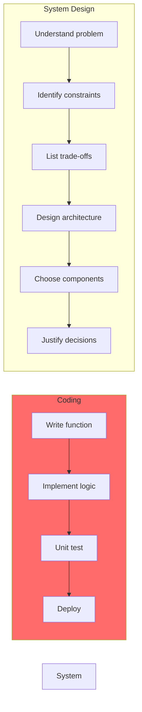

# System Design Là Gì? Hướng Dẫn Toàn Diện Từ Zero Đến Production

Tôi còn nhớ lần đầu tiên được hỏi trong system design interview: *"Thiết kế Twitter."*

Tôi ngồi đó, nhìn whiteboard trắng, và nghĩ: *"Twitter... có database, có API... có cache... rồi sao nữa?"*

5 phút trôi qua trong im lặng.

Interviewer hỏi: *"Em bắt đầu từ đâu?"*

Tôi: *"... Em không biết ạ."*

**Tôi fail interview đó.**

Nhưng thất bại đó dạy tôi một bài học quan trọng: **Coding skills không đủ để become Senior Engineer**. Bạn cần biết System Design.

## System Design Là Gì?

**System Design là nghệ thuật thiết kế hệ thống phần mềm để giải quyết vấn đề thực tế với quy mô lớn.**

Không phải viết code. Không phải implement algorithms. Mà là **thinking about architecture**.

### Định Nghĩa Thực Tế
```
Code Level:
def get_user(user_id):
    return db.query("SELECT * FROM users WHERE id = ?", user_id)

System Design Level:
- Hệ thống cần handle 1 triệu users
- Mỗi user load profile 10 lần/ngày
- = 10 triệu queries/ngày = 115 queries/giây
- Database đơn lẻ có đủ không?
- Cần cache không?
- Cần read replicas không?
- Chi phí infrastructure?
- Team 3 người maintain được không?
```

**System Design = Thinking về toàn bộ hệ thống, không chỉ một function.**

### System Design vs Coding


*Coding focuses on implementation, System Design focuses on architecture decisions*

**Key difference:**
```
Coder nghĩ: "Code này chạy đúng không?"
Architect nghĩ: "Architecture này scale được không? Cost bao nhiêu? 
                 Team maintain được không? Trade-offs là gì?"
```

## Tại Sao Developers Phải Học System Design?

### Lý Do 1: Career Growth

**Reality check:** Senior Engineer positions yêu cầu system design skills.
```
Junior Developer (0-2 năm):
- Implement features
- Fix bugs
- Follow specifications
Salary: $50K-70K

Mid-Level Developer (2-5 năm):
- Design modules
- Code reviews
- Some architecture decisions
Salary: $70K-120K

Senior Engineer (5+ năm):
- Design entire systems
- Make architecture decisions
- Trade-off analysis
- Lead technical direction
Salary: $120K-200K+

Staff/Principal Engineer:
- Design company-wide systems
- Set technical standards
- Architecture reviews
Salary: $200K-400K+
```

**Không biết System Design = Stuck ở Mid-Level forever.**

### Lý Do 2: Interview Requirements

**Tất cả big tech companies test system design:**
```
Google: System design rounds
Facebook/Meta: Architecture interviews
Amazon: System design + leadership
Netflix: Scaling discussions
Uber: Distributed systems design
```

**Không pass system design interview = Không vào được FAANG.**

### Lý Do 3: Real-World Impact

**System design affects everything:**
```
Bad design:
- Website chậm (users rời bỏ)
- System crashes (revenue loss)
- Data loss (disaster)
- High costs (waste budget)
- Hard to maintain (team frustration)

Good design:
- Fast response time (happy users)
- Reliable system (trust)
- Scalable (grow with business)
- Cost-effective (ROI positive)
- Maintainable (team productive)
```

**Ví dụ thực tế:**

Tôi từng thấy một startup với architecture tồi:
- 15 microservices cho 500 users
- $8,000/tháng infrastructure cost
- 6 tháng development
- Team 3 người overwhelmed
- **Company chết vì burn rate quá cao**

Nếu họ biết system design:
- Monolith đơn giản
- $500/tháng cost
- 1 tháng development
- Team productive
- **Focus vào product-market fit thay vì infrastructure**

## System Design Bao Gồm Những Gì?

### 1. Architecture Thinking

**Tư duy về cấu trúc tổng thể:**
```
Questions to ask:
- Monolith hay microservices?
- Sync hay async processing?
- SQL hay NoSQL?
- Cache ở đâu?
- Load balancer như thế nào?
- API design ra sao?
```

**Không phải "what's best practice" mà là "what fits our context".**

### 2. Scalability Planning

**Thiết kế để scale:**
```
Vertical Scaling (scale up):
- 8GB RAM → 32GB RAM
- 4 CPU cores → 16 cores
- Đơn giản nhưng có giới hạn

Horizontal Scaling (scale out):
- 1 server → 10 servers
- Phức tạp nhưng unlimited
- Cần distributed systems knowledge
```

**System design teaches: Khi nào dùng cái gì.**

### 3. Trade-off Analysis

**Mọi quyết định đều có trade-offs:**
```
Cache example:

Add Redis cache:
✅ Gain: Queries nhanh 10x (500ms → 50ms)
❌ Cost: $300/month infrastructure
❌ Cost: Cache invalidation complexity
❌ Cost: Potential stale data

Decision depends on:
- Budget có $300/month không?
- Users care về 450ms improvement không?
- Stale data acceptable không?

→ No universal "right answer"
→ Context determines decision
```

### 4. Distributed Systems Fundamentals

**Khi scale lên, cần hiểu distributed systems:**
```
Challenges:
- Network can fail
- Clocks không synchronized
- Partial failures
- Eventual consistency
- Data replication
- Consensus problems
```

**System design teaches cách handle những challenges này.**

### 5. Real-World Constraints

**Design trong thế giới thực:**
```
Constraints:
- Budget: $2,000/month (không unlimited)
- Team: 3 developers (không phải 100)
- Timeline: 2 tháng launch (không phải 2 năm)
- Expertise: Team biết Python, không biết Rust
- Existing infrastructure: Đã có PostgreSQL

→ Perfect architecture không tồn tại
→ Right architecture cho constraints của bạn
```

## System Design Roadmap: Học Như Thế Nào?

### Phase 0: Mental Model Shift (2 tuần)

**Thay đổi cách tư duy:**
```
From: Code-first thinking
To: Problem-first thinking

From: "What technology to use?"
To: "What problem am I solving?"

From: "Best practices say X"
To: "My constraints require Y"

From: Perfect solution
To: Trade-off awareness
```

**Skills to develop:**
- Problem analysis
- Constraint identification
- Trade-off thinking
- Scale intuition
- System-level view

### Phase 1: Foundation (3-4 tuần)

**Core components của mọi system:**
```
Learn about:
- Client (web/mobile)
- Load Balancer
- API Servers
- Cache (Redis)
- Database (SQL/NoSQL)
- Message Queue
- Object Storage (S3)

Understand:
- Vai trò của từng component
- Khi nào dùng
- Trade-offs
- Interactions
```

### Phase 2: Core Building Blocks (4-5 tuần)

**Deep dive vào từng component:**
```
Load Balancing:
- Algorithms (Round Robin, Least Connections)
- Health checks
- Session persistence

Caching:
- Cache strategies (Cache-Aside, Write-Through)
- Cache invalidation
- TTL vs active invalidation

Database Scaling:
- Vertical vs horizontal
- Read replicas
- Sharding strategies
- Consistency trade-offs

Message Queues:
- Async processing
- Decoupling services
- Retry logic
- Dead letter queues
```

### Phase 3: Distributed Systems (5-6 tuần)

**Advanced concepts:**
```
CAP Theorem:
- Consistency
- Availability
- Partition tolerance
- Cannot have all three

Consistency Models:
- Strong consistency
- Eventual consistency
- When to use which

Distributed Transactions:
- 2-Phase Commit
- Saga pattern
- Compensation logic

Distributed ID Generation:
- Auto-increment breaks
- UUID vs Snowflake
- Ordering guarantees
```

### Phase 4: Scalability & Performance (4-5 tuần)

**Optimization techniques:**
```
Performance:
- Bottleneck identification
- Query optimization
- CDN usage
- Edge computing

Rate Limiting:
- Protect từ overload
- Token bucket algorithm
- Distributed rate limiting

Monitoring:
- Metrics collection
- Alerting
- Observability
- Performance debugging
```

### Phase 5: Real-World Patterns (4-5 tuần)

**Learn từ production systems:**
```
Read-Heavy Systems:
- Caching strategy
- CDN optimization
- Example: Wikipedia, News sites

Write-Heavy Systems:
- Write buffering
- Batch processing
- Example: Analytics, Logging

Social Feed Systems:
- Fanout architecture
- Timeline generation
- Example: Twitter, Instagram

Real-Time Systems:
- WebSocket
- Low latency
- Example: Chat, Gaming
```

### Phase 6: Mastery (ongoing)

**Continuous learning:**
```
Interview Preparation:
- SNAKE framework
- Common questions practice
- Time management

Trade-off Mastery:
- Decision justification
- Architecture defense
- Context awareness

Real System Analysis:
- Study how big companies scale
- Understand their trade-offs
- Apply to your context
```

## Làm Sao Để Bắt Đầu?

### Step 1: Build Mental Models (Tuần 1-2)

**Thay đổi tư duy trước:**
```
Practice:
1. Đọc về Problem-First thinking
2. Analyze trade-offs trong decisions hàng ngày
3. Identify constraints trong projects
4. Estimate scale (back-of-envelope calculations)
5. Think in systems (components + interactions)
```

**Exercise:**
```
Nhìn vào hệ thống bạn đang làm:
- Identify tất cả components
- Vẽ diagram data flow
- Tính requests per second
- Identify bottlenecks
- List constraints (team, budget, time)
```

### Step 2: Learn Components (Tuần 3-6)

**Hiểu building blocks:**
```
Mỗi tuần học một component:

Week 1: Database
- SQL vs NoSQL
- Indexing
- Query optimization
- When to use what

Week 2: Caching
- Redis basics
- Cache patterns
- Invalidation strategies
- Hit rate optimization

Week 3: Load Balancing
- Algorithms
- Health checks
- Session management
- High availability

Week 4: Message Queues
- Async processing
- Queue patterns
- Retry logic
- Dead letters
```

### Step 3: Practice Design (Tuần 7-12)

**Apply knowledge:**
```
Design simple systems:

Week 1: URL Shortener
- Simple but covers basics
- Database design
- Hash generation
- Redirect logic

Week 2: Pastebin
- Storage strategy
- Expiration logic
- View tracking

Week 3: Rate Limiter
- Algorithm choice
- Distributed rate limiting
- Redis implementation

Week 4: Image Upload Service
- S3 integration
- Thumbnail generation
- CDN distribution
```

### Step 4: Study Real Systems (Tuần 13+)

**Learn từ production:**
```
Analyze:
- Twitter architecture (fanout problem)
- Netflix architecture (CDN + encoding)
- Uber architecture (geo-distribution)
- WhatsApp architecture (real-time delivery)

Questions to ask:
- Tại sao họ chọn architecture này?
- Trade-offs là gì?
- Áp dụng được cho project của tôi không?
```

## Common Mistakes Khi Học System Design

### Mistake 1: Học Không Có Cấu Trúc
```
❌ Bad approach:
"Hôm nay đọc về Kafka, mai đọc về Kubernetes,
 ngày kia đọc về microservices..."

→ Knowledge rời rạc
→ Không hiểu big picture
→ Không apply được

✅ Good approach:
"Follow roadmap step-by-step:
 Phase 0 → Mental models
 Phase 1 → Components
 Phase 2 → Deep dive
 ..."

→ Structured learning
→ Build foundation first
→ Progressive complexity
```

### Mistake 2: Chạy Theo Buzzwords
```
❌ Bad:
"Tôi sẽ dùng Kubernetes, Kafka, Cassandra, 
 microservices cho mọi project!"

→ Over-engineering
→ Waste time and money
→ Team overwhelmed

✅ Good:
"Project này có 1,000 users, team 2 người.
 Monolith + PostgreSQL + Redis là đủ.
 Scale later khi cần."

→ Right-sized solution
→ Ship fast
→ Iterate based on data
```

### Mistake 3: Học Lý Thuyết Không Practice
```
❌ Bad:
"Đọc 50 articles về system design.
 Xem 100 YouTube videos.
 Nhưng chưa design system nào."

→ Knowledge không stick
→ Không tự tin trong interview
→ Không apply được thực tế

✅ Good:
"Mỗi tuần design 1 system.
 Vẽ diagram.
 Tính toán capacity.
 Justify decisions.
 Get feedback."

→ Learning by doing
→ Build muscle memory
→ Interview ready
```

### Mistake 4: Ignore Trade-offs
```
❌ Bad:
"Cache là tốt nên luôn luôn dùng cache."

→ Blind following
→ Không hiểu context
→ Bad decisions

✅ Good:
"Cache có trade-offs:
 ✅ Fast reads
 ❌ Complexity
 ❌ Stale data risk
 ❌ Cost
 
 Với context này (read-heavy, budget OK),
 trade-off worth it."

→ Context-aware
→ Justified decisions
→ Professional approach
```

## Tài Nguyên Học System Design

### Courses & Platforms
```
System Design From Zero to Hero:
- Structured roadmap
- Vietnamese content
- Practical approach
- Trade-off focused

Other resources:
- Grokking the System Design Interview
- System Design Primer (GitHub)
- Designing Data-Intensive Applications (book)
```

### Practice Platforms
```
Mock Interviews:
- Pramp (peer practice)
- Interviewing.io
- LeetCode System Design

Real Systems to Study:
- Engineering blogs (Netflix, Uber, Airbnb)
- Architecture decision records
- Open source system diagrams
```

### Communities
```
Join discussions:
- System Design subreddit
- Discord servers
- Tech Twitter
- Engineering blogs comments
```

## Key Takeaways

**System Design là gì:**
```
- Nghệ thuật thiết kế hệ thống scalable
- Thinking về architecture, không chỉ code
- Trade-off analysis
- Real-world constraints
- Distributed systems knowledge
```

**Tại sao quan trọng:**
```
✓ Career growth (Senior+ positions require it)
✓ Interview requirement (FAANG mandatory)
✓ Real-world impact (better systems)
✓ Higher salary (Senior Engineer pay)
✓ Technical leadership (influence decisions)
```

**Cách học hiệu quả:**
```
1. Build mental models first (thinking shift)
2. Learn components systematically (structured)
3. Practice designs regularly (hands-on)
4. Study real systems (learn from best)
5. Get feedback (improve continuously)
```

**Common pitfalls to avoid:**
```
✗ Learn without structure
✗ Chase buzzwords
✗ Theory without practice
✗ Ignore trade-offs
✗ Copy solutions blindly
```

**Remember:**
```
System Design không phải về memorizing patterns
System Design là về thinking process

Junior: Know technologies
Senior: Know when to use which technology
Staff: Know why to use that technology

Develop thinking, not just knowledge
```

## Bước Tiếp Theo

**Bạn đã hiểu System Design là gì. Giờ là lúc hành động.**

**Start với Phase 0:**
1. Đọc về Problem-First Thinking
2. Practice Trade-off Analysis
3. Build Constraint Awareness
4. Develop Scale Intuition
5. Learn System Thinking

**Mỗi ngày 30-60 phút.**

**Sau 2 tuần, bạn sẽ nghĩ khác.**

**Sau 3 tháng, bạn sẽ design được simple systems.**

**Sau 6 tháng, bạn sẽ confident trong interviews.**

**System Design không phải talent. Đó là skill có thể học.**

**Start today. Your Senior Engineer title is waiting.**

---

*Bài viết này là phần của System Design From Zero to Hero - Roadmap đầy đủ từ beginner đến advanced system design thinking.*