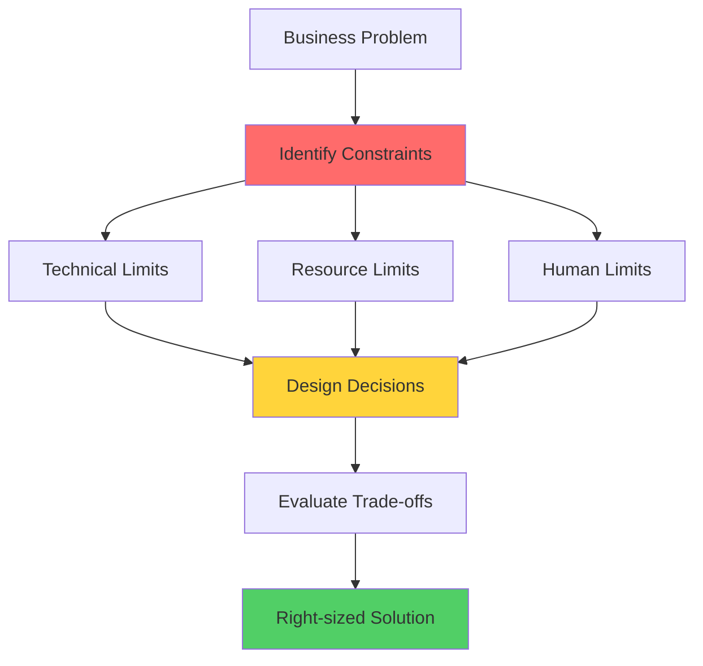

# Thinking in Constraints: Engineering Là Quản Lý Giới Hạn

Tôi còn nhớ lần đầu tiên design một hệ thống "cho 1 triệu users".

Tôi vẽ một architecture diagram đẹp: microservices, Kafka, Kubernetes, distributed cache, auto-scaling...

Senior architect nhìn vào, hỏi một câu đơn giản: *"Em có budget bao nhiêu?"*

Tôi: *"Budget ạ? Em chưa tính..."*

Anh ấy: *"Architecture này cost $15,000/tháng. Budget của em là $2,000/tháng. Em nghĩ sao?"*

**Đó là lúc tôi học bài học quan trọng nhất: Design không phải là vẽ diagram đẹp. Design là làm việc với constraints.**

## Tại Sao Constraints Là Điểm Bắt Đầu?

### The Reality Check
```
Lý thuyết: "Design hệ thống handle được 1 triệu users!"

Thực tế:
- Budget: $2,000/tháng (không phải unlimited)
- Team: 2 developers (không phải 50)
- Timeline: 2 tháng (không phải 2 năm)
- Existing infrastructure: PostgreSQL đã setup
- Expertise: Team chỉ biết Python và SQL

→ Perfect architecture không tồn tại
→ Chỉ có architecture phù hợp với constraints
```

**Key insight:** Constraints không phải là enemy. Constraints là **design parameters**.

### The Framework: System = Constraints + Trade-offs


*System design process: Constraints shape decisions, trade-offs determine solutions*

**Hiểu constraints → Đưa ra decisions đúng → Avoid over-engineering hoặc under-engineering**

## Constraint 1: Compute Limits

**Reality: CPU không vô hạn.**

### The Numbers You Must Know
```
Single CPU core capacity:
- Typical web server: ~1,000 requests/second
- Database queries: ~10,000 simple queries/second
- JSON serialization: ~50,000 objects/second
- Hash computation: ~1,000,000 hashes/second

These numbers vary, but order of magnitude matters!
```

**Example scenario:**
```
Requirement: Handle 10,000 requests/second

Option 1: Single powerful server (32 cores)
- Theoretical capacity: 32,000 req/s
- Cost: $800/month
- Risk: Single point of failure

Option 2: 10 medium servers (4 cores each)
- Capacity: 10 × 4,000 = 40,000 req/s
- Cost: 10 × $200 = $2,000/month
- Benefit: Redundancy, easier to scale

Option 3: Start với 2 servers, scale later
- Current capacity: 2 × 4,000 = 8,000 req/s
- Cost: $400/month
- Reality check: Do you actually have 10K req/s?

Which to choose?
→ Depends on other constraints (budget, growth rate, risk tolerance)
```

### Compute Constraint Examples

**Case 1: Image Processing**
```
Task: Resize 1 million images
Single server: 100 images/second
Time: 1M / 100 = 10,000 seconds = 2.8 hours

Constraint: Must finish trong 30 phút
Calculation: 1M / 1,800s = 556 images/second needed
Solution: 6 servers (6 × 100 = 600 images/s)

Alternative: Optimize algorithm
- Parallel processing: 400 images/s on same hardware
- Need only 2 servers instead of 6
- Trade-off: Development time vs infrastructure cost
```

**Case 2: Real-time Analytics**
```
Requirement: Process 100K events/second

Single-threaded: 10K events/second max
Constraint: Cannot handle load

Options:
1. Scale vertically (bigger machine)
   - 16-core server → 160K events/s
   - Cost: $1,200/month
   
2. Scale horizontally (more machines)
   - 10 × 2-core servers → 200K events/s
   - Cost: 10 × $100 = $1,000/month
   
3. Optimize code + queue buffering
   - Optimize to 50K events/s per core
   - 2-core server handles 100K
   - Cost: $200/month
   - Trade-off: Development time

Constraint-driven decision:
- Budget tight → Option 3
- Time tight → Option 1 or 2
- Long-term → Option 3 then scale to Option 2
```

## Constraint 2: Memory Limits

**Reality: RAM không free và có giới hạn vật lý.**

### Memory Math
```
Typical requirements:

Per user session: ~1KB
1 million users: 1GB RAM

Per cached object: ~10KB
100K objects cached: 1GB RAM

Per database connection: ~10MB
100 connections: 1GB RAM

A 16GB server:
- OS overhead: ~2GB
- Application: ~2GB
- Database connections (100): ~1GB
- Cache: ~10GB available
- User sessions (10M): Need 10GB
→ Fits perfectly or need compression/eviction
```

**Example: Caching Strategy**
```
E-commerce: 1 million products

Full cache:
- Product data: 1KB each
- Total: 1GB RAM
- Cost: Easily fits in single Redis instance ($50/month)
- Benefit: All products cached

Partial cache (hot items):
- 10% products = 90% traffic
- Cache: 100K products = 100MB
- Cost: Included in app server RAM
- Benefit: Free, good enough

Which to choose?
→ Check constraint: Budget? Memory available?
→ If budget OK, full cache = simpler logic
→ If budget tight, partial cache = sufficient
```

### Memory Constraint Decisions

**Case: User Timeline Cache**
```
Social app: 10M users

Option 1: Cache all timelines
- 10M users × 100 posts × 1KB = 1TB RAM
- Cost: $10,000/month (Redis cluster)
- Benefit: Instant timeline loads

Option 2: Cache active users only
- 1M active users × 100 posts × 1KB = 100GB RAM
- Cost: $1,000/month
- Benefit: 90% cache hit rate (good enough)

Option 3: Cache on-demand
- LRU cache, 10GB limit
- Cost: $100/month
- Benefit: Covers hottest data
- Trade-off: Some cache misses

Constraint check:
- 10M users, but only 1M active daily
- Budget: $2,000/month total
→ Option 2 or 3 makes sense
→ Option 1 is over-engineering
```

## Constraint 3: Network Limits

**Reality: Network có latency và bandwidth limits.**

### The Laws of Physics
```
Speed of light: 300,000 km/s
But in fiber optic: 200,000 km/s

New York ↔ San Francisco: 4,000 km
Theoretical minimum latency: 4,000 / 200,000 = 20ms
Real-world: 40-70ms (routing overhead)

→ Cannot beat physics
→ Constraint is fundamental
```

**Latency budget:**
```
User tolerance: 100-200ms for web page load

Budget breakdown:
- DNS lookup: 20ms
- TCP handshake: 20ms
- TLS handshake: 40ms
- Request/Response: 20ms
- Server processing: ???

Already used: 100ms
Remaining for server: 0-100ms

Constraint: Server must respond trong 100ms maximum
```

### Network Constraint Examples

**Case 1: Global Users**
```
App with users worldwide

Without CDN:
- US user → Singapore server: 200ms latency
- Static assets (images, JS, CSS): 5MB
- Load time: 200ms + (5MB / 10Mbps) = 200ms + 4s = 4.2s
- User experience: TERRIBLE

With CDN:
- US user → US CDN edge: 20ms latency
- Static assets cached at edge
- Load time: 20ms + (5MB / 50Mbps) = 20ms + 0.8s = 0.82s
- User experience: GOOD

Cost trade-off:
- Without CDN: $0
- With CDN: $50/month
- Decision: CDN worth it (user experience critical)
```

**Case 2: Database Location**
```
App server in US, database in Europe

Every query:
- US → Europe: 100ms latency
- Query execution: 10ms
- Europe → US: 100ms latency
- Total: 210ms per query

Page needs 10 queries:
- Total: 2,100ms = 2.1 seconds
- Unacceptable!

Solutions:
1. Move database to US
   - Latency: 10ms per query
   - Total: 100ms for 10 queries
   - Trade-off: Data sovereignty issues?

2. Database replication (read replica in US)
   - Reads: 10ms
   - Writes: Still 100ms to primary
   - Trade-off: Eventual consistency

3. Caching layer
   - Cache hit: 1ms
   - Cache miss: 210ms
   - Trade-off: Stale data possible

Constraint-driven:
- Latency requirement: < 200ms → Need solution
- Data must stay in Europe → Option 2 or 3
- Strong consistency needed → Option 2
```

## Constraint 4: Database Limits

**Reality: Databases có throughput và storage limits.**

### Database Capacity
```
Typical PostgreSQL limits:

Write capacity:
- Single server: ~10,000 writes/second
- With SSDs: ~50,000 writes/second
- Batched writes: ~100,000 writes/second

Read capacity:
- Simple queries: ~100,000 reads/second
- Complex queries: ~1,000 reads/second
- With indexes: 10x improvement

Storage:
- Practical limit: ~10TB per server
- Above that: Consider sharding

Connections:
- Max connections: ~500
- Practical: ~200 active connections
```

**Example: Write-Heavy Application**
```
Logging system: 50,000 writes/second

Single PostgreSQL:
- Max: 10,000 writes/second
- Constraint: Cannot handle load

Options:
1. Batch writes
   - Buffer 100 writes, insert together
   - Effective: 100,000 writes/second
   - Trade-off: Slight delay (acceptable for logs)

2. Use write-optimized DB (Cassandra)
   - Capacity: 1,000,000 writes/second
   - Trade-off: Different query model, team learning curve

3. Queue + background workers
   - Accept writes to queue (instant)
   - Workers write to DB (controlled rate)
   - Trade-off: Eventual persistence

Constraint check:
- Team knows PostgreSQL well
- Logs can be delayed 1-2 seconds
→ Option 1 (batching) is best fit
→ Simple, uses existing knowledge, meets requirements
```

## Constraint 5: Human Limits (Team Size)

**The most overlooked constraint: Your team's capacity.**

### Team Size Reality
```
Team size: 2 developers

Can maintain:
- Monolith: ✅ Easy
- 3-5 microservices: ⚠️ Challenging
- 10+ microservices: ❌ Impossible
- Kubernetes: ❌ Too complex
- Simple deployment: ✅ Essential

Why?
- Each service needs: deployment, monitoring, debugging
- 10 services = 10× operational overhead
- 2 developers cannot handle 10 services well
```

### The Team Constraint Framework
```
Team size 1-3:
✓ Monolith
✓ Simple stack (what team knows)
✓ Managed services (reduce ops)
✗ Microservices
✗ Complex infrastructure
✗ New technologies

Team size 5-10:
✓ Modular monolith
✓ Simple microservices (2-3 services)
✓ Mix of new + familiar tech
⚠️ Full microservices (risky)

Team size 20+:
✓ Microservices
✓ Multiple tech stacks
✓ Dedicated ops team
✓ Complex infrastructure
```

**Real example:**
```
Startup: 3 developers

Option A: Microservices architecture
- 8 services
- Kubernetes deployment
- Service mesh
- Distributed tracing
Development time: 6 months
Maintenance: 2 developers full-time just for ops
Feature development: SLOW

Option B: Well-structured monolith
- Single codebase, clear modules
- Heroku deployment
- Simple monitoring
Development time: 6 weeks
Maintenance: 0.5 developer for ops
Feature development: FAST

Constraint reality:
- 3 developers cannot maintain 8 services
- Speed to market is critical for startup
→ Option B is only viable choice
```

## The Constraints Checklist

**Before designing any system, ask:**
```
Technical Constraints:
☐ CPU capacity needed? (requests/second)
☐ Memory available? (cache size, session storage)
☐ Network latency acceptable? (user location, server location)
☐ Database throughput sufficient? (writes/reads per second)
☐ Storage capacity? (data size now and 2 years later)

Resource Constraints:
☐ Budget? ($X/month for infrastructure)
☐ Timeline? (X weeks to launch)
☐ Cost of failure? (can afford downtime?)

Human Constraints:
☐ Team size? (X developers)
☐ Team expertise? (know Y, need to learn Z?)
☐ Operational capacity? (who maintains system?)
☐ On-call burden? (24/7 monitoring possible?)

Growth Constraints:
☐ Current scale? (X users, Y requests/day)
☐ Expected growth? (2x/year or 10x/year?)
☐ Peak vs average load? (traffic patterns?)
```

## Constraint-Driven Design Process

**Step-by-step framework:**
```
1. Identify ALL constraints
   - Technical limits
   - Resource limits (budget, time)
   - Human limits (team, expertise)

2. Prioritize constraints
   - Which are hard limits? (cannot violate)
   - Which are soft limits? (can negotiate)

3. Design within constraints
   - Start simple
   - Add complexity only when constraint requires

4. Validate against constraints
   - Does solution fit budget?
   - Can team maintain it?
   - Does it meet performance requirements?

5. Document constraint decisions
   - Why chose X over Y?
   - Which constraints influenced decision?
```

**Example application:**
```
Requirement: Build analytics dashboard

Constraints identified:
- Budget: $500/month (hard limit)
- Team: 1 developer (hard limit)
- Data: 100GB (current), growing 10GB/month
- Queries: Complex aggregations
- Users: 50 internal users
- Timeline: 2 weeks to MVP

Constraint-driven decisions:

Database choice:
- PostgreSQL ✓
  - Handles 100GB easily
  - Team knows SQL
  - Complex queries: native support
  - Cost: $50/month managed instance
  
- Cassandra ✗
  - Overkill for 100GB
  - Team doesn't know it
  - Complex aggregations: difficult
  - More expensive

Deployment:
- Heroku ✓
  - Simple, managed
  - $200/month (within budget)
  - 1 developer can handle
  
- Kubernetes ✗
  - Complex setup
  - Requires dedicated ops
  - Over budget for managed

Caching:
- Skip for MVP ✓
  - 50 users = low traffic
  - Can add later if slow
  - Save development time

Result:
- Total cost: $250/month (under budget)
- Development: 2 weeks (met timeline)
- Maintenance: Minimal (team can handle)
- Performance: Good enough for current scale
```

## Common Mistakes: Ignoring Constraints

**Mistake 1: Designing for imaginary scale**
```
❌ Bad:
"We might have 10 million users someday, so let's use Kubernetes now."

Reality:
- Current: 100 users
- Timeline: 6 months to prove product-market fit
- Budget: $2,000/month

✅ Good:
"Start with Heroku. If we reach 100K users (success!), 
we'll have revenue to afford Kubernetes migration.
Don't optimize for problems we don't have."
```

**Mistake 2: Ignoring team constraints**
```
❌ Bad:
"Let's use Rust for maximum performance!"

Reality:
- Team knows Python
- Performance requirement: 1,000 req/s
- Python easily handles 1,000 req/s

✅ Good:
"Use Python. Team productive immediately.
Rust would take 3 months learning curve.
Performance constraint not violated."
```

**Mistake 3: Unlimited budget assumption**
```
❌ Bad:
"We'll use managed Kubernetes, managed database, managed cache,
managed everything!"

Cost: $8,000/month

Reality:
- Budget: $2,000/month
- Violates hard constraint

✅ Good:
"Use Heroku ($200), managed PostgreSQL ($50), 
and app-level caching (free).
Total: $250/month. Fits budget."
```

## Key Takeaways

**Engineering = Quản lý constraints**
```
Not: "What's the best architecture?"
But: "What architecture fits my constraints?"
```

**The 5 constraint categories:**
```
1. Compute: CPU capacity limits
2. Memory: RAM availability limits  
3. Network: Latency and bandwidth limits
4. Database: Throughput and storage limits
5. Human: Team size and expertise limits
```

**The framework:**
```
System Design = Constraints + Trade-offs

Constraints → Define what's possible
Trade-offs → Choose among possibilities
Right fit → Solution that respects constraints
```

**Design process:**
```
1. Identify constraints (all of them!)
2. Prioritize (hard vs soft limits)
3. Design within constraints
4. Validate solution fits
5. Document decisions
```

**Remember:**
```
Perfect architecture ignoring constraints = Useless
Good-enough architecture respecting constraints = Shippable

Constraints are not enemies
Constraints are design parameters

Work WITH constraints, not AGAINST them
```

**Mental shift needed:**
```
From: "How to build perfect system?"
To: "How to build right system given my constraints?"

From: "Best practices say X"
To: "My constraints require Y"

From: "Future-proof everything"
To: "Solve today's constraints, adapt tomorrow"
```

Bạn đã học Problem-First thinking (Lesson 1) và Trade-off thinking (Lesson 2).

Giờ với Constraint thinking (Lesson 3), bạn có complete mental model:

**Problem → Constraints → Trade-offs → Solution**

Đây là cách Senior Architects thực sự suy nghĩ.
