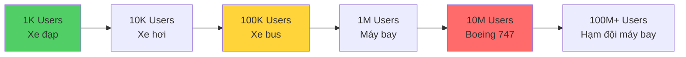
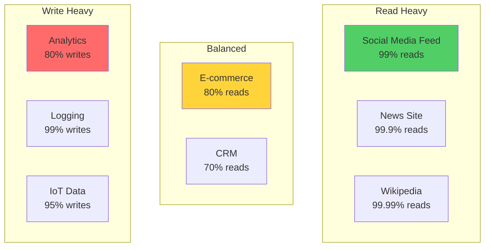

# Scale Intuition: Xây Dựng Cảm Giác Về Numbers

Tôi còn nhớ lần đầu tiên được hỏi trong interview:

*"Hệ thống của em cần handle bao nhiêu requests per second?"*

Tôi: *"Uhm... nhiều ạ?"*

Interviewer: *"Nhiều là bao nhiêu? 10? 1,000? 1,000,000?"*

Tôi: *"... Em không biết ạ."*

**Tôi fail câu hỏi đó.**

Không phải vì không biết code. Mà vì **không có scale intuition**.

Senior architect ngồi bên cạnh sau đó nói: *"Em biết không, difference giữa 1K users và 1M users không phải là 1000 lần. Nó là difference giữa một chiếc xe đạp và một chiếc Boeing 747."*

Đó là lúc tôi bắt đầu học về scale.

## Tại Sao Scale Intuition Quan Trọng?

### The Problem: Numbers Are Abstract

Khi bạn nghe "1 million users", bạn nghĩ gì?

Hầu hết developers: *"Ồ, nhiều quá!"*

Nhưng "nhiều" không giúp bạn design system.

**Bạn cần biết:**
- 1 million users = bao nhiêu requests/second?
- Cần bao nhiêu servers?
- Bao nhiêu database capacity?
- Bao nhiêu storage?
- Bao nhiêu cost?

### The Solution: Develop Intuition

**Scale intuition = Ability to quickly estimate system requirements**
```
Skill: "Ước chừng 1 million users cần 10 app servers, 2TB storage, cost ~$3K/tháng"

Not: "1 million users... cần nhiều servers... uhm..."

Có intuition → Design với confidence
Không có intuition → Design bằng guessing
```

**Bài này sẽ dạy bạn build intuition đó.**

## The Scale Spectrum: 1K vs 1M vs 1B Users

### Visualizing the Difference


*Mỗi bậc scale là một thế giới hoàn toàn khác nhau*

### 1,000 Users (Startup MVP)
```
Daily Active Users (DAU): ~500
Concurrent users: ~50
Requests per second: ~5-10

Infrastructure:
- 1 application server ($50/month)
- 1 database server ($50/month)
- No load balancer needed
- No caching needed
Total cost: ~$100/month

Bottleneck: Probably none
Architecture: Simple monolith
Team: 1-2 developers can handle
```

**Real example:**
```
Local coffee shop app:
- 500 customers
- Each checks menu 2 times/day
- 1,000 requests/day
- 1,000 / 86,400 seconds ≈ 0.01 requests/second

Can run on Raspberry Pi! 😄
```

### 10,000 Users (Growing Startup)
```
Daily Active Users: ~5,000
Concurrent users: ~500
Requests per second: ~50-100

Infrastructure:
- 2-3 application servers ($150/month)
- 1 database server ($100/month)
- Load balancer ($50/month)
- Redis cache optional ($50/month)
Total cost: ~$350/month

Bottleneck: Database queries (add indexes)
Architecture: Monolith + cache
Team: 2-5 developers
```

**Key difference từ 1K:**
- Cần load balancer (high availability)
- Database indexes matter
- Monitoring starts to be important

### 100,000 Users (Established Product)
```
Daily Active Users: ~50,000
Concurrent users: ~5,000
Requests per second: ~500-1,000

Infrastructure:
- 10 application servers ($500/month)
- Database với read replicas ($500/month)
- Load balancer ($100/month)
- Redis cluster ($300/month)
- CDN ($100/month)
Total cost: ~$1,500/month

Bottleneck: Database writes, cache invalidation
Architecture: Modular monolith hoặc simple microservices
Team: 10-20 developers
```

**Key difference từ 10K:**
- Database read replicas necessary
- Caching is critical
- CDN for static assets
- Auto-scaling starts to matter

### 1,000,000 Users (Large Scale)
```
Daily Active Users: ~500,000
Concurrent users: ~50,000
Requests per second: ~5,000-10,000

Infrastructure:
- 50+ application servers ($2,500/month)
- Sharded database cluster ($2,000/month)
- Multiple load balancers ($300/month)
- Distributed cache ($1,000/month)
- CDN ($500/month)
- Message queues ($200/month)
Total cost: ~$6,500/month+

Bottleneck: Everything! Need distributed approach
Architecture: Microservices likely
Team: 50+ developers, dedicated ops team
```

**Key difference từ 100K:**
- Database sharding needed
- Distributed systems challenges
- Dedicated DevOps/SRE team
- Complex monitoring and alerting

### The Pattern
```
Mỗi 10x scale:
- Cost tăng ~3-5x (not linear!)
- Complexity tăng significantly
- Team size tăng
- Architecture thay đổi fundamentally

1K → 10K: Add servers, basic optimization
10K → 100K: Add caching, read replicas
100K → 1M: Sharding, microservices, distributed systems
1M → 10M: Geographic distribution, edge computing
```

## Back-of-Envelope Calculations

**Core skill: Quickly estimate system requirements**

### Calculation Framework
```
1. Start với users
2. Estimate usage patterns
3. Calculate requests
4. Estimate storage
5. Calculate bandwidth
```

### Exercise 1: E-commerce Website

**Given:**
- 1 million registered users
- 20% active daily (200K DAU)
- Each user views 10 product pages/day
- Each user makes 1 purchase/month

**Calculate:**

**Requests per second:**
```
Page views:
200K users × 10 pages/day = 2M page views/day
2M / 86,400 seconds/day ≈ 23 requests/second

Peak traffic (assume 3x average):
23 × 3 = 69 requests/second

API calls (assume 5 API calls per page view):
23 × 5 = 115 requests/second
Peak: 345 requests/second

→ Need to handle ~350 req/s at peak
```

**Storage:**
```
Product catalog:
100K products × 10KB each = 1GB

Product images:
100K products × 5 images × 500KB = 250GB

User data:
1M users × 1KB = 1GB

Orders (1 year):
1M users × 12 purchases/year × 5KB = 60GB

Total: ~312GB
→ Single database can handle easily
→ Images need CDN/S3
```

**Bandwidth:**
```
Page views: 2M/day
Average page size: 2MB (HTML + images + JS)

Total bandwidth: 2M × 2MB = 4TB/day

With CDN cache (90% cache hit rate):
4TB × 0.1 = 400GB/day from origin
= 16GB/hour from servers
= Manageable with CDN
```

**Infrastructure estimate:**
```
Application servers:
- 350 req/s peak
- Each server: ~100 req/s
- Need: 4 servers (with buffer)

Database:
- 312GB data (single server OK)
- Read-heavy (add 2 read replicas)

CDN: Essential (90% traffic)

Total cost: ~$800/month
```

### Exercise 2: Social Media App

**Given:**
- 10 million users
- 1 million daily active users
- Each user posts 2 times/day
- Each user views 100 posts/day

**Calculate:**

**Write traffic:**
```
Posts created:
1M users × 2 posts/day = 2M posts/day
2M / 86,400 ≈ 23 writes/second

Peak: 69 writes/second
→ Single database can handle
```

**Read traffic:**
```
Posts viewed:
1M users × 100 posts/day = 100M views/day
100M / 86,400 ≈ 1,157 reads/second

Peak: 3,471 reads/second
→ Need caching!
```

**Storage growth:**
```
Posts per day: 2M
Post size: 500 bytes (text + metadata)
Daily storage: 2M × 500 bytes = 1GB/day

Photos (50% of posts have 1 photo):
1M photos/day × 2MB = 2TB/day

Annual growth:
Text: 1GB × 365 = 365GB
Photos: 2TB × 365 = 730TB

→ Need distributed storage (S3)
→ Database: Shard after 1-2 years
```

**Read:Write ratio:**
```
Reads: 1,157/s
Writes: 23/s
Ratio: 50:1

→ Heavy read optimization needed
→ Aggressive caching strategy
→ CDN for media
```

## Requests Per Second (RPS) Intuition

### What Different RPS Means
```
1-10 RPS:
- Small internal tool
- Single server sufficient
- No special optimization

10-100 RPS:
- Small web app
- 1-2 servers
- Basic caching helps

100-1,000 RPS:
- Medium web app
- 5-10 servers
- Caching essential
- Database optimization matters

1,000-10,000 RPS:
- Large web app
- 20-50 servers
- Distributed cache
- Database read replicas
- Load balancing critical

10,000-100,000 RPS:
- Very large scale
- 100+ servers
- Database sharding
- Geographic distribution
- CDN mandatory

100,000+ RPS:
- Massive scale (Google, Facebook level)
- Thousands of servers
- Custom infrastructure
- Edge computing
- Advanced optimization everywhere
```

### Server Capacity Rule of Thumb
```
Typical web server:
- Simple queries: ~1,000 req/s
- Medium complexity: ~500 req/s
- Complex logic: ~100 req/s

Database:
- Simple reads: ~10,000 req/s
- Simple writes: ~5,000 req/s
- Complex queries: ~100 req/s
- Transactions: ~1,000 req/s

Cache (Redis):
- Reads: ~100,000 req/s per node
- Writes: ~50,000 req/s per node
```

**Use these to estimate:**
```
Need 5,000 req/s with medium complexity?
5,000 / 500 = 10 servers minimum
Add 50% buffer: 15 servers

Database can't keep up?
Use caching to reduce DB load by 90%
5,000 × 0.1 = 500 req/s to DB → Single DB OK
```

## Storage Growth Intuition

### Storage Math
```
Common data sizes:

User record: ~1KB
- username, email, hashed password, metadata

Tweet/Post: ~500 bytes
- text content, user_id, timestamp, metadata

Photo (compressed): ~2MB
- JPEG, optimized for web

Video (1 min, 720p): ~50MB
- H.264 compression

Log entry: ~200 bytes
- timestamp, level, message
```

### Growth Calculation Example

**Scenario: Photo sharing app**
```
Users: 1 million
Active daily: 200K
Photos uploaded per active user: 2

Daily uploads:
200K × 2 = 400K photos/day

Daily storage:
400K × 2MB = 800GB/day

Monthly: 800GB × 30 = 24TB/month
Yearly: 24TB × 12 = 288TB/year

Cost (AWS S3):
$0.023/GB/month
288TB = 288,000GB
Cost: 288,000 × $0.023 = $6,624/month

→ Significant! Need compression, CDN, storage tiers
```

**Optimization strategies:**
```
Original calculation: 288TB/year

With optimization:
1. Aggressive compression: -30% = 200TB
2. Delete old/unused photos: -20% = 160TB
3. Use storage tiers (cold storage): -40% cost
4. Total: 160TB at $0.014/GB = $2,240/month

Savings: $4,384/month (66% reduction!)
```

## Read vs Write Heavy Patterns

### Pattern Recognition


*Khác pattern cần khác optimization strategy*

### Read-Heavy Systems (90%+ reads)
```
Examples: Social media, news, blogs, documentation

Characteristics:
- Many users viewing same content
- Content doesn't change often
- Cache hit rate very high

Optimization strategy:
✓ Aggressive caching (Redis, Memcached)
✓ CDN for static content
✓ Database read replicas
✓ Eventual consistency OK
✗ Don't optimize writes (not bottleneck)

Infrastructure focus:
- Cache layer (most important)
- CDN (for media)
- Multiple read replicas

Example: Reddit
- 1 post → 10,000 views
- Cache post for 5 minutes
- 99.99% cache hit rate
- Database load minimal
```

### Write-Heavy Systems (50%+ writes)
```
Examples: Analytics, logging, IoT sensors, financial trading

Characteristics:
- Constant data ingestion
- Reads less frequent
- Data often time-series

Optimization strategy:
✓ Write-optimized database (Cassandra, time-series DB)
✓ Async writes (queue buffering)
✓ Batch processing
✓ Sharding/partitioning
✗ Caching less effective

Infrastructure focus:
- Write throughput (database)
- Message queues (buffer)
- Batch processing

Example: Monitoring system
- 10K servers × 100 metrics/minute
- 1M writes/minute = 16K/second
- Reads: Once/day for dashboards
- Optimize for write throughput
```

### Balanced Systems (50-80% reads)
```
Examples: E-commerce, CRM, productivity tools

Characteristics:
- Mix of reading and writing
- Need to optimize both
- More complex trade-offs

Optimization strategy:
✓ Selective caching (hot data only)
✓ Database optimization (indexes)
✓ Read replicas for reports
✓ Write optimization for transactions

Infrastructure focus:
- Balanced approach
- Cache hot paths
- Optimize critical queries
```

## Bottleneck Mindset

**Core principle: System is only as fast as its slowest part**

### The Bottleneck Chain
```
Request flow:
Client → (Network 50ms)
      → Load Balancer (5ms)
      → App Server (20ms)
      → Database Query (500ms) ← BOTTLENECK
      → App Server (10ms)
      → Client (50ms)

Total: 635ms
Bottleneck: Database (79% of time)

Optimization priority:
1. Database (biggest impact)
2. Network (if can't fix DB)
3. App logic (minimal impact)

Don't waste time optimizing app server from 20ms → 10ms
when database takes 500ms!
```

### Identifying Bottlenecks
```
Ask these questions:

1. What takes the most time?
   - Measure each component
   - Find the slowest

2. What has the highest load?
   - CPU usage
   - Memory usage
   - Network saturation
   - Disk I/O

3. What fails first under load?
   - Database connections maxed?
   - Server memory full?
   - Network bandwidth saturated?

The bottleneck is where you hit limits first.
```

### Common Bottlenecks by Scale
```
1K users:
- Bottleneck: Usually none
- If any: Inefficient queries

10K users:
- Bottleneck: Database queries
- Fix: Add indexes, caching

100K users:
- Bottleneck: Database writes
- Fix: Read replicas, optimization

1M users:
- Bottleneck: Database capacity
- Fix: Sharding, distributed cache

10M+ users:
- Bottleneck: Everything
- Fix: Distributed architecture, CDN, edge computing
```

## Practice Exercises

### Exercise 1: Estimate YouTube-like Service
```
Given:
- 1 billion users
- 100 million daily active users
- Each user watches 10 videos/day (average 5 min each)
- 1% of users upload 1 video/day

Calculate:
1. Video views per second
2. Upload bandwidth needed
3. Storage growth per day
4. Approximate infrastructure cost

Try it yourself first!
```

**Answer:**
```
1. Video views per second:
   100M users × 10 videos/day = 1B views/day
   1B / 86,400 seconds ≈ 11,574 views/second

2. Upload bandwidth:
   1M uploads/day (1% of 100M)
   Average video: 5 min × 10MB/min = 50MB
   50MB × 1M = 50TB/day upload bandwidth
   50TB / 86,400s ≈ 580 MB/second upload

3. Storage growth:
   1M videos/day × 50MB = 50TB/day raw
   Multiple resolutions (360p, 720p, 1080p): ×3
   = 150TB/day
   = 4.5PB/month
   
4. Infrastructure cost (rough):
   Storage: 4.5PB × $0.02/GB = $90,000/month
   CDN: 1B views × 50MB = 50PB delivery
   CDN cost: ~$500,000/month
   Compute: ~$200,000/month
   Total: ~$800,000/month minimum
```

### Exercise 2: Estimate Messaging App
```
Given:
- 500 million users
- 200 million daily active
- Each user sends 50 messages/day
- Each user receives 50 messages/day

Calculate:
1. Messages per second
2. Storage per day
3. Database writes per second
4. Real-time delivery challenge

Your turn!
```

**Answer:**
```
1. Messages per second:
   200M users × 50 messages = 10B messages/day
   10B / 86,400 ≈ 115,740 messages/second

2. Storage per day:
   10B messages × 100 bytes = 1TB/day
   (text messages are small)

3. Database writes:
   115,740 writes/second
   → Need distributed database or write buffering
   
4. Real-time delivery:
   115,740 messages/s to deliver
   Each needs WebSocket push
   → Need efficient pub/sub system
   → Message queues essential
```

## Building Your Intuition: Practice Guide

**How to develop scale intuition:**

### Step 1: Memorize Key Numbers
```
Must know:
- 1 million seconds ≈ 12 days
- 1 billion seconds ≈ 32 years
- 1KB = 1,000 bytes
- 1MB = 1,000KB = 1 million bytes
- 1GB = 1,000MB = 1 billion bytes
- 1TB = 1,000GB

Typical server:
- 1,000 requests/second
- 16GB RAM
- 1TB storage

Typical costs:
- Server: $50-500/month
- Database: $50-1,000/month
- CDN: $10-1,000/month
- Storage: $0.02/GB/month
```

### Step 2: Practice Daily Estimation
```
Every day, estimate:

Monday: "Instagram has 500M DAU. How many photos uploaded/day?"
Tuesday: "Twitter handles X tweets/second?"
Wednesday: "Netflix bandwidth per second?"
Thursday: "Google searches per second?"
Friday: "Facebook storage growth per day?"

Practice makes perfect!
```

### Step 3: Verify Your Estimates
```
After estimating, research actual numbers:
- Instagram: 95M photos/day
- Twitter: 6,000 tweets/second
- Netflix: 200Gbps peak bandwidth
- Google: 40,000 searches/second

Compare với your estimates
Calibrate your intuition
```

## Key Takeaways

**Scale intuition = Quickly estimate system requirements**
```
Critical skill for:
- System design interviews
- Architecture planning
- Capacity planning
- Cost estimation
```

**The scale spectrum:**
```
1K users: Bicycle (simple)
10K users: Car (add structure)
100K users: Bus (need optimization)
1M users: Airplane (distributed systems)
10M+ users: Fleet of airplanes (complex infrastructure)

Each 10x = fundamentally different architecture
```

**Back-of-envelope calculations:**
```
Framework:
1. Users → Activity → Requests
2. Requests → Server capacity
3. Data → Storage → Cost
4. Identify bottlenecks

Practice until automatic!
```

**Read vs Write patterns:**
```
Read-heavy (90%+):
→ Caching is king
→ CDN essential
→ Read replicas

Write-heavy (50%+):
→ Write optimization
→ Queue buffering
→ Specialized databases

Know your pattern → Know your strategy
```

**Bottleneck mindset:**
```
System speed = Slowest component speed

Always ask:
- What's the bottleneck?
- What hits limits first?
- What to optimize first?

Optimize bottleneck, not everything!
```

**Building intuition:**
```
1. Memorize key numbers
2. Practice daily estimates
3. Verify with real data
4. Calibrate and improve

After 100 estimates, you'll have strong intuition
```

**Remember:**
```
Intuition không đến từ theory
Intuition đến từ practice

Làm calculations mỗi ngày
Sau 1 tháng, bạn sẽ "cảm" được scale
```
