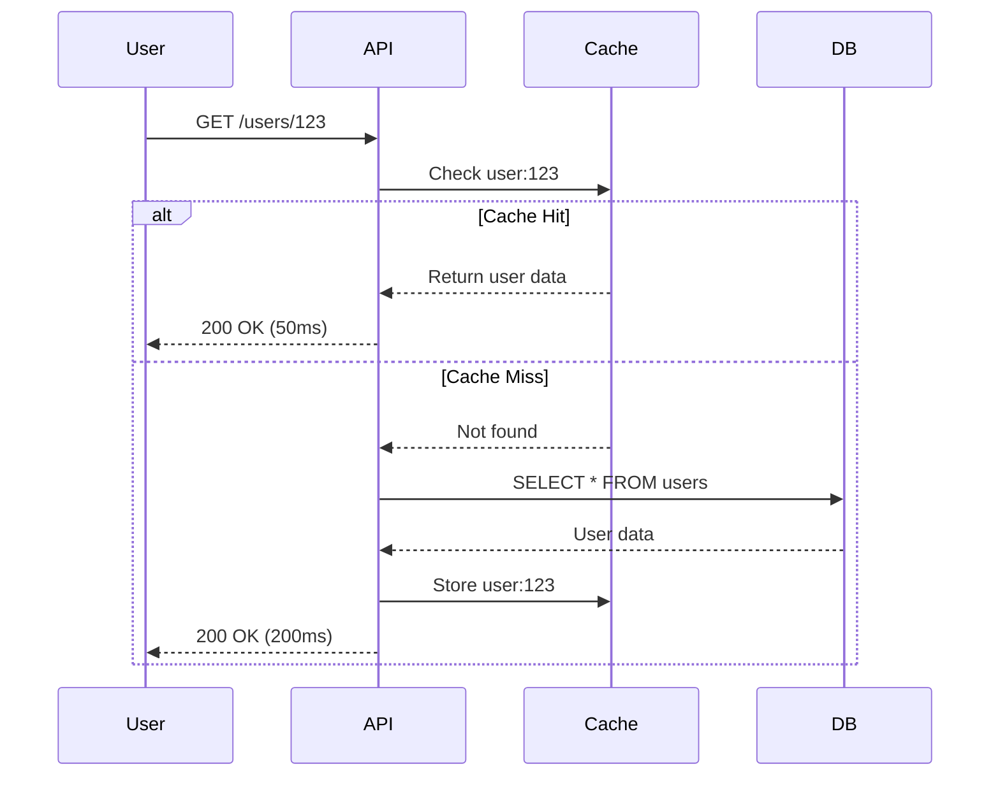
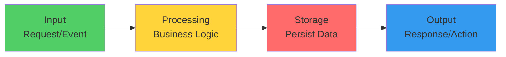
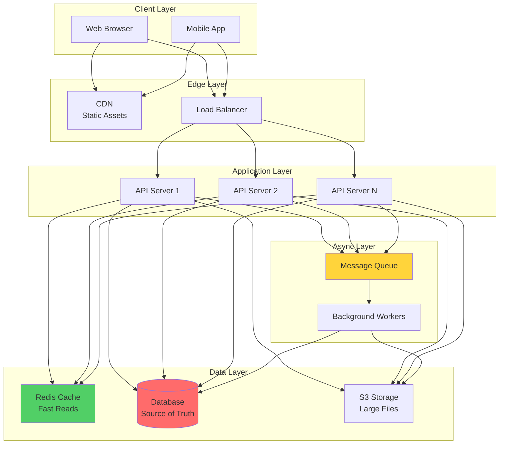

# System Thinking Framework: Nhìn Hệ Thống Như Một Tổng Thể

Tôi còn nhớ lần đầu tiên nhìn vào codebase của một hệ thống lớn.

Hàng trăm files. Chục microservices. Database, cache, queues, APIs...

Tôi hỏi senior: *"Làm sao anh hiểu được hết những cái này?"*

Anh ấy cười: *"Em không cần hiểu từng dòng code. Em cần hiểu hệ thống như một **tổng thể**."*

Tôi: *"Nghĩa là sao ạ?"*

Anh ấy vẽ một diagram đơn giản:
```
User → API → Cache → Database
              ↓
            Queue → Worker
```

*"Đây là cả hệ thống. Data flow từ User, qua API, check Cache, query Database, async jobs vào Queue. Hiểu flow này quan trọng hơn hiểu từng function."*

**Đó là lần đầu tiên tôi học về System Thinking.**

## Tại Sao Phải Think in Systems?

### The Problem: Thinking in Code

Hầu hết developers think như này:
```python
# Code-level thinking
def get_user(user_id):
    user = cache.get(user_id)
    if not user:
        user = db.query("SELECT * FROM users WHERE id = ?", user_id)
        cache.set(user_id, user)
    return user
```

Bạn thấy: function, cache logic, database query.

**Nhưng bạn không thấy:**
- Request flow từ đâu đến?
- Response đi về đâu?
- Cache fail thì sao?
- Database slow thì sao?
- Scale như thế nào?

### The Solution: System-Level View

System thinking nhìn như này:


*System view: Thấy được flow, interactions, và failure scenarios*

**Thấy sự khác biệt chưa?**

System thinking giúp bạn:
- Hiểu data flow
- Spot bottlenecks
- Design for failure
- Scale intelligently
- Debug production issues

## The Universal System Pattern

**Mọi system đều follow một pattern cơ bản:**
```
Input → Processing → Storage → Output
```


*Universal pattern: Mọi system đều nhận input, xử lý, lưu trữ, và trả output*

### Examples of This Pattern

**Web Application:**
```
Input: User clicks "Submit Order"
Processing: Validate, calculate total, check inventory
Storage: Save order to database
Output: Show confirmation page
```

**Messaging System:**
```
Input: User sends message
Processing: Encrypt, route to recipient
Storage: Store in message queue
Output: Deliver to recipient's device
```

**Analytics Pipeline:**
```
Input: Events from applications
Processing: Aggregate, transform data
Storage: Write to data warehouse
Output: Update dashboards
```

**Video Platform:**
```
Input: User uploads video
Processing: Encode to multiple formats
Storage: Save to object storage (S3)
Output: Video available for streaming
```

**Key insight:** Hiểu pattern này → Hiểu mọi system.

## Core System Components

**Mọi web system đều có 6 components cơ bản:**

### Component 1: Client (Input Layer)

**Vai trò:** Initiate requests, receive responses
```
Types:
- Web browser (JavaScript)
- Mobile app (iOS/Android)
- Desktop app
- Other services (API clients)

Characteristics:
- Không đáng tin cậy (user có thể modify)
- Không kiểm soát được (network, device)
- Stateful (có local state)

Key principle: NEVER trust client input
```

**Example flow:**
```
User action:
1. User clicks "Login"
2. Browser sends POST /login with credentials
3. Waits for response
4. Renders result

What can go wrong:
- User modifies request (change user_id)
- Network timeout
- Slow response
- Device crashes

System must handle all these!
```

### Component 2: API (Processing Layer)

**Vai trò:** Handle requests, execute business logic, orchestrate data flow
```
Responsibilities:
- Validate input (client không tin cậy!)
- Execute business rules
- Coordinate between services
- Format response
- Handle errors

Characteristics:
- Stateless (nên là stateless!)
- Horizontally scalable
- Contains business logic

Technology examples:
- REST API (Express, FastAPI, Spring)
- GraphQL API
- gRPC services
```

**Example:**
```python
# API Server handles request
@app.post("/orders")
def create_order(order_data):
    # 1. Validate (client không tin cậy)
    if not validate_order(order_data):
        return 400, {"error": "Invalid order"}
    
    # 2. Business logic
    total = calculate_total(order_data)
    
    # 3. Check inventory
    if not check_inventory(order_data.items):
        return 400, {"error": "Out of stock"}
    
    # 4. Save to database
    order = db.create_order(order_data, total)
    
    # 5. Async processing (queue)
    queue.publish("order.created", order.id)
    
    # 6. Return response
    return 201, {"order_id": order.id}
```

### Component 3: Database (Storage Layer)

**Vai trò:** Persist data reliably
```
Types:
- Relational (PostgreSQL, MySQL)
  → Structured data, transactions
  
- NoSQL (MongoDB, Cassandra)
  → Flexible schema, horizontal scale
  
- Time-series (InfluxDB, TimescaleDB)
  → Metrics, logs, events

Characteristics:
- ACID properties (SQL) or eventual consistency (NoSQL)
- Slower than memory (disk I/O)
- Usually the bottleneck
- Data must survive crashes

Key principle: Source of truth
```

**When to use what:**
```
SQL (PostgreSQL):
✓ Need transactions
✓ Complex relationships
✓ Data integrity critical
Example: E-commerce, banking

NoSQL (MongoDB):
✓ Flexible schema
✓ Horizontal scaling
✓ Simple queries
Example: User profiles, content

Time-series (InfluxDB):
✓ Metrics/monitoring
✓ IoT sensor data
✓ Time-based queries
Example: Observability, analytics
```

### Component 4: Cache (Performance Layer)

**Vai trò:** Store frequently accessed data in memory
```
Why cache?
- Memory: 100 nanoseconds
- SSD: 150 microseconds (1,500x slower)
- HDD: 10 milliseconds (100,000x slower)

→ Cache = Speed up reads dramatically

Common implementations:
- Redis (most popular)
- Memcached (simple key-value)
- Application-level (in-process)

Characteristics:
- Volatile (data can be lost)
- Limited capacity (expensive RAM)
- Stale data possible
- Cache invalidation is hard

Key principle: Cache is optimization, not source of truth
```

**Cache patterns:**
```python
# Pattern 1: Cache-Aside (Lazy Loading)
def get_user(user_id):
    # Check cache first
    user = cache.get(f"user:{user_id}")
    if user:
        return user  # Cache hit
    
    # Cache miss → Query database
    user = db.query("SELECT * FROM users WHERE id = ?", user_id)
    
    # Store in cache for next time
    cache.set(f"user:{user_id}", user, ttl=3600)
    return user

# Pattern 2: Write-Through
def update_user(user_id, data):
    # Update database
    db.update("users", user_id, data)
    
    # Update cache immediately
    cache.set(f"user:{user_id}", data)
```

### Component 5: Queue (Async Layer)

**Vai trò:** Decouple services, enable async processing
```
Why queues?
- Long-running tasks (don't block user)
- Traffic spikes (buffer requests)
- Service decoupling (sender doesn't need receiver online)
- Retry logic (handle failures)

Common implementations:
- RabbitMQ (message broker)
- Kafka (event streaming)
- AWS SQS (managed queue)
- Redis (simple queue)

Characteristics:
- Asynchronous (fire and forget)
- At-least-once delivery (usually)
- Ordered or unordered
- Persistent or in-memory

Key principle: Use for work that can be delayed
```

**Example:**
```python
# API: Quick response to user
@app.post("/orders")
def create_order(order_data):
    order = db.create_order(order_data)
    
    # Don't send email synchronously (slow!)
    # Put in queue instead
    queue.publish("order.created", {
        "order_id": order.id,
        "user_email": order_data.email
    })
    
    return 201, {"order_id": order.id}
    # User gets response immediately!

# Worker: Process async
@worker.task("order.created")
def on_order_created(message):
    # This runs in background
    send_confirmation_email(message.user_email)
    update_inventory(message.order_id)
    notify_warehouse(message.order_id)
```

### Component 6: Storage (File Layer)

**Vai trò:** Store large files (images, videos, documents)
```
Why separate from database?
- Databases bad for large files
- Need scalability (terabytes/petabytes)
- Need CDN integration
- Cost optimization

Common implementations:
- S3 (AWS object storage)
- Google Cloud Storage
- Azure Blob Storage
- MinIO (self-hosted S3-compatible)

Characteristics:
- Cheap (compared to database)
- Scalable (unlimited storage)
- Durable (99.999999999% durability)
- Slow for small files (latency overhead)

Key principle: Store metadata in DB, files in object storage
```

**Example:**
```python
# Upload flow
@app.post("/upload")
def upload_photo(file):
    # 1. Generate unique filename
    filename = f"{uuid.uuid4()}.jpg"
    
    # 2. Upload to S3
    s3_url = s3.upload(filename, file)
    
    # 3. Save metadata to database
    photo = db.create({
        "filename": filename,
        "s3_url": s3_url,
        "size": file.size,
        "uploaded_at": datetime.now()
    })
    
    return {"photo_id": photo.id, "url": s3_url}

# Retrieve flow
@app.get("/photos/{id}")
def get_photo(id):
    # Get metadata from database
    photo = db.get_photo(id)
    
    # Client downloads from S3 directly
    return {"url": photo.s3_url}
```

## Putting It All Together: System Architecture

**Typical web application architecture:**


*Complete system: Tất cả components work together*

## Request Flow Example: User Updates Profile

**Trace một request qua toàn bộ system:**
```
Step 1: User clicks "Save Profile"
Component: Client (Browser)
Action: POST /users/123 with new data

Step 2: Request hits Load Balancer
Component: Load Balancer
Action: Route to API Server 2 (least connections)
Time: +10ms

Step 3: API validates and processes
Component: API Server
Actions:
- Validate input (email format, etc.)
- Check permissions (is user allowed?)
- Sanitize data
Time: +20ms

Step 4: Update database
Component: Database
Actions:
- Execute UPDATE query
- Transaction commit
- Confirm success
Time: +100ms

Step 5: Invalidate cache
Component: Cache
Actions:
- Delete cache key "user:123"
- Force fresh read next time
Time: +5ms

Step 6: Queue async tasks
Component: Queue
Actions:
- Publish "user.updated" event
- Non-blocking (returns immediately)
Time: +2ms

Step 7: Return response to user
Component: API → Client
Response: 200 OK
Total time: 137ms (good UX!)

Step 8: Background processing
Component: Worker (async)
Actions:
- Send "profile updated" email
- Update search index
- Sync to analytics
Time: Doesn't affect user experience
```

**Key observations:**
```
✓ User gets response in 137ms (fast!)
✓ Heavy work done async (email, indexing)
✓ Cache invalidated (consistency)
✓ Each component has clear role
✓ Failures can be isolated

This is system thinking in action!
```

## The Mental Model: Input → Processing → Storage → Output

**Apply to everything:**

### Example 1: E-commerce Checkout
```
Input:
- User clicks "Place Order"
- Cart items, shipping address, payment

Processing:
- Validate inventory
- Calculate total (items + tax + shipping)
- Process payment
- Generate order ID

Storage:
- Save order to database
- Store payment receipt in S3
- Cache order details

Output:
- Confirmation page to user
- Email confirmation (async via queue)
- Notification to warehouse (async)
```

### Example 2: Social Media Post
```
Input:
- User writes post + uploads photo

Processing:
- Sanitize text (remove bad words)
- Resize/compress photo
- Generate post ID

Storage:
- Save post to database
- Upload photo to S3
- Cache hot posts (trending)

Output:
- Show post to user
- Fanout to followers (async via queue)
- Update feed cache (async)
```

### Example 3: Video Upload
```
Input:
- User uploads video file

Processing:
- Validate file (format, size)
- Generate thumbnail
- Queue encoding job

Storage:
- Save original to S3
- Save metadata to database
- Store encoding job in queue

Output:
- Show "Processing..." to user
- Email when ready (async)
- Multiple resolutions in S3 (async)
```

**Pattern is consistent across all systems!**

## Common System Patterns

### Pattern 1: Read-Heavy System
```
Characteristics:
- 90%+ reads, < 10% writes
- Examples: News site, documentation, social media feed

Optimization:
- Aggressive caching (Redis)
- CDN for static content
- Database read replicas
- Cache-first architecture

Architecture:
Client → CDN (90% hits) → Load Balancer → API → Cache (95% hits) → Database (5% hits)

Result: 99.5% requests never hit database!
```

### Pattern 2: Write-Heavy System
```
Characteristics:
- 50%+ writes
- Examples: Analytics, logging, IoT sensors

Optimization:
- Write buffering (queue)
- Batch processing
- Write-optimized database (Cassandra)
- Async everything

Architecture:
Client → API → Queue → Worker → Database (batched writes)

Result: Handle 100K writes/sec with buffering
```

### Pattern 3: Real-Time System
```
Characteristics:
- Low latency critical (< 100ms)
- Examples: Chat, gaming, trading

Optimization:
- WebSocket connections
- In-memory everything
- Geographic distribution
- Minimal processing

Architecture:
Client ←→ WebSocket Server → Redis (pub/sub) → Database (eventual)

Result: Sub-50ms message delivery
```

## Debugging with System Thinking

**When production issue happens:**

### Before System Thinking:
```
"API is slow. Let me check the code..."
*Reads 1000 lines of code*
*No idea where problem is*
```

### After System Thinking:
```
"API is slow. Let me trace the request:

1. Client → API: 50ms (normal)
2. API → Cache: 2ms (normal)
3. API → Database: 5000ms (PROBLEM!)
4. Database → API: 2ms
5. API → Client: 10ms

Bottleneck: Database query taking 5 seconds

Next: Check database
- Slow query log
- Missing index?
- Lock contention?

Found: Missing index on user_id
Fix: CREATE INDEX idx_user_id
Result: Query now 50ms"

→ Solved in 10 minutes!
```

**System thinking = Structured debugging approach**

## Key Takeaways

**System = Components + Interactions**
```
6 core components:
1. Client (input layer)
2. API (processing layer)
3. Database (storage layer)
4. Cache (performance layer)
5. Queue (async layer)
6. Storage (file layer)

Each has specific role
Together form complete system
```

**Universal pattern:**
```
Input → Processing → Storage → Output

Every system follows this
Understand pattern → Understand systems
```

**System thinking benefits:**
```
✓ See the big picture
✓ Identify bottlenecks faster
✓ Design better architectures
✓ Debug production issues
✓ Communicate with team
✓ Make informed trade-offs
```

**Mental shift:**
```
From: "How does this function work?"
To: "How does request flow through system?"

From: "What does this code do?"
To: "What is the role of this component?"

From: "Fix this bug"
To: "Which component is causing issue?"
```

**Remember:**
```
Code is implementation detail
System is the big picture

Master code → Good developer
Master systems → Good architect

You need both, but system view comes first
```
