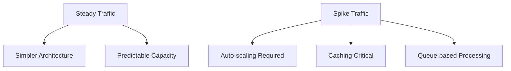
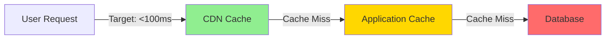
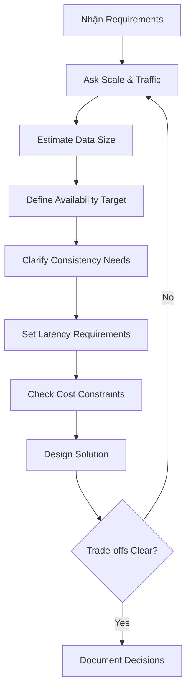

# System Question Framework - Checklist Chuẩn Khi Design Hệ Thống

Khi bắt đầu design một hệ thống, nhiều engineer mới thường nhảy thẳng vào giải pháp mà quên mất một bước cực kỳ quan trọng: **đặt câu hỏi đúng**.

Tôi từng mắc lỗi này. Design một hệ thống chat, tôi nghĩ ngay đến WebSocket, Redis Pub/Sub, horizontal scaling... rồi giữa chừng mới phát hiện: khách hàng chỉ cần 100 users online đồng thời. Tôi đã over-engineer một cách thảm hại.

Vấn đề không phải là thiếu kiến thức kỹ thuật. Vấn đề là tôi không hỏi đủ câu hỏi trước khi design.

## Tại Sao Cần Framework Câu Hỏi?

Khi thiết kế hệ thống, có hàng trăm thứ cần cân nhắc. Không ai có thể nhớ hết. Bạn cần một **checklist** để đảm bảo không bỏ sót điểm quan trọng nào.

Think về nó như pilot checklist trước khi cất cánh. Dù đã bay 10,000 giờ, pilot vẫn phải check từng bước một. Tại sao? Vì checklist đảm bảo consistency và an toàn.

System design cũng vậy. Framework câu hỏi là safeguard của bạn.

## 7 Câu Hỏi Cốt Lõi

Đây là 7 câu hỏi tôi luôn hỏi khi bắt đầu design bất kỳ hệ thống nào. Order có ý nghĩa — nó đi từ context tổng thể đến chi tiết kỹ thuật.

### 1. Scale: Hệ Thống Sẽ Lớn Đến Đâu?

Đây là câu hỏi đầu tiên vì lý do đơn giản: **architecture cho 1,000 users hoàn toàn khác architecture cho 10 triệu users**.

Questions cụ thể:
- Bao nhiêu users hiện tại?
- Expected growth trong 1-2 năm?
- Peak concurrent users?
- Số lượng transactions/requests per day?

**Tại sao quan trọng:** Scale quyết định technology choices. Với 1,000 users, một monolith + MySQL là quá đủ. Với 10 triệu users, bạn cần microservices, caching layers, database sharding.

Ví dụ thực tế: Một startup với 5,000 users không cần Kubernetes và distributed cache. Nhưng nếu họ expect growth 50x trong năm tới, bạn cần design với headroom.

### 2. Traffic Pattern: Người Dùng Hoạt Động Như Thế Nào?

Scale chỉ cho bạn con số. Traffic pattern cho bạn **behavior**.

Questions cụ thể:
- Traffic đều hay có spike?
- Peak hours nào trong ngày?
- Seasonal patterns? (Black Friday, Tết)
- Read-heavy hay write-heavy?
- Ratio giữa reads và writes?

**Tại sao quan trọng:** Pattern ảnh hưởng đến caching strategy, auto-scaling policies, và database design.


Ví dụ: Một hệ thống e-commerce có spike traffic vào 12h trưa và 8h tối. Bạn không thể provision cho peak load 24/7 — quá tốn kém. Bạn cần auto-scaling + aggressive caching.

Ngược lại, một internal tool với steady traffic có thể dùng fixed capacity đơn giản hơn.

### 3. Data Size: Bao Nhiêu Data Và Tốc Độ Tăng?

Đây là câu hỏi về storage và data lifecycle.

Questions cụ thể:
- Tổng data size hiện tại?
- Data growth rate? (GB/day, TB/month)
- Average size mỗi record?
- Data retention policy? (giữ mãi hay xóa sau X tháng?)
- Hot data vs cold data ratio?

**Tại sao quan trọng:** Data size quyết định database choice, storage strategy, và archival policies.

Real example: Một analytics platform sinh ra 100GB logs mỗi ngày. Sau 1 năm là 36TB. Bạn không thể query directly trên 36TB. Bạn cần:
- Hot storage cho 30 ngày gần nhất (fast SSD)
- Cold storage cho historical data (S3/Glacier)
- Data aggregation và sampling

### 4. Availability: Downtime Có Chấp Nhận Được Không?

Availability là về **acceptable downtime**.

Questions cụ thể:
- System có thể down không?
- Acceptable downtime: phút, giờ, hay giây?
- Cần 99.9% hay 99.99% uptime?
- Impact của downtime? (mất revenue, ảnh hưởng users)
- Maintenance window có acceptable không?

**Tại sao quan trọng:** Availability requirements drive architecture complexity và cost.
```
99.9% uptime   = ~8.7 hours downtime/year  → single server OK
99.99% uptime  = ~52 minutes downtime/year → need redundancy
99.999% uptime = ~5 minutes downtime/year  → multi-region + complex failover
```

Ví dụ: Internal tool có thể down maintenance 2-3 giờ đêm khuya? Design đơn giản. Payment system không được down 1 giây? Cần multi-region active-active.

Trade-off: Mỗi "9" thêm vào availability tăng complexity và cost exponentially.

### 5. Consistency: Dữ Liệu Phải Đúng Ngay Lập Tức?

Đây là câu hỏi về **data correctness và synchronization**.

Questions cụ thể:
- Strong consistency cần thiết không?
- Eventual consistency có chấp nhận được?
- Stale data trong vài giây có OK?
- Conflict resolution strategy?
- Transaction guarantees cần đến đâu?

**Tại sao quan trọng:** Consistency requirement ảnh hưởng database choice và architecture patterns.

Examples:
- **Strong consistency cần thiết:** Banking transactions, inventory systems
- **Eventual consistency OK:** Social media feeds, analytics dashboards, view counts

Trade-off class: Bạn không thể có cả strong consistency VÀ high availability VÀ partition tolerance (CAP theorem). Phải chọn.

### 6. Latency: Nhanh Đến Mức Nào?

Latency là về **user experience và response time**.

Questions cụ thể:
- Acceptable response time? (ms, seconds)
- P50, P95, P99 latency requirements?
- User experience expectations?
- Real-time hay batch processing OK?
- Geographic distribution của users?

**Tại sao quan trọng:** Latency requirements drive caching strategy, database indexing, và CDN usage.


Ví dụ:
- Search engine: <100ms critical cho UX
- Batch report generation: vài phút OK
- Real-time chat: <500ms expected
- Analytics dashboard: 2-3 seconds acceptable

P99 latency quan trọng hơn average. Nếu 99% requests nhanh nhưng 1% slow, user experience vẫn tệ.

### 7. Cost: Budget Và Constraints Gì?

Cuối cùng nhưng cực kỳ quan trọng: **cost constraints**.

Questions cụ thể:
- Monthly infrastructure budget?
- Cost per user acceptable?
- Build vs buy trade-offs?
- Team size và expertise?
- Operational cost (maintenance, monitoring)?

**Tại sao quan trọng:** Best technical solution không có ý nghĩa nếu vượt budget hoặc team không maintain được.

Real scenarios:
- Startup với limited budget: optimize for cost, dùng managed services
- Enterprise với compliance: có thể spend more cho security và reliability
- High-growth company: optimize for speed to market, cost secondary

Cost không chỉ là infrastructure. Gồm:
- Engineering time (build và maintain)
- Third-party services
- Infrastructure (servers, databases, storage)
- Operational overhead (monitoring, on-call)

## Framework Trong Thực Tế

Khi design một hệ thống, tôi follow flow này:


**Quy trình cụ thể:**

1. **Listen first** — nghe requirement ban đầu
2. **Ask systematically** — đi qua 7 câu hỏi theo thứ tự
3. **Clarify ambiguity** — không assume, hỏi rõ
4. **Document answers** — viết ra, không rely on memory
5. **Identify conflicts** — spot contradictions sớm
6. **Discuss trade-offs** — transparent về limitations

## Common Mistakes Khi Hỏi

Qua kinh nghiệm, đây là những lỗi phổ biến:

**1. Hỏi không đủ deep**

❌ "Scale bao nhiêu?" — quá vague
✅ "Bao nhiêu concurrent users peak hour? Growth rate expected?"

**2. Accept câu trả lời mơ hồ**

❌ User: "Cần highly available"
✅ Follow-up: "Highly available nghĩa là bao nhiêu downtime acceptable? 1 hour/year hay 1 minute/year?"

**3. Không challenge unrealistic requirements**

Nếu user muốn: strong consistency + 99.999% availability + <10ms latency + $100/month budget → không realistic. Bạn phải point out và discuss trade-offs.

**4. Quên hỏi về constraints**

Đừng chỉ hỏi về goals. Hỏi về limitations: budget, team size, compliance requirements, legacy systems.

## Practical Example: Design URL Shortener

Áp dụng framework:

**Scale:**
- 100M URLs created/month
- 1B clicks/month (10:1 read-write ratio)

**Traffic Pattern:**
- Steady traffic, slight spike business hours
- Read-heavy (clicks >> creates)

**Data Size:**
- ~10 bytes/shortened URL
- 100M × 10 bytes = 1GB/month
- Negligible growth

**Availability:**
- 99.9% OK (short downtime acceptable)
- Not mission-critical

**Consistency:**
- Eventual consistency OK for analytics
- Strong consistency for URL creation (no duplicates)

**Latency:**
- Redirects: <100ms critical
- Creation: <500ms OK

**Cost:**
- Startup budget: optimize for cost
- Managed services preferred

**Decisions dựa trên answers:**
- Single database OK (1GB data size nhỏ)
- Aggressive caching cho reads (10:1 ratio)
- Simple architecture (99.9% availability enough)
- Use managed database (cost-optimize, small team)

## Key Takeaways

System Question Framework không phải magic formula. Nó là **thinking tool** giúp bạn structure conversation và không miss important factors.

**Remember:**

**Always start with questions** — đừng jump vào solution ngay
**Ask systematically** — follow checklist để không miss gì
**Clarify vague answers** — push for specific numbers
**Document everything** — write down để reference sau
**Identify trade-offs early** — conflicts thường emerge từ answers
**Be pragmatic** — perfect solution không tồn tại, chỉ có good-enough solution given constraints

Framework này không guarantee perfect design. Nhưng nó guarantee bạn **asked the right questions** trước khi design — và đó là điểm khởi đầu quan trọng nhất.

Next time bạn design system, pull out checklist này. Đi qua từng câu hỏi một. Bạn sẽ surprised về bao nhiêu assumption bạn đã tránh được và bao nhiêu trade-off bạn identify sớm.

That's the power of good questions.