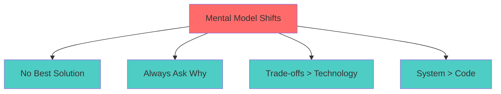
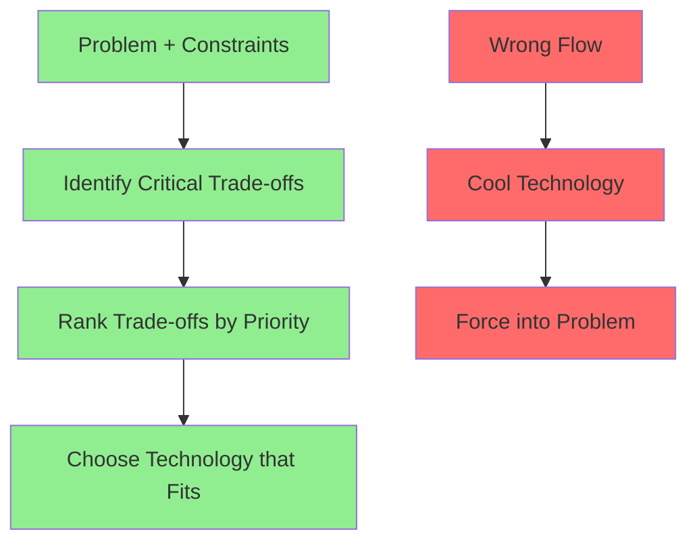
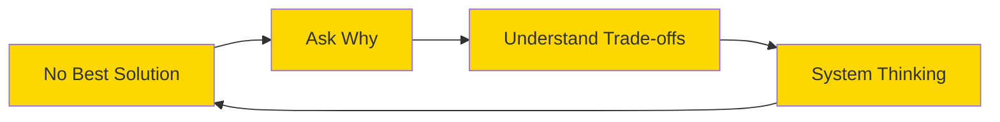

# Mental Model Recap - Củng Cố Tư Duy System Design

Chúng ta đã đi qua 7 lessons trong Phase 0. Đây không phải là phase dạy technology hay design patterns. Đây là phase **thay đổi cách bạn think**.

Trước khi move sang Phase 1, tôi muốn pause và recap lại những mental shifts quan trọng nhất. Những shifts này sẽ theo bạn trong suốt journey từ đây.

Think về nó như foundation của một tòa nhà. Bạn có thể học hết các công cụ, patterns, technologies — nhưng nếu foundation sai, everything else sẽ shaky.

## The Four Core Mindsets

Phase 0 xoay quanh 4 mindset shifts cốt lõi. Đây không phải checklist để học thuộc. Đây là **lenses** để nhìn problems.


Hãy đi sâu vào từng mindset.

## 1. Không Có "Best Solution"

Đây là shift khó nhất để accept, đặc biệt khi bạn mới transition từ developer.

**The old mindset:**
"Có một giải pháp tốt nhất. Tôi cần tìm nó."

**The new mindset:**
"Mọi solution đều có trade-offs. Tôi cần tìm solution phù hợp nhất với context này."

### Tại Sao Mindset Này Quan Trọng?

Khi bạn tin có "best solution", bạn sẽ:
- Waste time tìm kiếm perfection
- Copy solutions không phù hợp context
- Rigid khi requirements change
- Miss opportunities để optimize cho specific needs

Khi bạn accept "no best solution", bạn sẽ:
- Focus vào understanding constraints
- Design for current context
- Flexible khi adapt
- Make conscious trade-offs

### Real Example

Câu hỏi: "Database nào best cho application của tôi?"

**Wrong approach:** "PostgreSQL là best vì X, Y, Z"

**Right approach:** 
"Depends on your needs:
- Relational data với ACID? → PostgreSQL
- Document với flexible schema? → MongoDB  
- High-throughput writes? → Cassandra
- Simple key-value? → Redis

Each có trade-offs. Best choice depends on YOUR constraints."

## 2. Always Ask "Why"

Mindset shift này về **questioning everything** — không accept answers at face value.

**The old mindset:**
"Senior engineer nói dùng microservices → tôi dùng microservices"

**The new mindset:**
"Tại sao microservices? Problem nào nó solve? Trade-offs gì? Có alternatives?"

### Why "Why" Matters

Trong system design, mọi decision đều có ripple effects. Nếu bạn không hiểu **reasoning** behind decisions, bạn sẽ:
- Repeat mistakes của người khác
- Không adapt được khi context changes
- Make inconsistent decisions
- Không defend được choices của mình

### The Five Whys Technique

Khi ai đó suggest một solution, drill down:
```
"Chúng ta nên dùng Redis."
→ Why Redis?

"Để cache data."
→ Why cache? Performance issue gì?

"API response time ~2 seconds."
→ Why slow? Database query chậm?

"Có, query scan whole table."
→ Why không add index trước?

"Ah... chưa thử index."
```

Thường thì sau 2-3 "why", bạn discover simpler solution.

### Apply To Everything

- Why microservices instead of monolith?
- Why NoSQL instead of SQL?
- Why Kubernetes instead of simple VMs?
- Why event-driven instead of request-response?
- Why cache this data?
- Why split this service?

Không có câu hỏi "stupid". Mọi "why" đều valid.

## 3. Trade-offs Quan Trọng Hơn Technology

Đây là shift from **technology-first** sang **problem-first thinking**.

**The old mindset:**
"Technology X hot và mới. Tôi muốn dùng X."

**The new mindset:**
"Problem là gì? Trade-offs nào matter? Technology nào fit best cho trade-offs này?"

### Why This Matters

Technology is just a tool. Choosing technology WITHOUT understanding trade-offs giống như:
- Mua Ferrari để đi chợ hàng ngày
- Dùng sledgehammer để đóng đinh
- Over-engineer cho problems đơn giản

Good architects think về trade-offs FIRST, technology SECOND.

### Common Trade-offs

Mọi design decision involve trade-offs:

**Consistency vs Availability:**
- Strong consistency → có thể sacrifice availability
- High availability → có thể accept eventual consistency

**Performance vs Cost:**
- Better performance → more expensive infrastructure
- Lower cost → accept slower response times

**Simplicity vs Flexibility:**
- Simple architecture → harder to extend
- Flexible architecture → more complexity upfront

**Build vs Buy:**
- Build custom → full control, higher cost
- Use managed services → less control, faster delivery

### Framework Thinking

Thay vì think "technology nào?", think:
1. Trade-off nào critical cho problem này?
2. Trade-off nào acceptable?
3. Technology nào support trade-offs đó?


## 4. System Thinking Trên Code Thinking

Đây là biggest shift — from **micro level** (code) to **macro level** (system).

**The old mindset:**
"Tôi viết clean code, optimize algorithms, follow best practices. That's enough."

**The new mindset:**
"Code chỉ là một phần. Tôi cần think về: components interaction, data flow, failure modes, scaling, monitoring, operations."

### Why This Shift Is Hard

Developers spend years optimizing code:
- Clean architecture
- Design patterns
- Algorithm optimization
- Code quality

Suddenly, system design nói: "Code quality ít quan trọng hơn system quality."

Điều này không có nghĩa code không quan trọng. Nhưng **good code trong bad architecture vẫn fail**.

### What Is System Thinking?

System thinking means nhìn **whole picture**, không chỉ individual parts:

**Code thinking:**
- Function này O(n²) → optimize to O(n log n)
- Class này violate SOLID → refactor

**System thinking:**
- Service này become bottleneck at scale → cần split hay scale?
- Database này single point of failure → cần replication?
- Network latency between services → có nên merge services?
- Failure ở component A affect component B như thế nào?

### Example: Payment Processing

**Code-level thinking:**
```
PaymentService.process(payment):
  - Validate payment data
  - Call payment gateway
  - Update database
  - Return response
```

**System-level thinking:**
```
1. What if payment gateway timeout?
   → Retry? Queue? Idempotency?

2. What if database down khi update?
   → Đã charge customer nhưng chưa save record?

3. How to handle high load?
   → Queue-based processing? Rate limiting?

4. How to monitor failures?
   → Metrics? Alerts? Dashboards?

5. How to debug issues in production?
   → Logging? Tracing? Correlation IDs?
```

Code thinking focus vào logic. System thinking focus vào **reliability, scalability, observability**.

## Kết Nối 4 Mindsets

4 mindsets này không isolated. Chúng interconnected:


**Flow tự nhiên:**

1. Accept **không có best solution** → bạn open-minded

2. **Ask why** → bạn understand reasoning

3. Focus vào **trade-offs** → bạn make informed decisions

4. Apply **system thinking** → bạn see big picture

Mỗi mindset reinforce mindsets khác.

## From Mindset To Practice

Okay, bạn understand 4 mindsets. Bây giờ làm sao apply?

### Daily Practices

**1. Review Past Decisions**

Pick một architectural decision trong project của bạn. Ask:
- Tại sao decision đó?
- Trade-offs gì?
- Với hindsight, còn đúng không?
- Học được gì?

**2. Challenge Yourself**

Mỗi khi bạn muốn dùng một technology:
- Write down 3 reasons why
- Write down 2 alternatives
- Compare trade-offs
- Justify choice

**3. Think In Systems**

Khi debug issue trong production:
- Đừng chỉ fix bug
- Ask: tại sao bug này xảy ra?
- System design nào prevent nó?
- Có issues tương tự khác không?

**4. Learn From Others**

Đọc architecture blogs, case studies:
- Không copy solutions
- Focus vào reasoning
- Understand their constraints
- Note trade-offs họ chọn

### Red Flags To Watch

Dấu hiệu bạn chưa internalize mindsets:

"Best practice là X, nên tôi dùng X"
→ Missing: context và trade-offs

"Senior engineer nói như vậy"
→ Missing: asking why

"Technology Y hot, tôi muốn learn"
→ Missing: problem-first thinking

"Code này clean và fast"
→ Missing: system-level concerns

Khi bạn catch yourself thinking như vậy — pause và apply framework.

## Key Takeaways

Nếu chỉ nhớ 4 điều từ Phase 0:

**1. No Best Solution**
→ Context determines "best". Focus on fit, not perfection.

**2. Always Ask Why**
→ Understanding reasoning > memorizing solutions.

**3. Trade-offs > Technology**
→ Choose based on constraints, not trends.

**4. System > Code**
→ Good code in bad architecture still fails.

## Final Thought

Mindset shift không xảy ra overnight. Tôi mất 2 năm để truly internalize những principles này.

Bạn sẽ catch yourself thinking theo old ways. That's normal. Mỗi lần đó, consciously apply new mindset. Overtime, nó trở thành automatic.

Remember: **System design is not about knowing all technologies. It's about thinking clearly about trade-offs trong complex contexts.**
