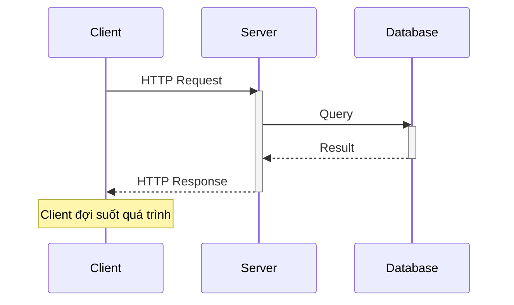
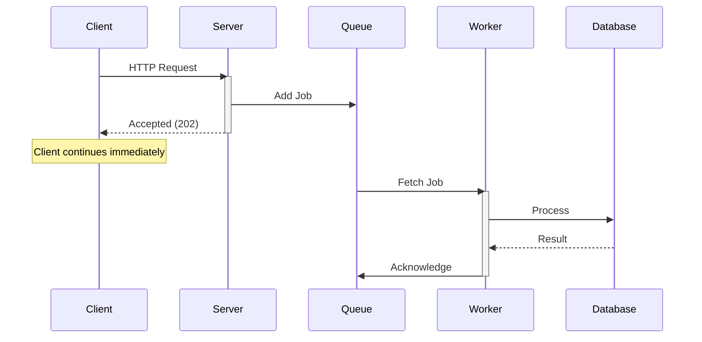
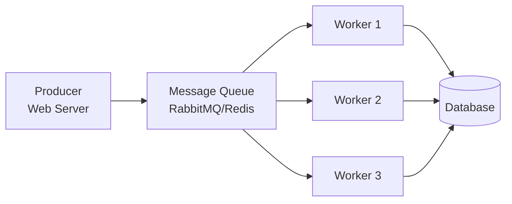
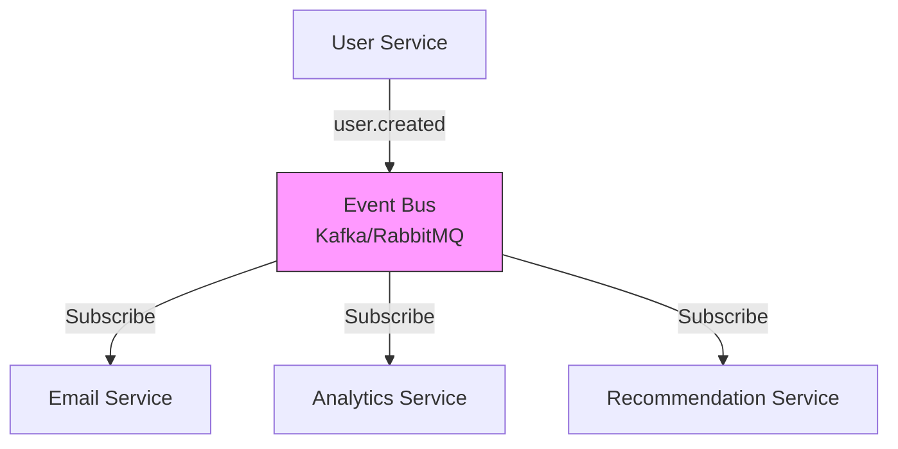
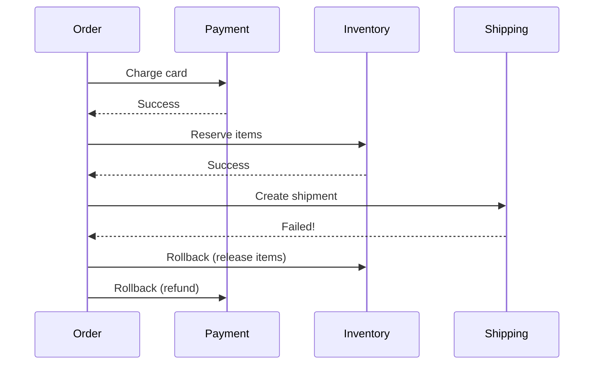

# Communication Patterns: Sync vs Async

Sau khi hiểu các components trong hệ thống, câu hỏi tiếp theo là: **Chúng communicate với nhau thế nào?**

Tôi còn nhớ lần đầu design một tính năng "upload video". Approach của tôi:
```python
def upload_video(video_file):
    save_to_s3(video_file)           # 2 giây
    generate_thumbnail(video_file)   # 5 giây
    transcode_720p(video_file)       # 30 giây
    transcode_1080p(video_file)      # 60 giây
    send_notification()              # 1 giây
    return "Success"                 # User đợi 98 giây!
```

Senior architect nhìn code, hỏi: *"User có cần đợi tất cả này không?"*

Tôi nhận ra: **Không.** User chỉ cần biết video đã upload. Processing có thể làm sau.

Đó là lúc tôi học về **synchronous vs asynchronous communication** - một trong những quyết định quan trọng nhất trong system design.

## Tại Sao Communication Pattern Quan Trọng?

Pattern bạn chọn ảnh hưởng đến:

**Performance:**
- Sync: User đợi cho đến khi xong
- Async: User nhận response ngay, process sau

**Scalability:**
- Sync: Hard to handle traffic spikes
- Async: Queue buffer requests naturally

**Reliability:**
- Sync: Failure = immediate error
- Async: Retry logic built-in

**Complexity:**
- Sync: Simple, straightforward
- Async: Complex, eventual consistency

**Không có "better" pattern. Chỉ có "appropriate" pattern.**

## Synchronous Communication (Request-Response)

### How It Works


Client gửi request → đợi → nhận response. Blocking operation.

### Code Example
```python
# Client code
def get_user_profile(user_id):
    response = requests.get(f"/api/users/{user_id}")  # Blocks here
    return response.json()

# Server code
@app.route('/api/users/<user_id>')
def get_user(user_id):
    user = database.query(f"SELECT * FROM users WHERE id = {user_id}")
    return jsonify(user)
```

**Flow:**
1. Client sends request
2. Client **waits** (blocks)
3. Server processes
4. Server returns response
5. Client receives result

Total time = Sum of all steps.

### When to Use Synchronous

**Use sync khi:**

 **User cần result ngay lập tức**
```
Examples:
- Login (cần biết success/fail ngay)
- Search (user đang đợi results)
- Form submission (cần validation feedback)
- API calls (client cần data để continue)
```

 **Operation nhanh (< 5 seconds)**
```
- Database lookups
- Simple calculations
- File reads (small files)
```

 **Workflow đơn giản**
```
Request → Process → Response
Không có branching logic phức tạp
```

### When NOT to Use Synchronous

 **Processing lâu (> 5 seconds)**
```
- Video encoding
- Large file processing
- Complex reports
- Batch operations
→ User timeout, bad UX
```

 **External dependencies không reliable**
```
- Third-party APIs (có thể slow/down)
- Payment gateways
- Email sending
→ Your API slow vì dependency slow
```

 **Traffic spikes không dự đoán được**
```
Black Friday sale, viral posts
→ All requests queue up
→ System overload
```

### Trade-offs
```
 Advantages:
- Simple logic (easy to understand)
- Immediate feedback
- Easy debugging (linear flow)
- Transaction support (ACID)

 Disadvantages:
- Poor UX cho slow operations
- Tight coupling (client depends on server availability)
- Hard to scale (synchronous blocking)
- Timeout risk
```

### Real-World Example: Login Flow
```python
@app.route('/login', methods=['POST'])
def login():
    email = request.json['email']
    password = request.json['password']
    
    # Step 1: Validate credentials (50ms)
    user = db.query("SELECT * FROM users WHERE email = ?", email)
    if not user or not verify_password(password, user.password_hash):
        return {"error": "Invalid credentials"}, 401
    
    # Step 2: Generate token (10ms)
    token = generate_jwt(user.id)
    
    # Step 3: Log login event (20ms)
    db.insert("INSERT INTO login_logs (user_id, timestamp) VALUES (?, ?)", 
              user.id, datetime.now())
    
    return {"token": token, "user": user}, 200
    # Total: ~80ms - Acceptable cho sync
```

**Why sync is appropriate:**
- User cần result ngay (cannot proceed without token)
- Fast operation (< 100ms)
- Simple workflow

## Asynchronous Communication (Message Queue)

### How It Works


Client gửi request → server add to queue → return ngay. Worker process sau.

### Code Example
```python
# Server code
from celery import Celery
app = Celery('tasks', broker='redis://localhost:6379')

@app.route('/upload-video', methods=['POST'])
def upload_video():
    video_file = request.files['video']
    
    # Quick operation: Save original
    video_id = save_to_s3(video_file)  # 2 seconds
    
    # Add processing to queue
    process_video_task.delay(video_id)
    
    return {"status": "processing", "video_id": video_id}, 202
    # User gets response sau 2s (not 98s!)

# Worker code (runs separately)
@app.task
def process_video_task(video_id):
    video = get_from_s3(video_id)
    generate_thumbnail(video)      # 5s
    transcode_720p(video)          # 30s
    transcode_1080p(video)         # 60s
    send_notification(video_id)    # 1s
    # Total: 96s, but user doesn't wait
```

**Flow:**
1. Client sends request
2. Server saves và queues job
3. Server returns immediately (202 Accepted)
4. Client continues (không đợi)
5. Background worker picks up job
6. Worker processes (có thể mất lâu)
7. (Optional) Notify client khi done

### When to Use Asynchronous

**Use async khi:**

 **Processing lâu (> 5 seconds)**
```
Examples:
- Video/image processing
- Report generation
- Batch imports
- Data synchronization
```

 **User không cần result ngay**
```
- Send email
- Generate invoice
- Update analytics
- Background sync
```

 **Need to handle traffic spikes**
```
Queue buffers requests:
1000 requests/second → Queue holds
Workers process at steady rate (100/s)
No server overload
```

 **External dependencies không reliable**
```
- Third-party API calls
- Webhook deliveries
- Payment processing
→ Retry logic built into queue
```

### Message Queue Components


**Producer:** Service tạo jobs (web server)
**Queue:** Lưu jobs waiting to be processed
**Consumer/Worker:** Services process jobs

### Queue Guarantees

**At-Most-Once:**
```
Message có thể bị mất
Không retry
Use case: Metrics, logs (mất 1 ít OK)
```

**At-Least-Once (Common):**
```
Message không bị mất
Có thể process nhiều lần
Use case: Most business logic (with idempotency)
```

**Exactly-Once (Rare):**
```
Message process đúng 1 lần
Rất khó implement
Use case: Financial transactions
```

### Idempotency - Critical Concept

**Problem:** Worker crashes sau khi process nhưng trước khi acknowledge.
```
Job: "Charge $100 to user"
Worker 1: Process → Charge $100 → Crash (no ACK)
Queue: Redeliver job
Worker 2: Process → Charge $100 again!
User charged $200 (wrong!)
```

**Solution: Idempotent operations**
```python
@app.task
def charge_user(order_id, amount):
    # Check if already processed
    existing = db.query("SELECT * FROM charges WHERE order_id = ?", order_id)
    if existing:
        return "Already charged"  # Idempotent!
    
    # Process
    charge_credit_card(amount)
    db.insert("INSERT INTO charges (order_id, amount) VALUES (?, ?)", 
              order_id, amount)
    
    return "Charged successfully"
```

**Khi design async operations, luôn make them idempotent.**

### Trade-offs
```
 Advantages:
- Better UX (fast response)
- Handle traffic spikes (queue buffers)
- Retry logic (reliability)
- Decouple services

 Disadvantages:
- Complex architecture
- Eventual consistency
- Harder debugging (distributed)
- Need monitoring (queue length, worker health)
```

### Real-World Example: E-commerce Order
```python
@app.route('/orders', methods=['POST'])
def create_order():
    items = request.json['items']
    user_id = request.json['user_id']
    
    # Sync: Critical operations
    order_id = db.insert("INSERT INTO orders (...) VALUES (...)")
    reserve_inventory(items)  # Must happen now
    
    # Async: Non-critical operations
    send_confirmation_email.delay(order_id)
    update_analytics.delay(order_id)
    notify_warehouse.delay(order_id)
    
    return {"order_id": order_id, "status": "confirmed"}, 201
    # User gets response immediately
    # Email/analytics happen in background
```

**Why this design?**
- Order creation: Sync (user needs order_id)
- Inventory: Sync (must prevent overselling)
- Email: Async (user doesn't wait for email)
- Analytics: Async (not critical path)

## Event-Driven Architecture (Advanced Async)

### How It Works


Thay vì User Service gọi trực tiếp Email/Analytics, nó publish event. Services khác subscribe.

### Code Example
```python
# User Service (Publisher)
def create_user(email, name):
    user_id = db.insert("INSERT INTO users (...) VALUES (...)")
    
    # Publish event
    event_bus.publish('user.created', {
        'user_id': user_id,
        'email': email,
        'name': name,
        'timestamp': datetime.now()
    })
    
    return user_id

# Email Service (Subscriber)
@event_bus.subscribe('user.created')
def on_user_created(event):
    send_welcome_email(event['email'], event['name'])

# Analytics Service (Subscriber)
@event_bus.subscribe('user.created')
def on_user_created(event):
    track_signup(event['user_id'], event['timestamp'])

# Recommendation Service (Subscriber)
@event_bus.subscribe('user.created')
def on_user_created(event):
    initialize_recommendations(event['user_id'])
```

**Benefits:**
- User Service không biết ai consume events
- Easy thêm subscribers mới (không modify User Service)
- Each service independent

### When to Use Event-Driven

 **Microservices architecture**
 **Multiple services cần react to same event**
 **Need loose coupling**

 **Simple monolith** (over-engineering)
 **Small team** (maintenance overhead)

## Pattern Comparison

### Scenario: User uploads profile photo

**Approach 1: Synchronous**
```python
@app.route('/upload-photo', methods=['POST'])
def upload_photo():
    photo = request.files['photo']
    
    # All sync
    uploaded_url = s3.upload(photo)           # 2s
    thumbnail_url = resize_image(photo)       # 3s
    update_database(user_id, uploaded_url)    # 0.1s
    invalidate_cache(user_id)                 # 0.1s
    
    return {"url": uploaded_url}, 200
    # User waits 5.2 seconds
```

**Approach 2: Asynchronous**
```python
@app.route('/upload-photo', methods=['POST'])
def upload_photo():
    photo = request.files['photo']
    
    # Sync: Upload original only
    uploaded_url = s3.upload(photo)  # 2s
    
    # Async: Processing
    process_photo.delay(user_id, uploaded_url)
    
    return {"url": uploaded_url, "status": "processing"}, 202
    # User waits 2 seconds

@app.task
def process_photo(user_id, photo_url):
    thumbnail = generate_thumbnail(photo_url)  # 3s
    update_database(user_id, photo_url)
    invalidate_cache(user_id)
```

**Approach 3: Event-Driven**
```python
@app.route('/upload-photo', methods=['POST'])
def upload_photo():
    photo = request.files['photo']
    uploaded_url = s3.upload(photo)
    
    # Publish event
    events.publish('photo.uploaded', {
        'user_id': user_id,
        'photo_url': uploaded_url
    })
    
    return {"url": uploaded_url}, 202

# Different services subscribe
@events.subscribe('photo.uploaded')
def generate_thumbnails(event):
    create_thumbnail(event['photo_url'])

@events.subscribe('photo.uploaded')
def update_ml_model(event):
    facial_recognition.train(event['photo_url'])

@events.subscribe('photo.uploaded')
def moderate_content(event):
    check_inappropriate_content(event['photo_url'])
```

### Decision Framework
```
Choose Sync khi:
✓ User needs immediate result
✓ Fast operation (< 5s)
✓ Simple workflow
✓ Strong consistency required

Choose Async (Queue) khi:
✓ Long processing (> 5s)
✓ User doesn't need immediate result
✓ Need retry logic
✓ Handle traffic spikes

Choose Event-Driven khi:
✓ Multiple services react to same event
✓ Microservices architecture
✓ Need loose coupling
✓ Complex workflows
```

## Common Patterns & Anti-Patterns

### Pattern 1: Sync for Reads, Async for Writes
```python
# Read: Sync (user needs data now)
@app.route('/products/<id>')
def get_product(id):
    return db.query("SELECT * FROM products WHERE id = ?", id)

# Write: Async (can process later)
@app.route('/products/<id>/review', methods=['POST'])
def add_review(id):
    review_data = request.json
    add_review_task.delay(id, review_data)
    return {"status": "submitted"}, 202
```

### Pattern 2: Saga Pattern (Distributed Transactions)

Khi cần coordinate nhiều services:


**Implementation:**
```python
def create_order_saga(order_data):
    order_id = create_order(order_data)
    
    try:
        # Step 1: Payment
        payment_id = charge_payment.delay(order_id).get()
        
        # Step 2: Inventory
        reserve_inventory.delay(order_id, order_data['items']).get()
        
        # Step 3: Shipping
        create_shipment.delay(order_id).get()
        
        return {"order_id": order_id, "status": "success"}
    
    except Exception as e:
        # Compensate (rollback)
        if payment_id:
            refund_payment.delay(payment_id)
        release_inventory.delay(order_id)
        cancel_order.delay(order_id)
        
        return {"error": str(e), "status": "failed"}
```

### Anti-Pattern 1: Sync Calls in Chain
```python
#  BAD: Synchronous chain
def process_order(order_id):
    order = get_order(order_id)              # 100ms
    user = get_user(order.user_id)           # 100ms
    payment = process_payment(order.total)   # 500ms
    inventory = reserve_items(order.items)   # 200ms
    shipping = create_shipment(order_id)     # 300ms
    
    return order
    # Total: 1200ms (serial)

#  GOOD: Parallel async
def process_order(order_id):
    order = get_order(order_id)
    
    # Parallel processing
    tasks = [
        get_user_task.delay(order.user_id),
        process_payment_task.delay(order.total),
        reserve_items_task.delay(order.items)
    ]
    
    results = [task.get() for task in tasks]
    
    # Finally, shipping (depends on above)
    create_shipment_task.delay(order_id)
    
    return order
    # Total: ~500ms (parallel)
```

### Anti-Pattern 2: No Timeout for Sync Calls
```python
#  BAD: No timeout
response = requests.get('https://external-api.com/data')

#  GOOD: Always timeout
try:
    response = requests.get('https://external-api.com/data', timeout=5)
except requests.Timeout:
    # Fallback or queue for retry
    retry_later.delay('https://external-api.com/data')
    return {"status": "processing"}
```

### Anti-Pattern 3: Not Handling Queue Failures
```python
#  BAD: No error handling
@app.task
def send_email(user_id, subject, body):
    smtp.send(user_id, subject, body)  # What if SMTP down?

#  GOOD: Retry with backoff
@app.task(bind=True, max_retries=3)
def send_email(self, user_id, subject, body):
    try:
        smtp.send(user_id, subject, body)
    except SMTPException as exc:
        # Exponential backoff: 1min, 2min, 4min
        raise self.retry(exc=exc, countdown=2 ** self.request.retries * 60)
```

## Monitoring & Observability

### Key Metrics

**For Sync APIs:**
```
- Response time (p50, p95, p99)
- Error rate
- Request rate
- Timeout rate
```

**For Async Queues:**
```
- Queue length (backlog)
- Processing time per job
- Failure rate
- Retry rate
- Worker health
```

### Alerting
```python
# Alert khi queue backlog too high
if queue_length > 10000:
    alert("Queue backlog high - need more workers")

# Alert khi workers failing
if worker_failure_rate > 0.05:  # 5%
    alert("High worker failure rate - check errors")

# Alert khi processing slow
if avg_processing_time > 60:  # 60 seconds
    alert("Slow job processing - investigate")
```

## Key Takeaways

**Communication patterns shape system behavior:**

**Synchronous (Request-Response):**
-  Simple, immediate feedback
-  Poor for slow operations, tight coupling
- **Use for:** Reads, fast operations, user-facing APIs

**Asynchronous (Message Queue):**
-  Better UX, handle spikes, retry logic
-  Complex, eventual consistency
- **Use for:** Slow processing, background jobs, decoupling

**Event-Driven:**
-  Loose coupling, scalable, flexible
-  Most complex, hard to debug
- **Use for:** Microservices, multiple reactions to events

**Golden rules:**
1. **Default to sync** cho simplicity
2. **Go async** khi user experience demands
3. **Make async operations idempotent**
4. **Always set timeouts** cho sync calls
5. **Monitor queue health** religiously

**Decision checklist:**

Trước khi chọn pattern, tự hỏi:
- User có cần result ngay không?
- Operation mất bao lâu?
- External dependencies reliable không?
- Team có experience với async patterns không?

**Practice exercise:**

Design communication pattern cho các scenarios:
1. User đổi password
2. Generate monthly report
3. Process payment
4. Send push notification to 1M users
5. Real-time chat message

Với mỗi scenario, defend choice của bạn với trade-offs.
