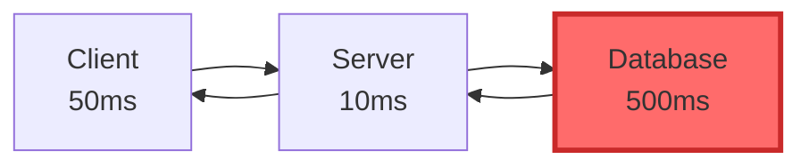
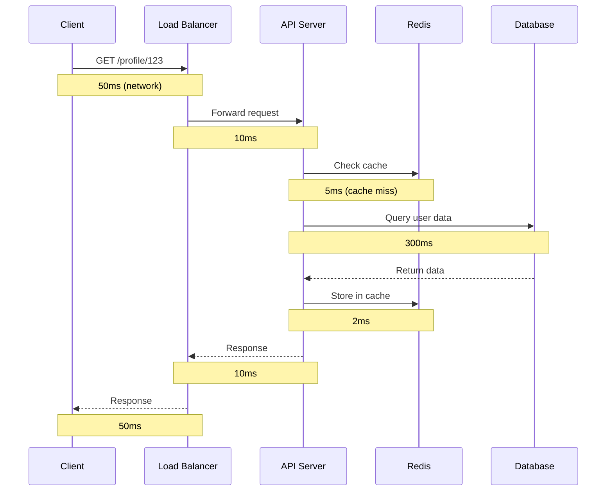
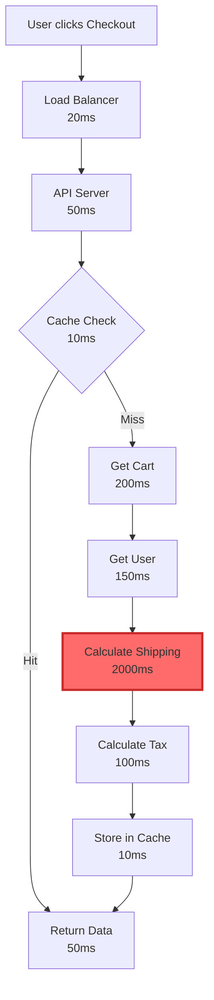

# Data Flow & Bottlenecks: Tìm Và Tối Ưu Điểm Nghẽn

Tôi còn nhớ lần đầu tiên được gọi vào war room lúc 3 giờ sáng.

"Production chậm kinh khủng! Users complain response time 10 giây!"

Team đang panic. Ai cũng có theory riêng:
- Dev A: "Database chậm, cần upgrade server!"
- Dev B: "Network lag, cần thêm bandwidth!"
- Dev C: "Code inefficient, cần refactor!"

Senior architect bước vào, yên lặng mở monitoring tool. 5 phút sau, anh chỉ vào một graph:

*"Redis connection pool chỉ có 10 connections. Có 1000 requests đang chờ. Fix cái này trước."*

Tăng pool lên 100. Response time về 200ms. Problem solved.

**Bài học:** Đừng optimize bừa. **Measure, find bottleneck, fix bottleneck.**

## Tại Sao Data Flow & Bottlenecks Quan Trọng?

Khi hệ thống chậm, 90% engineers làm sai một điều: **Optimize không đúng chỗ.**

Họ:
- Optimize code đã nhanh
- Add cache không cần thiết
- Upgrade hardware không phải bottleneck

**Result:** Waste time, waste money, vấn đề vẫn còn.

**Architect giỏi khác ở chỗ:** Họ biết **tìm bottleneck trước khi optimize**.

Data flow analysis là skill này. Nó giúp bạn:
- **Visualize** request đi qua những gì
- **Measure** mỗi step mất bao lâu
- **Identify** bottleneck thực sự
- **Optimize** đúng chỗ, high impact

## Luật Vàng: Hệ Thống Chỉ Nhanh Bằng Component Chậm Nhất

**The Weakest Link Principle.**

Imagine chuỗi sản xuất:

```
Bước 1: Cắt vải (1 phút/sản phẩm)
Bước 2: May (5 phút/sản phẩm) ← BOTTLENECK
Bước 3: Đóng gói (30 giây/sản phẩm)

Throughput: 1 sản phẩm mỗi 5 phút
```

Optimize bước 1 từ 1 phút → 10 giây? **Không effect gì.** Bottleneck vẫn là bước 2.

Chỉ khi optimize bước 2 (bottleneck), throughput mới tăng.

**Same với systems:**



**Total latency: 50 + 10 + 500 + 10 + 50 = 620ms**

Database chiếm **500ms / 620ms = 81%** của total time.

Optimize server từ 10ms → 1ms? Save được 18ms (3% improvement).

Optimize database từ 500ms → 50ms? Save được 450ms (73% improvement)!

**Lesson:** Always optimize bottleneck first. Biggest ROI.

## Cách Tư Duy: 3-Step Bottleneck Analysis

### Step 1: Đo Thời Gian Mỗi Bước

**Không đoán. Đo.**

**Example: User loads profile page**



**Breakdown:**
```
Client → Load Balancer:     50ms
Load Balancer → API:        10ms
API → Cache check:           5ms (miss)
API → Database query:      300ms ← BOTTLENECK
API → Cache store:           2ms
API → Load Balancer:        10ms
Load Balancer → Client:     50ms

Total: 427ms
Database: 300ms (70% of total)
```

### Step 2: Tìm Bottleneck

**Bottleneck = Component chiếm thời gian nhiều nhất.**

Trong example trên: **Database (300ms / 427ms = 70%)**

**How to measure trong production:**

**Tool 1: APM (Application Performance Monitoring)**

```python
# New Relic, DataDog, hoặc tương tự
from apm import trace

@trace("load_profile")
def load_profile(user_id):
    with trace("cache_check"):
        user = cache.get(f"user:{user_id}")
    
    if not user:
        with trace("db_query"):  # Measure this
            user = db.query("SELECT * FROM users WHERE id = ?", user_id)
        
        with trace("cache_store"):
            cache.set(f"user:{user_id}", user)
    
    return user

# APM dashboard sẽ show:
# - load_profile: 307ms total
# - cache_check: 5ms
# - db_query: 300ms ← BOTTLENECK FOUND
# - cache_store: 2ms
```

**Tool 2: Custom timing logs**

```python
import time

def load_profile(user_id):
    start = time.time()
    
    # Step 1: Cache check
    cache_start = time.time()
    user = cache.get(f"user:{user_id}")
    cache_time = time.time() - cache_start
    
    # Step 2: DB query if cache miss
    if not user:
        db_start = time.time()
        user = db.query("SELECT * FROM users WHERE id = ?", user_id)
        db_time = time.time() - db_start
        
        cache.set(f"user:{user_id}", user)
    else:
        db_time = 0
    
    total_time = time.time() - start
    
    # Log breakdown
    logger.info(f"Profile load: {total_time:.3f}s | "
                f"Cache: {cache_time:.3f}s | "
                f"DB: {db_time:.3f}s")
    
    return user

# Logs show:
# Profile load: 0.307s | Cache: 0.005s | DB: 0.300s
```

**Tool 3: Database query profiling**

```sql
-- PostgreSQL
EXPLAIN ANALYZE
SELECT * FROM users WHERE email = 'john@example.com';

-- Output shows:
Seq Scan on users (cost=0.00..18334.00 rows=1 width=123)
  (actual time=0.011..285.234 rows=1 loops=1)
  Filter: (email = 'john@example.com')
  Rows Removed by Filter: 999999
Planning Time: 0.082 ms
Execution Time: 285.256 ms  ← 285ms! Missing index!
```

### Step 3: Optimize Bottleneck Đó

**Chỉ optimize component là bottleneck.**

Trong example, database là bottleneck (300ms).

**Optimization options:**

**Option A: Add index (Low effort, High impact)**

```sql
-- Before: Full table scan, 300ms
SELECT * FROM users WHERE email = 'john@example.com';

-- Add index
CREATE INDEX idx_users_email ON users(email);

-- After: Index scan, 5ms
-- 60x faster!
```

**Option B: Cache more aggressively**

```python
# Before: Cache miss → DB query (300ms)

# After: Pre-warm cache
def warm_cache():
    popular_users = db.query("SELECT * FROM users ORDER BY login_count DESC LIMIT 1000")
    for user in popular_users:
        cache.set(f"user:{user.id}", user, ttl=3600)

# Result: Cache hit rate 95% → Only 5% queries hit DB
```

**Option C: Optimize query**

```sql
-- Before: Select all columns (waste)
SELECT * FROM users WHERE email = 'john@example.com';

-- After: Select only needed columns
SELECT id, name, email, avatar FROM users WHERE email = 'john@example.com';

-- Smaller data → Faster transfer → 300ms → 200ms
```

**Measure after optimization:**

```
Original:
Total: 427ms | DB: 300ms (70%)

After adding index:
Total: 132ms | DB: 5ms (4%)

Improvement: 427ms → 132ms (69% faster!)
```

**Key insight:** Optimize bottleneck = Biggest impact với least effort.

## Common Bottlenecks & How to Detect

### Bottleneck 1: Database Queries

**Symptoms:**
- High query latency (> 100ms)
- Database CPU/IO maxed out
- Slow response time under load

**Detection:**

```sql
-- PostgreSQL: Find slow queries
SELECT 
    query,
    calls,
    total_time,
    mean_time,
    max_time
FROM pg_stat_statements
ORDER BY mean_time DESC
LIMIT 10;

-- Output shows queries taking > 100ms average
```

**Solutions:**

```
1. Add indexes (most common fix)
   - Before: 500ms full table scan
   - After: 5ms index scan

2. Optimize query structure
   - Avoid SELECT *
   - Use appropriate JOINs
   - Add LIMIT when possible

3. Add query cache
   - Cache frequent queries
   - Reduce DB load 80-90%

4. Database optimization
   - Analyze query plans
   - Update statistics
   - Vacuum/optimize tables

5. Add read replicas (last resort)
   - Scale reads horizontally
   - Route read queries to replicas
```

### Bottleneck 2: Network Latency

**Symptoms:**
- High latency between services
- Timeouts under load
- Geographic distance issues

**Detection:**

```python
import time
import requests

def measure_network_latency():
    start = time.time()
    response = requests.get("https://api.example.com/health")
    latency = time.time() - start
    
    print(f"Network latency: {latency * 1000:.0f}ms")

# Run from different regions:
# US East → US West: 50ms
# US East → Asia: 200ms
# Asia → Europe: 300ms
```

**Solutions:**

```
1. CDN for static assets
   - Images, CSS, JS
   - Serve from edge locations
   - 300ms → 20ms

2. Regional deployments
   - Deploy servers closer to users
   - US users → US servers
   - Asia users → Asia servers

3. Reduce payload size
   - Compress responses (gzip)
   - Remove unnecessary data
   - Pagination

4. Connection pooling
   - Reuse connections
   - Avoid handshake overhead

5. HTTP/2 or HTTP/3
   - Multiplexing
   - Header compression
```

### Bottleneck 3: Application Logic

**Symptoms:**
- High CPU usage on app servers
- Slow processing time
- Code execution takes long

**Detection:**

```python
import cProfile
import pstats

# Profile slow function
def profile_function():
    profiler = cProfile.Profile()
    profiler.enable()
    
    # Run function
    result = slow_function()
    
    profiler.disable()
    
    # Print stats
    stats = pstats.Stats(profiler)
    stats.sort_stats('cumulative')
    stats.print_stats(10)  # Top 10 slowest functions

# Output shows:
# Function A: 500ms (bottleneck!)
# Function B: 50ms
# Function C: 10ms
```

**Solutions:**

```
1. Optimize algorithms
   - O(n²) → O(n log n)
   - Use better data structures
   - Avoid nested loops

2. Async processing
   - Move heavy work to background
   - Use message queues
   - Don't block user request

3. Caching expensive computations
   - Memoization
   - Cache computed results

4. Horizontal scaling
   - Add more app servers
   - Load balance

5. Language/runtime optimization
   - Use compiled language for hot paths
   - JIT compilation
   - Profile-guided optimization
```

### Bottleneck 4: External API Calls

**Symptoms:**
- Waiting for third-party services
- Timeouts from external APIs
- Cascading delays

**Detection:**

```python
import httpx
import time

async def measure_external_apis():
    apis = [
        "https://api.stripe.com/health",
        "https://api.twilio.com/health",
        "https://maps.googleapis.com/health"
    ]
    
    async with httpx.AsyncClient() as client:
        for api in apis:
            start = time.time()
            try:
                response = await client.get(api, timeout=5.0)
                latency = time.time() - start
                print(f"{api}: {latency * 1000:.0f}ms")
            except httpx.TimeoutException:
                print(f"{api}: TIMEOUT (> 5000ms)")

# Output:
# Stripe API: 150ms
# Twilio API: 3500ms ← BOTTLENECK
# Google Maps: 80ms
```

**Solutions:**

```
1. Async calls (parallel)
   # Before: Sequential (3.5s + 0.15s + 0.08s = 3.73s)
   stripe_data = call_stripe()
   twilio_data = call_twilio()
   maps_data = call_google_maps()
   
   # After: Parallel (max(3.5s, 0.15s, 0.08s) = 3.5s)
   results = await asyncio.gather(
       call_stripe(),
       call_twilio(),
       call_google_maps()
   )

2. Cache API responses
   - Cache for appropriate TTL
   - Reduce external calls 90%

3. Circuit breaker pattern
   - Fail fast when API down
   - Don't wait for timeout

4. Timeouts
   - Set aggressive timeouts
   - Don't let slow APIs block

5. Fallback mechanisms
   - Graceful degradation
   - Return cached/default data
```

## Real-World Example: E-commerce Checkout

**Scenario:** Checkout page loading chậm (3 giây)

### Step 1: Measure Data Flow



**Breakdown:**
```
Load Balancer:           20ms
API processing:          50ms
Cache check:             10ms (miss)
Get cart from DB:       200ms
Get user from DB:       150ms
Calculate shipping:    2000ms ← BOTTLENECK (67% of total)
Calculate tax:          100ms
Store in cache:          10ms
Return to client:        50ms

Total: ~2,590ms
Shipping API: 2,000ms (77% of total)
```

### Step 2: Identify Bottleneck

**Shipping API call (2000ms) là clear bottleneck.**

Why so slow?
- External API (third-party shipping provider)
- Calculates real-time rates from 5 carriers
- Network latency + computation time

### Step 3: Optimize Bottleneck

**Solution 1: Cache shipping rates**

```python
# Before: Call API every time
def calculate_shipping(address, weight):
    return shipping_api.get_rates(address, weight)  # 2000ms

# After: Cache by address + weight
def calculate_shipping(address, weight):
    cache_key = f"shipping:{hash(address)}:{weight}"
    
    rates = cache.get(cache_key)
    if rates:
        return rates  # 5ms (cache hit)
    
    rates = shipping_api.get_rates(address, weight)  # 2000ms (cache miss)
    cache.set(cache_key, rates, ttl=3600)  # Cache 1 hour
    
    return rates

# Result: Cache hit rate 85%
# Average time: 0.85 * 5ms + 0.15 * 2000ms = 304ms
# Improvement: 2000ms → 304ms (85% faster!)
```

**Solution 2: Async calculation**

```python
# Before: User waits for shipping calculation
def checkout():
    cart = get_cart()
    user = get_user()
    shipping = calculate_shipping()  # User waits 2s
    tax = calculate_tax()
    return render_page(cart, user, shipping, tax)

# After: Calculate shipping in background
def checkout():
    cart = get_cart()
    user = get_user()
    
    # Return page immediately với estimated shipping
    estimated_shipping = get_estimated_shipping(user.zipcode)
    
    # Calculate real shipping in background
    task_queue.add({
        "type": "calculate_shipping",
        "user_id": user.id,
        "cart_id": cart.id
    })
    
    return render_page(cart, user, estimated_shipping, tax)

# User sees page immediately (500ms)
# Real shipping rates update via WebSocket (2s later)
```

**Solution 3: Parallel API calls**

```python
# Before: Sequential (2000 + 100 = 2100ms)
shipping = calculate_shipping()
tax = calculate_tax()

# After: Parallel (max(2000, 100) = 2000ms)
shipping, tax = await asyncio.gather(
    calculate_shipping(),
    calculate_tax()
)

# Saved: 100ms
```

**Result after optimizations:**

```
Original: 2,590ms
After cache (85% hit): 590ms
After async: 500ms (perceived)

Improvement: 2590ms → 500ms (81% faster!)
User satisfaction: 📈📈📈
```

## Anti-Patterns: Optimization Mistakes

### Mistake 1: Premature Optimization

```python
# BAD: Optimize before measuring
def get_users():
    # Add complex caching without knowing if DB is slow
    # Add pagination without knowing if data is large
    # Use redis cluster without measuring redis load
    pass

# GOOD: Measure first
def get_users():
    # Measure: DB query takes 500ms → bottleneck found
    # Then optimize: Add cache → 5ms
    pass
```

**Lesson:** "Premature optimization is the root of all evil" - Donald Knuth

Measure → Find bottleneck → Then optimize.

### Mistake 2: Optimize Wrong Component

```python
# Example: API slow (1000ms total)
# Breakdown:
# - Server processing: 50ms
# - Database query: 950ms ← Real bottleneck

# BAD: Optimize server code
def handle_request():
    # Refactor code: 50ms → 10ms
    # Total: 1000ms → 960ms (4% improvement)
    # Waste of time!
    pass

# GOOD: Optimize database
# Add index: 950ms → 50ms
# Total: 1000ms → 100ms (90% improvement)
```

**Lesson:** Optimize bottleneck, not random components.

### Mistake 3: Optimize Without Re-Measuring

```python
# Add optimization
add_cache_layer()

# BAD: Assume it worked, move on

# GOOD: Measure improvement
before = measure_latency()  # 500ms
add_cache_layer()
after = measure_latency()   # 50ms

improvement = (before - after) / before * 100
print(f"Improvement: {improvement:.1f}%")  # 90%

# If improvement < 10%, optimization không có effect
# Investigate why hoặc try different approach
```

**Lesson:** Always verify optimization worked.

### Mistake 4: Over-Optimization

```python
# API currently: 100ms (already fast)
# User perception threshold: ~100ms

# BAD: Spend 2 weeks optimizing 100ms → 50ms
# Users don't notice difference
# Developer time wasted

# GOOD: Optimize only if:
# - Current performance < acceptable
# - Optimization has high ROI
# - User experience improves noticeably
```

**Lesson:** Good enough > Perfect. Know when to stop.

## Practical Exercise: Analyze Your System

**Exercise 1: Trace a Request**

Pick một endpoint trong system bạn đang làm.

**Steps:**

1. **Instrument code với timing:**

```python
import time

def track_time(func):
    def wrapper(*args, **kwargs):
        start = time.time()
        result = func(*args, **kwargs)
        duration = time.time() - start
        print(f"{func.__name__}: {duration * 1000:.0f}ms")
        return result
    return wrapper

@track_time
def get_product(product_id):
    user = get_current_user()         # ?ms
    product = get_product_from_db(product_id)  # ?ms
    reviews = get_reviews(product_id)          # ?ms
    recommendations = get_recommendations()     # ?ms
    return render(product, reviews, recommendations)
```

2. **Run và record times:**

```
get_current_user: 50ms
get_product_from_db: 200ms
get_reviews: 150ms
get_recommendations: 800ms ← BOTTLENECK
render: 30ms

Total: 1,230ms
```

3. **Identify bottleneck:**

get_recommendations chiếm 800/1230 = 65% của time.

4. **Optimize bottleneck:**

Add cache, async processing, hoặc improve algorithm.

5. **Re-measure:**

```
Before: 1,230ms
After: 430ms (65% faster)
```

**Exercise 2: Find Your Slowest Endpoints**

**Query APM tool hoặc access logs:**

```sql
-- Find slowest API endpoints (if logging to DB)
SELECT 
    endpoint,
    COUNT(*) as request_count,
    AVG(response_time_ms) as avg_time,
    MAX(response_time_ms) as max_time
FROM api_logs
WHERE created_at > NOW() - INTERVAL '1 day'
GROUP BY endpoint
ORDER BY avg_time DESC
LIMIT 10;

-- Output:
-- /api/search: 2,500ms avg (BOTTLENECK)
-- /api/checkout: 1,200ms avg
-- /api/products: 300ms avg
```

**Focus optimization trên top 3 slowest endpoints.**

## Key Takeaways

**Luật vàng của bottleneck optimization:**

1. **Measure first** - Không đoán, đo thực tế
2. **Find bottleneck** - Component chậm nhất
3. **Optimize bottleneck** - Đừng optimize random
4. **Re-measure** - Verify improvement
5. **Repeat** - Find next bottleneck

**Common bottlenecks:**
- **Database** - Slow queries, missing indexes
- **Network** - Latency, external APIs
- **Application** - Inefficient algorithms
- **External services** - Third-party APIs

**Optimization strategies:**
- **Indexes** - 100x faster queries
- **Caching** - 10-100x faster reads
- **Async processing** - Don't block users
- **Query optimization** - Better SQL
- **Horizontal scaling** - More capacity

**Remember:** Hệ thống chỉ nhanh bằng component chậm nhất. Optimize bottleneck = Biggest impact.

**Mental model:**

Think như một detective:
1. Có vấn đề (slow system)
2. Thu thập evidence (measurements)
3. Tìm thủ phạm (bottleneck)
4. Giải quyết (optimize)
5. Verify (re-measure)

**Next step:** Apply vào production system của bạn. Measure, find bottlenecks, optimize. Repeat.
