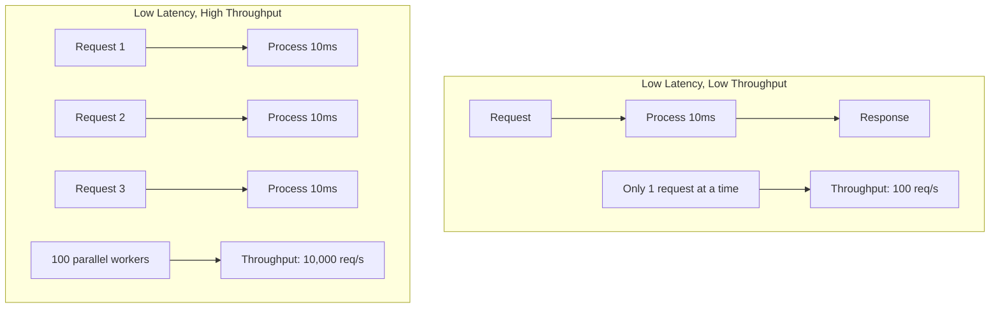
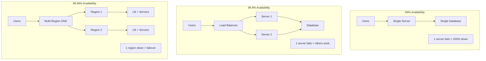
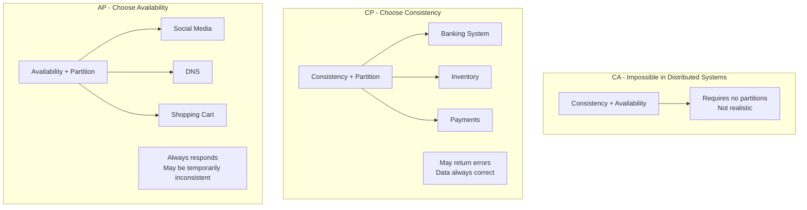
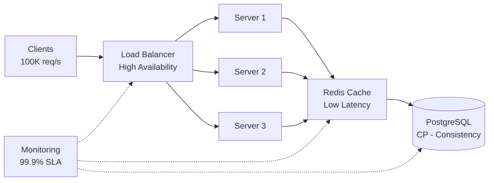

# Khái Niệm Quan Trọng Trong System Design

Sau khi học về components, communication patterns, và data flow, giờ là lúc consolidate kiến thức với các concepts quan trọng nhất trong system design.

Tôi còn nhớ lần đầu tiên PM hỏi: *"Hệ thống của chúng ta có 99.9% uptime không?"*

Tôi trả lời: *"Có chứ, server hiếm khi down mà."*

Anh ấy cười: *"Em biết 99.9% nghĩa là gì không? Và cost để đạt 99.99% là bao nhiêu?"*

Tôi im lặng. Đó là lúc tôi nhận ra: **Không hiểu rõ concepts = Không thể đưa ra decisions đúng.**

Lesson này sẽ đi sâu vào 4 concepts mà mọi architect phải nắm vững.

## Tại Sao Các Concepts Này Quan Trọng?

Trong system design interviews, bạn sẽ nghe:

*"Design một hệ thống với low latency và high throughput."*

Nếu bạn không hiểu rõ latency và throughput, bạn sẽ design sai. Hoặc worse, design đúng nhưng không explain được.

Trong real-world:
- **Latency** quyết định user experience
- **Throughput** quyết định system capacity
- **Availability** quyết định SLA với customers
- **CAP Theorem** quyết định database choices

**Hiểu concepts = Đưa ra informed decisions.**

## Latency vs Throughput: Hai Metrics Khác Nhau

### Định Nghĩa

**Latency (độ trễ):**
- Thời gian để xử lý **1 request**
- Đơn vị: milliseconds (ms)
- User perspective: "Bao lâu tôi phải đợi?"

**Throughput (thông lượng):**
- Số requests xử lý được **trong 1 giây**
- Đơn vị: requests/second (req/s) hoặc transactions/second (TPS)
- System perspective: "Hệ thống xử lý được bao nhiêu requests cùng lúc?"

### Tại Sao Phải Phân Biệt?

Nhiều người nghĩ: *"Latency thấp = Throughput cao."*

**Sai rồi.** Chúng là hai thứ độc lập.

### Real-World Analogy

**Xe bus:**
```
Latency: CAO (đợi bus, bus dừng nhiều điểm)
- Từ nhà đến công ty: 60 phút

Throughput: CAO (chở nhiều người cùng lúc)
- 1 bus chở 50 người
- 1 giờ có 10 chuyến = 500 người/giờ
```

**Taxi:**
```
Latency: THẤP (đi ngay, direct route)
- Từ nhà đến công ty: 20 phút

Throughput: THẤP (chỉ chở 4 người)
- 1 taxi chở 4 người
- 1 giờ có 3 chuyến = 12 người/giờ
```

### System Design Example

**Scenario 1: Batch Processing System**
```python
# Process 1000 images
for image in images:
    process(image)  # Takes 10 seconds each

Latency per image: 10 seconds (HIGH)
Total time: 1000 * 10s = 10,000s ≈ 2.8 hours
Throughput: 1000 / 10,000s = 0.1 images/second (LOW)
```

**Scenario 2: Parallel Processing**
```python
# Process 1000 images in parallel (100 workers)
workers = create_workers(100)
for worker in workers:
    worker.process(batch_of_10_images)

Latency per image: still 10 seconds
Total time: 1000 / 100 * 10s = 100s
Throughput: 1000 / 100s = 10 images/second (HIGH!)
```

**Lesson:** Tăng throughput bằng parallelization, nhưng latency per item không thay đổi.

### Diagram: Latency vs Throughput


*Latency = thời gian xử lý 1 request. Throughput = số lượng requests xử lý được đồng thời.*

### Trade-offs

**Optimize cho latency:**
```
Techniques:
- Caching (reduce DB calls)
- Database indexes
- CDN (reduce network latency)
- Code optimization

Cost:
- Complexity
- Infrastructure cost
```

**Optimize cho throughput:**
```
Techniques:
- Horizontal scaling (more servers)
- Async processing (queues)
- Connection pooling
- Load balancing

Cost:
- More servers = higher cost
- Distributed system complexity
```

### Khi Nào Ưu Tiên Cái Nào?

**Prioritize Latency khi:**
- User-facing features (API response, page load)
- Real-time applications (gaming, video calls)
- User experience critical

**Prioritize Throughput khi:**
- Batch processing (data pipelines)
- Background jobs
- High-volume systems (millions of requests)

**Ideal:** Low latency AND high throughput. Nhưng thường phải trade-off.

### Personal Insight

Tôi từng optimize một API từ 500ms xuống 50ms (10x latency improvement).

Users happy? Yes.

Nhưng throughput vẫn chỉ 1000 req/s. Khi traffic spike đến 5000 req/s → System overwhelmed.

**Lesson learned:** Optimize cả hai. Nhưng biết đâu là bottleneck thực sự.

## Availability: Bao Nhiêu "Nines" Bạn Cần?

### Định Nghĩa

**Availability (tính khả dụng):** Phần trăm thời gian hệ thống hoạt động bình thường.
```
Availability = Uptime / (Uptime + Downtime)
```

### Availability Levels

| Level | Availability | Downtime/năm | Downtime/tháng | Use Case |
|-------|-------------|--------------|----------------|----------|
| 90% | 90% | 36.5 ngày | 3 ngày | Development/Testing |
| 99% | "Two nines" | 3.65 ngày | 7.2 giờ | Internal tools |
| 99.9% | "Three nines" | 8.76 giờ | 43 phút | E-commerce |
| 99.99% | "Four nines" | 52 phút | 4.3 phút | Banking, Payments |
| 99.999% | "Five nines" | 5.26 phút | 26 giây | Mission-critical |

### Tại Sao Mỗi "9" Lại Quan Trọng?

**99% vs 99.9%:**
```
99%: 7.2 giờ downtime/tháng
→ Có thể down entire working day
→ Acceptable cho internal admin tool

99.9%: 43 phút downtime/tháng
→ Down < 1 giờ/tháng
→ Minimum cho customer-facing apps
```

**99.9% vs 99.99%:**
```
99.9%: 43 phút downtime/tháng
→ Weekly maintenance window OK

99.99%: 4.3 phút downtime/tháng
→ Không thể schedule maintenance
→ Need zero-downtime deployments
```

### Cost of Each "9"

**Critical truth:** Mỗi "9" thêm vào, cost tăng gấp đôi (hoặc hơn).
```
99%: 
- 1 server
- No redundancy
- Cost: $100/month

99.9%:
- Multiple servers
- Load balancer
- Monitoring
- Cost: $500/month

99.99%:
- Multi-region deployment
- Auto-failover
- 24/7 on-call team
- Cost: $5,000/month

99.999%:
- Global infrastructure
- Chaos engineering
- Dedicated SRE team
- Cost: $50,000+/month
```

### Câu Hỏi Tư Duy Quan Trọng

**"Bạn THỰC SỰ cần bao nhiêu nines?"**
```
Wrong thinking:
"Chúng ta cần 99.999% vì muốn best"

Right thinking:
"Chúng ta cần 99.9% vì:
- E-commerce site
- Downtime 43 phút/tháng acceptable
- Customers không bị impact lớn
- Cost 99.99% tăng 10x nhưng benefit chỉ thêm 40 phút/tháng"
```

### Real-World Examples

**Stripe (Payments):**
- Target: 99.99%+ (4 nines)
- Why? Financial transactions, customers rely on it
- Cost: Worth it vì downtime = lost revenue cho merchants

**Personal Blog:**
- Target: 99% is fine
- Why? Không critical, readers có thể quay lại
- Cost: Save money cho infrastructure

**Netflix:**
- Target: 99.9%+
- Why? Customer-facing entertainment
- Strategy: Graceful degradation (một số features fail, app vẫn work)

### How to Achieve High Availability

**Building blocks:**

1. **Redundancy**
```
Single server: 1 fails = 100% down
Multiple servers: 1 fails = others take over
```

2. **Load Balancing**
```
Distribute traffic → No single point of failure
```

3. **Health Checks**
```
Detect failures fast → Route traffic away
```

4. **Auto-scaling**
```
Handle traffic spikes → Don't overload
```

5. **Multi-region Deployment**
```
1 region down → Failover to another region
```

6. **Monitoring & Alerting**
```
Detect issues before users notice
```

### Diagram: Availability Architecture


*Càng nhiều "9", càng cần redundancy và complexity.*

### My Strong Opinion

**Don't over-engineer.**

Start với 99.9%. Đủ cho hầu hết businesses.

Chỉ aim 99.99%+ khi:
- Proven need (customers complain about downtime)
- Financial impact rõ ràng
- Budget supports it

Remember: **Perfect availability is impossible.** Even AWS, Google có outages.

## CAP Theorem: Chọn 2 Trong 3

### Định Nghĩa

CAP Theorem nói rằng trong một distributed system, bạn chỉ có thể guarantee 2/3:

- **C (Consistency):** Mọi read nhận được write gần nhất (hoặc error)
- **A (Availability):** Mọi request nhận được response (không error)
- **P (Partition Tolerance):** Hệ thống hoạt động khi có network partition

### Tại Sao Chỉ Chọn Được 2?

**Critical insight:** Network partitions LUÔN xảy ra trong distributed systems.
```
Server A <--X--> Server B
(Network partition: không communicate được)

Khi partition xảy ra, bạn PHẢI chọn:
- Consistency: Reject requests until partition healed
- Availability: Accept requests nhưng data có thể inconsistent
```

**Vì P (Partition Tolerance) là MUST → Thực tế bạn chỉ chọn giữa C hoặc A.**

### CP Systems: Consistency + Partition Tolerance

**Behavior:**
```
Network partition xảy ra
→ System reject writes to maintain consistency
→ Users see errors
→ When partition healed, data consistent
```

**Examples:**
- Banking systems
- Payment processing
- Inventory management (prevent overselling)
- HBase, MongoDB (trong một số config)

**Trade-off:**
```
Data always correct
Lower availability (errors during partition)
```

**Use case:**
```
Bank account balance
User A: Withdraw $100
User B: Check balance

CP ensures:
→ Balance always correct
→ No phantom money
→ May show error temporarily
```

### AP Systems: Availability + Partition Tolerance

**Behavior:**
```
Network partition xảy ra
→ System accepts reads/writes on both sides
→ Users never see errors
→ When partition healed, data may conflict
```

**Examples:**
- Social media feeds (Facebook, Twitter)
- DNS
- Cassandra, DynamoDB
- Shopping carts

**Trade-off:**
```
Always available
Eventual consistency (temporary inconsistency)
```

**Use case:**
```
Facebook like count
User A sees: 100 likes
User B sees: 99 likes (different datacenter)

AP allows:
→ Both users see data
→ Counts eventually sync
→ Temporary inconsistency acceptable
```

### Diagram: CAP Trade-offs


*Trong distributed systems, network partition luôn xảy ra → chọn C hoặc A.*

### How to Choose?

**Framework:**
```python
def choose_cap_model(feature):
    if financial_transaction(feature):
        return "CP"  # Correctness critical
    
    if user_can_tolerate_stale_data(feature):
        return "AP"  # Availability critical
    
    if strong_consistency_required(feature):
        return "CP"
    
    return "AP"  # Default: availability usually better UX
```

**Questions to ask:**

1. **Nếu data sai, user bị impact như thế nào?**
   - Critical (money, inventory) → CP
   - Minor (like counts, views) → AP

2. **Nếu system down, user bị impact như thế nào?**
   - Cannot function → AP
   - Can wait → CP

3. **User nhận biết được inconsistency không?**
   - Yes và care → CP
   - No hoặc don't care → AP

### Real-World Examples

**E-commerce Product Page:**
```
Product info: AP
- Product description, images
- Eventual consistency OK
- User experience: always loads

Inventory count: CP
- Must be accurate to prevent overselling
- Better show "out of stock" than sell what you don't have

Shopping cart: AP
- User adds items, see immediately
- Cart can be eventually consistent across devices
```

**Banking App:**
```
Account balance: CP
- Must be accurate always
- OK to show error during maintenance
- Never show incorrect balance

Transaction history: CP
- Must be correct and ordered
- Financial audit trail

ATM locations: AP
- Can be eventually consistent
- Stale data not critical
```

### My Personal Framework

**90% of features can be AP.** Users prefer working (even if slightly stale) over errors.

Only go CP when:
- Money involved
- Inventory/resource booking
- Legal/audit requirements

**Common mistake:** Over-applying CP. Developers think *"must be consistent"* cho mọi feature.

**Reality:** Facebook feed không cần CP. Instagram likes không cần CP. Email read count không cần CP.

**Ask yourself:** *"Điều gì xấu nhất xảy ra nếu data sai 5 giây?"*

Nếu answer là *"không có gì nghiêm trọng"* → AP is fine.

## Kết Hợp Các Concepts

Các concepts này không độc lập. Chúng interact với nhau.

### Example: Design High-Traffic API

**Requirements:**
- Handle 100,000 req/s (throughput)
- Response time < 100ms (latency)
- 99.9% uptime (availability)
- Financial transactions (need consistency)

**Design decisions:**
```
Throughput requirement (100K req/s):
→ Need horizontal scaling
→ Multiple app servers
→ Load balancing

Latency requirement (< 100ms):
→ Need caching layer
→ Database indexes
→ Optimized queries

Availability requirement (99.9%):
→ Multi-server deployment
→ Health checks
→ Auto-failover

Consistency requirement (CP):
→ Strong consistency database
→ ACID transactions
→ May sacrifice some availability during partitions
```

**Trade-offs:**
```
High throughput + Low latency:
→ Need caching (complexity)
→ More infrastructure (cost)

High availability + Strong consistency:
→ Conflict in CAP theorem
→ Choose consistency (CP)
→ Accept occasional unavailability
```

### Diagram: Integrated System Design


*Mỗi component address một yếu tố khác nhau: throughput, latency, availability, consistency.*

## Key Takeaways

**Latency vs Throughput:**
- **Latency:** Thời gian xử lý 1 request
- **Throughput:** Số requests xử lý/giây
- Hai metrics độc lập, optimize riêng
- Thường phải trade-off giữa hai

**Availability:**
- **99%:** 7.2h down/tháng - internal tools
- **99.9%:** 43 phút down/tháng - e-commerce
- **99.99%:** 4.3 phút down/tháng - banking
- Mỗi "9" cost tăng gấp đôi
- Don't over-engineer: chọn level phù hợp với business

**CAP Theorem:**
- **CP (Consistency + Partition):** Banking, payments
- **AP (Availability + Partition):** Social media, caching
- Network partitions luôn xảy ra → chọn C hoặc A
- Default AP cho hầu hết features

**Decision Framework:**
1. Đo requirements cụ thể (numbers, not feelings)
2. Hiểu trade-offs của mỗi choice
3. Choose based on business priorities
4. Monitor và adjust

**Quan trọng nhất:** Không có perfect solution. Hiểu concepts → Make informed trade-offs.
