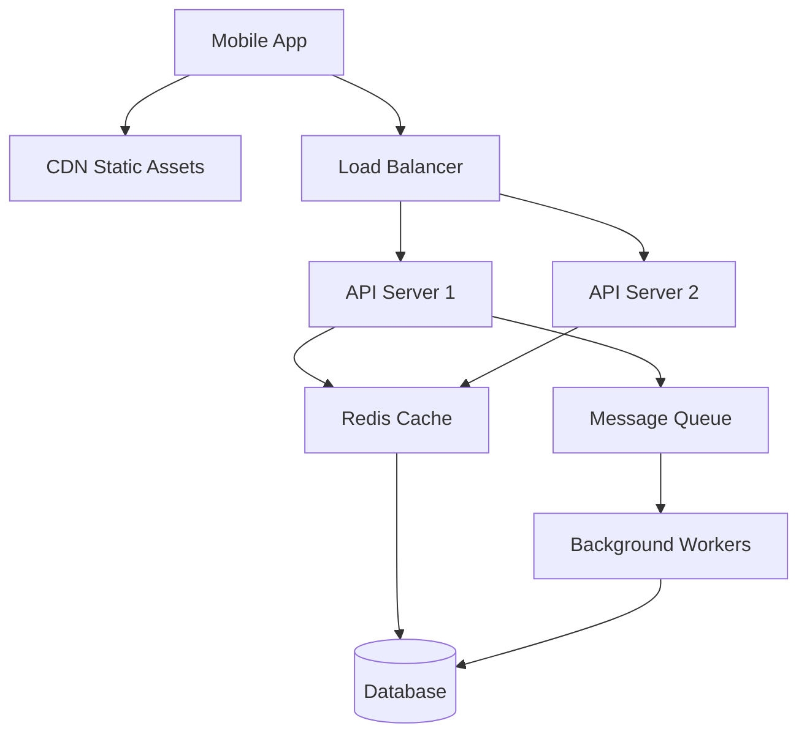
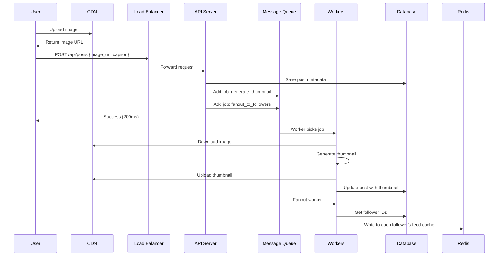
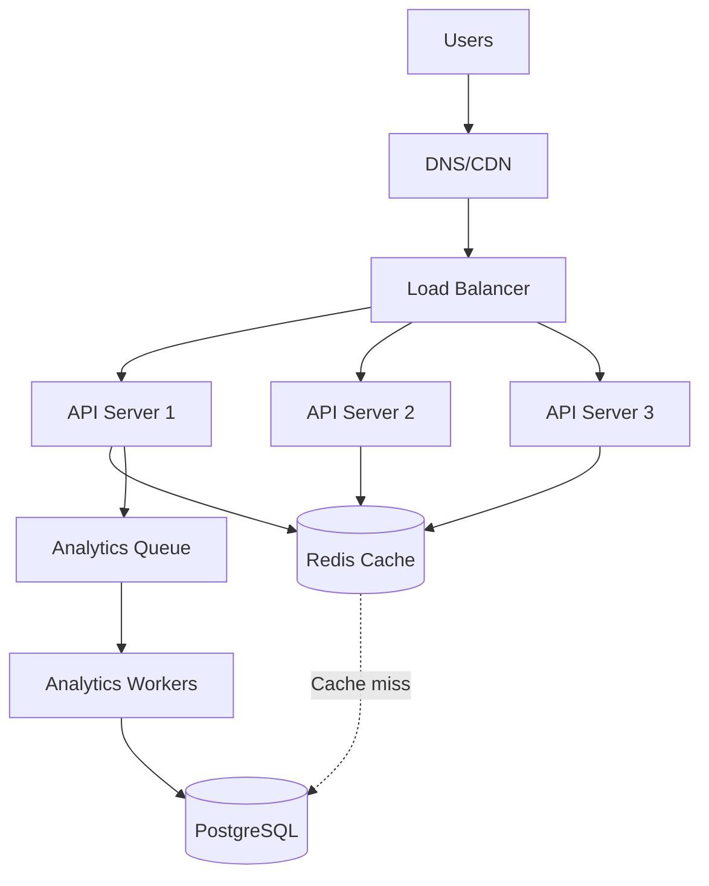
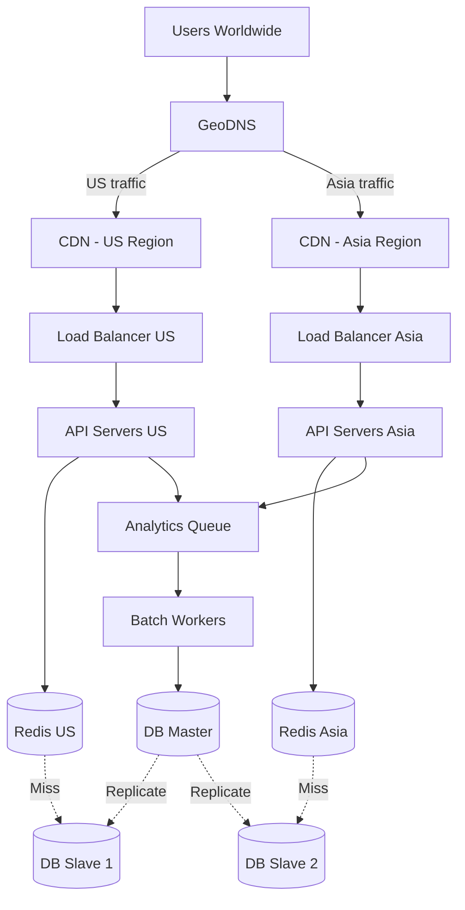
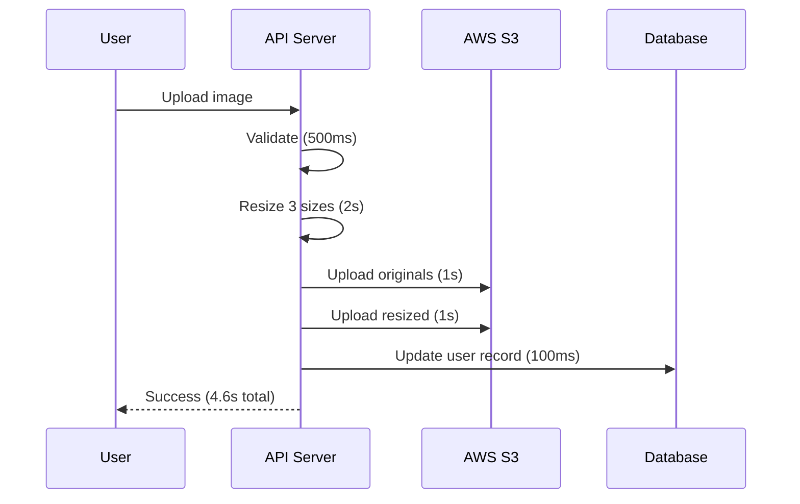
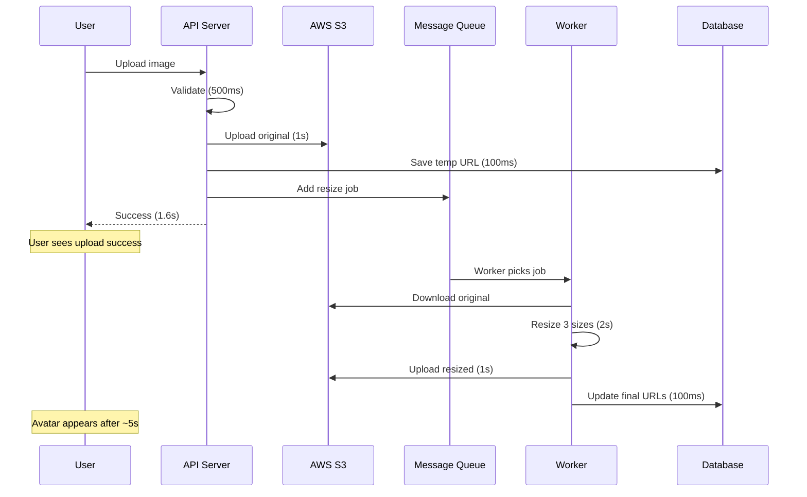

# Bài Tập Tổng Hợp: Từ Theory Đến Practice

Chúc mừng bạn đã hoàn thành tất cả lessons trong Phase 1!

Bạn đã học về components, communication patterns, data flow, và các khái niệm quan trọng như latency, throughput, CAP theorem.

Nhưng có một sự thật mà tôi phải nói thẳng: **Đọc hiểu ≠ Làm được.**

Tôi từng có một mentee đọc xong tất cả tài liệu, nói "Em hiểu hết rồi!" Nhưng khi tôi cho một bài tập đơn giản: "Thiết kế URL shortener", anh ta ngồi im 20 phút không biết bắt đầu từ đâu.

**Why?** Vì thiếu practice. Thiếu apply concepts vào real scenarios.

Lesson này sẽ fix điều đó. Ba bài tập được thiết kế để:
1. **Force bạn think như architect** (không còn copy-paste solutions)
2. **Apply tất cả concepts đã học** (components, data flow, trade-offs)
3. **Build confidence** (sau khi làm xong, bạn sẽ thấy "Mình làm được đấy!")

Đừng skip. Đây là phần quan trọng nhất của Phase 1.

## Cách Làm Bài Tập Hiệu Quả

**Rules:**

1. **Không Google ngay** - Thử think 15 phút trước
2. **Vẽ ra giấy/whiteboard** - Drawing forces clarity
3. **Explain cho người khác** - Hoặc rubber duck
4. **Compare với solution** - Sau khi làm xong
5. **Iterate** - Làm lại với approach khác

**Mindset:**

Không có "đúng/sai" absolute. Chỉ có "fit/không fit" với context.

Nếu bạn có reasoning tốt cho decisions, đó là good design.

## Bài 1: Phân Tích Hệ Thống Thực Tế

### Mục Tiêu

Develop system-level thinking bằng cách reverse engineer một app bạn dùng hàng ngày.

### Đề Bài

Chọn **1 app** bạn hay dùng:
- Facebook
- Instagram  
- Shopee
- Grab
- TikTok

**Nhiệm vụ:**

#### Part A: Vẽ Sơ Đồ Components

Identify và vẽ:
```
1. Client (web/mobile app)
2. Load balancer(s)
3. Application servers
4. Cache layer(s)
5. Database(s)
6. CDN (nếu có)
7. Message queues (nếu có)
```

**Example structure:**


**Tips:**

Hãy suy luận dựa trên:
- **Scale** - Bao nhiêu users? → Cần cache, LB, multiple servers
- **Features** - Real-time chat? → WebSocket servers, message queue
- **Performance** - Load nhanh? → CDN, aggressive caching

#### Part B: Trace Data Flow

Pick **1 user action** và trace từ đầu đến cuối.

**Examples:**
- **Instagram:** User posts a photo
- **Shopee:** User places an order
- **Grab:** User books a ride

**Format:**
```
1. User action: [Describe]

2. Request flow:
   Client → Component A → Component B → Component C

3. Data transformations:
   - At Component A: [What happens]
   - At Component B: [What happens]
   - At Component C: [What happens]

4. Response flow:
   Component C → Component B → Component A → Client

5. Async processes (if any):
   - Background job X
   - Notification Y
```

**Example: Instagram Post Photo**


**Analysis:**
```
Sync part (200ms):
- Upload image to CDN
- Save post metadata
- Add jobs to queue
- Return success

Async part (1-2 minutes):
- Generate thumbnails
- Distribute to followers' feeds
- Send notifications

Why async? 
- User doesn't need to wait for thumbnail
- Followers don't need instant update
- Can handle millions of followers
```

#### Part C: Dự Đoán Bottlenecks

Based on sơ đồ của bạn, identify:

**1. Current bottleneck (at normal load):**
```
Component: [?]
Reason: [Why is this slow?]
Evidence: [How do you know?]
```

**2. Future bottleneck (at 10x scale):**
```
Component: [?]
Reason: [What will break first?]
Impact: [What happens when it breaks?]
```

**3. Solutions:**
```
Short-term: [Quick fix]
Long-term: [Proper solution]
Trade-offs: [What do we sacrifice?]
```

### Giải Mẫu Tham Khảo

**Example: Shopee - User Places Order**

**Components:**
```
Client: Mobile app
CDN: Product images, static assets
Load Balancer: Distribute traffic
API Servers: Order processing (10+ servers)
Cache: Redis (product info, inventory)
Databases:
  - Product DB (read replicas)
  - Order DB (master-slave)
  - User DB (master-slave)
Message Queue: RabbitMQ
Workers: Payment processing, notification
```

**Data Flow:**
```
1. User clicks "Place Order"

2. Request:
   App → LB → API Server

3. API Server:
   - Validate cart items (from cache)
   - Check inventory (Redis)
   - Create order (Order DB)
   - Reserve inventory (decrease count)
   - Add to payment queue
   - Return order_id

4. Response:
   API → LB → App (show "Processing...")

5. Async:
   - Payment worker charges card
   - If success: Update order status
   - If fail: Release inventory, notify user
   - Notification worker sends email/SMS
```

**Bottlenecks:**
```
Current:
- Inventory check (Redis)
- Many concurrent users checking same products
- Solution: Optimistic locking

At 10x scale:
- Order DB writes (master bottleneck)
- Solution: Shard by user_id or order_id
- Trade-off: Cross-shard queries harder
```

### Self-Check

Bạn pass bài này khi:

- [ ] Diagram có ít nhất 5 components rõ ràng
- [ ] Data flow logical và complete
- [ ] Bottleneck predictions có reasoning
- [ ] Solutions có trade-off analysis

## Bài 2: Design URL Shortener (bit.ly)

### Mục Tiêu

Thiết kế một hệ thống hoàn chỉnh từ requirements đến implementation details.

### Requirements

**Functional:**
- User submits long URL → System returns short URL
- User clicks short URL → Redirect to original URL
- Custom short URLs (optional)

**Non-functional:**
- **Write:** 1 million URLs shortened/day
- **Read:** 100 million redirects/day  
- **Latency:** < 10ms for redirects
- **Availability:** 99.9%

### Part A: Capacity Estimation

Calculate để understand scale.

**Write (Shorten):**
```
1M URLs/day
= 1M / (24 * 3600) 
≈ 12 URLs/second

Peak (3x average): 36 URLs/second

Conclusion: Write is light, easy to handle
```

**Read (Redirect):**
```
100M redirects/day
= 100M / (24 * 3600)
≈ 1,157 requests/second

Peak (3x): ~3,500 requests/second

Conclusion: Read-heavy (100:1 ratio) → Cache-friendly
```

**Storage:**
```
1 URL mapping ≈ 500 bytes
1M URLs/day * 365 days * 5 years = 1.825B URLs
1.825B * 500 bytes ≈ 912 GB ≈ 1 TB

Conclusion: Storage không phải vấn đề
```

### Part B: API Design

Define clear interfaces.
```
POST /api/shorten
Request:
{
  "long_url": "https://example.com/very/long/url",
  "custom_alias": "mylink" (optional)
}

Response:
{
  "short_url": "https://short.ly/abc123",
  "long_url": "https://example.com/very/long/url",
  "created_at": "2024-01-15T10:30:00Z"
}

---

GET /{short_code}
Response: 302 Redirect to long_url
```

### Part C: Core Problem - Generate Short Code

**Challenge:** Convert long URL → short unique code

**Option 1: Hash-based**
```python
import hashlib

def generate_short_code(long_url):
    hash_value = hashlib.md5(long_url.encode()).hexdigest()
    short_code = hash_value[:7]  # Take first 7 chars
    return short_code

# Example:
# "https://example.com/long/url" → "a3f8c2b"
```

**Analysis:**
```
Deterministic (same URL → same code)
Collision possible
Need to check DB for duplicates
Predictable (security issue)
```

**Option 2: Auto-increment + Base62 Encode**
```python
BASE62 = "0123456789abcdefghijklmnopqrstuvwxyzABCDEFGHIJKLMNOPQRSTUVWXYZ"

def encode_base62(num):
    if num == 0:
        return BASE62[0]
    
    result = []
    while num:
        result.append(BASE62[num % 62])
        num //= 62
    return ''.join(reversed(result))

# Example:
# ID 1 → "1"
# ID 62 → "10" 
# ID 1000000 → "4c92"
```

**Length calculation:**
```
62^6 = 56 billion combinations
62^7 = 3.5 trillion combinations

With 6 characters: 56B URLs (enough!)
```

**Analysis:**
```
No collision (unique ID)
Short codes (6-7 chars)
Predictable order (can be feature or bug)
Sequential (might reveal volume)
```

**Recommendation:** Use Option 2 (Base62) cho simplicity và reliability.

### Part D: Database Schema
```sql
CREATE TABLE urls (
    id BIGSERIAL PRIMARY KEY,
    short_code VARCHAR(10) UNIQUE NOT NULL,
    long_url TEXT NOT NULL,
    created_at TIMESTAMP DEFAULT NOW(),
    expires_at TIMESTAMP,
    user_id BIGINT,
    click_count INT DEFAULT 0,
    
    INDEX idx_short_code (short_code),
    INDEX idx_user_id (user_id)
);

CREATE TABLE clicks (
    id BIGSERIAL PRIMARY KEY,
    short_code VARCHAR(10) NOT NULL,
    clicked_at TIMESTAMP DEFAULT NOW(),
    ip_address VARCHAR(45),
    user_agent TEXT,
    referer TEXT,
    country VARCHAR(2),
    
    INDEX idx_short_code (short_code),
    INDEX idx_clicked_at (clicked_at)
);
```

**Why this design:**

- **urls:** Core data, need fast lookup by short_code
- **clicks:** Analytics data, can be separate (won't slow down redirects)
- **Indexes:** Critical for performance
- **click_count:** Denormalized for quick display

### Part E: Architecture Design


**Flow: Shorten URL**
```
1. User → POST /api/shorten
2. API Server:
   - Generate ID (auto-increment)
   - Encode to Base62
   - Save to DB
   - Return short URL
3. Time: ~50ms
```

**Flow: Redirect**
```
1. User → GET /abc123
2. API Server:
   - Check Redis cache
   - If hit: Return long_url (5ms)
   - If miss: Query DB → Cache result → Return (50ms)
3. Log click event (async, don't wait)
4. 302 Redirect
```

**Caching Strategy:**
```python
def redirect(short_code):
    # 1. Try cache
    long_url = cache.get(f"url:{short_code}")
    if long_url:
        # Log async (fire and forget)
        analytics_queue.add({
            "short_code": short_code,
            "timestamp": now(),
            "ip": request.ip
        })
        return redirect_response(long_url)
    
    # 2. Cache miss → DB
    url_obj = db.query(
        "SELECT long_url FROM urls WHERE short_code = ?",
        short_code
    )
    
    if not url_obj:
        return 404
    
    # 3. Cache for next time
    cache.set(
        f"url:{short_code}",
        url_obj.long_url,
        ttl=86400  # 24 hours
    )
    
    # 4. Log async
    analytics_queue.add({...})
    
    return redirect_response(url_obj.long_url)
```

### Part F: Scale to 100M Clicks/Day

**Problem:**
```
100M clicks/day = 1,157 req/s (avg)
Peak: 3,500 req/s

Challenges:
1. Database read load
2. Cache capacity
3. Analytics writes
```

**Solutions:**

**1. Database Reads:**
```
Problem: 3,500 req/s * 50ms = 175 concurrent queries

Solution A: Add read replicas (3 slaves)
- Distribute reads across replicas
- Each handles ~1,200 req/s → Easy

Solution B: Aggressive caching (99% hit rate)
- Only 1% goes to DB = 35 req/s
- Very manageable
```

**2. Cache Strategy:**
```
Cache hot URLs:
- 80/20 rule: 20% URLs get 80% traffic
- Cache top 1M URLs
- Memory: 1M * 500 bytes = 500 MB
- Cheap, fast

LRU eviction:
- Auto-remove least recently used
- Always keep hot data
```

**3. Analytics:**
```
Problem: 3,500 writes/second to clicks table

Solution: Async queue + batch writes
- Buffer clicks in queue
- Worker batch insert every 10 seconds
- Reduces DB writes by 10x

Trade-off: Analytics delayed by ~10s (acceptable)
```

**Final Architecture:**


**Why this works:**

- **GeoDNS:** Route users to nearest region → Low latency
- **CDN:** Cache redirects at edge → Ultra fast
- **Multiple regions:** High availability
- **Redis cache:** 99% hit rate → Minimal DB load
- **Read replicas:** Scale reads easily
- **Async analytics:** Don't slow down redirects

### Self-Check

Bạn pass bài này khi:

- [ ] Capacity estimation có calculations rõ ràng
- [ ] API design clean và RESTful
- [ ] Database schema có indexes đúng chỗ
- [ ] Architecture handle được scale requirements
- [ ] Có explain trade-offs của decisions

## Bài 3: Trade-off Analysis - User Upload Avatar

### Mục Tiêu

Practice so sánh approaches và make informed decisions.

### Context

Feature: User uploads avatar (profile picture)

**Processing needed:**
- Validate image (format, size)
- Resize to multiple sizes (thumbnail, medium, large)
- Upload to S3
- Update user record

### Approach A: Synchronous


**Implementation:**
```python
@app.route('/upload-avatar', methods=['POST'])
def upload_avatar_sync():
    # 1. Validate
    if not is_valid_image(request.file):
        return error(400, "Invalid image")
    
    # 2. Resize
    thumbnail = resize(request.file, 100, 100)
    medium = resize(request.file, 300, 300)
    large = resize(request.file, 600, 600)
    
    # 3. Upload to S3
    original_url = s3.upload(request.file)
    thumbnail_url = s3.upload(thumbnail)
    medium_url = s3.upload(medium)
    large_url = s3.upload(large)
    
    # 4. Update DB
    db.update_user(user_id, {
        'avatar_original': original_url,
        'avatar_thumbnail': thumbnail_url,
        'avatar_medium': medium_url,
        'avatar_large': large_url
    })
    
    # 5. Return
    return success({
        'avatar_url': thumbnail_url
    })
    
# User waits 4.6 seconds
```

### Approach B: Asynchronous


**Implementation:**
```python
@app.route('/upload-avatar', methods=['POST'])
def upload_avatar_async():
    # 1. Quick validation
    if not is_valid_image(request.file):
        return error(400, "Invalid image")
    
    # 2. Upload original only
    original_url = s3.upload(request.file)
    
    # 3. Save temp state
    db.update_user(user_id, {
        'avatar_original': original_url,
        'avatar_status': 'processing'
    })
    
    # 4. Queue background job
    queue.add_job('resize_avatar', {
        'user_id': user_id,
        'original_url': original_url
    })
    
    # 5. Return immediately
    return success({
        'avatar_url': original_url,
        'status': 'processing'
    })

# User waits 1.6 seconds

# Background worker (separate process)
def resize_avatar_worker(job):
    # Download
    image = s3.download(job['original_url'])
    
    # Resize
    thumbnail = resize(image, 100, 100)
    medium = resize(image, 300, 300)
    large = resize(image, 600, 600)
    
    # Upload
    thumbnail_url = s3.upload(thumbnail)
    medium_url = s3.upload(medium)
    large_url = s3.upload(large)
    
    # Update DB
    db.update_user(job['user_id'], {
        'avatar_thumbnail': thumbnail_url,
        'avatar_medium': medium_url,
        'avatar_large': large_url,
        'avatar_status': 'completed'
    })
```

### Part A: Comparative Analysis

**Latency:**
```
Synchronous:
- User waits: 4.6 seconds
- Perceived speed: Slow
- Timeout risk: High (if > 30s)

Asynchronous:
- User waits: 1.6 seconds (65% faster)
- Perceived speed: Fast
- Timeout risk: Low
```

**User Experience:**
```
Synchronous:
Immediate result
Simple UX (upload → done)
Long wait time
Progress bar needed
User can't do anything else

Asynchronous:
Fast feedback
Can continue using app
Delayed result
Need to show "processing" state
Need to handle refresh (state persistence)
```

**Complexity:**
```
Synchronous:
Simple code
Easy to debug
No infrastructure needed
Hard to scale (blocks server thread)

Asynchronous:
Scalable (handle traffic spikes)
Server threads freed up
More complex code
Need message queue infrastructure
Error handling harder (retry logic)
Need monitoring
```

**Error Handling:**
```
Synchronous:
- Error → Return to user immediately
- User can retry
- Simple rollback

Asynchronous:
- Error → User already got success response
- Need notification system
- Complex retry logic
- Partial state handling
```

### Part B: Decision Framework

**Choose Synchronous when:**
```
Processing is fast (< 2 seconds)
User needs immediate confirmation
Simple use case
Low traffic
Team small (can't maintain complex infrastructure)

Examples:
- Form submission
- Simple CRUD operations
- User login
```

**Choose Asynchronous when:**
```
Processing is slow (> 3 seconds)
User can wait for result
High traffic (need to handle spikes)
Multiple expensive operations
Can tolerate eventual consistency

Examples:
- File uploads with processing
- Report generation
- Email sending
- Video transcoding
- Data import/export
```

### Part C: Hybrid Approach (Best of Both Worlds)

**Strategy: Quick sync + Deep async**
```python
@app.route('/upload-avatar', methods=['POST'])
def upload_avatar_hybrid():
    # SYNC: Fast operations
    if not is_valid_image(request.file):
        return error(400)
    
    original_url = s3.upload(request.file)
    
    # Generate quick thumbnail (500ms)
    quick_thumb = resize_fast(request.file, 100, 100)
    thumb_url = s3.upload(quick_thumb)
    
    # Update with quick thumbnail
    db.update_user(user_id, {
        'avatar_thumbnail': thumb_url,
        'avatar_status': 'processing'
    })
    
    # ASYNC: Quality resizes
    queue.add_job('resize_hq_avatar', {
        'user_id': user_id,
        'original_url': original_url
    })
    
    return success({
        'avatar_url': thumb_url,
        'status': 'processing'
    })

# User sees low-quality avatar immediately
# High-quality versions replace after few seconds
```

**Why this is often best:**
```
Fast user feedback (2s)
Something to show immediately
Better quality eventually
Handles traffic spikes
More complex implementation
```

### Part D: Real-World Example

**What does Facebook/Instagram do?**

**Instagram approach:**
```
1. User uploads photo
2. Instant upload to CDN (original)
3. Show original immediately (may be large)
4. Background: Process filters, generate sizes
5. Swap to processed version when ready
6. User sees progress: "Processing..." → Done

Why?
- 1B+ users → Must be async
- User engagement > Perfect quality
- Can't make user wait 10 seconds
```

**Key insight:** User experience > Technical perfection.

### Self-Check

Bạn pass bài này khi:

- [ ] So sánh được latency của 2 approaches
- [ ] Explain UX differences clearly
- [ ] Understand complexity trade-offs
- [ ] Có decision framework rõ ràng
- [ ] Can propose hybrid approach

## Checklist Tổng Hợp Phase 1

Sau khi hoàn thành 3 bài tập, đánh giá bản thân:

### Core Understanding

- [ ] **Tôi có thể vẽ architecture diagram** của bất kỳ app nào tôi dùng
  - Test: Chọn 1 app random, vẽ trong 10 phút
  
- [ ] **Tôi hiểu bottleneck và cách tìm**
  - Test: Given diagram, identify bottleneck và explain why

- [ ] **Tôi có thể trace data flow** từ client đến database
  - Test: Explain flow của 1 user action bất kỳ

- [ ] **Tôi hiểu sync vs async trade-offs**
  - Test: Given feature, choose approach và defend decision

### Practical Skills

- [ ] **Tôi có thể estimate capacity**
  - Test: Calculate QPS, storage cho requirements
  
- [ ] **Tôi có thể design API**
  - Test: Define endpoints cho 1 feature

- [ ] **Tôi có thể design database schema**
  - Test: Create tables với proper indexes

- [ ] **Tôi biết khi nào cần cache**
  - Test: Identify cacheable data và TTL strategy

### Concept Mastery

- [ ] **Tôi hiểu Latency vs Throughput**
  - Test: Explain difference với real example

- [ ] **Tôi hiểu Availability tính toán**
  - Test: Calculate downtime cho 99.9% vs 99.99%

- [ ] **Tôi hiểu CAP theorem** ở mức basic
  - Test: Given system, identify CA, CP, or AP

- [ ] **Tôi có thể analyze trade-offs**
  - Test: Compare 2 approaches với pros/cons

### Scoring
```
10-12 checked: Excellent - Ready for Phase 2 ✅
7-9 checked: Good - Review weak areas, then move on
4-6 checked: Need more practice - Redo exercises
0-3 checked: Review Phase 1 content again
```

**Honest self-assessment is critical.** Don't rush.

## Common Mistakes & How to Fix

### Mistake 1: Over-Engineering

**Symptom:**
```
Bài URL shortener:
- Kubernetes cluster
- Microservices (5 services)
- Event sourcing
- CQRS
- Service mesh

For 1M URLs/day → Overkill!
```

**Fix:** Start simple. Prove need before adding complexity.

### Mistake 2: Under-Specifying

**Symptom:**
```
"Dùng database"
- SQL hay NoSQL?
- Schema như thế nào?
- Indexes ở đâu?
```

**Fix:** Be specific. Justify choices.

### Mistake 3: Ignoring Numbers

**Symptom:**
```
"Cần cache vì performance"
- Không tính QPS
- Không estimate hit rate
- Không tính memory needed
```

**Fix:** Always calculate. Numbers inform decisions.

### Mistake 4: No Trade-off Analysis

**Symptom:**
```
"Dùng approach A"
- Không mention downsides
- Không compare với alternatives
```

**Fix:** Every decision có trade-offs. State them.

## Next Steps

**Nếu pass checklist:**

🎉 Congratulations! Bạn đã complete Phase 1.

**Phase 2: Core Building Blocks** đang đợi bạn:
- Deep dive vào Cache strategies
- Database scaling patterns
- Message queues
- And more...

**Nếu chưa pass:**

Đừng rush. System design không phải race.

**Recommendations:**
1. Review Phase 1 lessons
2. Redo exercises với approach khác
3. Explain concepts cho người khác
4. Practice with more real apps
5. Revisit checklist sau 1 tuần

## Key Takeaways

**Practice > Theory**

Bạn có thể đọc 100 cuốn sách về system design, nhưng không practice thì vẫn không design được.

**Think, Don't Memorize**

Không có template cố định. Mỗi system khác nhau. Học cách think, không phải remember solutions.

**Trade-offs Everywhere**

Mọi decision có trade-offs. Good architect là người:
- Hiểu trade-offs
- Choose based on context
- Can defend decisions

**Start Simple, Iterate**

Best designs thường evolve từ simple designs. Don't over-engineer từ đầu.

**Numbers Matter**

Capacity estimation, QPS calculation, storage sizing - Không phải decoration. Chúng inform critical decisions.

---

Hãy dành thời gian với 3 bài tập này. Làm kỹ. Hiểu sâu.

Foundation vững = Everything sau dễ hơn.

Good luck! 🚀