# Load Balancing: Traffic Distribution Trong Distributed Systems

## TL;DR

- **Load balancing** là cơ chế phân phối traffic giữa nhiều instances để tăng **scalability** và **reliability**.
- Ở production, load balancer giúp giảm single point of failure, hỗ trợ zero-downtime deploy và giữ latency ổn định khi traffic tăng.
- Chọn thuật toán theo workload: `Round Robin`, `Least Connections`, `Weighted`, hoặc `IP Hash`.
- Với web/API hiện đại, Layer 7 thường là lựa chọn mặc định; Layer 4 phù hợp khi cần throughput cực cao hoặc non-HTTP protocols.

## What Is Load Balancing?

Load balancing trong system design là kỹ thuật phân phối request đến nhiều backend servers để tránh quá tải một node và tăng khả năng mở rộng hệ thống.

## Why Does Load Balancing Matter?

- Tăng khả năng chịu tải khi traffic tăng đột biến.
- Tăng độ sẵn sàng hệ thống khi một server bị lỗi.
- Giữ hiệu năng ổn định cho user trong môi trường distributed systems.
- Là nền tảng cho high-availability architecture trong production.

## When Should You Use It?

- Khi một server không còn đủ capacity cho throughput hiện tại.
- Khi cần giảm downtime khi deploy.
- Khi hệ thống có nhiều service hoặc nhiều vùng (multi-region).
- Khi muốn cải thiện reliability và performance ở quy mô production.

## How Does It Work?

1. Client gửi request đến load balancer.
2. Load balancer chọn backend server theo routing algorithm.
3. Request được forward đến server đã chọn.
4. Response trả về qua load balancer cho client.

## Trade-offs Cần Nắm

- Layer 4 nhanh hơn nhưng ít ngữ cảnh routing.
- Layer 7 linh hoạt hơn nhưng tốn thêm processing.
- Sticky session giúp stateful flow nhưng làm giảm phân phối đều.
- Thuật toán đơn giản dễ vận hành hơn nhưng có thể không tối ưu cho workload phức tạp.

## Key Terms (AI/SEO Quick Definitions)

- **Scalability:** khả năng hệ thống tăng công suất khi traffic tăng.
- **Reliability:** khả năng hệ thống tiếp tục hoạt động ổn định khi có lỗi.
- **Latency:** thời gian từ lúc gửi request đến khi nhận response.
- **Throughput:** số lượng request hệ thống xử lý được trong một đơn vị thời gian.

Bạn đã học components và communication patterns. Giờ là lúc đi sâu vào một trong những components quan trọng nhất: **Load Balancer**.

Tôi còn nhớ ngày Black Friday đầu tiên của startup tôi từng làm. Traffic tăng 50x. Single server? Chết ngay lập tức.

Chúng tôi panic add thêm 5 servers. Nhưng rồi nhận ra: **Làm sao traffic biết đi đến server nào?**

Đó là lúc tôi thực sự hiểu giá trị của load balancer. Không phải chỉ là "phân phối traffic". Mà là **làm cho distributed system hoạt động như một thể thống nhất**.

## Tại Sao Load Balancing Tồn Tại?

### Vấn Đề Cơ Bản: Single Server Limits
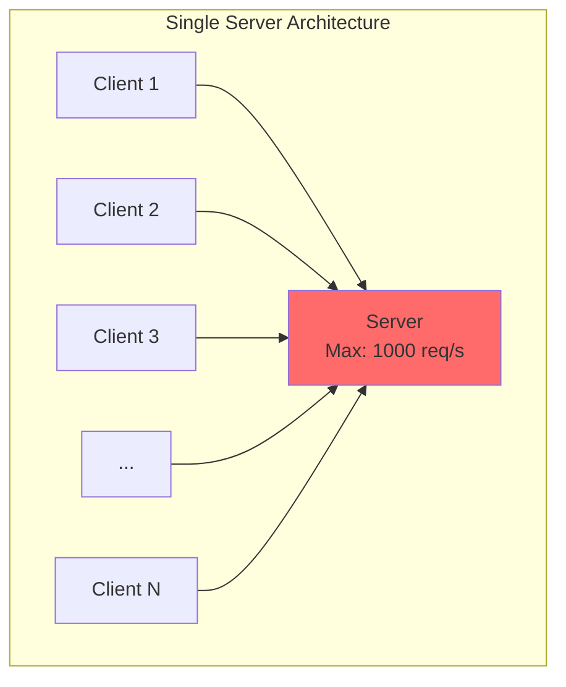

**Scenario thực tế:**
```
Server capacity: 1,000 requests/second
Normal traffic: 800 req/s (80% capacity) 
Black Friday traffic: 5,000 req/s 

Result:
- Response time: 200ms → 15 seconds
- Timeouts everywhere
- Server crash
- Revenue loss
```

### Solution 1: Vertical Scaling (Scale Up)
```
Upgrade server:
4 CPU cores → 16 cores
8GB RAM → 64GB RAM
Cost: $200/month → $1,200/month

Result: Handle 4,000 req/s
Problem: Vẫn thiếu 1,000 req/s
        Và... không thể upgrade mãi mãi
```

**Limitations:**
- Có giới hạn vật lý (không thể mua CPU vô hạn)
- Expensive (cost không linear)
- Single point of failure (server die = hệ thống chết)
- Downtime khi upgrade

### Solution 2: Horizontal Scaling (Scale Out)
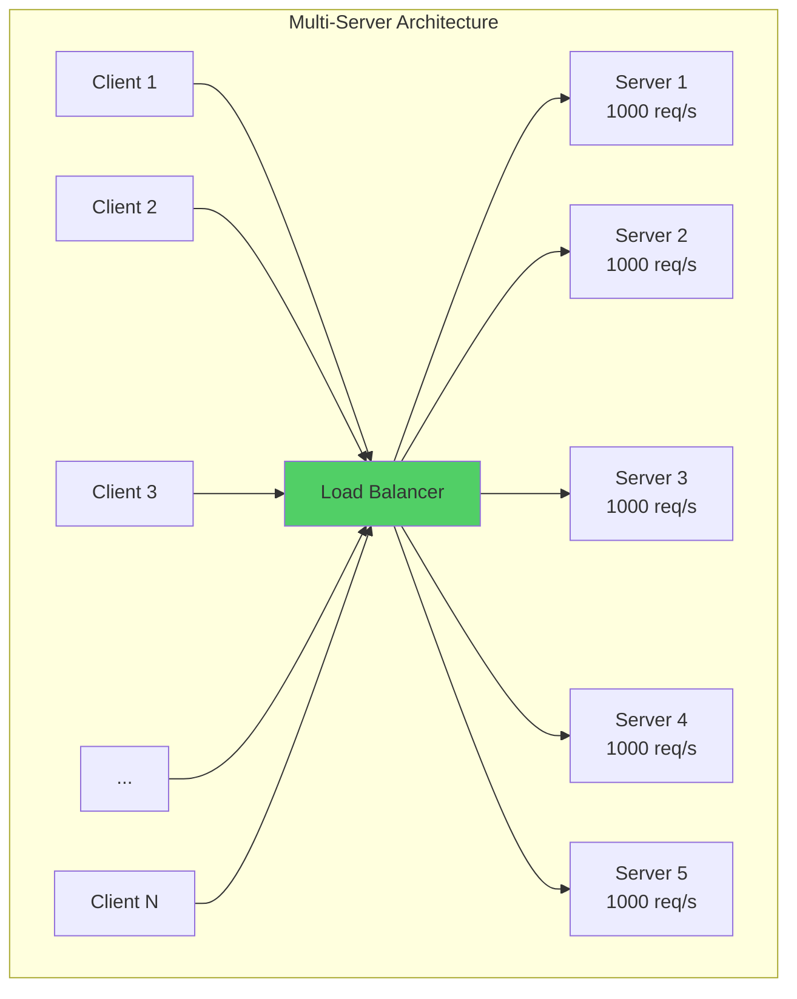

**Result:**
```
5 servers × 1,000 req/s = 5,000 req/s total capacity
Cost: 5 × $200 = $1,000/month
Can add more servers infinitely
```

**Nhưng có vấn đề:**

Với 5 servers, **client gửi request đến server nào?** 

Ai quyết định? Làm sao distribute đều?

→ Đó chính là **nhiệm vụ của Load Balancer**.

## Load Balancer Là Gì?

**Definition:** 

Load balancer là component ngồi giữa clients và servers, nhận tất cả incoming requests và phân phối chúng đều (hoặc thông minh) giữa multiple backend servers.

**Simple analogy:**

Imagine quầy check-in sân bay:
```
Khách hàng đến → Nhân viên điều phối → Quầy check-in
(clients)        (load balancer)      (servers)

Nhân viên: "Quầy 3 đang trống, mời anh qua đây"
```

**Technical flow:**
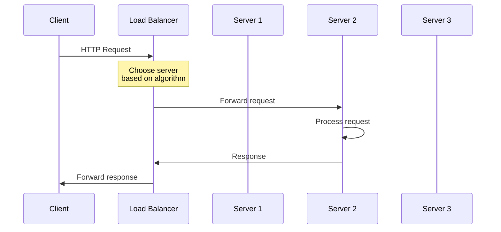

*Load balancer nhận request, chọn server theo algorithm, forward request, nhận response, return về client.*

## Benefits Của Load Balancing

### Benefit 1: Increased Capacity
```
Before: 1 server = 1,000 req/s
After:  10 servers = 10,000 req/s

Linear scaling (thêm server = thêm capacity)
```

### Benefit 2: High Availability
```mermaid
flowchart LR
    LB[Load Balancer]
    S1[Server 1<br/> Healthy]
    S2[Server 2<br/> Down]
    S3[Server 3<br/> Healthy]
    
    LB --> S1
    LB -.X S2
    LB --> S3
    
    style S2 fill:#ff6b6b
    style S1 fill:#51cf66
    style S3 fill:#51cf66
```

*Khi Server 2 die, load balancer tự động remove nó khỏi pool và route traffic đến servers còn lại.*

**Without LB:**
```
Server dies → Users get errors → Downtime
```

**With LB:**
```
Server dies → LB detects → Routes to healthy servers
→ Users không bị ảnh hưởng
→ Zero downtime
```

### Benefit 3: Zero-Downtime Deployment
```
Traditional deployment:
1. Stop server
2. Deploy new code
3. Start server
→ Downtime: 2-5 minutes

With Load Balancer:
1. Remove Server 1 from pool
2. Deploy to Server 1
3. Add Server 1 back
4. Repeat for Server 2, 3, 4, 5...
→ Downtime: 0 seconds
```

**Rolling deployment strategy:**
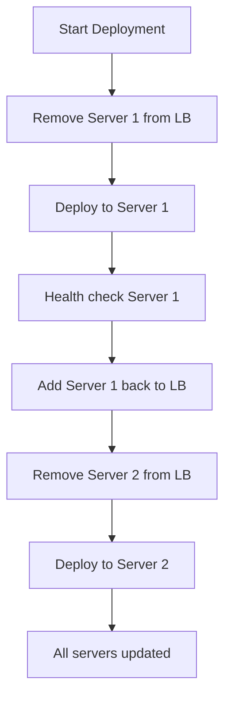

### Benefit 4: Geographic Distribution
```
Users in US → US Load Balancer → US Servers (low latency)
Users in Europe → EU Load Balancer → EU Servers (low latency)
Users in Asia → Asia Load Balancer → Asia Servers (low latency)
```

**Impact:**
```
Without geo-distribution:
User in Brazil → Server in Singapore → 400ms latency

With geo-distribution:
User in Brazil → Server in São Paulo → 20ms latency

20x improvement!
```

## Load Balancing Algorithms

Đây là phần quan trọng nhất: **Làm thế nào load balancer quyết định request nào đi server nào?**

### Algorithm 1: Round Robin

**How it works:**

Distribute requests tuần tự, mỗi server nhận một request theo vòng tròn.
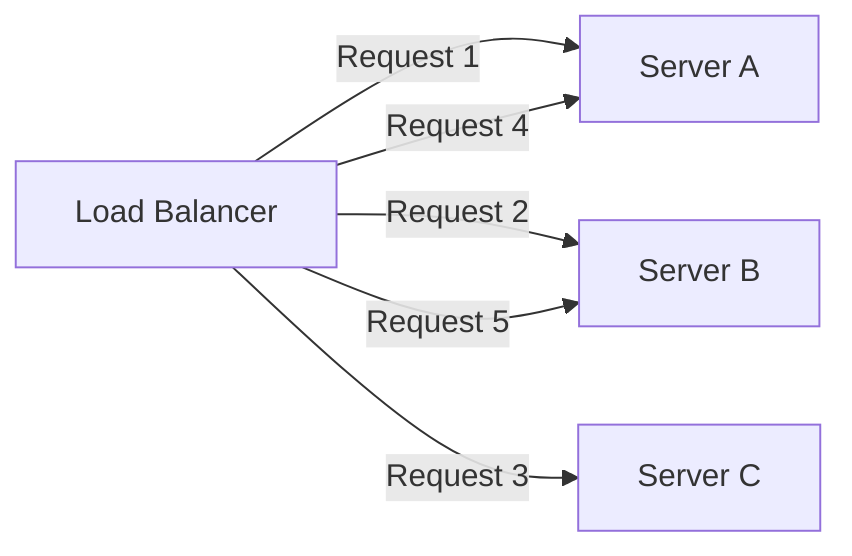

**Code concept:**
```python
servers = ['server_a', 'server_b', 'server_c']
current_index = 0

def get_next_server():
    global current_index
    server = servers[current_index]
    current_index = (current_index + 1) % len(servers)
    return server

# Request flow
get_next_server()  # → server_a
get_next_server()  # → server_b
get_next_server()  # → server_c
get_next_server()  # → server_a (cycle repeats)
```

**Ưu điểm:**

 Cực kỳ đơn giản
 Phân phối đều về số lượng requests
 Không cần track state
 Low overhead

**Nhược điểm:**

 Không quan tâm server load hiện tại
 Không biết request nào heavy, nhẹ
 Giả định tất cả requests và servers giống nhau

**Problem scenario:**
```
Request 1 → Server A: Upload 5GB file (takes 10 minutes)
Request 2 → Server B: Get user profile (takes 10ms)
Request 3 → Server C: Get user profile (takes 10ms)
Request 4 → Server A: Get user profile (waits behind upload...)

Server A: Overloaded (handling heavy request)
Server B, C: Idle (finished quick requests)

Round Robin không biết server A đang bận!
```

**Khi nào dùng:**

 Requests có execution time tương tự nhau
 Servers có specs giống nhau
 Simple use cases
 Default choice khi bắt đầu

### Algorithm 2: Least Connections

**How it works:**

Route request đến server có **ít active connections nhất**.
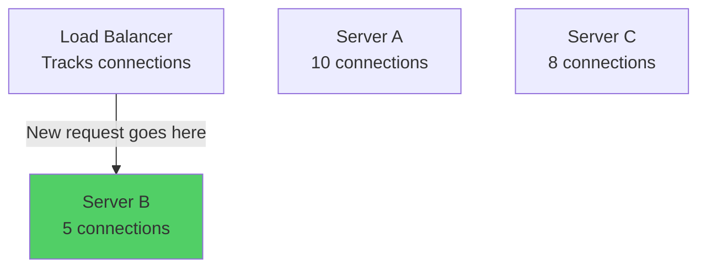

**Code concept:**
```python
servers = {
    'server_a': {'connections': 10, 'url': '192.168.1.10'},
    'server_b': {'connections': 5, 'url': '192.168.1.11'},
    'server_c': {'connections': 8, 'url': '192.168.1.12'}
}

def get_next_server():
    # Tìm server có ít connections nhất
    min_server = min(servers.items(), 
                     key=lambda x: x[1]['connections'])
    return min_server[0]

# New request arrives
server = get_next_server()  # → server_b (5 connections)
servers[server]['connections'] += 1  # Now 6

# Next request
server = get_next_server()  # → server_b again (6 connections)
```

**Ưu điểm:**

 Cân bằng load tốt hơn Round Robin
 Adapt với requests có execution time khác nhau
 Hiệu quả cho long-lived connections

**Nhược điểm:**

 Phức tạp hơn (phải track connections)
 Overhead để update state
 Cần synchronization giữa multiple LB instances

**Khi nào dùng:**

 Requests có execution time rất khác nhau
 WebSocket connections
 Long-polling
 File uploads/downloads
 Streaming

**Personal experience:**

Tôi từng có API với 2 loại endpoints:
```
GET /users/{id} → 10ms execution time
POST /reports/generate → 60 seconds execution time
```

Dùng Round Robin → Servers nhận reports bị stuck, servers khác idle.

Switch sang Least Connections → Load balanced đều, response time cải thiện 5x.

### Algorithm 3: Weighted Round Robin

**Problem statement:**

Servers có specs khác nhau. Round Robin treat tất cả servers như nhau → waste capacity.
```
Server A: 16GB RAM, 8 CPU cores (powerful)
Server B: 8GB RAM, 4 CPU cores (normal)
Server C: 8GB RAM, 4 CPU cores (normal)

Round Robin: Mỗi server nhận same số requests
→ Server A under-utilized
→ Server B, C might be overloaded
```

**Solution: Assign weights**
```python
servers = [
    {'name': 'server_a', 'weight': 4},  # Powerful
    {'name': 'server_b', 'weight': 2},  # Normal
    {'name': 'server_c', 'weight': 2}   # Normal
]

# Distribution:
# Server A gets 4 requests
# Server B gets 2 requests
# Server C gets 2 requests
# Total: 8 requests per cycle

# In ratio: 4:2:2 or 2:1:1
```

**Request flow:**
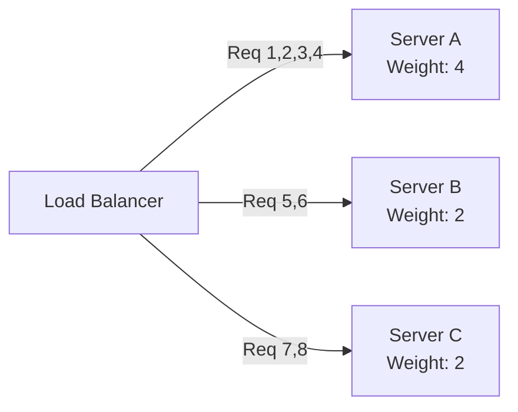

**Implementation concept:**
```python
def weighted_round_robin():
    # Expand servers theo weight
    expanded = []
    for server in servers:
        expanded.extend([server['name']] * server['weight'])
    
    # expanded = ['server_a', 'server_a', 'server_a', 'server_a',
    #             'server_b', 'server_b', 
    #             'server_c', 'server_c']
    
    # Apply Round Robin trên expanded list
    current_index = 0
    while True:
        server = expanded[current_index]
        current_index = (current_index + 1) % len(expanded)
        yield server
```

**Ưu điểm:**

 Utilize powerful servers hiệu quả hơn
 Flexible resource allocation
 Cost-effective (mix server types)

**Nhược điểm:**

 Phải configure weights manually
 Cần adjust weights khi thêm/bớt servers
 Không dynamic (không adapt real-time load)

**Khi nào dùng:**

 Servers có specs khác nhau
 Mix của spot instances và reserved instances (cloud)
 Gradual migration (old servers weight thấp, new servers weight cao)

### Algorithm 4: IP Hash (Consistent Hashing)

**How it works:**

Hash client IP address và map to server. Same client → Same server.
```python
def get_server(client_ip):
    hash_value = hash(client_ip)
    server_index = hash_value % num_servers
    return servers[server_index]

# Example
get_server('192.168.1.100')  # → server_a
get_server('192.168.1.101')  # → server_c
get_server('192.168.1.100')  # → server_a (same!)
```

**Diagram:**
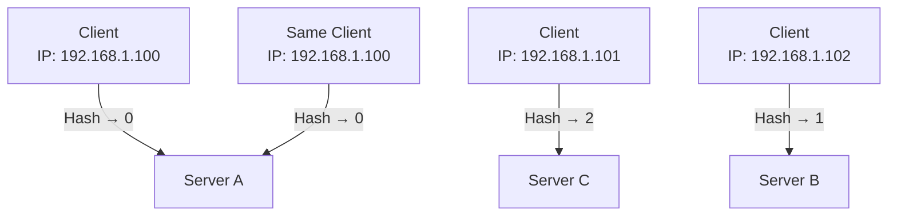

*Same client IP luôn hash to same server.*

**Ưu điểm:**

 Session persistence (sticky sessions)
 Server-side caching efficient (same user → same server → cache hit)
 Stateful applications work

**Nhược điểm:**

 Uneven distribution nếu một số clients gửi nhiều requests
 Khi add/remove server → hash changes → sessions lost
 No load balancing nếu một client spam requests

**Khi nào dùng:**

 Need session affinity
 WebSocket connections
 Server-side caching per user
 Legacy apps không support distributed sessions

**Better alternative:**

Thay vì IP Hash, dùng **shared session store** (Redis):
```python
#  IP Hash approach
def handle_request(client_ip):
    server = hash(client_ip) % num_servers
    # Session stored on server → tied to server

#  Shared session approach
def handle_request(session_id):
    session = redis.get(f"session:{session_id}")
    # Any server can handle → true stateless
```

## Health Checks: Tránh Route Đến Dead Servers

**Problem:**
```
Server 2 crashes
Load Balancer không biết
Continues routing 33% traffic to Server 2
Users get errors
```

**Solution: Health Checks**

Load balancer ping servers định kỳ để verify health.
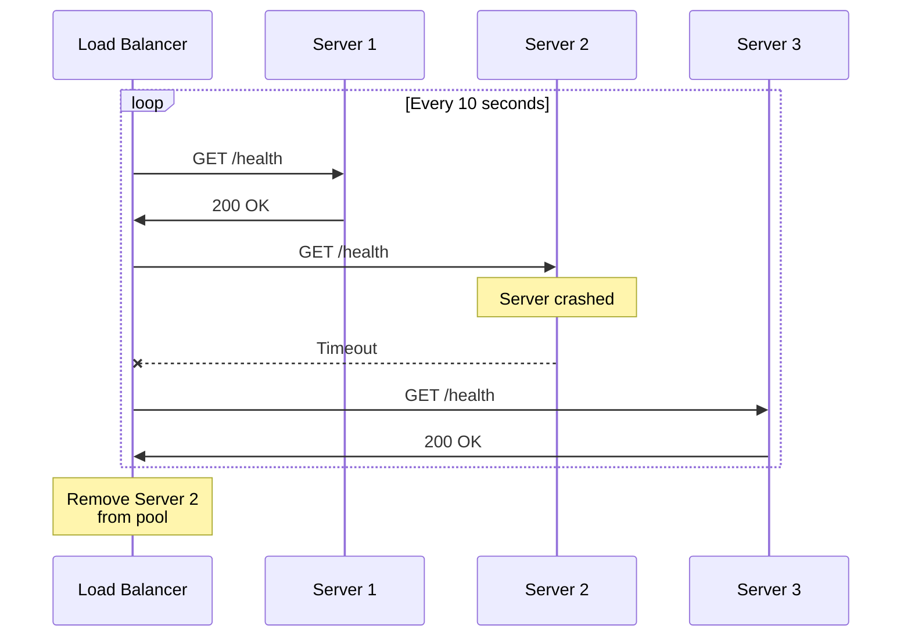

### Health Check Implementation

**Server-side endpoint:**
```python
from flask import Flask, jsonify

app = Flask(__name__)

@app.route('/health')
def health_check():
    # Check critical dependencies
    checks = {
        'database': check_database_connection(),
        'cache': check_cache_connection(),
        'disk_space': check_disk_space()
    }
    
    if all(checks.values()):
        return jsonify({
            'status': 'healthy',
            'checks': checks
        }), 200
    else:
        return jsonify({
            'status': 'unhealthy',
            'checks': checks
        }), 503  # Service Unavailable

def check_database_connection():
    try:
        db.execute("SELECT 1")
        return True
    except:
        return False

def check_cache_connection():
    try:
        cache.ping()
        return True
    except:
        return False
```

**Load Balancer side:**
```python
import requests
import time

servers = [
    {'url': 'http://server1.example.com', 'healthy': True},
    {'url': 'http://server2.example.com', 'healthy': True},
    {'url': 'http://server3.example.com', 'healthy': True}
]

def health_check_loop():
    while True:
        for server in servers:
            try:
                response = requests.get(
                    f"{server['url']}/health",
                    timeout=2  # 2 second timeout
                )
                
                if response.status_code == 200:
                    server['healthy'] = True
                    print(f"{server['url']}: Healthy ")
                else:
                    server['healthy'] = False
                    print(f"{server['url']}: Unhealthy ")
                    
            except requests.exceptions.Timeout:
                server['healthy'] = False
                print(f"{server['url']}: Timeout ")
                
            except requests.exceptions.ConnectionError:
                server['healthy'] = False
                print(f"{server['url']}: Connection failed ")
        
        time.sleep(10)  # Check every 10 seconds

def get_healthy_servers():
    return [s for s in servers if s['healthy']]
```

### Health Check Best Practices

**Practice 1: Check dependencies, không chỉ server**
```python
#  BAD: Chỉ return OK
@app.route('/health')
def health():
    return "OK", 200

#  GOOD: Check critical dependencies
@app.route('/health')
def health():
    if not database.is_connected():
        return "Database down", 503
    
    if not cache.is_connected():
        return "Cache down", 503
    
    if disk_usage() > 90:
        return "Disk full", 503
    
    return "OK", 200
```

**Practice 2: Appropriate timeout**
```
Too short (500ms):
- False negatives (server healthy but slow response)
- Remove healthy servers unnecessarily

Too long (30s):
- False positives (server dead but take 30s to detect)
- Users get errors for 30s

Sweet spot: 2-5 seconds
```

**Practice 3: Retry logic**
```python
#  BAD: Remove after 1 failed check
if health_check_failed:
    remove_from_pool(server)

#  GOOD: Remove after N consecutive failures
server['failed_checks'] = server.get('failed_checks', 0) + 1

if server['failed_checks'] >= 3:  # 3 consecutive failures
    remove_from_pool(server)
elif health_check_success:
    server['failed_checks'] = 0  # Reset counter
```

**Reason:** Avoid flapping (server removed → added → removed → added...).

**Practice 4: Graceful degradation**
```python
# Nếu TẤT CẢ servers unhealthy:
healthy_servers = get_healthy_servers()

if len(healthy_servers) == 0:
    # Option A: Route to all servers anyway (some might work)
    # Option B: Return 503 Service Unavailable
    # Option C: Route to backup servers in different region
    
    # Choose based on use case
```

**Personal lesson:**

Tôi từng set health check timeout = 500ms. Database có spike latency lên 800ms (vẫn healthy, chỉ slow).

Load balancer detect ALL servers unhealthy → Remove all → No servers available → **Complete outage**.

Lesson: Health checks phải distinguish "slow" vs "dead".

## Layer 4 vs Layer 7 Load Balancing

Đây là concept nhiều người confused. Hãy phân tích rõ ràng.

### OSI Model Quick Recap
```
Layer 7: Application (HTTP, FTP, SMTP)
Layer 6: Presentation (SSL/TLS)
Layer 5: Session
Layer 4: Transport (TCP, UDP)
Layer 3: Network (IP)
Layer 2: Data Link (Ethernet)
Layer 1: Physical
```

### Layer 4 Load Balancing (Transport Layer)

**Operates at:** TCP/UDP level

**Information available:**
- Source IP address
- Destination IP address
- Source port
- Destination port

**Cannot see:**
- HTTP headers
- URL path
- Cookies
- Request body
- Application-level data

**How it works:**
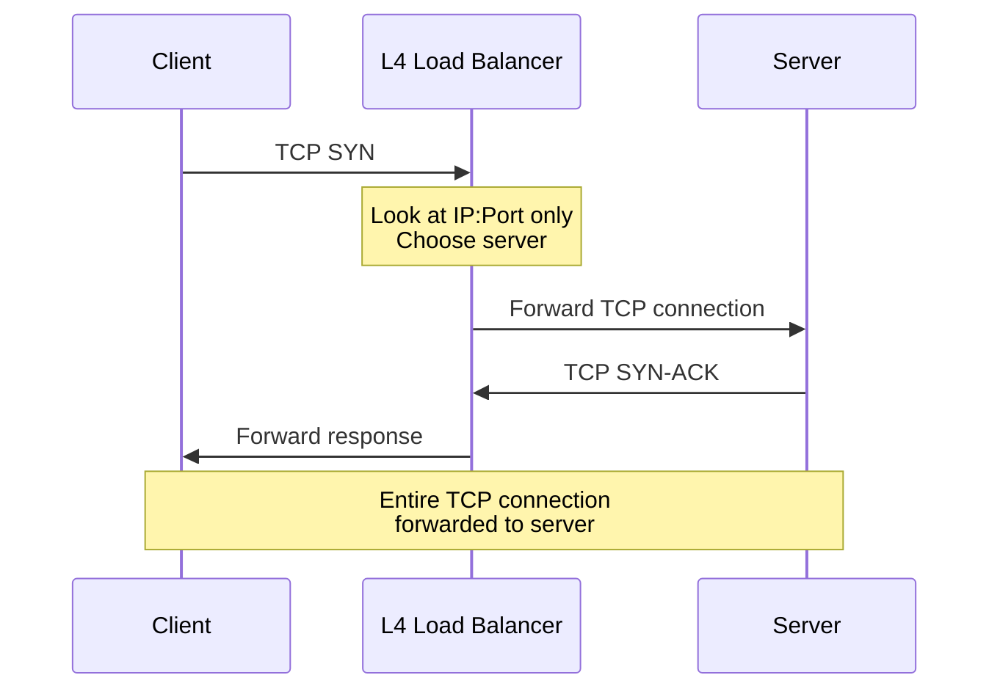

**Example:**
```
All traffic to port 443 → Backend HTTPS servers
All traffic to port 5432 → PostgreSQL replicas
All traffic to port 6379 → Redis cluster

Simple port-based routing
```

**Ưu điểm:**

 **Cực nhanh** (simple packet forwarding)
 **Low latency** (+5-10ms)
 **Protocol-agnostic** (works với bất kỳ TCP/UDP protocol)
 **High throughput** (millions connections/second)

**Nhược điểm:**

 Không thể route based on URL
 Không thể route based on headers
 Không thể modify requests/responses
 Limited intelligence

**Use cases:**

- Non-HTTP protocols (databases, custom TCP apps)
- Extreme performance requirements
- Simple routing (all traffic to same backends)
- Gaming servers, VoIP

**Example tools:**
- AWS Network Load Balancer (NLB)
- HAProxy (TCP mode)
- IPVS (Linux kernel)

### Layer 7 Load Balancing (Application Layer)

**Operates at:** HTTP/HTTPS level

**Information available:**
- Everything Layer 4 has
- HTTP method (GET, POST, PUT, DELETE)
- URL path and query parameters
- HTTP headers (User-Agent, cookies, custom headers)
- Request body
- SSL/TLS information

**How it works:**
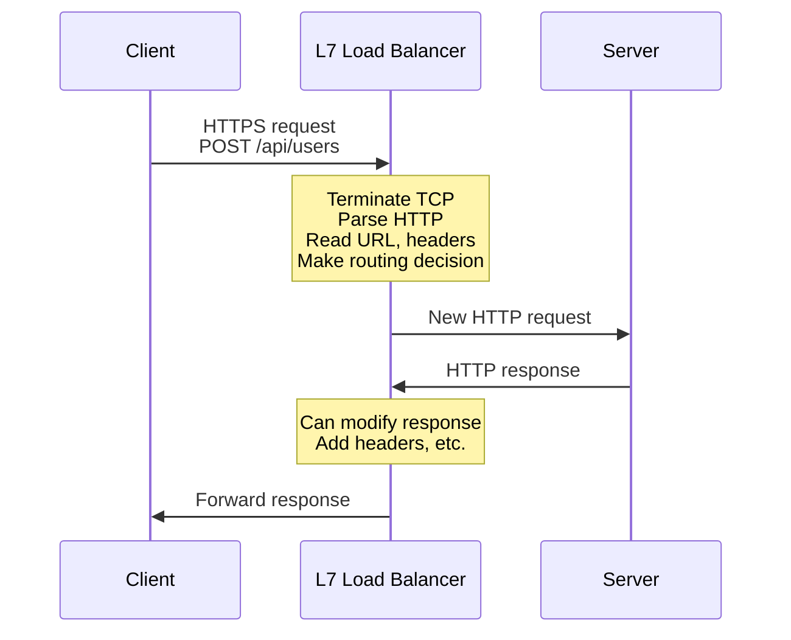

**Example routing rules:**
```nginx
# Nginx configuration (Layer 7)

# Route by URL path
location /api/users {
    proxy_pass http://user_service;
}

location /api/orders {
    proxy_pass http://order_service;
}

location /api/payments {
    proxy_pass http://payment_service;
}

# Route by header
if ($http_x_api_version = "v2") {
    proxy_pass http://api_v2_servers;
}

# Route by cookie
if ($cookie_beta_user = "true") {
    proxy_pass http://beta_servers;
}

# Admin traffic to special servers
location /admin {
    proxy_pass http://admin_servers;
    # Can add authentication here
}
```

**Advanced features:**
```python
# SSL termination
# LB handles HTTPS, forwards HTTP to backends
Client --HTTPS--> LB --HTTP--> Backend
(encrypted)          (unencrypted, fast)

# Request modification
# Add custom headers
X-Forwarded-For: client_ip
X-Request-ID: unique_id

# Response modification
# Gzip compression
# Add security headers (CORS, CSP)

# Content-based routing
if content_type == "video/mp4":
    route_to_video_servers()
elif content_type == "image/jpeg":
    route_to_image_servers()
```

**Ưu điểm:**

 **Intelligent routing** (URL, headers, cookies)
 **Content-based decisions**
 **Can modify requests/responses**
 **SSL termination** (offload encryption từ backends)
 **Perfect for microservices**

**Nhược điểm:**

 **Slower** (more processing)
 **Higher latency** (+10-50ms)
 **Only works với HTTP/HTTPS**
 **More CPU intensive**

**Use cases:**

- Web applications
- Microservices architecture
- Content-based routing
- A/B testing
- Canary deployments

**Example tools:**
- AWS Application Load Balancer (ALB)
- Nginx
- HAProxy (HTTP mode)
- Traefik
- Envoy

### Comparison Table
```
Feature              | Layer 4        | Layer 7
---------------------|----------------|------------------
Speed                | Very fast      | Slower
Latency              | +5-10ms        | +10-50ms
Routing              | IP:Port only   | URL, headers, etc.
Protocol support     | Any TCP/UDP    | HTTP/HTTPS only
SSL termination      | No             | Yes
Content inspection   | No             | Yes
Request modification | No             | Yes
Microservices        | Not ideal      | Perfect
Cost (processing)    | Low            | High
Use case             | Simple routing | Smart routing
```

### Decision Framework
```
Choose Layer 4 when:
 Need maximum performance
 Millions of connections
 Non-HTTP protocols (database, gaming, VoIP)
 Simple routing (all traffic to same backends)
 Every millisecond matters

Choose Layer 7 when:
 Web applications / APIs
 Microservices (route by path)
 Need SSL termination
 Content-based routing
 Need to modify requests/responses
 A/B testing / Canary deployments
```

**My recommendation:**

Cho web applications: **Default to Layer 7** (Application Load Balancer).

Flexibility và features > small latency difference.

Chỉ drop xuống Layer 4 khi có proven performance requirements hoặc non-HTTP protocols.

## Real-World Architecture Example

Hãy xem một e-commerce system thực tế.

**Requirements:**
- 100,000 requests/second
- Multiple services (Web, API, Admin, Payments)
- Global users
- 99.99% uptime

**Architecture:**
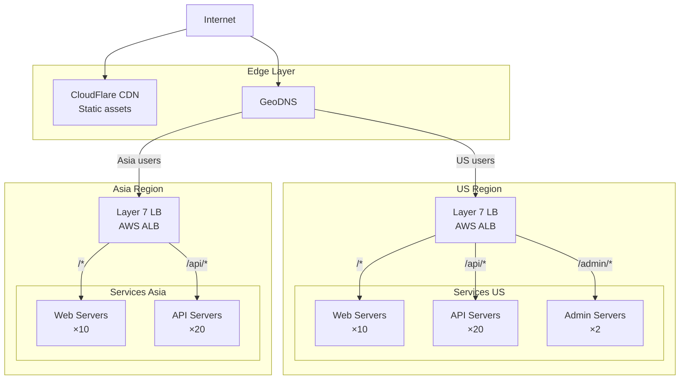

**Configuration details:**
```yaml
# Layer 7 Load Balancer config

# Web servers pool
- path: /*
  backend: web_servers
  algorithm: round_robin
  health_check:
    path: /health
    interval: 10s
    timeout: 5s
    unhealthy_threshold: 3
  
# API servers pool
- path: /api/*
  backend: api_servers
  algorithm: least_connections  # APIs vary in execution time
  health_check:
    path: /api/health
    interval: 10s
    timeout: 5s
  
# Admin servers pool
- path: /admin/*
  backend: admin_servers
  algorithm: round_robin
  health_check:
    path: /admin/health
    interval: 10s
  ip_whitelist:  # Security: Only allow from office IPs
    - 203.0.113.0/24
```

**Why this design:**

1. **GeoDNS**: Route users to nearest region (low latency)
2. **CDN**: Serve static assets (images, CSS, JS) from edge (fast)
3. **Layer 7 LB**: Intelligent routing by URL path
4. **Different pools**: Isolation (admin separate từ public)
5. **Different algorithms**: 
   - Web: Round Robin (requests similar)
   - API: Least Connections (vary in time)
6. **Health checks**: Auto-remove unhealthy servers
7. **IP whitelist**: Security for admin panel

## Key Takeaways

**Load balancing solves:**
- Single server capacity limits
- Single point of failure
- High availability requirements
- Geographic distribution

**Core algorithms:**
- **Round Robin**: Simple, default choice, even distribution
- **Least Connections**: Better khi requests vary, long-lived connections
- **Weighted Round Robin**: Khi servers có specs khác nhau
- **IP Hash**: Session persistence (nhưng shared session store tốt hơn)

**Health checks are critical:**
- Prevent routing to dead servers
- Check dependencies, not just server
- Appropriate timeout (2-5s)
- Retry logic to avoid flapping

**Layer 4 vs Layer 7:**
- **Layer 4**: Fast, simple, any protocol, limited routing
- **Layer 7**: Smart, flexible, HTTP only, microservices-friendly
- **Default to Layer 7 cho web apps**

**Best practices:**
- Start simple (Round Robin + health checks)
- Measure before optimizing algorithm
- Multiple load balancers (avoid SPOF)
- Monitor metrics (request rate, latency, error rate)
- Test failover scenarios

**Tự hỏi khi design:**

1. *Thuật toán nào phù hợp với request pattern?*
2. *Health checks có detect failures correctly không?*
3. *Load balancer có là SPOF không?*
4. *Cần Layer 4 hay Layer 7?*

Load balancing không phải là optional. Nó là **foundation của distributed systems**.

Master nó tốt = hệ thống của bạn scalable và reliable.
