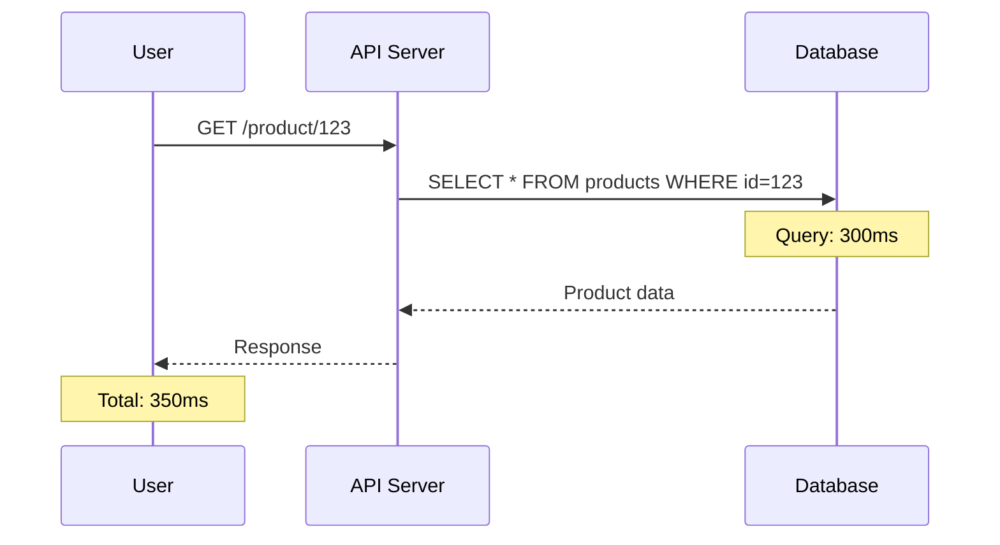
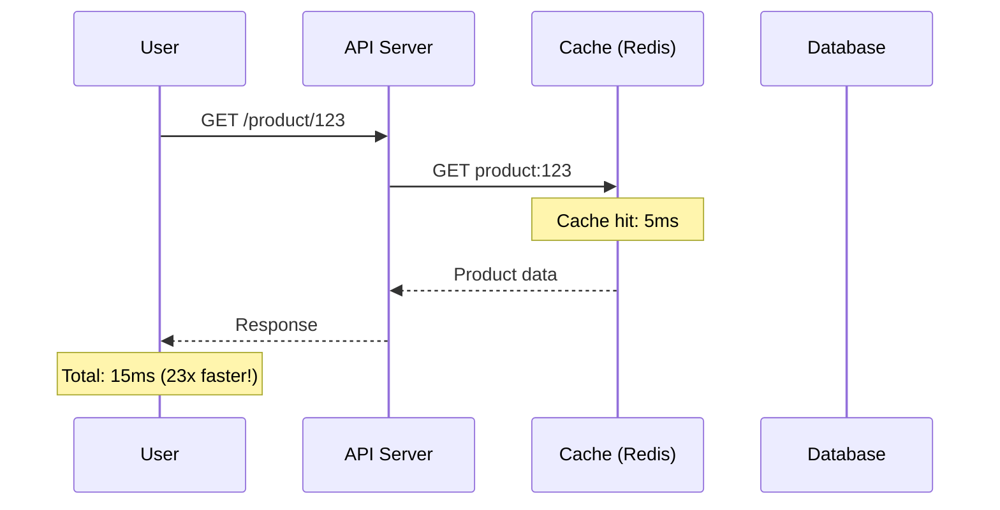
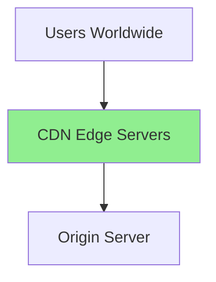
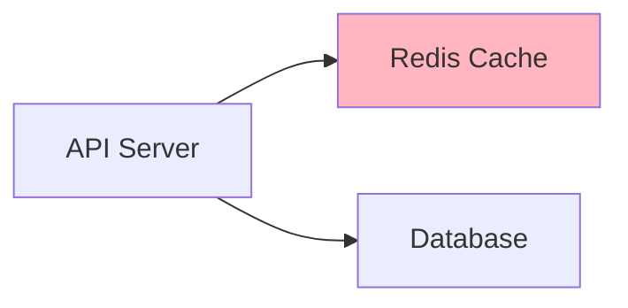
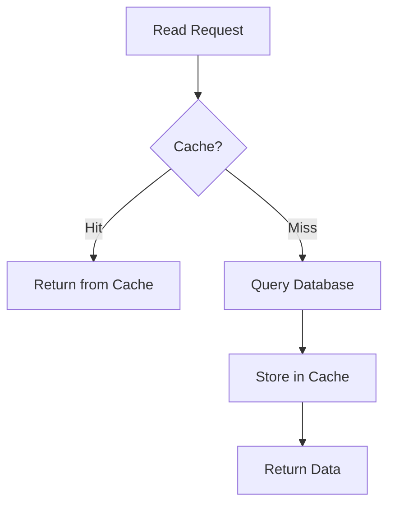
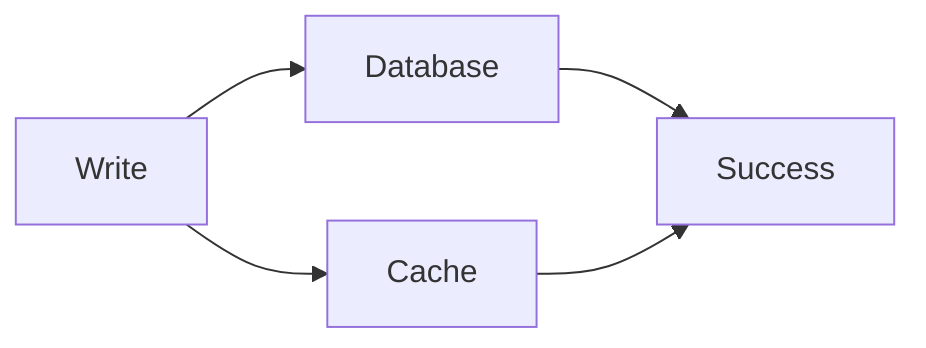
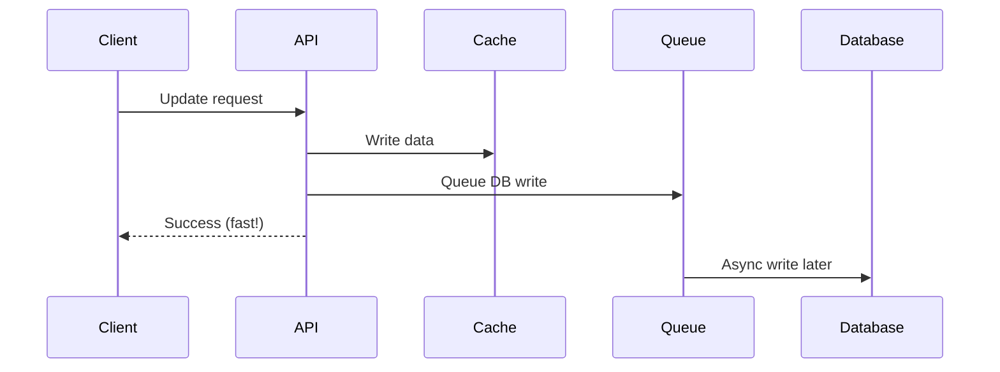
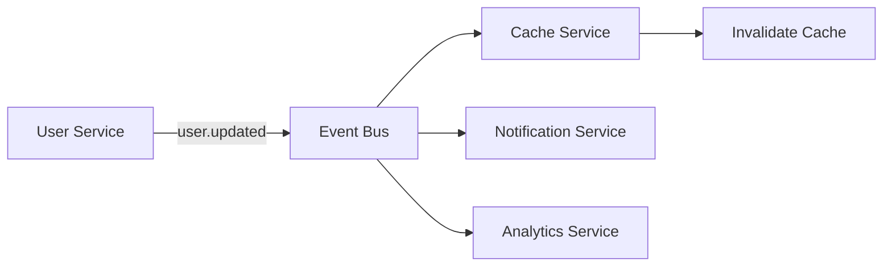
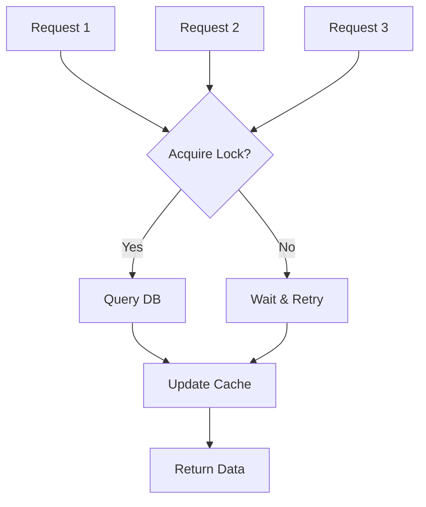

# Caching: Performance Layer Quan Trọng Nhất

Có một câu hỏi mà junior engineers thường hỏi tôi: *"API chậm, em nên làm gì?"*

10 năm trước, tôi sẽ nói: *"Optimize database queries."*

Giờ tôi nói: *"Cache trước. Optimize sau."*

Tại sao? Vì tôi đã học một bài học đắt giá.

Năm 2015, hệ thống tôi quản lý bị chậm. Tôi spend 2 tuần optimize queries, rewrite indexes, tune database parameters. Improvement? 20%.

Senior architect ghé qua, thêm Redis cache layer trong 2 giờ. Improvement? **10x faster**.

Đó là lúc tôi hiểu: **Cache không phải là optimization technique. Nó là architectural decision.**

## Tại Sao Cache Tồn Tại?

### The Fundamental Speed Gap
```
CPU Cache:     1 nanosecond
RAM:           100 nanoseconds  (100x slower)
SSD:           150 microseconds (150,000x slower)
Network:       50 milliseconds  (50,000,000x slower)
HDD:           10 milliseconds  (10,000,000x slower)
```

**Implication:** Mỗi lần bạn query database từ network, bạn mất 50 triệu cycles CPU.

**Solution:** Lưu kết quả gần user hơn. Đó chính là cache.

### Real-World Scenario

**Without Cache:**


**With Cache:**


### When Cache Makes Sense

Không phải mọi thứ đều nên cache. Hãy dùng framework này:

**The Cache Decision Matrix:**
```
Question 1: Read-heavy? (read:write ratio > 10:1)
  ↓ YES
Question 2: Data thay đổi ít?
  ↓ YES
Question 3: Same data được request nhiều lần?
  ↓ YES
Question 4: Query expensive? (> 100ms)
  ↓ YES
  
→ USE CACHE

Any NO? → Think carefully
```

**Examples:**
```
 SHOULD cache:
- Product catalog (read 1000x, write 1x)
- User profiles (read many, update rarely)
- Static pages
- API responses cho public data

 SHOULD NOT cache:
- Real-time stock prices (thay đổi liên tục)
- Personalized recommendations (different per user)
- Write-heavy counters (likes, views tăng liên tục)
- Small datasets (< 1000 records, DB fast enough)
```

## Cache Layers: Từ Client Đến Database

Cache không chỉ là Redis. Nó là một **layered strategy**.

### Layer 1: Browser Cache


**How it works:**
```http
HTTP/1.1 200 OK
Cache-Control: public, max-age=31536000, immutable
```

**Trade-offs:**
```
 Fastest (zero network)
 Reduce server load
 Hard to invalidate (user doesn't refresh)
 Different cache per user
```

**When to use:**
```
Static assets:
- Images, CSS, JS files
- Fonts, icons
- Versioned URLs (/app.v2.js)

NOT for:
- HTML pages (need fresh)
- API responses
- Personalized content
```

### Layer 2: CDN Cache


**Geographic distribution:**
```
User in Brazil → Brazil edge server (20ms)
User in Tokyo → Tokyo edge server (15ms)
User in London → London edge server (10ms

All serve từ cache, không hit origin server
```

**Configuration:**
```javascript
// Cloudflare Workers example
addEventListener('fetch', event => {
  const cache = caches.default
  const response = cache.match(event.request)
  
  if (response) {
    return response  // Cache hit
  }
  
  // Cache miss → fetch from origin → cache it
  const originResponse = fetch(event.request)
  event.waitUntil(
    cache.put(event.request, originResponse.clone())
  )
  return originResponse
})
```

**Trade-offs:**
```
 Low latency globally
 Reduce origin load
 DDoS protection
 Cost (bandwidth expensive)
 Complexity (multiple cache layers)
```

### Layer 3: Application Cache (Redis/Memcached)

**This is the main focus.** Đây là layer bạn có full control.


**Why Redis?**

- In-memory → Extremely fast (< 1ms)
- Rich data structures (strings, hashes, lists, sets)
- TTL support
- Pub/sub for cache invalidation
- Persistence options

**Basic pattern:**
```python
import redis

cache = redis.Redis()

def get_user(user_id):
    # 1. Try cache first
    cached = cache.get(f"user:{user_id}")
    if cached:
        return json.loads(cached)  # Cache hit!
    
    # 2. Cache miss → Query DB
    user = db.query("SELECT * FROM users WHERE id = ?", user_id)
    
    # 3. Store in cache for next time
    cache.setex(
        f"user:{user_id}",
        3600,  # TTL: 1 hour
        json.dumps(user)
    )
    
    return user
```

### Layer 4: Database Query Cache

Most databases có built-in query cache.

**MySQL Query Cache:**
```sql
-- First query: 300ms (cache miss)
SELECT * FROM products WHERE category = 'electronics';

-- Same query again: 5ms (cache hit)
SELECT * FROM products WHERE category = 'electronics';
```

**Trade-offs:**
```
 Automatic (no code changes)
 Shared across connections
 Invalidated on ANY table write
 Not scalable (single server)
```

**Modern approach:** Disable DB query cache, use application cache instead (Redis). More control.

## Cache Strategies: Khi Nào Read? Khi Nào Write?

### Strategy 1: Cache-Aside (Lazy Loading)

**Most common pattern.**
```python
def get_product(product_id):
    # Read path
    product = cache.get(f"product:{product_id}")
    if product:
        return product  # Hit
    
    # Miss → Load from DB
    product = db.get(product_id)
    cache.set(f"product:{product_id}", product, ttl=3600)
    return product

def update_product(product_id, data):
    # Write path
    db.update(product_id, data)
    cache.delete(f"product:{product_id}")  # Invalidate
```

**Flow diagram:**


**Trade-offs:**
```
 Only cache what's needed
 Cache miss không fatal
 Resilient (cache down → still works)
 First request always slow (cold cache)
 Cache miss adds latency
```

**Best for:** Read-heavy workloads, infrequent updates.

### Strategy 2: Write-Through
```python
def update_product(product_id, data):
    # Write to both DB and cache
    db.update(product_id, data)
    cache.set(f"product:{product_id}", data, ttl=3600)

def get_product(product_id):
    # Read from cache (always up-to-date)
    return cache.get(f"product:{product_id}")
```

**Flow diagram:**


**Trade-offs:**
```
 Cache always fresh
 Read latency predictable
 Write latency higher (2 operations)
 Wasted writes (might not be read)
```

**Best for:** Read-heavy với strict consistency requirements.

### Strategy 3: Write-Behind (Write-Back)
```python
def update_product(product_id, data):
    # Write to cache immediately
    cache.set(f"product:{product_id}", data)
    
    # Queue DB write asynchronously
    queue.add({
        "type": "update_product",
        "id": product_id,
        "data": data
    })
    
    return "Success"  # Return immediately!

# Background worker
def worker():
    while True:
        job = queue.pop()
        db.update(job["id"], job["data"])
```

**Flow diagram:**


**Trade-offs:**
```
 Extremely fast writes
 Absorb write spikes
 Risk data loss (cache crash trước khi DB write)
 Complex error handling
 Eventual consistency
```

**Best for:** Write-heavy workloads, analytics, logging.

### Strategy 4: Refresh-Ahead
```python
def get_product(product_id):
    product = cache.get(f"product:{product_id}")
    ttl_remaining = cache.ttl(f"product:{product_id}")
    
    # Nếu sắp expire, refresh async
    if ttl_remaining < 300:  # < 5 phút
        background_refresh(product_id)
    
    return product

def background_refresh(product_id):
    fresh_data = db.get(product_id)
    cache.set(f"product:{product_id}", fresh_data, ttl=3600)
```

**Trade-offs:**
```
 Cache rarely misses
 Consistent latency
 Complexity
 Wasted refreshes (if data not accessed)
```

**Best for:** Predictable access patterns, high availability requirements.

## Cache Invalidation: The Hard Problem

Phil Karlton: *"There are only two hard things in Computer Science: cache invalidation and naming things."*

### Why It's Hard
```
Timeline:
10:00:00 - User updates profile (DB updated)
10:00:01 - User refreshes page
          → Cache still has old data
          → User sees old profile
10:00:02 - User confused, files bug report
```

### Solution 1: Time-Based (TTL)
```python
cache.setex("user:123", 300, user_data)  # Expire after 5 min

 Simple
 Automatic cleanup
 Stale data for up to TTL duration
 Can't invalidate immediately
```

**Rule of thumb cho TTL:**
```
Highly dynamic data (stock prices): 1-10 seconds
Dynamic data (news feed): 1-5 minutes
Semi-static (user profile): 10-30 minutes
Static (product catalog): 1-24 hours
Immutable (images, old posts): Days/weeks
```

### Solution 2: Explicit Invalidation
```python
def update_user(user_id, data):
    db.update(user_id, data)
    cache.delete(f"user:{user_id}")  # Delete immediately
    
 Fresh data immediately
 Full control
 Must remember to invalidate everywhere
 Easy to forget → stale data
```

**The N+1 invalidation problem:**
```python
#  BAD: Easy to miss invalidations
def update_user_email(user_id, email):
    db.update_email(user_id, email)
    cache.delete(f"user:{user_id}")
    # Forgot to invalidate: user:email:{email}
    # Forgot to invalidate: user_list
    # Forgot to invalidate: search results
```

**Pattern: Centralized invalidation**
```python
class UserCache:
    @staticmethod
    def invalidate(user_id):
        keys = [
            f"user:{user_id}",
            f"user:email:{user.email}",
            "user_list",
            "user_count"
        ]
        cache.delete_many(keys)

def update_user(user_id, data):
    db.update(user_id, data)
    UserCache.invalidate(user_id)  # One call, all caches cleared
```

### Solution 3: Event-Driven Invalidation

**Best for microservices.**


**Implementation:**
```python
# User Service
def update_user(user_id, data):
    db.update(user_id, data)
    event_bus.publish("user.updated", {
        "user_id": user_id,
        "fields": ["email", "name"]
    })

# Cache Service (separate service)
@event_bus.subscribe("user.updated")
def on_user_updated(event):
    cache.delete(f"user:{event['user_id']}")

# Notification Service
@event_bus.subscribe("user.updated")
def on_user_updated(event):
    send_notification(event['user_id'])
```

**Trade-offs:**
```
 Decoupled services
 Easy to add new subscribers
 Reliable (event log persisted)
 Infrastructure complexity (Kafka, RabbitMQ)
 Eventual consistency (delay 10-100ms)
```

### Solution 4: Cache Versioning

**For immutable data.**
```python
# Version in key
def get_user_avatar(user_id, version):
    key = f"avatar:{user_id}:v{version}"
    return cache.get(key)

# Update creates new version
def update_avatar(user_id, new_avatar):
    version = db.increment_avatar_version(user_id)
    cache.set(f"avatar:{user_id}:v{version}", new_avatar)
    
# Old versions auto-expire via TTL
# No explicit invalidation needed!

 No invalidation needed
 Old versions still work (useful for CDN)
 More storage (multiple versions)
```

## Thundering Herd Problem (Cache Stampede)

### The Problem
```
Scenario:
1. Popular cache key expires at 10:00:00
2. At 10:00:01, 1000 concurrent requests arrive
3. All requests: cache miss
4. All 1000 requests query database simultaneously
5. Database overloaded → crashes

Result: Cache làm hệ thống TỆ HƠN thay vì TỐT HƠN
```

**Real-world impact:**

Tôi từng thấy Facebook page với 10M followers. Mỗi khi post mới, hàng triệu users refresh cùng lúc. Cache expire → Database chết → 5 phút downtime.

### Solution 1: Lock-Based
```python
def get_product(product_id):
    product = cache.get(f"product:{product_id}")
    if product:
        return product
    
    # Try to acquire lock
    lock_key = f"lock:product:{product_id}"
    locked = cache.set(lock_key, "1", nx=True, ex=10)
    
    if locked:
        # Only this request queries DB
        product = db.get(product_id)
        cache.set(f"product:{product_id}", product, ex=3600)
        cache.delete(lock_key)
        return product
    else:
        # Other requests wait
        time.sleep(0.1)
        return get_product(product_id)  # Retry
```

**Flow:**


**Trade-offs:**
```
 Only 1 DB query
 Protects database
 Other requests wait (latency spike)
 Lock can get stuck (if holder crashes)
```

### Solution 2: Probabilistic Early Expiration
```python
import random

def get_product(product_id):
    product = cache.get(f"product:{product_id}")
    ttl = cache.ttl(f"product:{product_id}")
    
    # Probabilistically refresh before expiration
    if ttl < 300 and random.random() < 0.1:
        # 10% chance to refresh early
        background_refresh(product_id)
    
    return product

 Spreads DB load over time
 No locks needed
 Still possible (but rare) stampede
```

### Solution 3: Stale-While-Revalidate
```python
def get_product(product_id):
    product = cache.get(f"product:{product_id}")
    ttl = cache.ttl(f"product:{product_id}")
    
    if ttl < 0:  # Expired
        # Return stale data immediately
        stale = cache.get(f"product:{product_id}:stale")
        
        # Refresh async
        background_refresh(product_id)
        
        return stale
    
    return product

 No waiting
 Stale data better than no data
 Users might see slightly old data
```

**This is my favorite approach** cho most use cases. User experience > perfect freshness.

## Trade-offs: Khi Nào Không Nên Cache

### Anti-Pattern 1: Caching Write-Heavy Data
```python
#  BAD: Cache counter that updates constantly
def increment_view_count(post_id):
    count = cache.get(f"views:{post_id}") or 0
    cache.set(f"views:{post_id}", count + 1)
    
Problem:
- 1000 increments/second
- Cache hiệu quả = 0% (mỗi read là miss)
- Complexity tăng, benefit = 0

 BETTER: Write directly to DB, aggregate periodically
```

### Anti-Pattern 2: Caching Personalized Data
```python
#  BAD: Cache recommendations per user
def get_recommendations(user_id):
    recs = cache.get(f"recs:{user_id}")
    if not recs:
        recs = expensive_ml_model(user_id)
        cache.set(f"recs:{user_id}", recs)
    return recs

Problem:
- 1M users = 1M cache entries
- Each user's recs accessed 1-2x/day
- Hit rate low
- Memory wasted

 BETTER: Cache shared data (trending items), compute personal on-the-fly
```

### Anti-Pattern 3: Over-Caching
```python
#  BAD: Cache everything
cache.set("user_count", db.count_users())
cache.set("server_time", datetime.now())
cache.set("config", load_config())

Problem:
- Adds complexity for minimal gain
- Config thay đổi ít, DB query fast (<10ms)
- Not worth the invalidation headache

Rule: Only cache if query > 100ms hoặc called frequently (>100x/sec)
```

## Best Practices From 10 Years Experience

### 1. Start With Metrics
```python
#  Don't add cache blindly
"Let's cache everything!"

#  Measure first
1. Log slow queries (> 100ms)
2. Identify hot paths (>100 req/s)
3. Cache those, not everything
```

### 2. Cache Keys Design
```python
#  BAD: Hard to invalidate
cache.set("user", user)

#  GOOD: Namespace and version
cache.set("user:123:v2", user)

Benefits:
- Easy to invalidate: delete("user:123:*")
- Easy to upgrade: v2 → v3, old cache auto-expires
```

### 3. Appropriate TTL
```python
#  BAD: Same TTL cho everything
cache.setex(key, 3600, data)  # Always 1 hour

#  GOOD: TTL based on data characteristics
product_catalog: 24 hours (thay đổi ít)
user_session: 30 minutes (security)
trending_posts: 5 minutes (freshness)
stock_price: 5 seconds (real-time)
```

### 4. Graceful Degradation
```python
#  BAD: Cache down = system down
def get_product(product_id):
    return cache.get(f"product:{product_id}")  # Crash if cache down!

#  GOOD: Cache down = slower, not broken
def get_product(product_id):
    try:
        cached = cache.get(f"product:{product_id}")
        if cached:
            return cached
    except CacheError:
        logger.warning("Cache unavailable, falling back to DB")
    
    return db.get(product_id)  # Still works!
```

### 5. Monitor Cache Metrics
```python
metrics_to_track = {
    "hit_rate": cache_hits / total_requests,  # Should be > 80%
    "miss_rate": cache_misses / total_requests,
    "eviction_rate": evictions / total_writes,
    "memory_usage": used / total,
    "latency_p99": p99_latency  # Should be < 5ms
}

if hit_rate < 0.5:
    # Cache không effective, review strategy
```

## Key Takeaways

**Cache là performance optimization đầu tiên bạn nên nghĩ đến:**
- 10-100x faster than database
- Simple to implement (Redis = 2 giờ setup)
- High ROI

**Cache strategies:**
- **Cache-Aside:** Most common, read-heavy
- **Write-Through:** Consistency critical
- **Write-Behind:** Write-heavy, can tolerate data loss
- **Refresh-Ahead:** Predictable patterns

**Cache invalidation hard problems:**
- TTL: Simple, eventual freshness
- Explicit: Immediate, error-prone
- Event-driven: Scalable, complex
- Versioning: Elegant, more storage

**Thundering herd solutions:**
- Lock-based: Safe, latency spikes
- Probabilistic: Spreads load
- Stale-while-revalidate: Best UX (my favorite)

**When NOT to cache:**
- Write-heavy data
- Personalized content (low hit rate)
- Data that's already fast (< 10ms)
- Real-time requirements

**Remember:** Cache adds complexity. Only add it when benefit > cost. Measure first, cache second.
