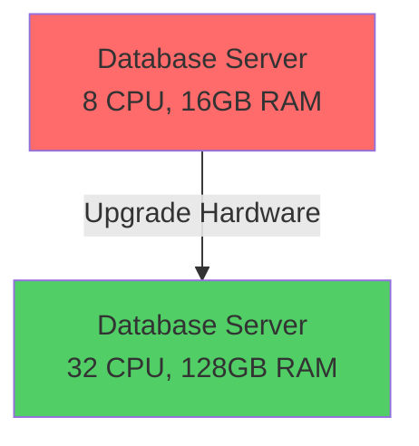
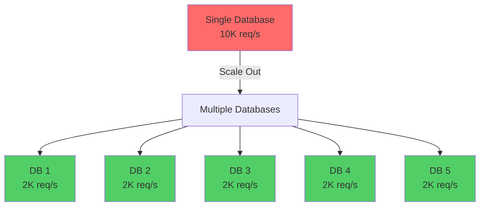
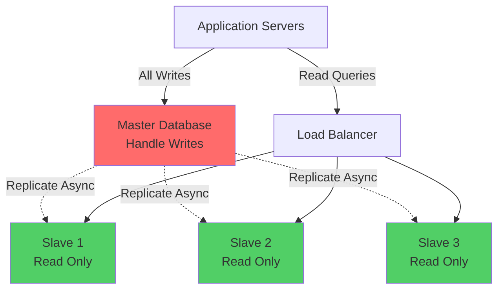
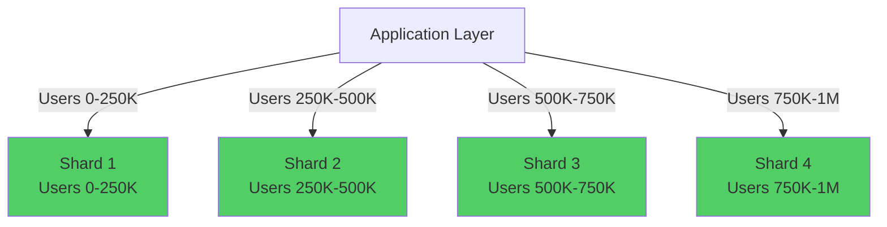

# Database Scaling: Chiến Lược Scale Data Layer

Tôi còn nhớ cái ngày database đầu tiên tôi thiết kế sụp đổ.

Black Friday. Traffic tăng 10x. Database CPU lên 100%, queries timeout liên tục, response time từ 200ms lên 30 giây.

3 giờ sáng, tôi gọi senior architect. Anh ấy hỏi đúng một câu: *"Em có mấy database?"*

Tôi: *"Một cái ạ."*

Anh ấy: *"Vậy là em chưa biết scale database."*

Đó là đêm tôi học bài học đắt giá nhất về database scaling. Và đó là lesson này sẽ giúp bạn tránh được sai lầm đó.

## Tại Sao Database Luôn Là Bottleneck Đầu Tiên?

Trước khi học cách scale, hãy hiểu tại sao database luôn là điểm nghẽn.

**Lý do 1: Disk I/O chậm nhất trong hệ thống**
```
RAM access:       100 nanoseconds
SSD read:         150 microseconds  (1,500x chậm hơn RAM)
HDD read:         10 milliseconds   (100,000x chậm hơn RAM)

Database phải:
- Đọc từ disk
- Parse query
- Execute query plan
- Ghi kết quả

→ Inherently slow
```

**Lý do 2: State khó scale hơn stateless**
```
Application servers (stateless):
- Không lưu data
- Add thêm servers → Scale ngay
- Easy!

Database (stateful):
- Lưu data
- Data phải consistent
- Hard!
```

**Lý do 3: Single point of failure**
```
10 app servers, 1 database
Database chết → Toàn bộ hệ thống chết
```

**Key insight:** Database scaling phải được plan từ đầu, không phải khi production đã cháy.

## Vertical Scaling: Đơn Giản Nhưng Có Giới Hạn

### Định Nghĩa

**Vertical scaling = Tăng sức mạnh của server hiện tại**
```
Hiện tại: 8 CPU, 16GB RAM, 500GB SSD
Upgrade:  32 CPU, 128GB RAM, 2TB SSD
```


*Vertical scaling: Nâng cấp hardware của cùng một server*

### Ưu Điểm

**1. Cực kỳ đơn giản**
```
No code changes
No architecture changes  
Click nút → Có thêm power
10 phút implement
```

**2. Không có distributed system complexity**
```
Vẫn là single database
ACID transactions hoạt động bình thường
No data consistency issues
Queries vẫn như cũ
```

**3. Immediate results**
```
Before: CPU 90%, queries 5 giây
After:  CPU 30%, queries 200ms
```

### Nhược Điểm

**1. Có giới hạn vật lý**
```
Không thể mua CPU/RAM vô hạn
Có ceiling tối đa
Eventually phải sang horizontal scaling
```

**2. Đắt với diminishing returns**
```
Cost scaling (real numbers từ AWS):

16GB RAM → 32GB:  2x giá ($200 → $400/tháng)
32GB RAM → 64GB:  3x giá ($400 → $1,200/tháng)  
64GB RAM → 128GB: 5x giá ($1,200 → $6,000/tháng)
128GB RAM → 256GB: 8x giá ($6,000 → $48,000/tháng)

Giá tăng exponentially, performance chỉ tăng linearly
```

**3. Single point of failure**
```
Server chết → Toàn bộ hệ thống chết
Maintenance → Downtime
No redundancy
```

**4. Requires downtime**
```
Phải restart database
5-30 phút downtime
Không thể zero-downtime upgrade
```

### Trade-off Matrix
```
Vertical Scaling:

Simplicity:        ★★★★★
Quick implement:   ★★★★★
Consistency:       ★★★★★
Cost efficiency:   ★★☆☆☆
Availability:      ★★☆☆☆
Scalability limit: ★★☆☆☆
```

### Khi Nào Nên Dùng?

**Sử dụng vertical scaling khi:**
```
✓ Startup/MVP (< 10K users)
✓ Budget constraints
✓ Small team (không có expertise distributed systems)
✓ Traffic predictable và có ceiling
✓ Data < 1TB
✓ ACID transactions critical (banking, payments)
```

**Ví dụ thực tế:**

Tôi từng tư vấn cho một banking startup. Team muốn "microservices + sharded database từ đầu".

Tôi nói không:
- 5,000 users hiện tại
- PostgreSQL 16GB RAM handle được 50K users
- Simple = ship nhanh hơn
- Tiết kiệm budget cho marketing

2 năm sau, 30K users, database vẫn ổn. Chỉ upgrade lên 32GB RAM (1 giờ downtime lúc 3am).

**Đúng quyết định cho context đó.**

### Lời Khuyên Cá Nhân

**Luôn bắt đầu với vertical scaling.**

Chỉ chuyển horizontal khi:
- Hit CPU/Memory limits (80%+ consistently)
- Cost quá cao
- Need high availability

Don't prematurely optimize.

## Horizontal Scaling: Phức Tạp Nhưng Unlimited

### Định Nghĩa

**Horizontal scaling = Thêm nhiều servers**
```
1 database xử lý 10,000 req/s
→ 5 databases, mỗi cái xử lý 2,000 req/s
```


*Horizontal scaling: Thêm nhiều database servers để phân tán load*

### Ưu Điểm
```
Theoretically unlimited scale
   - 10 servers → 10x capacity
   - 100 servers → 100x capacity

Cost-effective at scale
   - Dùng commodity hardware
   - Linear cost với capacity

High availability
   - 1 server chết → Còn lại continue
   - No single point of failure

No downtime scaling
   - Add servers không cần restart existing
```

### Nhược Điểm
```
Extreme complexity
   - Data consistency challenges
   - Distributed transactions nightmare
   - Network partitions

Application changes required
   - Code phải shard-aware
   - Cannot treat as single DB

Operational overhead  
   - Monitor nhiều servers
   - Backup/restore phức tạp
   - Resharding = nightmare
```

## Read Replicas: Scale Reads Dễ Dàng

### The Read/Write Pattern

**Reality check:** Hầu hết applications là read-heavy.
```
Typical web app:
90% reads (SELECT)
10% writes (INSERT, UPDATE, DELETE)

Social media:
95% reads (xem posts, profiles)
5% writes (tạo post, like)

E-commerce:
85% reads (browse products)
15% writes (checkout, reviews)
```

**Key insight:** Nếu tách reads và writes, có thể scale reads rất dễ.

### Master-Slave Architecture


*Master xử lý writes, Slaves xử lý reads. Replication là async.*

**Workflow:**
```
1. Application writes → Master database
2. Master async replicate changes → Slaves  
3. Application reads → Load balanced qua Slaves
4. Slaves serve reads only, không nhận writes
```

### Implementation Example
```python
# Database configuration
class DatabaseRouter:
    def __init__(self):
        self.master = connect('master-db.example.com')
        self.slaves = [
            connect('slave1-db.example.com'),
            connect('slave2-db.example.com'),
            connect('slave3-db.example.com')
        ]
    
    def write(self, query, params):
        # Tất cả writes đi master
        return self.master.execute(query, params)
    
    def read(self, query, params):
        # Reads load balanced qua slaves
        slave = random.choice(self.slaves)
        return slave.execute(query, params)

# Application code
db = DatabaseRouter()

def create_user(data):
    # Write operation → Master
    db.write("INSERT INTO users (...) VALUES (...)", data)

def get_user(user_id):
    # Read operation → Slave
    return db.read("SELECT * FROM users WHERE id = ?", [user_id])

def update_user(user_id, data):
    # Write → Master
    db.write("UPDATE users SET ... WHERE id = ?", data)
    
    # IMPORTANT: Read ngay sau write phải từ master
    # Tránh đọc stale data từ slave (replication lag)
    return self.master.execute("SELECT * FROM users WHERE id = ?", [user_id])
```

### Replication Lag: Vấn Đề Quan Trọng Nhất

**Problem:**
```
Timeline:
10:00:00.000 - User update profile trên Master
10:00:00.050 - Master replicate sang Slaves (50ms delay)
10:00:00.010 - User refresh page, query đi Slave
              → Slave chưa có new data!
              → User thấy old data

User confused: "Tôi vừa update sao không thấy thay đổi?"
```

**Replication lag = Độ trễ giữa Master write và Slave có data**
```
Good:         < 100ms
Acceptable:   < 1 second
Problematic:  1-5 seconds
Disaster:     > 5 seconds
```

### Solutions for Replication Lag

**Solution 1: Read-After-Write từ Master**
```python
def update_profile(user_id, data):
    # Write to master
    db.write("UPDATE users SET ... WHERE id = ?", data)
    
    # Read from master to guarantee consistency
    return db.master.execute("SELECT * FROM users WHERE id = ?", [user_id])

User thấy changes ngay lập tức
Load trên master tăng
```

**Solution 2: Session Stickiness**
```python
# Sau write, flag trong session
session['use_master_until'] = time.now() + 5_seconds

def get_user(user_id):
    if session.get('use_master_until', 0) > time.now():
        # Read from master trong 5 giây sau write
        return db.master.execute(...)
    else:
        # Fallback to slave
        return db.read(...)

Automatic fallback
Giảm load trên master
Phức tạp hơn
```

**Solution 3: Accept và Inform User**
```python
def update_profile(user_id, data):
    db.write("UPDATE users ...", data)
    
    return {
        "status": "success",
        "message": "Cập nhật thành công. Thay đổi có thể mất vài giây để hiển thị."
    }

Honest với user
Simplest code
Acceptable cho most use cases
Slightly worse UX
```

### Khi Nào Dùng Read Replicas?
```
Sử dụng khi:
✓ Read-heavy workload (> 70% reads)
✓ Replication lag acceptable (< 1s OK)
✓ Master có thể handle all writes
✓ Cần high availability cho reads

Không dùng khi:
✗ Write-heavy workload (> 40% writes)
✗ Strong consistency required everywhere
✗ Master already overloaded với writes
```

**Personal experience:**

Read replicas giải quyết 80% database scaling problems. Simple, effective, ít risk.

Recommendation: Thử read replicas trước khi nghĩ đến sharding.

## Sharding: Ultimate Scale, Ultimate Complexity

### Vấn Đề Read Replicas Không Giải Quyết Được
```
Scenario:
- Master xử lý 50,000 writes/second
- Add 10 read replicas → Master vẫn phải handle 50K writes
- Read replicas chỉ scale reads, KHÔNG scale writes

Cũng như:
- Database quá lớn: 10TB data
- Single server không đủ storage
- Queries chậm vì table billion rows
```

**Read replicas scale reads. Sharding scale BOTH writes và data size.**

### Sharding Concept

**Sharding = Chia data thành nhiều databases, mỗi database lưu subset**


*Mỗi shard chứa subset của total data, hoạt động independent*

**Key characteristics:**
```
- Mỗi shard là independent database
- Mỗi shard chứa portion của total data
- Không có shared state giữa shards
- Application quyết định query đi shard nào
```

### Shard Strategies

**Strategy 1: Hash-Based Sharding**
```python
def get_shard(user_id):
    shard_id = hash(user_id) % num_shards
    return shards[shard_id]

# Ví dụ:
user_id = 12345
shard = hash(12345) % 4  # = 1
→ User 12345 nằm ở Shard 1

user_id = 67890  
shard = hash(67890) % 4  # = 3
→ User 67890 nằm ở Shard 3
```
```
Phân phối đều data
Simple algorithm
Predictable shard location

Khó thay đổi num_shards (resharding nightmare)
Range queries across shards khó
Related data có thể ở different shards
```

**Strategy 2: Range-Based Sharding**
```python
def get_shard(user_id):
    if user_id < 250_000:
        return shard_0
    elif user_id < 500_000:
        return shard_1
    elif user_id < 750_000:
        return shard_2
    else:
        return shard_3

# Ví dụ:
user_id = 100_000 → Shard 0
user_id = 300_000 → Shard 1
user_id = 900_000 → Shard 3
```
```
Dễ add new shards (just add new range)
Range queries trong 1 shard efficient
Related data (sequential IDs) cùng shard

Uneven distribution (shard mới ít data)
Hotspots (new users vào shard mới nhất)
Load không balanced
```

**Strategy 3: Geography-Based Sharding**
```python
def get_shard(user_country):
    shard_map = {
        'US': us_shard,
        'EU': eu_shard,
        'Asia': asia_shard
    }
    return shard_map.get(user_country, us_shard)

# Ví dụ:
user_country = 'Vietnam' → asia_shard
user_country = 'Germany' → eu_shard
user_country = 'USA' → us_shard
```
```
Low latency (data gần users)
Compliance (data residency requirements)
Natural data isolation

Cross-region queries expensive
Uneven distribution nếu users không đều
Complex nếu user travel
```

**Strategy 4: Entity-Based Sharding**
```python
def get_shard(entity_type, entity_id):
    if entity_type == 'user':
        return user_shard(entity_id)
    elif entity_type == 'order':
        return order_shard(entity_id)
    elif entity_type == 'product':
        return product_shard(entity_id)

# Ví dụ:
User data → User shards
Order data → Order shards  
Product data → Product shards
```
```
Entity-specific optimization
Clear data ownership
Independent scaling per entity type

JOIN across entities = disaster
Transactions across entities hard
More shards to manage
```

### Sharding Challenges

**Challenge 1: Cross-Shard Queries**
```sql
-- Query users với followers > 1000
SELECT * FROM users WHERE followers_count > 1000;

Problem:
- Data nằm ở 4 shards
- Phải query TẤT CẢ 4 shards
- Merge results từ 4 sources
- Sort/paginate across shards

Giải pháp:
- Denormalize data (lưu followers_count riêng)
- Use search engine (Elasticsearch) cho aggregations
- Accept eventual consistency
```

**Challenge 2: Distributed Transactions**
```python
# Transfer money user A → user B
def transfer(from_user_id, to_user_id, amount):
    from_shard = get_shard(from_user_id)
    to_shard = get_shard(to_user_id)
    
    if from_shard != to_shard:
        # Users ở different shards!
        # Không thể dùng database transactions
        # Phải implement 2-phase commit hoặc saga pattern
        pass

Giải pháp:
- Avoid cross-shard transactions (design data để minimize)
- Use distributed transaction protocols (2PC, Saga)
- Accept eventual consistency với compensation
```

**Challenge 3: Resharding**
```
Scenario:
- Bắt đầu với 4 shards
- Cần tăng lên 8 shards
- Phải move 50% data từ mỗi shard cũ

Process:
1. Create 4 shards mới
2. Stop writes (downtime) hoặc dual-write (complexity)
3. Copy data từ old → new shards
4. Verify data consistency
5. Switch traffic sang new shards
6. Remove old shards

Nightmare:
- 10TB data → 1-2 tuần migration
- Risk data loss
- Downtime hoặc extreme complexity
```

**Challenge 4: Auto-Increment IDs**
```sql
-- Không thể dùng auto-increment vì conflict giữa shards
CREATE TABLE users (
    id SERIAL PRIMARY KEY,  -- Conflict!
    ...
);

-- Shard 1: id = 1, 2, 3, ...
-- Shard 2: id = 1, 2, 3, ... (DUPLICATE!)

Giải pháp:
- Use UUID (128-bit, guaranteed unique)
- Snowflake ID (64-bit, time-ordered)
- Shard-prefixed IDs (shard_id + local_id)
```

### Khi Nào Dùng Sharding?
```
Chỉ dùng sharding khi:
✓ Vertical scaling maxed out (512GB+ RAM)
✓ Read replicas không đủ (writes quá nhiều)
✓ Single database không đủ storage (>10TB)
✓ Have experienced team (distributed systems expertise)
✓ Budget cho operational complexity

Tránh sharding khi:
✗ < 1 million users
✗ < 5TB data
✗ Can still vertical scale
✗ Team chưa có experience
✗ Chưa thử read replicas + caching
```

### Lời Khuyên Từ Kinh Nghiệm

Tôi đã làm việc với 3 companies cố gắng shard database quá sớm. Cả 3 đều regret.

**Company A:** 50K users, shard database. 6 tháng development, nhiều bugs, team exhausted.

**Company B:** Đợi đến 2M users, vertical scale + read replicas. Chỉ shard khi thực sự cần (5M users).

**Company C:** 100K users, architect khăng khăng shard. 1 năm sau, downsize về single database vì complexity không worth it.

**My rule:**
```
Thứ tự scaling database:
1. Vertical scaling (đầu tiên)
2. Query optimization + indexing
3. Caching layer
4. Read replicas
5. Sharding (cuối cùng, khi không còn cách)
```

Sharding là **last resort**, không phải first choice.

## Consistency Trade-offs

### CAP Theorem Reminder

Trong distributed database, chỉ chọn được 2/3:
```
C (Consistency):  Mọi người đọc cùng data
A (Availability): Hệ thống luôn response
P (Partition tolerance): Hoạt động khi network fail

Network partition LUÔN xảy ra → Phải chọn C hoặc A
```

### Consistency Models

**Strong Consistency (CP)**
```
User A writes X = 10
User B reads X → MUST see 10

Banking app:
- Transfer $100
- Balance PHẢI reflect ngay
- Không chấp nhận stale data

Trade-off:
Data accurate
Slow (wait for all replicas)
Lower availability
```

**Eventual Consistency (AP)**
```
User A writes X = 10  
User B reads X → Có thể thấy old value
Sau vài giây → Mọi người thấy 10

Social media:
- Like post
- Like count có thể delay vài giây
- Acceptable

Trade-off:
Fast
High availability
Data có thể stale
```

### Choosing Consistency Level
```
Cần Strong Consistency:
✓ Financial transactions
✓ Inventory management
✓ User authentication
✓ Critical business logic

Chấp nhận Eventual Consistency:
✓ Social media metrics (likes, views)
✓ Recommendation systems
✓ Analytics dashboards
✓ Activity feeds
```

**Framework:**
```
Tự hỏi:
1. User bị ảnh hưởng nếu data sai vài giây không?
2. Business loss nếu data inconsistent?
3. Có thể compensate sau không?

If any "yes" → Strong consistency
All "no" → Eventual consistency OK
```

## Key Takeaways

**Database scaling hierarchy:**
```
Level 1: Vertical scaling
- Simplest, start here
- Good cho < 100K users

Level 2: Query optimization + caching  
- Giải quyết 70% problems
- Low cost, high impact

Level 3: Read replicas
- Scale reads easily
- Good cho read-heavy apps

Level 4: Sharding
- Last resort
- Only khi thực sự cần
- Extreme complexity
```

**Shard strategies:**
```
Hash-based:      Đều, khó resize
Range-based:     Dễ add shards, uneven distribution
Geography-based: Low latency, compliance
Entity-based:    Clear ownership, hard joins
```

**Consistency trade-offs:**
```
Strong consistency: Accurate, slow, lower availability
Eventual consistency: Fast, available, có thể stale

Choose dựa trên business impact, không phải technical preference
```

**Golden rules:**

1. **Start simple:** Vertical scaling first
2. **Measure first:** Prove bạn cần scale
3. **Optimize before scale:** Query optimization > More servers
4. **Read replicas before sharding:** 80% problems solved
5. **Shard only when necessary:** Last resort

**Câu hỏi tự kiểm tra:**

Trước khi scale database, tự hỏi:

1. *Tôi đã optimize queries chưa?*
2. *Tôi đã dùng cache chưa?*
3. *Tôi đã thử vertical scale chưa?*
4. *Tôi đã thử read replicas chưa?*
5. *Tôi có data/experience chứng minh cần sharding?*

Nếu chưa "yes" cho 4 câu đầu, đừng nghĩ đến sharding.

Database scaling không phải về sử dụng technology phức tạp nhất. Nó về chọn giải pháp **phù hợp** với scale và constraints của bạn.

**Simple > Complex. Always.**

