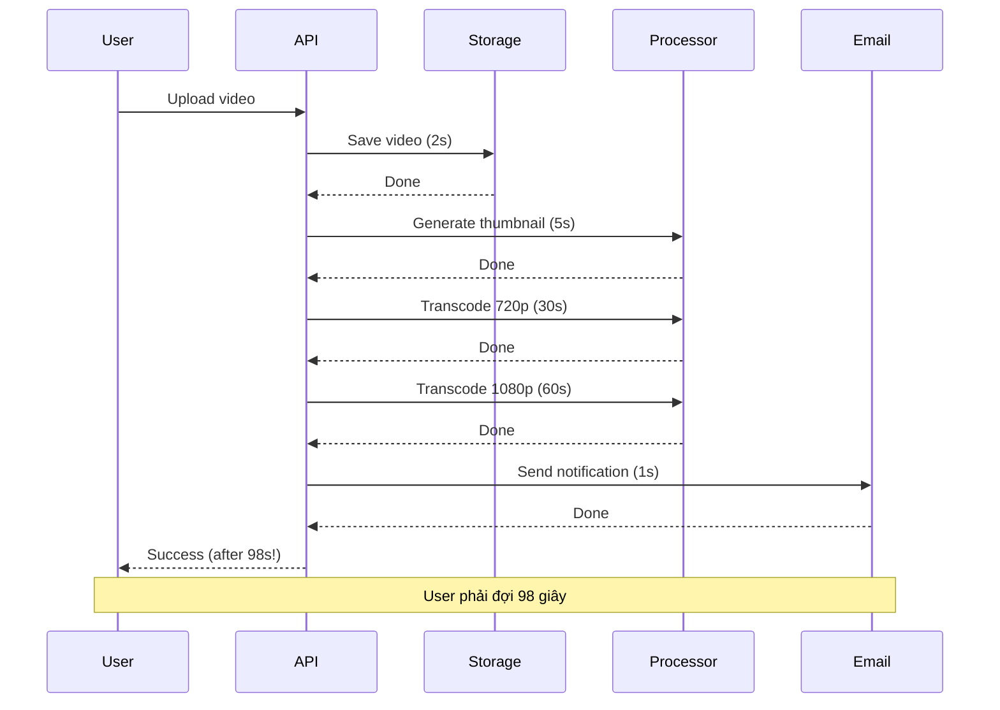
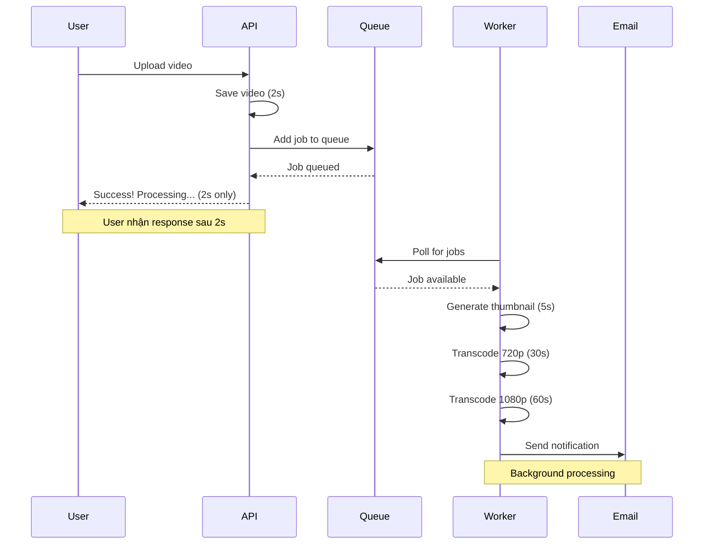
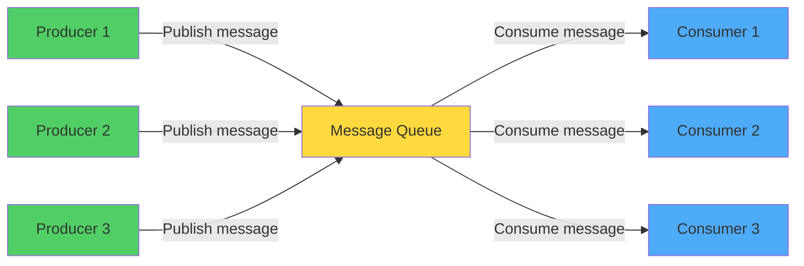
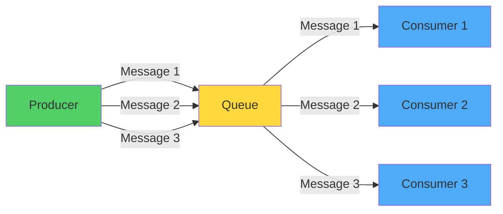
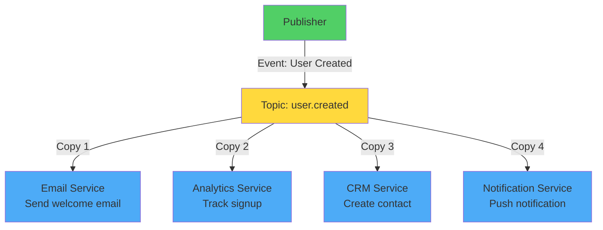
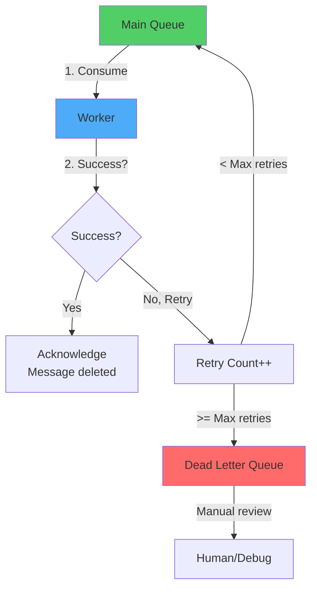
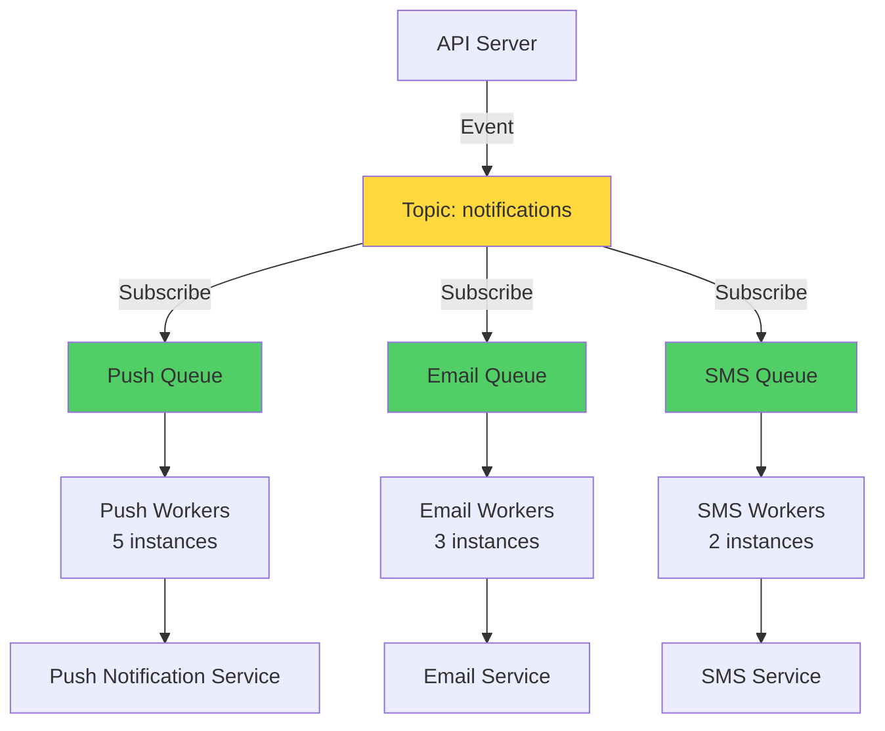

# Message Queues & Async Processing: Decoupling Services

Tôi còn nhớ lần đầu production system của tôi sập vì một email.

User upload video. Server phải:
1. Save video (2 giây)
2. Generate thumbnail (5 giây)
3. Transcode 720p (30 giây)
4. Transcode 1080p (60 giây)
5. Send email notification (1 giây)

Total: 98 giây. User đợi 98 giây để nhận response.

Kết quả? Timeout. User frustrated. Server overload vì mỗi request hold connection 98 giây.

Senior engineer nhìn tôi: *"Em biết message queue chưa?"*

Tôi: *"Chưa ạ..."*

Đó là đêm tôi học về async processing. Và đó là một trong những patterns quan trọng nhất trong distributed systems.

## Tại Sao Cần Async Processing?

### The Synchronous Problem

**Synchronous = User đợi cho đến khi tất cả xong**


*Synchronous processing: User đợi cho đến khi mọi thứ hoàn thành*

**Problems:**
```
Terrible UX
   - User đợi 98 giây
   - Timeout sau 30-60 giây
   - User nghĩ app bị lỗi

Poor resource utilization
   - Connection held for 98 giây
   - Server chỉ handle được ít requests
   - Memory/thread exhausted

Cascading failures
   - Email service down → Entire upload fails
   - Transcode fails → User không nhận video
   - Tight coupling
```

### The Async Solution

**Asynchronous = User nhận response ngay, processing ở background**


*Async processing: User nhận response ngay, work happens ở background*

**Benefits:**
```
Great UX
   - User nhận response sau 2 giây
   - No timeout
   - Clear status: "Processing..."

Better resource utilization
   - Connections freed immediately
   - Server handle nhiều requests
   - Workers scale independently

Fault tolerance
   - Email fail? Video vẫn upload
   - Retry logic built-in
   - Loose coupling
```

## Message Queue Fundamentals

### Core Concepts

**Message Queue = Buffer giữa producers và consumers**


*Message queue decouples producers và consumers*

**Terminology:**
```
Producer:  Service tạo messages (publish/send)
Consumer:  Service process messages (consume/receive)
Queue:     Buffer lưu messages
Message:   Unit of work (job/task/event)
Broker:    Service quản lý queues (RabbitMQ, Kafka, SQS)
```

### Simple Example
```python
# Producer: API server
from queue import MessageQueue

queue = MessageQueue('video-processing')

def upload_video(video_file):
    # Save video nhanh
    video_id = save_to_storage(video_file)
    
    # Add job to queue
    queue.publish({
        'job': 'process_video',
        'video_id': video_id,
        'tasks': ['thumbnail', 'transcode_720p', 'transcode_1080p']
    })
    
    # Return ngay cho user
    return {
        'status': 'processing',
        'video_id': video_id,
        'message': 'Video is being processed'
    }

# Consumer: Background worker
def worker():
    while True:
        # Poll for messages
        message = queue.consume()
        
        if message:
            video_id = message['video_id']
            
            # Process tasks
            generate_thumbnail(video_id)
            transcode_720p(video_id)
            transcode_1080p(video_id)
            
            # Acknowledge message processed
            queue.ack(message)
```

**Timeline:**
```
API call:
00:00 - User uploads
00:02 - API returns (user happy!)
Queue has 1 job

Background:
00:02 - Worker picks up job
00:07 - Thumbnail done
00:37 - 720p done
01:37 - 1080p done
01:38 - Send notification

User experience: 2 seconds
Actual work: 98 seconds (background)
```

## Queue vs Pub/Sub: Hai Patterns Khác Nhau

### Queue Pattern (Point-to-Point)

**One message → One consumer**


*Queue: Mỗi message chỉ được một consumer xử lý*

**Characteristics:**
```
- Mỗi message processed by 1 consumer only
- Load balanced giữa consumers
- Used for task distribution
- Compete for messages
```

**Use cases:**
```
✓ Background jobs (email sending, image processing)
✓ Task distribution (video encoding, PDF generation)
✓ Load leveling (smooth traffic spikes)
✓ Retry logic (failed payments, API calls)
```

**Example:**
```python
# Queue: email-queue
# 3 workers compete for jobs

# Producer
queue.publish({'to': 'user@example.com', 'subject': 'Welcome'})

# Consumer 1 might get it
# OR Consumer 2 might get it  
# OR Consumer 3 might get it
# Only ONE processes it
```

### Pub/Sub Pattern (Publish-Subscribe)

**One message → Many subscribers**


*Pub/Sub: Mỗi subscriber nhận copy của message*

**Characteristics:**
```
- Mỗi message copied đến ALL subscribers
- No competition
- Used for event broadcasting
- Decoupled services
```

**Use cases:**
```
✓ Event notification (user signup, order placed)
✓ Real-time updates (stock prices, live scores)
✓ Fan-out (1 event → multiple actions)
✓ Audit logging (track all actions)
```

**Example:**
```python
# Topic: order.placed
# All subscribers receive event

# Publisher
pubsub.publish('order.placed', {
    'order_id': 12345,
    'user_id': 67890,
    'amount': 99.99
})

# Subscriber 1: Email Service
# Sends order confirmation email

# Subscriber 2: Inventory Service  
# Updates stock count

# Subscriber 3: Analytics Service
# Records sale

# Subscriber 4: Shipping Service
# Creates shipping label

# ALL 4 receive and process the event
```

### Trade-off Comparison
```
Queue (Point-to-Point):
Simple semantics (1 message = 1 consumer)
Natural load balancing
Easy to reason about
Limited to single action per message
Tight coupling if multiple actions needed

Pub/Sub:
Decouple services completely
Easy to add new subscribers
Broadcast events naturally
More complex (eventual consistency)
Harder to debug (who processed what?)
Message duplication overhead
```

**Decision framework:**
```
Use Queue khi:
- Task needs to be done exactly once
- Load balancing giữa workers
- Simple workflow

Use Pub/Sub khi:
- Multiple services care về event
- Need to decouple services
- Fan-out pattern
- Audit/logging requirements
```

## Delivery Guarantees: Critical Understanding

### The Guarantee Spectrum

**At-Most-Once Delivery**
```
Message có thể bị mất, nhưng không bao giờ duplicate

Timeline:
Producer → Send message → Queue
Queue → Deliver to Consumer (maybe fails)
Queue deletes message immediately

Result:
- Success: Message processed once ✓
- Failure: Message lost ✗
- Never: Message processed twice ✓
```
```
Fastest (no confirmation needed)
Simple
Data loss possible
No retry

Use cases:
- Metrics/logging (OK if lose some data)
- Real-time data streams (stale data worthless)
- Best-effort notifications
```

**At-Least-Once Delivery**
```
Message không bao giờ mất, nhưng có thể duplicate

Timeline:
Producer → Send message → Queue
Queue → Deliver to Consumer
Consumer → Process
Consumer → Ack (might fail/timeout)
Queue → Redeliver if no ack

Result:
- Success: Message processed once ✓
- Failure: Message redelivered ✓
- Possible: Message processed multiple times ⚠️
```
```
No message loss
Retry logic built-in
Duplicate processing possible
Must implement idempotency

Use cases:
- Payment processing (with idempotency)
- Order fulfillment
- Critical business logic
```

**Exactly-Once Delivery**
```
Message processed exactly once, guaranteed

Extremely hard to achieve in distributed systems
Requires:
- Distributed transactions
- Deduplication logic
- Coordination between services

Result:
- Always: Message processed exactly once ✓
```
```
Perfect semantics
No loss, no duplicates
Very complex to implement
Performance overhead
Often impossible in practice

Use cases:
- Financial transactions
- Critical business operations
- When duplicates absolutely cannot happen
```

### Idempotency: The Practical Solution

**Problem với at-least-once:**
```python
# Non-idempotent operation
def process_payment(order_id, amount):
    charge_credit_card(amount)  # Charge twice if retry!
    
# Message delivered twice:
# 1st: Charge $100 ✓
# 2nd: Charge $100 again! ✗
# User charged $200
```

**Solution: Idempotent operations**
```python
# Idempotent operation
def process_payment(order_id, amount):
    # Check if already processed
    if payment_exists(order_id):
        return  # Skip, already done
    
    charge_credit_card(amount)
    record_payment(order_id)  # Mark as processed

# Message delivered twice:
# 1st: Charge $100, record ✓
# 2nd: Check → Already done, skip ✓
# User charged $100 (correct!)
```

**Idempotency techniques:**
```python
# Technique 1: Unique message ID
def process_message(message):
    message_id = message['id']
    
    if redis.exists(f"processed:{message_id}"):
        return  # Already processed
    
    # Do work
    do_actual_work(message)
    
    # Mark as processed
    redis.set(f"processed:{message_id}", "1", ex=86400)  # 24h TTL

# Technique 2: Database unique constraint
def create_order(order_data):
    try:
        db.execute("""
            INSERT INTO orders (order_id, user_id, amount)
            VALUES (?, ?, ?)
        """, order_data)
    except UniqueConstraintError:
        # Already exists, idempotent ✓
        pass

# Technique 3: Update operations (naturally idempotent)
def update_user_status(user_id, status):
    db.execute("""
        UPDATE users SET status = ?
        WHERE user_id = ?
    """, status, user_id)
    
    # Running twice = same result ✓
```

**Personal rule:**

**Always assume at-least-once delivery. Always implement idempotency.**

Ngay cả khi queue promise exactly-once, network failures, retries, và bugs có thể cause duplicates.

## Dead Letter Queue (DLQ): Handle Failures

### The Poison Message Problem
```python
# Worker consuming messages
while True:
    message = queue.consume()
    
    try:
        process(message)
        queue.ack(message)
    except Exception as e:
        # Message fails → Retry
        # Retry fails again
        # Retry fails again
        # ...infinite loop!
        # Queue blocked!
```

**Problem:**
```
Scenario:
- Message có bug (malformed data)
- Worker process → Fail
- Queue retry → Fail again
- Queue retry → Fail again
- ...

Result:
- Message never succeeds
- Blocks queue (if ordered)
- Wastes resources
- Other messages stuck behind it
```

### DLQ Solution


*Dead Letter Queue: Messages fail nhiều lần được move sang DLQ*

**Implementation:**
```python
class MessageProcessor:
    MAX_RETRIES = 3
    
    def process_message(self, message):
        try:
            # Attempt processing
            result = do_work(message)
            
            # Success → Acknowledge
            queue.ack(message)
            return result
            
        except Exception as e:
            # Increment retry count
            retry_count = message.get('retry_count', 0) + 1
            
            if retry_count < self.MAX_RETRIES:
                # Retry
                message['retry_count'] = retry_count
                queue.nack(message)  # Return to queue
                
                log.warning(f"Message retry {retry_count}/{self.MAX_RETRIES}")
            else:
                # Max retries exceeded → DLQ
                dlq.publish(message)
                queue.ack(message)  # Remove from main queue
                
                log.error(f"Message moved to DLQ after {self.MAX_RETRIES} retries")
                alert.send("DLQ message", message)
```

**DLQ monitoring:**
```python
# Monitor DLQ regularly
def check_dlq():
    dlq_size = dlq.size()
    
    if dlq_size > 10:
        alert.send(f"DLQ has {dlq_size} messages!")
    
    # Sample messages for debugging
    messages = dlq.peek(5)
    for msg in messages:
        log.info(f"DLQ message: {msg}")
        analyze_failure(msg)

# Run every hour
schedule.every(1).hour.do(check_dlq)
```

**Handling DLQ messages:**
```
1. Investigate root cause
   - Malformed data?
   - Bug in code?
   - External service down?

2. Fix issue
   - Deploy code fix
   - Data migration
   - Update configuration

3. Replay messages
   - Move DLQ → Main queue
   - Reprocess with fix
   - Verify success

4. Or discard
   - If truly invalid
   - If stale (old data)
   - Document reason
```

## Real-World Scenarios

### Scenario 1: E-commerce Order Processing

**Synchronous nightmare:**
```python
def place_order(order_data):
    # All in one request
    validate_inventory(order_data)     # 200ms
    charge_payment(order_data)         # 2s
    update_inventory(order_data)       # 500ms
    create_shipping_label(order_data)  # 3s
    send_confirmation_email(order_data) # 1s
    update_analytics(order_data)       # 300ms
    
    return {"status": "success"}       # After 7 seconds!
```

**Async with queue:**
```python
def place_order(order_data):
    # Critical path only
    validate_inventory(order_data)  # 200ms
    charge_payment(order_data)      # 2s
    
    # Everything else → Queue
    queue.publish({
        'event': 'order.placed',
        'order_id': order_data['id']
    })
    
    return {"status": "success"}    # After 2.2 seconds!

# Background workers
@queue.consumer('order.placed')
def handle_order_placed(event):
    order_id = event['order_id']
    
    update_inventory(order_id)
    create_shipping_label(order_id)
    send_confirmation_email(order_id)
    update_analytics(order_id)
```

**Result:**
```
User experience:
Before: 7 seconds wait
After:  2.2 seconds (70% faster!)

System capacity:
Before: 10 orders/minute (blocked by long processing)
After:  50 orders/minute (quick responses)
```

### Scenario 2: Notification System

**Requirements:**
```
- Send push notifications đến millions users
- Multiple channels (push, email, SMS)
- Cannot block API response
- Need retry logic
- Track delivery status
```

**Architecture:**


*Pub/Sub pattern: Event fanout đến multiple channels*
```python
# API publishes event
def send_notification(user_id, message):
    pubsub.publish('notifications', {
        'user_id': user_id,
        'message': message,
        'channels': ['push', 'email']
    })
    
    return {"status": "queued"}  # Instant response

# Push worker
@pubsub.subscribe('notifications')
def send_push(event):
    if 'push' in event['channels']:
        try:
            push_service.send(event['user_id'], event['message'])
            metrics.increment('push.success')
        except Exception as e:
            metrics.increment('push.failure')
            raise  # Retry

# Email worker (independent)
@pubsub.subscribe('notifications')
def send_email(event):
    if 'email' in event['channels']:
        try:
            email_service.send(event['user_id'], event['message'])
            metrics.increment('email.success')
        except Exception as e:
            metrics.increment('email.failure')
            raise  # Retry
```

### Scenario 3: Image Processing Pipeline

**Chain of transformations:**
```
Original upload → Resize → Compress → Watermark → Store CDN
```

**Implementation with queues:**
```python
# Step 1: Upload
def upload_image(image_file):
    image_id = save_original(image_file)
    
    queue.publish('image.uploaded', {
        'image_id': image_id,
        'format': 'jpg'
    })
    
    return {"image_id": image_id, "status": "processing"}

# Step 2: Resize
@queue.consumer('image.uploaded')
def resize_image(event):
    image_id = event['image_id']
    
    resized = resize(image_id, width=1200)
    save(resized, f"{image_id}_resized")
    
    queue.publish('image.resized', {
        'image_id': image_id
    })

# Step 3: Compress
@queue.consumer('image.resized')
def compress_image(event):
    image_id = event['image_id']
    
    compressed = compress(f"{image_id}_resized", quality=85)
    save(compressed, f"{image_id}_compressed")
    
    queue.publish('image.compressed', {
        'image_id': image_id
    })

# Step 4: Watermark
@queue.consumer('image.compressed')
def add_watermark(event):
    image_id = event['image_id']
    
    watermarked = add_watermark(f"{image_id}_compressed")
    save(watermarked, f"{image_id}_final")
    
    queue.publish('image.ready', {
        'image_id': image_id,
        'url': upload_to_cdn(f"{image_id}_final")
    })

# Step 5: Notify
@queue.consumer('image.ready')
def notify_user(event):
    send_notification(event['image_id'], event['url'])
```

**Benefits:**
```
Each step independent
Scale each step separately  
Retry individual steps
Easy to add new transformations
Monitor each step's performance
```

## Best Practices

### 1. Message Design
```python
# BAD: Large message
queue.publish({
    'user': {
        # Entire user object (10KB)
        'id': 123,
        'name': 'John',
        'email': '...',
        # ... 50 more fields
    },
    'order': {
        # Entire order (20KB)
    }
})

# GOOD: Reference only
queue.publish({
    'user_id': 123,
    'order_id': 456
})

# Consumer fetches what it needs
@queue.consumer
def process(event):
    user = db.get_user(event['user_id'])
    order = db.get_order(event['order_id'])
```

**Why?**
- Smaller messages = faster
- Avoid stale data (fetch fresh từ DB)
- Less network bandwidth

### 2. Error Handling
```python
@queue.consumer
def process_message(message):
    try:
        result = do_work(message)
        queue.ack(message)
        
    except TemporaryError as e:
        # Transient error → Retry
        log.warning(f"Temporary error: {e}, will retry")
        queue.nack(message)  # Requeue
        
    except PermanentError as e:
        # Permanent error → DLQ
        log.error(f"Permanent error: {e}, moving to DLQ")
        dlq.publish(message)
        queue.ack(message)
        
    except Exception as e:
        # Unknown error → Investigate
        log.exception(f"Unknown error: {e}")
        alert.send("Unknown queue error", message, e)
        queue.nack(message)
```

### 3. Monitoring
```python
# Track queue metrics
metrics.gauge('queue.size', queue.size())
metrics.gauge('queue.oldest_message_age', queue.oldest_age())
metrics.gauge('dlq.size', dlq.size())

metrics.histogram('message.processing_time', processing_time)
metrics.increment('message.success')
metrics.increment('message.failure')

# Alerts
if queue.size() > 10000:
    alert.send("Queue backlog!")

if queue.oldest_age() > 3600:  # 1 hour
    alert.send("Messages stuck in queue!")

if dlq.size() > 100:
    alert.send("Too many DLQ messages!")
```

### 4. Backpressure Handling
```python
# Consumer rate limiting
class RateLimitedConsumer:
    def __init__(self, max_per_second=100):
        self.rate_limiter = RateLimiter(max_per_second)
    
    def consume(self):
        while True:
            # Wait if rate limit exceeded
            self.rate_limiter.wait()
            
            message = queue.consume()
            if message:
                self.process(message)

# Circuit breaker pattern
class CircuitBreaker:
    def __init__(self):
        self.failures = 0
        self.state = 'closed'  # closed, open, half-open
    
    def call(self, func):
        if self.state == 'open':
            raise Exception("Circuit breaker open")
        
        try:
            result = func()
            self.failures = 0
            return result
        except Exception:
            self.failures += 1
            if self.failures >= 5:
                self.state = 'open'
            raise
```

## Key Takeaways

**Message queues solve critical problems:**
```
✓ Decouple services
✓ Handle traffic spikes (buffer)
✓ Enable async processing
✓ Built-in retry logic
✓ Improve UX (fast responses)
```

**Patterns:**
```
Queue (Point-to-Point):
- Task distribution
- Load balancing
- 1 message → 1 consumer

Pub/Sub:
- Event broadcasting
- Fan-out pattern  
- 1 message → N subscribers
```

**Delivery guarantees:**
```
At-most-once:  Fast, may lose data
At-least-once: Reliable, may duplicate (USE THIS)
Exactly-once:  Perfect, very complex (rarely achievable)

→ Always implement idempotency
```

**Best practices:**
```
✓ Keep messages small (references, not full data)
✓ Implement idempotency
✓ Use DLQ for poison messages
✓ Monitor queue metrics
✓ Handle backpressure
✓ Retry transient errors
✓ Alert on anomalies
```

**Khi nào dùng message queues?**
```
Use queues khi:
✓ Long-running tasks (> 5 seconds)
✓ User không cần kết quả ngay
✓ Need to decouple services
✓ Handle traffic spikes
✓ Built-in retry logic needed

Don't use khi:
✗ User needs immediate response
✗ Synchronous workflow
✗ Simple CRUD operations
```

**Lời khuyên cá nhân:**

Start simple với managed services (AWS SQS, Google Pub/Sub). Chỉ run own infrastructure (RabbitMQ, Kafka) khi có specific requirements và team có expertise.

Message queues là một trong những patterns quan trọng nhất trong distributed systems. Master này và bạn unlock khả năng build truly scalable, resilient applications.
