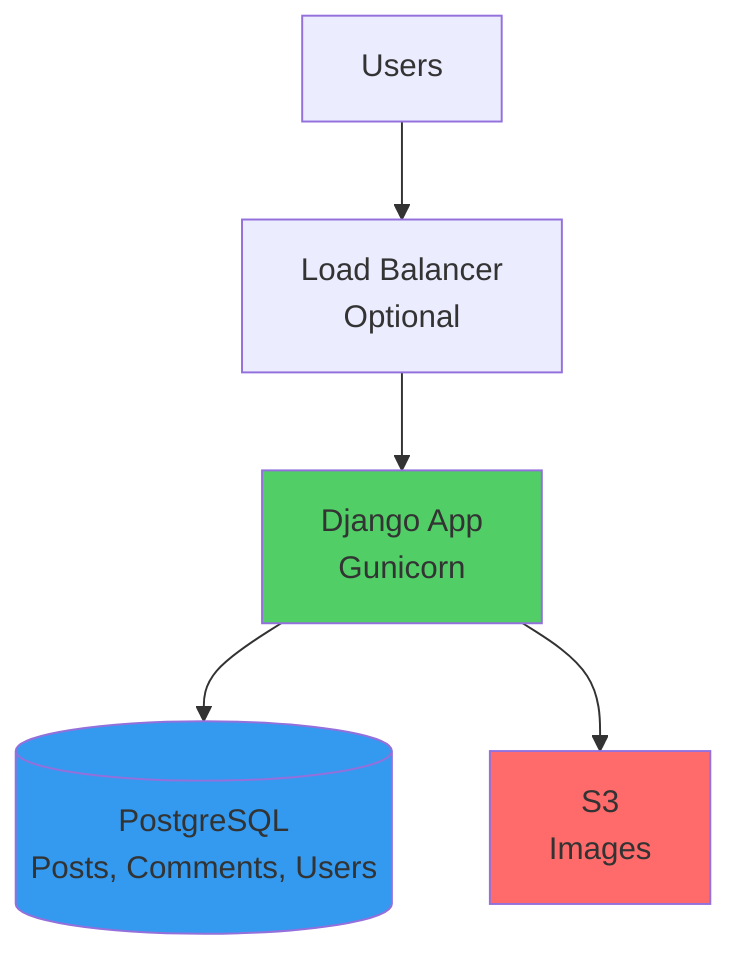
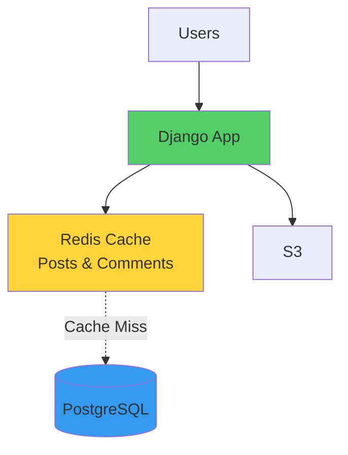
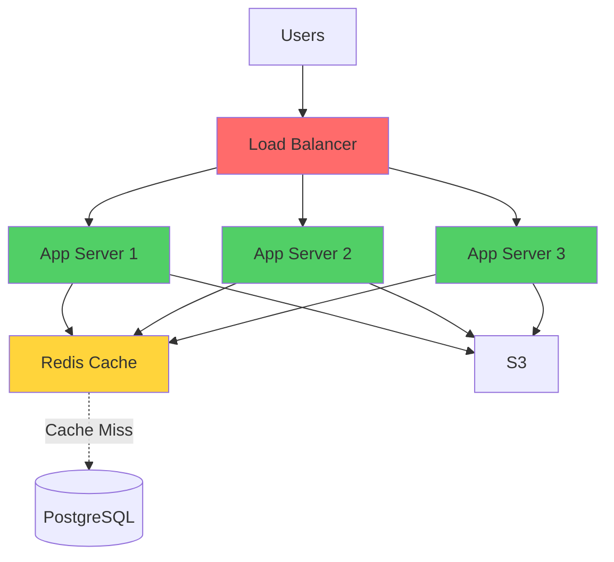
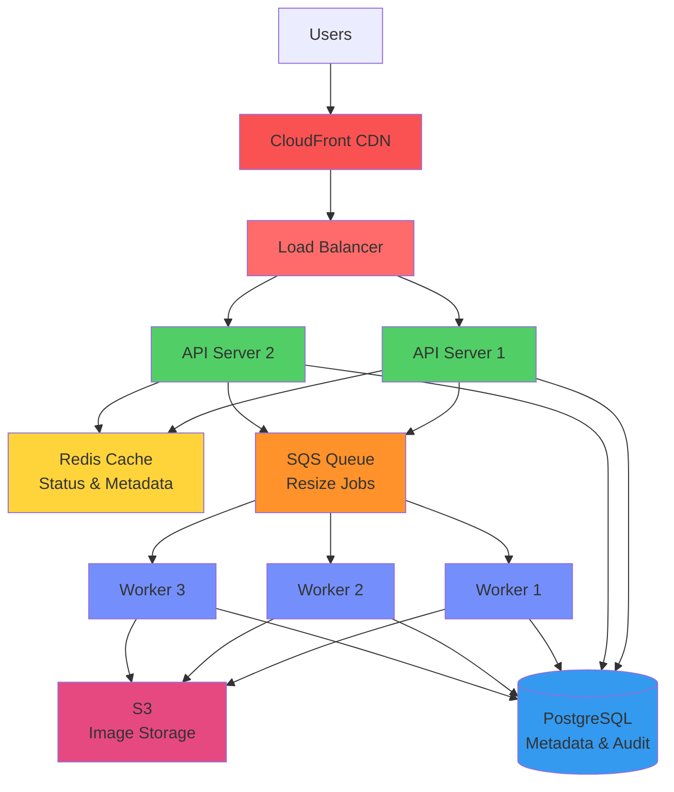
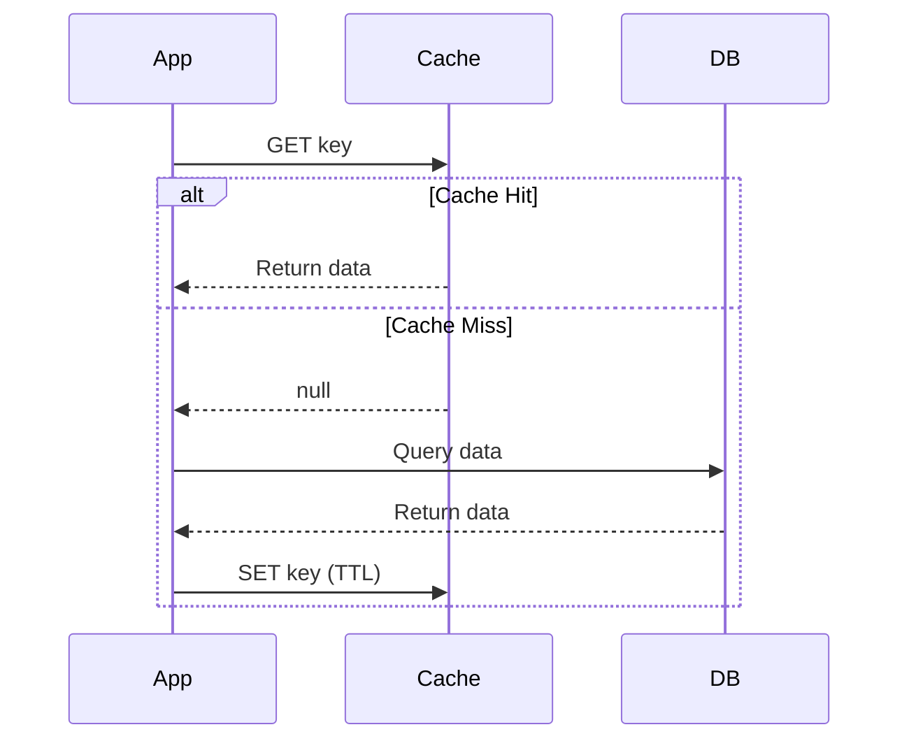
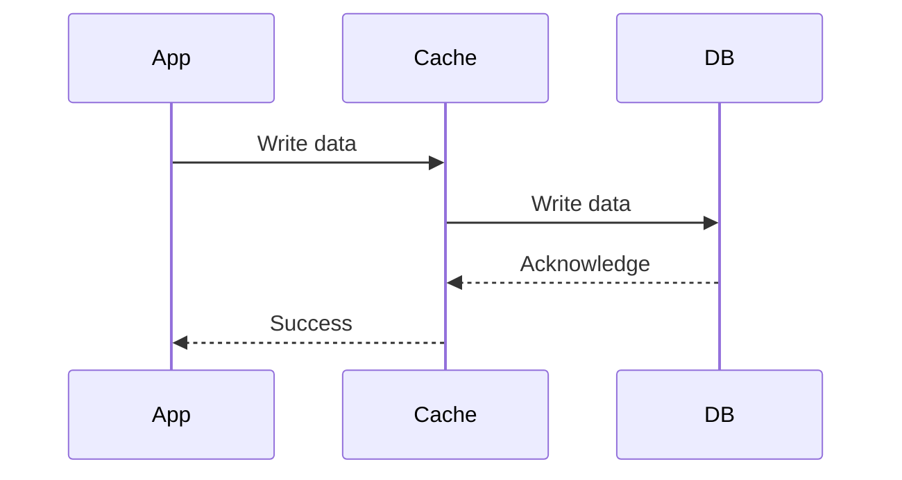
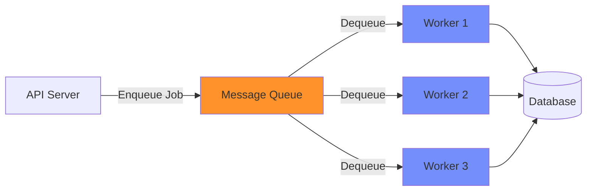
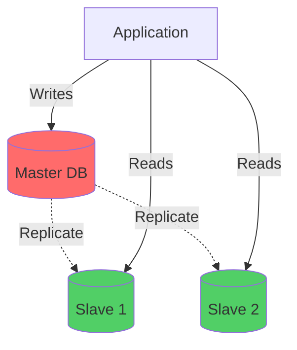

# Integration & Trade-off Thinking: Kết Hợp Components Thành Hệ Thống

Đây là lesson mà 90% courses bỏ qua. Và đó là lý do tại sao nhiều engineers biết từng component nhưng không biết design hệ thống.

Tôi còn nhớ lần đầu tiên phải thiết kế một hệ thống hoàn chỉnh. Tôi biết cache, biết database, biết message queue. Nhưng khi ngồi trước whiteboard, tôi hoàn toàn blank.

*"Tôi dùng cái nào trước? Cache hay database? Queue đặt ở đâu? Load balancer connect với gì?"*

Senior architect ngồi bên cạnh nói: *"Em biết từng viên gạch, nhưng chưa biết xây nhà."*

Đó là lesson này. Không phải học thêm component mới. Mà học cách **kết hợp chúng thành hệ thống hoàn chỉnh**.

## Tại Sao Integration Thinking Quan Trọng Hơn Component Knowledge?

**Reality check:**
```
Biết cache:           ✅
Biết database:        ✅
Biết message queue:   ✅
Biết load balancer:   ✅

Design được hệ thống: ❌

Why?
```

Vì **system design không phải về components. Nó về interactions giữa components.**

### The Integration Gap

**Gap 1: Component interactions**
```
Question: Cache nằm ở đâu trong flow?

Wrong thinking:
"Tôi cần cache → Thêm Redis"

Right thinking:
"Cache nằm giữa app server và database
→ App check cache first
→ Cache miss → Query database
→ Store in cache
→ Next request hit cache"
```

**Gap 2: Trade-off combinations**
```
Mỗi component có trade-offs riêng:
- Cache: Fast nhưng stale data risk
- Queue: Async nhưng eventual processing
- DB replica: Scale reads nhưng replication lag

Question: Khi combine chúng, trade-offs tương tác thế nào?
```

**Gap 3: Real constraints**
```
Textbook: "Dùng cache cho performance"

Reality:
- Budget: $500/month
- Team: 2 developers
- Maintenance: Ai monitor Redis?
- Complexity: Team có experience không?

→ Decision phức tạp hơn nhiều
```

**Key insight:** Components là tools. Integration là craft.

## Thinking Framework: From Problem to Architecture

Đây là framework tôi dùng cho mọi system design.

### Step 1: Define Requirements (Problem-First)

**Functional requirements:**
```
WHAT system phải làm:
- User upload ảnh
- System resize ảnh
- User xem ảnh đã resize
```

**Non-functional requirements:**
```
HOW WELL system phải làm:
- Upload: < 5 seconds response
- View: < 500ms latency
- Scale: 100K uploads/day
- Availability: 99.9% uptime
```

**Constraints:**
```
- Budget: $1,000/month
- Team: 3 developers
- Timeline: Ship trong 2 tháng
- Expertise: Team biết Node.js, PostgreSQL
```

### Step 2: Identify Core Components Needed

**Must-have components:**
```
Storage: Cần lưu ảnh → Object storage (S3)
Database: Cần metadata → SQL hoặc NoSQL
Compute: Cần resize ảnh → App servers
```

**Optional components (evaluate):**
```
Cache: Cần không? → Depends on read pattern
Queue: Cần không? → Depends on processing time
Load balancer: Cần không? → Depends on traffic
CDN: Cần không? → Depends on global users
```

**Critical thinking:**
```
Đừng thêm component "just in case"
Mỗi component = More complexity
Only add khi có clear reason
```

### Step 3: Map Data Flow

**Trace request từ client đến response:**
```
User upload ảnh:
1. Client → API server
2. API → Validate file
3. API → Upload to S3
4. API → Add job to queue
5. API → Return "processing" response
6. Worker → Process resize job
7. Worker → Upload resized to S3
8. Worker → Update database
9. User poll API → Get status

Identify:
- Sync vs async boundaries
- Where to add cache
- Where failures happen
```

### Step 4: Apply Trade-off Thinking

**For each component, ask:**
```
1. What problem does it solve?
2. What's the cost? (complexity, money, maintenance)
3. What are alternatives?
4. Can we start simpler?
```

**Example decision tree:**
```
Need to process images:

Option A: Synchronous
- User waits for resize
- Simple code
- Bad UX if slow

Option B: Queue + Workers
- User gets immediate response
- Complex infrastructure
- Good UX

Given constraints:
- Resize takes 5 seconds
- User can wait 5 seconds? NO
→ Choose Option B
```

### Step 5: Start Simple, Evolve

**Version 1 (MVP):**
```
Single server
PostgreSQL
No cache
No queue (if processing fast enough)

Ship in 2 weeks
Learn from real usage
```

**Version 2 (After data):**
```
If slow:
→ Add queue + workers

If reads slow:
→ Add cache

If server overload:
→ Add load balancer
```

**Principle: Build what you need NOW, not what you might need LATER.**

## Real Architecture Example 1: Simple Blog Platform

Let's design từ zero.

### Requirements
```
Functional:
- Users đọc blog posts
- Admin viết/edit posts
- Users comment

Non-functional:
- 10K daily active users
- 1K posts total
- 10K comments/day
- Latency: < 1 second

Constraints:
- Budget: $200/month
- Team: 2 developers
- Stack: Python/Django, PostgreSQL
```

### Architecture V1: Monolith Simple


*Architecture V1: Simple monolith, không có cache hay queue*

**Decision rationale:**
```
No cache:
✓ 10K users = Low traffic
✓ 1K posts = DB handles easily
✓ PostgreSQL fast enough with indexes
✓ Save $50/month Redis cost
✓ Less complexity

No queue:
✓ No heavy processing
✓ Comments insert fast (< 100ms)
✓ Save infrastructure cost

No CDN:
✓ Regional users only
✓ S3 already fast
✓ Save $30/month CDN cost

Load balancer: Optional
✓ Nice to have cho zero-downtime deploy
✓ 1 server handles 10K users fine
✓ Add later if needed
```

**Total cost: $100/month (EC2 + RDS + S3)**

### When to Evolve: Data-Driven Decisions

**Trigger 1: Slow database queries**
```
Symptom:
- Page load 3 seconds
- PostgreSQL CPU 80%
- Slow query logs showing repeated queries

Solution:
→ Add Redis cache
```

**Architecture V2: Add Cache Layer**


*Architecture V2: Thêm Redis cache khi database queries chậm*

**Implementation:**
```python
def get_post(post_id):
    # Try cache first
    cache_key = f"post:{post_id}"
    cached = redis.get(cache_key)
    
    if cached:
        return json.loads(cached)  # Cache hit
    
    # Cache miss → Query database
    post = db.query("SELECT * FROM posts WHERE id = ?", post_id)
    
    # Store in cache (TTL 1 hour)
    redis.setex(cache_key, 3600, json.dumps(post))
    
    return post

def create_comment(post_id, comment_data):
    # Write to database
    db.insert("comments", comment_data)
    
    # Invalidate post cache (has new comment)
    redis.delete(f"post:{post_id}")
```

**New cost: $150/month (+$50 Redis)**

**Trigger 2: High traffic**
```
Symptom:
- 100K daily users (10x growth)
- Single server CPU 90%
- Response time degrading

Solution:
→ Add load balancer + Scale horizontally
```

**Architecture V3: Horizontal Scaling**


*Architecture V3: Load balancer + Multiple servers khi traffic cao*

**New cost: $400/month (3 servers + LB + Redis + DB)**

### Key Lessons
```
1. Started simple (V1)
   - No premature optimization
   - Shipped in 2 weeks
   - Learned from real data

2. Evolved based on actual problems (V2, V3)
   - Not predictions
   - Not "best practices"
   - Real metrics driving decisions

3. Cost conscious
   - V1: $100/month (10K users)
   - V2: $150/month (50K users)
   - V3: $400/month (100K users)
   - Cost scales với value

4. Complexity managed
   - Added components one at a time
   - Team learned incrementally
   - Production stability maintained
```

## Real Architecture Example 2: Image Processing Service

Một case phức tạp hơn với async processing.

### Requirements
```
Functional:
- Users upload images
- System resize to 3 sizes (thumbnail, medium, large)
- Users view processed images

Non-functional:
- 50K uploads/day
- Processing: 5-10 seconds/image
- Upload response: < 2 seconds
- View latency: < 500ms
- 99% availability

Constraints:
- Budget: $2,000/month
- Team: 4 developers
- Need audit trail
```

### Architecture: Full Stack


*Architecture hoàn chỉnh với tất cả components: CDN, Load Balancer, Cache, Queue, Workers, Database*

### Component Interactions & Trade-offs

**1. Upload Flow (Sync → Async Boundary)**
```python
# API Server
@app.post("/upload")
async def upload_image(file):
    # 1. Validate file (sync)
    if not is_valid_image(file):
        return {"error": "Invalid image"}, 400
    
    # 2. Upload original to S3 (sync, fast ~500ms)
    original_url = s3.upload(file, bucket="originals")
    
    # 3. Create database record (sync, fast ~50ms)
    image_id = db.insert("images", {
        "original_url": original_url,
        "status": "processing",
        "user_id": current_user.id
    })
    
    # 4. Add resize job to queue (async boundary)
    queue.send({
        "image_id": image_id,
        "original_url": original_url,
        "sizes": ["thumbnail", "medium", "large"]
    })
    
    # 5. Return immediately (< 2 seconds)
    return {
        "image_id": image_id,
        "status": "processing",
        "message": "Image is being processed"
    }, 202  # Accepted

# User không đợi resize (5-10 giây)
```

**Trade-off:**
```
Fast user response (< 2s)
Handle traffic spikes (queue buffers)
Workers scale independently
Eventual processing (not immediate)
More complex (queue infrastructure)
Need polling mechanism for status
```

**2. Worker Processing (Async)**
```python
# Worker
def process_resize_job(job):
    image_id = job["image_id"]
    original_url = job["original_url"]
    
    try:
        # 1. Download original
        original = s3.download(original_url)
        
        # 2. Resize to 3 sizes
        for size in ["thumbnail", "medium", "large"]:
            resized = resize_image(original, size)
            
            # Upload resized
            resized_url = s3.upload(resized, bucket=f"images-{size}")
            
            # Update database
            db.update("images", image_id, {
                f"{size}_url": resized_url
            })
        
        # 3. Update status
        db.update("images", image_id, {"status": "completed"})
        
        # 4. Invalidate cache
        cache.delete(f"image:{image_id}")
        
        # 5. Audit log
        db.insert("audit_logs", {
            "image_id": image_id,
            "action": "processed",
            "timestamp": now()
        })
        
    except Exception as e:
        # Error handling
        db.update("images", image_id, {"status": "failed"})
        
        # Retry logic (SQS auto-retry)
        if job.retry_count < 3:
            raise  # Re-queue
        else:
            # Move to dead letter queue
            dlq.send(job)
```

**Trade-off:**
```
Fault tolerant (retry logic)
Scalable (add more workers)
Audit trail (database logs)
Complex error handling
Must handle idempotency
Monitoring overhead
```

**3. Status Polling (Read Path)**
```python
# API Server
@app.get("/image/{image_id}/status")
async def get_status(image_id):
    # 1. Check cache first
    cached = cache.get(f"image:{image_id}")
    if cached:
        return json.loads(cached)
    
    # 2. Cache miss → Query database
    image = db.query("SELECT * FROM images WHERE id = ?", image_id)
    
    # 3. Cache result (TTL 5 minutes)
    cache.setex(f"image:{image_id}", 300, json.dumps(image))
    
    return image
```

**Trade-off:**
```
Fast reads (cache)
Reduce database load
Cache invalidation complexity
Possible stale status (max 5 min)
```

**4. View Images (CDN Layer)**
```python
# Image URLs include CDN
image_url = f"https://cdn.example.com/images/large/{image_id}.jpg"

# CDN behavior:
- First request → CDN fetch từ S3 (origin) → Cache
- Subsequent requests → Serve từ CDN cache
- TTL: 1 year (images immutable)
```

**Trade-off:**
```
Extremely fast (edge locations)
Reduce S3 costs (fewer requests)
Global low latency
CDN cost ($100-200/month)
Cache invalidation hard (if image changed)
```

### Total Architecture Trade-offs
```
Components:
- CDN: $150/month
- Load Balancer: $50/month
- 2 API servers: $200/month
- Redis: $100/month
- SQS Queue: $20/month
- 3 Workers: $300/month
- PostgreSQL RDS: $200/month
- S3: $100/month
-----------------------
Total: $1,120/month

Handles:
- 50K uploads/day
- 150K processed images/day
- 1M views/day
- 99.9% availability

Trade-offs accepted:
Complexity → Gain scalability
Cost → Gain reliability
Eventual processing → Gain user experience
```

### What If Budget Was $500/month?

**Alternative architecture:**
```
Simplify:
- No CDN → S3 direct (save $150)
- 1 API server → Handle 50K uploads (save $100)
- No dedicated workers → Lambda functions (save $250)
- Smaller Redis → ElastiCache t3.micro (save $50)

Total: $470/month

Trade-offs:
Slower global latency (no CDN)
Less resilient (single API server)
Still scalable (Lambda auto-scales)
Still works
```

**Key lesson: Architecture adapts to constraints.**

## Component Interaction Patterns

### Pattern 1: Cache-Aside


*Cache-aside pattern: Application quản lý cache logic*

**When to use:**
```
✓ Read-heavy workload
✓ Data không thay đổi thường xuyên
✓ Application có thể handle cache logic
```

### Pattern 2: Write-Through Cache


*Write-through: Mọi write đi qua cache, cache update DB*

**When to use:**
```
✓ Data freshness critical
✓ Read >> Write
✓ Can accept slower writes
```

### Pattern 3: Queue-Worker Pattern


*Queue-worker: Async processing với retry và scaling*

**When to use:**
```
✓ Processing takes > 5 seconds
✓ User doesn't need immediate result
✓ Need retry logic
✓ Traffic spiky
```

### Pattern 4: Read Replica Pattern


*Read replicas: Writes đi master, reads từ slaves*

**When to use:**
```
✓ Read >> Write (70%+ reads)
✓ Replication lag acceptable (< 1s)
✓ Single master can handle writes
```

## Decision Framework: Component Selection

### Framework Matrix
```
For each component, evaluate:

1. Problem it solves:
   - Specific bottleneck
   - Measurable impact
   - Not "nice to have"

2. Cost (total):
   - Infrastructure ($)
   - Development time
   - Maintenance burden
   - Operational complexity

3. Alternatives:
   - Simpler solutions?
   - Can optimize existing?
   - Must add now?

4. Risk:
   - New technology?
   - Team expertise?
   - Failure modes?

Decision: Add chỉ khi Problem > Cost + Risk
```

### Example Decisions

**Decision 1: Add cache hay không?**
```
Problem:
- Database queries slow (500ms)
- Read-heavy (90% reads)
- 1000 req/s

Solution evaluation:

Option A: Add Redis cache
Reduce query time 500ms → 10ms
Reduce DB load 90%
Cost $100/month
Cache invalidation complexity
One more thing to monitor

Option B: Optimize queries + indexes
Free
No new infrastructure
Permanent improvement
Time investment (1 week)
Might not be enough

Decision: Try Option B first
- If queries still > 100ms after optimization
→ Then add cache
```

**Decision 2: Queue hay Lambda?**
```
Problem:
- Image processing takes 10 seconds
- 1000 uploads/day
- User can't wait

Solution evaluation:

Option A: SQS + EC2 workers
Full control
Predictable cost
Must manage servers
$150/month base cost

Option B: Lambda functions
Auto-scale
Pay per use (~$20/month for 1000 uploads)
No server management
15 minute timeout limit
Cold start latency

Given: 1000 uploads/day, 10 second processing

Decision: Lambda
- Cost 7.5x cheaper
- Auto-scaling included
- 10 seconds well under 15 min limit
- Team doesn't manage servers
```

**Decision 3: CDN hay không?**
```
Problem:
- Images load slow for international users
- 10K daily users
- 50% US, 50% Asia

Solution evaluation:

Option A: Add CloudFront CDN
Low latency globally
Reduce S3 costs
$100/month
Setup complexity

Option B: S3 Transfer Acceleration
Faster than normal S3
Only $5/month
Not as fast as CDN
Still origin latency

Option C: Do nothing
Free
Poor UX for Asia users

Metrics needed:
- Measure actual latency: US vs Asia
- If Asia > 2 seconds → Add CDN
- If Asia 500ms-1s → Transfer Acceleration
- If Asia < 500ms → Do nothing

Decision: Data-driven, not assumption-driven
```

## Common Integration Mistakes

### Mistake 1: Adding Components "Just In Case"
```
Bad:
"Let's add Redis cache from day 1"
"We might need it later"

Good:
"Database queries average 50ms"
"For 1000 users, this is fast enough"
"Add cache when queries > 200ms or traffic > 10K users"

Principle: YAGNI (You Aren't Gonna Need It)
```

### Mistake 2: Copy-Pasting Netflix Architecture
```
Bad:
Startup with 100 users:
- 50 microservices
- Kubernetes cluster
- Service mesh
- Event sourcing
- CQRS
"Netflix does it!"

Good:
Startup with 100 users:
- Monolith
- PostgreSQL
- 1 server
- Ship fast

Context matters. Netflix có 200M users, 500 teams.
Bạn không phải Netflix.
```

### Mistake 3: Premature Optimization
```
Bad:
"Let's shard database from day 1"
"We'll eventually need to scale"

Good:
"We have 1000 users"
"Single PostgreSQL handles 100K users"
"We'll shard when we actually hit limits"

Principle: Optimize for NOW, not hypothetical future
```

### Mistake 4: Ignoring Operational Burden
```
Bad thinking:
"This architecture is technically perfect!"

Reality check:
- 10 components to monitor
- 5 different technologies
- 3 person team
- No one has experience với half the stack
→ Production nightmares

Good thinking:
"This architecture is simple enough cho team maintain"
"We understand every component"
"On-call won't be hell"
```

### Mistake 5: Not Measuring
```
Bad:
Add cache → "It feels faster"
Add queue → "Should help với spikes"

Good:
Before cache:
- Avg query time: 500ms
- P95: 2 seconds
- Database CPU: 80%

After cache:
- Avg query time: 50ms (10x faster)
- P95: 150ms (13x faster)
- Database CPU: 20% (4x reduction)
- Cache hit rate: 85%

Measure → Prove impact
```

## Key Takeaways

**Integration thinking > Component knowledge:**
```
Biết từng component: Necessary
Biết combine components: Sufficient
Biết trade-offs: Mastery
```

**Architecture là evolutionary:**
```
V1: Simple monolith
    ↓ (when slow)
V2: Add cache
    ↓ (when traffic high)
V3: Add load balancer
    ↓ (when writes overload)
V4: Add read replicas
    ↓ (when need async)
V5: Add queue + workers

Each step là response to real problem
Not predictions
```

**Component selection framework:**
```
1. What problem? (specific, measurable)
2. What's the cost? (money, complexity, maintenance)
3. What's alternative? (simpler solutions?)
4. Can we wait? (add later when needed?)

Add component chỉ khi: Problem > Cost + Risk
```

**Real trade-offs matter:**
```
Technical trade-offs: Performance, consistency, availability
Business trade-offs: Cost, time to market
Team trade-offs: Expertise, maintenance burden
User trade-offs: UX, reliability

Good architect balances ALL
Not just technical
```

**Start simple, evolve based on data:**
```
Don't: Design for 1M users when you have 100
Do: Design for current scale + 2-3x growth
Do: Measure actual bottlenecks
Do: Evolve architecture incrementally

"Premature optimization is the root of all evil"
- Donald Knuth
```

**Context is everything:**
```
Netflix architecture ≠ Your architecture
Google's scale ≠ Your scale
Best practices ≠ Best for YOU

Understand context:
- Current scale
- Growth rate
- Team size
- Budget
- Timeline
- Expertise

Then design accordingly
```

**Checklist trước khi add component:**
```
☐ Có problem cụ thể với metrics không?
☐ Đã thử optimize existing components chưa?
☐ Component này solve problem đó không?
☐ Cost (time + money + complexity) worth it không?
☐ Team có expertise maintain không?
☐ Có thể add sau được không?

Nếu không pass checklist → Đừng add
```

**Final wisdom:**

System design không phải về dùng technology mới nhất hay phức tạp nhất.

Nó về **solve real problems với appropriate solutions**.

Simple solutions cho simple problems.
Complex solutions chỉ khi thực sự cần.

**"Make it work, make it right, make it fast - in that order."**

Master integration thinking, và bạn sẽ design được systems scale millions users.

---

**Bài tiếp theo:** Phase 3 - Distributed Systems Fundamentals: Consistency, Consensus, và Distributed Transactions.