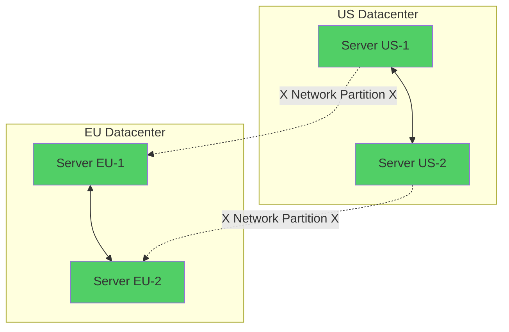
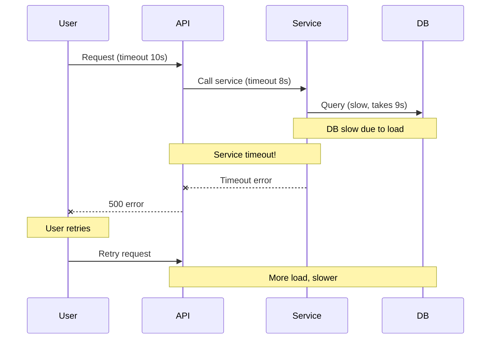
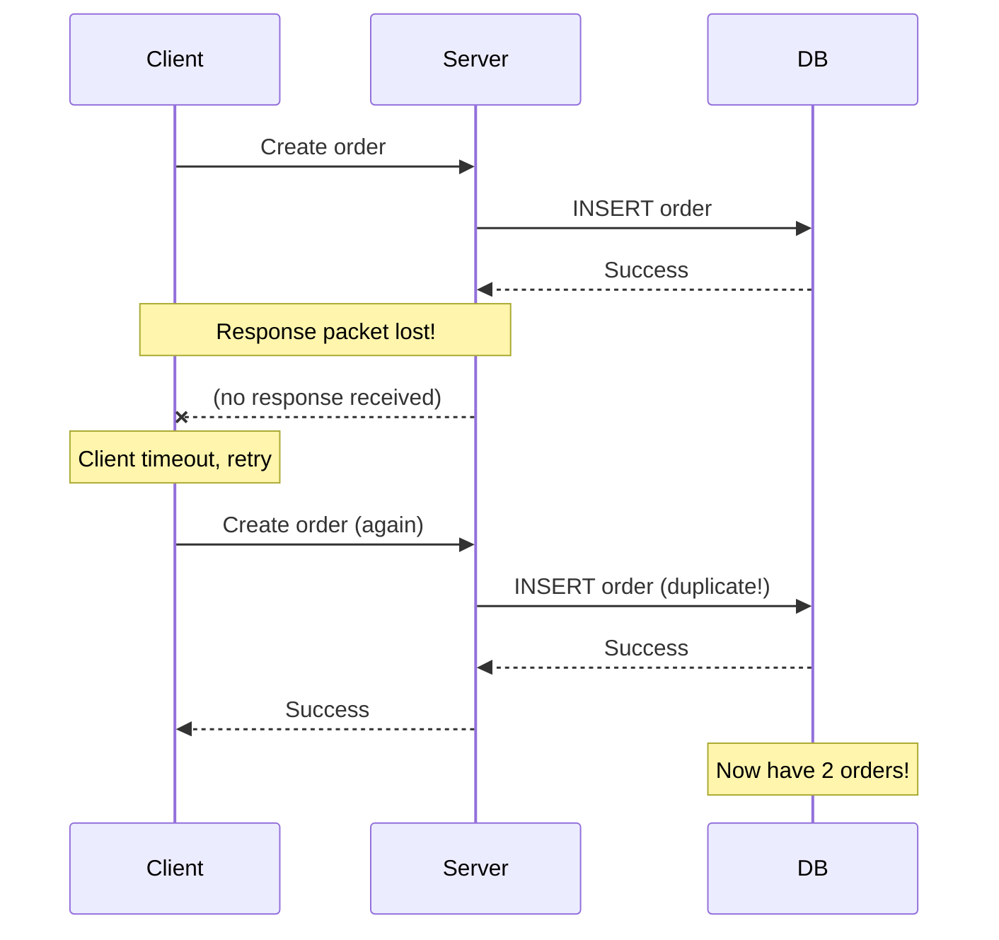
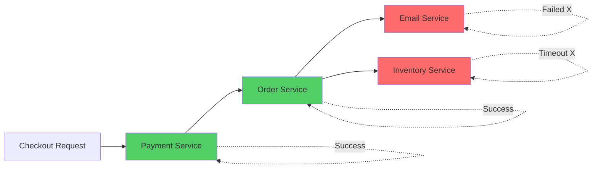
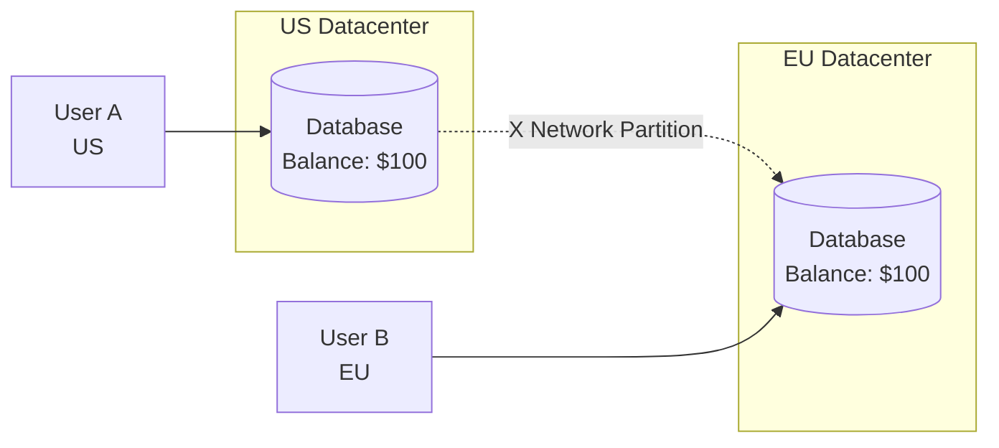

# Reality of Distributed Systems: Failure Models & CAP Thinking

Tôi còn nhớ lần đầu tiên production system của tôi bị network partition.

2 giờ sáng. Monitoring alert nổ inh ỏi. Một phần users ở US không login được. Một phần users ở EU login bình thường. Database vẫn healthy. Application servers vẫn running.

Tôi hoang mang total. Kiểm tra logs, không thấy errors. Kiểm tra CPU, memory, tất cả normal.

Senior architect online: *"Check network connectivity giữa US và EU datacenters."*

Bingo. AWS có network issue. US datacenter không connect được EU datacenter. Hệ thống đang ở trạng thái **network partition**.

Đó là lúc tôi học bài học đắt giá nhất: **Distributed systems thì luôn luôn fail. Không phải "if", mà là "when".**

## Tại Sao Distributed Systems Khác Biệt?

### Single Machine vs Distributed: Assumptions Bị Phá Vỡ

**Single machine (local code):**
```python
# Local function call
result = calculate_total(items)

Assumptions:
Function luôn return (hoặc throw exception)
Execution time predictable
Data consistent
Either success or fail (no in-between)
```

**Distributed system (network call):**
```python
# Remote API call
result = api.calculate_total(items)

Reality:
Request có thể lost (no response)
Response có thể timeout (slow network)
Request có thể duplicate (retry)
Partial success/failure possible
Data có thể inconsistent across nodes
```

**Key insight:** Khi move từ single machine sang distributed, mọi assumption bạn từng biết đều sai.

### The Fallacies of Distributed Computing

Peter Deutsch và James Gosling đã tổng kết 8 giả định sai lầm mà developers thường mắc phải:
```
1. The network is reliable
   → Reality: Packets drop, connections fail

2. Latency is zero  
   → Reality: Network calls take 10-1000ms

3. Bandwidth is infinite
   → Reality: Network có giới hạn throughput

4. The network is secure
   → Reality: Data có thể bị intercept

5. Topology doesn't change
   → Reality: Servers die, networks reconfigure

6. There is one administrator
   → Reality: Multiple teams, multiple configs

7. Transport cost is zero
   → Reality: Serialization, network transfer cost

8. The network is homogeneous
   → Reality: Different protocols, versions
```

**Lesson:** Thiết kế distributed system = Thiết kế cho failure.

## Murphy's Law in Distributed Systems

**Murphy's Law:** *"Anything that can go wrong, will go wrong."*

Trong distributed systems, law này được amplified:

**"Everything that can go wrong, WILL go wrong. Simultaneously. At 3am. On Black Friday."**

### Real Production Failures Tôi Đã Trải Qua

**Failure 1: The Silent Data Corruption**
```
Scenario:
- Database replicate Master → Slave
- Network packet corruption (1 in 10 million)
- Slave nhận corrupted data
- Application read từ Slave
- Return sai data cho users (subtle bugs)

Impact: 3 days để detect, 1 week để fix
```

**Failure 2: The Cascading Timeout**
```
Scenario:
- Service A call Service B (timeout 30s)
- Service B bị slow (disk issue)
- Service A đợi 30s per request
- Requests queue up
- Service A memory exhausted
- Service A crashes
- Services depend on A also fail

Impact: Entire system down 2 hours
```

**Failure 3: The Clock Skew**
```
Scenario:  
- Server 1 clock: 10:00:00
- Server 2 clock: 09:59:30 (30s behind)
- Event A happens on Server 1 at 10:00:00
- Event B happens on Server 2 at 09:59:45
- System thinks B happened before A (wrong!)

Impact: Transaction ordering corrupted
```

**Takeaway:** Không có failure scenario nào "too weird". Tất cả đều xảy ra trong production.

## Types of Failures in Distributed Systems

### Failure Type 1: Network Partition

**Định nghĩa:** Một phần hệ thống không communicate được với phần khác, nhưng cả hai vẫn running.


*Network partition: US và EU datacenters không connect được nhau, nhưng servers trong mỗi datacenter vẫn hoạt động bình thường*

**Scenario thực tế:**
```
Timeline:
10:00:00 - Network partition xảy ra
10:00:01 - User A (US) updates profile
10:00:02 - User B (EU) reads profile → Sees old data
10:00:30 - Network heals
10:00:31 - EU datacenter receives update
10:00:32 - User B reads again → Sees new data

Problem: 30 giây inconsistency
```

**Tại sao partition xảy ra?**
```
Common causes:
- Network equipment failure (switch, router)
- Fiber optic cable cut
- AWS/GCP regional issues
- DDoS attacks
- Misconfiguration
- Too much traffic (congestion)
```

**Không thể prevent, chỉ có thể handle:**
```python
# Assume network luôn available
def update_user(user_id, data):
    primary_db.write(data)
    replica_db.write(data)  # Assume này luôn succeed

# Handle partition
def update_user(user_id, data):
    try:
        primary_db.write(data)
    except WriteError:
        log_error("Primary DB unavailable")
        queue_for_retry(data)
    
    try:
        replica_db.write(data)
    except WriteError:
        # Replica unavailable, but primary succeeded
        # System vẫn functional (eventual consistency)
        log_warning("Replica unavailable, will retry")
```

### Failure Type 2: High Latency

**Định nghĩa:** Network call chậm hơn expected, nhưng eventually complete.

**Problem:** Slow ≠ Down. System vẫn hoạt động nhưng UX terrible.
```
Normal latency: 50ms
High latency:   5000ms (100x slower)

User experience:
- Click button
- Wait 5 seconds
- Still loading...
- Click again (duplicate request!)
- Wait more...
- Give up, close tab
```

**Cascading effect:**


*High latency gây timeout, timeout gây retry, retry gây more load, more load gây slower → Death spiral*

**Solutions:**
```python
# Solution 1: Timeouts với reasonable values
response = requests.get(url, timeout=2)  # Fail fast

# Solution 2: Circuit breaker
class CircuitBreaker:
    def call(self, func):
        if self.failure_rate > threshold:
            raise CircuitOpenError("Too many failures")
        
        try:
            return func()
        except TimeoutError:
            self.record_failure()

# Solution 3: Bulkhead pattern (isolate resources)
thread_pool_for_service_a = ThreadPool(10)
thread_pool_for_service_b = ThreadPool(10)
# Service A slow không ảnh hưởng Service B
```

### Failure Type 3: Packet Loss

**Định nghĩa:** Network packets không đến destination.
```
Send:     [Packet 1] [Packet 2] [Packet 3] [Packet 4]
Receive:  [Packet 1] [        ] [Packet 3] [Packet 4]
                     ↑ Lost!
```

**Typical packet loss rates:**
```
LAN (local network):    0.01% - 0.1%
WiFi:                   1% - 5%
Internet (good):        0.1% - 1%
Internet (poor):        5% - 20%
```

**Impact:**
```python
# Request bị lost
client.send(request)
# ... no response ...
# Client không biết: request lost? or response lost?

# TCP retransmit automatically (but slow)
# UDP không retry (faster but unreliable)
```

**Application-level handling:**
```python
# Idempotent operations
def create_user(user_id, data):
    # Use user_id (client-generated UUID)
    # Retry-safe: create twice = same result
    db.insert_or_update(user_id, data)

# Non-idempotent (dangerous)
def increment_counter():
    counter += 1
    # Retry = wrong result!
```

### Failure Type 4: Message Duplication

**Định nghĩa:** Same message delivered multiple times.

**Scenario:**


*Network packet loss gây duplicate messages khi client retry*

**Real-world impact:**
```
Scenario: Payment processing
1. User click "Pay $100"
2. Request timeout
3. User click again
4. Both requests succeed
5. User charged $200!

💸 Company lawsuit, refunds, bad press
```

**Solutions:**
```python
# Solution 1: Idempotency key
def process_payment(amount, idempotency_key):
    if cache.exists(idempotency_key):
        return cache.get(idempotency_key)  # Return cached result
    
    result = charge_card(amount)
    cache.set(idempotency_key, result, ttl=86400)
    return result

# Client
idempotency_key = uuid.generate()
process_payment(100, idempotency_key)
# Retry với same key → No duplicate charge

# Solution 2: Database constraints
CREATE TABLE orders (
    order_id UUID PRIMARY KEY,  -- Client-generated
    user_id INT,
    amount DECIMAL
);
-- Duplicate INSERT fails due to PK constraint
```

### Failure Type 5: Partial Failure

**Định nghĩa:** Một phần hệ thống fail, phần khác vẫn hoạt động.

**Đây là failure type nguy hiểm nhất.**
```
Scenario: E-commerce checkout

Step 1: Charge credit card     → Success
Step 2: Create order in DB     → Success  
Step 3: Send confirmation email → Email service down
Step 4: Update inventory        → Inventory service slow, timeout

Result:
- User charged
- Order created
- No email (user confused)
- Inventory not updated (oversell risk)

Partial success = Inconsistent state
```


*Partial failure: Một số services succeed, một số fail, dẫn đến inconsistent state*

**Solutions:**
```python
# Solution 1: Saga pattern (compensating transactions)
def checkout_saga(order):
    try:
        # Step 1: Charge
        payment_id = payment_service.charge(order.amount)
        
        # Step 2: Create order
        order_id = order_service.create(order)
        
        # Step 3: Send email
        email_service.send(order.email)
        
        # Step 4: Update inventory
        inventory_service.decrease(order.items)
        
        return Success(order_id)
        
    except EmailServiceError:
        # Email failed, compensate
        order_service.mark_no_email(order_id)
        queue.retry_email(order)  # Retry later
        return PartialSuccess(order_id)
        
    except InventoryServiceError:
        # Critical failure, rollback
        payment_service.refund(payment_id)
        order_service.cancel(order_id)
        return Failure("Inventory unavailable")

# Solution 2: Event sourcing
# Log all events, replay để achieve consistency
events = [
    {type: "payment_charged", amount: 100},
    {type: "order_created", order_id: 123},
    {type: "email_failed", retry_at: "10:00"},
    {type: "inventory_timeout", retry_at: "10:01"}
]
# Background job process failures
```

## CAP Theorem: The Fundamental Trade-off

### Định Nghĩa CAP

Trong distributed database với network partition, chỉ có thể chọn 2 trong 3:
```
C (Consistency):
    Mọi read nhận được latest write
    Mọi node thấy cùng data cùng lúc

A (Availability):  
    Mọi request nhận được response (non-error)
    System luôn hoạt động

P (Partition Tolerance):
    System tiếp tục hoạt động khi có network partition
    Nodes không communicate được nhau
```

**Reality:** Network partition LUÔN xảy ra (P là mandatory).

→ **Phải chọn giữa C hoặc A.**

### CAP Intuition Qua Ví Dụ Thực Tế

**Scenario: Banking App với 2 Datacenters**


**Network partition happens. What to do?**

### Choice 1: CP (Consistency + Partition Tolerance)

**Strategy:** Sacrifice availability để đảm bảo consistency.
```python
# CP system behavior
def withdraw(amount):
    if not can_reach_all_replicas():
        raise ServiceUnavailableError("System temporarily unavailable")
    
    # Only proceed nếu có thể sync all replicas
    for replica in all_replicas:
        replica.withdraw(amount)
    
    return Success()

Timeline khi partition:
10:00:00 - Network partition
10:00:01 - User A (US) withdraw $50
           → US DB: "Cannot reach EU, refuse request"
           → User sees error (unavailable)
10:00:02 - User B (EU) withdraw $30  
           → EU DB: "Cannot reach US, refuse request"
           → User sees error (unavailable)

Result:
System unavailable (bad UX)
No inconsistency (data safe)
```

**Trade-offs:**
```
Data luôn consistent
No risk of conflicting updates
Good cho: Banking, payments, inventory

System down khi partition
Bad UX
Lost transactions
```

### Choice 2: AP (Availability + Partition Tolerance)

**Strategy:** Sacrifice consistency để đảm bảo availability.
```python
# AP system behavior
def withdraw(amount):
    # Proceed with local replica, sync later
    local_db.withdraw(amount)
    
    queue_sync_to_other_replicas(amount)
    
    return Success()

Timeline khi partition:
10:00:00 - Network partition
10:00:01 - User A (US) withdraw $50
           → US DB: $100 - $50 = $50
           → Success (local write)
10:00:02 - User B (EU) withdraw $30
           → EU DB: $100 - $30 = $70  
           → Success (local write)
10:01:00 - Network heals
10:01:01 - Replicas sync
           → Conflict! US says $50, EU says $70

Result:
System available (good UX)
Data inconsistent (problem!)
```

**Conflict resolution strategies:**
```python
# Strategy 1: Last-Write-Wins (timestamp)
us_balance = {"value": 50, "timestamp": "10:00:01"}
eu_balance = {"value": 70, "timestamp": "10:00:02"}
# EU timestamp later → Balance = $70
# Lost US transaction!

# Strategy 2: Vector clocks (keep both)
us_balance = {"value": 50, "version": [1, 0]}
eu_balance = {"value": 70, "version": [0, 1]}
# Both are concurrent → Flag for manual resolution
# No data loss, but need human intervention

# Strategy 3: Application-specific merge
# Banking: Merge = apply both withdrawals
# Balance = $100 - $50 - $30 = $20
# Correct final state
# But requires domain knowledge
```

**Trade-offs:**
```
System luôn available
Good UX
Good cho: Social media, recommendations, analytics

Data có thể inconsistent
Need conflict resolution
Eventual consistency (not immediate)
```

### So Sánh CP vs AP
```
Banking App:
Choice: CP
Why? Data accuracy > Availability
User có thể đợi, không thể accept wrong balance

Social Media Feed:
Choice: AP  
Why? Availability > Strict consistency
User see slightly stale likes là OK

E-commerce Inventory:
Choice: CP
Why? Cannot oversell products
Better show "unavailable" than sell đã hết
```

## Trade-off Thinking Framework

### Step 1: Identify Requirements
```
Tự hỏi:
1. Consistency critical không?
   - Wrong data = big problem? (Banking: YES)
   - Stale data acceptable? (Social feed: YES)

2. Availability critical không?
   - Downtime acceptable? (Internal tool: YES)
   - Must always work? (Public API: YES)

3. Partition frequency?
   - Single datacenter: Rare
   - Multi-region: Common
```

### Step 2: Analyze Trade-offs
```
CP System:
When: Financial transactions, inventory, bookings
Accept: Downtime during partitions
Gain: Data accuracy

AP System:
When: Social features, analytics, recommendations  
Accept: Eventual consistency
Gain: Always available

CA System:
Impossible in distributed systems
   (Network partition luôn happen)
```

### Step 3: Hybrid Approaches

**Reality:** Không phải all-or-nothing. Có thể mix.
```python
# Different consistency cho different data
class UserService:
    def update_profile(self, user_id, data):
        # Profile updates: AP (eventual consistency OK)
        local_db.write(data)
        async_replicate(data)
    
    def update_balance(self, user_id, amount):
        # Balance updates: CP (strong consistency required)
        if not all_replicas_reachable():
            raise UnavailableError()
        
        for replica in all_replicas:
            replica.write(amount)

# Per-feature consistency choice
features = {
    "user_profile": "AP",      # Stale OK
    "account_balance": "CP",   # Must be accurate
    "friend_list": "AP",       # Stale OK
    "purchase_history": "CP"   # Must be accurate
}
```

## Practical Design Principles

### Principle 1: Design for Failure

**Assume everything fails.**
```python
# Optimistic (dangerous)
def call_service():
    return service.request()

# Pessimistic (safe)
def call_service():
    try:
        return service.request(timeout=2)
    except TimeoutError:
        log_error("Service timeout")
        return fallback_value()
    except ConnectionError:
        log_error("Service unreachable")
        return cached_value()
    except Exception as e:
        log_error(f"Unexpected error: {e}")
        return default_value()
```

### Principle 2: Fail Fast

**Don't wait forever. Fail quickly và retry.**
```python
# Slow failure (30s timeout)
response = requests.get(url, timeout=30)

# Fast failure (2s timeout)
response = requests.get(url, timeout=2)

# Exponential backoff retry
for attempt in range(max_retries):
    try:
        return requests.get(url, timeout=2)
    except TimeoutError:
        if attempt < max_retries - 1:
            time.sleep(2 ** attempt)  # 1s, 2s, 4s, 8s
        else:
            raise
```

### Principle 3: Idempotency

**Operations phải safe để retry.**
```python
# Not idempotent
def process_order(order):
    send_email(order.email)  # Retry = duplicate emails!
    charge_card(order.amount)  # Retry = double charge!

# Idempotent
def process_order(order, idempotency_key):
    if already_processed(idempotency_key):
        return get_cached_result(idempotency_key)
    
    result = {
        "email_sent": send_email_once(order.email, idempotency_key),
        "payment": charge_card_once(order.amount, idempotency_key)
    }
    
    cache_result(idempotency_key, result)
    return result
```

### Principle 4: Eventual Consistency Là OK

**Không phải mọi thứ cần immediate consistency.**
```python
# Strong consistency (expensive)
def like_post(post_id):
    db.transaction:
        count = db.get_like_count(post_id)
        db.set_like_count(post_id, count + 1)
    # Every like requires DB write

# Eventual consistency (cheap)
def like_post(post_id):
    cache.increment(f"likes:{post_id}")
    queue.add({"action": "like", "post_id": post_id})
    # Batch update DB every 10 seconds

# User sees: 1000 likes
# Reality: 1002 likes (2 second lag)
# Acceptable? YES for social features
```

## Key Takeaways

**Distributed systems failures:**
```
1. Network partition: Nodes không communicate
2. High latency: Slow ≠ Down  
3. Packet loss: Messages disappear
4. Message duplication: Same message nhiều lần
5. Partial failure: Some succeed, some fail
```

**CAP theorem:**
```
Cannot have all 3: Consistency, Availability, Partition Tolerance

Partition tolerance là mandatory (network luôn fail)

→ Choose CP (consistency) or AP (availability)

CP: Banking, payments, inventory
AP: Social media, analytics, recommendations
```

**Design principles:**
```
1. Design for failure (assume everything fails)
2. Fail fast (short timeouts, quick retries)
3. Idempotency (safe to retry)
4. Eventual consistency (acceptable cho nhiều cases)
```

**Trade-off thinking:**
```
No perfect solution.

Every choice sacrifices something:
- CP sacrifices availability
- AP sacrifices consistency
- Idempotency sacrifices simplicity
- Retries sacrifice latency

Choose based on business requirements, không phải technical preference.
```

**Murphy's Law is real:**
```
"If it can fail, it will fail."

Trong distributed systems:
"Everything will fail. Simultaneously. At worst time."

Design accordingly.
```

**Câu hỏi tự kiểm tra:**

Khi design distributed system, tự hỏi:

1. *Feature này cần consistency hay availability hơn?*
2. *Operations có idempotent không?*
3. *Timeout values có reasonable không?*
4. *System handle network partition thế nào?*
5. *Có fallback cho mọi external call không?*

Nếu không trả lời được → Chưa ready cho production.

Distributed systems khó. Nhưng với đúng mindset (design for failure) và đúng patterns (timeouts, retries, idempotency), bạn có thể build systems resilient và reliable.

**Fail gracefully > Never fail.**
