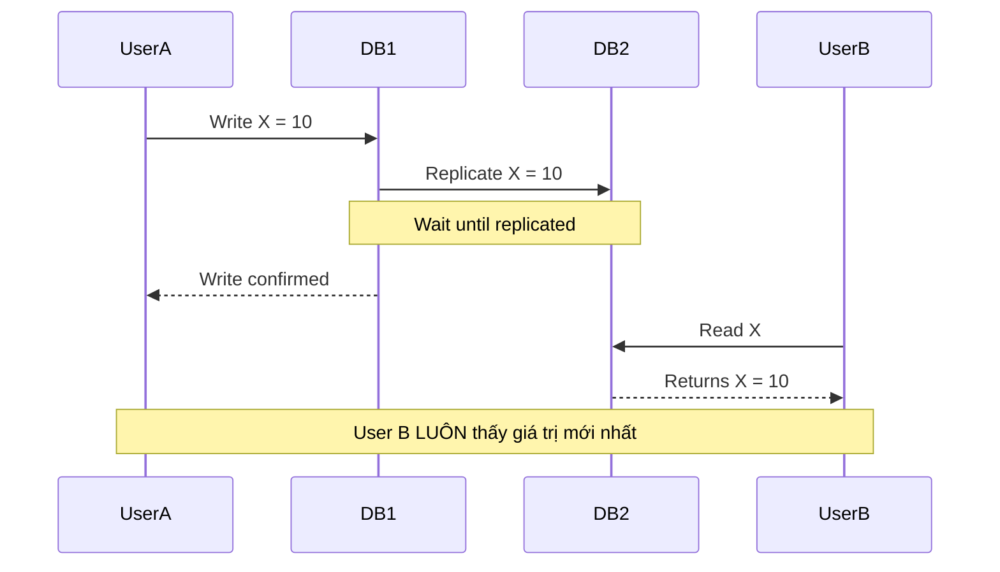
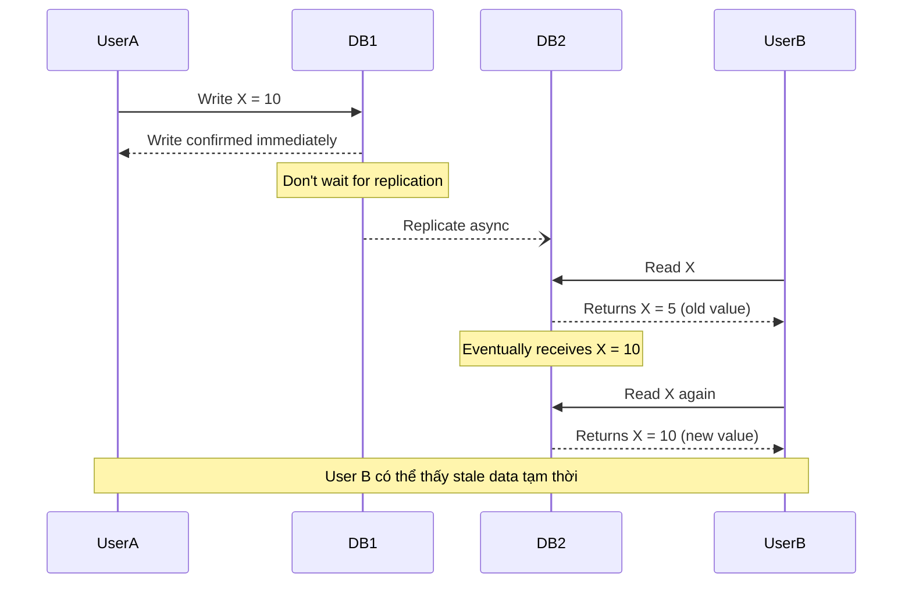

# Consistency Models: Strong vs Eventual Consistency

Tôi còn nhớ cái ngày tôi gây ra một bug nghiêm trọng vì không hiểu consistency.

E-commerce system. User đặt hàng sản phẩm cuối cùng trong kho. Nhưng vì eventual consistency, 2 users cùng thấy "còn hàng" và đặt hàng thành công.

Kết quả? Oversold. Phải refund một người. Customer service nightmare. CEO gọi meeting.

Tôi học được bài học đắt giá: **Consistency không phải technical preference. Nó là business decision.**

Lesson này sẽ giúp bạn tránh sai lầm đó.

## Tại Sao Consistency Quan Trọng?

Trong single database, consistency là đương nhiên:
```
User A: Writes X = 10
User B: Reads X → Always sees 10

Simple. Always correct.
```

Nhưng trong distributed systems với multiple databases:
```
User A: Writes X = 10 to Database 1
        Database 1 → Replicate to Database 2 (takes time)
User B: Reads X from Database 2 → Might see old value (X = 5)

Not simple. Might be wrong.
```

**Question:** User B có nên thấy giá trị cũ không?

**Answer:** Depends. Đó chính là consistency models.

## Strong Consistency: Luôn Đúng, Nhưng Chậm

### Định Nghĩa

**Strong consistency = Mọi read đều thấy most recent write**


*Strong consistency: Write chỉ confirm sau khi replicate xong*

**Behavior:**
```
Timeline:
10:00:00.000 - User A writes X = 10
10:00:00.050 - System replicates to all nodes (50ms)
10:00:00.051 - Write confirmed to User A
10:00:00.052 - User B reads X → Sees 10

User B LUÔN LUÔN thấy latest value
Giống như chỉ có 1 database duy nhất
```

### Linearizability: Strongest Form

**Linearizability = Operations appear to happen instantly at some point between start và end**

Nghe abstract? Hãy xem ví dụ:
```
Timeline:

User A: Write X = 10   [====== 50ms ======]
User B:                     Read X     → Must see 10 (happened after write started)
User C:        Read X   → Might see 5 or 10 (concurrent với write)
User D:                                          Read X → Must see 10

Rules:
- Nếu read bắt đầu sau write complete → Phải thấy new value
- Nếu read concurrent với write → Có thể thấy old hoặc new
- Nếu write complete → Mọi read sau đó thấy new value
```

**Real-world analogy:**

Tưởng tượng bạn post trên Facebook:
```
Strong consistency (Linearizable):
- Bạn post photo lúc 10:00
- Friend refresh lúc 10:01 → PHẢI thấy photo
- Không bao giờ "bạn thấy photo nhưng friend không thấy"

Giống như post lên tường nhà
→ Ai đi ngang qua đều thấy
```

### Implementation Cost

**Để achieve strong consistency:**
```python
def write_with_strong_consistency(key, value):
    # 1. Write to primary
    primary.write(key, value)
    
    # 2. Replicate to ALL replicas
    for replica in replicas:
        replica.write(key, value)
        
    # 3. Wait for ALL confirmations
    wait_for_all_acks()
    
    # 4. Only then return success
    return "success"

# If ANY replica fails → Entire write fails
# If network slow → Write is slow
```

**Performance impact:**
```
Single database:
Write latency: 10ms

Strong consistency (3 replicas):
Write latency: 
- Local write: 10ms
- Replicate to Replica 1: 50ms (network)
- Replicate to Replica 2: 50ms (network)
- Replicate to Replica 3: 50ms (network)
- Wait for all: max(50, 50, 50) = 50ms

Total: 10 + 50 = 60ms (6x slower!)

Nếu có replica ở xa:
- US → EU replica: 100ms
- US → Asia replica: 200ms
Total: 10 + 200 = 210ms (21x slower!)
```

### Trade-offs
```
Strong Consistency:

Advantages:
- Always correct
- No stale data
- Simple to reason about (như single database)
- No application-level conflict resolution

Disadvantages:
- Slow (wait for replication)
- Lower availability (nếu replica down, can't write)
- Geographic distribution expensive
- Scale limits (more replicas = slower)
```

### Khi Nào Cần Strong Consistency?

**Cần strong consistency khi:**
```
✓ Financial transactions
  - Bank transfers
  - Payment processing
  - Accounting

✓ Inventory management
  - Last item in stock
  - Seat booking
  - Limited edition sales

✓ Authentication
  - Password changes
  - Permission updates
  - Security tokens

✓ Critical business logic
  - Order state transitions
  - Contract signing
  - Legal documents
```

**Ví dụ thực tế:**
```python
# Bank transfer PHẢI strong consistency
def transfer_money(from_account, to_account, amount):
    with transaction():
        # PHẢI atomic và immediate
        deduct(from_account, amount)
        add(to_account, amount)
    
    # Không chấp nhận:
    # - User thấy tiền đã trừ nhưng chưa vào account đích
    # - Retry gây duplicate transfer
    # - Stale balance data
```

## Eventual Consistency: Nhanh Nhưng Có Thể Sai Tạm Thời

### Định Nghĩa

**Eventual consistency = Nếu không có writes mới, eventually tất cả replicas sẽ converge về cùng value**


*Eventual consistency: Write confirm ngay, replicate async*

**Behavior:**
```
Timeline:
10:00:00.000 - User A writes X = 10 to DB1
10:00:00.001 - Write confirmed immediately (1ms)
10:00:00.010 - User B reads from DB2 → Sees X = 5 (stale!)
10:00:00.050 - DB1 replicates to DB2
10:00:00.100 - User B reads again → Sees X = 10

User B thấy stale data trong 50ms
Sau đó eventually consistent
```

### Real-World Analogy
```
Facebook likes:
- Bạn like post
- Your like appears immediately (optimistic update)
- Backend replicate async
- Friend có thể thấy count khác nhau
- After vài giây, everyone sees same count

Acceptable vì:
- Like count không critical
- User experience tốt hơn (fast)
- Eventual correctness là enough
```

### Implementation
```python
def write_with_eventual_consistency(key, value):
    # 1. Write to primary
    primary.write(key, value)
    
    # 2. Return success IMMEDIATELY
    return "success"
    
    # 3. Replicate async in background
    background_task.replicate_to_replicas(key, value)

# Fast! Không wait replication
# User không phải đợi

def read_from_replica(key):
    # Có thể đọc stale data
    return replica.read(key)
```

### Conflict Resolution

**Problem với eventual consistency:**
```
Scenario:
10:00:00 - User A writes X = 10 to DB1
10:00:00 - User B writes X = 20 to DB2 (concurrent!)

Conflict! Cả hai writes success, nhưng giá trị nào đúng?

DB1 thinks X = 10
DB2 thinks X = 20

When replicate → Conflict!
```

**Resolution strategies:**

**Strategy 1: Last Write Wins (LWW)**
```python
def resolve_conflict(value1, value2):
    # Use timestamp
    if value1.timestamp > value2.timestamp:
        return value1
    else:
        return value2

# Simple nhưng có thể mất data
# Nếu clocks không sync → Wrong decision
```

**Strategy 2: Application-Level Merge**
```python
def resolve_conflict(value1, value2):
    # Application decides
    if feature_flag_enabled:
        return merge_values(value1, value2)
    else:
        return value1  # Primary wins

# Flexible nhưng complex logic
```

**Strategy 3: Keep Both (CRDTs)**
```python
# Conflict-free Replicated Data Types
# Example: Counter

# DB1: increment counter
counter_db1 = {node1: 5, node2: 3}  # total = 8

# DB2: increment counter  
counter_db2 = {node1: 5, node2: 4}  # total = 9

# Merge: Take max per node
counter_merged = {node1: 5, node2: 4}  # total = 9

# No conflict! Deterministic merge
```

### Trade-offs
```
Eventual Consistency:

Advantages:
- Fast writes (no wait)
- High availability (replicas independent)
- Good for geo-distributed
- Scales well

Disadvantages:
- Stale reads possible
- Application phải handle inconsistency
- Conflict resolution complexity
- Harder to reason about
```

### Khi Nào Dùng Eventual Consistency?

**Eventual consistency OK khi:**
```
✓ Social features
  - Likes, views counts
  - Follower counts
  - Activity feeds

✓ Analytics
  - Dashboards
  - Metrics
  - Reports

✓ Recommendations
  - Product suggestions
  - Content feeds
  - Search results

✓ Non-critical updates
  - Profile changes
  - Preferences
  - UI settings
```

**Ví dụ thực tế:**
```python
# Social media like KHÔNG CẦN strong consistency
def like_post(user_id, post_id):
    # Write immediately
    likes_db.increment(post_id)
    
    # User sees like immediately
    return {"likes": get_count_optimistic(post_id)}
    
    # Background: Replicate to analytics DB
    # Eventual consistency acceptable
    # Không ai care nếu count sai 1-2 trong vài giây
```

## Read/Write Trade-offs

### The Fundamental Trade-off
```
Consistency vs Performance vs Availability

Pick 2:
- Strong consistency + High availability → Slow
- Strong consistency + Fast → Lower availability
- Fast + High availability → Eventual consistency
```

**Visual comparison:**
```
Strong Consistency:
Write: ████████████ 60ms
Read:  ███ 10ms
Availability: 99.9%

Eventual Consistency:
Write: █ 5ms
Read:  █ 5ms  
Availability: 99.99%
```

### Tunable Consistency

Một số systems cho phép tune consistency per operation:
```python
# Cassandra example
def read_with_consistency_level(key, level):
    if level == "ALL":
        # Read từ TẤT CẢ replicas, đợi all responses
        # Strong consistency, slow
        return db.read(key, consistency="ALL")
        
    elif level == "QUORUM":
        # Read từ majority replicas
        # Good balance
        return db.read(key, consistency="QUORUM")
        
    elif level == "ONE":
        # Read từ 1 replica bất kỳ
        # Eventual consistency, fast
        return db.read(key, consistency="ONE")

# Ví dụ usage:
# Critical read → QUORUM
balance = read("account_balance", level="QUORUM")

# Non-critical read → ONE
recommendations = read("suggestions", level="ONE")
```

**Trade-off matrix:**
```
Consistency Level | Latency | Availability | Correctness
------------------|---------|--------------|------------
ALL               | High    | Low          | Perfect
QUORUM            | Medium  | Medium       | Very Good
ONE               | Low     | High         | Eventually
```

## Real-World Decision Making

### Framework: 4 Questions

Khi design feature, tự hỏi 4 câu hỏi này:

**Question 1: User có bị harm nếu thấy stale data không?**
```
Example:
- Bank balance stale → YES harm (user overdraft)
- Like count stale → NO harm (just display)

If YES → Strong consistency
If NO → Eventual consistency OK
```

**Question 2: Business loss nếu data inconsistent?**
```
Example:
- Inventory oversold → YES loss (refund, reputation)
- Feed order wrong → NO loss (just UX)

If YES → Strong consistency  
If NO → Eventual consistency OK
```

**Question 3: Có thể fix sau không?**
```
Example:
- Money transfer wrong → CANNOT fix (legal issue)
- Duplicate notification → CAN fix (just annoying)

If CANNOT fix → Strong consistency
If CAN fix → Eventual consistency OK
```

**Question 4: User có expect real-time không?**
```
Example:
- Chat message → YES expect immediate
- Email read status → NO expect (delay OK)

If YES → Strong consistency (or appear so)
If NO → Eventual consistency OK
```

### Decision Matrix
```
Feature Type              | Consistency  | Reasoning
--------------------------|--------------|------------------
Payment processing        | Strong       | Cannot be wrong
Inventory (last item)     | Strong       | Oversell bad
User authentication       | Strong       | Security critical
Password change           | Strong       | Security critical
Order status              | Strong       | User expectation
--------------------------|--------------|------------------
Like/view counts          | Eventual     | Approximate OK
Activity feed             | Eventual     | Delay acceptable
Recommendations           | Eventual     | Personalized anyway
Analytics dashboard       | Eventual     | Batch updates fine
Profile updates           | Eventual     | Not time-critical
Search results            | Eventual     | Ranking varies
Notification count        | Eventual     | Off by 1-2 OK
```

### Hybrid Approach

Trong thực tế, **most systems dùng cả hai**:
```python
class EcommerceSystem:
    def checkout(self, cart_items):
        # STRONG consistency cho critical path
        with strong_consistency():
            inventory = check_inventory(cart_items)  # Must be accurate
            payment = process_payment(amount)         # Must be exact
            order = create_order(cart_items)          # Must be atomic
        
        # EVENTUAL consistency cho non-critical
        with eventual_consistency():
            send_email_confirmation(order)            # Delay OK
            update_analytics(order)                   # Approximate OK
            generate_recommendations(user)            # Eventual OK
            update_activity_feed(user, order)         # Delay fine

# Critical = Strong
# Non-critical = Eventual
```

## Feature-Based Consistency Decisions

### Case Study 1: E-commerce Checkout

**Feature: Add to cart**
```
Decision: Eventual consistency

Why?
- Cart là temporary state
- User có thể sửa before checkout
- Delay vài giây acceptable
- High availability quan trọng hơn

Implementation:
- Write to local cache immediately
- Async replicate to database
- User sees cart update instant
```

**Feature: Place order**
```
Decision: Strong consistency

Why?
- Payment processing critical
- Inventory check must be accurate
- No oversell allowed
- User expect confirmation immediately

Implementation:
- Transaction across inventory + payment + order
- Wait for all confirms
- User đợi vài giây OK (expected)
```

### Case Study 2: Social Media

**Feature: Post content**
```
Decision: Hybrid

Why?
- User expect to see own post immediately (strong)
- Followers có thể thấy sau (eventual)

Implementation:
- Write với strong consistency
- User thấy post ngay
- Replicate to followers async
- Followers thấy trong vài giây
```

**Feature: Like count**
```
Decision: Eventual consistency

Why?
- Approximate count acceptable
- High volume (thousands likes/second)
- User không care nếu off by 10-20
- Fast response critical

Implementation:
- Increment counter async
- Update UI optimistically
- Background sync to database
- Eventually consistent count
```

### Case Study 3: Messaging App

**Feature: Send message**
```
Decision: Strong consistency

Why?
- Message order critical
- User expect recipient sees immediately
- Cannot lose messages
- Delivery confirmation important

Implementation:
- Write to sender's DB với strong consistency
- Replicate to recipient's DB synchronously
- Confirm delivery after both writes
- User waits vài ms (acceptable)
```

**Feature: "Last seen" status**
```
Decision: Eventual consistency

Why?
- Approximate time OK
- High frequency updates
- Not critical data
- Slight delay acceptable

Implementation:
- Update async every 30 seconds
- Users might see "online" với small delay
- Eventually converges
- Performance > Accuracy
```

## Mental Model: Consistency = Business Decision

**Key insight:** Consistency không phải technical preference.
```
Wrong thinking:
"Eventual consistency tốt hơn vì fast"
"Strong consistency tốt hơn vì correct"

Right thinking:
"Feature này cần strong consistency vì business requirement X"
"Feature này OK với eventual consistency vì business tolerates Y"
```

**Framework:**
```
For each feature:

1. Identify business requirement
   → What matters most?

2. Assess risk
   → What's worst case với stale data?

3. Check user expectation
   → User expect instant hoặc delay OK?

4. Choose consistency model
   → Strong nếu critical
   → Eventual nếu acceptable

5. Implement accordingly
   → Don't second-guess business needs
```

## Key Takeaways

**Consistency models summary:**
```
Strong Consistency:
- Always correct
- Slower, lower availability
- Use cho: payments, inventory, auth
- Trade: Performance cho correctness

Eventual Consistency:
- Fast, high availability
- Temporarily incorrect
- Use cho: likes, feeds, analytics
- Trade: Correctness cho performance
```

**Decision framework:**
```
Choose Strong Consistency nếu:
✓ Data critical to business
✓ Cannot tolerate errors
✓ User harm nếu wrong
✓ Legal/compliance requirements

Choose Eventual Consistency nếu:
✓ Approximate data OK
✓ Can fix errors later
✓ User không care về delays
✓ Performance critical
```

**Hybrid approach best:**
```
Most real systems:
- Strong consistency cho critical paths
- Eventual consistency cho everything else

Examples:
- E-commerce: Strong cho checkout, Eventual cho browse
- Social: Strong cho posts, Eventual cho likes
- Banking: Strong cho transactions, Eventual cho statements
```

**Golden rule:**

> Consistency là business decision, không phải technical preference. Always start bằng business requirements, then choose consistency model accordingly.

**Self-check questions:**

Trước khi implement feature, tự hỏi:

1. *User có bị harm nếu data stale vài giây không?*
2. *Business có loss nếu data inconsistent không?*
3. *User có expect real-time updates không?*
4. *Có thể compensate/fix errors sau không?*

Answers sẽ guide consistency decision.

**Remember:**
```
Perfect consistency everywhere = Slow system
No consistency anywhere = Wrong system

Smart architect:
- Strong consistency where needed
- Eventual consistency where acceptable
- Clear reasoning cho mỗi decision
```

Consistency models không phải về choosing "better" option. Nó về choosing **right** option cho **context** cụ thể.

Business first. Technology second. Always.
