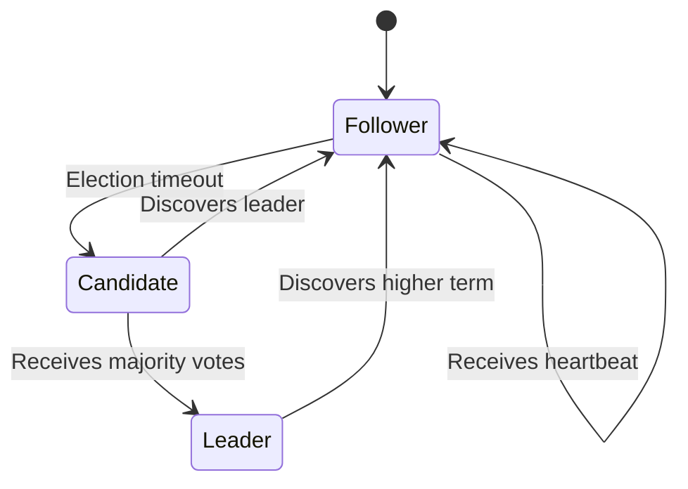
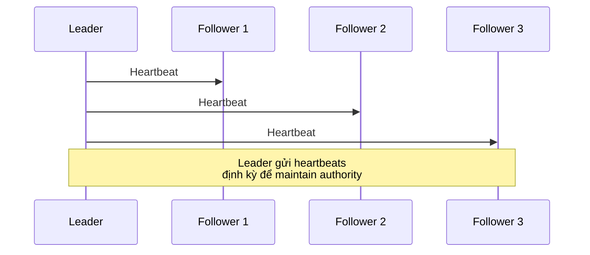
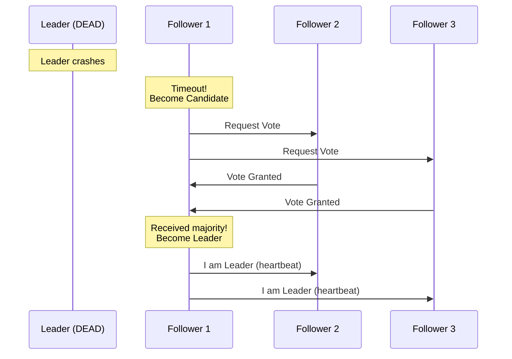
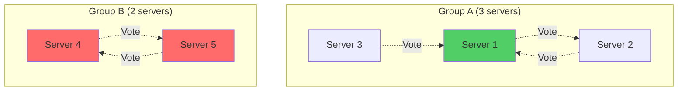

# Consensus & Leader Election: Distributed Agreement

Tôi còn nhớ lần đầu tiên debug một split brain bug.

Production system với 5 servers. Network bị partition. 2 nhóm servers: Group A (3 servers) và Group B (2 servers).

Cả hai groups đều nghĩ mình là leader. Cả hai đều nhận writes. Data conflict khắp nơi.

Recovery mất 2 ngày. Data reconciliation mất 1 tuần.

Senior architect nói: *"Em chưa hiểu consensus. Distributed systems phải AGREE trước khi ACT."*

Đó là bài học đắt giá về consensus algorithms.

## Tại Sao Cần Consensus?

### The Fundamental Problem

**Single server system: Đơn giản**
```
Client → Server (make decision) → Execute
```

Chỉ có 1 decision maker. Không có disagreement.

**Distributed system: Phức tạp**
```
Client → Server 1 (thinks it's leader)
      → Server 2 (thinks it's leader)  
      → Server 3 (thinks it's leader)

Ai quyết định? Ai là leader?
```

Nếu không có agreement mechanism → Chaos.

### Real-World Scenarios Cần Consensus

**Scenario 1: Database Master Election**
```
Master database chết
→ Cần elect master mới từ replicas
→ Tất cả replicas phải agree master mới là ai
→ Không được có 2 masters (split brain)
```

**Scenario 2: Distributed Lock**
```
2 services cần access cùng resource
→ Chỉ 1 service được phép access tại 1 thời điểm
→ Cần agree ai hold lock
→ Không được cả 2 đều nghĩ mình có lock
```

**Scenario 3: Configuration Management**
```
Update configuration trong cluster
→ Tất cả nodes phải see cùng config
→ Không được có inconsistent configs
→ Cần consensus trên config updates
```

**Key insight:** Distributed systems cần mechanism để **agree on state** trước khi act.

## Distributed Agreement Problem

### The Challenge

Trong distributed system với network unreliability:
```
Problems:
- Messages có thể lost
- Messages có thể delayed
- Servers có thể crash
- Network có thể partition

Question: Làm sao để tất cả servers agree?
```

### Example: Coordinating 3 Servers
```
Goal: Decide giá trị cho variable X

Server 1 proposes: X = 10
Server 2 proposes: X = 20
Server 3 proposes: X = 10

Làm sao để tất cả agree trên 1 giá trị?
```

**Naive approach (DOESN'T WORK):**
```
1. Server 1 broadcasts: "X = 10"
2. Wait for responses từ tất cả servers
3. If majority agree → Commit

Problem:
- Server 2 crashes trước khi respond
- Server 1 doesn't know: Server 2 chết hay network slow?
- Wait forever? Give up sau bao lâu?
```

**Need consensus algorithm để solve này.**

### Requirements for Consensus

Một consensus algorithm phải guarantee:
```
1. Agreement: Tất cả correct servers decide cùng value

2. Validity: Nếu server decides value V, 
   thì V phải được proposed bởi some server

3. Termination: Tất cả correct servers eventually decide

4. Fault tolerance: Work even khi some servers fail
```

## Raft: Consensus Algorithm Dễ Hiểu

### Why Raft?

Trước Raft có Paxos (1989). Paxos nổi tiếng là extremely hard to understand.

Raft (2014) được design với goal: **Understandability**.

Tôi recommend học Raft trước. Nó đủ để hiểu consensus fundamentals.

### Raft Core Ideas

Raft chia problem thành 3 sub-problems:
```
1. Leader Election: Chọn 1 server làm leader
2. Log Replication: Leader replicate commands đến followers  
3. Safety: Ensure consistency khi có failures
```

Chúng ta focus vào Leader Election (quan trọng nhất).

### Server States trong Raft

Mỗi server có thể ở 1 trong 3 states:


*Ba states trong Raft: Follower, Candidate, và Leader*

**Follower:**
- Passive state
- Receive và respond requests
- Không initiate requests
- Most servers ở state này

**Candidate:**
- Transitional state
- Request votes từ other servers
- Try to become leader

**Leader:**
- Handle tất cả client requests
- Replicate log đến followers
- Chỉ 1 leader tại 1 thời điểm

## Leader Election: Step by Step

### Normal Operation


*Leader gửi periodic heartbeats để báo "tôi còn sống"*

**Process:**
```
1. Leader gửi heartbeat messages định kỳ (mỗi 50-100ms)
2. Followers receive heartbeats → Reset election timer
3. Everyone happy, system stable
```

### Leader Failure & Election


*Khi leader chết, election process bắt đầu*

**Detailed Process:**

**Step 1: Follower timeout**
```
Follower 1 không nhận heartbeat trong 150-300ms (random)
→ Assumes leader dead
→ Transition to Candidate state
→ Increment term number (term++)
→ Vote for self
```

**Step 2: Request votes**
```
Candidate gửi RequestVote RPCs đến tất cả servers:

RequestVote {
    term: 5,           // Current term
    candidateId: 1,    // My ID
    lastLogIndex: 100, // My last log entry
    lastLogTerm: 4     // Term của last log entry
}
```

**Step 3: Followers vote**
```
Follower nhận RequestVote:

if request.term < my_term:
    Reject (I know higher term)
    
if already_voted_this_term:
    Reject (already gave my vote)
    
if my_log_is_more_updated:
    Reject (candidate's log outdated)
    
else:
    Grant vote
    Update my_term = request.term
```

**Step 4: Candidate counts votes**
```
Candidate collects votes:

if votes_received >= (num_servers / 2) + 1:
    Become LEADER
    Send heartbeats to all servers
    
elif another_server_became_leader:
    Become FOLLOWER
    
elif election_timeout:
    Start new election (increment term, try again)
```

### Election Timeout: Critical Design

**Problem:** Nếu 2 candidates start election cùng lúc?
```
Candidate 1 và Candidate 2 cùng request votes
→ Mỗi candidate nhận 2 votes (bao gồm self)
→ Không ai có majority
→ Split vote!
```

**Solution: Randomized election timeouts**
```python
# Mỗi server có random timeout
election_timeout = random(150ms, 300ms)

# Server 1: 173ms
# Server 2: 245ms  
# Server 3: 198ms

→ Server 1 timeout trước
→ Start election trước
→ Likely win before others timeout
→ Avoid split votes
```

**Probability:**
```
Với randomized timeouts:
- 90%+ elections elect leader trong 1 round
- Split votes rare
- System converge nhanh
```

## Majority Quorum: The Magic Number

### Why Majority?

**Key question:** Tại sao cần majority votes? Tại sao không phải unanimous (tất cả)?

**Answer:** Majority guarantees safety.

### The Math
```
Total servers: N
Majority: floor(N/2) + 1

Examples:
N = 3 → Majority = 2
N = 5 → Majority = 3
N = 7 → Majority = 4
```

### Guarantee: Chỉ 1 Leader

**Scenario: Network partition**
```
Total: 5 servers
Partition thành 2 groups:

Group A: 3 servers (majority!)
Group B: 2 servers (minority)

Group A có thể elect leader (3 votes >= 3 needed)
Group B KHÔNG thể elect leader (2 votes < 3 needed)

→ Chỉ có 1 leader!
```


*Group A có majority, elect được leader. Group B không đủ votes.*

### Overlap Property

**Critical insight:**
```
Bất kỳ 2 majority quorums nào cũng MUST overlap

N = 5, Majority = 3

Quorum 1: {Server 1, Server 2, Server 3}
Quorum 2: {Server 2, Server 4, Server 5}

Overlap: Server 2

→ Không thể có 2 disjoint majorities
→ Không thể có 2 leaders cùng term
```

**Proof:**
```
N servers
Majority = floor(N/2) + 1

2 majorities:
Quorum A: >= floor(N/2) + 1 servers
Quorum B: >= floor(N/2) + 1 servers

Total if disjoint:
>= 2 * (floor(N/2) + 1)
>= N + 2

But chỉ có N servers available!
→ Contradiction
→ Must overlap
```

### Why Odd Numbers?
```
Fault tolerance:

3 servers: Tolerate 1 failure
4 servers: Tolerate 1 failure (same!)
5 servers: Tolerate 2 failures
6 servers: Tolerate 2 failures (same!)

4 servers không tốt hơn 3 servers về fault tolerance
6 servers không tốt hơn 5 servers

→ Use odd numbers (3, 5, 7)
→ Waste less resources
```

**Recommendation:**
```
Small cluster:     3 servers (tolerate 1 failure)
Medium cluster:    5 servers (tolerate 2 failures)
Large cluster:     7 servers (tolerate 3 failures)

> 7 servers: Rarely needed, too much coordination overhead
```

## Split Brain Problem

### What is Split Brain?

**Split brain = Nhiều hơn 1 server nghĩ mình là leader**
```
Disaster scenario:
Leader A processes writes
Leader B processes writes (simultaneously!)

→ Data diverges
→ Conflicts everywhere
→ Nightmare to recover
```

### How Split Brain Happens

**Scenario 1: Network partition**
```
Before partition:
[Server 1 (Leader)] - [Server 2] - [Server 3]

Network partition:
[Server 1 (Leader)] | [Server 2] [Server 3]

Server 2 & 3 không see heartbeats từ Server 1
→ Elect Server 2 as new leader
→ Now have 2 leaders!
```

**Scenario 2: Slow heartbeats**
```
Server 1 (Leader) vẫn alive nhưng slow
→ Heartbeats delayed vì network congestion
→ Followers timeout, elect new leader
→ Server 1 eventually send heartbeats
→ Temporarily have 2 leaders
```

### How Raft Prevents Split Brain

**Mechanism 1: Majority quorum**
```
Partition thành 2 groups:
Group A: 3 servers → Can elect leader (3 >= 3)
Group B: 2 servers → Cannot elect leader (2 < 3)

→ Chỉ 1 group có leader
→ No split brain
```

**Mechanism 2: Term numbers**
```
Mỗi election có term number

Old leader: term 5
New leader elected: term 6

Khi old leader recover:
- Try to send commands với term 5
- Followers reject (term 5 < current term 6)
- Old leader discovers higher term
- Step down to follower

→ Old leader không còn act as leader
```

**Mechanism 3: Leader lease**
```
Leader không chỉ cần majority votes
Leader phải maintain "lease" bằng heartbeats

Nếu leader không send heartbeats:
→ Followers revoke implicit lease
→ Leader cannot process requests anymore

→ Leader tự động stop nếu isolated
```

### Split Brain Recovery

**Nếu somehow xảy ra split brain:**
```
Detection:
- 2 leaders discover each other
- Compare term numbers

Leader với lower term:
→ Immediately step down
→ Become follower
→ Accept higher term leader

Data reconciliation:
→ Leader với higher term wins
→ Uncommitted writes từ lower term leader = lost
→ This is by design (safety > liveness)
```

## Raft Leader Election: Complete Example

### Initial State
```
5 servers, tất cả followers
Current term: 3
Leader: Server 1
```
```
Server 1 (Leader, term 3)
Server 2 (Follower, term 3)
Server 3 (Follower, term 3)
Server 4 (Follower, term 3)
Server 5 (Follower, term 3)
```

### Timeline

**T=0: Leader crashes**
```
Server 1 DEAD
Server 2, 3, 4, 5 đang chờ heartbeats
```

**T=200ms: Server 3 timeout**
```
Server 3 election timeout (random 150-300ms)
→ Become Candidate
→ Increment term: 3 → 4
→ Vote for self (1 vote)
→ Send RequestVote to all
```

**T=205ms: Servers respond**
```
Server 2 receives RequestVote:
- Not voted yet in term 4
- Grant vote to Server 3

Server 4 receives RequestVote:
- Not voted yet in term 4
- Grant vote to Server 3

Server 5 receives RequestVote:
- Not voted yet in term 4
- Grant vote to Server 3
```

**T=210ms: Server 3 counts votes**
```
Server 3:
- Self vote: 1
- Server 2: 1
- Server 4: 1
- Server 5: 1

Total: 4 votes out of 5 servers
Majority: 3 needed
4 >= 3 → WIN!

→ Become LEADER for term 4
```

**T=215ms: New leader announces**
```
Server 3 (Leader):
→ Send heartbeats to all servers
→ "I am leader for term 4"

Servers 2, 4, 5:
→ Receive heartbeat
→ Recognize Server 3 as leader
→ Reset election timers
→ Continue as followers
```

**T=220ms onwards: Normal operation**
```
Server 3 continues sending heartbeats every 50ms
System stable với Server 3 as leader
```

## Mental Model: Distributed Agreement

### Core Principle

**"Agree trước khi Act"**
```
Single-server thinking:
See request → Execute → Done

Distributed thinking:
See request → Ask others → Get consensus → Execute
```

### Design Implications

**Implication 1: Latency increase**
```
Single server: 10ms
Consensus (majority of 5): 50-100ms

Trade-off:
Consistency + fault tolerance vs Speed
```

**Implication 2: Need odd numbers**
```
3, 5, 7 servers optimal
Even numbers waste resources
```

**Implication 3: Network partitions = availability loss**
```
Network partition: Minority partition cannot make progress
Trade-off: Consistency over availability (CP in CAP)
```

### When to Use Consensus

**Use consensus algorithms khi:**
```
✓ Need strong consistency
✓ Cannot tolerate split brain
✓ Fault tolerance critical
✓ Master election
✓ Distributed locks
✓ Configuration management
```

**Avoid consensus khi:**
```
✗ Eventual consistency acceptable
✗ Cannot tolerate latency increase
✗ Prefer availability over consistency (AP in CAP)
```

### Systems Using Consensus

**etcd:**
```
Distributed key-value store
Uses Raft for consensus
Kubernetes lưu cluster state trong etcd
```

**Consul:**
```
Service discovery and configuration
Uses Raft for leader election và data replication
```

**Zookeeper:**
```
Coordination service
Uses Zab (similar to Raft/Paxos)
Kafka, HBase rely on Zookeeper
```

**CockroachDB:**
```
Distributed SQL database
Uses Raft for replication và consistency
```

## Common Mistakes & How to Avoid

### Mistake 1: Không dùng majority quorum
```
Bad: Wait for ALL servers respond
Problem: 1 server die → Cannot make progress

Good: Wait for majority
Benefit: Can tolerate minority failures
```

### Mistake 2: Forget về split brain
```
Bad: Assume chỉ có 1 leader
Reality: Network partitions happen

Good: Design với assumption multiple leaders possible
Use term numbers, majority writes để prevent
```

### Mistake 3: Even số servers
```
Bad: 4 servers (tolerate 1 failure)
Cost: 4 servers
Benefit: Same as 3 servers

Good: 3 servers (tolerate 1 failure)
Cost: 3 servers  
Benefit: Same fault tolerance, save 1 server
```

### Mistake 4: Không hiểu consistency trade-off
```
Bad: Expect cả consistency và availability
Reality: CAP theorem says pick 2

Good: Consciously choose consistency (CP)
Accept availability loss during partitions
```

## Key Takeaways

**Consensus algorithms solve distributed agreement:**
```
Problem: Multiple servers cần agree trên state
Solution: Majority voting với term numbers
Result: Strong consistency + fault tolerance
```

**Raft fundamentals:**
```
1. Leader Election: 1 leader tại 1 thời điểm
2. Majority Quorum: Prevent split brain
3. Term Numbers: Detect stale leaders
4. Randomized Timeouts: Avoid split votes
```

**Split brain prevention:**
```
- Majority quorum (không có 2 disjoint majorities)
- Term numbers (higher term wins)
- Leader lease (heartbeat timeout)
```

**Design principles:**
```
- Odd numbers (3, 5, 7 servers)
- Majority = floor(N/2) + 1
- Agree before act
- Accept latency increase
```

**Trade-offs accepted:**
```
Gain: Strong consistency, fault tolerance
Cost: Latency, complexity, availability during partitions
```

**Mental model:**

> "Distributed systems phải AGREE trước khi ACT. Consensus là mechanism để agree. Majority voting prevents split brain. Term numbers detect staleness."

**Self-check questions:**

Trước khi implement distributed system với consensus:

1. *Tôi thực sự cần strong consistency không?*
2. *Tôi có thể tolerate latency increase không?*
3. *Tôi có thể trade availability cho consistency không?*
4. *Tôi hiểu split brain và cách prevent chưa?*

Consensus là powerful nhưng expensive. Use khi benefits outweigh costs.

**Câu nói tôi hay nhắc team:**

> "If you don't need strong consistency, don't pay for it. But if you need it, pay the full price - implement consensus correctly."

Consensus không phải là magic. Nó là carefully designed agreement mechanism với clear trade-offs.

Hiểu trade-offs → Make better decisions.
