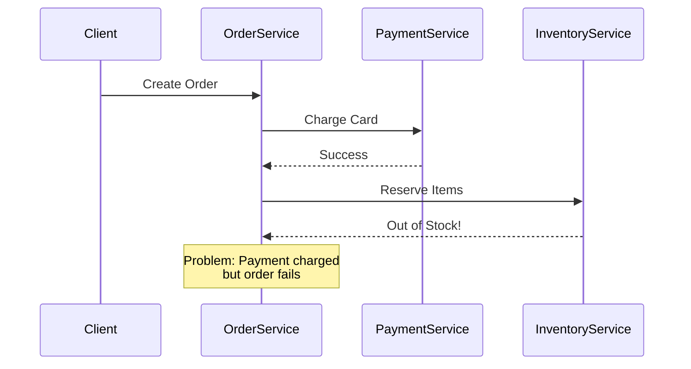
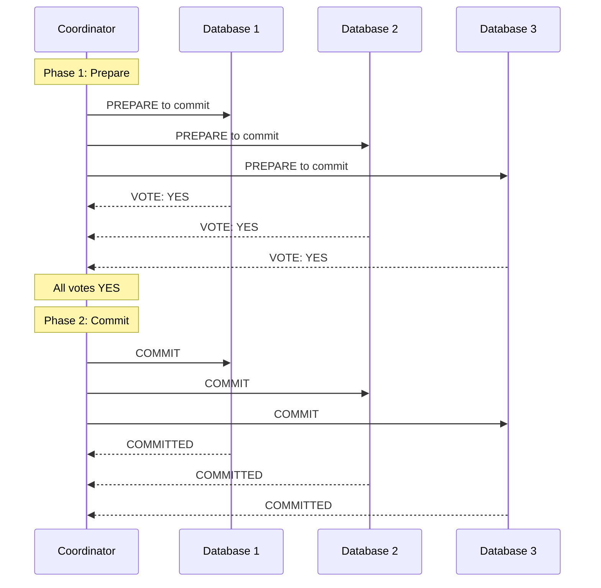
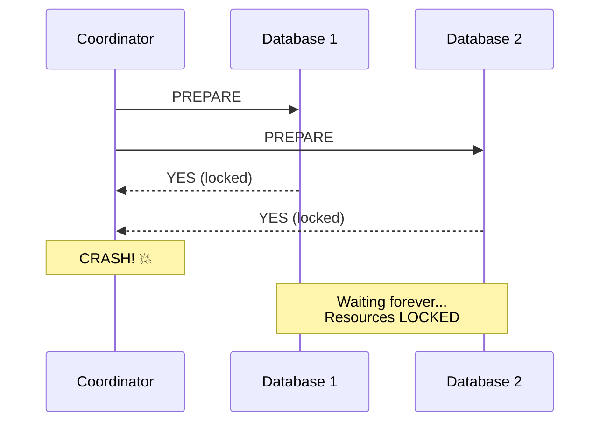
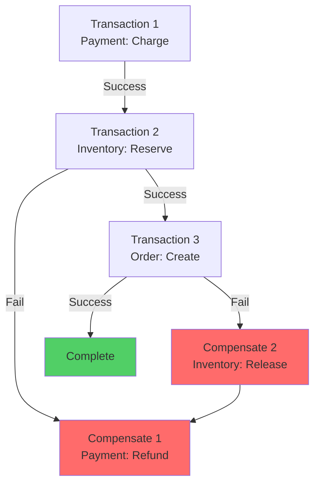
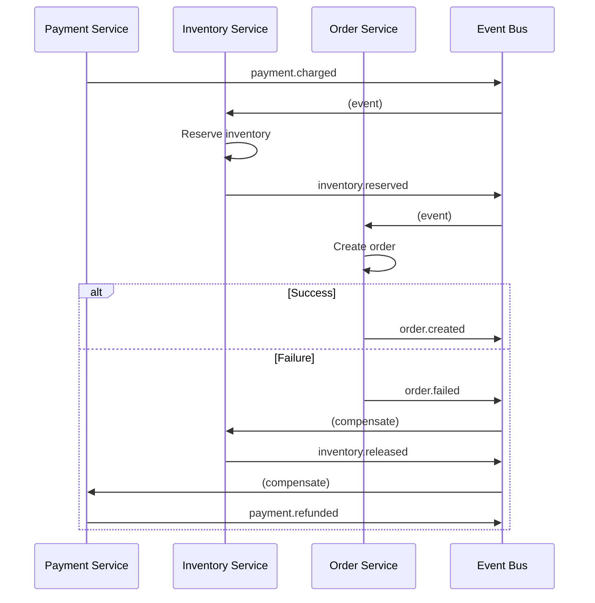
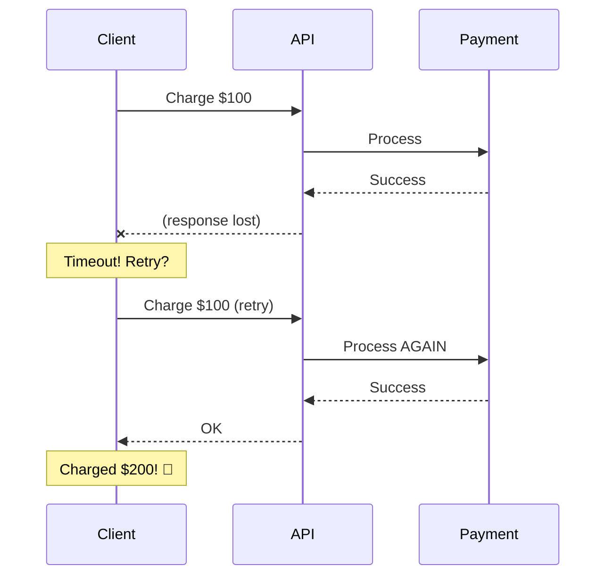

# Distributed Transactions & Data Integrity

Tôi còn nhớ ngày hệ thống payment đầu tiên tôi thiết kế bị bug nghiêm trọng.

User charge thẻ thành công. Nhưng order không được tạo. Tiền mất, không có order.

User complain. Finance team panic. CEO gọi họp khẩn cấp.

Lúc đó tôi nghĩ: *"Sao transaction không work? Tôi đã dùng BEGIN TRANSACTION mà!"*

Senior architect nhìn code, lắc đầu: *"Em đang làm distributed system. ACID transactions không work nữa."*

Đó là ngày tôi học bài học đắt giá nhất về distributed transactions.

## Tại Sao ACID Breaks Trong Distributed Systems?

### ACID Trong Single Database

Trong monolithic application với single database, ACID transactions work perfectly:
```python
# Single database - ACID guaranteed
def transfer_money(from_account, to_account, amount):
    db.begin_transaction()
    try:
        db.execute("UPDATE accounts SET balance = balance - ? WHERE id = ?", 
                   amount, from_account)
        db.execute("UPDATE accounts SET balance = balance + ? WHERE id = ?", 
                   amount, to_account)
        db.commit()
    except:
        db.rollback()  # All changes undone
```

**ACID guarantees:**
```
Atomicity:   All or nothing (cả 2 updates hoặc không update gì)
Consistency: Data valid (không thể âm balance)
Isolation:   Transactions không thấy partial changes
Durability:  Committed data persistent
```

### ACID Breaks Trong Distributed Systems

Giờ chuyển sang microservices:


*Flow tạo order qua nhiều services - không thể dùng database transaction*

**Problem:**
```
1. Payment Service charges card → Success
2. Inventory Service checks stock → Out of stock!
3. Order Service fails

Result:
Payment charged (money taken)
Order not created
Inventory not reserved

Customer: "Tại sao tiền bị trừ mà không có order?"
```

**Tại sao không thể rollback?**
```
Cannot use database transaction:
   - 3 services = 3 different databases
   - Cannot rollback across databases
   - Payment Service already committed

Cannot undo payment:
   - Already sent to payment gateway
   - External system, không control được
   - Cannot call "db.rollback()"
```

**Root cause:**
```
ACID assumptions break khi:
- Multiple databases involved
- Multiple services involved  
- External systems involved
- Network calls involved

Network is unreliable → ACID cannot be guaranteed
```

## 2-Phase Commit (2PC): The Traditional Solution

### How 2PC Works

**2-Phase Commit = Protocol để coordinate transactions across multiple databases**


*2PC: Phase 1 prepare, Phase 2 commit nếu tất cả agree*

**Phase 1: Prepare**
```
Coordinator → All participants: "Prepare to commit"

Each participant:
1. Lock resources
2. Write to transaction log
3. Ready to commit BUT don't commit yet
4. Vote YES or NO

If any participant votes NO → Abort
If all vote YES → Proceed to Phase 2
```

**Phase 2: Commit**
```
If all YES:
   Coordinator → All: "COMMIT"
   Participants commit changes
   Release locks

If any NO:
   Coordinator → All: "ABORT"
   Participants rollback
   Release locks
```

### 2PC Implementation Example
```python
class TwoPhaseCommitCoordinator:
    def __init__(self, participants):
        self.participants = participants
        self.transaction_id = generate_id()
    
    def execute_transaction(self, operations):
        # Phase 1: Prepare
        print("Phase 1: Prepare")
        votes = []
        
        for participant in self.participants:
            try:
                vote = participant.prepare(self.transaction_id, operations)
                votes.append(vote)
                print(f"{participant.name}: {vote}")
            except Exception as e:
                votes.append("NO")
                print(f"{participant.name}: ERROR - {e}")
        
        # Decision
        if all(vote == "YES" for vote in votes):
            decision = "COMMIT"
        else:
            decision = "ABORT"
        
        print(f"\nDecision: {decision}")
        
        # Phase 2: Commit or Abort
        print("Phase 2: Execute decision")
        results = []
        
        for participant in self.participants:
            if decision == "COMMIT":
                result = participant.commit(self.transaction_id)
            else:
                result = participant.abort(self.transaction_id)
            results.append(result)
            print(f"{participant.name}: {result}")
        
        return decision == "COMMIT"

# Usage
coordinator = TwoPhaseCommitCoordinator([
    payment_service,
    inventory_service,
    order_service
])

success = coordinator.execute_transaction({
    'payment': {'amount': 100},
    'inventory': {'product_id': 123, 'quantity': 1},
    'order': {'user_id': 456}
})
```

### The Fatal Flaw: Blocking

**Problem: Coordinator crashes sau Phase 1**
```
Timeline:
1. Coordinator sends PREPARE to all participants
2. All participants vote YES, lock resources, wait...
3. Coordinator CRASHES (before sending COMMIT)
4. Participants stuck waiting forever
5. Resources LOCKED indefinitely

Result:
Databases locked
Cannot proceed
Cannot timeout (don't know if coordinator will recover)
System BLOCKED
```


*Coordinator crash sau prepare phase → Databases bị lock vô thời hạn*

**Why can't timeout?**
```
Participant dilemma:
- Không biết Coordinator đã send COMMIT chưa
- Không biết participants khác committed chưa
- Không thể tự quyết định commit hay abort
- Timeout → Risk inconsistency

→ Must wait for Coordinator recovery
→ BLOCKING protocol
```

### 2PC Trade-offs
```
2-Phase Commit:
Strong consistency (ACID maintained)
All-or-nothing guarantee
Proven protocol

Blocking (coordinator failure = disaster)
Performance overhead (2 round trips)
High latency (wait for slowest participant)
Reduced availability
Complex implementation
```

### Khi Nào Dùng 2PC?
```
Sử dụng 2PC khi:
✓ Strong consistency absolutely required
✓ Financial transactions (banking)
✓ All participants under your control
✓ Can tolerate blocking
✓ Low-latency not critical

Tránh 2PC khi:
✗ Need high availability
✗ Microservices architecture (external services)
✗ High throughput required
✗ Cannot tolerate blocking
```

**Personal opinion:**

Tôi tránh 2PC trong microservices. Blocking risk quá cao. Complexity không đáng.

99% cases có better solutions: Saga pattern.

## Saga Pattern: The Practical Solution

### Saga Concept

**Saga = Chuỗi local transactions + compensation**

Thay vì 1 distributed transaction:
```
Old way (2PC):
BEGIN_DISTRIBUTED_TRANSACTION
  Payment Service: charge
  Inventory Service: reserve
  Order Service: create
COMMIT_DISTRIBUTED_TRANSACTION
```

Dùng chuỗi local transactions:
```
Saga way:
Transaction 1: Payment Service charge (local commit)
Transaction 2: Inventory Service reserve (local commit)
Transaction 3: Order Service create (local commit)

If any fails → Run compensation transactions backward
```


*Saga: Forward transactions + backward compensations nếu fail*

### Saga Implementation: Orchestration

**Orchestration = Central coordinator điều phối saga**
```python
class OrderSagaOrchestrator:
    def __init__(self):
        self.payment_service = PaymentService()
        self.inventory_service = InventoryService()
        self.order_service = OrderService()
    
    def create_order(self, order_data):
        saga_state = {
            'payment_id': None,
            'reservation_id': None,
            'order_id': None
        }
        
        try:
            # Step 1: Charge payment
            print("Step 1: Charging payment...")
            payment_id = self.payment_service.charge(
                order_data['amount']
            )
            saga_state['payment_id'] = payment_id
            print(f"✓ Payment charged: {payment_id}")
            
            # Step 2: Reserve inventory
            print("Step 2: Reserving inventory...")
            reservation_id = self.inventory_service.reserve(
                order_data['product_id'],
                order_data['quantity']
            )
            saga_state['reservation_id'] = reservation_id
            print(f"✓ Inventory reserved: {reservation_id}")
            
            # Step 3: Create order
            print("Step 3: Creating order...")
            order_id = self.order_service.create(order_data)
            saga_state['order_id'] = order_id
            print(f"✓ Order created: {order_id}")
            
            return {
                'status': 'success',
                'order_id': order_id
            }
            
        except Exception as e:
            print(f"\nSaga failed: {e}")
            print("Starting compensation...")
            
            # Compensate in reverse order
            self._compensate(saga_state)
            
            return {
                'status': 'failed',
                'error': str(e)
            }
    
    def _compensate(self, saga_state):
        # Reverse order: Order → Inventory → Payment
        
        if saga_state['order_id']:
            print("Compensating: Cancel order")
            try:
                self.order_service.cancel(saga_state['order_id'])
                print("✓ Order cancelled")
            except Exception as e:
                print(f"⚠ Order compensation failed: {e}")
        
        if saga_state['reservation_id']:
            print("Compensating: Release inventory")
            try:
                self.inventory_service.release(saga_state['reservation_id'])
                print("✓ Inventory released")
            except Exception as e:
                print(f"⚠ Inventory compensation failed: {e}")
        
        if saga_state['payment_id']:
            print("Compensating: Refund payment")
            try:
                self.payment_service.refund(saga_state['payment_id'])
                print("✓ Payment refunded")
            except Exception as e:
                print(f"⚠ Payment compensation failed: {e}")

# Usage
orchestrator = OrderSagaOrchestrator()
result = orchestrator.create_order({
    'user_id': 123,
    'product_id': 456,
    'quantity': 2,
    'amount': 50.00
})
```

**Output khi success:**
```
Step 1: Charging payment...
✓ Payment charged: payment_789

Step 2: Reserving inventory...
✓ Inventory reserved: reservation_321

Step 3: Creating order...
✓ Order created: order_654

Result: Success
```

**Output khi fail:**
```
Step 1: Charging payment...
✓ Payment charged: payment_789

Step 2: Reserving inventory...
Out of stock!

Saga failed: Out of stock

Starting compensation...
Compensating: Refund payment
✓ Payment refunded

Result: Failed - Out of stock
```

### Saga Implementation: Choreography

**Choreography = Services tự phối hợp qua events**
```python
# Payment Service
class PaymentService:
    def charge(self, amount):
        # Process payment
        payment_id = process_payment(amount)
        
        # Publish event
        event_bus.publish('payment.charged', {
            'payment_id': payment_id,
            'amount': amount
        })
        
        return payment_id
    
    @event_bus.subscribe('order.failed')
    def on_order_failed(self, event):
        # Compensate: Refund
        payment_id = event['payment_id']
        self.refund(payment_id)
        
        event_bus.publish('payment.refunded', {
            'payment_id': payment_id
        })

# Inventory Service  
class InventoryService:
    @event_bus.subscribe('payment.charged')
    def on_payment_charged(self, event):
        try:
            # Reserve inventory
            reservation_id = self.reserve(event['product_id'])
            
            event_bus.publish('inventory.reserved', {
                'reservation_id': reservation_id,
                'payment_id': event['payment_id']
            })
        except OutOfStockError:
            # Trigger compensation
            event_bus.publish('order.failed', {
                'reason': 'out_of_stock',
                'payment_id': event['payment_id']
            })
    
    @event_bus.subscribe('order.failed')
    def on_order_failed(self, event):
        # Compensate: Release inventory
        if event.get('reservation_id'):
            self.release(event['reservation_id'])
            
            event_bus.publish('inventory.released', {
                'reservation_id': event['reservation_id']
            })

# Order Service
class OrderService:
    @event_bus.subscribe('inventory.reserved')
    def on_inventory_reserved(self, event):
        try:
            # Create order
            order_id = self.create_order(event)
            
            event_bus.publish('order.created', {
                'order_id': order_id
            })
        except Exception as e:
            # Trigger compensation
            event_bus.publish('order.failed', {
                'reason': str(e),
                'payment_id': event['payment_id'],
                'reservation_id': event['reservation_id']
            })
```


*Choreography: Services react to events, tự động compensation*

### Orchestration vs Choreography
```
Orchestration (Central coordinator):
Clear flow, dễ debug
Centralized logic
Explicit compensation order
Single point of failure
Tight coupling to orchestrator

Choreography (Event-driven):
Loosely coupled
No single point of failure
Scalable
Hard to understand flow
Hard to debug
Complex error handling
```

**My recommendation:**
```
Start với Orchestration:
- Simpler to understand
- Easier to debug
- Clear ownership

Move to Choreography khi:
- Need extreme decoupling
- Have event-driven infrastructure
- Team experienced với async patterns
```

## Compensation Thinking: The Core Mindset

### Compensation ≠ Rollback

**Database rollback:**
```python
# Database rollback: Undo changes
db.begin_transaction()
db.execute("INSERT INTO orders ...")
db.rollback()  # Changes disappear completely
# As if nothing happened
```

**Saga compensation:**
```python
# Saga compensation: Reverse effect
payment_id = payment_service.charge(100)  # Money charged
# Later...
payment_service.refund(payment_id)  # Money returned

# NOT same as rollback:
- Payment happened (visible in logs)
- Refund is separate transaction
- Both visible in audit trail
```

**Key difference:**
```
Rollback:     Undo → như không có gì xảy ra
Compensation: Reverse effect → có audit trail đầy đủ
```

### Designing Compensating Transactions

**Rule 1: Compensation phải idempotent**
```python
# BAD: Not idempotent
def refund_payment(payment_id):
    payment = get_payment(payment_id)
    payment.amount = 0  # If called twice → problem
    save(payment)

# GOOD: Idempotent
def refund_payment(payment_id):
    payment = get_payment(payment_id)
    
    if payment.status == 'refunded':
        return  # Already refunded, skip
    
    payment.status = 'refunded'
    payment.refunded_at = now()
    save(payment)
```

**Rule 2: Compensation có thể fail**
```python
def _compensate(self, saga_state):
    compensation_errors = []
    
    # Try each compensation
    for step in reversed(saga_state['completed_steps']):
        try:
            step.compensate()
        except Exception as e:
            # Log but continue
            compensation_errors.append({
                'step': step.name,
                'error': str(e)
            })
            logger.error(f"Compensation failed: {step.name} - {e}")
    
    # If any compensation failed → Manual intervention needed
    if compensation_errors:
        alert_ops_team({
            'saga_id': saga_state['id'],
            'failures': compensation_errors,
            'action_needed': 'manual_compensation'
        })
```

**Rule 3: Some actions cannot be compensated**
```python
# Cannot compensate:
Email sent (cannot "unsend")
SMS sent
External API called (no control)
Physical shipment initiated

# Solutions:
Put compensable actions first
Non-compensable actions last (after all risks)
Make them idempotent (safe to retry)
```

### Compensation Order Matters
```
Forward order:
1. Charge payment
2. Reserve inventory  
3. Send confirmation email ← Non-compensable

Compensation order (REVERSE):
3. (Cannot undo email - accept it)
2. Release inventory
1. Refund payment

Why reverse? Latest changes undo first.
```

## Idempotency: The Safety Net

### Định Nghĩa Idempotency

**Idempotent operation = Gọi nhiều lần = gọi 1 lần**
```
f(x) = y
f(f(x)) = y  ← Same result
f(f(f(x))) = y  ← Still same

Example:
- Set temperature to 20°C → Idempotent
- Increase temperature by 1°C → NOT idempotent
```

### Tại Sao Cần Idempotency?

**Problem: Network unreliability**
```
Timeline:
1. Client calls API: "Charge $100"
2. Server processes, charges $100
3. Server sends response
4. Network fails before client receives response
5. Client doesn't know if succeeded
6. Client retries: "Charge $100" again
7. Server charges ANOTHER $100

Result: Customer charged $200 instead of $100!
```


*Network failure → Retry → Duplicate charge*

### Implementing Idempotency

**Solution 1: Idempotency Key**
```python
class PaymentService:
    def __init__(self):
        self.processed_requests = {}  # In practice: Redis/DB
    
    def charge(self, amount, idempotency_key):
        # Check if already processed
        if idempotency_key in self.processed_requests:
            # Return cached result
            print(f"Duplicate request detected: {idempotency_key}")
            return self.processed_requests[idempotency_key]
        
        # First time seeing this request
        print(f"Processing new request: {idempotency_key}")
        
        # Process payment
        payment_id = self._process_payment(amount)
        
        # Cache result
        self.processed_requests[idempotency_key] = {
            'payment_id': payment_id,
            'amount': amount,
            'status': 'success'
        }
        
        return self.processed_requests[idempotency_key]

# Client usage
payment_service = PaymentService()

# Client generates unique key
idempotency_key = "order_123_payment_attempt_1"

# First call
result1 = payment_service.charge(100, idempotency_key)
# Processing new request: order_123_payment_attempt_1
# Result: payment_id=pay_789

# Retry (network failed, client retries)
result2 = payment_service.charge(100, idempotency_key)
# Duplicate request detected: order_123_payment_attempt_1
# Result: payment_id=pay_789 (SAME!)

# Charged only once ✓
```

**Implementation details:**
```python
# Production-grade implementation
class IdempotentPaymentService:
    def charge(self, amount, idempotency_key):
        # Check cache (Redis với TTL 24h)
        cached = redis.get(f"idempotency:{idempotency_key}")
        if cached:
            return json.loads(cached)
        
        # Acquire lock để prevent concurrent duplicates
        lock_key = f"lock:idempotency:{idempotency_key}"
        with redis.lock(lock_key, timeout=30):
            # Double-check sau khi có lock
            cached = redis.get(f"idempotency:{idempotency_key}")
            if cached:
                return json.loads(cached)
            
            # Process payment
            result = self._process_payment(amount)
            
            # Cache result với TTL 24h
            redis.setex(
                f"idempotency:{idempotency_key}",
                86400,  # 24 hours
                json.dumps(result)
            )
            
            return result
```

**Solution 2: Natural Idempotency**
```python
# NOT idempotent
def add_item_to_cart(user_id, product_id):
    cart = get_cart(user_id)
    cart.items.append(product_id)  # Duplicate if called twice
    save(cart)

# Idempotent
def add_item_to_cart(user_id, product_id):
    cart = get_cart(user_id)
    if product_id not in cart.items:  # Check first
        cart.items.append(product_id)
    save(cart)

# Even better: Use Set
def add_item_to_cart(user_id, product_id):
    cart = get_cart(user_id)
    cart.items.add(product_id)  # Set naturally idempotent
    save(cart)
```

**Solution 3: Database Constraints**
```sql
-- Allows duplicates
CREATE TABLE payments (
    id SERIAL PRIMARY KEY,
    order_id INT,
    amount DECIMAL
);

-- Can insert same order_id multiple times!

-- Prevent duplicates
CREATE TABLE payments (
    id SERIAL PRIMARY KEY,
    order_id INT UNIQUE,  -- Unique constraint
    amount DECIMAL
);

-- Second insert with same order_id → Error
-- Application catches error → Return cached result
```

### Idempotency Best Practices

**1. Generate idempotency keys client-side**
```javascript
// Client generates key
const idempotencyKey = `${userId}_${orderId}_${Date.now()}_${uuidv4()}`;

fetch('/api/payment/charge', {
    method: 'POST',
    headers: {
        'Idempotency-Key': idempotencyKey
    },
    body: JSON.stringify({ amount: 100 })
});
```

**2. Store idempotency results với TTL**
```
Don't store forever → Waste storage
TTL 24-48 hours usually enough
After TTL, new request = new operation (acceptable)
```

**3. Return same status code cho idempotent requests**
```python
# BAD
if duplicate_request:
    return 200, cached_result

# GOOD
if duplicate_request:
    return 200, cached_result  # Same as original
else:
    result = process()
    return 200, result  # Same status code
```

**4. Idempotency for compensation too**
```python
# Compensation cũng phải idempotent
def compensate_payment(payment_id, idempotency_key):
    # Check if already compensated
    if already_refunded(payment_id):
        return cached_result
    
    # Refund
    refund_payment(payment_id)
    
    # Cache compensation result
    cache_result(idempotency_key, result)
```

## Real-World Example: E-commerce Checkout

Hãy xem complete example với tất cả concepts:
```python
class CheckoutSaga:
    def __init__(self):
        self.payment_service = PaymentService()
        self.inventory_service = InventoryService()
        self.order_service = OrderService()
        self.shipping_service = ShippingService()
    
    def execute(self, checkout_data, idempotency_key):
        # Check idempotency
        cached = self._check_cache(idempotency_key)
        if cached:
            return cached
        
        saga_state = {
            'steps_completed': [],
            'checkout_id': checkout_data['checkout_id']
        }
        
        try:
            # Step 1: Reserve inventory (compensable)
            reservation = self.inventory_service.reserve(
                checkout_data['items'],
                idempotency_key=f"{idempotency_key}_inventory"
            )
            saga_state['steps_completed'].append({
                'name': 'inventory',
                'data': reservation,
                'compensate': lambda: self.inventory_service.release(reservation['id'])
            })
            
            # Step 2: Charge payment (compensable)
            payment = self.payment_service.charge(
                checkout_data['amount'],
                idempotency_key=f"{idempotency_key}_payment"
            )
            saga_state['steps_completed'].append({
                'name': 'payment',
                'data': payment,
                'compensate': lambda: self.payment_service.refund(payment['id'])
            })
            
            # Step 3: Create order (compensable)
            order = self.order_service.create(
                checkout_data,
                idempotency_key=f"{idempotency_key}_order"
            )
            saga_state['steps_completed'].append({
                'name': 'order',
                'data': order,
                'compensate': lambda: self.order_service.cancel(order['id'])
            })
            
            # Step 4: Create shipment (NOT compensable - put last)
            shipment = self.shipping_service.create(
                order['id'],
                idempotency_key=f"{idempotency_key}_shipment"
            )
            # No compensation - cannot undo physical shipment
            
            result = {
                'status': 'success',
                'order_id': order['id'],
                'shipment_id': shipment['id']
            }
            
            # Cache result
            self._cache_result(idempotency_key, result)
            
            return result
            
        except Exception as e:
            logger.error(f"Saga failed: {e}")
            
            # Compensate in reverse order
            self._compensate(saga_state)
            
            return {
                'status': 'failed',
                'error': str(e)
            }
    
    def _compensate(self, saga_state):
        # Reverse order
        for step in reversed(saga_state['steps_completed']):
            try:
                logger.info(f"Compensating: {step['name']}")
                step['compensate']()
                logger.info(f"✓ Compensated: {step['name']}")
            except Exception as e:
                logger.error(f"Compensation failed: {step['name']} - {e}")
                # Alert ops team
                alert_ops_team({
                    'saga_id': saga_state['checkout_id'],
                    'step': step['name'],
                    'error': str(e)
                })
```

## Key Takeaways

**ACID breaks trong distributed systems:**
```
Single database: ACID works
Multiple databases/services: ACID impossible
Network unreliability → Cannot guarantee atomicity
```

**2-Phase Commit:**
```
Strong consistency
ACID maintained
Blocking (fatal flaw)
Coordinator failure = disaster
Avoid trong microservices
```

**Saga Pattern:**
```
Non-blocking
High availability
Practical cho microservices
Eventual consistency
Compensation complexity
```

**Orchestration vs Choreography:**
```
Orchestration: Central coordinator (simpler, easier debug)
Choreography: Event-driven (decoupled, complex)

Start với Orchestration
```

**Compensation thinking:**
```
- Compensation ≠ Rollback
- Reverse effect, not undo
- Must be idempotent
- Some actions cannot compensate (put last)
- Order matters (reverse order)
```

**Idempotency:**
```
- Essential for distributed systems
- Prevents duplicate operations
- Use idempotency keys
- Apply to ALL operations (including compensation)
- Store results với TTL
```

**Decision framework:**
```
Need ACID + Can tolerate blocking:
→ 2-Phase Commit (rare)

Need high availability + Can accept eventual consistency:
→ Saga Pattern (common)

Implementing Saga:
- Start simple: Orchestration
- All operations: Idempotent
- Non-compensable actions: Last
- Monitor compensation failures
```

**Câu hỏi tự kiểm tra:**

Khi design distributed transaction:

1. *Có thực sự cần strong consistency không?*
2. *Có thể tolerate eventual consistency không?*
3. *Operations nào compensable, không compensable?*
4. *Đã implement idempotency chưa?*
5. *Compensation order đúng chưa (reverse)?*

Distributed transactions là hard. Nhưng với Saga + Idempotency, bạn có tools để handle chúng correctly.

**Remember:** Perfect consistency không achievable trong distributed systems. Goal là đảm bảo eventual consistency với clear compensation paths.
