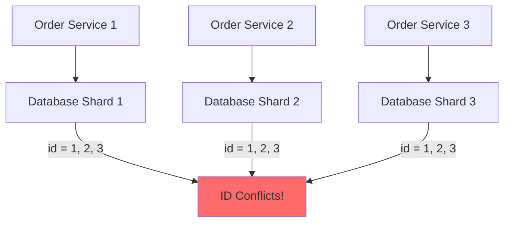

# Distributed ID & Ordering: Vấn Đề Định Danh Trong Hệ Thống Phân Tán

Tôi còn nhớ bug đầu tiên khiến tôi thức đêm vì distributed systems.

Chúng tôi vừa migrate từ monolith sang microservices. Everything worked locally. Deploy lên production... chaos.

Orders có duplicate IDs. Users complain "tôi order 1 món nhưng thấy 2 orders". Database constraints fail liên tục.

Root cause? Auto-increment IDs.

Senior architect nhìn tôi: *"Em biết tại sao auto-increment không work trong distributed systems chưa?"*

Tôi: *"... Chưa ạ."*

Đó là đêm tôi học về distributed ID generation. Và đó là một trong những problems subtle nhất nhưng critical nhất trong distributed systems.

## Tại Sao Auto-Increment Breaks?

### Monolith: Auto-Increment Works Perfectly
```sql
-- Single database
CREATE TABLE orders (
    id SERIAL PRIMARY KEY,  -- Auto-increment
    user_id INT,
    amount DECIMAL
);

-- Insert order 1 → id = 1
-- Insert order 2 → id = 2
-- Insert order 3 → id = 3

Perfect! Đơn giản, sequential, unique.
```

**Why it works:**
```
Single database = Single source of truth
Database engine guarantees uniqueness
Lock mechanism prevents duplicates
Simple++
```

### Distributed: Auto-Increment Breaks


*Ba database shards độc lập, mỗi cái generate auto-increment IDs riêng → Conflict!*

**Problem:**
```
Database Shard 1: id = 1, 2, 3, 4, ...
Database Shard 2: id = 1, 2, 3, 4, ...  (DUPLICATE!)
Database Shard 3: id = 1, 2, 3, 4, ...  (DUPLICATE!)

→ Same ID trên different shards
→ Merge data = disaster
→ Foreign keys break
→ Cache keys conflict
```

**Real-world impact:**

Tôi từng thấy một e-commerce site với bug này:
- User A order product X → id = 123 (shard 1)
- User B order product Y → id = 123 (shard 2)
- System merge orders → Conflict
- User A nhận product của User B
- Disaster!

**Lesson learned:** Auto-increment chỉ work với single database. Distributed systems cần approach khác.

## Requirements Cho Distributed IDs

Trước khi đi vào solutions, hãy hiểu requirements.

**Must have:**
```
1. Global uniqueness
   - ID phải unique across TẤT CẢ services/shards
   - Không conflict dù generate ở đâu

2. High availability
   - Generate ID không cần coordination
   - Không có single point of failure
   - Work khi network partition

3. High performance
   - Generate nhanh (< 1ms)
   - Không block
   - Million IDs/second
```

**Nice to have:**
```
4. Roughly time-ordered
   - IDs mới > IDs cũ
   - Useful cho sorting, debugging
   - Không cần perfect ordering

5. Compact
   - 64-bit thay vì 128-bit
   - Save storage, memory
   - Faster comparison

6. Human-readable
   - Có thể debug
   - Extract metadata (timestamp, machine ID)
```

**Trade-off reality:**

Không có solution nào satisfy tất cả. Phải choose based on priorities.

## Solution 1: UUID (Universally Unique Identifier)

### Concept

**UUID = 128-bit random number, guaranteed globally unique**
```
Format: 8-4-4-4-12 hexadecimal digits
Example: 550e8400-e29b-41d4-a716-446655440000

Total possible UUIDs: 2^128 ≈ 3.4 × 10^38
(Nhiều hơn số nguyên tử trong universe!)
```

**Versions:**
```
UUID v1: Timestamp + MAC address
UUID v4: Random (most common)
UUID v7: Timestamp-ordered (newest, best for databases)
```

### Implementation
```python
import uuid

# Generate UUID v4 (random)
id = uuid.uuid4()
print(id)  # 550e8400-e29b-41d4-a716-446655440000

# In database
CREATE TABLE orders (
    id UUID PRIMARY KEY DEFAULT gen_random_uuid(),
    user_id INT,
    amount DECIMAL
);

# Application code
def create_order(user_id, amount):
    order_id = uuid.uuid4()
    db.execute("""
        INSERT INTO orders (id, user_id, amount)
        VALUES (?, ?, ?)
    """, [order_id, user_id, amount])
    return order_id
```

**No coordination needed:**
```
Service 1 generates: 550e8400-e29b-41d4-a716-446655440000
Service 2 generates: 7c9e6679-7425-40de-944b-e07fc1f90ae7
Service 3 generates: 9e107d9d-372b-4d16-a86a-3a0f8e4f0c3d

All unique, no conflicts!
```

### Trade-offs
```
Advantages:
- Extremely simple to implement
- No coordination needed
- Truly globally unique
- Work offline
- Industry standard

Disadvantages:
- 128-bit (2x larger than 64-bit)
- Not sortable (random order)
- Poor database performance (random inserts)
- Not human-readable
- Hard to debug
```

### Database Performance Impact

**Problem với random UUIDs:**
```
B-tree index structure:
       [middle]
      /        \
  [left]      [right]

Sequential inserts (auto-increment):
→ Always insert at rightmost leaf
→ No page splits
→ Fast!

Random UUIDs:
→ Insert randomly throughout tree
→ Frequent page splits
→ Fragmentation
→ 2-3x slower inserts
```

**Benchmark (PostgreSQL):**
```
Auto-increment INT:  100,000 inserts = 2.3 seconds
UUID v4:            100,000 inserts = 7.1 seconds  (3x slower)
UUID v7:            100,000 inserts = 2.8 seconds  (close to INT!)
```

**Solution:** UUID v7 (timestamp-ordered)
```python
# UUID v7: Time-ordered, better for databases
import uuid_utils as uuid

id = uuid.uuid7()
# 018e8e7a-0000-7000-8000-000000000000
# ^^^^^^^^ - timestamp (sortable!)
```

### Khi Nào Dùng UUID?
```
Sử dụng UUID khi:
✓ Simplicity quan trọng nhất
✓ Không cần sorting by ID
✓ Storage/memory không phải constraint
✓ Muốn industry standard
✓ Need truly random IDs (security)

Tránh UUID khi:
✗ Database performance critical
✗ Need time-ordered IDs
✗ Storage constraints (mobile, IoT)
✗ Need human-readable IDs
```

**Personal take:**

UUID là safe default. Khi không chắc nên dùng gì, dùng UUID (preferably v7).

Chỉ optimize khác khi có specific requirements.

## Solution 2: Twitter Snowflake

### Concept

**Snowflake = 64-bit ID, time-ordered, globally unique**
```
64-bit structure:
┌─────────────────────────────────────────────────┐
│ 1 │      41 bits     │ 10 bits │    12 bits    │
│   │    timestamp     │ machine │   sequence    │
│ 0 │  milliseconds    │   ID    │   counter     │
└─────────────────────────────────────────────────┘
```

**Breakdown:**
```
Bit 0 (1 bit):
- Always 0 (reserved, sign bit)

Bits 1-41 (41 bits): Timestamp
- Milliseconds since epoch (custom epoch)
- 2^41 ms ≈ 69 years
- Sortable by time!

Bits 42-51 (10 bits): Machine ID
- Identifies which machine generated ID
- Support 2^10 = 1,024 machines
- Configured at startup

Bits 52-63 (12 bits): Sequence number
- Counter within same millisecond
- 2^12 = 4,096 IDs per millisecond per machine
- Reset mỗi millisecond mới
```

**Capacity calculation:**
```
Per machine:
- 4,096 IDs/millisecond
- 4,096,000 IDs/second
- ~350 billion IDs/day

1,024 machines:
- 4.2 million IDs/second globally
- 360 trillion IDs/day

More than enough!
```

### Implementation
```python
import time
import threading

class SnowflakeGenerator:
    def __init__(self, machine_id, datacenter_id=0):
        # Custom epoch (Jan 1, 2020)
        self.epoch = 1577836800000  # milliseconds
        
        # Bit lengths
        self.machine_id_bits = 5
        self.datacenter_id_bits = 5
        self.sequence_bits = 12
        
        # Max values
        self.max_machine_id = (1 << self.machine_id_bits) - 1
        self.max_datacenter_id = (1 << self.datacenter_id_bits) - 1
        self.max_sequence = (1 << self.sequence_bits) - 1
        
        # Current state
        self.machine_id = machine_id
        self.datacenter_id = datacenter_id
        self.sequence = 0
        self.last_timestamp = -1
        
        # Thread safety
        self.lock = threading.Lock()
        
        # Validate
        if machine_id > self.max_machine_id or machine_id < 0:
            raise ValueError(f"machine_id must be 0-{self.max_machine_id}")
    
    def _current_millis(self):
        return int(time.time() * 1000)
    
    def _wait_next_millis(self, last_timestamp):
        timestamp = self._current_millis()
        while timestamp <= last_timestamp:
            timestamp = self._current_millis()
        return timestamp
    
    def generate_id(self):
        with self.lock:
            timestamp = self._current_millis()
            
            # Same millisecond
            if timestamp == self.last_timestamp:
                self.sequence = (self.sequence + 1) & self.max_sequence
                
                # Sequence overflow, wait next millisecond
                if self.sequence == 0:
                    timestamp = self._wait_next_millis(self.last_timestamp)
            else:
                # New millisecond, reset sequence
                self.sequence = 0
            
            # Clock moved backwards (rare but possible)
            if timestamp < self.last_timestamp:
                raise Exception(f"Clock moved backwards. Refusing to generate id")
            
            self.last_timestamp = timestamp
            
            # Combine all parts
            id = ((timestamp - self.epoch) << (self.datacenter_id_bits + 
                                               self.machine_id_bits + 
                                               self.sequence_bits))
            id |= (self.datacenter_id << (self.machine_id_bits + self.sequence_bits))
            id |= (self.machine_id << self.sequence_bits)
            id |= self.sequence
            
            return id

# Usage
generator = SnowflakeGenerator(machine_id=1, datacenter_id=1)

id1 = generator.generate_id()  # 1234567890123456789
id2 = generator.generate_id()  # 1234567890123456790
id3 = generator.generate_id()  # 1234567890123456791

# Properties
print(id1 < id2 < id3)  # True - sortable!
print(len(str(id1)))    # 19 digits (64-bit)
```

### Extracting Metadata
```python
def parse_snowflake(id):
    """Extract timestamp, machine_id, sequence từ Snowflake ID"""
    
    # Constants
    epoch = 1577836800000
    sequence_bits = 12
    machine_id_bits = 10
    
    # Extract sequence
    sequence = id & ((1 << sequence_bits) - 1)
    
    # Extract machine ID
    id >>= sequence_bits
    machine_id = id & ((1 << machine_id_bits) - 1)
    
    # Extract timestamp
    id >>= machine_id_bits
    timestamp_ms = id + epoch
    
    return {
        'timestamp': timestamp_ms,
        'datetime': datetime.fromtimestamp(timestamp_ms / 1000),
        'machine_id': machine_id,
        'sequence': sequence
    }

# Parse ID
info = parse_snowflake(1234567890123456789)
print(info)
# {
#     'timestamp': 1709567890123,
#     'datetime': '2024-03-04 12:34:50',
#     'machine_id': 1,
#     'sequence': 789
# }
```

### Trade-offs
```
Advantages:
- 64-bit (compact, efficient)
- Time-ordered (sortable, good for DB)
- High performance (no coordination)
- Decentralized (no single point of failure)
- Human-debuggable (extract timestamp)
- Industry proven (Twitter, Discord, Instagram)

Disadvantages:
- Machine ID management (configuration needed)
- Clock synchronization required (NTP)
- 69 year limit (need to reset epoch)
- Sequence exhaustion trong same millisecond (rare)
```

### Clock Skew Problem

**Problem:**
```
Machine A clock: 10:00:00.000
Machine B clock: 10:00:05.000 (5 seconds ahead)

Machine B generates: ID = 1000005000...
Machine A generates: ID = 1000000000... (smaller!)

ID từ Machine A < ID từ Machine B về giá trị
nhưng generated SAU về thời gian!

→ Ordering broken
```

**Solutions:**
```
1. NTP synchronization (recommended)
   - Keep clocks synchronized (< 100ms drift)
   - Monitor clock skew
   - Alert nếu drift > threshold

2. Refuse generation if clock goes backwards
   - Check: current_time < last_time
   - Throw error hoặc wait
   - Tradeoff: Availability giảm

3. Use logical clocks (Lamport, Vector)
   - Không depend vào wall clock
   - Complex implementation
```

### Khi Nào Dùng Snowflake?
```
Sử dụng Snowflake khi:
✓ Need time-ordered IDs
✓ Database performance critical
✓ Need compact 64-bit IDs
✓ Need human-debuggable IDs
✓ High throughput (millions IDs/sec)
✓ Can manage machine IDs

Tránh Snowflake khi:
✗ Cannot sync clocks (NTP unreliable)
✗ Simplicity > Performance
✗ Không muốn manage machine IDs
✗ Need truly random IDs
```

**Personal experience:**

Snowflake là go-to choice cho high-scale systems. Twitter, Discord, Instagram đều dùng.

Tôi recommend Snowflake cho:
- High-traffic APIs
- Time-series data
- Logging systems
- Event sourcing

## Comparison: UUID vs Snowflake
```
┌─────────────────┬──────────────┬──────────────┐
│                 │     UUID     │  Snowflake   │
├─────────────────┼──────────────┼──────────────┤
│ Size            │   128-bit    │    64-bit    │
│ Uniqueness      │  Guaranteed  │  Guaranteed  │
│ Sortable        │      No      │     Yes      │
│ DB Performance  │    Medium    │     High     │
│ Implementation  │     Easy     │    Medium    │
│ Configuration   │     None     │  Machine ID  │
│ Dependencies    │     None     │   NTP sync   │
│ Readability     │     Poor     │     Good     │
│ Industry usage  │   Very high  │     High     │
└─────────────────┴──────────────┴──────────────┘
```

**Decision framework:**
```python
def choose_id_strategy(requirements):
    if requirements.simplicity_critical:
        return "UUID"
    
    if requirements.need_ordering:
        return "Snowflake"
    
    if requirements.db_performance_critical:
        return "Snowflake"
    
    if requirements.cannot_manage_machine_ids:
        return "UUID"
    
    if requirements.cannot_sync_clocks:
        return "UUID"
    
    # Default
    return "UUID"  # Safest choice
```

## The Event Ordering Problem

ID generation solve uniqueness. Nhưng còn ordering?

### Problem Statement
```
Service A (Machine 1):
- Event 1 happens at 10:00:00.000 → Generate ID = 100
- Event 2 happens at 10:00:00.001 → Generate ID = 101

Service B (Machine 2, clock ahead 5ms):
- Event 3 happens at 10:00:00.003 → Generate ID = 108

Timeline:
Event 1 (10:00:00.000) → ID = 100
Event 2 (10:00:00.001) → ID = 101
Event 3 (10:00:00.003) → ID = 108

Sort by ID:
100 < 101 < 108 ✓ Correct order

But if Machine 2 clock ahead:
Event 1 (10:00:00.000) → ID = 100
Event 3 (10:00:00.003) → ID = 95  (Machine 2 clock behind!)
Event 2 (10:00:00.001) → ID = 101

Sort by ID:
95 < 100 < 101 ✗ Wrong order! (Event 3 should be last)
```

### Why Ordering Matters

**Example 1: Bank transactions**
```
Event 1: Deposit $100  (balance = $100)
Event 2: Withdraw $50  (balance = $50)
Event 3: Withdraw $40  (balance = $10)

Correct order: $0 → $100 → $50 → $10 ✓

Wrong order:
Event 2 first → Insufficient funds! ✗
Event 3 first → Insufficient funds! ✗
```

**Example 2: Social media**
```
User posts:
Post 1: "Giới thiệu dự án"
Post 2: "Update tiến độ"
Post 3: "Kết quả cuối cùng"

Correct order: Logical flow ✓

Wrong order: "Kết quả" appear trước "Giới thiệu" ✗
→ Confused readers
```

### Solutions to Ordering

**Solution 1: Lamport Timestamps**
```python
class LamportClock:
    def __init__(self):
        self.time = 0
        self.lock = threading.Lock()
    
    def tick(self):
        """Increment trước mỗi event"""
        with self.lock:
            self.time += 1
            return self.time
    
    def update(self, received_time):
        """Update khi nhận message từ process khác"""
        with self.lock:
            self.time = max(self.time, received_time) + 1
            return self.time

# Process A
clock_a = LamportClock()
time_1 = clock_a.tick()  # 1
time_2 = clock_a.tick()  # 2

# Process B nhận message từ A với time = 2
clock_b = LamportClock()
time_3 = clock_b.update(2)  # max(0, 2) + 1 = 3
time_4 = clock_b.tick()     # 4

# Guarantee: time_1 < time_2 < time_3 < time_4
```

**Properties:**
```
Happened-before relationship preserved
No need wall clock
Simple algorithm

Không biết absolute time
Không detect concurrent events
Need message passing
```

**Solution 2: Vector Clocks**
```python
class VectorClock:
    def __init__(self, process_id, num_processes):
        self.process_id = process_id
        self.clock = [0] * num_processes
        self.lock = threading.Lock()
    
    def tick(self):
        """Increment own counter"""
        with self.lock:
            self.clock[self.process_id] += 1
            return self.clock.copy()
    
    def update(self, received_clock):
        """Merge với received vector clock"""
        with self.lock:
            for i in range(len(self.clock)):
                self.clock[i] = max(self.clock[i], received_clock[i])
            self.clock[self.process_id] += 1
            return self.clock.copy()
    
    def compare(self, other_clock):
        """So sánh 2 vector clocks"""
        less = all(self.clock[i] <= other_clock[i] for i in range(len(self.clock)))
        greater = all(self.clock[i] >= other_clock[i] for i in range(len(self.clock)))
        
        if less and not greater:
            return "BEFORE"  # self happened before other
        elif greater and not less:
            return "AFTER"   # self happened after other
        elif self.clock == other_clock:
            return "EQUAL"
        else:
            return "CONCURRENT"  # Cannot determine order

# 3 processes
clock_a = VectorClock(0, 3)  # Process A
clock_b = VectorClock(1, 3)  # Process B
clock_c = VectorClock(2, 3)  # Process C

# Process A events
event_1 = clock_a.tick()  # [1, 0, 0]
event_2 = clock_a.tick()  # [2, 0, 0]

# Process B nhận message từ A
event_3 = clock_b.update(event_2)  # [2, 1, 0]

# Process C độc lập
event_4 = clock_c.tick()  # [0, 0, 1]

# Compare
clock_b.compare(event_4)  # "CONCURRENT" - cannot order!
```

**Solution 3: Hybrid Logical Clocks (HLC)**

Best of both worlds: Physical time + Logical counter
```python
class HybridLogicalClock:
    def __init__(self):
        self.pt = 0  # Physical time
        self.lc = 0  # Logical counter
        self.lock = threading.Lock()
    
    def now(self):
        """Generate timestamp cho event"""
        with self.lock:
            pt_new = self._physical_time()
            
            if pt_new > self.pt:
                self.pt = pt_new
                self.lc = 0
            else:
                self.lc += 1
            
            return (self.pt, self.lc)
    
    def update(self, received_pt, received_lc):
        """Update khi nhận message"""
        with self.lock:
            pt_new = self._physical_time()
            
            if received_pt > self.pt and received_pt > pt_new:
                self.pt = received_pt
                self.lc = received_lc + 1
            elif received_pt == pt_new and received_pt == self.pt:
                self.lc = max(self.lc, received_lc) + 1
            elif pt_new > self.pt and pt_new > received_pt:
                self.pt = pt_new
                self.lc = 0
            else:
                self.lc += 1
            
            return (self.pt, self.lc)
    
    def _physical_time(self):
        return int(time.time() * 1000)  # milliseconds

# Usage
hlc = HybridLogicalClock()

event_1 = hlc.now()  # (1709567890123, 0)
event_2 = hlc.now()  # (1709567890124, 0)
event_3 = hlc.now()  # (1709567890124, 1) - same ms, increment lc

# Compare
event_1 < event_2 < event_3  # ✓ Total order preserved
```

**Trade-offs:**
```
Lamport:
Simple
Partial order
Cannot detect concurrency

Vector:
Detect concurrency
Full causality
O(N) storage (N = num processes)
Complex

HLC:
Close to physical time
Total order
Compact (2 numbers)
Still need clock sync (loosely)
```

## Ordering vs Uniqueness Trade-off

**The fundamental tension:**
```
Uniqueness: IDs không conflict
Ordering:   IDs reflect true chronological order

Cannot have perfect both với decentralized generation
```

**Options:**
```
1. Perfect uniqueness, no ordering
   → UUID v4
   → Completely random
   → No coordination

2. Good uniqueness, approximate ordering
   → Snowflake
   → Time-ordered (với clock sync)
   → Machine ID prevents conflicts

3. Perfect ordering, coordination required
   → Central ID server
   → Single point of failure
   → Bottleneck
   → Not scalable

Choose based on priorities
```

## Practical Recommendations

### For Most Applications

**Start with UUID v7** (timestamp-ordered UUID)
```python
import uuid

# UUID v7: Time-ordered, globally unique
id = uuid.uuid7()

Simple as UUID v4
Time-ordered like Snowflake
No configuration needed
Standard library support
Good database performance
```

### For High-Scale Systems

**Use Snowflake** if:
```
✓ Generating > 100K IDs/second
✓ Can manage machine IDs
✓ Can synchronize clocks (NTP)
✓ Need 64-bit compact IDs
✓ Need extract metadata (timestamp, machine)
```

### For Strict Ordering Requirements

**Use Hybrid Logical Clocks** if:
```
✓ Ordering critical (financial, audit logs)
✓ Can tolerate complexity
✓ Need detect causality
✓ Distributed events across services
```

### Anti-Patterns to Avoid
```
DON'T use auto-increment trong distributed systems
DON'T rely on wall clocks for ordering
DON'T generate IDs centrally (bottleneck)
DON'T ignore clock skew problems
DON'T use timestamp alone as ID (not unique)
```

## Real-World Examples

**Twitter:**
```
Uses Snowflake for tweet IDs
- 64-bit
- Time-ordered
- 200,000+ tweets/second
- Can extract timestamp from ID
```

**Instagram:**
```
Modified Snowflake
- 41 bits: timestamp
- 13 bits: shard ID
- 10 bits: sequence
- Store photos across 1000+ shards
```

**Discord:**
```
Snowflake-based
- 64-bit
- Extract timestamp for "X minutes ago"
- Debug performance by ID ranges
```

**MongoDB:**
```
ObjectID (96-bit)
- 4 bytes: timestamp
- 5 bytes: random value
- 3 bytes: counter
- Similar concept to Snowflake
```

## Key Takeaways

**Auto-increment breaks trong distributed systems:**
```
Single database: ✓ Works
Multiple databases: ✗ Conflicts
Multiple services: ✗ Conflicts

Need distributed ID generation strategy
```

**ID generation strategies:**
```
UUID:
- Simplest
- 128-bit
- Random
- No ordering
- Default choice

Snowflake:
- 64-bit
- Time-ordered
- Machine ID needed
- High performance
- Industry standard

HLC:
- Best ordering
- Causality tracking
- Most complex
- Specialized use cases
```

**Ordering trade-offs:**
```
No coordination:   Approximate ordering
Some coordination: Good ordering
Full coordination: Perfect ordering (không scalable)

Choose based on requirements
```

**Decision framework:**
```
if simple_is_priority:
    use UUID_v7
elif high_scale and need_ordering:
    use Snowflake
elif strict_ordering_required:
    use HLC
else:
    use UUID_v7  # Safe default
```

**Golden rules:**

1. **Never use auto-increment trong distributed systems**
2. **UUID v7 là safe default cho most cases**
3. **Snowflake cho high-scale, time-ordered needs**
4. **Perfect ordering requires coordination (không free)**
5. **Always test clock skew scenarios**

Distributed ID generation là one of those problems looks simple nhưng subtle complexity.

Hiểu trade-offs. Choose appropriately. Test thoroughly.

**IDs là foundation của hệ thống. Get it wrong = pain later.**
