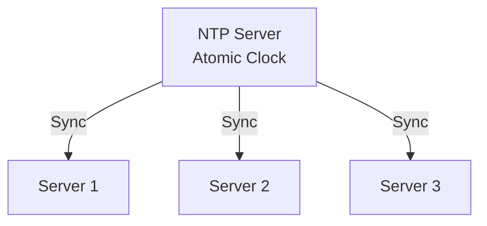
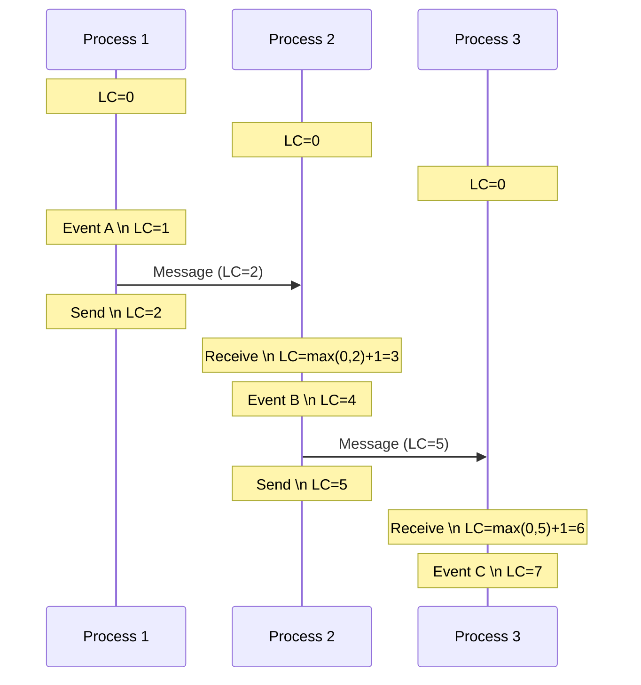
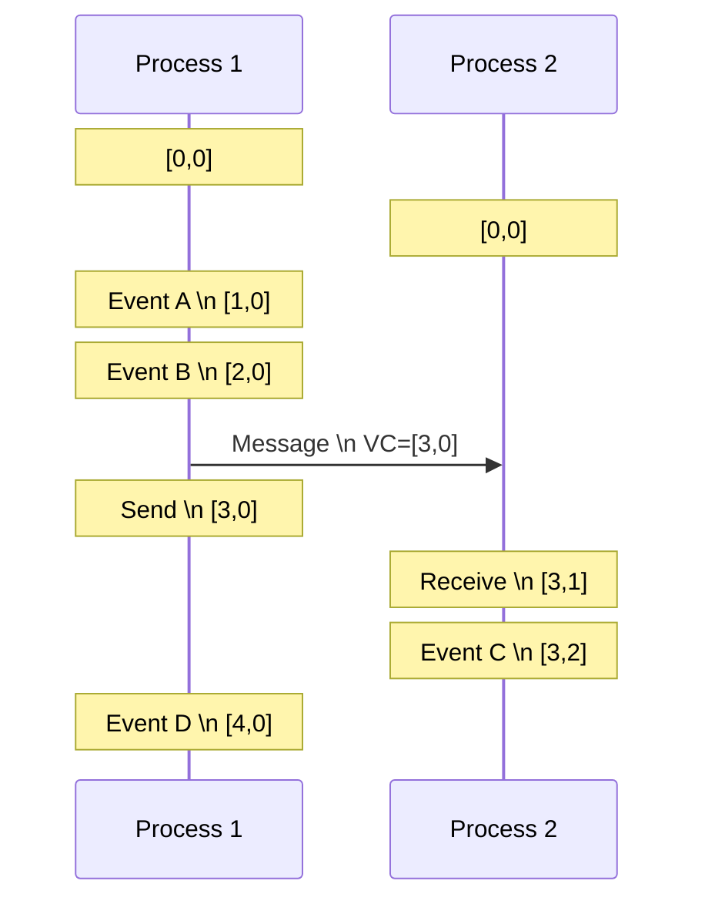

# Time & Event Ordering - Clock Problem Trong Distributed Systems

Có một câu hỏi tưởng chừng đơn giản:

**"Event A xảy ra trước hay sau event B?"**

Trong single-machine application, câu trả lời dễ: check timestamp. CPU clock cho biết thứ tự chính xác.

Nhưng trong distributed system với 3 servers ở 3 locations khác nhau, câu hỏi này trở nên cực kỳ khó.

**Server 1 (Singapore):** Event A timestamp = 10:00:00.123  
**Server 2 (Tokyo):** Event B timestamp = 10:00:00.120

Event B nhỏ hơn → xảy ra trước? **Không chắc.**

Vì clock của 2 servers không sync hoàn hảo. Clock drift có thể làm timestamp sai lệch milliseconds, thậm chí seconds.

**Đây chính là Clock Problem - một trong những vấn đề khó nhất trong distributed systems.**

Lesson này dạy bạn:
- Tại sao physical clocks không reliable
- Logical clocks giải quyết vấn đề như thế nào
- Lamport timestamps và Vector clocks
- Causality vs concurrency
- Khi nào cần ordering, khi nào không

## Tại Sao Thời Gian Quan Trọng?

Trước khi đi sâu vào giải pháp, hiểu tại sao ordering events lại critical.

### Use Case 1: Database Replication
```
User update profile ở Server A
  timestamp: 10:00:00.100
  name: "Alice" → "Bob"

User update profile ở Server B (concurrent)
  timestamp: 10:00:00.095
  name: "Alice" → "Charlie"
```

**Khi replicate, apply order nào?**

Nếu dựa vào timestamp → "Charlie" wins (timestamp nhỏ hơn).  
Nhưng có thể Server B's clock chậm 10ms → thực tế "Bob" mới là update cuối.

**Wrong ordering = wrong final state.**

### Use Case 2: Distributed Transaction
```
Transaction 1: Transfer $100 (A → B)
Transaction 2: Check balance of A
```

Nếu Transaction 2 đọc trước khi Transaction 1 complete → stale data.  
Phải đảm bảo causality: check balance phải thấy transfer đã xong.

### Use Case 3: Event Sourcing
```
Event 1: Order created
Event 2: Payment processed  
Event 3: Order shipped
```

**Events phải replay đúng thứ tự.**

Nếu ship trước khi payment → logic sai.

**Mental model:** Distributed systems cần ordering để maintain correctness và consistency.

## Physical Clocks & Clock Drift Problem

### Physical Clock Là Gì?

**Physical clock = system clock của server, đo thời gian thực.**

Mỗi server có quartz crystal oscillator đếm thời gian.
```
Server 1: 2025-02-15 10:00:00.000
Server 2: 2025-02-15 10:00:00.003  (drift +3ms)
Server 3: 2025-02-15 09:59:59.998  (drift -2ms)
```

**Problem: Clocks không bao giờ perfect sync.**

### Clock Drift

**Clock drift = sự sai lệch giữa clocks của các servers.**

**Nguyên nhân:**
- Crystal oscillator không hoàn hảo (temperature, manufacturing variance)
- Network delay khi sync time
- Relativistic effects (servers ở altitudes khác nhau - đùa chứ không phải lý do chính 😄)

**Thực tế drift rate:**
- Typical: ±50 ppm (parts per million)
- Good server: ±10 ppm
- Worst case: ±100 ppm

**Ý nghĩa:**
```
±50 ppm = ±50 microseconds mỗi giây
         = ±4.3 seconds mỗi ngày
         = ±26 minutes mỗi năm
```

**Chỉ sau 1 ngày không sync, 2 servers có thể sai lệch vài giây.**

### NTP (Network Time Protocol)

**Giải pháp: Sync clocks với central time source.**


**NTP hoạt động:**
1. Server gửi request đến NTP server
2. NTP server reply với timestamp
3. Server tính network latency
4. Adjust local clock

**Accuracy:**
- Internet: ±10-100ms
- LAN: ±1-10ms
- GPS/Atomic: ±1μs

**Problems vẫn còn:**

**1. Network jitter**
- Network latency không stable
- Sync request có thể delay

**2. Clock skew**
- Adjust clock có thể làm time jump backward
- Application thấy time quay ngược → bugs

**3. Không perfect**
- Vẫn có drift giữa sync intervals
- ±10ms accuracy vẫn là vấn đề với high-frequency events

**Key insight:** Physical clocks không reliable cho ordering trong distributed systems.

## Logical Clocks - Ordering Without Physical Time

**Breakthrough thinking:** Chúng ta không cần biết exact time, chỉ cần biết **order** của events.

**Logical clock = counter để track order, không phải actual time.**

### Lamport Timestamps - Foundation Của Logical Ordering

**Leslie Lamport (1978) đưa ra logical clock algorithm đơn giản nhưng powerful.**

#### Core Idea

**Mỗi process có counter (Lamport clock):**
- Start at 0
- Increment trước mỗi event
- Khi send message: attach counter
- Khi receive message: update counter = max(local, received) + 1

#### Rules
```
1. Internal event: LC = LC + 1
2. Send message: LC = LC + 1, attach LC to message
3. Receive message: LC = max(LC, message.LC) + 1
```

### Ví Dụ Thực Tế


**Step-by-step:**
```
Process 1:
  LC=1: Event A (internal)
  LC=2: Send message to P2

Process 2:  
  LC=3: Receive from P1 (max(0,2)+1)
  LC=4: Event B (internal)
  LC=5: Send message to P3

Process 3:
  LC=6: Receive from P2 (max(0,5)+1)  
  LC=7: Event C (internal)
```

**Ordering:**
- Event A (LC=1) < Send P1→P2 (LC=2)
- Send P1→P2 (LC=2) < Receive at P2 (LC=3)
- Event B (LC=4) < Send P2→P3 (LC=5)
- Send P2→P3 (LC=5) < Receive at P3 (LC=6)

**Lamport guarantee: Nếu A → B (A happens before B), thì LC(A) < LC(B).**

### Happened-Before Relationship (→)

**A → B có nghĩa là:**
1. A và B ở cùng process, A trước B, hoặc
2. A là send, B là receive của cùng message, hoặc
3. Tồn tại C mà A → C và C → B (transitivity)

**Nếu không có A → B và không có B → A → A và B concurrent.**

### Limitation Của Lamport Timestamps

**Problem:** Lamport chỉ đảm bảo 1 chiều.
```
If A → B then LC(A) < LC(B)    TRUE
If LC(A) < LC(B) then A → B    FALSE
```

**Ví dụ:**
```
Process 1: Event A (LC=5)
Process 2: Event B (LC=8)
```

LC(A) < LC(B), nhưng không có causal relationship → A và B concurrent.

**Lamport không phân biệt được causality vs concurrency.**

## Vector Clocks - Detecting Causality

**Vector clocks solve Lamport's limitation.**

### Core Idea

**Mỗi process maintain vector of counters - 1 counter cho mỗi process.**
```
Process 1: VC = [1, 0, 0]  // [P1, P2, P3]
Process 2: VC = [0, 1, 0]
Process 3: VC = [0, 0, 1]
```

### Rules
```
1. Internal event: VC[i] = VC[i] + 1 (i = own process)

2. Send message: 
   - VC[i] = VC[i] + 1
   - Attach VC to message

3. Receive message:
   - VC[i] = max(VC[i], message.VC[i]) for all i
   - VC[own] = VC[own] + 1
```

### Ví Dụ Vector Clocks


**Comparison:**
```
Event A: [1,0]
Event B: [2,0]
Event C: [3,2]
Event D: [4,0]
```

**A → B?**  
`[1,0] < [2,0]` (mọi component ≤) → **YES, causal**

**B → C?**  
`[2,0] < [3,2]` → **YES, causal** (B happened before C)

**C → D?**  
`[3,2] vs [4,0]`: `3<4` but `2>0` → **NO, concurrent**

**D → C?**    
`[4,0] vs [3,2]`: `4>3 `→ **NO, concurrent**

**C và D concurrent - không có causal relationship.**

### Vector Clock Comparison Rules
```
VC1 < VC2 (VC1 causally precedes VC2) nếu:
  - VC1[i] ≤ VC2[i] for all i
  - ∃j where VC1[j] < VC2[j]

VC1 || VC2 (concurrent) nếu:
  - ∃i where VC1[i] < VC2[i]
  - ∃j where VC1[j] > VC2[j]
```

**Vector clocks detect concurrency chính xác.**

### Trade-off: Lamport vs Vector Clocks

| Aspect | Lamport | Vector Clocks |
|--------|---------|---------------|
| Size | O(1) - single number | O(N) - N processes |
| Causality detection | One-way only | Both ways |
| Concurrency detection | No | Yes |
| Use case | Simple ordering | Conflict detection |

**Lamport:** Lightweight, đủ cho ordering logs, events.  
**Vector clocks:** Detect conflicts, cần cho replication, version control.

## Causality - Happens-Before Relationship

**Causality = relationship giữa cause và effect.**

### Causal Events
```
Event A: User click "Submit Order"
Event B: System save order to database
Event C: System send confirmation email
```

**A → B → C**: Clear causal chain.

Order này phải maintain. Không thể send email trước khi save database.

### Concurrent Events
```
Process 1: User A update profile
Process 2: User B update profile (different user)
```

**No causal relationship → concurrent.**

Order không quan trọng. Có thể apply updates theo bất kỳ order nào.

### Why Causality Matters

**1. Data consistency**
```
Write X=1 on Server A
Write X=2 on Server B (causally after)
```

Replicate phải maintain order: final value = 2.

**2. Application logic**
```
Order created → Payment processed → Order shipped
```

Violate causality = logic error.

**3. Conflict detection**
```
Concurrent writes:
  User A: X=1
  User B: X=2
```

Không có causal order → conflict → need resolution strategy.

## Practical Applications

### 1. Version Control (Git)

**Git commits dùng Directed Acyclic Graph (DAG) - causality graph.**
```
commit A → commit B → commit C
              ↓
            commit D (branch)
```

Merge conflicts = concurrent edits (B→C vs B→D).

### 2. Distributed Databases (DynamoDB, Cassandra)

**Vector clocks detect conflicting writes.**
```
Write 1: VC=[1,0], value="Alice"
Write 2: VC=[0,1], value="Bob"  (concurrent)
```

System detect concurrent writes → application resolves conflict.

### 3. CRDTs (Conflict-free Replicated Data Types)

**Eventual consistency với automatic conflict resolution.**

Causality tracking đảm bảo operations commute (order không matter).

### 4. Event Sourcing

**Events stored với causal metadata (Lamport/Vector clock).**

Replay events maintain causality → consistent state.

## Hybrid Logical Clocks (HLC) - Best Of Both Worlds

**Modern approach: Combine physical time + logical clock.**

### Why HLC?

**Problem với pure logical clocks:**
- Không có notion of real time
- Debug khó (không biết event xảy ra lúc nào thực tế)
- External integration khó (APIs expect real timestamps)

**Problem với physical clocks:**
- Clock drift
- Không detect causality

**HLC = Physical time + Lamport-style counter.**

### HLC Structure
```
HLC = (physical_time, logical_counter)
```

**Rules:**
```
1. Internal event:
   pt = max(physical_clock, last_hlc.pt)
   if pt == last_hlc.pt:
     lc = last_hlc.lc + 1
   else:
     lc = 0
   hlc = (pt, lc)

2. Send/Receive: similar logic
```

**Benefit:**
- Causality guarantee (như Lamport)
- Close to physical time (useful cho debugging, monitoring)
- Bounded drift (logical counter bound)

**Used by:** CockroachDB, MongoDB (kinda), Google Spanner (TrueTime).

## When Do You Actually Need Event Ordering?

**Reality check:** Không phải lúc nào cũng cần precise ordering.

### Cần Ordering Khi:

**1. Maintaining data consistency**
- Replicated databases
- Distributed transactions
- Event sourcing

**2. Causal dependencies**
- Order → Payment → Shipment
- Create account → Verify email → Activate

**3. Conflict detection**
- Concurrent writes to same data
- Version control merges

### Không Cần (Hoặc Relaxed) Ordering:

**1. Independent events**
- User A's action không affect User B
- Different resources, no sharing

**2. Eventually consistent systems**
- Social media likes (eventual count OK)
- View counters
- Analytics data

**3. Idempotent operations**
- Set X=5 (order không matter, final state same)

**Mental model:** Ordering có cost (complexity, performance). Chỉ enforce khi cần thiết.

## Practical Considerations

### 1. Overhead

**Lamport:** Minimal - single integer.  
**Vector clocks:** O(N) per process - high với nhiều servers.  
**HLC:** Similar to Lamport + physical clock sync.

**Trade-off:** Accuracy vs overhead.

### 2. Storage

**Vector clocks grow with system size.**
```
10 servers: 10 integers per event
1000 servers: 1000 integers per event
```

**Solution:** 
- Prune old entries
- Server set thay đổi → resize vector
- Use hybrid approaches

### 3. Debugging

**Logical clocks khó debug vì không có real time.**

**Best practice:** Log both logical và physical timestamps.
```json
{
  "event": "order_created",
  "lamport_clock": 12345,
  "wall_clock": "2025-02-15T10:00:00Z",
  "vector_clock": [5, 3, 8]
}
```

## Mental Model: Time Trong Distributed Systems ≠ Time Trong Đời Thật

**Core insight lesson này:**

**Trong distributed systems, thời gian không phải là global linear axis.**
```
Single machine:
  Event A (10:00:00) → Event B (10:00:01)
  Clear timeline

Distributed system:
  Server 1: Event A (10:00:00.000)
  Server 2: Event B (10:00:00.001)
  → Không chắc A trước B
```

**Thay vì rely vào physical time, dùng causal relationships:**
- A → B (happened-before)
- A || B (concurrent)

**Physical clocks:** Useful cho humans, không reliable cho ordering.  
**Logical clocks:** Reliable cho ordering, không có real time meaning.  
**Hybrid clocks:** Best of both worlds.

**Architect decision:** Pick clock strategy based on requirements - consistency level, debugging needs, performance constraints.

## Key Takeaways

**1. Physical clocks drift - không reliable cho event ordering**

±10-100ms error là normal. NTP giúp nhưng không perfect.

**2. Logical clocks order events without physical time**

Lamport timestamps đảm bảo causal order. Lightweight, O(1).

**3. Vector clocks detect causality và concurrency**

Phân biệt được causal vs concurrent events. Cost: O(N) space.

** 4. Happened-before relationship (→) define causality**

A → B hoặc A || B (concurrent). Không có middle ground.

**5. HLC combine physical time + logical ordering**

Best of both worlds. Used by modern databases.

**6. Ordering có cost - chỉ enforce khi cần thiết**

Independent events không cần strict ordering. Trade-off complexity vs correctness.

**7. Mental model: Time ≠ global timeline trong distributed systems**

Think in terms of causality, not wall clock.

---

**Phase 3 hoàn thành.** Bạn đã học distributed systems fundamentals:
- Failure models & CAP
- Consistency models
- Consensus & leader election  
- Distributed transactions
- Distributed ID generation
- Time & event ordering

**Phase 4 tiếp theo** sẽ focus vào scalability & performance - bottleneck thinking, caching strategies, CDN, database scaling patterns.

**Remember: In distributed systems, "what happened first?" is often the wrong question. The right question is "did A cause B?" Understand causality, not just timestamps.**