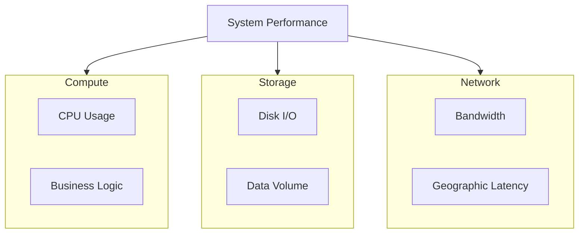
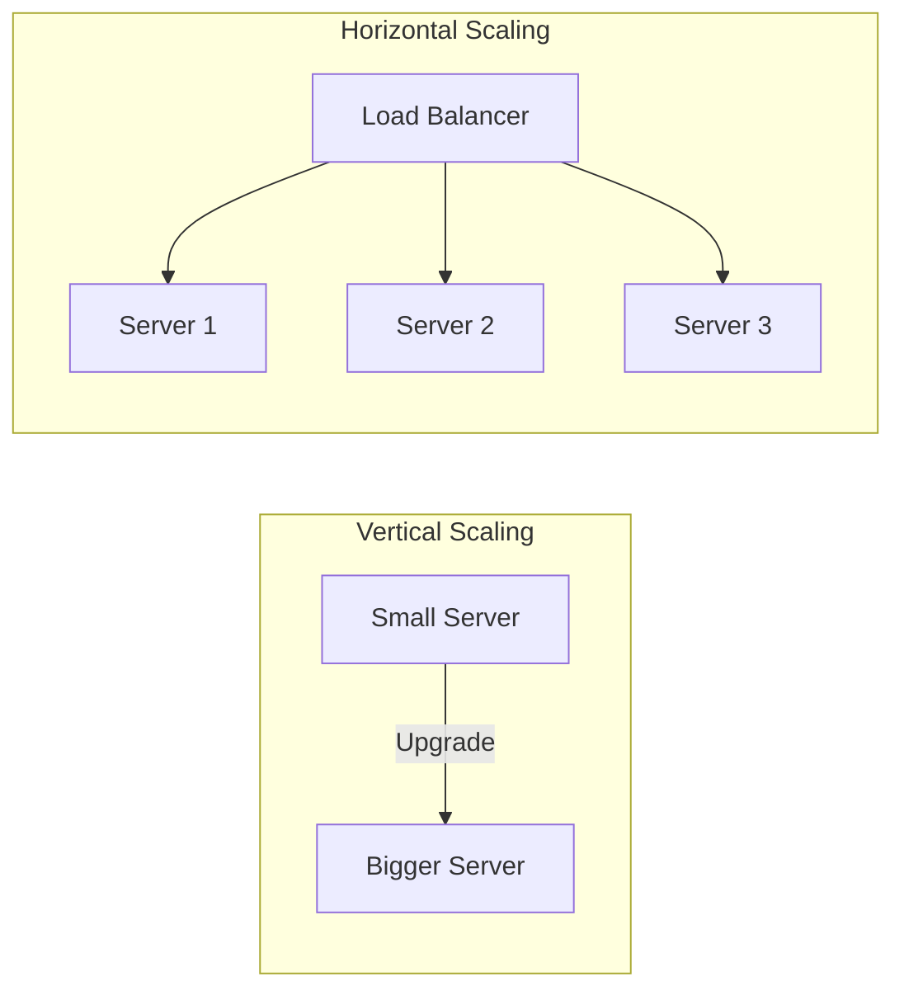
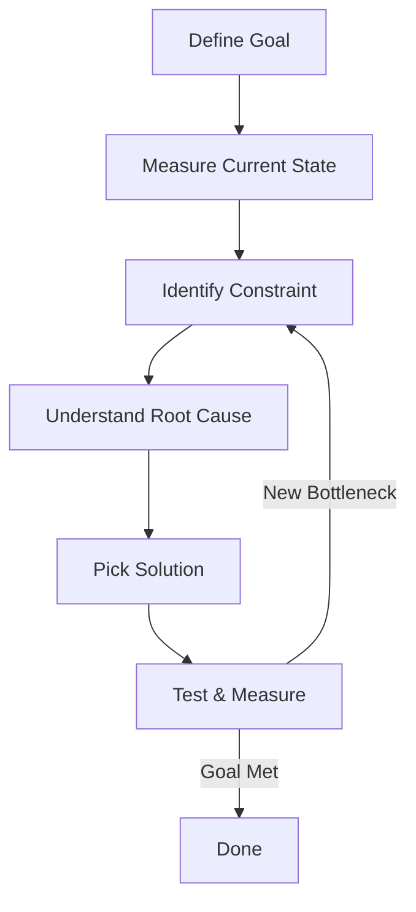

# Performance & Bottleneck Thinking - Tư Duy Tìm Và Giải Quyết Điểm Nghẽn

Khi hệ thống bắt đầu chậm, nhiều developer nghĩ ngay: "Thêm server!". Nhưng đây là sai lầm phổ biến nhất trong system design.

**Scaling không phải là thêm resource. Scaling là tìm và loại bỏ bottleneck.**

Nếu bạn không biết đâu là điểm nghẽn, việc thêm server chỉ là lãng phí tiền. Đôi khi thêm 10 server vẫn không giải quyết được vấn đề vì bottleneck nằm ở database, không phải application server.

Lesson này dạy bạn **tư duy performance từ góc nhìn architect** - cách nhìn hệ thống như một pipeline, tìm điểm nghẽn, và quyết định đúng cách scale.

## Tại Sao Phải Học Bottleneck Thinking Trước?

Trước khi học CDN, caching, database sharding... bạn cần hiểu:

**Mỗi kỹ thuật scale đều giải quyết một loại bottleneck cụ thể.**

- CDN giải quyết bottleneck ở **network latency & bandwidth**
- Caching giải quyết bottleneck ở **database read load**
- Sharding giải quyết bottleneck ở **database write throughput**
- Message queue giải quyết bottleneck ở **sync processing time**

Nếu không biết tìm bottleneck, bạn sẽ áp dụng giải pháp sai → lãng phí effort + tiền bạc.

**Mental model đúng:**

1. Measure → tìm bottleneck
2. Understand root cause
3. Pick giải pháp phù hợp
4. Measure lại

Không phải: nghe người ta dùng Redis → mình cũng dùng Redis.

## Scalability Dimensions - 3 Chiều Của Performance

Khi nói về performance, hệ thống có 3 chiều bạn phải quan tâm:

### 1. Compute (CPU/Processing Power)

Đây là khả năng xử lý của server - tính toán, logic, algorithms.

**Bottleneck ở compute khi:**
- CPU usage cao (>80%)
- Application server chậm vì business logic phức tạp
- Image processing, video encoding, ML inference chạy lâu

**Giải pháp:**
- Vertical scaling: nâng cấp CPU mạnh hơn
- Horizontal scaling: thêm application server + load balancer
- Async processing: đẩy heavy task sang queue

### 2. Storage (Disk I/O & Data Volume)

Khả năng đọc/ghi dữ liệu và lượng data bạn cần lưu.

**Bottleneck ở storage khi:**
- Disk I/O chậm (HDD vs SSD khác biệt lớn)
- Database query chậm vì data size lớn
- Full table scan trên bảng hàng triệu records

**Giải pháp:**
- Upgrade storage: HDD → SSD → NVMe
- Database indexing
- Database sharding (chia data ra nhiều server)
- Archiving old data

### 3. Network (Bandwidth & Latency)

Tốc độ truyền tải dữ liệu giữa các component.

**Bottleneck ở network khi:**
- Transfer file lớn (video, images)
- User ở xa server (geographic latency)
- Bandwidth bị limit (nhiều request cùng lúc)

**Giải pháp:**
- CDN: cache static content gần user
- Compression: giảm data size
- Reduce payload: chỉ trả về data cần thiết
- Multiple regions: deploy server gần user


**Bottleneck có thể nằm ở bất kỳ dimension nào. Task của architect là tìm ra dimension nào đang limit hệ thống.**

## Throughput vs Latency - Hai Metrics Quan Trọng Nhất

Khi measure performance, có 2 metrics bạn phải hiểu rõ:

### Throughput (Requests Per Second)

**Throughput = số lượng request hệ thống xử lý được trong 1 giây.**

Ví dụ:
- API handle 1000 req/s
- Database process 500 writes/s
- Queue consume 10,000 messages/s

**Throughput cao = hệ thống xử lý được nhiều traffic.**

### Latency (Response Time)

**Latency = thời gian để hoàn thành 1 request.**

Ví dụ:
- API response time: 100ms
- Database query time: 50ms
- Network round trip: 200ms

**Latency thấp = user experience tốt.**

### Trade-off Giữa Throughput và Latency

Đây là điểm khó: **không phải lúc nào cũng optimize được cả hai.**

**Case 1: Tăng throughput → có thể tăng latency**

Khi bạn cho phép API xử lý nhiều request cùng lúc (tăng concurrency), mỗi request có thể phải chờ lâu hơn vì resource bị share.
```
Trước: 100 req/s, latency 50ms
Sau: 500 req/s, latency 200ms
```

Throughput tăng 5x, nhưng latency tăng 4x.

**Case 2: Giảm latency → có thể giảm throughput**

Khi bạn optimize từng request chạy nhanh hơn (giảm latency), có thể phải giảm số request xử lý đồng thời.

**Architect decision:**
- E-commerce: latency quan trọng (user trải nghiệm)
- Analytics system: throughput quan trọng (xử lý bulk data)
- Payment system: cả hai đều quan trọng

Bạn phải biết business cần gì để quyết định optimize direction.

## Vertical vs Horizontal Scaling - Hai Cách Scale Cơ Bản

### Vertical Scaling (Scale Up)

**Nâng cấp server hiện tại: CPU mạnh hơn, RAM nhiều hơn, disk nhanh hơn.**

**Ưu điểm:**
- Đơn giản: không cần thay đổi code
- Không có distributed system complexity
- Phù hợp với monolithic app

**Nhược điểm:**
- Có giới hạn vật lý (không thể mua CPU vô hạn)
- Expensive: server càng mạnh càng đắt exponentially
- Single point of failure: server die → toàn bộ hệ thống down

**Khi nào dùng vertical scaling:**
- Hệ thống nhỏ, traffic chưa cao
- Database cần consistency cao (khó scale horizontal)
- Quick fix tạm thời

### Horizontal Scaling (Scale Out)

**Thêm nhiều server cùng xử lý: 1 server → 5 servers → 50 servers.**

**Ưu điểm:**
- Không có giới hạn lý thuyết (thêm server liên tục)
- Cost effective: nhiều server nhỏ rẻ hơn 1 server lớn
- High availability: 1 server die, còn lại vẫn hoạt động

**Nhược điểm:**
- Phức tạp: cần load balancer, session management, data consistency
- Không phải component nào cũng scale được horizontal (database khó)
- Development effort cao

**Khi nào dùng horizontal scaling:**
- Hệ thống lớn, traffic cao
- Cần high availability
- Stateless application (API, microservices)


**Reality:** Hầu hết hệ thống lớn dùng **cả hai** - vertical cho database, horizontal cho application layer.

## Amdahl's Law - Tại Sao Không Thể Scale Vô Hạn

**Amdahl's Law nói rằng: Speedup của hệ thống bị giới hạn bởi phần không thể parallelize.**

Giả sử một request có flow:
1. Parse request: 10ms (có thể parallel)
2. Database query: 80ms (có thể parallel)
3. Serialize response: 10ms (**KHÔNG thể parallel - bottleneck**)

**Total time: 100ms**

Khi bạn scale horizontal:
- Parse: 10ms → 5ms (2x faster)
- Database: 80ms → 40ms (2x faster)
- Serialize: 10ms → **vẫn 10ms** (không thể parallel)

**Total time: 55ms (chỉ cải thiện 1.8x, không phải 2x)**

**Serialize response chính là bottleneck.** Dù bạn thêm bao nhiêu server, step này vẫn giữ nguyên.

**Practical insight:**

Khi bạn scale và không thấy improvement tuyến tính → tìm phần không parallel được (serialization, critical section, single-threaded logic).

**Architect thinking:** Không phải cứ thêm server là hệ thống nhanh hơn. Bạn phải tìm phần nào đang block parallel execution.

## Bottleneck Identification Process - Quy Trình Tìm Điểm Nghẽn

Đây là quy trình thực tế architect dùng để tìm bottleneck:

### Step 1: Define Performance Goal

Trước khi tìm bottleneck, phải biết target là gì.

**Không rõ ràng:**
- "Hệ thống phải nhanh"

**Rõ ràng:**
- API response time < 200ms for 95th percentile
- Handle 10,000 req/s sustained
- Database query < 50ms average

**Không có goal = không biết đâu là bottleneck.**

### Step 2: Measure Current State

Đo tất cả metrics quan trọng:

**Application layer:**
- Request rate (req/s)
- Response time (p50, p95, p99)
- Error rate
- CPU & memory usage

**Database layer:**
- Query time
- Connection pool usage
- Slow query log
- Disk I/O

**Network:**
- Bandwidth usage
- Latency between services
- Packet loss

**Tool:** Prometheus, Grafana, DataDog, New Relic, CloudWatch.

### Step 3: Identify The Constraint

Nhìn vào metrics → tìm component nào đang maxed out.

**Ví dụ thực tế:**
```
API server: CPU 40%, Memory 50% → OK
Load balancer: CPU 10% → OK
Database: CPU 95%, query time 500ms → BOTTLENECK!
```

→ Bottleneck ở database, không phải API server.

**Thêm API server sẽ không giải quyết vấn đề.**

### Step 4: Understand Root Cause

Tìm được bottleneck chưa đủ. Phải hiểu **tại sao** nó bottleneck.

Database CPU cao có thể vì:
- Missing index → full table scan
- Bad query (N+1 problem)
- Data volume quá lớn
- Too many connections

**Phải dig deeper để biết giải pháp đúng.**

### Step 5: Pick The Right Solution

Mỗi root cause có giải pháp khác nhau:

| Root Cause | Solution |
|------------|----------|
| Missing index | Add index |
| N+1 query | Query optimization, eager loading |
| High read load | Read replica, caching |
| High write load | Sharding, queue async writes |
| Large dataset | Archiving, partitioning |

**Không có one-size-fits-all solution.**

### Step 6: Test & Measure Again

Sau khi apply solution:
- Load test lại
- Measure metrics
- Verify improvement
- Tìm bottleneck mới (thường có bottleneck tiếp theo)

**Performance optimization là iterative process.**


## Load Testing Thinking - Tìm Bottleneck Trước Khi Production

Đừng đợi đến khi production down mới tìm bottleneck.

**Load testing = simulate traffic để expose bottleneck sớm.**

### Loại Load Test

**1. Baseline test**
- Chạy với normal traffic
- Measure baseline metrics
- Hiểu behavior bình thường

**2. Stress test**
- Tăng traffic từ từ
- Tìm breaking point
- Xem component nào fail trước

**3. Spike test**
- Traffic tăng đột ngột (flash sale, viral post)
- Test auto-scaling
- Verify recovery

**4. Soak test (Endurance test)**
- Chạy sustained load trong nhiều giờ
- Tìm memory leak, resource exhaustion
- Verify stability long-term

### Tool: k6, JMeter, Gatling, Locust

**Ví dụ k6 script:**
```javascript
import http from 'k6/http';
import { check, sleep } from 'k6';

export let options = {
  stages: [
    { duration: '2m', target: 100 },  // ramp up
    { duration: '5m', target: 100 },  // stay at 100 users
    { duration: '2m', target: 200 },  // ramp to 200
    { duration: '5m', target: 200 },
    { duration: '2m', target: 0 },    // ramp down
  ],
};

export default function () {
  let res = http.get('https://api.example.com/users');
  check(res, { 'status was 200': (r) => r.status == 200 });
  sleep(1);
}
```

**Quan sát metrics khi load tăng:**
- Response time có tăng không?
- Error rate có spike không?
- Component nào CPU/memory tăng nhanh?

**Đó chính là bottleneck.**

## Mental Model: Scale = Remove Bottleneck

Ghi nhớ mental model này:

**Scaling không phải là thêm resource ngẫu nhiên.**

**Scaling = identify bottleneck → remove bottleneck → repeat.**

Hệ thống như một pipeline. Water flow bị limit bởi **đoạn ống nhỏ nhất**.
```
[Wide pipe] → [NARROW PIPE] → [Wide pipe]
                    ↑
                Bottleneck
```

Dù bạn mở rộng 2 đoạn pipe to ra, water flow vẫn bị limit bởi đoạn giữa.

**Apply vào system:**
```
[API: 10k req/s] → [DB: 1k req/s] → [Response]
                         ↑
                    Bottleneck
```

Thêm API server không giúp gì. Phải scale database hoặc thêm cache.

**Architect mindset:**
1. Hệ thống luôn có bottleneck
2. Fix bottleneck hiện tại → bottleneck mới xuất hiện
3. Optimization là continuous process
4. Measure → Fix → Measure lại

## Key Takeaways

**1. Scalability có 3 dimensions: Compute, Storage, Network**

Bottleneck có thể nằm ở bất kỳ dimension nào. Phải identify đúng.

**2. Throughput ≠ Latency**

Hai metrics khác nhau, có thể conflict. Biết business cần gì để optimize đúng direction.

**3. Vertical scaling: đơn giản nhưng có limit. Horizontal scaling: unlimited nhưng phức tạp**

Hầu hết hệ thống lớn dùng hybrid approach.

**4. Amdahl's Law: Speedup bị giới hạn bởi phần không parallel được**

Tìm critical section, serialization point là key.

**5. Bottleneck identification process:**

Define goal → Measure → Identify constraint → Root cause → Solution → Test lại.

**6. Load testing giúp tìm bottleneck trước production**

Stress test, spike test, soak test đều quan trọng.

**7. Mental model: Scale = Remove bottleneck**

Không phải add resource. Là tìm và loại bỏ constraint.

---

Hãy nhớ: **Architect giỏi không phải người biết nhiều công nghệ. Là người biết tìm đúng bottleneck và pick đúng giải pháp.**