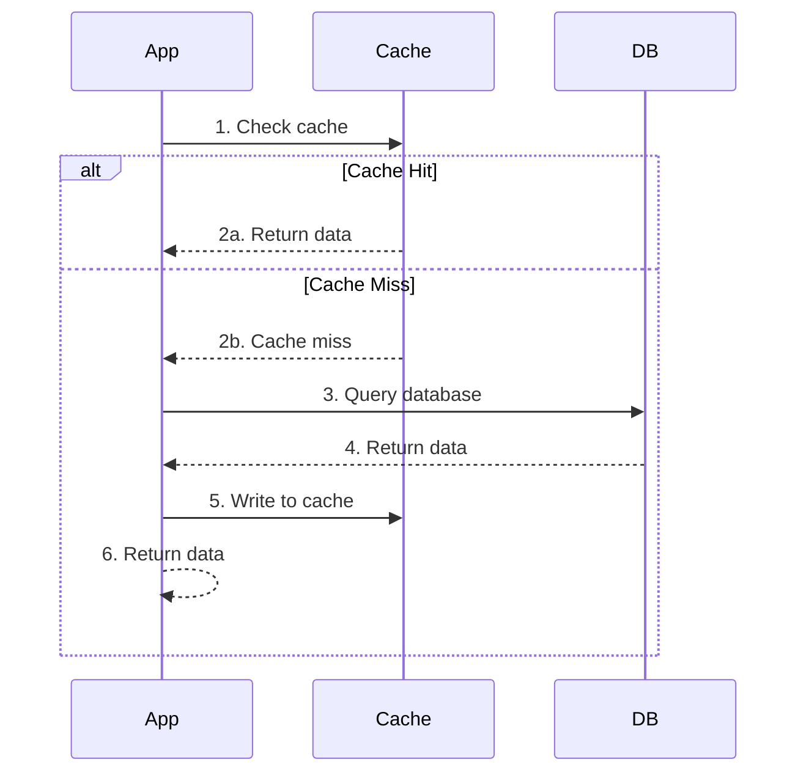
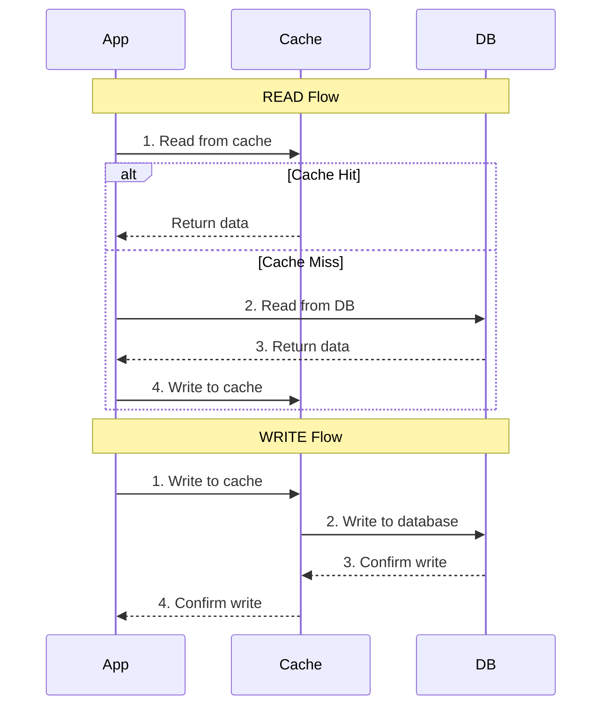
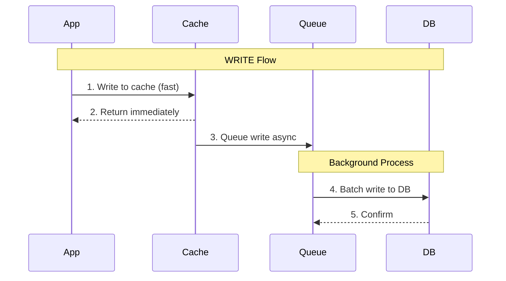
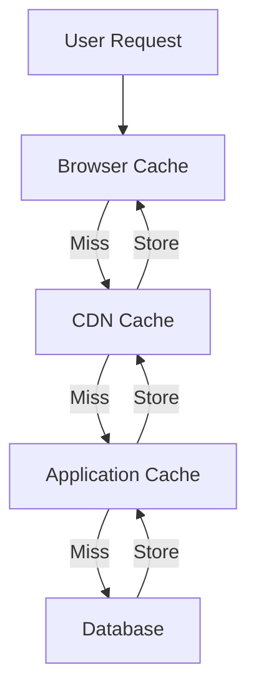

# Caching Strategy - Trade Consistency Để Lấy Speed

Có một câu nói nổi tiếng trong system design:

**"There are only two hard things in Computer Science: cache invalidation and naming things." - Phil Karlton**

Caching nghe đơn giản: lưu data vào memory để đọc nhanh hơn. Nhưng khi implement thực tế, bạn sẽ gặp hàng tá câu hỏi khó:

- Cache ở đâu? Application? Database? CDN?
- Khi nào update cache? Ngay lập tức hay lazy?
- Khi nào xóa cache? Làm sao biết data đã stale?
- Cache bao nhiêu data? RAM có giới hạn mà
- Chuyện gì xảy ra khi cache và database không sync?

**Đây chính là lý do caching strategy quan trọng.**

Lesson này dạy bạn tư duy caching như một architect - hiểu các pattern, biết khi nào dùng pattern nào, và quan trọng nhất: **hiểu trade-off giữa performance và consistency.**

## Tại Sao Caching Hoạt Động?

Trước khi học strategy, phải hiểu **tại sao** caching lại hiệu quả đến vậy.

### Locality of Reference

**Dữ liệu được truy cập gần đây có khả năng cao sẽ được truy cập lại.**

**Ví dụ thực tế:**
- Facebook: Bạn refresh newsfeed 10 lần/phút → cùng một posts
- E-commerce: Sản phẩm hot (iPhone mới) được xem hàng triệu lần
- News site: Breaking news được đọc bởi hàng triệu người

**Thay vì query database 1 triệu lần, cache lần đầu → serve 999,999 lần từ memory.**

### Speed Difference Between Storage Layers
```
RAM (cache):        ~100 nanoseconds
SSD (database):     ~100 microseconds (1000x chậm hơn)
HDD:                ~10 milliseconds (100,000x chậm hơn)
Network (remote):   ~100 milliseconds (1,000,000x chậm hơn)
```

**Cache hit = 1000x - 1,000,000x nhanh hơn.**

Đây là lý do tại sao caching có impact khổng lồ lên performance.

### The 80/20 Rule (Pareto Principle)

**80% requests truy cập 20% data.**

- YouTube: 20% video chiếm 80% views (viral videos)
- Reddit: 20% posts ở frontpage có 80% traffic
- API: 20% endpoints nhận 80% requests

**Chỉ cần cache 20% data hot, bạn đã giải quyết 80% traffic.**

**Mental model:** Caching không phải cache tất cả. Là cache đúng data.

## Cache-Aside Pattern (Lazy Loading)

Đây là pattern phổ biến nhất và đơn giản nhất.

### Flow Hoạt Động


**Step by step:**

1. Application check cache trước
2. **Cache hit:** Return data từ cache (fast path)
3. **Cache miss:** Query database
4. Write data vào cache
5. Return data cho user

### Code Example
```python
def get_user(user_id):
    # 1. Check cache
    cache_key = f"user:{user_id}"
    user = redis.get(cache_key)
    
    if user is not None:
        # 2. Cache hit
        return json.loads(user)
    
    # 3. Cache miss - query database
    user = db.query("SELECT * FROM users WHERE id = ?", user_id)
    
    # 4. Write to cache (TTL = 1 hour)
    redis.setex(cache_key, 3600, json.dumps(user))
    
    # 5. Return data
    return user
```

### Ưu Điểm

**Đơn giản và dễ implement**
- Logic rõ ràng
- Dễ debug
- Application control hoàn toàn

**Cache chỉ chứa data được request**
- Không waste memory cho data không dùng
- Cache tự nhiên warm up theo traffic pattern

**Resilient với cache failure**
- Cache down → app vẫn hoạt động (chậm hơn thôi)
- Không có single point of failure

### Nhược Điểm

**Cache miss penalty cao**
- Request đầu tiên luôn chậm (query DB + write cache)
- Stampede problem: nhiều requests cùng cache miss → query DB nhiều lần

**Data có thể stale**
- Cache không tự động update khi DB thay đổi
- Phải rely vào TTL hoặc manual invalidation

### Khi Nào Dùng Cache-Aside

**Phù hợp với:**
- Read-heavy workload
- Data không thay đổi thường xuyên
- Application cần control cache logic
- Tolerate eventual consistency

**Ví dụ use case:**
- User profile (ít thay đổi)
- Product catalog
- Configuration data
- Blog posts

## Write-Through Pattern

Write-through giải quyết vấn đề consistency của cache-aside.

### Flow Hoạt Động


**Key difference:** Khi write data, application write vào cache → cache write vào database.

**Cache luôn sync với database.**

### Code Example
```python
def update_user(user_id, data):
    cache_key = f"user:{user_id}"
    
    # 1. Write to cache first
    redis.set(cache_key, json.dumps(data))
    
    # 2. Cache writes to database
    db.execute("UPDATE users SET ... WHERE id = ?", user_id)
    
    # Cache and DB are now in sync
    return data
```

### Ưu Điểm

**Data consistency cao**
- Cache và database luôn sync
- Không có stale data problem

**Read performance tốt**
- Data luôn có sẵn trong cache
- Không có cache miss trên data mới write

### Nhược Điểm

**Write latency cao**
- Mỗi write phải đợi cả cache + database
- Slow path cho write operations

**Write-heavy workload không hiệu quả**
- Cache được update nhưng có thể không được read
- Waste effort nếu data không hot

**Cache failure = write failure**
- Cache down → không thể write
- Tăng dependency và risk

### Khi Nào Dùng Write-Through

**Phù hợp với:**
- Cần strong consistency
- Read-after-write pattern (write rồi read ngay)
- Critical data không được phép stale

**Ví dụ use case:**
- Financial transactions
- Inventory management
- Session data
- Shopping cart

## Write-Behind Pattern (Write-Back)

Write-behind optimize write performance bằng cách write async.

### Flow Hoạt Động


**Key difference:** Application chỉ write vào cache → return ngay. Cache tự sync xuống database sau (async).

### Ưu Điểm

**Write performance cực cao**
- Application chỉ write vào memory
- Latency thấp nhất có thể

**Batch writes**
- Cache có thể gộp nhiều writes lại
- Giảm database load dramatically

**Throughput cao**
- Hệ thống handle được write-heavy workload
- Database không bị overwhelm

### Nhược Điểm

**Risk mất data**
- Cache crash trước khi sync → data mất
- Cần replication cho cache layer

**Consistency phức tạp**
- Cache có data mới, database có data cũ
- Read từ database trực tiếp sẽ stale

**Implementation phức tạp**
- Cần queue system
- Cần handle retry, failure
- Cần monitoring

### Khi Nào Dùng Write-Behind

**Phù hợp với:**
- Write-heavy applications
- Tolerate eventual consistency
- Có infra để handle complexity

**Ví dụ use case:**
- Analytics data collection
- Logging systems
- Social media likes/views counter
- Gaming leaderboards

## Cache Invalidation - Hard Problem Của Caching

**"Cache invalidation is one of the hardest problems in computer science."**

Vấn đề: Làm sao biết khi nào cache đã stale và cần refresh?

### Strategy 1: Time-Based (TTL)

**Set expiration time cho mỗi cache entry.**
```python
# Cache expires after 1 hour
redis.setex("user:123", 3600, user_data)
```

**Ưu điểm:**
- Đơn giản
- Tự động cleanup
- Predictable behavior

**Nhược điểm:**
- Data có thể stale trong TTL window
- Hard to pick right TTL value
- Cache miss surge khi nhiều keys expire cùng lúc

**Best practice:**
- Add random jitter để tránh thundering herd
```python
ttl = 3600 + random.randint(0, 300)  # 1h ± 5 min
```

### Strategy 2: Event-Based Invalidation

**Invalidate cache khi data thay đổi.**
```python
def update_user(user_id, data):
    # Update database
    db.execute("UPDATE users SET ... WHERE id = ?", user_id)
    
    # Invalidate cache
    redis.delete(f"user:{user_id}")
```

**Ưu điểm:**
- Data luôn fresh
- Không có stale data window

**Nhược điểm:**
- Phức tạp khi có nhiều places update data
- Cache miss sau invalidation (cold start)
- Hard to track all dependencies

### Strategy 3: Version-Based Invalidation

**Dùng version number trong cache key.**
```python
def get_user(user_id):
    version = get_user_version(user_id)  # from DB or separate cache
    cache_key = f"user:{user_id}:v{version}"
    
    user = redis.get(cache_key)
    if user is None:
        user = db.query(...)
        redis.set(cache_key, user)
    
    return user

def update_user(user_id, data):
    db.execute("UPDATE users SET ... WHERE id = ?", user_id)
    increment_user_version(user_id)  # Bump version
```

**Ưu điểm:**
- Old cache tự nhiên invalid (không match version)
- Không cần explicit delete
- Dễ rollback

**Nhược điểm:**
- Cần maintain version metadata
- More cache keys (memory usage)

### Reality Check: Combine Strategies

**Thực tế, architect dùng combination:**

- **TTL làm safety net:** Đảm bảo data không stale quá lâu
- **Event-based cho critical paths:** User update profile → invalidate ngay
- **Version cho complex dependencies:** Product có nhiều related data

**Không có perfect solution. Pick trade-off phù hợp.**

## Cache Eviction Policies - Khi Cache Đầy

RAM có giới hạn. Khi cache đầy, phải xóa data cũ.

**Câu hỏi: Xóa cache entry nào?**

### LRU (Least Recently Used)

**Xóa entry lâu nhất không được access.**

**Logic:**
- Mỗi cache hit → move entry lên top
- Khi cache đầy → xóa entry ở bottom (lâu nhất không dùng)
```python
from collections import OrderedDict

class LRUCache:
    def __init__(self, capacity):
        self.cache = OrderedDict()
        self.capacity = capacity
    
    def get(self, key):
        if key not in self.cache:
            return None
        # Move to end (most recent)
        self.cache.move_to_end(key)
        return self.cache[key]
    
    def put(self, key, value):
        if key in self.cache:
            self.cache.move_to_end(key)
        self.cache[key] = value
        if len(self.cache) > self.capacity:
            # Remove least recent (first item)
            self.cache.popitem(last=False)
```

**Khi nào dùng:**
- Access pattern temporal (recent data được dùng lại)
- General purpose caching
- Default choice cho most cases

**Ví dụ:** News site - Breaking news (recent) được read nhiều.

### LFU (Least Frequently Used)

**Xóa entry có frequency thấp nhất.**

**Logic:**
- Track số lần mỗi entry được access
- Khi cache đầy → xóa entry ít được dùng nhất
```python
class LFUCache:
    def __init__(self, capacity):
        self.capacity = capacity
        self.cache = {}
        self.freq = {}  # Track access frequency
    
    def get(self, key):
        if key not in self.cache:
            return None
        self.freq[key] += 1
        return self.cache[key]
    
    def put(self, key, value):
        if len(self.cache) >= self.capacity:
            # Find least frequent key
            min_key = min(self.freq, key=self.freq.get)
            del self.cache[min_key]
            del self.freq[min_key]
        
        self.cache[key] = value
        self.freq[key] = 1
```

**Khi nào dùng:**
- Hot data không đổi theo time (always popular)
- Long-lived cache

**Ví dụ:** E-commerce - Sản phẩm bestseller luôn hot, không phụ thuộc temporal.

### FIFO (First In First Out)

**Xóa entry cũ nhất (theo thứ tự insert).**

Đơn giản nhưng ít dùng vì không consider access pattern.

### Comparison

| Policy | Evict | Best For | Overhead |
|--------|-------|----------|----------|
| LRU | Lâu nhất không dùng | Temporal access | Medium |
| LFU | Ít được dùng nhất | Long-term popular | High |
| FIFO | Cũ nhất | Simple cases | Low |

**Reality:** Redis default dùng **approximation LRU** (fast + efficient).

## Multi-Layer Caching - Defense In Depth

Caching không chỉ một layer. Hệ thống lớn có nhiều cache layers.

### Layer 1: Browser Cache

**Cache ở client browser.**
```http
HTTP/1.1 200 OK
Cache-Control: public, max-age=31536000
ETag: "abc123"
```

**Ưu điểm:**
- Không có network request
- Fastest possible
- Reduce server load

**Dùng cho:**
- Static assets (CSS, JS, images)
- Immutable content

### Layer 2: CDN Cache

**Cache ở edge locations gần user.**
```
User (Vietnam) → CDN (Singapore) → Origin (US)
```

**Ưu điểm:**
- Reduce latency (geographic)
- Reduce origin server load
- Handle traffic spikes

**Dùng cho:**
- Images, videos
- Static HTML pages
- Public content

### Layer 3: Application Cache (Redis/Memcached)

**Cache ở application layer.**
```python
# Redis cache
user = redis.get(f"user:{user_id}")
```

**Ưu điểm:**
- Flexible (custom logic)
- Shared across app servers
- Fast lookup

**Dùng cho:**
- API responses
- Database query results
- Session data
- Computed data

### Layer 4: Database Cache (Query Cache)

**Cache ở database layer.**

MySQL query cache, PostgreSQL shared buffers, etc.

**Ưu điểm:**
- Transparent (application không cần biết)
- Optimize repeated queries

**Dùng cho:**
- Expensive queries
- Aggregations
- Join results

### Multi-Layer Strategy


**Request flow:**
1. Check browser cache → hit = instant
2. Miss → check CDN → hit = fast
3. Miss → check application cache → hit = good
4. Miss → query database → slow but acceptable

**Mỗi layer đều giảm load cho layer sau.**

## Cache Patterns So Sánh

| Pattern | Write Perf | Read Perf | Consistency | Complexity |
|---------|-----------|-----------|-------------|------------|
| Cache-Aside | Fast | Good | Eventual | Low |
| Write-Through | Slow | Best | Strong | Medium |
| Write-Behind | Best | Best | Eventual | High |

**Không có best pattern. Chỉ có right pattern cho use case.**

## Mental Model: Performance = Trade Consistency For Speed

**Core insight của caching:**

**Bạn đang trade consistency để lấy speed.**

- Cache-aside: Accept stale data trong TTL window
- Write-through: Sacrifice write speed để có consistency
- Write-behind: Accept risk mất data để có extreme speed

**Không có free lunch.**

Architect giỏi biết:
- Use case cần consistency level nào?
- Trade-off nào acceptable?
- Risk nào có thể mitigate?

**Example decisions:**

**E-commerce product price:**
- Cần strong consistency → Write-through
- Stale price = wrong order = loss money

**Social media like count:**
- Accept eventual consistency → Write-behind
- Stale count vài giây = acceptable
- Extreme write throughput = critical

**Blog posts:**
- Accept stale → Cache-aside với TTL
- Content ít thay đổi
- Performance matters hơn real-time

## Key Takeaways

**1. Caching works vì locality of reference**

80% traffic hit 20% data. Cache đúng 20% đó.

**2. Ba pattern chính: Cache-Aside, Write-Through, Write-Behind**

Mỗi pattern trade-off khác nhau. Pick based on use case.

**3. Cache invalidation is hard**

Combine TTL, event-based, version-based. Không có perfect solution.

**4. Cache eviction: LRU cho temporal, LFU cho long-term popular**

Redis default LRU works cho most cases.

**5. Multi-layer caching: Browser → CDN → App → Database**

Mỗi layer giảm load cho layer sau. Defense in depth.

**6. Mental model: Trade consistency for speed**

Hiểu trade-off, pick đúng level cho use case.

**7. Cache là optimization, không phải requirement**

Cache failure không được làm system fail. Always have fallback.

---

**Remember: Great architects don't just add cache. They understand which data to cache, where to cache it, and what consistency guarantees they're giving up.**