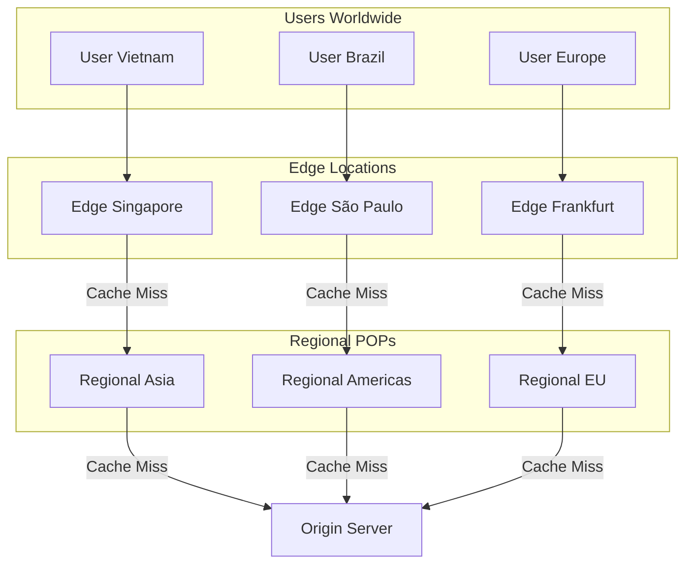
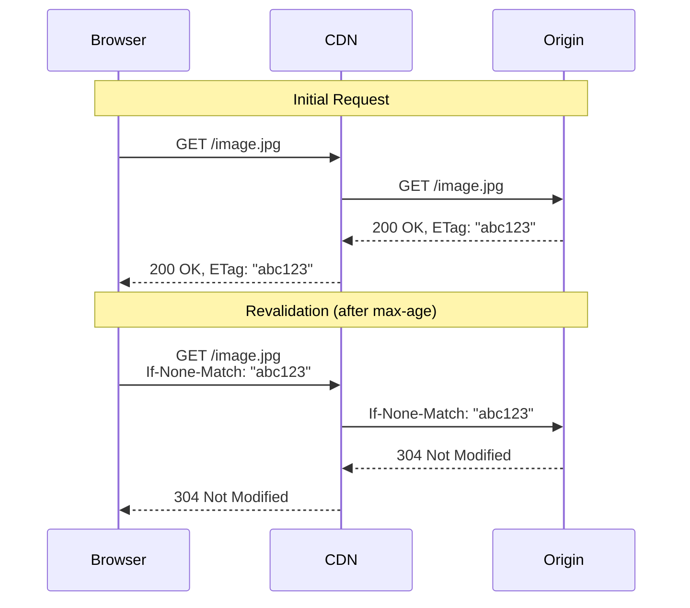
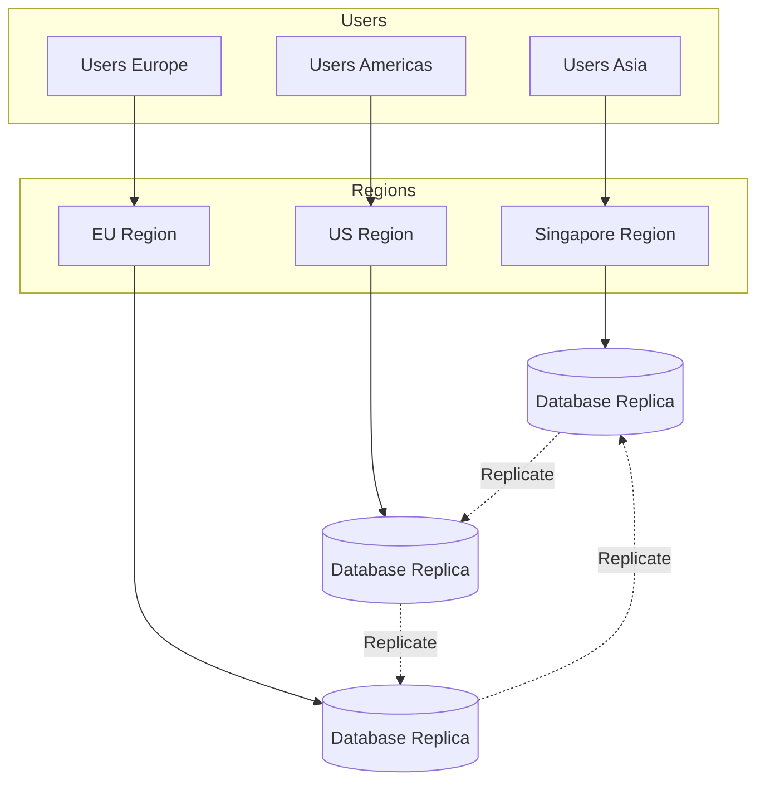

# CDN & Edge Computing - Distributed Cache Gần User

Bạn có một API server ở Singapore. User ở Brazil truy cập website → latency 300ms chỉ để network round trip.

Không quan trọng code của bạn tối ưu thế nào. **Physics không thể cheat được.**

Ánh sáng đi qua fiber optic có tốc độ giới hạn. Distance từ Singapore → Brazil = ~18,000km. Round trip = minimum ~240ms, thực tế 300-400ms vì routing.

**Giải pháp duy nhất: Đưa content gần user hơn.**

Đây chính là lý do CDN (Content Delivery Network) tồn tại.

Lesson này dạy bạn:
- CDN architecture thực tế
- Cách optimize static và dynamic content
- Cache invalidation ở edge
- Edge computing - chạy logic gần user
- Khi nào CDN thực sự cần thiết

## CDN Là Gì? (Không Chỉ Là Cache)

**CDN = Distributed cache system deployed globally at edge locations.**

Nhưng CDN không chỉ là cache đơn thuần. CDN là:

**1. Geographic distribution**
- Servers ở nhiều locations trên thế giới
- User tự động route đến server gần nhất

**2. Specialized caching**
- Optimize cho static content (images, videos, CSS, JS)
- Handle massive concurrent requests
- Tiered cache architecture

**3. Network optimization**
- Better routing than public internet
- TCP connection optimization
- HTTP/2, HTTP/3 support

**4. Security layer**
- DDoS protection
- WAF (Web Application Firewall)
- SSL/TLS termination

**Mental model:** CDN = cache layer + network layer + security layer ở edge.

## CDN Architecture - Từ Origin Đến Edge


**Tiered CDN architecture (ví dụ Cloudflare, Akamai):**

### Tier 1: Edge Locations (200+ locations)

**Ở gần user nhất.**
- User request đến edge gần nhất (latency thấp nhất)
- Cache static content
- Handle majority of requests

### Tier 2: Regional POPs (Point of Presence)

**Aggregation layer.**
- Edge miss → check regional
- Reduce load to origin
- Shield origin từ spike traffic

### Tier 3: Origin Server

**Your actual server.**
- Chỉ serve khi cả edge + regional miss
- Protected từ direct traffic
- Handle dynamic content generation

**Flow thực tế:**
```
User (Vietnam) 
  → Edge (Singapore) [HIT - 10ms] ✅
  
User (Thailand)
  → Edge (Bangkok) [MISS]
  → Regional (Asia) [HIT - 50ms] ✅
  
User (Myanmar - new location)
  → Edge (Myanmar) [MISS]
  → Regional (Asia) [MISS]
  → Origin (Singapore) [200ms] ⚠️
```

**90%+ requests serve từ edge/regional. Origin chỉ handle &lt;10%.**

## Cache Headers - Control CDN Behavior

CDN caching behavior được control bởi HTTP headers.

### Cache-Control Header

**Quan trọng nhất để control caching.**
```http
Cache-Control: public, max-age=31536000, immutable
```

**Directives:**

**public**
- Content có thể cache bởi bất kỳ ai (CDN, browser, proxy)
- Dùng cho public content

**private**
- Chỉ browser cache, CDN không cache
- Dùng cho user-specific content

**max-age=&lt;seconds&gt;**
- Cache valid trong bao lâu
- `max-age=3600` = cache 1 hour

**s-maxage=&lt;seconds&gt;**
- Override max-age cho shared cache (CDN)
- Browser dùng max-age, CDN dùng s-maxage

**immutable**
- Content sẽ không bao giờ thay đổi
- CDN không cần revalidate

**no-cache**
- Phải revalidate với origin mỗi request
- Cache có thể store nhưng must check

**no-store**
- Không cache gì cả
- Sensitive data

### Practical Examples

**Static assets (CSS/JS với versioning):**
```http
Cache-Control: public, max-age=31536000, immutable
```
- Cache 1 năm
- Không bao giờ thay đổi (vì có version trong URL)
- `style.abc123.css` → change code → `style.def456.css`

**Images:**
```http
Cache-Control: public, max-age=86400
```
- Cache 1 ngày
- Revalidate sau đó

**API responses (cacheable):**
```http
Cache-Control: public, max-age=300, s-maxage=600
```
- Browser cache 5 phút
- CDN cache 10 phút
- Eventual consistency acceptable

**User-specific data:**
```http
Cache-Control: private, max-age=0, must-revalidate
```
- Chỉ browser cache
- Must verify mỗi request

**Sensitive data:**
```http
Cache-Control: no-store
```
- Không cache anywhere

### ETag & Conditional Requests

**ETag = fingerprint của content.**
```http
HTTP/1.1 200 OK
ETag: "abc123def456"
Cache-Control: public, max-age=3600
```

**Revalidation flow:**


**304 Not Modified = content chưa thay đổi, dùng lại cache.**

Bandwidth saving: Không transfer lại full content.

## Static vs Dynamic Content - Caching Strategy

### Static Content

**Content không thay đổi hoặc ít thay đổi.**

**Examples:**
- Images, videos
- CSS, JavaScript files
- Fonts
- PDFs, documents

**CDN strategy:**
```http
Cache-Control: public, max-age=31536000, immutable
```

**Cache hit rate: 95%+**

**Best practices:**
- **Versioned URLs:** `app.v123.js` thay vì `app.js`
- **Content hashing:** `bundle.abc123.js`
- **Separate domain:** `static.example.com` (cookie-free)

### Dynamic Content

**Content personalized hoặc thay đổi thường xuyên.**

**Examples:**
- User dashboard
- API responses
- Personalized recommendations
- Real-time data

**Challenge:** Mỗi user khác nhau, cache không hiệu quả?

**Solution: Smart caching strategies.**

#### Strategy 1: Cache Common Parts
```html
<!-- Cached HTML template -->
<html>
  <body>
    <header>...</header>
    
    <!-- Dynamic part loaded via JS -->
    <div id="user-content"></div>
    
    <footer>...</footer>
  </body>
</html>
```

Template cache, user data fetch riêng.

#### Strategy 2: Vary Header
```http
Vary: Accept-Encoding, User-Agent
Cache-Control: public, max-age=300
```

CDN cache separate copies based on vary header.

**Ví dụ:**
- Desktop vs mobile: different HTML
- Logged in vs logged out: different content

#### Strategy 3: Edge Side Includes (ESI)
```html
<html>
  <body>
    <esi:include src="/user/profile" />
    <esi:include src="/recommended-products" />
  </body>
</html>
```

CDN assemble page từ multiple parts:
- Static parts: cached long
- Dynamic parts: cached short hoặc bypass

## Cache Invalidation Ở CDN - The Hard Problem

**Problem:** Content thay đổi ở origin, CDN vẫn serve stale data.

### Solution 1: Purge API

**Explicitly tell CDN to delete cache.**
```bash
# Cloudflare purge API
curl -X POST "https://api.cloudflare.com/client/v4/zones/{zone_id}/purge_cache" \
  -H "Authorization: Bearer {api_token}" \
  -d '{"files":["https://example.com/image.jpg"]}'
```

**Khi nào dùng:**
- Update critical content
- User upload new profile picture
- Product price change

**Nhược điểm:**
- Không instant (propagation delay)
- API rate limits
- Complexity trong application

### Solution 2: Cache Busting (Versioned URLs)

**Thay đổi URL khi content thay đổi.**
```html
<!-- Old version -->
<script src="/app.js?v=1"></script>

<!-- New version -->
<script src="/app.js?v=2"></script>
```

**Better: Content hash**
```html
<script src="/app.abc123.js"></script>
<!-- After change -->
<script src="/app.def456.js"></script>
```

**Ưu điểm:**
- Không cần purge API
- Instant update
- Old version vẫn accessible (rollback)

**Đây là best practice cho static assets.**

### Solution 3: Short TTL + Stale-While-Revalidate
```http
Cache-Control: max-age=60, stale-while-revalidate=86400
```

**Behavior:**
- Fresh cho 60 seconds
- Stale 60s-1day: serve stale, async revalidate
- After 1 day: must revalidate

**Trade-off:** Accept eventual consistency để có performance.

### Solution 4: Surrogate Keys (Advanced)

**Tag related content với keys.**
```http
Surrogate-Key: product-123 category-shoes
```

**Purge by tag:**
```bash
# Update product 123 → purge all related
curl -X PURGE "https://example.com/" \
  -H "Surrogate-Key: product-123"
```

Purge multiple URLs cùng lúc without knowing exact URLs.

## Edge Computing - Chạy Logic Gần User

**CDN evolution: Từ cache → compute.**

Edge computing = chạy code ở edge locations, không chỉ cache.

### Use Cases

#### 1. A/B Testing Ở Edge
```javascript
// Cloudflare Workers example
addEventListener('fetch', event => {
  event.respondWith(handleRequest(event.request))
})

async function handleRequest(request) {
  const variant = Math.random() < 0.5 ? 'A' : 'B'
  
  // Modify response based on variant
  const response = await fetch(request)
  
  return new Response(response.body, {
    ...response,
    headers: {
      ...response.headers,
      'X-Variant': variant
    }
  })
}
```

**Benefit:** Không cần backend xử lý A/B logic.

#### 2. Authentication/Authorization Ở Edge
```javascript
async function handleRequest(request) {
  const token = request.headers.get('Authorization')
  
  // Verify JWT ở edge
  if (!verifyToken(token)) {
    return new Response('Unauthorized', { status: 401 })
  }
  
  // Pass to origin only if valid
  return fetch(request)
}
```

**Benefit:** Block unauthorized requests ở edge, protect origin.

#### 3. Request Routing & Transformation
```javascript
async function handleRequest(request) {
  const url = new URL(request.url)
  
  // Route based on path
  if (url.pathname.startsWith('/api/v2')) {
    // Route to new backend
    return fetch('https://new-api.example.com' + url.pathname)
  }
  
  // Route to old backend
  return fetch('https://old-api.example.com' + url.pathname)
}
```

**Blue-green deployment, canary release ở edge.**

#### 4. API Response Transformation
```javascript
async function handleRequest(request) {
  const response = await fetch(request)
  const data = await response.json()
  
  // Transform response ở edge
  const transformed = {
    ...data,
    cached_at: Date.now(),
    edge_location: 'singapore'
  }
  
  return new Response(JSON.stringify(transformed))
}
```

**Benefit:** Origin trả raw data, edge customize cho từng region.

#### 5. Geolocation-Based Content
```javascript
async function handleRequest(request) {
  const country = request.cf.country // Cloudflare provides
  
  if (country === 'VN') {
    return fetch('https://api.example.com/content/vn')
  } else if (country === 'US') {
    return fetch('https://api.example.com/content/us')
  }
  
  return fetch('https://api.example.com/content/global')
}
```

**Serve localized content without hitting origin.**

### Edge Computing Platforms

**Cloudflare Workers**
- V8 isolates (fast cold start)
- Global network
- Free tier: 100k requests/day

**AWS Lambda@Edge**
- Run với CloudFront
- Full Lambda capabilities
- More expensive

**Fastly Compute@Edge**
- WebAssembly
- Low latency

**Vercel Edge Functions**
- Built-in với Next.js
- Simple deployment

### Limitations Of Edge Computing

**1. Limited compute time**
- Workers: 50ms CPU time (free), 50-200ms (paid)
- Cannot run long-running tasks

**2. Limited memory**
- Workers: 128MB memory limit
- Cannot load large datasets

**3. No persistent storage**
- Stateless functions
- Cannot store data locally

**4. Cold start (depending on platform)**
- Lambda@Edge có cold start
- Workers không (V8 isolates)

**Edge computing phù hợp cho lightweight transformations, không phải heavy processing.**

## Geo Routing - Intelligent Traffic Distribution

**Geo routing = route user đến server gần nhất dựa trên location.**

### DNS-Based Geo Routing

**Route 53, Cloudflare DNS:**
```
User Vietnam → DNS query
→ Returns Singapore server IP (35.240.x.x)

User US → DNS query  
→ Returns US server IP (34.120.x.x)
```

**Latency-based routing:**
- Measure latency từ user location đến các servers
- Return server nhanh nhất

**Geolocation-based routing:**
- Based on user IP location
- Return closest geographic server

### Anycast Routing

**Single IP address, multiple locations.**
```
CDN IP: 104.16.0.0

User Vietnam → reaches Singapore POP
User Brazil → reaches São Paulo POP
```

**Network routes traffic đến nearest POP automatically.**

**Benefit:**
- Simple (1 IP cho all locations)
- Automatic failover
- DDoS mitigation

### Active-Active Multi-Region

**Deploy application ở multiple regions, route intelligently.**


**Benefits:**
- Low latency worldwide
- High availability (failover to other region)

**Challenges:**
- Data consistency (replication lag)
- Cost (multiple regions)
- Complexity

## Khi Nào Cần CDN? (Decision Framework)

CDN không phải lúc nào cũng cần thiết. Đây là decision framework:

### Bạn CẦN CDN khi:

**1. Global user base**
- Users ở nhiều countries/continents
- Latency matter cho UX

**2. Static content heavy**
- Images, videos chiếm majority traffic
- High bandwidth usage

**3. Traffic spikes**
- Flash sales, viral content
- Cần DDoS protection

**4. Performance critical**
- E-commerce (conversion rate phụ thuộc vào speed)
- Media sites (video streaming)

### Bạn KHÔNG CẦN CDN khi:

**1. Local user base only**
- Tất cả users ở 1 country
- Single region đủ

**2. Dynamic content only**
- API-only backend
- Không có static assets

**3. Low traffic**
- &lt;1000 users/day
- Cost không justify

**4. B2B internal tools**
- Limited users
- Performance không critical

### Middle Ground: Partial CDN

**CDN chỉ cho static assets, dynamic content direct to origin.**
```
Static (images/CSS/JS) → CDN
API requests → Direct to origin
```

**Simple, cost-effective, significant benefit.**

## CDN Providers Comparison

| Provider | Global POPs | Strengths | Pricing |
|----------|-------------|-----------|---------|
| Cloudflare | 300+ | DDoS protection, Workers | Free tier available |
| AWS CloudFront | 450+ | AWS integration | Pay-as-you-go |
| Fastly | 70+ | Real-time purge, VCL | Premium pricing |
| Akamai | 4100+ | Enterprise, most POPs | Expensive |
| Bunny CDN | 100+ | Affordable | $0.01/GB |

**Cloudflare = best choice cho most startups** (free tier generous, Workers powerful).

**AWS CloudFront = best nếu đã dùng AWS** (tight integration).

**Fastly = best cho enterprise với real-time needs.**

## Best Practices - CDN Implementation

**1. Version static assets**
```html
<script src="/app.abc123.js"></script>
```
Immutable caching, instant updates.

**2. Separate domain cho static content**
```
www.example.com (dynamic)
static.example.com (CDN)
```
Cookie-free domain, better caching.

**3. Optimize images**
- WebP format
- Responsive images
- Lazy loading

**4. Use cache headers properly**
```http
Cache-Control: public, max-age=31536000, immutable  # Static
Cache-Control: public, max-age=300  # Dynamic
```

**5. Monitor cache hit rate**
- Target: 90%+ cho static content
- &lt;80% = investigate cache config

**6. Set up purge automation**
```javascript
// Deploy hook
await cdn.purge(['/index.html', '/api/latest'])
```

**7. Test from multiple locations**
- Use tools: Pingdom, GTmetrix
- Verify edge performance

**8. Enable HTTP/2 or HTTP/3**
- Multiplexing
- Header compression
- Better performance

## Key Takeaways

**1. CDN = distributed cache + network optimization ở edge**

Không chỉ cache, còn routing, security, compute.

**2. Tiered architecture: Edge → Regional → Origin**

Majority requests serve từ edge, origin protected.

**3. Cache headers control CDN behavior**

`Cache-Control`, `ETag`, `Vary` - hiểu và dùng đúng.

**4. Static content: long TTL + versioned URLs**

Best practice cho immutable caching.

**5. Dynamic content: smart caching strategies**

ESI, vary header, stale-while-revalidate.

**6. Cache invalidation: Purge API hoặc cache busting**

Versioned URLs > purge API (simpler, instant).

**7. Edge computing: lightweight logic gần user**

A/B testing, auth, routing - không phải heavy processing.

**8. Geo routing: latency-based hoặc geolocation-based**

User tự động route đến server gần nhất.

**9. Decision framework: Global + static content = cần CDN**

Local + dynamic only = có thể skip.

---

**Remember: CDN không phải magic bullet. Là trade-off giữa performance, consistency, và cost. Great architects biết khi nào cần, khi nào không cần.**