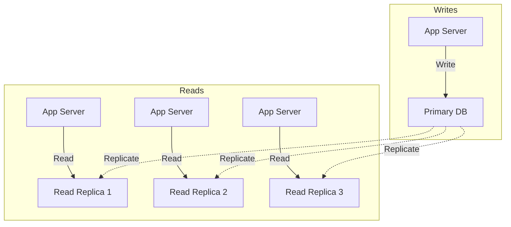
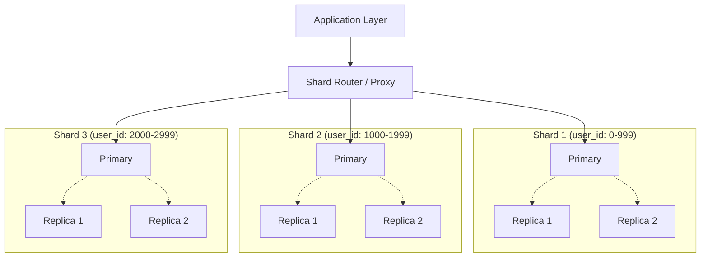
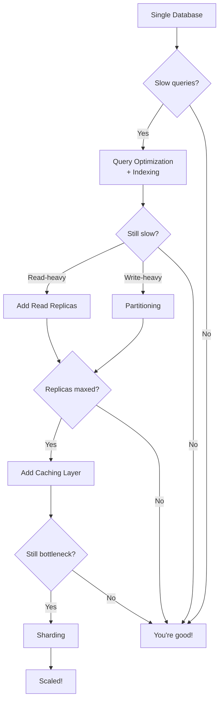

# Database Scaling & Optimization - Từ Query Tuning Đến Sharding

Trong hầu hết các hệ thống, database là **bottleneck lớn nhất**.

Application server scale horizontal dễ dàng - thêm server, add load balancer, done. Nhưng database? Đây là hard problem.

**Tại sao?**

Database là **stateful**. Không thể đơn giản thêm database server và expect nó tự động work. Data phải sync, transactions phải consistent, queries phải coordinate.

Khi database chậm, toàn bộ hệ thống chậm. Khi database down, toàn bộ hệ thống down.

**Mental model quan trọng nhất:**

**Database scaling không phải một giải pháp. Là progression từ optimization đơn giản → complex distributed patterns.**

Lesson này dạy bạn:
- Query optimization & indexing (first line of defense)
- Read replicas (scale reads)
- Sharding (scale writes & storage)
- Khi nào dùng technique nào
- Trade-offs của từng approach

## Tại Sao Database Là Bottleneck?

Trước khi học scaling, hiểu tại sao database limit performance.

### 1. Disk I/O Bottleneck

**Database lưu data trên disk. Disk chậm hơn RAM 1000x.**
```
RAM read:  ~100 nanoseconds
SSD read:  ~100 microseconds (1000x chậm hơn)
HDD read:  ~10 milliseconds (100,000x chậm hơn)
```

**Every query = disk reads.**

Query càng phức tạp → càng nhiều disk I/O → càng chậm.

### 2. ACID Guarantees

**Database phải maintain consistency.**

- **Atomicity:** Transaction all-or-nothing
- **Consistency:** Data valid theo constraints
- **Isolation:** Concurrent transactions không conflict
- **Durability:** Committed data không mất

**ACID có cost:**
- Locking (block concurrent access)
- Write-ahead log (extra writes)
- Transaction coordination (overhead)

**Trade-off:** Correctness vs performance.

### 3. Single Writer Problem

**Hầu hết RDBMS có single-writer architecture.**

Chỉ 1 node handle writes để maintain consistency.

Reads có thể scale (replicas), nhưng writes là bottleneck.

### 4. Data Growth

**Data tăng → performance giảm.**
```
Table 1K rows:   Query 10ms
Table 100K rows: Query 50ms
Table 10M rows:  Query 5000ms
```

Không có proper indexing, queries slow down exponentially.

**Key insight:** Phải optimize trước khi scale. Scaling costly system vẫn costly.

## Index Strategy - First Line Of Defense

**Index là data structure giúp database tìm data nhanh hơn.**

Không có index = full table scan (đọc toàn bộ rows).  
Có index = direct lookup (như book index).

### B-Tree Index (Default)

**Most common index type.**
```sql
CREATE INDEX idx_users_email ON users(email);
```

**Structure:**
```
         [M]
       /     \
    [D]       [T]
   /   \     /   \
[A-C] [E-L] [N-S] [U-Z]
```

**Lookup time:** O(log N) - cực nhanh với large datasets.

**Khi nào dùng:**
- Columns trong WHERE clause
- JOIN keys
- ORDER BY columns
- Foreign keys

### Composite Index

**Index trên multiple columns.**
```sql
CREATE INDEX idx_orders_user_date 
ON orders(user_id, created_at);
```

**Hiệu quả cho:**
```sql
-- Uses index (leftmost column)
WHERE user_id = 123

-- Uses full index
WHERE user_id = 123 AND created_at > '2025-01-01'

-- Không dùng index (missing leftmost column)
WHERE created_at > '2025-01-01'
```

**Rule: Index matching từ trái sang phải.**

### Covering Index

**Index chứa tất cả columns query cần.**
```sql
-- Query này
SELECT user_id, created_at, total 
FROM orders 
WHERE user_id = 123;

-- Covering index
CREATE INDEX idx_orders_covering 
ON orders(user_id, created_at, total);
```

**Benefit:** Database không cần access table, chỉ read index → cực nhanh.

### Partial Index

**Index subset of rows.**
```sql
-- Chỉ index active users
CREATE INDEX idx_active_users 
ON users(email) 
WHERE status = 'active';
```

**Smaller index → faster lookups, less storage.**

### Index Trade-offs

**Too Many Indexes:**
- Slow writes (update all indexes)
- Storage overhead
- Query planner confusion

**Too Few Indexes:**
- Slow reads (full table scans)

**Balance:** Index high-traffic queries, monitor usage.
```sql
-- PostgreSQL: Find unused indexes
SELECT schemaname, tablename, indexname
FROM pg_stat_user_indexes
WHERE idx_scan = 0;
```

## Query Optimization - Make Queries Faster

Kể cả có index, bad queries vẫn chậm.

### EXPLAIN ANALYZE - Your Best Friend

**See query execution plan.**
```sql
EXPLAIN ANALYZE
SELECT * FROM orders 
WHERE user_id = 123 
ORDER BY created_at DESC 
LIMIT 10;
```

**Output:**
```
Limit  (cost=0.42..8.44 rows=10)
  -> Index Scan using idx_orders_user_date on orders
     Index Cond: (user_id = 123)
     Rows Removed by Filter: 0
Planning Time: 0.123 ms
Execution Time: 0.456 ms
```

**Look for:**
- **Seq Scan** (table scan) → add index
- **High cost** → optimize query
- **Rows removed by filter** → improve WHERE clause

### SELECT * Is Evil

**Bad:**
```sql
SELECT * FROM users WHERE id = 123;
```

Fetches tất cả columns (có thể 50 columns, nhiều KB data).

**Good:**
```sql
SELECT id, name, email FROM users WHERE id = 123;
```

Chỉ fetch columns cần thiết.

**Impact:**
- Less disk I/O
- Less network transfer
- Better cache utilization

### Avoid OR In WHERE Clause

**Bad:**
```sql
SELECT * FROM users 
WHERE email = 'test@example.com' 
   OR username = 'testuser';
```

Database phải scan 2 indexes hoặc full table scan.

**Good:**
```sql
SELECT * FROM users WHERE email = 'test@example.com'
UNION
SELECT * FROM users WHERE username = 'testuser';
```

2 separate index scans, then merge.

### Use LIMIT

**Bad:**
```sql
SELECT * FROM orders ORDER BY created_at DESC;
```

Fetch millions of rows, sort tất cả.

**Good:**
```sql
SELECT * FROM orders 
ORDER BY created_at DESC 
LIMIT 20;
```

Stop after 20 rows, không sort toàn bộ.

### Avoid Functions In WHERE

**Bad:**
```sql
WHERE YEAR(created_at) = 2025
```

Cannot use index (function applied to column).

**Good:**
```sql
WHERE created_at >= '2025-01-01' 
  AND created_at < '2026-01-01'
```

Index có thể dùng được.

## N+1 Problem - Silent Performance Killer

**N+1 là một trong những bugs phổ biến và nguy hiểm nhất.**

### Problem
```python
# Fetch 10 users (1 query)
users = db.query("SELECT * FROM users LIMIT 10")

# For each user, fetch orders (10 queries)
for user in users:
    orders = db.query("SELECT * FROM orders WHERE user_id = ?", user.id)
    print(f"{user.name}: {len(orders)} orders")
```

**Total: 1 + 10 = 11 queries.**

Với 100 users → 101 queries.  
Với 1000 users → 1001 queries.

**Mỗi query có latency 10ms → 1001 queries = 10 seconds!**

### Solution 1: Eager Loading
```python
# Single query with JOIN
query = """
SELECT u.*, o.id as order_id, o.total
FROM users u
LEFT JOIN orders o ON u.id = o.user_id
LIMIT 10
"""

results = db.query(query)
```

**1 query thay vì N+1.**

### Solution 2: Batch Loading
```python
# Fetch users
users = db.query("SELECT * FROM users LIMIT 10")
user_ids = [u.id for u in users]

# Batch fetch all orders
orders = db.query(
    "SELECT * FROM orders WHERE user_id IN (?)",
    user_ids
)

# Group orders by user
orders_by_user = defaultdict(list)
for order in orders:
    orders_by_user[order.user_id].append(order)
```

**2 queries total.**

### Framework Solutions

**Rails:**
```ruby
User.includes(:orders).limit(10)
```

**Django:**
```python
User.objects.prefetch_related('orders')[:10]
```

**TypeORM:**
```typescript
userRepository.find({ relations: ['orders'], take: 10 })
```

**Always check generated SQL để avoid N+1.**

## Denormalization - Trading Consistency For Performance

**Normalization = avoid data duplication.**  
**Denormalization = intentionally duplicate data for performance.**

### Example: Order Totals

**Normalized (slow):**
```sql
-- Calculate total mỗi lần query
SELECT o.id, SUM(oi.price * oi.quantity) as total
FROM orders o
JOIN order_items oi ON o.id = oi.order_id
GROUP BY o.id;
```

Expensive aggregation mỗi request.

**Denormalized (fast):**
```sql
-- Store pre-computed total
ALTER TABLE orders ADD COLUMN total DECIMAL(10,2);

-- Update when order items change
UPDATE orders SET total = ? WHERE id = ?;

-- Query simple
SELECT id, total FROM orders;
```

**Trade-off:** Extra storage + update complexity để lấy read performance.

### When To Denormalize

**Denormalize khi:**
- Aggregations expensive
- Data ít thay đổi
- Read-heavy workload

**Không denormalize khi:**
- Data thay đổi thường xuyên
- Synchronization phức tạp
- Strong consistency required

### Materialized Views

**Database-level denormalization.**
```sql
-- PostgreSQL
CREATE MATERIALIZED VIEW user_stats AS
SELECT 
    user_id,
    COUNT(*) as order_count,
    SUM(total) as total_spent
FROM orders
GROUP BY user_id;

-- Refresh periodically
REFRESH MATERIALIZED VIEW user_stats;
```

Pre-computed results, query nhanh.

## Read Replicas - Scale Reads Horizontally

**Read replica = copy of primary database, handle read traffic.**


### How It Works

**1. Primary database handle writes**
- All INSERT, UPDATE, DELETE → primary

**2. Changes replicate to replicas**
- Async replication (usually)
- Binary log shipping (MySQL) hoặc WAL shipping (PostgreSQL)

**3. Replicas handle reads**
- SELECT queries → replicas
- Distribute load across multiple replicas

### Benefits

**Scale read traffic:**
- Add replicas as read traffic grows
- Primary không bị overwhelm

**Geographic distribution:**
- Replica ở Singapore cho Asia users
- Replica ở US cho US users
- Lower latency

**Analytics queries:**
- Run expensive reports trên replica
- Không impact production traffic

### Replication Lag

**Problem: Replicas không instantly up-to-date.**
```
t=0: Write to primary (user.status = 'active')
t=1: Read from replica (user.status = 'pending')  ← stale!
t=2: Replication catches up (user.status = 'active')
```

**Typical lag: 10-100ms, có thể cao hơn.**

### Handling Replication Lag

**1. Read-after-write consistency**
```python
def update_profile(user_id, data):
    # Write to primary
    db_primary.execute("UPDATE users SET ... WHERE id = ?", user_id)
    
    # Read from primary (not replica)
    return db_primary.query("SELECT * FROM users WHERE id = ?", user_id)
```

**2. Session stickiness**
- User session luôn read từ same replica
- Consistent experience

**3. Critical reads from primary**
```python
# Payment - critical
balance = db_primary.query("SELECT balance FROM accounts")

# Profile view - không critical
profile = db_replica.query("SELECT * FROM users")
```

### Replication Types

**Asynchronous (default):**
- Primary không đợi replica confirm
- Fast writes
- Risk: replica lag, potential data loss

**Synchronous:**
- Primary đợi ít nhất 1 replica confirm
- Slower writes
- Strong consistency

**Semi-synchronous:**
- Đợi 1 replica, others async
- Balance performance + durability

## Sharding - Scale Writes & Storage

**Sharding = chia database thành multiple databases, mỗi database chứa subset of data.**

Đây là ultimate scaling solution, nhưng cũng phức tạp nhất.

### Why Sharding?

**Read replicas chỉ scale reads. Writes vẫn bottleneck ở primary.**

**Sharding scale cả reads và writes:**
- Write traffic distribute across shards
- Storage distribute across shards
- Each shard nhỏ hơn → faster queries

### Sharding Strategies

#### 1. Range-Based Sharding

**Chia data theo range of values.**
```
Shard 1: user_id 1-1000000
Shard 2: user_id 1000001-2000000
Shard 3: user_id 2000001-3000000
```
```python
def get_shard(user_id):
    if user_id <= 1000000:
        return shard_1
    elif user_id <= 2000000:
        return shard_2
    else:
        return shard_3
```

**Pros:**
- Simple logic
- Range queries efficient

**Cons:**
- Uneven distribution (hotspots)
- Hard to rebalance

#### 2. Hash-Based Sharding

**Hash key để determine shard.**
```python
def get_shard(user_id):
    shard_num = hash(user_id) % num_shards
    return shards[shard_num]
```

**Pros:**
- Even distribution
- No hotspots

**Cons:**
- Range queries phải query all shards
- Adding shards = re-hash (complex)

#### 3. Geographic Sharding

**Chia theo location.**
```
Shard 1: Asia users
Shard 2: US users
Shard 3: EU users
```

**Pros:**
- Low latency (data gần users)
- Compliance (data residency laws)

**Cons:**
- Uneven load
- Cross-region queries expensive

#### 4. Entity-Based Sharding (Practical)

**Chia theo business entity.**
```
Shard 1: Organization A's data
Shard 2: Organization B's data
Shard 3: Organization C's data
```

**Best for multi-tenant applications.**

### Sharding Challenges

**1. Cross-shard queries**
```sql
-- Query users across all shards
SELECT * FROM users WHERE created_at > '2025-01-01'
```

Phải query tất cả shards → aggregate results → slow.

**Solution:** Avoid cross-shard queries bằng cách design shard key cẩn thận.

**2. Cross-shard transactions**
```sql
-- Transfer between users on different shards
BEGIN TRANSACTION;
  UPDATE accounts SET balance = balance - 100 WHERE user_id = 123; -- Shard 1
  UPDATE accounts SET balance = balance + 100 WHERE user_id = 456; -- Shard 2
COMMIT;
```

**Distributed transaction phức tạp.** Thường avoid bằng cách:
- Eventual consistency
- Saga pattern
- Compensating transactions

**3. Rebalancing**

Data grow không đều → một shard đầy trước.

**Rebalancing = move data giữa shards.**

Phức tạp, downtime risk, cần planning cẩn thận.

**4. Joins**
```sql
-- Join users + orders across shards
SELECT u.name, o.total
FROM users u
JOIN orders o ON u.id = o.user_id
```

**Users ở shard A, orders ở shard B → không thể join.**

**Solution:**
- Denormalize data
- Application-level joins
- Design schema để avoid cross-shard joins

### Sharding Architecture Example


**Shard router** quyết định query đi đến shard nào dựa trên shard key.

### When To Shard

**Shard khi:**
- Write throughput vượt quá single database
- Storage vượt quá single server capacity
- Đã optimize queries, indexes, read replicas
- Business justifies complexity

**Chưa nên shard khi:**
- Single database đủ handle traffic
- Chưa optimize queries
- Chưa dùng read replicas
- Team chưa có expertise

**Rule of thumb:** Sharding là last resort. Exhaust simpler solutions trước.

## Partitioning - Logical Sharding Within Single Database

**Partitioning = chia table thành multiple physical partitions, nhưng vẫn 1 logical table.**

Similar sharding, nhưng database-managed, không phải application.

### Types Of Partitioning

#### Range Partitioning
```sql
-- PostgreSQL
CREATE TABLE orders (
    id BIGINT,
    user_id BIGINT,
    created_at TIMESTAMP
) PARTITION BY RANGE (created_at);

CREATE TABLE orders_2024 
PARTITION OF orders 
FOR VALUES FROM ('2024-01-01') TO ('2025-01-01');

CREATE TABLE orders_2025 
PARTITION OF orders 
FOR VALUES FROM ('2025-01-01') TO ('2026-01-01');
```

**Query automatically routed đến correct partition.**
```sql
-- Chỉ scan orders_2025 partition
SELECT * FROM orders 
WHERE created_at >= '2025-02-01';
```

#### Hash Partitioning
```sql
CREATE TABLE users (
    id BIGINT,
    name VARCHAR(100)
) PARTITION BY HASH (id);

CREATE TABLE users_p0 PARTITION OF users 
FOR VALUES WITH (MODULUS 4, REMAINDER 0);

CREATE TABLE users_p1 PARTITION OF users 
FOR VALUES WITH (MODULUS 4, REMAINDER 1);
-- ... p2, p3
```

**Even distribution across partitions.**

#### List Partitioning
```sql
CREATE TABLE orders (
    country VARCHAR(2)
) PARTITION BY LIST (country);

CREATE TABLE orders_us PARTITION OF orders 
FOR VALUES IN ('US');

CREATE TABLE orders_eu PARTITION OF orders 
FOR VALUES IN ('DE', 'FR', 'UK');
```

### Benefits Of Partitioning

**1. Query performance**
- Partition pruning: chỉ scan relevant partitions
- Smaller indexes per partition

**2. Maintenance**
- Drop old partitions thay vì DELETE (fast)
- Vacuum/analyze per partition

**3. Archival**
- Move old partitions to slower storage

### Partitioning vs Sharding

| Aspect | Partitioning | Sharding |
|--------|-------------|----------|
| Scope | Single database | Multiple databases |
| Complexity | Low | High |
| Scale | Limited | Unlimited |
| Management | Database-managed | Application-managed |
| Transactions | Easy | Hard (distributed) |

**Partitioning = simpler sharding for single database.**

## Database Scaling Progression

**Không nhảy thẳng vào sharding. Follow progression:**


**Mỗi step tăng complexity. Chỉ advance khi necessary.**

## Practical Recommendations

### 1. Measure First

**Don't guess. Measure.**
```sql
-- Slow query log
SET global slow_query_log = 'ON';
SET global long_query_time = 1; -- queries > 1s

-- Monitor metrics
- Query latency (p50, p95, p99)
- Queries per second
- Connection pool usage
- Disk I/O
- CPU usage
```

### 2. Low-Hanging Fruit First

**Before sharding:**
1. Add missing indexes
2. Optimize queries
3. Add read replicas
4. Add caching
5. Partition tables

**Sharding chỉ khi exhausted simpler options.**

### 3. Design For Your Read/Write Ratio

**Read-heavy (90% reads):**
- Read replicas + caching = giải quyết most problems
- Primary chỉ handle 10% writes

**Write-heavy (50%+ writes):**
- Partitioning → sharding
- Async writes với queue
- Eventual consistency

### 4. Connection Pooling

**Database connections expensive.**
```python
# Bad: New connection mỗi query
def get_user(id):
    conn = create_connection()
    user = conn.query(...)
    conn.close()

# Good: Connection pool
pool = ConnectionPool(max_connections=20)

def get_user(id):
    with pool.get_connection() as conn:
        user = conn.query(...)
```

**Reuse connections, reduce overhead.**

### 5. Database-Specific Tuning

**PostgreSQL:**
```sql
-- Increase shared buffers
shared_buffers = 4GB

-- Work mem for sorting
work_mem = 256MB

-- Effective cache size
effective_cache_size = 12GB
```

**MySQL:**
```sql
-- InnoDB buffer pool
innodb_buffer_pool_size = 8GB

-- Query cache
query_cache_size = 256MB
```

**Tune based on workload + hardware.**

## Mental Model: Database Thường Là Bottleneck Lớn Nhất

**Core insight:**

**Application servers stateless → scale easy.**  
**Database stateful → scale hard.**
```
Add API server:     1 command, 5 minutes
Add database shard: Weeks of planning + implementation
```

**Architect priorities:**

1. **Reduce database load:**
   - Caching (90% cache hit = 10x less DB queries)
   - Async processing (writes → queue)
   - CDN (static content)

2. **Optimize queries:**
   - Proper indexes
   - Avoid N+1
   - EXPLAIN ANALYZE everything

3. **Scale reads:**
   - Read replicas
   - Geographic distribution

4. **Last resort - scale writes:**
   - Partitioning
   - Sharding

**Great architects minimize database pressure, không rush vào complex scaling.**

## Key Takeaways

**1. Database là bottleneck lớn nhất trong most systems**

Stateful, ACID guarantees, disk I/O limits.

**2. Index strategy = first line of defense**

Proper indexes có thể improve performance 100x-1000x.

**3. Query optimization trước khi scaling**

Bad queries trên scaled system vẫn bad. Optimize trước.

**4. N+1 problem = silent killer**

1000 queries thay vì 2. Always check generated SQL.

**5. Denormalization = trade consistency for speed**

Pre-compute expensive aggregations. Material views useful.

**6. Read replicas scale reads horizontally**

Add replicas as traffic grows. Handle replication lag properly.

**7. Sharding = scale writes + storage, nhưng phức tạp**

Cross-shard queries, transactions hard. Last resort.

**8. Partitioning = simpler alternative to sharding**

Database-managed, single server, good for most use cases.

**9. Follow progression: optimize → replicas → partition → shard**

Don't jump to sharding. Exhaust simpler solutions.

**10. Measure, don't guess**

Slow query log, monitoring metrics, EXPLAIN ANALYZE.

---

**Remember: The best database scaling strategy is to need less database. Cache aggressively, optimize queries, and only scale when you've exhausted simpler options.**