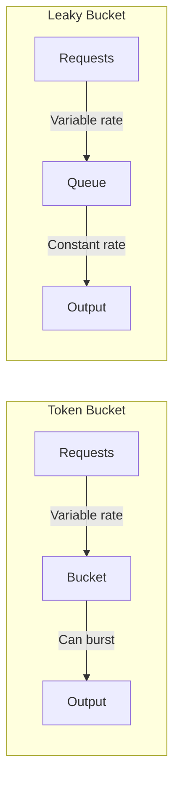
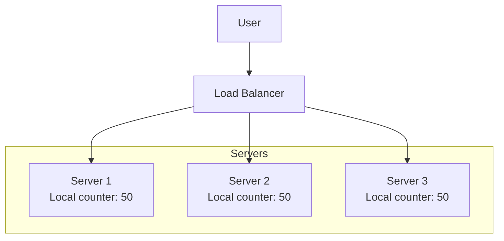
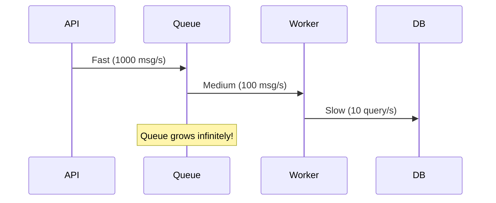
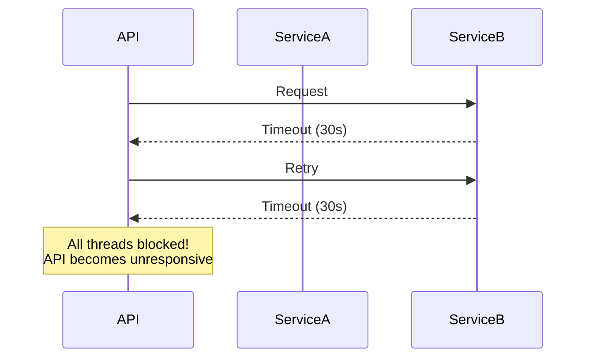
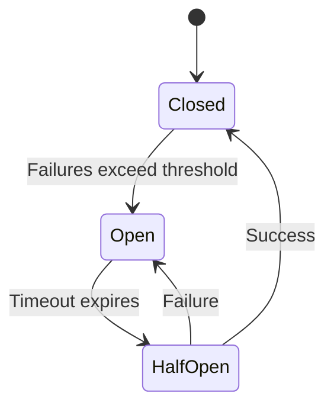
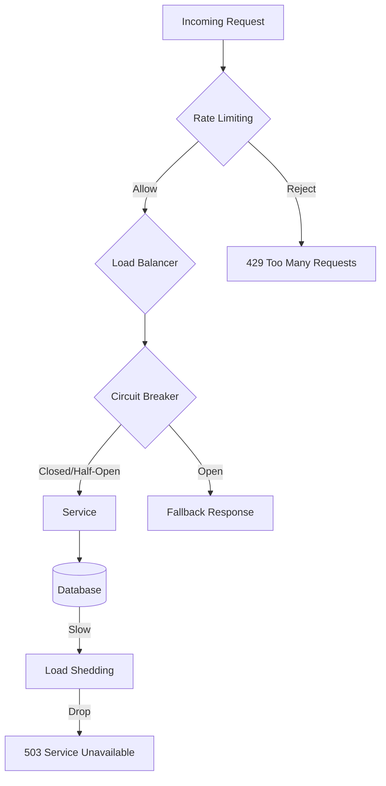

# Rate Limiting & Load Control - Protect System Khỏi Overload

Bạn build một API hoàn hảo. Code clean, database optimized, infrastructure solid.

Rồi một ngày, traffic spike 10x bất ngờ. Có thể là:
- Viral post trên social media
- Bot attack
- Bug ở client (infinite retry loop)
- Flash sale trong e-commerce

**Hệ thống collapse. Database overwhelm. Servers crash. Toàn bộ service down.**

Không phải vì architecture tồi. Là vì **không có protection mechanisms.**

**Mental model quan trọng:** System phải biết protect itself. Không thể tin rằng traffic sẽ luôn reasonable.

Lesson này dạy bạn:
- Rate limiting algorithms (token bucket, leaky bucket)
- Distributed rate limiting
- Backpressure & load shedding
- Circuit breaker pattern
- Khi nào dùng technique nào

## Tại Sao Cần Rate Limiting?

### Problem 1: Resource Exhaustion

**Mọi system có giới hạn.**
```
Database: 1000 connections
API server: 10,000 concurrent requests
Network: 1 Gbps bandwidth
```

**Vượt quá giới hạn → system crash.**

Without rate limiting, một client có thể consume toàn bộ resources.

### Problem 2: Cost Control

**Cloud services charge theo usage.**
```
API Gateway: $3.50 per million requests
Lambda: $0.20 per million invocations
Database: $0.10 per GB transfer
```

**Uncontrolled traffic = unlimited cost.**

Bot attack có thể generate hàng triệu requests → bill $10,000 trong 1 ngày.

### Problem 3: Abuse & Security

**Attackers exploit systems:**
- Brute force login (thử hàng nghìn passwords)
- Scraping data (crawl toàn bộ database)
- DDoS (overwhelm với junk traffic)

**Rate limiting = first line of defense.**

### Problem 4: Fair Usage

**Một user không nên monopolize resources.**

Trong multi-tenant system, 1 customer spam requests → impact tất cả customers.

**Rate limiting đảm bảo fairness.**

### Use Cases

**API quotas:**
- Free tier: 1000 requests/day
- Pro tier: 100,000 requests/day

**Login attempts:**
- 5 failed attempts → lock account 15 minutes

**Search queries:**
- 10 searches/minute per user

**File uploads:**
- 100 MB/hour per user

## Rate Limiting Algorithms

Có nhiều algorithms, mỗi cái phù hợp với use case khác nhau.

### 1. Fixed Window Counter

**Simplest algorithm.**
```python
import time

class FixedWindowRateLimiter:
    def __init__(self, limit, window_seconds):
        self.limit = limit
        self.window = window_seconds
        self.counter = 0
        self.window_start = time.time()
    
    def allow_request(self):
        now = time.time()
        
        # New window
        if now - self.window_start >= self.window:
            self.counter = 0
            self.window_start = now
        
        # Check limit
        if self.counter < self.limit:
            self.counter += 1
            return True
        
        return False
```

**Example:**
```
Window: 1 minute
Limit: 100 requests

00:00-00:59: 100 requests ✅
01:00-01:59: Reset counter, 100 requests ✅
```

**Problem: Window boundary issue**
```
00:59: 100 requests (max out)
01:00: Reset
01:01: 100 requests

Total 200 requests trong 2 seconds! ⚠️
```

**Burst traffic ở window boundary bypass limit.**

### 2. Sliding Window Log

**Track timestamp của mỗi request.**
```python
from collections import deque
import time

class SlidingWindowLog:
    def __init__(self, limit, window_seconds):
        self.limit = limit
        self.window = window_seconds
        self.log = deque()
    
    def allow_request(self):
        now = time.time()
        
        # Remove old requests outside window
        while self.log and self.log[0] <= now - self.window:
            self.log.popleft()
        
        # Check limit
        if len(self.log) < self.limit:
            self.log.append(now)
            return True
        
        return False
```

**Example:**
```
Window: 60 seconds
Limit: 100 requests

Request at 10:00:30
→ Count requests từ 09:59:30 đến 10:00:30
→ If < 100, allow
```

**Pros:**
- Accurate (no window boundary issue)
- Smooth rate limiting

**Cons:**
- Memory intensive (store all timestamps)
- O(N) lookup time

### 3. Sliding Window Counter (Hybrid)

**Combine fixed window + sliding calculation.**
```python
import time

class SlidingWindowCounter:
    def __init__(self, limit, window_seconds):
        self.limit = limit
        self.window = window_seconds
        self.current_window = {"start": time.time(), "count": 0}
        self.prev_window_count = 0
    
    def allow_request(self):
        now = time.time()
        
        # Calculate sliding count
        elapsed = now - self.current_window["start"]
        
        if elapsed >= self.window:
            # New window
            self.prev_window_count = self.current_window["count"]
            self.current_window = {"start": now, "count": 0}
            elapsed = 0
        
        # Weighted count from previous window
        prev_weight = (self.window - elapsed) / self.window
        estimated_count = (
            self.prev_window_count * prev_weight +
            self.current_window["count"]
        )
        
        if estimated_count < self.limit:
            self.current_window["count"] += 1
            return True
        
        return False
```

**Smooths out fixed window spikes với O(1) memory.**

### 4. Token Bucket (MOST POPULAR)

**Bucket chứa tokens. Mỗi request consume 1 token.**
```python
import time

class TokenBucket:
    def __init__(self, capacity, refill_rate):
        self.capacity = capacity        # Max tokens
        self.tokens = capacity           # Current tokens
        self.refill_rate = refill_rate   # Tokens per second
        self.last_refill = time.time()
    
    def allow_request(self, tokens_needed=1):
        now = time.time()
        
        # Refill tokens
        elapsed = now - self.last_refill
        tokens_to_add = elapsed * self.refill_rate
        self.tokens = min(self.capacity, self.tokens + tokens_to_add)
        self.last_refill = now
        
        # Check if enough tokens
        if self.tokens >= tokens_needed:
            self.tokens -= tokens_needed
            return True
        
        return False
```

**Example:**
```
Capacity: 100 tokens
Refill rate: 10 tokens/second

Start: 100 tokens
Request 1: 99 tokens (allow)
Request 2: 98 tokens (allow)
... (100 requests)
Request 101: 0 tokens (reject) ❌

Wait 1 second: +10 tokens
Request 102: 9 tokens (allow) ✅
```

**Pros:**
- Allow bursts (lợi dụng accumulated tokens)
- Smooth long-term rate
- Simple implementation

**Cons:**
- Bursts có thể overwhelm downstream

**Used by:** AWS API Gateway, Kong, Nginx.

### 5. Leaky Bucket

**Bucket leak tokens at constant rate.**
```python
import time
from collections import deque

class LeakyBucket:
    def __init__(self, capacity, leak_rate):
        self.capacity = capacity      # Max queue size
        self.leak_rate = leak_rate    # Requests processed per second
        self.queue = deque()
        self.last_leak = time.time()
    
    def allow_request(self):
        now = time.time()
        
        # Leak (process) requests
        elapsed = now - self.last_leak
        leaks = int(elapsed * self.leak_rate)
        
        for _ in range(min(leaks, len(self.queue))):
            self.queue.popleft()
        
        self.last_leak = now
        
        # Add request to queue
        if len(self.queue) < self.capacity:
            self.queue.append(now)
            return True
        
        return False
```

**Difference từ Token Bucket:**

**Token Bucket:** Bursty output (có thể send nhiều requests cùng lúc nếu có tokens)  
**Leaky Bucket:** Smooth output (constant rate, không có bursts)


**Token Bucket = rate limit input.**  
**Leaky Bucket = rate limit output.**

### Algorithm Comparison

| Algorithm | Memory | Accuracy | Bursts | Use Case |
|-----------|--------|----------|--------|----------|
| Fixed Window | O(1) | Low | Yes | Simple quotas |
| Sliding Log | O(N) | High | No | Precise limiting |
| Sliding Counter | O(1) | Medium | No | Good balance |
| Token Bucket | O(1) | Good | Yes | Most APIs |
| Leaky Bucket | O(N) | Good | No | Traffic shaping |

**Token Bucket = most popular vì balance simplicity + effectiveness.**

## Distributed Rate Limiting

**Problem:** Multiple API servers, làm sao sync rate limits?


**Limit: 100 req/min per user.**

Nếu mỗi server track riêng → user có thể send 50 requests đến mỗi server = 150 total! ⚠️

### Solution 1: Centralized State (Redis)

**Store counters trong shared Redis.**
```python
import redis
import time

class DistributedRateLimiter:
    def __init__(self, redis_client, limit, window):
        self.redis = redis_client
        self.limit = limit
        self.window = window
    
    def allow_request(self, user_id):
        key = f"rate_limit:{user_id}"
        current = self.redis.get(key)
        
        if current is None:
            # First request
            self.redis.setex(key, self.window, 1)
            return True
        
        if int(current) < self.limit:
            self.redis.incr(key)
            return True
        
        return False
```

**Token bucket in Redis:**
```python
def allow_request_token_bucket(self, user_id):
    key = f"token_bucket:{user_id}"
    now = time.time()
    
    # Lua script for atomic operation
    lua_script = """
    local key = KEYS[1]
    local capacity = tonumber(ARGV[1])
    local refill_rate = tonumber(ARGV[2])
    local now = tonumber(ARGV[3])
    
    local bucket = redis.call('HMGET', key, 'tokens', 'last_refill')
    local tokens = tonumber(bucket[1]) or capacity
    local last_refill = tonumber(bucket[2]) or now
    
    -- Refill tokens
    local elapsed = now - last_refill
    tokens = math.min(capacity, tokens + elapsed * refill_rate)
    
    if tokens >= 1 then
        tokens = tokens - 1
        redis.call('HMSET', key, 'tokens', tokens, 'last_refill', now)
        redis.call('EXPIRE', key, 3600)
        return 1
    else
        return 0
    end
    """
    
    return self.redis.eval(lua_script, 1, key, 
                          self.capacity, self.refill_rate, now)
```

**Pros:**
- Accurate cross-server
- Centralized logic

**Cons:**
- Redis single point of failure
- Network latency per request
- Redis can be bottleneck

### Solution 2: Eventually Consistent (Gossip)

**Mỗi server maintain local state, sync periodically.**
```python
class EventuallyConsistentRateLimiter:
    def __init__(self, limit, num_servers):
        self.limit = limit
        self.local_limit = limit // num_servers  # Divide among servers
        self.local_counter = 0
        self.global_counters = {}  # From other servers
    
    def allow_request(self, user_id):
        # Check local limit first
        if self.local_counter < self.local_limit:
            self.local_counter += 1
            return True
        
        # Check global limit (eventual)
        total = sum(self.global_counters.values()) + self.local_counter
        return total < self.limit
    
    def sync_with_peers(self):
        # Gossip protocol: exchange counters with other servers
        pass
```

**Pros:**
- No single point of failure
- Low latency (local check)

**Cons:**
- Not accurate (eventual consistency)
- Complex implementation

### Hybrid Approach (Practical)

**Local cache + Redis.**
```python
class HybridRateLimiter:
    def __init__(self, redis_client, limit, window):
        self.redis = redis_client
        self.limit = limit
        self.window = window
        self.local_cache = {}
        self.cache_ttl = 1  # 1 second cache
    
    def allow_request(self, user_id):
        # Check local cache first
        cache_entry = self.local_cache.get(user_id)
        now = time.time()
        
        if cache_entry and now - cache_entry['time'] < self.cache_ttl:
            if cache_entry['count'] < self.limit:
                cache_entry['count'] += 1
                return True
            return False
        
        # Cache miss or expired - check Redis
        key = f"rate_limit:{user_id}"
        current = self.redis.get(key)
        
        if current is None or int(current) < self.limit:
            count = self.redis.incr(key)
            self.redis.expire(key, self.window)
            
            # Update local cache
            self.local_cache[user_id] = {
                'count': count,
                'time': now
            }
            return True
        
        return False
```

**Balance accuracy + performance.**

## Rate Limiting Response Headers

**Clients cần biết rate limit status.**

**Standard headers:**
```http
HTTP/1.1 200 OK
X-RateLimit-Limit: 1000           # Total limit
X-RateLimit-Remaining: 950        # Requests remaining
X-RateLimit-Reset: 1643990400     # Unix timestamp when resets

HTTP/1.1 429 Too Many Requests
Retry-After: 60                   # Seconds until retry
X-RateLimit-Limit: 1000
X-RateLimit-Remaining: 0
X-RateLimit-Reset: 1643990400
```

**Clients có thể:**
- Display quota to users
- Implement exponential backoff
- Schedule requests efficiently

## Backpressure - Push Back On Upstream

**Rate limiting protect system từ external traffic. Backpressure protect từ internal overload.**

### The Problem


**Producer nhanh hơn consumer → queue explode.**

### Solution: Backpressure

**Slow down producer khi consumer overwhelmed.**
```python
class BackpressureQueue:
    def __init__(self, max_size):
        self.queue = []
        self.max_size = max_size
    
    def push(self, item):
        if len(self.queue) >= self.max_size:
            # Backpressure: Block or reject
            raise QueueFullError("Queue full, slow down!")
        
        self.queue.append(item)
    
    def pop(self):
        if self.queue:
            return self.queue.pop(0)
        return None
```

**API checks queue size:**
```python
@app.route('/api/task', methods=['POST'])
def create_task():
    try:
        queue.push(request.data)
        return {"status": "queued"}, 202
    except QueueFullError:
        return {"error": "System overloaded, try later"}, 503
```

**503 Service Unavailable = backpressure signal.**

### Reactive Streams Backpressure

**Modern approach: request-based pull.**
```python
class ReactiveStream:
    def __init__(self, producer, consumer):
        self.producer = producer
        self.consumer = consumer
        self.buffer = []
        self.requested = 0
    
    def request(self, n):
        # Consumer requests n items
        self.requested += n
        self.try_send()
    
    def try_send(self):
        while self.requested > 0 and self.buffer:
            item = self.buffer.pop(0)
            self.consumer.on_next(item)
            self.requested -= 1
    
    def on_data(self, item):
        # Producer sends data
        if self.requested > 0:
            self.consumer.on_next(item)
            self.requested -= 1
        else:
            # Buffer or drop
            if len(self.buffer) < MAX_BUFFER:
                self.buffer.append(item)
            else:
                self.consumer.on_error("Backpressure limit")
```

**Consumer pulls data at its pace, not pushed.**

## Load Shedding - Drop Traffic To Survive

**Khi hệ thống quá tải, reject requests để protect core functionality.**

### Priority-Based Shedding

**Not all requests equal importance.**
```python
class LoadShedder:
    def __init__(self, max_load):
        self.max_load = max_load
        self.current_load = 0
    
    def allow_request(self, priority):
        if self.current_load < self.max_load:
            return True
        
        # Overload: only allow high priority
        if priority == "critical":
            return True
        elif priority == "high" and self.current_load < self.max_load * 1.1:
            return True
        else:
            return False
```

**Example priorities:**
```python
# Critical: payment, checkout
if allow_request("critical"):
    process_payment()

# High: user profile update  
if allow_request("high"):
    update_profile()

# Low: analytics, logging
if allow_request("low"):
    track_analytics()
```

**Shed low-priority traffic first.**

### Adaptive Shedding

**Shed based on system health metrics.**
```python
class AdaptiveLoadShedder:
    def __init__(self):
        self.error_rate = 0.0
        self.latency_p99 = 0.0
    
    def should_shed_load(self):
        # Shed if error rate high
        if self.error_rate > 0.05:  # 5% errors
            return True
        
        # Shed if latency high
        if self.latency_p99 > 1000:  # 1 second
            return True
        
        # Shed if CPU high
        cpu_usage = psutil.cpu_percent()
        if cpu_usage > 90:
            return True
        
        return False
    
    def calculate_shed_probability(self):
        # Progressive shedding
        if self.error_rate < 0.01:
            return 0.0  # No shedding
        elif self.error_rate < 0.05:
            return 0.5  # Shed 50%
        else:
            return 0.9  # Shed 90%
```

**Gradual degradation thay vì hard cutoff.**

## Circuit Breaker - Stop Calling Failing Services

**Pattern để prevent cascading failures.**

### The Problem


**Service B down → API keep trying → API down too.**

### Circuit Breaker States


**States:**

**Closed (Normal):**
- Requests pass through
- Track failures

**Open (Failed):**
- Reject requests immediately (fail fast)
- Don't call failing service
- Return cached data or error

**Half-Open (Testing):**
- Allow limited requests
- Test if service recovered
- Close if success, open if fail

### Implementation
```python
import time
from enum import Enum

class CircuitState(Enum):
    CLOSED = "closed"
    OPEN = "open"
    HALF_OPEN = "half_open"

class CircuitBreaker:
    def __init__(self, failure_threshold=5, timeout=60, half_open_max=3):
        self.failure_threshold = failure_threshold
        self.timeout = timeout  # Seconds before trying again
        self.half_open_max = half_open_max
        
        self.state = CircuitState.CLOSED
        self.failure_count = 0
        self.last_failure_time = None
        self.half_open_attempts = 0
    
    def call(self, func, *args, **kwargs):
        if self.state == CircuitState.OPEN:
            # Check if timeout expired
            if time.time() - self.last_failure_time >= self.timeout:
                self.state = CircuitState.HALF_OPEN
                self.half_open_attempts = 0
            else:
                raise CircuitBreakerOpenError("Circuit breaker is open")
        
        try:
            result = func(*args, **kwargs)
            self.on_success()
            return result
        except Exception as e:
            self.on_failure()
            raise e
    
    def on_success(self):
        if self.state == CircuitState.HALF_OPEN:
            self.state = CircuitState.CLOSED
        
        self.failure_count = 0
    
    def on_failure(self):
        self.failure_count += 1
        self.last_failure_time = time.time()
        
        if self.state == CircuitState.HALF_OPEN:
            self.state = CircuitState.OPEN
        elif self.failure_count >= self.failure_threshold:
            self.state = CircuitState.OPEN
```

**Usage:**
```python
breaker = CircuitBreaker(failure_threshold=5, timeout=60)

def call_external_service():
    return breaker.call(external_api.get_data)

try:
    data = call_external_service()
except CircuitBreakerOpenError:
    # Service is down, use fallback
    data = get_cached_data()
```

### Benefits

**1. Fail fast**
- Không waste time retry failing service
- Free up threads/resources

**2. Give service time to recover**
- Stop hammering failed service
- Allow graceful recovery

**3. Prevent cascading failures**
- One service down ≠ entire system down

**4. Provide fallbacks**
```python
try:
    data = call_external_service()
except CircuitBreakerOpenError:
    # Fallback strategies
    data = get_cached_data()           # Use cache
    data = get_default_data()          # Use defaults
    data = call_backup_service()       # Alternate service
```

## Bulkhead Pattern - Isolate Failures

**Don't let one component consume all resources.**

### Thread Pool Bulkheads
```python
from concurrent.futures import ThreadPoolExecutor

class BulkheadPattern:
    def __init__(self):
        # Separate thread pools for different services
        self.service_a_pool = ThreadPoolExecutor(max_workers=10)
        self.service_b_pool = ThreadPoolExecutor(max_workers=10)
        self.service_c_pool = ThreadPoolExecutor(max_workers=10)
    
    def call_service_a(self, request):
        return self.service_a_pool.submit(service_a.process, request)
    
    def call_service_b(self, request):
        return self.service_b_pool.submit(service_b.process, request)
```

**Service B slow/hang → chỉ consume 10 threads của B pool.**

Service A và C vẫn hoạt động bình thường.

### Connection Pool Bulkheads
```python
# Separate database connection pools
db_pool_users = create_pool(max_connections=20)
db_pool_orders = create_pool(max_connections=20)
db_pool_analytics = create_pool(max_connections=10)

# Analytics queries won't starve user queries
```

## Putting It All Together

**Comprehensive protection strategy:**


**Layers of protection:**

1. **Rate limiting:** Prevent abuse
2. **Circuit breaker:** Fail fast on downstream failures
3. **Backpressure:** Slow down when queues full
4. **Load shedding:** Drop traffic when overloaded
5. **Bulkhead:** Isolate failures

**Defense in depth.**

## Practical Recommendations

### 1. Start With Rate Limiting

**Mọi public API cần rate limiting.**
```python
# Simple Flask example
from flask_limiter import Limiter

limiter = Limiter(
    app,
    key_func=lambda: request.headers.get('X-API-Key'),
    default_limits=["1000 per day", "100 per hour"]
)

@app.route('/api/data')
@limiter.limit("10 per minute")
def get_data():
    return jsonify(data)
```

**Even internal APIs benefit từ rate limiting.**

### 2. Implement Circuit Breakers For External Dependencies
```python
# Wrap external API calls
payment_breaker = CircuitBreaker()
email_breaker = CircuitBreaker()

@payment_breaker.call
def charge_payment(amount):
    return stripe_api.charge(amount)

@email_breaker.call
def send_email(to, body):
    return sendgrid_api.send(to, body)
```

### 3. Monitor & Alert

**Track metrics:**
```
- Rate limit hits (per endpoint, per user)
- Circuit breaker state changes
- Queue depths
- Request latency (p50, p95, p99)
- Error rates
```

**Alert when:**
- Rate limits hit frequently (may need increase)
- Circuit breaker open (dependency issue)
- Queue growing (backpressure needed)

### 4. Design For Degradation

**Graceful degradation > hard failures.**
```python
def get_user_recommendations():
    try:
        # Try ML service
        return ml_service.get_recommendations()
    except CircuitBreakerOpenError:
        # Fallback to simple algorithm
        return simple_recommendation()
    except Exception:
        # Last resort: popular items
        return get_popular_items()
```

### 5. Test Under Load

**Load testing should trigger protection mechanisms.**
```bash
# k6 load test
k6 run --vus 1000 --duration 30s load_test.js
```

**Verify:**
- Rate limiting kicks in
- Circuit breaker opens on failures
- System remains stable under overload

## Mental Model: System Phải Protect Itself

**Core insight:**

**Good systems không assume perfect conditions. They expect và handle abuse, failures, và overload.**
```
Bad system:
  Assume: Traffic reasonable, dependencies reliable
  Reality: Spike traffic → crash

Good system:
  Assume: Anything can happen
  Design: Protection mechanisms at every layer
  Reality: Spike traffic → graceful degradation
```

**Architect mindset:**

1. **External traffic:** Rate limiting
2. **Dependency failures:** Circuit breaker
3. **Internal overload:** Backpressure, load shedding
4. **Resource isolation:** Bulkhead pattern

**System self-protection = reliability.**

## Key Takeaways

**1. Rate limiting prevent abuse và resource exhaustion**

Token bucket algorithm most popular. Distributed rate limiting needs Redis hoặc gossip.

**2. Circuit breaker prevent cascading failures**

Fail fast, give services time to recover, provide fallbacks.

**3. Backpressure pushes back on upstream producers**

Prevents queue explosion, maintains system stability.

**4. Load shedding drops traffic to survive**

Priority-based hoặc adaptive. Better degrade gracefully than crash completely.

**5. Bulkhead pattern isolates failures**

Separate thread pools/connection pools per dependency.

**6. Defense in depth**

Multiple protection layers. Rate limiting + circuit breaker + load shedding.

**7. Monitor và alert on protection triggers**

Protection mechanisms kicking in = early warning signals.

**8. Design for degradation**

Fallback strategies better than hard failures.

**9. Test under overload**

Load testing should exercise protection mechanisms.

---

**Remember: The best system is one that survives abuse, handles failures gracefully, and protects itself automatically. Don't wait for production incidents to add these protections - build them in from the start.**