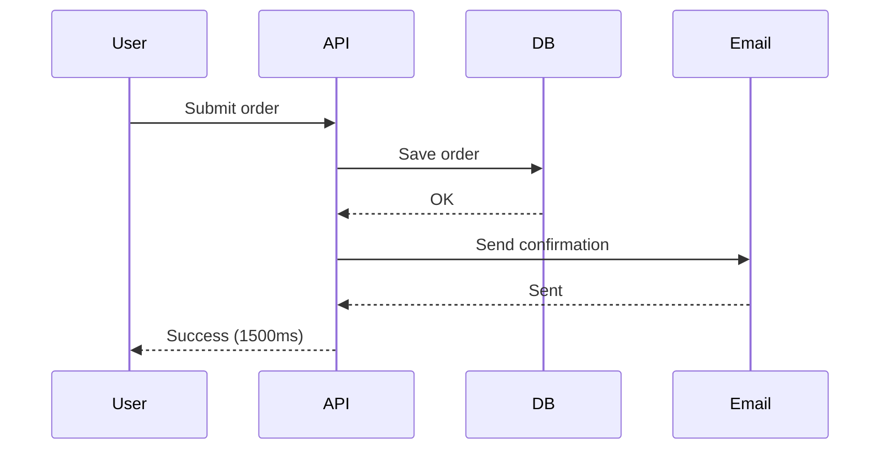
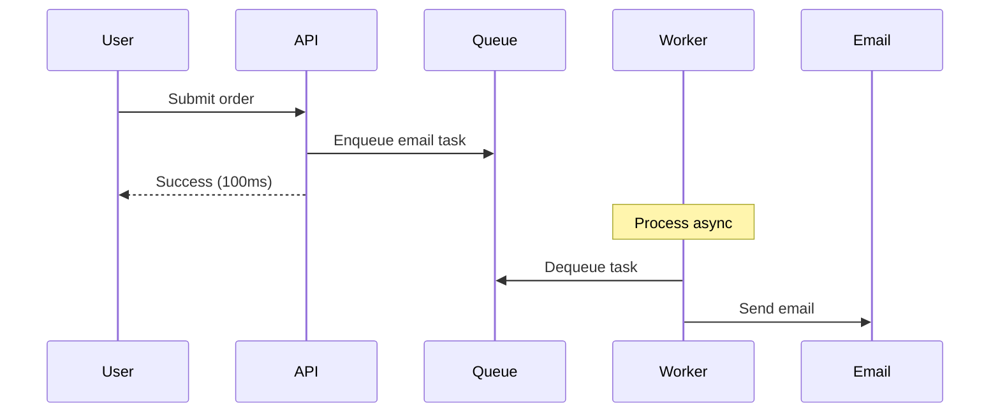
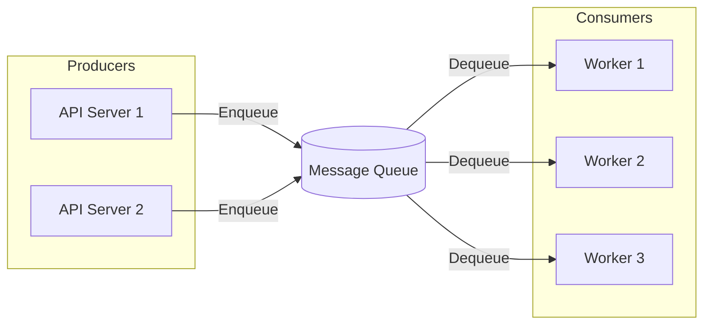
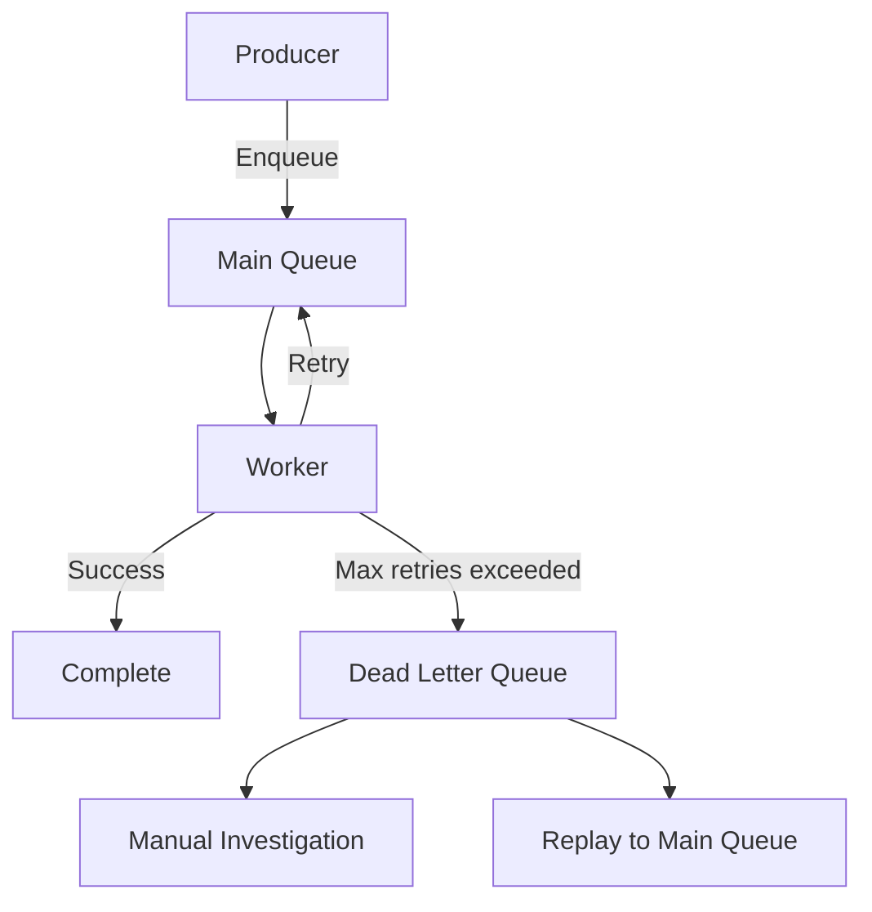

# Asynchronous Processing & Queues - Defer Work Để Giảm Latency

User click "Submit Order" trên e-commerce site.

**Synchronous approach:**
```
1. Validate order          (100ms)
2. Check inventory         (200ms)
3. Process payment         (500ms)
4. Update database         (100ms)
5. Send confirmation email (300ms)
6. Generate invoice PDF    (400ms)
7. Notify warehouse        (200ms)
8. Update analytics        (100ms)
───────────────────────────────────
Total: 1900ms (gần 2 giây!)
```

User đợi 2 giây mới thấy "Order Successful". **Experience tệ.**

**Asynchronous approach:**
```
1. Validate order          (100ms)
2. Check inventory         (200ms)
3. Process payment         (500ms)
4. Update database         (100ms)
5. Queue remaining tasks   (10ms)
───────────────────────────────────
Return "Order Successful": 910ms

Background (async):
  - Send email
  - Generate PDF
  - Notify warehouse
  - Update analytics
```

User chỉ đợi ~1 giây. **Experience tốt hơn 2x.**

**Đây chính là power của async processing.**

Lesson này dạy bạn:
- Khi nào dùng sync vs async
- Message queues architecture
- Retry strategies & error handling
- Dead letter queues
- Idempotency (critical cho reliability)
- Event-driven thinking

## Sync vs Async - Trade-off Cơ Bản

### Synchronous Processing

**Request → Process → Response. User đợi toàn bộ.**


**Characteristics:**

**Pros:**
- Simple logic
- Immediate feedback
- Easy to debug
- Strong consistency

**Cons:**
- High latency (user đợi lâu)
- Poor user experience
- Wasted resources (user waiting = connection held)
- Cascade failures (1 slow step = entire request slow)

### Asynchronous Processing

**Request → Quick response → Process in background.**


**Characteristics:**

**Pros:**
- Low latency (user không đợi)
- Better user experience
- Resilient (failures don't block user)
- Scalable (process at own pace)

**Cons:**
- Eventual consistency
- Complex error handling
- Hard to debug
- Need queue infrastructure

### Decision Framework

**Dùng SYNC khi:**

**1. User needs immediate result**
```python
# Login - must know if success/fail
def login(username, password):
    user = authenticate(username, password)  # Must wait
    return user
```

**2. Business logic requires**
```python
# Payment - must confirm before proceeding
def checkout(cart):
    payment_result = charge_card(cart.total)  # Must wait
    if payment_result.success:
        create_order()
```

**3. Simple, fast operations**
```python
# Get user profile - fast query
def get_profile(user_id):
    return db.get_user(user_id)  # 10ms, không cần async
```

**Dùng ASYNC khi:**

**1. Non-critical operations**
```python
# Send email - user doesn't need to wait
def register(email):
    user = create_user(email)
    send_welcome_email.delay(email)  # Async
    return user
```

**2. Heavy/slow operations**
```python
# Video processing - can take minutes
def upload_video(file):
    video = save_video(file)
    process_video.delay(video.id)  # Async
    return video
```

**3. External service calls**
```python
# 3rd party APIs - unpredictable latency
def create_order(order):
    save_order(order)
    notify_warehouse.delay(order.id)  # Async
    update_analytics.delay(order)     # Async
    return order
```

**4. Fan-out operations**
```python
# Notify many users - can be slow
def post_update(post):
    save_post(post)
    notify_followers.delay(post.id)  # Async (may be 10k users)
    return post
```

## Message Queues - Async Processing Infrastructure

**Message queue = buffer giữa producer và consumer.**


### Core Concepts

**Producer:**
- Application tạo tasks
- Enqueue messages vào queue

**Queue:**
- Store messages
- Guarantee delivery
- Handle distribution

**Consumer/Worker:**
- Dequeue messages
- Process tasks
- Acknowledge completion

### Popular Queue Systems

**RabbitMQ:**
- Full-featured message broker
- AMQP protocol
- Complex routing, exchanges
- Good for complex workflows

**Redis (with Sidekiq/Bull):**
- Simple, fast
- In-memory (persistence optional)
- Good for high-throughput simple jobs

**AWS SQS:**
- Managed service
- Fully scalable
- Pay-per-use
- Good for AWS ecosystem

**Kafka:**
- Distributed streaming platform
- High throughput (millions msg/s)
- Event sourcing, logs
- Good for event-driven architecture

**Comparison:**

| Feature | RabbitMQ | Redis | SQS | Kafka |
|---------|----------|-------|-----|-------|
| Throughput | High | Very High | High | Extreme |
| Latency | Low | Very Low | Medium | Low |
| Persistence | Yes | Optional | Yes | Yes |
| Ordering | Yes | Limited | FIFO queue | Yes |
| Complexity | Medium | Low | Low | High |
| Use Case | Task queues | Simple jobs | AWS apps | Event streams |

### Basic Queue Operations

**Enqueue (Producer):**
```python
# Python with Celery + Redis
from celery import Celery

app = Celery('tasks', broker='redis://localhost:6379')

@app.task
def send_email(to, subject, body):
    # Email sending logic
    smtp.send(to, subject, body)

# Enqueue task
send_email.delay('user@example.com', 'Welcome', 'Hello!')
```

**Dequeue (Consumer):**
```python
# Worker processes tasks automatically
# Start worker:
# celery -A tasks worker --loglevel=info

# Celery handles:
# - Dequeue messages
# - Call task function
# - Retry on failure
# - Acknowledge on success
```

**Manual dequeue (Redis example):**
```python
import redis

r = redis.Redis()

while True:
    # Blocking pop (wait for messages)
    task = r.brpop('email_queue', timeout=5)
    
    if task:
        queue_name, message = task
        process_email(message)
```

## Background Jobs - Common Patterns

### Pattern 1: Deferred Execution

**Execute task sau một khoảng thời gian.**
```python
# Send reminder email after 24 hours
send_reminder_email.apply_async(
    args=[user.id],
    countdown=86400  # 24 hours in seconds
)
```

**Use cases:**
- Reminder notifications
- Trial expiration warnings
- Subscription renewals

### Pattern 2: Scheduled Jobs (Cron)

**Execute task theo schedule định kỳ.**
```python
# Celery beat - periodic tasks
from celery.schedules import crontab

app.conf.beat_schedule = {
    'cleanup-old-data': {
        'task': 'tasks.cleanup_old_data',
        'schedule': crontab(hour=2, minute=0),  # 2 AM daily
    },
    'send-daily-report': {
        'task': 'tasks.send_daily_report',
        'schedule': crontab(hour=9, minute=0, day_of_week=1),  # Monday 9 AM
    },
}
```

**Use cases:**
- Daily reports
- Data cleanup
- Cache warming
- Backup jobs

### Pattern 3: Batch Processing

**Process nhiều items cùng lúc.**
```python
# Process batch of emails
@app.task
def send_batch_emails(email_ids):
    emails = Email.objects.filter(id__in=email_ids)
    for email in emails:
        send_email(email)

# Split into batches
email_ids = [1, 2, 3, ..., 10000]
batch_size = 100

for i in range(0, len(email_ids), batch_size):
    batch = email_ids[i:i+batch_size]
    send_batch_emails.delay(batch)
```

**Benefits:**
- Efficient resource usage
- Better throughput
- Database query optimization

### Pattern 4: Pipeline/Chain

**Tasks execute in sequence.**
```python
from celery import chain

# Task chain
workflow = chain(
    resize_image.s(image_id),
    apply_watermark.s(),
    upload_to_cdn.s(),
    update_database.s()
)

workflow.apply_async()
```

**Each task output = next task input.**

### Pattern 5: Fan-out/Fan-in

**Parallel execution, then aggregate.**
```python
from celery import group, chord

# Process multiple images in parallel
job = chord(
    group(process_image.s(img_id) for img_id in image_ids),
    aggregate_results.s()  # Called after all finish
)

job.apply_async()
```

**Use cases:**
- Multi-file processing
- Parallel API calls
- Map-reduce operations

## Retry Strategies - Handle Failures Gracefully

**Failures happen. Network timeout, service down, rate limits.**

### Automatic Retry
```python
@app.task(
    bind=True,
    max_retries=3,
    default_retry_delay=60  # 60 seconds
)
def send_email(self, to, subject, body):
    try:
        smtp.send(to, subject, body)
    except SMTPException as exc:
        # Retry with exponential backoff
        raise self.retry(exc=exc, countdown=2 ** self.request.retries)
```

**Exponential backoff:**
```
Retry 1: wait 2^1 = 2 seconds
Retry 2: wait 2^2 = 4 seconds
Retry 3: wait 2^3 = 8 seconds
```

Prevents overwhelming failing service.

### Conditional Retry

**Retry chỉ với specific errors.**
```python
@app.task(bind=True, max_retries=5)
def call_external_api(self, url):
    try:
        response = requests.get(url, timeout=10)
        response.raise_for_status()
        return response.json()
    except requests.Timeout as exc:
        # Retry on timeout
        raise self.retry(exc=exc, countdown=30)
    except requests.HTTPError as exc:
        if exc.response.status_code == 429:  # Rate limited
            raise self.retry(exc=exc, countdown=120)
        elif exc.response.status_code >= 500:  # Server error
            raise self.retry(exc=exc)
        else:
            # 4xx errors - don't retry
            raise
```

**Logic:**
- Timeout → retry (transient)
- 429 Rate limit → retry with longer delay
- 5xx Server error → retry (may recover)
- 4xx Client error → don't retry (won't succeed)

### Retry Limits

**Don't retry forever.**
```python
@app.task(
    max_retries=10,
    retry_backoff=True,
    retry_backoff_max=600,  # Max 10 minutes
    retry_jitter=True        # Add randomness
)
def risky_task():
    # Task logic
    pass
```

**After max retries → task fails → moves to DLQ.**

## Dead Letter Queue (DLQ) - Handle Permanent Failures

**DLQ = queue for messages that failed permanently.**


### Why DLQ Important

**1. Don't lose messages**

Failed tasks không biến mất. Store in DLQ for investigation.

**2. Prevent queue blocking**

Failing message không block queue. Other messages process normally.

**3. Enable debugging**

Analyze failed messages, understand patterns, fix bugs.

**4. Manual intervention**

Admin có thể replay messages sau khi fix issue.

### Implementing DLQ

**Celery + RabbitMQ:**
```python
from celery import Celery

app = Celery('tasks')

app.conf.task_reject_on_worker_lost = True
app.conf.task_acks_late = True

@app.task(
    bind=True,
    max_retries=3,
    dead_letter_exchange='dlx',
    dead_letter_routing_key='dlq'
)
def problematic_task(self):
    # Task logic
    pass
```

**AWS SQS:**
```python
import boto3

sqs = boto3.client('sqs')

# Create main queue with DLQ
response = sqs.create_queue(
    QueueName='main-queue',
    Attributes={
        'RedrivePolicy': json.dumps({
            'deadLetterTargetArn': dlq_arn,
            'maxReceiveCount': '3'  # After 3 attempts → DLQ
        })
    }
)
```

### Monitoring DLQ

**Track metrics:**
```
- DLQ size (messages count)
- DLQ message age
- Failure reasons distribution
- Failure rate trends
```

**Alert when:**
- DLQ size > threshold
- Sudden spike in failures
- Messages aging in DLQ

**Periodic review:**
```python
def review_dlq():
    messages = dlq.get_messages(limit=100)
    
    for msg in messages:
        # Analyze failure reason
        if is_fixable(msg):
            fix_and_replay(msg)
        else:
            log_permanent_failure(msg)
```

## Idempotency - Critical For Reliability

**Idempotent = executing multiple times produces same result as executing once.**

### The Problem

**Scenario:**
```
1. User submits order
2. API enqueues "charge_payment" task
3. Worker processes task, charges card
4. Network timeout before ack
5. Queue redelivers task
6. Worker processes again → charges card TWICE! 💸
```

**User charged 2x. Very bad.**

### Solution: Idempotent Operations

**Method 1: Idempotency Keys**
```python
@app.task
def charge_payment(order_id, amount, idempotency_key):
    # Check if already processed
    if Payment.objects.filter(idempotency_key=idempotency_key).exists():
        print("Already processed, skipping")
        return
    
    # Process payment
    result = stripe.charge(amount, idempotency_key=idempotency_key)
    
    # Save with idempotency key
    Payment.objects.create(
        order_id=order_id,
        amount=amount,
        idempotency_key=idempotency_key,
        transaction_id=result.id
    )
```

**Stripe API cũng support idempotency keys - double protection.**

**Method 2: Database Constraints**
```python
# Unique constraint on database
class Payment(models.Model):
    order_id = models.IntegerField()
    transaction_id = models.CharField(max_length=100, unique=True)

@app.task
def charge_payment(order_id):
    try:
        result = stripe.charge(...)
        Payment.objects.create(
            order_id=order_id,
            transaction_id=result.id  # Unique - prevents duplicates
        )
    except IntegrityError:
        # Duplicate transaction - already processed
        print("Already processed")
```

**Method 3: Atomic Operations**
```python
# Use database atomic operations
@app.task
def increment_view_count(post_id):
    # Idempotent - can run multiple times safely
    Post.objects.filter(id=post_id).update(
        view_count=F('view_count') + 1
    )
```

**Method 4: State Machines**
```python
class Order(models.Model):
    status = models.CharField(
        choices=[
            ('pending', 'Pending'),
            ('processing', 'Processing'),
            ('completed', 'Completed'),
        ]
    )

@app.task
def process_order(order_id):
    order = Order.objects.get(id=order_id)
    
    # Only process if pending
    if order.status != 'pending':
        print("Already processed")
        return
    
    # Update status atomically
    updated = Order.objects.filter(
        id=order_id,
        status='pending'
    ).update(status='processing')
    
    if updated == 0:
        print("Another worker already processing")
        return
    
    # Process order...
    
    order.status = 'completed'
    order.save()
```

**State transitions enforce idempotency.**

### Best Practices

**1. Always use idempotency keys for financial operations**
```python
import uuid

idempotency_key = str(uuid.uuid4())
charge_payment.delay(order_id, amount, idempotency_key)
```

**2. Generate idempotency key at producer, not consumer**

Producer ensures same key for retries.

**3. Store processed keys with TTL**
```python
# Redis
redis.setex(f"processed:{idempotency_key}", 86400, "1")  # 24h TTL
```

**4. Make all external API calls idempotent**

Stripe, payment gateways, email services all support idempotency keys.

## Event-Driven Architecture Intro

**Async processing naturally leads to event-driven thinking.**

### From Request-Driven To Event-Driven

**Request-driven (traditional):**
```python
def create_order(order_data):
    order = save_order(order_data)
    charge_payment(order)
    send_confirmation(order)
    notify_warehouse(order)
    update_analytics(order)
    return order
```

Tight coupling. Order creation knows về all downstream systems.

**Event-driven:**
```python
def create_order(order_data):
    order = save_order(order_data)
    
    # Publish event
    publish_event('order.created', {
        'order_id': order.id,
        'user_id': order.user_id,
        'total': order.total
    })
    
    return order

# Separate subscribers
@subscribe('order.created')
def handle_payment(event):
    charge_payment(event['order_id'])

@subscribe('order.created')
def send_email(event):
    send_confirmation(event['order_id'])

@subscribe('order.created')
def notify_warehouse(event):
    notify_warehouse(event['order_id'])
```

**Benefits:**

**1. Decoupling**

Order service không biết về email service, warehouse service.

**2. Scalability**

Mỗi subscriber scale independently.

**3. Flexibility**

Add new subscribers without changing order service.

**4. Resilience**

1 subscriber fail không affect others.

### Event Structure
```python
{
    "event_id": "evt_abc123",
    "event_type": "order.created",
    "timestamp": "2025-02-15T10:00:00Z",
    "version": "1.0",
    "data": {
        "order_id": 12345,
        "user_id": 789,
        "total": 99.99
    }
}
```

**Include:**
- Unique event ID (idempotency)
- Event type (routing)
- Timestamp (ordering)
- Version (schema evolution)
- Data payload

### Event Patterns

**1. Event Notification**

Thông báo something happened. Subscribers fetch details nếu cần.
```python
publish_event('user.registered', {'user_id': 123})
```

**2. Event-Carried State Transfer**

Event chứa all data subscribers cần.
```python
publish_event('user.registered', {
    'user_id': 123,
    'email': 'user@example.com',
    'name': 'John Doe',
    'signup_date': '2025-02-15'
})
```

**3. Event Sourcing**

Store all events as source of truth. Current state = replay events.
```python
events = [
    {'type': 'account.created', 'balance': 1000},
    {'type': 'transaction.deposit', 'amount': 500},
    {'type': 'transaction.withdraw', 'amount': 200},
]

# Current balance = 1000 + 500 - 200 = 1300
```

## Practical Recommendations

### 1. Start Simple

**Don't over-engineer. Begin with basic background jobs.**
```python
# Simple Celery task
@app.task
def send_email(to, subject, body):
    smtp.send(to, subject, body)

# Usage
send_email.delay('user@example.com', 'Welcome', 'Hello!')
```

**Add complexity only khi cần:**
- Retries → when external dependencies
- DLQ → when monitoring failures
- Idempotency → when critical operations

### 2. Monitor Queue Health

**Track metrics:**
```python
# Queue depth
queue_size = celery.control.inspect().stats()

# Task success/failure rate
from celery.events import EventReceiver

def monitor_events():
    receiver = EventReceiver(app.connection())
    
    for event in receiver.events():
        if event['type'] == 'task-succeeded':
            metrics.increment('task.success')
        elif event['type'] == 'task-failed':
            metrics.increment('task.failure')
```

**Alert when:**
- Queue depth > threshold (workers can't keep up)
- High failure rate (systemic issues)
- Processing time > SLA

### 3. Design For Failure

**Assume tasks will fail. Plan accordingly.**
```python
@app.task(
    bind=True,
    max_retries=3,
    default_retry_delay=60
)
def resilient_task(self, data):
    try:
        # Task logic with timeout
        result = process_with_timeout(data, timeout=30)
        return result
    except TimeoutError as exc:
        # Retry on timeout
        raise self.retry(exc=exc)
    except Exception as exc:
        # Log error for investigation
        logger.error(f"Task failed: {exc}", extra={'data': data})
        raise
```

### 4. Test Async Flows

**Testing async code harder than sync.**
```python
# Test with eager mode (synchronous for testing)
app.conf.task_always_eager = True

def test_order_creation():
    order = create_order(order_data)
    
    # Tasks execute synchronously in tests
    assert email_was_sent(order.user.email)
    assert payment_was_charged(order.id)
```

**Integration tests:**
```python
def test_queue_integration():
    # Send task to real queue
    result = send_email.delay('test@example.com', 'Test', 'Body')
    
    # Wait for completion
    assert result.get(timeout=10) == 'sent'
```

### 5. Graceful Degradation

**Queue down không nên crash toàn bộ system.**
```python
def create_order(order_data):
    order = save_order(order_data)
    
    try:
        send_confirmation.delay(order.id)
    except ConnectionError:
        # Queue unavailable - fallback to sync
        logger.warning("Queue unavailable, sending email synchronously")
        send_confirmation_sync(order.id)
    
    return order
```

## Mental Model: Latency Giảm Bằng Cách Defer Work

**Core insight:**

**User không cần đợi work không critical. Defer nó để improve experience.**
```
Sync mindset:
  Complete everything before responding
  User experience = slow

Async mindset:
  Complete critical work only
  Defer rest to background
  User experience = fast
```

**Decision tree:**
```
Does user need result immediately?
  YES → Sync (e.g., login validation)
  NO → Can defer?
    YES → Async (e.g., send email)
    NO → Sync (e.g., payment validation)
```

**Architect thinking:**

1. Identify critical path (what user actually needs)
2. Defer everything else (emails, analytics, etc.)
3. Use queues for reliability (retry, DLQ)
4. Design for idempotency (safety)
5. Monitor queue health (operational excellence)

**Great systems respond fast, work happens later.**

## Key Takeaways

**1. Async processing reduces user-facing latency**

User gets response fast, work happens in background.

**2. Message queues decouple producers from consumers**

Scale independently, handle spikes, improve resilience.

**3. Choose queue system based on requirements**

Redis = simple/fast, RabbitMQ = feature-rich, SQS = managed, Kafka = streaming.

**4. Retry strategies handle transient failures**

Exponential backoff, conditional retry, max retries.

**5. DLQ captures permanent failures**

Don't lose messages, enable investigation, allow replay.

**6. Idempotency critical for reliability**

Use idempotency keys, database constraints, atomic operations.

**7. Event-driven architecture = extreme decoupling**

Services communicate via events, not direct calls.

**8. Monitor queue health continuously**

Queue depth, task success rate, processing time.

**9. Design for failure**

Tasks will fail. Have retry logic, DLQ, fallbacks.

**10. Test async flows thoroughly**

Use eager mode for unit tests, real queue for integration.

**Remember: The best user experience is fast response. Defer non-critical work to background. Users don't need to wait for emails to be sent or analytics to be updated - they need to see "Order Successful" immediately.**