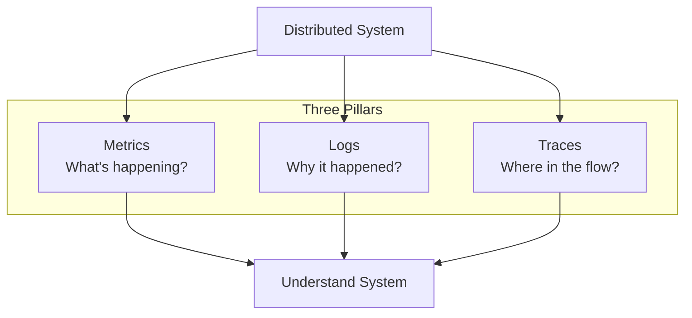
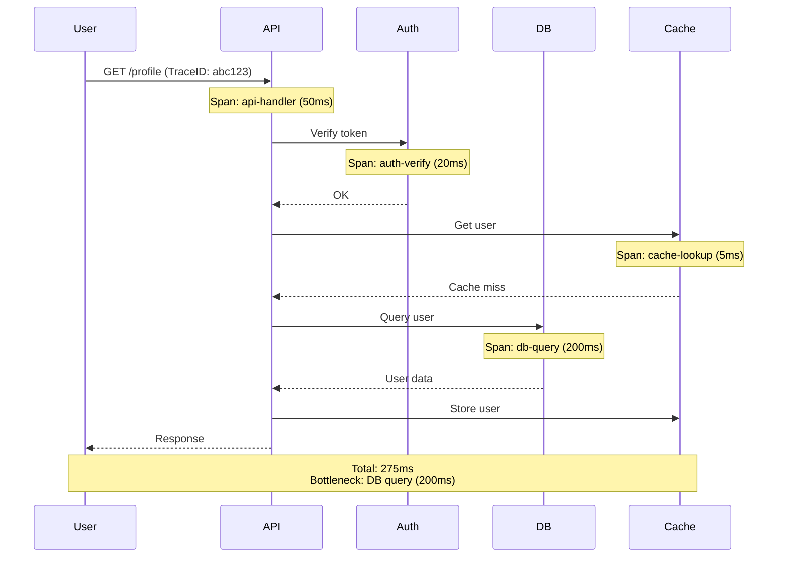
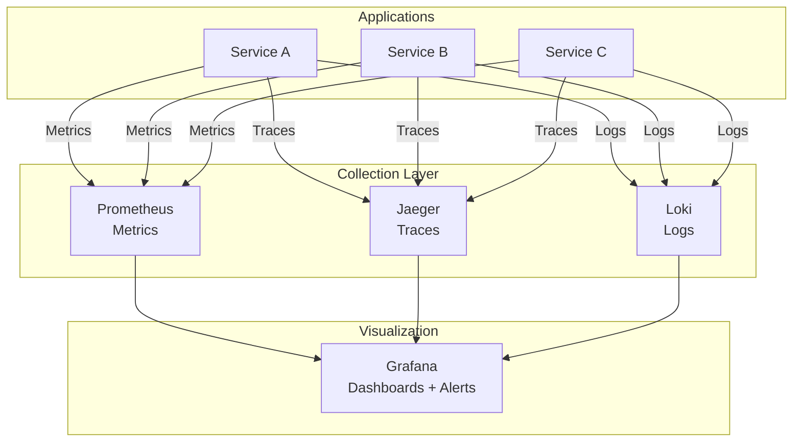

# Monitoring, Observability & Performance Debugging - Measure To Scale

Bạn deploy hệ thống production. Mọi thứ chạy tốt... hoặc ít nhất bạn nghĩ vậy.

Rồi user complain: "Site chậm". Bạn check:
- Server CPU: 30% ✅
- Memory: 50%  
- Disk: 40% ✅

Metrics nhìn OK. Vậy tại sao user nói chậm?

**Vấn đề:** Bạn đang measure wrong things.

CPU 30% không nói lên gì về user experience. Có thể:
- API response time 5 seconds (user đợi lâu)
- Database queries timeout
- 3rd party API calls fail 50% requests

**Không measure đúng = không biết system thực sự hoạt động như thế nào.**

**Mental model quan trọng nhất:** **If you cannot measure, you cannot scale.**

Lesson này dạy bạn:
- Metrics nào thực sự quan trọng
- Percentiles (p50, p95, p99) và tại sao
- Alert strategy (không spam, không miss critical)
- Distributed tracing cho microservices
- Logging best practices
- SLO/SLA/Error budgets

## Tại Sao Monitoring Là Critical?

### 1. Detect Problems Before Users

**Proactive > Reactive.**
```
Without monitoring:
  User complains → investigate → find issue → fix
  Mean time to detect (MTTD): Hours to days

With monitoring:
  Alert fires → investigate → fix → user không notice
  MTTD: Seconds to minutes
```

**Good monitoring = user không biết có issues.**

### 2. Understand System Behavior

**Capacity planning:**
```
Current: 1000 req/s, CPU 40%
Question: Can handle 5000 req/s?
Answer: Need data to extrapolate
```

Without metrics, guessing. With metrics, informed decisions.

### 3. Debug Performance Issues

**User:** "Site slow at 3 PM daily."

**Without monitoring:** No idea why.

**With monitoring:**
```
Check metrics at 3 PM:
- Database query time spike 10x
- Slow query log: daily report generation
→ Move report to off-peak hours
```

### 4. Validate Optimizations

**You:** "Added caching, should be faster."

**Reality check:**
```
Before: p95 latency 800ms
After:  p95 latency 150ms
→ 5x improvement confirmed ✅
```

**Measure to prove impact.**

### 5. Meet SLAs

**Contract:** "99.9% uptime, p99 latency < 500ms"

**How to know if meeting?** Monitor 24/7.

## The Three Pillars Of Observability

**Observability = ability to understand system internal state từ external outputs.**


**Metrics:** Aggregated numbers (CPU, latency, error rate)  
**Logs:** Discrete events (errors, warnings, debug info)  
**Traces:** Request flow across services

**Cần cả ba để full visibility.**

## Metrics - What To Measure

### Golden Signals (Google SRE)

**4 metrics quan trọng nhất:**

#### 1. Latency

**Time to serve a request.**
```python
import time

def track_latency(func):
    def wrapper(*args, **kwargs):
        start = time.time()
        result = func(*args, **kwargs)
        duration = time.time() - start
        
        metrics.histogram('api.latency', duration, tags=['endpoint:users'])
        return result
    return wrapper

@track_latency
def get_users():
    return db.query("SELECT * FROM users")
```

**Track:**
- Overall API latency
- Per-endpoint latency
- Database query time
- External API call time

**Why:** Direct impact on user experience.

#### 2. Traffic

**Requests per second (throughput).**
```python
@app.before_request
def track_request():
    metrics.increment('api.requests', tags=[
        f'endpoint:{request.endpoint}',
        f'method:{request.method}'
    ])
```

**Track:**
- Total requests/second
- Requests per endpoint
- Read vs write ratio

**Why:** Understand load patterns, capacity planning.

#### 3. Errors

**Failed requests rate.**
```python
@app.after_request
def track_response(response):
    if response.status_code >= 500:
        metrics.increment('api.errors.5xx')
    elif response.status_code >= 400:
        metrics.increment('api.errors.4xx')
    
    return response
```

**Track:**
- 4xx errors (client errors)
- 5xx errors (server errors)
- Error rate (%)

**Why:** Reliability indicator, alert trigger.

#### 4. Saturation

**How "full" your service is.**
```python
# System metrics
metrics.gauge('system.cpu_percent', psutil.cpu_percent())
metrics.gauge('system.memory_percent', psutil.virtual_memory().percent)
metrics.gauge('system.disk_percent', psutil.disk_usage('/').percent)

# Application metrics
metrics.gauge('db.connection_pool.used', db.pool.size())
metrics.gauge('queue.depth', redis.llen('task_queue'))
```

**Track:**
- CPU usage
- Memory usage
- Disk usage
- Connection pool utilization
- Queue depth

**Why:** Predict when system will hit limits.

### RED Method (For Services)

**Rate, Errors, Duration.**
```python
class ServiceMetrics:
    def record_request(self, duration, success):
        # Rate
        self.metrics.increment('service.requests')
        
        # Errors
        if not success:
            self.metrics.increment('service.errors')
        
        # Duration
        self.metrics.histogram('service.duration', duration)
```

**Simple, covers essentials.**

### USE Method (For Resources)

**Utilization, Saturation, Errors.**
```python
# Utilization: % time resource busy
cpu_utilization = psutil.cpu_percent()

# Saturation: work queued
load_average = os.getloadavg()[0]  # 1-minute load

# Errors: error count
disk_errors = read_disk_error_count()
```

**For infrastructure monitoring.**

## Percentiles - Why They Matter More Than Averages

### The Problem With Averages

**Scenario:**
```
API latencies:
  99 requests: 100ms
  1 request:   10,000ms (10 seconds!)

Average: (99 * 100 + 10,000) / 100 = 199ms
```

**Average says 199ms - looks OK!**

**Reality: 1% users wait 10 seconds - terrible experience.**

**Averages hide outliers.**

### Percentiles Reveal True Story

**p50 (median):** 50% requests faster, 50% slower  
**p95:** 95% requests faster than this  
**p99:** 99% requests faster than this  
**p99.9:** 99.9% requests faster than this
```
Example distribution:
  p50:  100ms  (typical experience)
  p95:  200ms  (most users)
  p99:  500ms  (edge cases)
  p99.9: 2000ms (rare outliers)
```

**p95, p99 show worst-case user experience.**

### Why p99 Matters

**Amazon study:** p99 latency directly correlates với revenue.
```
p99 latency = 1 second
→ Slow for 1% users
→ At 1M requests/day = 10,000 bad experiences
→ Bad reviews, lost sales
```

**Optimize for p99, not average.**

### Tracking Percentiles
```python
from prometheus_client import Histogram

# Histogram automatically calculates percentiles
latency_histogram = Histogram(
    'api_latency_seconds',
    'API request latency',
    buckets=[0.1, 0.25, 0.5, 1.0, 2.5, 5.0]
)

@app.route('/api/data')
def get_data():
    with latency_histogram.time():
        return process_request()
```

**Prometheus query:**
```promql
# p95 latency over 5 minutes
histogram_quantile(0.95, 
  rate(api_latency_seconds_bucket[5m])
)
```

### Service Level Indicators (SLI)

**Measured percentiles become SLIs.**
```
SLI: p99 latency < 500ms
SLI: p95 availability > 99.9%
SLI: p99 error rate < 0.1%
```

**Objective, measurable targets.**

## Alert Strategy - Signal vs Noise

### The Alert Fatigue Problem

**Bad alerting:**
```
03:00 - Alert: CPU > 80%
03:05 - Alert: CPU > 80%
03:10 - Alert: CPU > 80%
...
→ 100 alerts/night
→ Engineers ignore alerts
→ Real issue missed
```

**Alert fatigue kills reliability.**

### Good Alert Principles

**1. Alert on symptoms, not causes**

**Bad:**
```
Alert: Database CPU > 80%
```

**Good:**
```
Alert: API p99 latency > 1 second
```

**Why:** CPU high có thể OK nếu latency fine. Latency high = user impacted = real problem.

**2. Alert on user impact**

**Bad:**
```
Alert: 1 server down (out of 10)
```

**Good:**
```
Alert: Error rate > 5%
(Only if user experience affected)
```

**3. Actionable alerts only**

**Every alert phải có clear action.**
```
Alert: Database slow queries detected

Action:
1. Check slow query log
2. Check database load
3. Kill long-running queries if needed
4. Page DB team if persists > 15 min
```

**Không có action = không nên alert.**

**4. Use thresholds wisely**

**Static threshold:**
```yaml
alert: CPU > 90%
```

Problem: Normal load varies. 90% at 2 AM = problem. 90% at peak = normal.

**Dynamic threshold:**
```yaml
alert: CPU > (baseline + 2 * stddev)
```

Adapts to normal patterns.

**5. Alert priority levels**

**P0 (Critical):** System down, revenue impact  
→ Page on-call immediately

**P1 (High):** Degraded performance, affecting users  
→ Alert on-call, expect response within 30 min

**P2 (Medium):** Non-critical issues  
→ Ticket, handle during business hours

**P3 (Low):** Informational  
→ Log only, no alert

### Alert Runbooks

**Mỗi alert cần runbook.**
```markdown
## Alert: High API Error Rate

### Symptom
API error rate > 5% for 5 minutes

### Impact
Users experiencing failures, potential revenue loss

### Investigation Steps
1. Check error dashboard: ${dashboard_link}
2. Check error logs: `kubectl logs -l app=api --tail=100`
3. Check dependent services status
4. Check recent deployments

### Remediation
1. If bad deployment: rollback immediately
2. If database issue: check DB health, consider read replica
3. If 3rd party issue: enable circuit breaker, use fallback

### Escalation
If unresolved after 15 minutes: page @backend-lead
```

**Reduces MTTR (Mean Time To Resolve).**

## Distributed Tracing - Debug Across Services

### The Microservices Problem

**Monolith:**
```
User request → Single codebase → Easy to debug
```

**Microservices:**
```
User request → Service A → Service B → Service C
                      ↓
                  Service D
```

**Where is bottleneck? Hard to tell.**

### Distributed Tracing Solution

**Trace = full request journey across services.**


**Mỗi operation = span. Collection of spans = trace.**

### Implementing Tracing

**OpenTelemetry (standard):**
```python
from opentelemetry import trace
from opentelemetry.instrumentation.flask import FlaskInstrumentor

# Initialize tracer
tracer = trace.get_tracer(__name__)

# Instrument Flask automatically
FlaskInstrumentor().instrument_app(app)

# Manual spans for custom operations
@app.route('/api/user/<user_id>')
def get_user(user_id):
    with tracer.start_as_current_span("get_user") as span:
        span.set_attribute("user.id", user_id)
        
        # Database query
        with tracer.start_as_current_span("db.query.user"):
            user = db.query_user(user_id)
        
        # Cache operation
        with tracer.start_as_current_span("cache.set"):
            cache.set(f"user:{user_id}", user)
        
        return jsonify(user)
```

**Propagate trace context across services:**
```python
import requests
from opentelemetry.propagate import inject

def call_downstream_service(url):
    headers = {}
    # Inject trace context into headers
    inject(headers)
    
    response = requests.get(url, headers=headers)
    return response.json()
```

**Downstream service continues trace:**
```python
from opentelemetry.propagate import extract

@app.before_request
def extract_trace_context():
    # Extract trace context from headers
    ctx = extract(request.headers)
    # Automatic - OpenTelemetry uses context
```

### Tracing Tools

**Jaeger:**
- Open source
- Uber-developed
- Simple to deploy
- Good for small-medium systems

**Zipkin:**
- Open source
- Twitter-developed
- Similar to Jaeger
- Large community

**Datadog APM:**
- Commercial
- Full-featured
- Automatic instrumentation
- Integrated with metrics/logs

**AWS X-Ray:**
- AWS-native
- Easy AWS integration
- Pay-per-use

### What Tracing Reveals

**1. Slow dependencies**
```
Service A: 10ms
Service B: 500ms ← Bottleneck!
Service C: 5ms

Total: 515ms
```

**2. N+1 queries**
```
get_users: 10ms
  ↳ get_orders (user 1): 50ms
  ↳ get_orders (user 2): 50ms
  ↳ get_orders (user 3): 50ms
  ...
```

**3. Unnecessary calls**
```
get_profile:
  ↳ get_user
  ↳ get_preferences (not used!)
  ↳ get_settings (not used!)
```

**4. Cascade failures**
```
Service A timeout (30s)
  ↳ Service B timeout (30s)
    ↳ Service C timeout (30s)

Total: 90s failure!
```

## Logging Strategy - Debug The Details

### Log Levels

**FATAL:** System unusable  
**ERROR:** Error events, need attention  
**WARN:** Potentially harmful situations  
**INFO:** Informational messages  
**DEBUG:** Detailed diagnostic info  
**TRACE:** Very detailed (too much for production)
```python
import logging

logging.fatal("Database connection lost!")
logging.error("Payment processing failed", extra={
    'user_id': user.id,
    'amount': payment.amount
})
logging.warning("Cache miss rate high: 40%")
logging.info("User logged in", extra={'user_id': user.id})
logging.debug("Query executed", extra={'query': sql, 'duration': 0.5})
```

**Production: INFO and above.**  
**Staging: DEBUG.**  
**Development: TRACE.**

### Structured Logging

**Bad (unstructured):**
```python
logging.info(f"User {user_id} purchased {item_name} for ${price}")
```

**Hard to parse, query, aggregate.**

**Good (structured):**
```python
logging.info("purchase_completed", extra={
    'event': 'purchase',
    'user_id': user_id,
    'item_name': item_name,
    'price': price,
    'currency': 'USD'
})
```

**JSON output:**
```json
{
  "timestamp": "2025-02-15T10:00:00Z",
  "level": "INFO",
  "message": "purchase_completed",
  "user_id": 12345,
  "item_name": "iPhone",
  "price": 999,
  "currency": "USD"
}
```

**Easy to query:**
```
SELECT COUNT(*) FROM logs 
WHERE event = 'purchase' 
  AND price > 500
  AND timestamp > now() - interval '1 hour'
```

### What To Log

**Log:**
- Errors and exceptions
- Important state changes
- Security events (login, permission changes)
- External API calls (request/response)
- Business events (purchase, signup)

**Don't log:**
- Passwords, tokens, PII
- High-frequency debug (every query)
- Large payloads (entire responses)

### Correlation IDs

**Track request across services.**
```python
import uuid

@app.before_request
def inject_request_id():
    request_id = request.headers.get('X-Request-ID') or str(uuid.uuid4())
    g.request_id = request_id

@app.after_request
def add_request_id(response):
    response.headers['X-Request-ID'] = g.request_id
    return response

# Log with request ID
logging.info("Processing request", extra={
    'request_id': g.request_id,
    'endpoint': request.endpoint
})
```

**Search logs by request_id = full request flow.**

### Log Aggregation

**Centralized logging system.**

**ELK Stack:**
- Elasticsearch (storage + search)
- Logstash (collection + processing)
- Kibana (visualization)

**Grafana Loki:**
- Lightweight
- Integrates with Prometheus
- Good for cloud-native

**Datadog Logs:**
- Commercial
- Integrated platform
- Auto-parsing

**CloudWatch Logs:**
- AWS-native
- Serverless-friendly
- Pay-per-GB

**Ship logs:**
```python
# Filebeat config
filebeat.inputs:
  - type: log
    paths:
      - /var/log/app/*.log
    fields:
      app: myapp
      env: production

output.elasticsearch:
  hosts: ["elasticsearch:9200"]
```

## SLO, SLA, Error Budgets - Reliability Framework

### Definitions

**SLI (Service Level Indicator):**
Measured metric.
```
Example: API p99 latency = 450ms
```

**SLO (Service Level Objective):**
Target for SLI.
```
Example: API p99 latency < 500ms
```

**SLA (Service Level Agreement):**
Contract with customers, consequences nếu miss.
```
Example: 99.9% uptime, or refund 10% monthly fee
```

**Error Budget:**
Allowed downtime để meet SLO.
```
SLO: 99.9% uptime
Error budget: 0.1% downtime = 43 minutes/month
```

### Setting Good SLOs

**SMART criteria:**

**Specific:** "p99 latency < 500ms"  
(not "fast response time")

**Measurable:** Can track với metrics

**Achievable:** Not "100% uptime" (impossible)

**Relevant:** Impacts user experience

**Time-bound:** "Over 30-day window"

**Example SLOs:**
```yaml
# Availability SLO
availability:
  sli: successful_requests / total_requests
  target: 99.9%
  window: 30 days

# Latency SLO
latency:
  sli: p99_latency
  target: 500ms
  window: 5 minutes

# Throughput SLO
throughput:
  sli: requests_per_second
  target: "> 1000 req/s"
  window: 1 minute
```

### Error Budgets In Practice

**Error budget = allowed failures.**
```
SLO: 99.9% success rate
Total requests/month: 10M
Error budget: 0.1% * 10M = 10,000 failed requests
```

**Spend error budget on:**
- Deployments (controlled risk)
- Experiments (new features)
- Incidents (unavoidable)

**Track burn rate:**
```python
def calculate_error_budget():
    total_requests = get_total_requests(window='30d')
    failed_requests = get_failed_requests(window='30d')
    
    error_rate = failed_requests / total_requests
    error_budget = 0.001  # 99.9% SLO
    
    budget_remaining = error_budget - error_rate
    budget_consumed_percent = (error_rate / error_budget) * 100
    
    return {
        'remaining': budget_remaining,
        'consumed_percent': budget_consumed_percent
    }
```

**Alert on budget burn rate:**
```yaml
alert: ErrorBudgetBurnRateHigh
expr: |
  error_rate > (error_budget * 0.1)  # Burning 10% of budget/hour
for: 1h
annotations:
  summary: Burning error budget too fast
  action: Stop deployments, investigate issues
```

**Decision framework:**
```
Error budget remaining: 80% ✅
→ Safe to deploy new feature

Error budget remaining: 20% ⚠️
→ Pause risky changes, focus on stability

Error budget exhausted: 0% ❌
→ Freeze all deployments
→ Fix reliability issues only
```

### Benefits

**1. Quantify reliability**

Objective measure, not subjective "feels stable".

**2. Balance innovation vs stability**

Error budget allows controlled risk-taking.

**3. Prioritize work**

Budget low? Focus on reliability.  
Budget high? Focus on features.

**4. Align teams**

SRE + Dev agree on reliability targets.

## Monitoring Stack Example

**Complete observability setup:**


**Unified view trong Grafana:**
- Metrics charts
- Log explorer
- Trace viewer
- Alert manager

## Practical Recommendations

### 1. Start With Golden Signals

**Don't try to monitor everything.**
```python
# Minimum viable monitoring
from prometheus_client import Counter, Histogram

requests_total = Counter('api_requests_total', 'Total requests')
request_duration = Histogram('api_request_duration_seconds', 'Request duration')
errors_total = Counter('api_errors_total', 'Total errors')

@app.route('/api/endpoint')
def endpoint():
    requests_total.inc()
    
    with request_duration.time():
        try:
            result = process()
            return result
        except Exception as e:
            errors_total.inc()
            raise
```

**4 metrics cover most problems.**

### 2. Build Dashboards

**One dashboard per service:**
```
Service Dashboard
├── Golden Signals (top row)
│   ├── Request rate
│   ├── Error rate
│   ├── p99 latency
│   └── Saturation
├── Detailed Metrics (middle)
│   ├── Per-endpoint latency
│   ├── Database query time
│   ├── Cache hit rate
│   └── Queue depth
└── System Resources (bottom)
    ├── CPU usage
    ├── Memory usage
    └── Disk I/O
```

**Standardize across services - easier comparison.**

### 3. Instrument Libraries

**Don't reinvent wheel.**
```python
# Auto-instrument Flask
from prometheus_flask_exporter import PrometheusMetrics
metrics = PrometheusMetrics(app)

# Auto-instrument SQLAlchemy
from prometheus_sqlalchemy import PrometheusMetrics
PrometheusMetrics(engine)

# Auto-instrument Redis
from prometheus_redis import RedisMetrics
RedisMetrics(redis_client)
```

**Less code, more coverage.**

### 4. Set Up Synthetic Monitoring

**Proactive checks.**
```python
# Cron job - check critical paths
def health_check():
    checks = [
        ('api', check_api_health),
        ('database', check_db_connection),
        ('cache', check_redis_connection),
        ('payments', check_payment_gateway),
    ]
    
    for name, check_func in checks:
        try:
            check_func()
            metrics.gauge(f'health.{name}', 1)
        except Exception:
            metrics.gauge(f'health.{name}', 0)
            alert(f'{name} health check failed')
```

**Detect issues before users do.**

### 5. Practice Debugging

**Incident simulation:**
```python
# Deliberately inject latency
@app.route('/api/slow')
def slow_endpoint():
    if random.random() < 0.05:  # 5% requests
        time.sleep(5)  # 5 second delay
    return process_request()
```

**Practice:**
1. Detect latency spike in dashboard
2. Check traces - find slow endpoint
3. Check logs - understand why
4. Fix issue
5. Verify improvement

**Muscle memory for real incidents.**

## Mental Model: If You Cannot Measure, You Cannot Scale

**Core insight:**

**Scaling decisions require data. Without measurement, you're flying blind.**
```
Without metrics:
  "System slow" → Guess solution → May not help
  
With metrics:
  "p99 latency 2s" → Check traces → DB bottleneck
  → Add read replica → p99 latency 200ms ✅
```

**Measure → Understand → Optimize → Measure again.**

**Architect decisions backed by data:**
```
Should we add caching?
→ Check: Cache hit rate would be X%
→ Impact: Reduce DB load by Y%
→ Decision: Yes/No based on numbers

Should we shard database?
→ Check: Current load Z req/s
→ Capacity: Single DB handles W req/s
→ Decision: Shard when Z > 0.8W
```

**Good architects measure first, optimize second.**

## Key Takeaways

**1. Monitor Golden Signals: Latency, Traffic, Errors, Saturation**

4 metrics cover most production issues.

**2. Percentiles > Averages**

p95, p99 reveal worst-case user experience. Optimize for tail latency.

**3. Alert on symptoms, not causes**

Alert on user impact, not resource utilization.

**4. Distributed tracing critical for microservices**

Understand request flow, find bottlenecks across services.

**5. Structured logging enables analysis**

JSON logs = queryable data, not just text.

**6. Set SLOs based on user expectations**

Define reliability targets, track error budgets.

**7. Correlation IDs track requests**

Debug full request flow across services.

**8. Error budgets balance reliability vs innovation**

Controlled risk-taking based on data.

**9. Start simple, add complexity as needed**

Golden Signals first, advanced monitoring later.

**10. Practice debugging before incidents**

Simulate failures, build muscle memory.


**Remember: You cannot improve what you cannot measure. Good monitoring is not optional - it's the foundation of reliable, scalable systems. Invest in observability early, not after production incidents.**