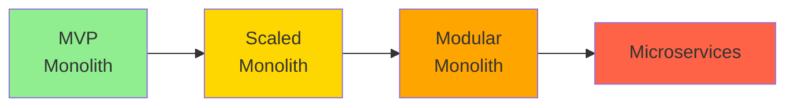
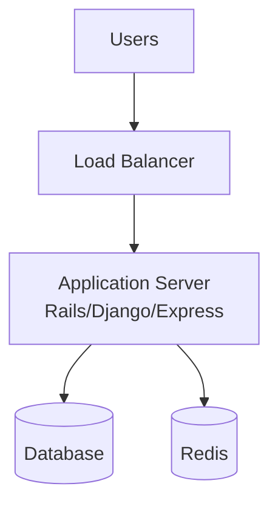
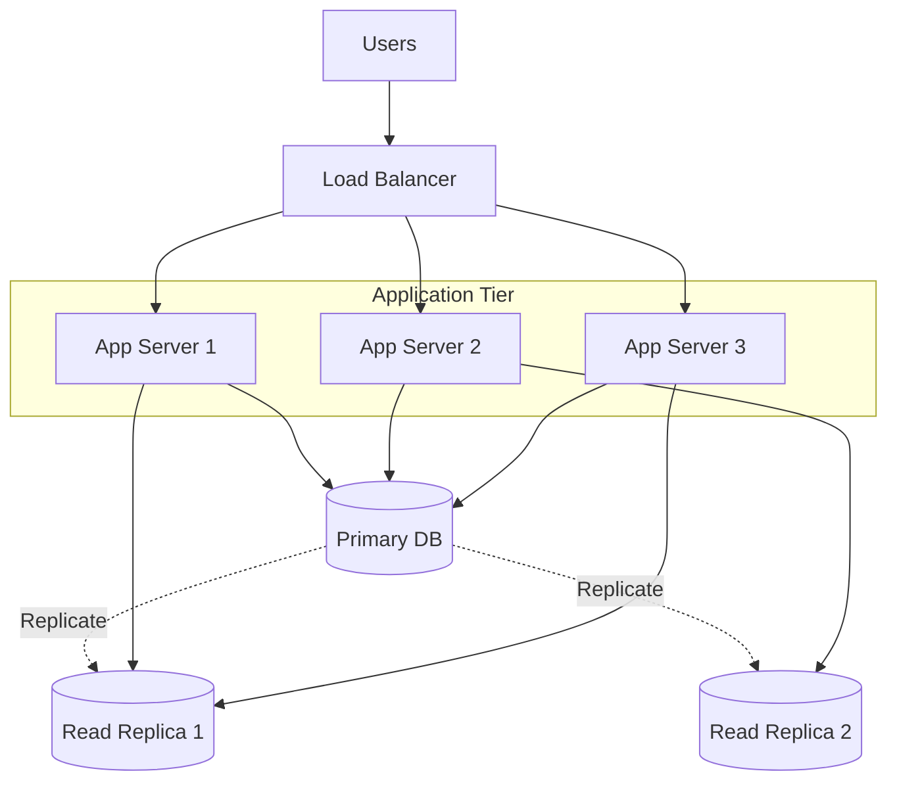
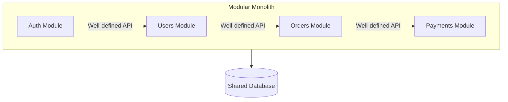
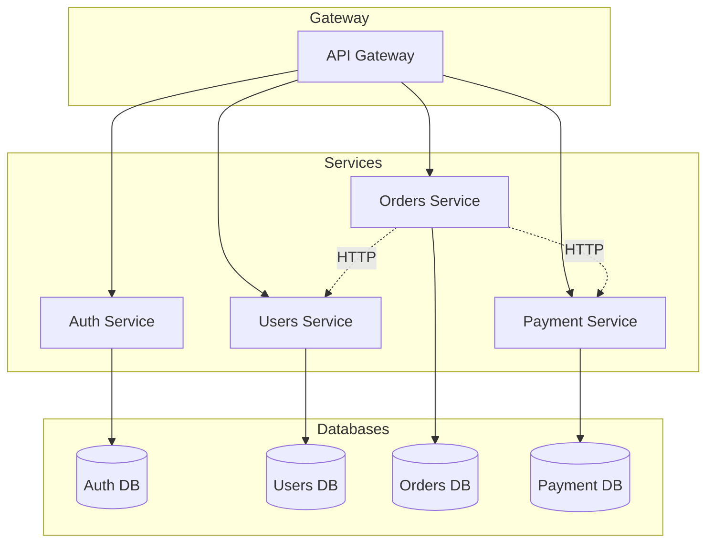
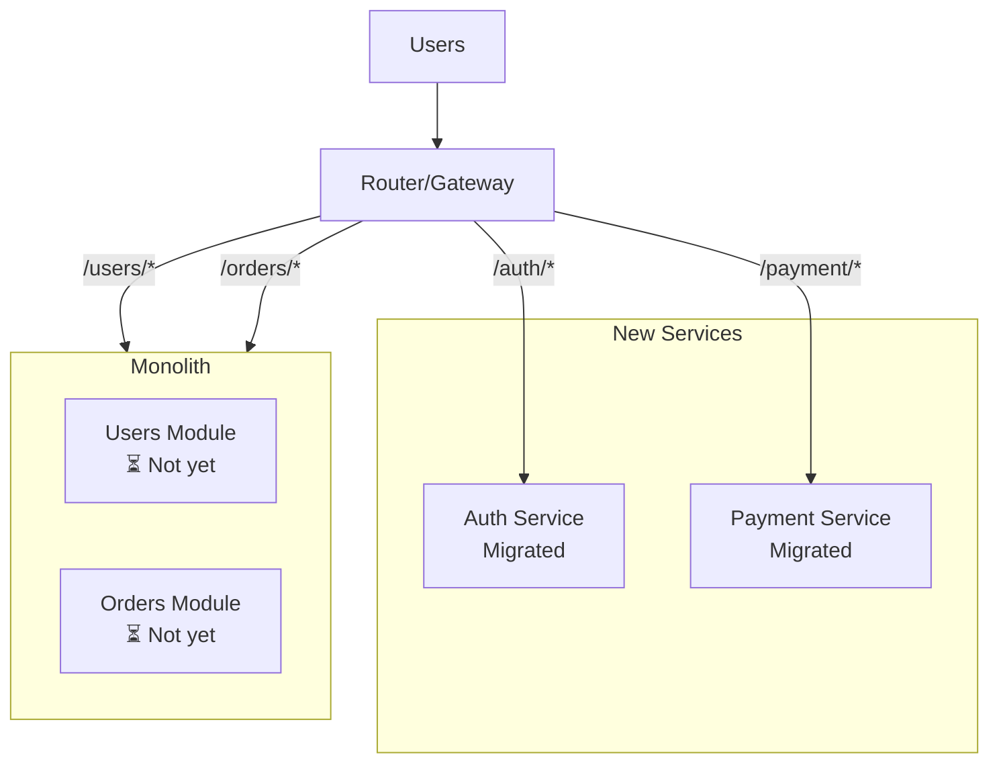
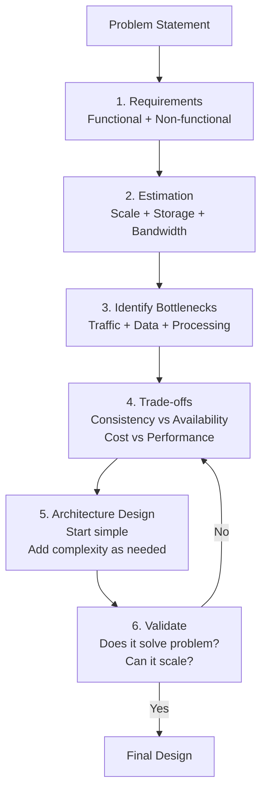

# Architecture Evolution Mindset - Start Simple, Scale Gradually

Có một sai lầm phổ biến mà developer mắc phải khi học system design:

**Học về microservices, Kubernetes, event-driven architecture → Nghĩ rằng mọi project đều cần những thứ này ngay từ đầu.**

**Đây là over-engineering - và nó kills startups.**

Bạn có biết:
- **Instagram:** Monolith Django app khi được Facebook mua với $1 billion
- **Shopify:** Monolith Rails app đến khi có hàng triệu merchants
- **Stack Overflow:** Monolith .NET app serve hàng tỷ requests/month
- **GitHub:** Monolith Rails app đến khi có 40+ million users

**Họ không bắt đầu với microservices. Họ evolved từ simple đến complex khi CẦN THIẾT.**

Lesson này - arguably quan trọng nhất trong Phase 5 - dạy bạn **architecture evolution mindset**:
- Khi nào dùng monolith, khi nào migrate
- Scale triggers thực tế
- Anti-patterns phải tránh
- Trade-off thinking

**Mental model:** "Start simple, evolve gradually" - không phải "Start complex vì sợ scale sau này".

## Architecture Evolution Stages

**Architecture không phải binary choice (monolith hay microservices). Là spectrum.**


**Mỗi stage phù hợp với scale và team size khác nhau.**

### Stage 1: MVP Monolith (0-10K Users)

**Single codebase, single database, single deployment.**


**Characteristics:**

**Pros:**
- Fastest development velocity
- Simple deployment (git push)
- Easy debugging (1 codebase)
- No distributed system complexity
- Low operational overhead

**Cons:**
- Single point of failure
- All code couples together
- Hard to scale specific parts
- One language/framework limitation

**Tech stack example:**
```
Frontend: React/Vue (served by same server)
Backend: Rails/Django/Laravel/Express
Database: PostgreSQL/MySQL
Cache: Redis
Deployment: Heroku/Railway/single VPS
```

**Khi nào dùng:**
- Pre-product-market-fit
- Startup &lt;10 engineers
- Traffic &lt;100 req/s
- Proving concept

**Real examples:**
- Basecamp (still monolith at massive scale)
- Shopify (started monolith)
- GitHub (started monolith)

### Stage 2: Scaled Monolith (10K-100K Users)

**Same codebase, thêm servers + database optimization.**


**Changes từ Stage 1:**

**Infrastructure:**
- Horizontal scaling (multiple app servers)
- Database read replicas
- CDN cho static assets
- Redis cluster cho sessions

**Code optimization:**
- Query optimization
- N+1 fixes
- Caching layer
- Background jobs (Sidekiq/Celery)

**Still monolith, nhưng scaled.**

**Khi nào migrate đến stage này:**
- Traffic 100-1000 req/s
- Single server CPU >70% consistently
- Response time degrading
- Team 10-30 engineers

**Cost vs complexity:**
```
Stage 1: $50-200/month
Stage 2: $500-2000/month
Complexity: +20%
```

**Reasonable trade-off cho growth.**

### Stage 3: Modular Monolith (100K-1M Users)

**Single deployment, nhưng code organized thành modules.**


**Module structure:**
```
/app
  /modules
    /auth
      - controllers/
      - services/
      - models/
      - api.ts (public interface)
    /users
      - controllers/
      - services/
      - models/
      - api.ts
    /orders
      - controllers/
      - services/
      - models/
      - api.ts
```

**Rules:**
- Modules communicate qua well-defined APIs
- No direct database access across modules
- Clear boundaries
- Preparation cho microservices (nếu cần)

**Benefits:**
- Team ownership (team A owns auth module)
- Easier testing (isolated modules)
- Can extract to microservice later
- Still monolith simplicity

**Khi nào dùng:**
- Team 30-100 engineers
- Complex domain logic
- Preparing for potential microservices
- Want team autonomy nhưng chưa ready cho microservices

**Real examples:**
- Shopify (modular monolith trước khi microservices)
- Basecamp (current architecture)

### Stage 4: Microservices (1M+ Users)

**Multiple independent services, mỗi service có database riêng.**


**Characteristics:**

**Pros:**
- Independent scaling
- Independent deployment
- Technology flexibility
- Team autonomy
- Fault isolation

**Cons:**
- Distributed system complexity
- Network latency
- Data consistency challenges
- Operational overhead
- Testing complexity
- Deployment complexity

**Khi nào migrate:**

**Migrate khi:**
- Team >100 engineers
- Clear domain boundaries
- Different scaling needs per module
- Organizational bottleneck với monolith
- Budget + expertise cho complexity

**KHÔNG migrate khi:**
- Team &lt;30 engineers
- Vague domain boundaries
- Premature optimization
- Chưa có DevOps expertise
- Budget limited

**Cost jump:**
```
Modular monolith: $2k-5k/month
Microservices: $10k-50k+/month

Infrastructure + DevOps team + monitoring + orchestration
```

**Complexity jump: 10x.**

## Scale Triggers - Khi Nào Evolve?

**Không evolve vì trend. Evolve vì pain points.**

### Trigger 1: Performance Bottleneck

**Symptom:**
```
Single bottleneck component:
- Image processing: 80% CPU
- Rest of app: 20% CPU
```

**Solution:** Extract image processing service.
```
Before: Monolith handles images
After: Separate image service
  → Scale independently
  → Use GPU instances
  → Don't waste resources on other parts
```

**Decision criteria:**
- Bottleneck clearly isolated
- Different resource needs (CPU vs memory vs GPU)
- Extract giải quyết problem

### Trigger 2: Team Scaling Bottleneck

**Symptom:**
```
Team size: 50 engineers
Deployment frequency: 1x/week
Merge conflicts: Daily
Waiting for deploys: Hours
```

**Everyone stepping on each other's toes.**

**Solution:** Split codebase theo team ownership.
```
Team Auth: Auth service
Team Payments: Payment service
Team Orders: Order service

Each team deploys independently
```

**Decision criteria:**
- Team >30-50 engineers
- Organizational structure clear
- Teams have distinct domains

### Trigger 3: Different Scaling Requirements

**Symptom:**
```
Orders service: 10 req/s
Image processing: 1000 req/s
Payment: 50 req/s
```

**Scaling entire monolith wastes resources.**

**Solution:** Extract high-traffic service.
```
Image processing → Separate service
  → Scale to 20 instances
Rest of app → 3 instances

Cost saving + better performance
```

### Trigger 4: Technology Limitations

**Symptom:**
```
Main app: Ruby (good for CRUD)
ML model: Need Python
Real-time: Need Node.js/Go
```

**Solution:** Polyglot architecture.
```
Main app: Ruby on Rails
ML service: Python + TensorFlow
WebSocket service: Node.js
```

**Different tools cho different jobs.**

### Non-Triggers (Không Nên Migrate)

**"We might scale in the future"**

Premature optimization. YAGNI (You Aren't Gonna Need It).

**"Microservices are best practice"**

Best practice cho who? Netflix? You're not Netflix.

**"Resume-driven development"**

Learning Kubernetes không justify project complexity.

**"Monolith feels messy"**

Clean up code structure. Modular monolith. Don't jump to microservices.

## Migration Strategy - Evolve Gradually

**NEVER rewrite toàn bộ hệ thống.**

### Strangler Fig Pattern

**Gradually replace monolith, piece by piece.**


**Process:**

**Phase 1:** Pick module to extract (least coupled)
```
Candidate: Payment service
Dependencies: Low
Impact: High value
```

**Phase 2:** Build new service
```
Replicate functionality
Add tests
Feature parity
```

**Phase 3:** Route traffic gradually
```
Week 1: 5% traffic to new service
Week 2: 25%
Week 3: 50%
Week 4: 100%
```

**Phase 4:** Deprecate old code
```
Monitor for errors
Remove from monolith
Celebrate 🎉
```

**Phase 5:** Repeat cho module tiếp theo

**Benefits:**
- Low risk (gradual rollout)
- Easy rollback
- Learn from each migration
- Business continuity

### Anti-Pattern: Big Bang Rewrite

**KHÔNG LÀM:**
```
1. Stop feature development
2. Rewrite everything to microservices
3. Big bang deployment
4. Hope it works
```

**Tại sao fail:**
- 6-12 months development freeze
- Business loses competitive edge
- Requirements change during rewrite
- Bugs in new system
- Can't rollback easily

**Famous failures:**
- Netscape (rewrote browser, lost to IE)
- Friendster (rewrote, lost to Facebook)

**Rule:** Evolve, don't rewrite.

## Anti-Patterns - Tránh Những Sai Lầm Này

### Anti-Pattern 1: Premature Microservices

**Scenario:**
```
Startup: 3 engineers, 0 users
Architecture: 15 microservices, Kubernetes, Kafka
```

**Problem:**
- Development velocity: glacial
- Debugging: nightmare
- Operational overhead: overwhelming
- Product-market-fit: never found

**Cost:**
- 3 months setup infrastructure
- 6 months fight with complexity
- Startup runs out of money
- Game over

**Right approach:**
```
Startup: 3 engineers, 0 users
Architecture: Monolith, Heroku, PostgreSQL

Product-market-fit: 6 months
Growth: Add features fast
Scale: Later problem
```

### Anti-Pattern 2: Kubernetes For Everything

**Scenario:**
```
Traffic: 10 req/s
Team: 5 engineers
Stack: Kubernetes cluster
```

**Problem:**
- Kubernetes learning curve: steep
- Operational complexity: high
- Cost: $500+/month (vs $50 Heroku)
- Value delivered: zero

**When Kubernetes makes sense:**
- Traffic >1000 req/s
- Team with DevOps expertise
- Complex deployment requirements
- Multi-cloud strategy

**Before Kubernetes, try:**
- Heroku/Railway/Render
- AWS Elastic Beanstalk
- Google App Engine
- Simple VPS + Docker Compose

### Anti-Pattern 3: Shared Database Across Services

**Scenario:**
```
Microservices architecture
All services → Same database
```

**Problem:**
- Tight coupling (defeats microservices purpose)
- Schema changes break everything
- Can't scale databases independently
- Transaction complexity

**Right approach:**
```
Each service → Own database
Communication via APIs/events
```

**Nếu shared database → bạn không có microservices, có distributed monolith.**

### Anti-Pattern 4: Nano-Services

**Scenario:**
```
User service
UserAuth service
UserProfile service
UserSettings service
UserPreferences service
```

**Too many tiny services.**

**Problem:**
- Network overhead
- Operational complexity
- Hard to understand flow
- Deployment nightmare

**Right granularity:**
```
User service (handles all user logic)
  ↳ Auth
  ↳ Profile
  ↳ Settings
  ↳ Preferences
```

**Service boundary = business capability, not function.**

### Anti-Pattern 5: Wrong Optimization

**Scenario:**
```
Optimize: Sharding database
Problem: Actually slow queries (missing indexes)

Optimize: Add caching layer
Problem: Actually N+1 queries

Optimize: Microservices
Problem: Actually monolith code mess
```

**Measure first, optimize second.**

**Process:**
1. Identify bottleneck (metrics)
2. Understand root cause (profiling)
3. Pick simplest solution
4. Measure improvement
5. Repeat

**KHÔNG skip step 1 và 2.**

## System Design Thinking Flow

**Structured approach cho architecture decisions.**


### Step 1: Requirements

**Functional requirements:**
```
What the system does:
- Users can upload photos
- Users can view feed
- Users can follow others
```

**Non-functional requirements:**
```
How well it does it:
- 10M daily active users
- p99 latency < 200ms
- 99.9% availability
- Photo upload < 5 seconds
```

### Step 2: Estimation

**Back-of-envelope calculations:**
```
Traffic:
- 10M DAU
- Each user: 20 requests/day
- Total: 200M requests/day
- Peak: 200M / 86400 * 3 = ~7000 req/s

Storage:
- 1M photos uploaded/day
- Average photo: 2MB
- Daily storage: 2TB/day
- Annual: 730TB

Bandwidth:
- Upload: 2TB/day = 23 MB/s
- Read:write ratio: 10:1
- Download: 230 MB/s
```

**Informs architecture decisions.**

### Step 3: Bottlenecks

**Based on estimations:**
```
7000 req/s → Need load balancing
2TB/day upload → Need object storage (S3)
High read traffic → Need CDN + caching
```

**Anticipate problems early.**

### Step 4: Trade-offs

**Every decision = trade-off.**
```
Cache photos?
  Pros: Fast access, reduce load
  Cons: Storage cost, cache invalidation
  Decision: Yes, cache hot photos (20% photos = 80% traffic)

Strong consistency?
  Pros: Always correct data
  Cons: Higher latency, complex
  Decision: Eventual consistency OK (social feed)

Microservices?
  Pros: Independent scaling
  Cons: Complexity, cost
  Decision: Start monolith, extract later if needed
```

**Explicit trade-off thinking.**

### Step 5: Design

**Start simple:**
```
MVP (0-100K users):
  - Monolith (Rails/Django)
  - PostgreSQL
  - Redis cache
  - S3 for photos
  - CDN

Evolution triggers:
  - >1M users → Add read replicas
  - >5M users → Consider modular monolith
  - >10M users → Evaluate microservices
```

**Plan evolution, don't build for 10M users on day 1.**

### Step 6: Validate

**Questions to ask:**
```
Does it meet requirements?
  - Functional: ✅
  - Non-functional: (at current scale)

Can it scale?
  - To 10x traffic: Yes (add servers)
  - To 100x traffic: Need re-architecture

Is it too complex?
  - Team can build: ✅
  - Team can operate: ✅

Cost reasonable?
  - MVP: $200/month ✅
  - At scale: $5k/month ✅
```

## Trade-off Mindset

**Every architecture decision = trade-off. No perfect solution.**

### Trade-off 1: Performance vs Complexity

**Example: Caching**
```
No cache:
  - Simple code
  - Slow reads (every request → database)
  - High database load

With cache:
  - Complex (cache invalidation)
  - Fast reads (memory access)
  - Lower database load
```

**Decision framework:**
- Read-heavy? → Cache worth it
- Write-heavy? → Cache less value
- Budget for complexity? → Cache OK
- Team expertise? → Simple first

### Trade-off 2: Consistency vs Availability

**CAP theorem reminder:**
```
Strong consistency:
  - Always correct data
  - May be unavailable (wait for sync)
  - Lower throughput

Eventual consistency:
  - High availability
  - Temporarily stale data
  - Higher throughput
```

**Decision:**
- Bank account: Strong consistency
- Social media feed: Eventual consistency
- Shopping cart: Session-based (middle ground)

### Trade-off 3: Cost vs Scale

**Example: Database**
```
Single PostgreSQL:
  - Cost: $50/month
  - Scale: ~1000 req/s
  - Simple

Sharded PostgreSQL:
  - Cost: $500/month
  - Scale: ~10,000 req/s
  - Complex

Managed service (Aurora):
  - Cost: $2000/month
  - Scale: ~50,000 req/s
  - Easier than sharding
```

**Pick based on current needs + budget.**

### Trade-off 4: Development Speed vs Flexibility

**Framework choice:**
```
Rails/Django:
  - Fast development
  - Conventions (less decisions)
  - Monolith-friendly

Go/Node microservices:
  - Slower initial development
  - More flexibility
  - Microservices-friendly
```

**Early stage: Speed wins.**  
**Mature product: Flexibility matters.**

### Trade-off Matrix

**Common decisions:**

| Decision | Simple | Complex | When Complex Worth It |
|----------|--------|---------|----------------------|
| Monolith vs Microservices | Monolith | Microservices | Team >50, clear domains |
| SQL vs NoSQL | SQL | NoSQL | Massive scale, flexible schema |
| Sync vs Async | Sync | Async | High latency operations |
| Single DB vs Sharding | Single | Sharding | >10K writes/s |
| Self-hosted vs Managed | Self | Managed | Team &lt;10, focus on product |

## Mental Model: Start Simple, Evolve Gradually

**Core principle của good architecture.**

### The Principle

**"Premature optimization is the root of all evil." - Donald Knuth**

**Applied to architecture:**
```
Don't build for scale you don't have
Don't solve problems you don't have yet
Don't add complexity until pain is real
```

**Why?**

**1. Requirements change**
```
Week 1: Building Instagram clone
Week 10: Pivot to B2B analytics
Week 20: Pivot to AI chatbot

Complex architecture → wasted effort
```

**2. Scale assumptions wrong**
```
Plan: 1M users in year 1
Reality: 10K users

Over-engineered for ghost town
```

**3. Team learning**
```
Monolith:
  - Ship features fast
  - Learn user needs
  - Iterate quickly

Microservices:
  - Fight with infrastructure
  - Slow feature development
  - Miss market window
```

### The Evolution Path

**Healthy progression:**
```
Month 1-3: MVP monolith
  → Validate idea
  → Get users
  
Month 3-12: Scaled monolith
  → Optimize performance
  → Add infrastructure (CDN, cache, replicas)
  
Year 1-2: Modular monolith
  → Clean up architecture
  → Prepare for team scaling
  
Year 2+: Selective microservices
  → Extract bottlenecks
  → Independent scaling where needed
```

**Unhealthy progression:**
```
Month 1: 15 microservices, Kubernetes
Month 2: Fighting infrastructure
Month 3: Out of money
```

### Decision Framework

**When faced with architecture choice:**
```
Question: Should we use [complex solution]?

Ask:
1. Do we have the problem it solves? (YES/NO)
2. Have we tried simpler solutions? (YES/NO)
3. Do we have expertise? (YES/NO)
4. Do we have budget? (YES/NO)

If ANY answer is NO → Don't do it yet
```

**Examples:**
```
"Should we use Kubernetes?"
- Have scaling problem? NO → Wait
- Tried managed platforms? NO → Try Heroku first
- Have DevOps expertise? NO → Learn on simpler platform
- Have budget ($500+/month)? NO → Use cheaper options

"Should we split to microservices?"
- Have team scaling problem? NO → Wait
- Tried modular monolith? NO → Refactor monolith first
- Have clear service boundaries? NO → Not ready
- Have budget for complexity? NO → Stay monolith
```

## Key Takeaways

**1. Architecture evolves: Monolith → Scaled → Modular → Microservices**

Each stage appropriate cho scale và team size khác nhau.

**2. Monolith không phải bad word**

Shopify, GitHub, Basecamp scale massively với monolith. Start simple.

**3. Migration triggers phải real pain, không speculation**

Performance bottleneck, team scaling, different resource needs.

**4. Strangler fig pattern > big bang rewrite**

Migrate gradually, piece by piece. Low risk, easy rollback.

**5. Anti-patterns: Premature microservices, Kubernetes overkill, shared databases**

Avoid complexity không cần thiết. Measure problem trước khi solve.

**6. System design flow: Requirements → Estimation → Bottlenecks → Trade-offs → Design**

Structured thinking process cho architecture decisions.

**7. Every decision = trade-off**

Performance vs complexity, consistency vs availability, cost vs scale.

**8. Start simple, evolve gradually**

Don't build cho scale you don't have. YAGNI principle.

**9. Validate assumptions với data**

Measure traffic, profile performance, understand real bottlenecks.

**10. Team expertise matters more than technology**

Simple stack team knows > complex stack team struggles với.

---

Nhưng luôn nhớ: **patterns là tools, không phải requirements. Dùng khi cần, không vì trend.**

**Remember: Instagram was acquired for $1 billion as a monolith. Complexity doesn't create value - solving user problems does. Start simple, evolve when pain is real, and always question if added complexity is worth it.**