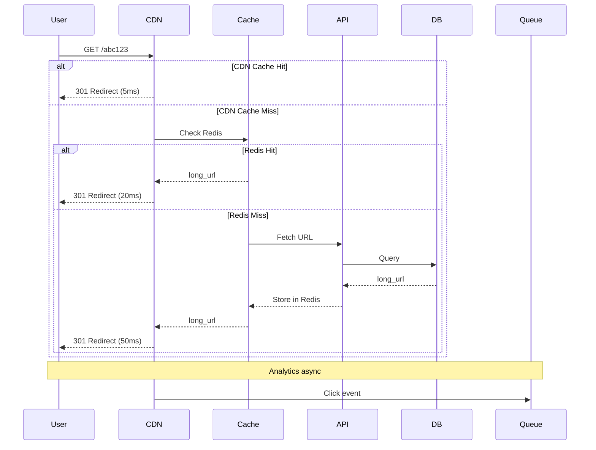
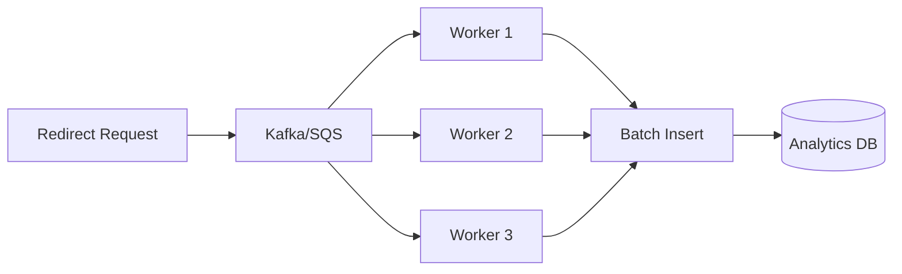
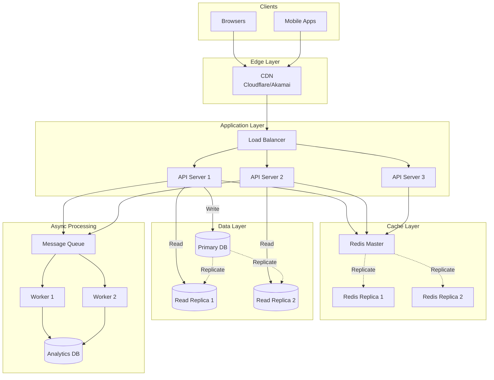
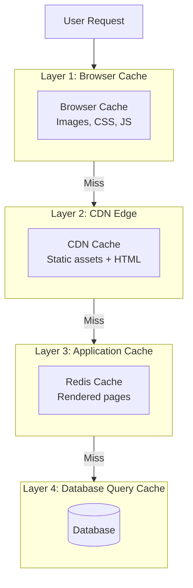
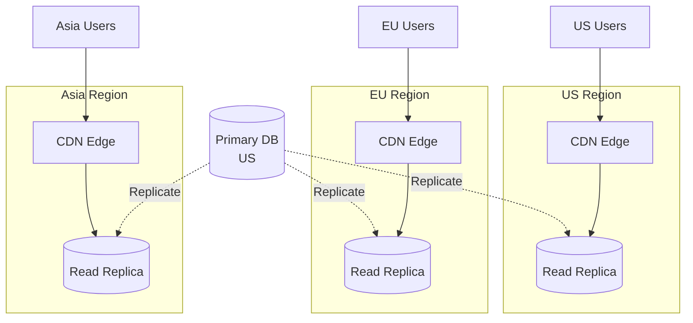

# Read-Heavy Systems - Design Cho 99% Reads

Hầu hết systems trong real world có chung một characteristic:

**Reads >> Writes (thường 100:1 hoặc 1000:1).**

**Examples:**
- **URL shortener:** 1 write (create short URL), 1000+ reads (redirects)
- **YouTube:** 1 upload, 10,000+ views
- **Twitter:** 1 tweet, 100+ reads
- **News site:** 1 article publish, 1,000,000 reads

**Đây là read-heavy system - pattern phổ biến nhất mà bạn sẽ gặp.**

Read-heavy systems có characteristics rất khác write-heavy:
- Database writes không phải bottleneck
- Cache hit rate critical (90%+ = success)
- Eventual consistency acceptable
- Async processing cho analytics

Lesson này dạy bạn thiết kế read-heavy systems qua 2 case studies thực tế:

**1. URL Shortener (TinyURL/Bitly pattern)**
- ID generation strategy
- Redirect optimization
- Cache-first architecture
- Analytics pipeline

**2. Content Delivery System**
- Multi-layer caching
- Global distribution
- Cache invalidation

**Mental model:** Cache → Database → Async pipeline.

## Read-Heavy Characteristics

### Traffic Pattern

**Write-heavy system:**
```
Writes: 1000/s
Reads:  1000/s
Ratio:  1:1

Database: Write bottleneck
Scaling: Complex (sharding, replication)
```

**Read-heavy system:**
```
Writes: 10/s
Reads:  10,000/s
Ratio:  1:1000

Database: Not bottleneck (few writes)
Scaling: Simple (cache aggressively)
```

### Design Priorities

**Read-heavy priorities:**

**1. Cache hit rate**
- Target: 90-99%
- Every cache miss = expensive database query
- Optimize for hot data

**2. Read latency**
- Users feel read latency immediately
- Write latency less critical (can be async)

**3. Availability**
- Reads must work even if writes down
- Read replicas for redundancy

**4. Cost efficiency**
- Cache cheap (RAM)
- Database expensive (disk + compute)
- 90% cache hit = 10x cost saving

### Architecture Pattern
```mermaid
flowchart TB
    User[User Request]
    
    subgraph ReadPath["Read Path (Hot)"]
        Cache1[L1: Application Cache]
        Cache2[L2: Redis Cache]
        CDN[L3: CDN Cache]
    end
    
    subgraph WritePath["Write Path (Cold)"]
        API[API Server]
        DB[(Database)]
        Queue[Message Queue]
    end
    
    subgraph Analytics["Analytics (Async)"]
        Worker[Worker]
        Analytics[(Analytics DB)]
    end
    
    User -->|99% requests| ReadPath
    User -->|1% requests| WritePath
    
    ReadPath -->|Cache miss| DB
    
    API --> DB
    API --> Queue
    Queue --> Worker
    Worker --> Analytics
```

**Read path optimized for speed.**  
**Write path optimized for reliability.**  
**Analytics decoupled (async).**

## Case Study 1: URL Shortener (TinyURL/Bitly)

**System requirements:**
```
Functional:
- Generate short URL from long URL
- Redirect short URL to long URL
- Track click analytics

Non-functional:
- 100M URLs created/month
- 10B redirects/month (100:1 ratio)
- Latency: &lt;50ms for redirects
- Availability: 99.99%
```

### Capacity Estimation

**Traffic:**
```
URLs created: 100M/month
  = ~40 URLs/second

Redirects: 10B/month
  = ~4000 redirects/second
```

**Storage:**
```
Per URL:
- short_id: 7 bytes
- long_url: 200 bytes (average)
- metadata: 50 bytes
Total: ~250 bytes

100M URLs/month * 250 bytes = 25 GB/month
5 years: 1.5 TB
```

**Bandwidth:**
```
Redirects: 4000/s * 250 bytes = 1 MB/s
With safety margin: 5 MB/s
```

**Cache size:**
```
Hot URLs (20% of data):
1.5 TB * 0.2 = 300 GB

With replication (3x): 1 TB cache
```

### ID Generation Strategy

**Requirements:**
- Short (6-7 characters)
- Unique
- Random (not sequential - security)

#### Approach 1: Hash + Collision Detection
```python
import hashlib
import base62

def generate_short_id(long_url):
    # Hash long URL
    hash_bytes = hashlib.md5(long_url.encode()).digest()
    
    # Take first 8 bytes
    hash_int = int.from_bytes(hash_bytes[:8], 'big')
    
    # Convert to base62
    short_id = base62.encode(hash_int)[:7]
    
    # Check collision in database
    if db.exists(short_id):
        # Handle collision (add counter, retry)
        short_id = handle_collision(long_url)
    
    return short_id
```

**Pros:**
- Deterministic (same URL → same short ID)
- Fast generation

**Cons:**
- Collision possible (need detection)
- Database check on every generation

#### Approach 2: Auto-increment ID + Base62
```python
import base62

def generate_short_id():
    # Get next ID from database
    id = db.get_next_id()  # Auto-increment
    
    # Convert to base62
    short_id = base62.encode(id)
    
    return short_id

# Example:
# ID 1 → "1"
# ID 62 → "10"
# ID 3844 → "100"
# ID 56800235584 → "zzzzzzz" (7 chars)
```

**Base62 character set:**
```
[0-9][a-z][A-Z] = 62 characters
```

**Capacity:**
```
6 characters: 62^6 = 56 billion URLs
7 characters: 62^7 = 3.5 trillion URLs
```

**Pros:**
- No collisions
- Simple logic
- Predictable capacity

**Cons:**
- Sequential (security concern)
- Single point of failure (ID generator)

#### Approach 3: Distributed ID Generation (Production)
```python
# Use Twitter Snowflake or similar
def generate_short_id():
    # Snowflake generates 64-bit ID
    id = snowflake.generate()
    
    # Convert to base62
    short_id = base62.encode(id)
    
    return short_id

# Snowflake structure:
# [timestamp: 41 bits][datacenter: 5 bits][machine: 5 bits][sequence: 12 bits]
```

**Pros:**
- No collisions
- No single point of failure
- Time-ordered (useful for analytics)
- High throughput

**Used by:** Twitter, Instagram, Discord

### Database Schema
```sql
-- URLs table
CREATE TABLE urls (
    short_id VARCHAR(7) PRIMARY KEY,
    long_url VARCHAR(2048) NOT NULL,
    user_id BIGINT,
    created_at TIMESTAMP DEFAULT NOW(),
    expires_at TIMESTAMP NULL,
    
    INDEX idx_user_id (user_id),
    INDEX idx_created_at (created_at)
);

-- Analytics table (separate for performance)
CREATE TABLE url_clicks (
    short_id VARCHAR(7),
    clicked_at TIMESTAMP,
    user_agent TEXT,
    ip_address VARCHAR(45),
    country VARCHAR(2),
    
    INDEX idx_short_id_time (short_id, clicked_at)
) PARTITION BY RANGE (clicked_at);
```

**Why separate tables:**
- URLs: Small, read-heavy, cacheable
- Clicks: Large, write-heavy, append-only

### Redirect Flow (Optimized)


**Cache layers:**
1. **CDN edge:** 80-90% hit rate, &lt;5ms
2. **Redis:** 95-99% hit rate, &lt;20ms
3. **Database:** 1-5% miss, &lt;50ms

**Target: p99 latency &lt;50ms.**

### API Implementation
```python
from flask import Flask, redirect, request
import redis
import hashlib

app = Flask(__name__)
cache = redis.Redis(host='redis', decode_responses=True)

@app.route('/<short_id>')
def redirect_url(short_id):
    # Check cache first
    long_url = cache.get(f"url:{short_id}")
    
    if not long_url:
        # Cache miss - query database
        url = db.query(
            "SELECT long_url FROM urls WHERE short_id = ?",
            short_id
        )
        
        if not url:
            return "URL not found", 404
        
        long_url = url['long_url']
        
        # Store in cache (24h TTL)
        cache.setex(f"url:{short_id}", 86400, long_url)
    
    # Track analytics (async)
    track_click.delay(short_id, request)
    
    # Redirect (301 permanent)
    return redirect(long_url, code=301)

@app.route('/api/shorten', methods=['POST'])
def create_short_url():
    long_url = request.json['url']
    
    # Validate URL
    if not is_valid_url(long_url):
        return {"error": "Invalid URL"}, 400
    
    # Generate short ID
    short_id = generate_short_id(long_url)
    
    # Store in database
    db.execute(
        "INSERT INTO urls (short_id, long_url, user_id) VALUES (?, ?, ?)",
        short_id, long_url, current_user.id
    )
    
    # Warm cache
    cache.setex(f"url:{short_id}", 86400, long_url)
    
    return {
        "short_url": f"https://short.ly/{short_id}",
        "long_url": long_url
    }
```

### Cache Strategy

**Cache hot URLs aggressively:**
```python
# Cache tiers
class URLCache:
    def __init__(self):
        self.l1 = {}  # In-memory (application)
        self.l2 = redis.Redis()  # Redis cluster
        self.l3 = None  # CDN (edge)
    
    def get(self, short_id):
        # L1: Application memory (microseconds)
        if short_id in self.l1:
            metrics.increment('cache.l1.hit')
            return self.l1[short_id]
        
        # L2: Redis (milliseconds)
        long_url = self.l2.get(f"url:{short_id}")
        if long_url:
            metrics.increment('cache.l2.hit')
            self.l1[short_id] = long_url  # Populate L1
            return long_url
        
        # L3: Database (tens of milliseconds)
        metrics.increment('cache.miss')
        long_url = db.get_url(short_id)
        
        if long_url:
            # Populate all cache layers
            self.l1[short_id] = long_url
            self.l2.setex(f"url:{short_id}", 86400, long_url)
        
        return long_url
```

**Cache eviction:**
```python
# LRU eviction in Redis
redis_config = {
    'maxmemory': '10gb',
    'maxmemory-policy': 'allkeys-lru'
}

# Hot URLs stay cached
# Cold URLs evicted automatically
```

**Cache warming:**
```python
# Warm cache with popular URLs
def warm_cache():
    popular_urls = db.query("""
        SELECT short_id, long_url
        FROM urls
        WHERE created_at > NOW() - INTERVAL '7 days'
        ORDER BY click_count DESC
        LIMIT 10000
    """)
    
    for url in popular_urls:
        cache.setex(f"url:{url['short_id']}", 86400, url['long_url'])
```

### Analytics Pipeline (Async)

**Problem:** Don't slow down redirects với analytics writes.

**Solution:** Async processing.


**Implementation:**
```python
from celery import Celery

app = Celery('tasks', broker='redis://localhost')

@app.task
def track_click(short_id, request_data):
    # Extract analytics data
    analytics = {
        'short_id': short_id,
        'clicked_at': datetime.now(),
        'ip_address': request_data.remote_addr,
        'user_agent': request_data.user_agent.string,
        'referer': request_data.referrer,
        'country': geoip.lookup(request_data.remote_addr)
    }
    
    # Batch insert (better performance)
    analytics_buffer.append(analytics)
    
    if len(analytics_buffer) >= 1000:
        db.bulk_insert('url_clicks', analytics_buffer)
        analytics_buffer.clear()
```

**Batch processing:**
```python
# Write clicks in batches
def batch_write_clicks():
    while True:
        clicks = queue.get_batch(size=5000)
        
        if clicks:
            # Bulk insert (much faster)
            db.bulk_insert("""
                INSERT INTO url_clicks 
                (short_id, clicked_at, ip_address, user_agent, country)
                VALUES %s
            """, clicks)
            
            # Update click counts
            update_click_counts(clicks)
        
        time.sleep(1)
```

### Sharding Strategy

**When to shard:** >10M URLs, write throughput bottleneck.

**Shard by short_id:**
```python
def get_shard(short_id):
    # Hash short_id to determine shard
    shard_num = hash(short_id) % NUM_SHARDS
    return shards[shard_num]

# Example: 4 shards
# short_id "abc123" → hash → shard 2
# short_id "xyz789" → hash → shard 3
```

**Benefits:**
- Even distribution
- No hotspots
- Queries always target 1 shard

**Drawback:**
- Range queries across all shards
- User's URLs scattered across shards

**Alternative: Shard by user_id**
```python
def get_shard(user_id):
    return shards[user_id % NUM_SHARDS]
```

**Benefits:**
- User's URLs on same shard
- Queries by user_id efficient

**Drawback:**
- Redirects need lookup table (short_id → shard)

### Complete Architecture


**Hoàn chỉnh architecture cho URL shortener scale.**

### Key Optimizations

**1. Permanent redirects (301)**
```python
# 301 = browser caches redirect
return redirect(long_url, code=301)

# Users won't hit server on subsequent visits
```

**2. CDN caching**
```python
# Cache-Control header
response.headers['Cache-Control'] = 'public, max-age=86400'
```

**3. DNS prefetch**
```html
<!-- In landing page -->
<link rel="dns-prefetch" href="//short.ly">
```

**4. Connection pooling**
```python
# Reuse database connections
db_pool = ConnectionPool(max_connections=100)
```

**5. Read replicas**
```python
# Route reads to replicas
if operation == 'read':
    db = read_replica
else:
    db = primary_db
```

## Case Study 2: Content Delivery System

**Examples:** WordPress, Medium, News sites

**Characteristics:**
- Write once, read millions
- Heavy media (images, videos)
- Global audience
- SEO critical

### Multi-Layer Caching


**Cache hit rates:**
- Browser: 50-60% (returning visitors)
- CDN: 80-90% (popular content)
- Redis: 95-99% (hot data)
- Database: 1-5% (cache misses)

### Content Type Strategy

**Static assets (images, CSS, JS):**
```http
Cache-Control: public, max-age=31536000, immutable
```

**Aggressive caching, versioned URLs:**
```
/static/app.v123.js
/images/logo.abc123.png
```

**HTML pages:**
```http
Cache-Control: public, max-age=300, s-maxage=3600
```

**Browser: 5 minutes, CDN: 1 hour.**

**API responses:**
```http
Cache-Control: public, max-age=60
```

**Short TTL, frequent updates.**

### Cache Invalidation

**Problem:** Content updated, cache stale.

**Strategy 1: TTL-based**
```python
# Short TTL for frequently updated content
cache.setex('article:123', 300, article_html)  # 5 minutes
```

**Pros:** Simple, eventual consistency  
**Cons:** Delay before fresh content

**Strategy 2: Event-based**
```python
# Invalidate on update
@app.route('/admin/article/<id>', methods=['PUT'])
def update_article(id):
    # Update database
    db.update_article(id, data)
    
    # Invalidate all caches
    cache.delete(f'article:{id}')
    cdn.purge(f'/article/{id}')
    
    return {"status": "updated"}
```

**Pros:** Immediate consistency  
**Cons:** Complex, API rate limits

**Strategy 3: Versioned URLs**
```python
# Include version in URL
def article_url(article):
    return f"/article/{article.id}?v={article.updated_at.timestamp()}"

# Old URL cached, new URL = cache miss
```

**Pros:** Simple, no invalidation needed  
**Cons:** Cluttered URLs

**Hybrid approach (production):**
```python
# Static assets: versioned URLs
/static/app.v123.js

# HTML pages: short TTL + event invalidation
cache.setex('page:home', 300, html)  # 5 min TTL
on_update: cache.delete('page:home')  # Immediate

# API: very short TTL
cache.setex('api:posts', 60, json)  # 1 min TTL
```

### Database Modeling For Reads

**Denormalization for performance:**
```sql
-- Normalized (slow - requires JOIN)
SELECT a.*, u.name, u.avatar
FROM articles a
JOIN users u ON a.author_id = u.id
WHERE a.id = 123;

-- Denormalized (fast - single query)
CREATE TABLE articles (
    id BIGINT PRIMARY KEY,
    title VARCHAR(200),
    content TEXT,
    author_id BIGINT,
    author_name VARCHAR(100),  -- Denormalized
    author_avatar VARCHAR(255), -- Denormalized
    created_at TIMESTAMP
);

SELECT * FROM articles WHERE id = 123;
```

**Trade-off:** Storage + update complexity vs read performance.

**Materialized views:**
```sql
-- Pre-computed popular articles
CREATE MATERIALIZED VIEW popular_articles AS
SELECT 
    a.*,
    COUNT(v.id) as view_count,
    COUNT(c.id) as comment_count
FROM articles a
LEFT JOIN views v ON a.id = v.article_id
LEFT JOIN comments c ON a.id = c.article_id
WHERE a.published_at > NOW() - INTERVAL '7 days'
GROUP BY a.id
ORDER BY view_count DESC
LIMIT 100;

-- Refresh periodically
REFRESH MATERIALIZED VIEW popular_articles;
```

**Query directly from view - instant results.**

### Global Deployment

**Multi-region architecture:**


**Benefits:**
- Low latency worldwide
- Redundancy (region failure)

**Challenges:**
- Replication lag (eventual consistency)
- Higher cost

### Image Optimization

**Critical for content sites.**

**Responsive images:**
```html

```

**Browser loads appropriate size.**

**Format optimization:**
```python
# Serve WebP to supporting browsers
def serve_image(image_id):
    accepts_webp = 'image/webp' in request.headers.get('Accept', '')
    
    if accepts_webp:
        return f"/images/{image_id}.webp"
    else:
        return f"/images/{image_id}.jpg"
```

**WebP: 30% smaller than JPEG.**

**Lazy loading:**
```html

```

**Load images khi scroll vào view.**

**CDN image processing:**
```
Original: /images/photo.jpg
Resize: /images/photo.jpg?w=800&h=600
Optimize: /images/photo.jpg?format=webp&quality=80
```

**Cloudflare, Cloudinary, Imgix support này.**

## Cache-First Thinking

**Mindset shift cho read-heavy systems.**

### Traditional Flow
```
User request → API → Database → Response
```

**Every request hits database - slow, expensive.**

### Cache-First Flow
```
User request → Cache (hit) → Response (fast)
              → Cache (miss) → Database → Cache → Response
```

**99% requests serve từ cache - fast, cheap.**

### Design Questions

**When designing read-heavy system, ask:**

**1. What's the read/write ratio?**
```
If 100:1 or higher → Cache-first architecture
```

**2. What's the hot data set?**
```
Identify 20% data = 80% traffic
Cache này aggressively
```

**3. How fresh must data be?**
```
Real-time: Short TTL (seconds)
Near-real-time: Medium TTL (minutes)
Eventually consistent: Long TTL (hours)
```

**4. What's acceptable cache miss rate?**
```
Target: 90-99% cache hit
Measure và optimize
```

**5. Where to cache?**
```
Browser → CDN → Application → Database
Multiple layers = higher hit rate
```

### Cache Warming

**Don't wait for cache misses.**
```python
# Warm cache on deploy
def warm_cache():
    # Popular articles
    articles = db.query("""
        SELECT id, rendered_html
        FROM articles
        WHERE view_count > 1000
        ORDER BY view_count DESC
        LIMIT 1000
    """)
    
    for article in articles:
        cache.setex(
            f'article:{article.id}',
            3600,
            article.rendered_html
        )
    
    # User sessions
    sessions = db.query("SELECT * FROM active_sessions")
    for session in sessions:
        cache.setex(f'session:{session.id}', 1800, session.data)
```

**Proactive caching = consistent performance.**

## Key Patterns Summary

### Pattern 1: Multi-Layer Cache
```
Browser → CDN → Redis → Database
```

**Each layer catches different traffic.**

### Pattern 2: Async Analytics
```
Request → Quick response
        → Queue event
        → Worker processes
        → Analytics DB
```

**Don't slow down reads với analytics writes.**

### Pattern 3: Denormalization
```
JOIN 3 tables → Slow
Denormalized table → Fast
```

**Trade storage cho read performance.**

### Pattern 4: Read Replicas
```
Writes → Primary
Reads → Replicas (3-5x)
```

**Scale reads horizontally.**

### Pattern 5: Permanent Redirects
```
HTTP 301 → Browser caches
HTTP 302 → Browser doesn't cache
```

**Use 301 cho stable URLs.**

## Key Takeaways

**1. Read-heavy systems = cache-first architecture**

90-99% cache hit rate critical. Multiple cache layers.

**2. URL shortener pattern: ID generation + aggressive caching**

Base62 encoding, multi-layer cache, async analytics.

**3. Content delivery: Multi-layer caching + CDN**

Browser → CDN → Application → Database.

**4. ID generation strategies: Hash, auto-increment, Snowflake**

Snowflake best cho distributed systems.

**5. Async analytics pipeline**

Don't slow down reads. Queue → Workers → Analytics DB.

**6. Cache invalidation strategies: TTL, event-based, versioned URLs**

Hybrid approach in production.

**7. Database denormalization for reads**

Trade storage + update complexity cho query performance.

**8. Sharding by ID for even distribution**

Avoid hotspots, scale writes.

**9. Global deployment với read replicas**

Low latency worldwide, eventual consistency acceptable.

**10. Monitor cache hit rate continuously**

Target 90-99%. Optimize hot data caching.

---

**Remember: For read-heavy systems, cache is not optimization - it's the architecture. Design cache-first, not cache-as-afterthought. 99% of your users should never hit the database.**