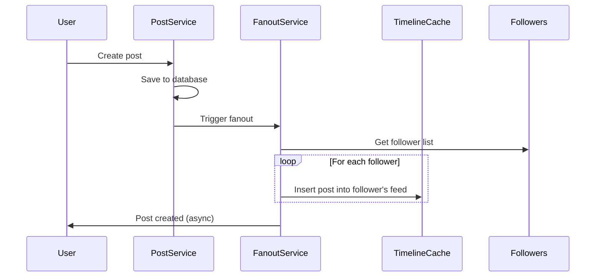
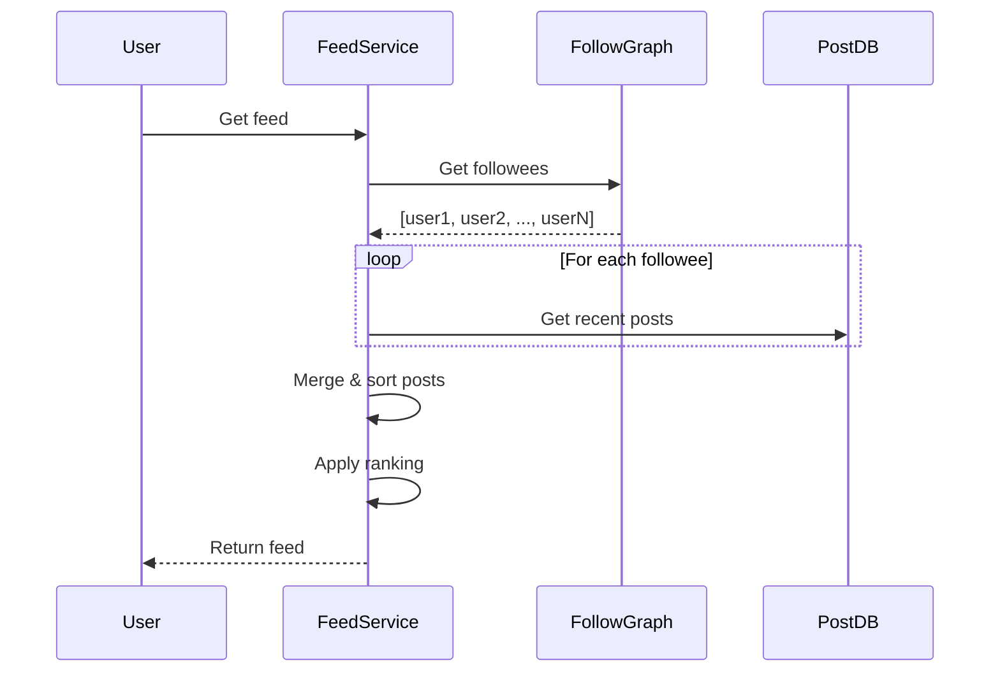
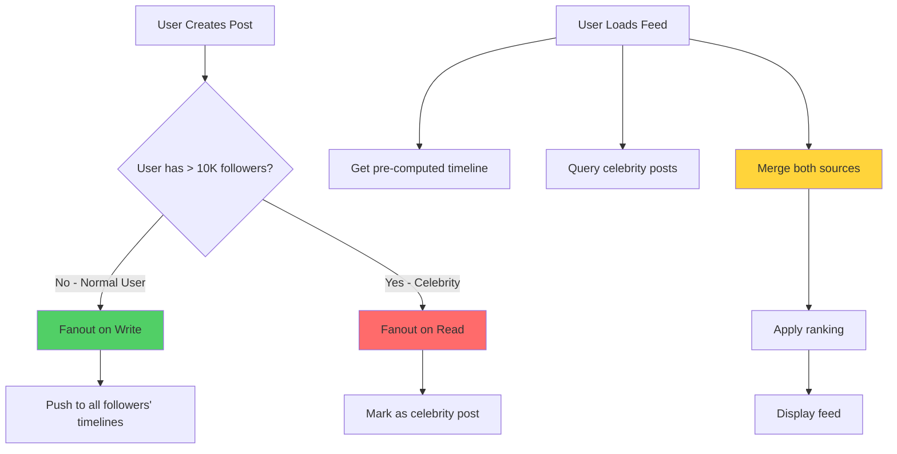
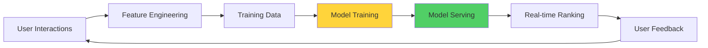
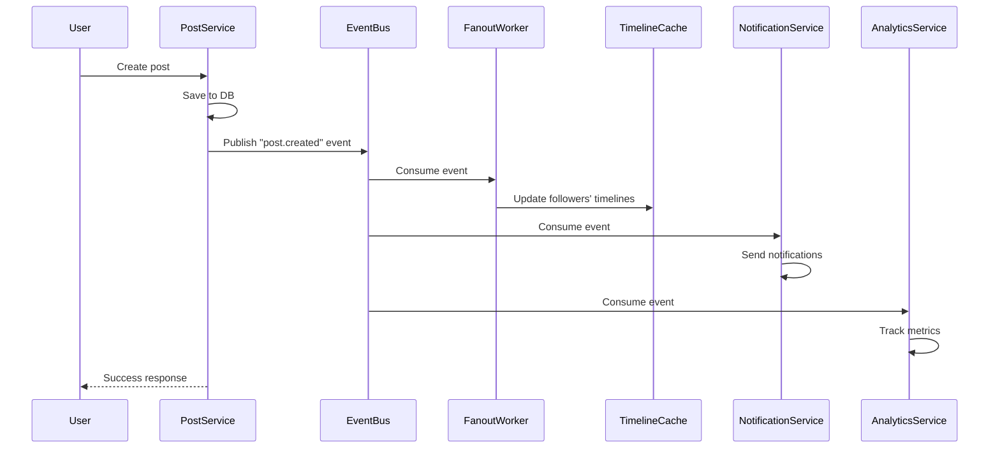
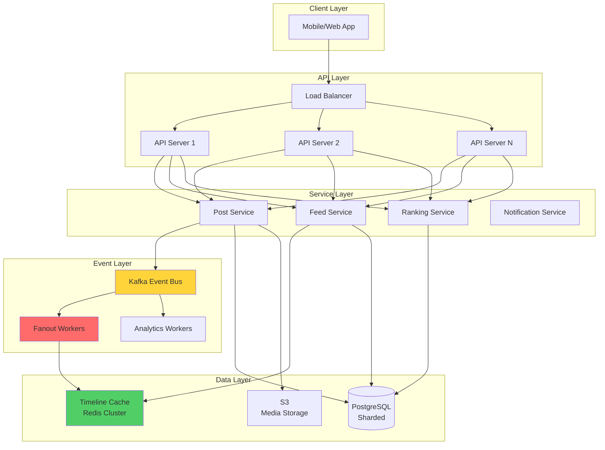

# Social Feed Systems: Kiến Trúc Phức Tạp Nhất

Tôi còn nhớ lần đầu được assign task: "Thiết kế news feed cho social network".

Tôi nghĩ đơn giản: *"Query posts của người user follow, sort by time, done."*

Senior architect nhìn tôi: *"Với 1 triệu users, mỗi người follow 500 người, mỗi người post 10 lần/ngày. Em tính sao?"*

Tôi tính nhanh:
- Load feed = Query 500 users × 10 posts = 5,000 posts
- Sort 5,000 posts
- 1 triệu users làm việc này → 1 triệu × 5,000 queries = 5 tỷ queries
- Database chết ngay

Senior cười: *"Welcome to fanout problem. Đây là lý do Facebook phải build infrastructure riêng."*

Đó là lúc tôi học: **Feed systems là kiến trúc phức tạp nhất trong consumer apps.**

## Tại Sao Feed Systems Khó?

### The Core Challenge

**Problem statement:**
```
User opens app → See personalized feed
- Posts từ người họ follow
- Sorted by relevance/time
- Load < 500ms
- Million concurrent users

Sounds simple. Reality: Nightmare.
```

**Scale calculation:**
```
Platform: 100M users
Average follows: 200 people
Average posts: 2 posts/day per user

Naive approach (Query on read):
User load feed:
→ Query 200 followees
→ Get latest posts from each
→ Merge 400 posts
→ Sort by time
→ Apply ranking

With 100M users:
→ 100M users × 200 queries = 20 billion database queries/day
→ Database melts
```

**Why it's hard:**
```
1. Read amplification
   - Mỗi feed load = hundreds of reads
   - Cannot cache (personalized per user)

2. Write amplification  
   - 1 post → thousands of followers see it
   - How to propagate efficiently?

3. Personalization
   - Each user sees different feed
   - Ranking depends on user history
   - Cannot simple cache

4. Consistency trade-offs
   - User posts → How fast followers see?
   - Eventual consistency acceptable?

5. Celebrities problem
   - User với 100M followers
   - 1 post = 100M feed updates?
```

**Key insight:** Feed systems force bạn confront mọi distributed systems challenges cùng lúc.

## Fanout Strategies: Core Architecture Decision

**Fanout = Cách distribute 1 post đến feeds của followers**

Có 3 approaches fundamentally khác nhau. Mỗi approach có trade-offs sâu sắc.

### Approach 1: Fanout on Write (Push Model)

**Concept: Pre-compute feeds khi user posts**


*Fanout on write: Khi user post, immediately push vào feed của tất cả followers*

**Implementation:**
```python
class FanoutOnWriteService:
    def create_post(self, user_id, content):
        # 1. Save post to database
        post = self.db.create_post({
            'user_id': user_id,
            'content': content,
            'created_at': datetime.now()
        })
        
        # 2. Get followers
        follower_ids = self.db.get_followers(user_id)
        
        # 3. Fanout to all followers (async via queue)
        for follower_id in follower_ids:
            self.queue.publish({
                'task': 'insert_into_timeline',
                'follower_id': follower_id,
                'post_id': post.id
            })
        
        return {'status': 'success', 'post_id': post.id}

class FanoutWorker:
    def process_fanout(self, message):
        follower_id = message['follower_id']
        post_id = message['post_id']
        
        # Insert into follower's timeline cache (Redis sorted set)
        self.redis.zadd(
            f"timeline:{follower_id}",
            {post_id: timestamp}
        )
        
        # Keep only recent 1000 posts
        self.redis.zremrangebyrank(f"timeline:{follower_id}", 0, -1001)

# Read feed (extremely fast!)
class FeedService:
    def get_feed(self, user_id, page=1, size=20):
        # Read from pre-computed cache
        post_ids = self.redis.zrevrange(
            f"timeline:{user_id}",
            (page-1)*size,
            page*size-1
        )
        
        # Fetch post details
        posts = self.db.get_posts(post_ids)
        
        return posts
```

**Trade-offs:**
```
Advantages:
- Read cực nhanh (< 10ms)
- Feed đã pre-computed
- Simple read logic
- Scalable reads

Disadvantages:
- Write amplification (1 post → N fanout jobs)
- Celebrity problem (1 post → 100M updates)
- Wasted work (inactive users still get updates)
- Storage cost (N × average_posts per user)
- Fanout lag (eventual consistency)
```

**Capacity calculation:**
```
User posts:
- Has 1,000 followers
- 1 post → 1,000 fanout writes

Celebrity posts:
- Has 10M followers  
- 1 post → 10M fanout writes
- Takes minutes to complete

Total platform:
- 100M users post 2 times/day = 200M posts/day
- Average 200 followers
- Total fanout: 200M × 200 = 40 billion writes/day
- 40B / 86400s ≈ 460K writes/second

Need massive write capacity!
```

**Khi nào dùng:**
```
✓ Most users có < 5,000 followers
✓ Read performance critical (< 100ms)
✓ Can afford write amplification
✓ Storage not constraint
✓ Eventual consistency acceptable
```

### Approach 2: Fanout on Read (Pull Model)

**Concept: Generate feed khi user requests**


*Fanout on read: Khi user mở feed, query posts từ tất cả followees real-time*

**Implementation:**
```python
class FanoutOnReadService:
    def create_post(self, user_id, content):
        # Simply save post, no fanout
        post = self.db.create_post({
            'user_id': user_id,
            'content': content,
            'created_at': datetime.now()
        })
        
        return {'status': 'success', 'post_id': post.id}
    
    def get_feed(self, user_id, page=1, size=20):
        # 1. Get followees
        followee_ids = self.db.get_followees(user_id)
        
        # 2. Get recent posts from each followee
        all_posts = []
        for followee_id in followee_ids:
            posts = self.cache.get(f"user_posts:{followee_id}")
            if not posts:
                # Cache miss, query DB
                posts = self.db.get_user_posts(
                    followee_id,
                    limit=100  # Recent 100 posts
                )
                self.cache.set(f"user_posts:{followee_id}", posts, ttl=300)
            
            all_posts.extend(posts)
        
        # 3. Merge and sort
        all_posts.sort(key=lambda p: p['created_at'], reverse=True)
        
        # 4. Paginate
        start = (page-1) * size
        end = start + size
        
        return all_posts[start:end]
```

**Trade-offs:**
```
Advantages:
- No write amplification (just save post)
- Fast writes
- No fanout lag (always fresh)
- No wasted work
- No celebrity problem
- Low storage cost

Disadvantages:
- Read amplification (query many users)
- Slow reads (100-500ms)
- Hard to scale reads
- Complex caching strategy
- Database load high
```

**Performance calculation:**
```
User loads feed:
- Follows 200 people
- Query each person's recent posts
- 200 queries (even with batching: 10-20 queries)
- Merge 4,000 posts
- Sort
- Total: 200-500ms

1M concurrent users:
→ 1M × 200 queries = 200M queries
→ Database cannot handle
```

**Khi nào dùng:**
```
✓ Small scale (< 100K users)
✓ Users follow ít người (< 50)
✓ Write performance critical
✓ Strong consistency required
✓ Limited infrastructure
```

### Approach 3: Hybrid Fanout (Best of Both Worlds)

**Concept: Fanout on write cho normal users, fanout on read cho celebrities**


*Hybrid fanout: Combine cả hai strategies dựa trên follower count*

**Implementation:**
```python
class HybridFanoutService:
    CELEBRITY_THRESHOLD = 10_000  # 10K followers
    
    def create_post(self, user_id, content):
        # Save post
        post = self.db.create_post({
            'user_id': user_id,
            'content': content,
            'created_at': datetime.now()
        })
        
        # Check if celebrity
        follower_count = self.db.get_follower_count(user_id)
        
        if follower_count < self.CELEBRITY_THRESHOLD:
            # Normal user: Fanout on write
            self._fanout_to_followers(user_id, post.id)
        else:
            # Celebrity: Mark for fanout on read
            self.redis.sadd('celebrity_users', user_id)
            # Store in celebrity posts cache
            self.redis.zadd(
                f"celebrity_posts:{user_id}",
                {post.id: post.created_at.timestamp()}
            )
        
        return {'status': 'success', 'post_id': post.id}
    
    def get_feed(self, user_id, page=1, size=20):
        # 1. Get pre-computed timeline (normal users)
        timeline_posts = self.redis.zrevrange(
            f"timeline:{user_id}",
            0,
            100  # Get more than needed
        )
        
        # 2. Get celebrity posts (users this user follows)
        celebrity_followees = self._get_celebrity_followees(user_id)
        celebrity_posts = []
        
        for celebrity_id in celebrity_followees:
            posts = self.redis.zrevrange(
                f"celebrity_posts:{celebrity_id}",
                0,
                20  # Recent 20 posts
            )
            celebrity_posts.extend(posts)
        
        # 3. Merge both sources
        all_post_ids = timeline_posts + celebrity_posts
        
        # 4. Fetch post details
        posts = self.db.get_posts(all_post_ids)
        
        # 5. Sort by timestamp
        posts.sort(key=lambda p: p['created_at'], reverse=True)
        
        # 6. Apply ranking algorithm
        ranked_posts = self.ranking_service.rank(posts, user_id)
        
        # 7. Paginate
        start = (page-1) * size
        end = start + size
        
        return ranked_posts[start:end]
    
    def _get_celebrity_followees(self, user_id):
        """Get list of celebrities this user follows"""
        followees = self.db.get_followees(user_id)
        celebrities = self.redis.smembers('celebrity_users')
        return [f for f in followees if f in celebrities]
```

**Trade-offs:**
```
Advantages:
- Fast reads (pre-computed for most)
- No celebrity fanout explosion
- Balanced write load
- Flexible (tune threshold)
- Best of both worlds

Disadvantages:
- Most complex implementation
- Need maintain celebrity list
- Celebrity posts slight delay
- More moving parts
- Harder to debug
```

**Real-world thresholds:**
```
Twitter (2015):
- Fanout threshold: 2,000 followers
- Above → Fanout on read

Facebook (estimated):
- Fanout threshold: 5,000 followers
- Above → Hybrid approach

Instagram (estimated):
- Fanout threshold: 10,000 followers
- Verified accounts → Always fanout on read
```

**Khi nào dùng:**
```
✓ Large scale (> 1M users)
✓ Mix of normal users và celebrities
✓ Need optimize both reads và writes
✓ Can handle complexity
✓ Have engineering resources

This is what Facebook, Twitter, Instagram use!
```

## Timeline Cache Design

**Timeline cache là heart của feed system.**

### Cache Structure

**Redis Sorted Set = Perfect fit**
```python
# Structure
Key: "timeline:{user_id}"
Score: post_timestamp (for sorting)
Member: post_id

# Example
timeline:user123 = {
    post_456: 1709567890000,  # Score = timestamp in ms
    post_457: 1709567891000,
    post_458: 1709567892000,
    ...
}
```

**Why Sorted Set?**
```
Automatic sorting by timestamp
O(log N) insertion
Range queries (pagination)
Trim old posts easily
Efficient memory
```

**Operations:**
```python
# Insert post into timeline
redis.zadd(
    "timeline:user123",
    {post_id: timestamp}
)

# Get paginated feed (20 posts per page)
post_ids = redis.zrevrange(
    "timeline:user123",
    start=0,
    end=19,
    withscores=True
)

# Trim to keep only recent 1000 posts
redis.zremrangebyrank(
    "timeline:user123",
    0,
    -1001  # Keep rank 1000 to end
)

# Get posts after certain timestamp (pull to refresh)
post_ids = redis.zrevrangebyscore(
    "timeline:user123",
    max="+inf",
    min=last_seen_timestamp
)
```

### Cache Sizing

**Memory calculation:**
```
Per user:
- Store 1,000 recent posts in timeline
- Each entry: 8 bytes (post_id) + 8 bytes (timestamp) = 16 bytes
- Per user: 1,000 × 16 = 16 KB

100M users:
- 100M × 16 KB = 1.6 TB RAM

With Redis cluster (sharded):
- 100 nodes × 16 GB RAM each = 1.6 TB
- Cost: ~$10,000/month (AWS ElastiCache)

Expensive but necessary!
```

### Cache Invalidation

**Problem:**
```
User posts
→ Fanout to 1,000 followers
→ Takes 5 seconds
→ Some followers see post immediately
→ Some wait 5 seconds

Eventual consistency!
```

**Strategy:**
```python
class TimelineCacheManager:
    def invalidate_after_post(self, user_id, post_id):
        # Don't invalidate, just ensure freshness
        # Timeline cache is append-only
        pass
    
    def invalidate_after_delete(self, user_id, post_id):
        # Post deleted → Remove from all followers' timelines
        followers = self.db.get_followers(user_id)
        
        for follower_id in followers:
            self.redis.zrem(
                f"timeline:{follower_id}",
                post_id
            )
    
    def invalidate_after_unfollow(self, user_id, unfollowed_id):
        # User unfollows someone → Remove their posts from timeline
        posts = self.redis.zrange(f"celebrity_posts:{unfollowed_id}", 0, -1)
        
        for post_id in posts:
            self.redis.zrem(
                f"timeline:{user_id}",
                post_id
            )
```

## Ranking Algorithms

**Chronological sorting là insufficient. Need ranking.**

### Why Ranking?
```
Problem with pure chronological:
- User follows 500 people
- Some post 50 times/day
- Some post 1 time/week
- Feed dominated by spammers
- Miss important posts from close friends

Need: Show most relevant posts first
```

### Simple Ranking: Engagement-Based
```python
def calculate_engagement_score(post):
    """Simple engagement-based ranking"""
    
    # Age decay
    age_hours = (datetime.now() - post.created_at).total_seconds() / 3600
    age_factor = 1 / (age_hours + 2) ** 1.5  # Exponential decay
    
    # Engagement signals
    engagement = (
        post.likes * 1.0 +
        post.comments * 2.0 +  # Comments more valuable
        post.shares * 3.0      # Shares most valuable
    )
    
    # Combine
    score = engagement * age_factor
    
    return score

# Apply ranking
def rank_posts(posts):
    for post in posts:
        post.score = calculate_engagement_score(post)
    
    # Sort by score descending
    posts.sort(key=lambda p: p.score, reverse=True)
    
    return posts
```

**Trade-offs:**
```
Simple to implement
Rewards engaging content
Time decay prevents old posts

Rich get richer (popular posts stay on top)
Doesn't consider user preferences
Gaming possible (fake engagement)
```

### Advanced Ranking: Personalized
```python
class PersonalizedRanking:
    def rank(self, posts, user_id):
        """ML-based personalized ranking"""
        
        # Get user features
        user_profile = self.get_user_profile(user_id)
        
        scored_posts = []
        for post in posts:
            # Extract post features
            features = self._extract_features(post, user_profile)
            
            # ML model prediction
            score = self.model.predict(features)
            
            scored_posts.append((post, score))
        
        # Sort by predicted score
        scored_posts.sort(key=lambda x: x[1], reverse=True)
        
        return [post for post, score in scored_posts]
    
    def _extract_features(self, post, user_profile):
        """Extract features for ML model"""
        return {
            # Time features
            'age_hours': (datetime.now() - post.created_at).hours,
            'hour_of_day': post.created_at.hour,
            
            # Engagement features
            'like_count': post.likes,
            'comment_count': post.comments,
            'share_count': post.shares,
            'engagement_rate': post.likes / max(post.impressions, 1),
            
            # Author features
            'author_follower_count': post.author.followers,
            'user_follows_author': user_profile.follows(post.author_id),
            'past_engagement_with_author': user_profile.engagement_with(post.author_id),
            
            # Content features
            'has_image': post.has_image,
            'has_video': post.has_video,
            'text_length': len(post.content),
            'contains_hashtags': '#' in post.content,
            
            # User preference features
            'topic_match': self._topic_similarity(post.topics, user_profile.interests),
            'language_match': post.language == user_profile.language
        }
```

**ML Pipeline (high-level):**


*ML ranking pipeline: Continuous learning từ user interactions*

**Real-world complexity:**
```
Facebook News Feed uses:
- 100,000+ features
- Ensemble of models
- Real-time personalization
- A/B testing framework
- Constant iteration

Not simple!
```

## Event-Driven Architecture

**Feed systems thực chất là event-driven systems.**

### Event Flow


*Event-driven: Một action trigger multiple async processes*

### Event Structure
```python
# Post created event
{
    "event_type": "post.created",
    "event_id": "evt_123456",
    "timestamp": 1709567890000,
    "data": {
        "post_id": "post_456",
        "author_id": "user_123",
        "content": "Hello world!",
        "media_urls": ["https://..."],
        "created_at": 1709567890000
    },
    "metadata": {
        "source": "mobile_app",
        "version": "v2.1"
    }
}

# Like event
{
    "event_type": "post.liked",
    "event_id": "evt_123457",
    "timestamp": 1709567891000,
    "data": {
        "post_id": "post_456",
        "user_id": "user_789",
        "liked_at": 1709567891000
    }
}

# Comment event
{
    "event_type": "post.commented",
    "event_id": "evt_123458",
    "timestamp": 1709567892000,
    "data": {
        "post_id": "post_456",
        "comment_id": "cmt_789",
        "author_id": "user_999",
        "content": "Nice post!",
        "created_at": 1709567892000
    }
}
```

### Event Consumers
```python
# Fanout consumer
class FanoutEventConsumer:
    def handle_post_created(self, event):
        post_id = event['data']['post_id']
        author_id = event['data']['author_id']
        timestamp = event['data']['created_at']
        
        # Get followers
        followers = self.db.get_followers(author_id)
        
        # Fanout
        for follower_id in followers:
            self.redis.zadd(
                f"timeline:{follower_id}",
                {post_id: timestamp}
            )

# Notification consumer
class NotificationEventConsumer:
    def handle_post_liked(self, event):
        post_id = event['data']['post_id']
        liker_id = event['data']['user_id']
        
        # Get post author
        post = self.db.get_post(post_id)
        author_id = post.author_id
        
        # Send notification
        if author_id != liker_id:  # Don't notify self
            self.notification_service.send({
                'user_id': author_id,
                'type': 'like',
                'actor_id': liker_id,
                'post_id': post_id
            })

# Analytics consumer
class AnalyticsEventConsumer:
    def handle_all_events(self, event):
        # Stream to analytics pipeline
        self.kinesis.put_record(event)
        
        # Update real-time counters
        if event['event_type'] == 'post.created':
            self.redis.incr('metrics:posts_created:today')
        elif event['event_type'] == 'post.liked':
            self.redis.incr('metrics:likes:today')
```

### Benefits of Event-Driven
```
Decoupling
   - Services don't know about each other
   - Easy to add new consumers
   - Independent deployment

Scalability
   - Async processing
   - Can scale each consumer independently
   - Queue buffers traffic spikes

Flexibility
   - Add features without touching core
   - A/B testing easier
   - Rollback simpler

Reliability
   - Retry failed events
   - Dead letter queue
   - At-least-once delivery

Complexity
   - More moving parts
   - Eventual consistency
   - Debugging harder
   - Ordering challenges
```

## Pagination Strategy

**Infinite scroll = tricky pagination.**

### Offset-Based Pagination (Don't Use!)
```python
# BAD: Offset-based
def get_feed_offset(user_id, page, size=20):
    offset = (page - 1) * size
    
    post_ids = redis.zrevrange(
        f"timeline:{user_id}",
        offset,
        offset + size - 1
    )
    
    return post_ids

# Problems:
# 1. Duplicates if new posts added while paginating
# 2. Missing posts if posts deleted
# 3. Inefficient for large offsets (O(N))
```

### Cursor-Based Pagination (Use This!)
```python
# GOOD: Cursor-based
def get_feed_cursor(user_id, cursor=None, size=20):
    if cursor is None:
        # First page: Start from highest score
        cursor = "+inf"
    
    # Get posts with score < cursor
    post_ids = redis.zrevrangebyscore(
        f"timeline:{user_id}",
        max=cursor,
        min="-inf",
        start=0,
        num=size + 1,  # Fetch one extra to check if more
        withscores=True
    )
    
    has_more = len(post_ids) > size
    if has_more:
        post_ids = post_ids[:size]
    
    # Next cursor = smallest score in this page
    next_cursor = post_ids[-1][1] if post_ids else None
    
    return {
        'posts': [pid for pid, score in post_ids],
        'next_cursor': next_cursor,
        'has_more': has_more
    }

# Client usage:
# Page 1: GET /feed?size=20
# Response: {posts: [...], next_cursor: 1709567890000}
#
# Page 2: GET /feed?cursor=1709567890000&size=20
# Response: {posts: [...], next_cursor: 1709567850000}
```

**Why cursor-based wins:**
```
No duplicates
No missing posts
Efficient (always O(log N))
Works with real-time updates
Stateless (cursor contains all info)
```

## Integration: Putting It All Together

**Real-world architecture cho 100M users:**


*Complete feed system architecture với event-driven design*

### Capacity Planning
```
Platform: 100M monthly active users
Daily active: 30M users
Posts/day: 60M posts (2 posts/user average)
Average followers: 200

Write load:
- 60M posts/day
- Fanout: 60M × 200 = 12B timeline writes/day
- 12B / 86400s ≈ 140K writes/second

Read load:
- 30M users open feed 10 times/day = 300M feed loads/day
- 300M / 86400s ≈ 3,500 reads/second

Infrastructure:
- API servers: 200 instances
- Fanout workers: 500 instances
- Redis cluster: 100 nodes (1.6TB total RAM)
- PostgreSQL: 50 shards
- Kafka: 20 brokers
- S3: Unlimited (media storage)

Cost (monthly, AWS):
- Compute (EC2): $50,000
- Redis (ElastiCache): $10,000
- RDS (PostgreSQL): $30,000
- S3: $5,000
- Kafka (MSK): $8,000
- Data transfer: $15,000
Total: ~$120,000/month

Not cheap, but necessary at scale!
```

## Key Takeaways

**Feed systems complexity:**
```
Most complex architecture trong consumer apps vì:
- Read và write amplification
- Personalization at scale
- Real-time requirements
- Celebrity problem
- Eventual consistency
```

**Fanout strategies:**
```
Fanout on Write:
- Pre-compute feeds
- Fast reads
- Write amplification
- Good cho normal users

Fanout on Read:
- Query on demand
- Fast writes
- Read amplification
- Good cho celebrities

Hybrid (Best):
- Combine both
- Optimize based on follower count
- Facebook, Twitter, Instagram use this
```

**Architecture patterns:**
```
✓ Event-driven (decouple services)
✓ Timeline cache (Redis sorted sets)
✓ Cursor-based pagination (avoid offsets)
✓ Async fanout (queue-based)
✓ Personalized ranking (ML pipeline)
```

**Trade-offs always:**
```
Consistency vs Latency:
- Eventual consistency acceptable
- Fanout lag OK (few seconds)

Storage vs Compute:
- Cache timelines (storage cost)
- Or query on demand (compute cost)

Simplicity vs Optimization:
- Start simple (fanout on write)
- Add complexity when proven needed (hybrid)
```

**Lesson learned từ kinh nghiệm:**

1. **Start simple:** Fanout on write, iterate later
2. **Measure everything:** Know where bottleneck is
3. **Eventual consistency OK:** Users don't notice 2-second delay
4. **Cache is king:** Pre-compute as much as possible
5. **Event-driven scales:** Decouple services early

Feed systems force bạn confront mọi distributed systems challenges. Master feed = Master distributed systems thinking.

**This is why Feed Engineer là specialized role at FAANG companies.**
