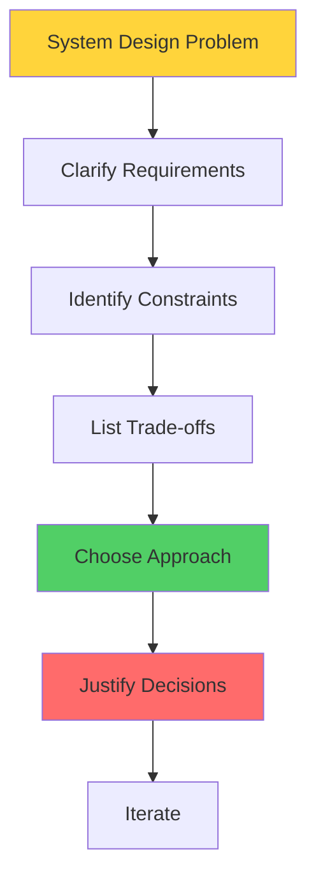
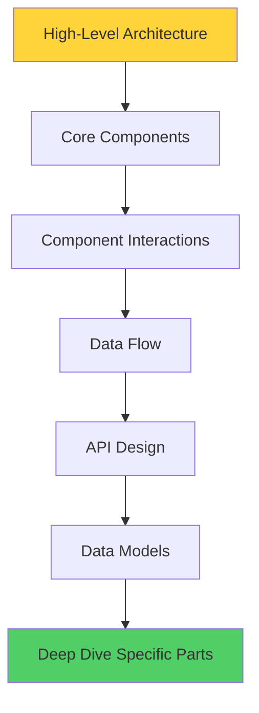
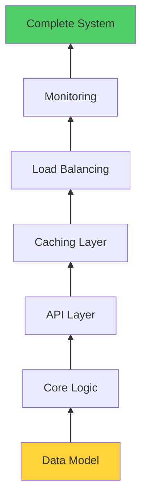

# System Design Thinking Framework: Từ Biết Pattern Đến Biết Tư Duy

Chào mừng đến Phase 6 - System Design Mastery.

Bạn đã đi qua 5 phases, học về components, distributed systems, scalability patterns, real-world architectures. Bạn biết rất nhiều patterns.

Nhưng có một sự thật tôi phải nói thẳng:

**Biết patterns không đồng nghĩa với giỏi system design.**

Tôi từng interview một candidate rất giỏi. Anh ta thuộc lòng tất cả patterns: CAP theorem, consistent hashing, CQRS, event sourcing...

Tôi hỏi: *"Thiết kế URL shortener."*

Anh ta ngay lập tức: *"Em sẽ dùng NoSQL, Redis cache, CDN, microservices, event-driven architecture..."*

Tôi: *"Tại sao?"*

Anh ta: *"Vì... đó là best practices ạ?"*

**Anh ta fail interview.**

Không phải vì thiếu kiến thức. Mà vì **thiếu system design thinking**.

Lesson này sẽ dạy bạn cái quan trọng nhất: **Cách tư duy khi approach một problem.**

## System Design Thinking Là Gì?

### Định Nghĩa

**System design thinking = Mental framework để approach và solve architecture problems**

Không phải là:
- Thuộc patterns
- Biết technologies
- Copy solutions

Mà là:
- Understand problems deeply
- Reason từ first principles
- Make trade-off decisions
- Justify mọi choice

### Ví Dụ So Sánh

**Pattern thinking (Bad):**
```
Problem: Build social network
Approach:
1. Social network = need feed
2. Feed = need fanout
3. Use fanout on write pattern
4. Done!

Result: Over-engineered cho startup với 100 users
```

**System design thinking (Good):**
```
Problem: Build social network

Questions:
1. Scale? (100 users hay 100M users?)
2. Traffic pattern? (read-heavy hay write-heavy?)
3. Consistency requirements? (real-time hay eventual OK?)
4. Team size? (2 devs hay 50 devs?)
5. Timeline? (MVP trong 1 tháng hay 1 năm?)
6. Budget? (limited hay unlimited?)

Với 100 users, 2 devs, 1 tháng timeline:
→ Simple SQL database
→ Query followees' posts on demand
→ Basic chronological sort
→ No caching needed yet

Scale later when proven needed.

Result: Shipped on time, iterated fast
```

Thấy sự khác biệt chưa?

Pattern thinking = Apply solutions

System design thinking = **Understand problem → Choose appropriate solution**

## The Mental Shift: Từ "What Tech" Sang "What Problem"

### Old Mindset (What Tech to Use)
```
Senior: "Thiết kế notification system"

Junior thinks:
- "Dùng tech gì nhỉ?"
- "Kafka hay RabbitMQ?"
- "WebSocket hay Server-Sent Events?"
- "PostgreSQL hay MongoDB?"

→ Technology-first thinking
→ Solution shopping
```

**Vấn đề:**
```
Chưa hiểu problem
Không biết constraints
Không justify trade-offs
Có thể over-engineer
Có thể under-engineer
```

### New Mindset (What Problem to Solve)
```
Senior: "Thiết kế notification system"

Senior thinks:
- "Problem gì đang giải quyết?"
- "Scale bao nhiêu? (1K hay 1B notifications/day?)"
- "Latency requirement? (real-time hay eventual OK?)"
- "Delivery guarantee? (at-least-once hay exactly-once?)"
- "Types of notifications? (push, email, SMS?)"
- "User preferences? (mute, frequency?)"

→ Problem-first thinking
→ Requirement-driven design
```

**Framework:**


*System design thinking process: Requirements → Constraints → Trade-offs → Decision → Justification*

## Requirement-Driven Design

**Bắt đầu mọi design bằng requirements. Always.**

### Functional Requirements

**Định nghĩa:** System phải làm gì?
```python
# Example: URL Shortener

Functional Requirements:
1. Shorten URL
   - Input: long URL
   - Output: short URL
   - Example: https://example.com/long-path → ex.co/abc123

2. Redirect
   - Input: short URL
   - Output: redirect to original URL
   - Must work consistently

3. Custom aliases (optional)
   - User can choose short code
   - Example: ex.co/my-link

4. Analytics (optional)
   - Track clicks
   - Show statistics

5. Expiration (optional)
   - URL expires after X days
   - Auto-cleanup
```

**Kỹ thuật clarify:**
```
Interviewer: "Design URL shortener"

You: "Let me clarify functional requirements:
1. Do we support custom short URLs?
2. Do we need analytics (click tracking)?
3. Do URLs expire?
4. Do we need user accounts?
5. Can users edit/delete their URLs?
6. Do we need API rate limiting?"

Each answer changes design significantly!
```

### Non-Functional Requirements (Critical!)

**Định nghĩa:** System phải perform như thế nào?
```python
# Non-Functional Requirements

1. Scale
   - Users: 1M, 10M, hay 100M?
   - Requests: 100 req/s hay 100K req/s?
   - Data: 1GB hay 10TB?
   - Growth rate: 2x/year hay 10x/year?

2. Performance
   - Latency: < 100ms? < 1s?
   - Throughput: 1K req/s? 1M req/s?
   - Availability: 99%? 99.99%?

3. Consistency
   - Strong consistency needed?
   - Eventual consistency OK?
   - Tolerance for stale data?

4. Durability
   - Data loss acceptable? (NO for banking, maybe OK for analytics)
   - Backup requirements?
   - Recovery time objective (RTO)?

5. Security
   - Authentication needed?
   - Authorization model?
   - Data encryption?
   - Rate limiting?

6. Cost
   - Budget constraints?
   - Optimize for cost vs performance?
```

**Back-of-envelope calculations:**
```python
# Example: URL Shortener

Given:
- 100M URLs shortened per month
- 10B redirects per month
- 5 years retention

Calculate:

# Write traffic
writes_per_second = 100M / (30 * 24 * 3600)
                  ≈ 40 writes/second

# Read traffic  
reads_per_second = 10B / (30 * 24 * 3600)
                 ≈ 4,000 reads/second

# Read:Write ratio = 100:1
→ Read-heavy system → Caching critical

# Storage
urls_total = 100M/month × 12 months × 5 years
           = 6 billion URLs

storage_per_url = 500 bytes (URL + metadata)
total_storage = 6B × 500 bytes
              = 3TB

→ Single database can handle (scale vertically first)

# Bandwidth
write_bandwidth = 40 req/s × 500 bytes
                = 20 KB/s (negligible)

read_bandwidth = 4,000 req/s × 500 bytes  
               = 2 MB/s (manageable)

→ Network not bottleneck

Conclusion:
- Database: Start with single PostgreSQL
- Caching: Critical (Redis for hot URLs)
- CDN: Not needed (no static assets)
- Sharding: Not needed yet (3TB manageable)
```

**Why calculations matter:**
```
Without calculations:
"Need to handle millions of users!"
→ Over-engineer với microservices, Kafka, sharding

With calculations:
"40 writes/s, 4K reads/s, 3TB data"
→ Single server + Redis cache is enough
→ Ship in 2 weeks, not 6 months
```

## Constraint-First Thinking

**Constraints shape design. Identify constraints TRƯỚC KHI design.**

### Types of Constraints

**1. Technical Constraints**
```python
# Database constraints
- Single database max: ~10K writes/second
- PostgreSQL max connections: ~500
- Redis max memory: Depends on instance (16GB typical)
- Network latency: Speed of light (can't beat physics)

# CAP theorem constraint
- Can't have perfect Consistency + Availability với Partition tolerance
- Must choose trade-off

# Eventual consistency constraint
- Distributed caches → replication lag
- Async processing → delay
```

**2. Business Constraints**
```python
# Timeline
- MVP in 1 month → Simple architecture
- No deadline pressure → Can optimize

# Budget
- Limited ($1000/month) → Optimize for cost
- Unlimited → Optimize for performance

# Team
- 2 developers → Choose simple stack
- 20 developers → Can handle complexity

# Compliance
- GDPR → Data residency requirements
- PCI DSS → Strict security requirements
- HIPAA → Healthcare data protection
```

**3. Scale Constraints**
```python
# Current scale
- 1K users → Monolith OK
- 1M users → Need horizontal scaling
- 100M users → Need distributed architecture

# Growth rate
- Stable growth (2x/year) → Scale gradually
- Hypergrowth (10x/year) → Plan for scale early

# Traffic pattern
- Uniform → Simple load balancing
- Spiky (Black Friday) → Need burst capacity
- Predictable → Can optimize
- Unpredictable → Need flexibility
```

### Constraint Analysis Framework
```python
def analyze_constraints(problem):
    """Framework để identify constraints"""
    
    constraints = {
        # Hard constraints (cannot violate)
        'hard': [
            'Budget: $5000/month maximum',
            'Timeline: 3 months to launch',
            'Availability: Must be 99.9%',
            'Compliance: GDPR required'
        ],
        
        # Soft constraints (prefer but flexible)
        'soft': [
            'Team familiar with Python',
            'Prefer open-source solutions',
            'Easy to maintain'
        ],
        
        # Technical limits
        'technical': [
            'Database writes: < 1000/second',
            'Read latency: < 200ms',
            'Network: Public internet (not dedicated)'
        ],
        
        # Scale limits
        'scale': [
            'Current: 10K users',
            'Target: 100K users in 1 year',
            'Data: Currently 100GB, growing 10GB/month'
        ]
    }
    
    return constraints

# Design decisions từ constraints
def make_decisions(constraints):
    """Derive design từ constraints"""
    
    decisions = []
    
    # Budget constraint → Choose managed services
    if constraints['hard']['budget'] < 10000:
        decisions.append('Use managed services (RDS, ElastiCache)')
        decisions.append('Avoid self-managed Kubernetes')
    
    # Timeline constraint → Choose familiar tech
    if constraints['hard']['timeline'] < 6_months:
        decisions.append('Use team\'s existing stack')
        decisions.append('Avoid learning new paradigms')
    
    # Scale constraint → Start simple
    if constraints['scale']['current'] < 100K:
        decisions.append('Monolith architecture')
        decisions.append('Vertical scaling first')
    
    return decisions
```

**Real-world example:**
```
Startup scenario:
- Budget: $2000/month
- Team: 3 developers (Python)
- Timeline: 2 months to MVP
- Scale: Expect 5K users initially

Constraints dictate:
Don't use: Kubernetes, Kafka, Cassandra
   → Too expensive, complex, overkill

Do use:
   - Heroku or AWS Elastic Beanstalk (managed)
   - PostgreSQL (familiar, powerful enough)
   - Redis (simple caching)
   - Monolith (fast development)

Decision justified by constraints, not by "best practices"
```

## Top-Down vs Bottom-Up Design

Có 2 approaches để design systems. Biết khi nào dùng cái nào.

### Top-Down Design (Recommended for Interviews)

**Approach: Start từ high-level, drill down details**


*Top-down: Từ tổng quan đến chi tiết*

**Process:**
```python
# Step 1: High-level boxes
"""
[Client] → [Load Balancer] → [API Servers] → [Database]
                                    ↓
                                [Cache]
"""

# Step 2: Define components
"""
Load Balancer: Nginx
API Servers: Python/FastAPI (stateless)
Cache: Redis  
Database: PostgreSQL
"""

# Step 3: Detail interactions
"""
Client:
- HTTPS requests
- JWT authentication
- Rate limited

API Servers:
- RESTful endpoints
- Horizontal scaling
- Health checks

Cache:
- Store hot data
- TTL: 5 minutes
- Cache-aside pattern
"""

# Step 4: API design
"""
POST /shorten
Body: {"url": "https://..."}
Response: {"short_url": "ex.co/abc123"}

GET /{shortCode}
Response: 302 Redirect
"""

# Step 5: Data models
"""
CREATE TABLE urls (
    id BIGSERIAL PRIMARY KEY,
    short_code VARCHAR(10) UNIQUE,
    original_url TEXT,
    created_at TIMESTAMP,
    expires_at TIMESTAMP
);
"""

# Step 6: Deep dive critical parts
"""
Short code generation:
- Base62 encoding (a-z, A-Z, 0-9)
- 7 characters = 62^7 = 3.5 trillion combinations
- Collision handling: retry với new code
"""
```

**Ưu điểm:**
```
Comprehensive view early
Spot architecture issues fast
Easy to communicate
Good for interviews (shows thinking process)
Can adjust before deep implementation
```

**Nhược điểm:**
```
Có thể miss details
Assumptions có thể sai
Harder nếu chưa có experience
```

### Bottom-Up Design (Good for Implementation)

**Approach: Start từ core problem, build up**


*Bottom-up: Từ foundation build lên*

**Process:**
```python
# Step 1: Core data model
"""
What data do we store?
- URL mapping
- Metadata
- Analytics

CREATE TABLE urls (...);
"""

# Step 2: Core logic
"""
How do we generate short codes?
- Base62 encoding
- Collision handling
- Validation
"""

# Step 3: API layer
"""
What endpoints do we need?
POST /shorten
GET /{code}
"""

# Step 4: Caching
"""
Cache hot URLs
Redis sorted set by access frequency
"""

# Step 5: Scaling
"""
Add load balancer
Multiple API servers
Database read replicas
"""

# Step 6: Monitoring
"""
Metrics: latency, error rate
Alerts: high latency, failures
Dashboards
"""
```

**Ưu điểm:**
```
Solid foundation
Less rework
Details không bị miss
Good khi implementing
```

**Nhược điểm:**
```
Không thấy big picture early
Có thể over-optimize details
Harder to pivot
Less effective trong interviews
```

### Khi Nào Dùng Approach Nào?
```
Top-Down:
✓ System design interviews
✓ Architecture planning meetings
✓ New greenfield projects
✓ Communication với stakeholders
✓ Khi cần quick proof of concept

Bottom-Up:
✓ Implementation phase
✓ Refactoring existing systems
✓ When details matter (security, compliance)
✓ Complex algorithmic problems
✓ Database schema design
```

**Hybrid approach (Best in practice):**
```
1. Top-down: Draw high-level architecture
2. Identify critical components
3. Bottom-up: Detail critical parts
4. Top-down: Validate fits together
5. Iterate
```

## Scalability Mindset

**Scalability thinking ≠ "Make it handle millions"**

**Scalability thinking = Design để có thể scale khi cần, without rewrite**

### The Scalability Spectrum
```
Over-engineered ←→ Right-sized ←→ Under-engineered

[Microservices]   [Modular     [Spaghetti
[Kubernetes]      Monolith]    code]
[Kafka]           [PostgreSQL] [No DB
[Sharding]        [Redis]      indexes]

Left: Premature optimization
Middle: Goldilocks zone ✓
Right: Technical debt
```

**Find the Goldilocks zone:**
```python
def choose_architecture(current_scale, target_scale, timeline):
    """Choose architecture dựa trên scale"""
    
    if current_scale < 10_000 and target_scale < 100_000:
        return {
            'architecture': 'Monolith',
            'database': 'Single PostgreSQL',
            'cache': 'Redis (optional)',
            'reasoning': 'Simple, ship fast, iterate'
        }
    
    elif current_scale < 1_000_000 and target_scale < 10_000_000:
        return {
            'architecture': 'Modular Monolith',
            'database': 'PostgreSQL with read replicas',
            'cache': 'Redis cluster',
            'reasoning': 'Balance simplicity with scalability'
        }
    
    else:  # > 10M users
        return {
            'architecture': 'Microservices',
            'database': 'Sharded PostgreSQL or NoSQL',
            'cache': 'Distributed Redis',
            'messaging': 'Kafka for async',
            'reasoning': 'Need independent scaling, team autonomy'
        }
```

### Design for Scalability Without Over-Engineering

**Principles:**

**1. Stateless application servers**
```python
# Bad: Stateful
sessions = {}  # In-memory state

def handle_request(user_id):
    session = sessions[user_id]  # Tied to this server
    # ...

# Good: Stateless
def handle_request(user_id, session_token):
    session = redis.get(f"session:{session_token}")  # Any server can handle
    # ...
```

**2. Database indexes from day 1**
```sql
-- Don't wait until slow to add indexes

-- Add early
CREATE INDEX idx_users_email ON users(email);
CREATE INDEX idx_posts_created_at ON posts(created_at);
CREATE INDEX idx_posts_user_id ON posts(user_id);

-- Small cost now, huge benefit later
```

**3. Monitoring from day 1**
```python
# Track metrics early
metrics.increment('api.requests')
metrics.timing('api.latency', duration)
metrics.gauge('active_users', count)

# When scale issues hit, you have data
# Without metrics = flying blind
```

**4. Async where appropriate**
```python
# Long tasks → Async

# Synchronous
def create_user(email):
    user = db.create(email)
    send_welcome_email(email)  # Block 5 seconds
    generate_thumbnail(user)    # Block 10 seconds
    return user  # User waits 15 seconds

# Asynchronous
def create_user(email):
    user = db.create(email)
    queue.publish('user.created', user.id)  # Fire and forget
    return user  # User waits 100ms

# Workers handle async
@worker.task
def on_user_created(user_id):
    send_welcome_email(user_id)
    generate_thumbnail(user_id)
```

**5. Modular code structure**
```python
# Even trong monolith, structure well

# Bad: Everything in one file
# app.py (5000 lines)

# Good: Clear boundaries
/services
  /user_service.py
  /post_service.py
  /notification_service.py
/models
/api

# Khi cần split to microservices, boundaries already clear
```

## Design vs Implementation Thinking

**Critical distinction: Designing ≠ Implementing**

### Design Thinking (Interviews, Planning)

**Focus: Architecture decisions, trade-offs, justification**
```
Questions to answer:
- What components do we need?
- How do they interact?
- What are the bottlenecks?
- What can fail and how to handle?
- What are trade-offs of each choice?
- How does it scale?

Output:
- Architecture diagram
- Component responsibilities
- API contracts
- Data models (high-level)
- Trade-off analysis
```

**Example dialogue:**
```
Interviewer: "Design Twitter"

You (Design thinking):
"Let me start with requirements...
- 500M daily users
- 200M tweets per day
- Read-heavy (95% reads)

Architecture:
- Fanout service for tweet distribution
- Timeline cache in Redis
- CDN for media
- Sharded PostgreSQL for persistence

Key trade-off: Fanout on write vs fanout on read
- For normal users: Fanout on write (pre-compute timelines)
- For celebrities: Fanout on read (too many followers)
- Hybrid approach balances write and read performance

Bottlenecks:
- Timeline generation during fanout
- Media delivery
- Hot celebrity problem

Failure handling:
- Queue for fanout (if service down, retry)
- Async processing (eventual consistency OK)
- Circuit breakers for external services
"
```

### Implementation Thinking (Building)

**Focus: Code, algorithms, specific technologies**
```
Questions to answer:
- What framework to use?
- How to structure code?
- What libraries to use?
- How to handle edge cases?
- How to test?
- How to deploy?

Output:
- Working code
- Unit tests
- Integration tests
- Deployment scripts
- Documentation
```

**Example:**
```python
# Implementation details

# Short code generation algorithm
def generate_short_code(url_id):
    """Convert numeric ID to base62 string"""
    BASE62 = "0123456789abcdefghijklmnopqrstuvwxyzABCDEFGHIJKLMNOPQRSTUVWXYZ"
    
    if url_id == 0:
        return BASE62[0]
    
    result = []
    while url_id > 0:
        result.append(BASE62[url_id % 62])
        url_id //= 62
    
    return ''.join(reversed(result))

# Collision handling
def create_short_url(long_url, max_retries=3):
    for attempt in range(max_retries):
        url_id = get_next_id()
        short_code = generate_short_code(url_id)
        
        try:
            db.insert(short_code, long_url)
            return short_code
        except UniqueViolation:
            # Collision, retry
            continue
    
    raise Exception("Failed to generate unique short code")
```

### Balance Both

**Good engineers balance design và implementation thinking:**
```
Design phase:
- Think high-level
- Focus on architecture
- Justify trade-offs
- Don't get stuck in implementation details

Implementation phase:
- Think low-level
- Focus on code quality
- Handle edge cases
- Maintain architecture vision

Don't mix phases:
Design interview: "I'll use FastAPI with async/await..."
   → Too implementation-focused

Coding: "Let me redesign the entire architecture..."
   → Wrong time for that

Design: Focus on what and why
Implement: Focus on how
```

## The Complete Framework: Putting It All Together

**Khi approach một system design problem:**

### Step-by-Step Framework
```
1. CLARIFY (5 minutes)
   ├─ Functional requirements
   ├─ Non-functional requirements
   ├─ Scale (users, traffic, data)
   └─ Constraints (budget, timeline, team)

2. ESTIMATE (5 minutes)
   ├─ Back-of-envelope calculations
   ├─ Read/write ratio
   ├─ Storage needs
   └─ Bandwidth needs

3. HIGH-LEVEL DESIGN (10 minutes)
   ├─ Draw main components
   ├─ Show data flow
   ├─ Identify critical path
   └─ Call out key decisions

4. DEEP DIVE (15 minutes)
   ├─ API design
   ├─ Data model
   ├─ Algorithm details
   ├─ Caching strategy
   └─ Scaling approach

5. TRADE-OFFS (10 minutes)
   ├─ Discuss alternatives
   ├─ Justify choices
   ├─ Mention trade-offs
   └─ Address edge cases

6. WRAP UP (5 minutes)
   ├─ Bottlenecks & solutions
   ├─ Failure scenarios
   ├─ Monitoring strategy
   └─ Future improvements
```

### Mental Checklist

**Trước khi finalize design, verify:**
```
☑ Requirements clear?
☑ Constraints identified?
☑ Scale calculated?
☑ Read/write ratio known?
☑ Bottlenecks identified?
☑ Failure modes considered?
☑ Trade-offs justified?
☑ Scalability path clear?
☑ Monitoring plan exists?
☑ Cost estimated?
```

### Common Mistakes to Avoid
```
Jump to solution immediately
   → Clarify requirements first

Over-engineer for unknown future
   → Design for 2x scale, not 100x

Ignore constraints
   → Budget, timeline, team affect design

Copy Big Tech architecture
   → Their scale ≠ your scale

Neglect failure scenarios
   → System will fail, plan for it

Ignore monitoring
   → Can't improve what you don't measure

Perfect vs shipped
   → MVP first, iterate later
```

## Real-World Application

**Example: Design Instagram-like app**

### Apply Framework

**1. Clarify Requirements:**
```
Functional:
- Upload photos
- Follow users
- View feed (photos from following)
- Like, comment
- Search users

Non-functional:
- 100M users
- 50M daily active users
- 10M photos uploaded/day
- Read-heavy (view:upload = 100:1)
- Latency: Feed < 500ms
- Availability: 99.9%
```

**2. Estimate:**
```
Storage:
- 10M photos/day × 2MB average = 20TB/day
- 20TB × 365 = 7.3PB/year
→ Need object storage (S3)

Traffic:
- Uploads: 10M/day / 86400s ≈ 115 uploads/s
- Views: 115 × 100 = 11,500 views/s
→ Read-heavy, caching critical

Database:
- 100M users × 500 bytes = 50GB (users table)
- 3.6B photos/year × 200 bytes metadata = 720GB/year
→ Manageable với SQL, shard after 2-3 years
```

**3. High-Level Design:**
```
[Mobile/Web] 
    ↓
[CDN] (images)
    ↓
[Load Balancer]
    ↓
[API Servers] (stateless)
    ↓
[Redis Cache] ← Feed timelines
    ↓
[PostgreSQL] ← Metadata
    ↓
[S3] ← Photo storage
```

**4. Key Decisions:**
```
Photo storage: S3
- Durable, scalable
- CDN integration
- Trade-off: Cost vs reliability

Feed generation: Fanout on write
- Pre-compute feeds
- Fast reads (< 50ms from cache)
- Trade-off: Write amplification

Caching: Redis timelines
- Store 1000 recent posts per user
- TTL: No expiry (explicit invalidation)
- Trade-off: Memory cost vs read performance

Database: PostgreSQL with sharding
- Strong consistency for critical data
- Shard by user_id after 2 years
- Trade-off: Complexity vs scale
```

**5. Trade-offs Discussed:**
```
Fanout on write vs read:
- Chose write because read-heavy
- Celebrity problem: Switch to pull for > 10K followers

SQL vs NoSQL:
- Chose SQL for consistency, relationships
- Can add read replicas, then shard

Sync vs async:
- Photo upload: Sync (user waits)
- Feed fanout: Async (eventual consistency OK)
```

**6. Wrap Up:**
```
Bottlenecks:
- Feed generation (solved by async fanout)
- Photo delivery (solved by CDN)
- Database reads (solved by caching)

Monitoring:
- Upload success rate
- Feed load latency
- Cache hit rate
- Fanout lag

Future improvements:
- ML ranking for feeds
- Stories feature
- Live video
- Recommendations
```

## Key Takeaways

**System design thinking ≠ Knowing patterns**
```
Patterns are tools.
Thinking is knowing when to use which tool.
```

**Mental shift:**
```
From: "What tech to use?"
To:   "What problem to solve?"

From: "Best practices"
To:   "Best fit for context"

From: "Copy Big Tech"
To:   "Design for my scale"
```

**Framework:**
```
1. Requirements first (always)
2. Constraints shape design
3. Calculate scale (math matters)
4. Top-down for planning
5. Design for 2x, not 100x
6. Justify every decision
7. Trade-offs over perfection
```

**The ultimate test:**
```
Good design thinking = Có thể explain "WHY" cho mọi decision

If you can't explain why:
- Why this database?
- Why this caching strategy?
- Why this architecture?

→ You don't understand your own design
→ Go back and think deeper
```

**Remember:**
```
Junior: Knows patterns
Mid: Applies patterns
Senior: Knows when NOT to apply patterns

System design mastery = Thinking, not memorization
```

Bạn đã học đủ patterns qua 5 phases. Phase 6 về refining thinking process.

**Practice thinking framework, không chỉ memorize patterns.**

Đó là điều phân biệt Senior Engineer với Junior Engineer.
