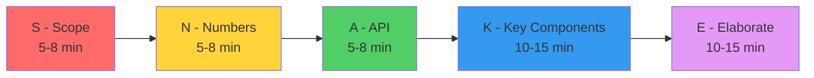
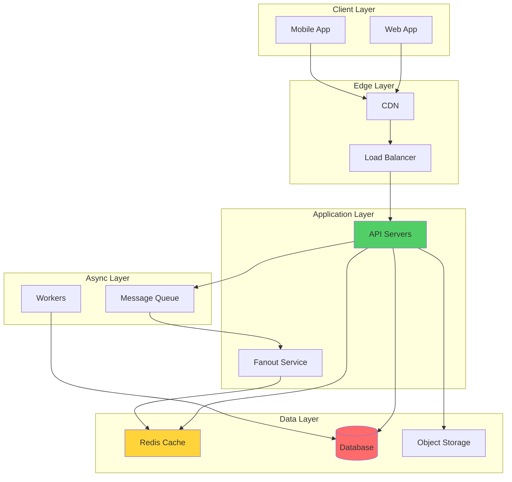

# SNAKE Framework: Methodology Để Ace System Design Interview

Tôi còn nhớ lần đầu tiên làm system design interview.

Interviewer: *"Thiết kế YouTube."*

Tôi: *"Uhm... YouTube... video... cần database... cần CDN... cần..."*

Tôi vẽ vài boxes, nói về microservices, mention Kafka. 30 phút trôi qua trong confusion.

Interviewer: *"Em có structure approach không?"*

Tôi: *"... Không ạ."*

**Tôi fail interview đó.**

Không phải vì thiếu kiến thức. Mà vì **không có methodology rõ ràng**.

Sau đó, tôi học SNAKE framework từ một senior architect. Đó là game changer.

SNAKE = **S**cope → **N**umbers → **A**PI → **K**ey components → **E**laborate

Framework này transform cách tôi approach system design interviews. Và nó sẽ transform cách bạn approach.

## Tại Sao Cần Framework?

### The Problem With No Structure

**Without framework:**
```
Interviewer: "Design Twitter"

Candidate brain:
"Twitter... tweets... users... followers... feed... 
database... NoSQL? SQL? Cache? Microservices?
Kafka? Redis? Wait, should I start with database?
Or API? Or architecture? Aaah..."

→ Jump around randomly
→ Miss critical requirements
→ Waste time on irrelevant details
→ No clear narrative
→ Interviewer confused
```

**With framework (SNAKE):**
```
Interviewer: "Design Twitter"

Candidate:
"Let me clarify requirements first (Scope)
Then estimate scale (Numbers)
Define API contracts (API)
Design high-level architecture (Key components)
Deep dive critical parts (Elaborate)"

→ Clear progression
→ Cover all aspects
→ Structured thinking
→ Easy to follow
→ Interviewer impressed
```

**Key insight:** System design interviews test **thinking process**, không chỉ knowledge.

Framework shows bạn có systematic approach to problem-solving.

## SNAKE Framework Overview


*SNAKE framework: 5 steps với time allocation rõ ràng cho 45-phút interview*

**Total time budget: 45 minutes**
```
Scope:          5-8 minutes  (Clarify requirements)
Numbers:        5-8 minutes  (Estimate scale)
API:            5-8 minutes  (Define interfaces)
Key Components: 10-15 minutes (High-level design)
Elaborate:      10-15 minutes (Deep dive)
Buffer:         5 minutes     (Unexpected questions)
```

**Mỗi step có mục đích rõ ràng. Không skip steps.**

## S - Scope: Clarify Requirements

**Goal: Understand problem deeply trước khi design**

### What to Clarify

**1. Functional Requirements (What system does)**
```python
# Template questions

"Let me clarify the functional requirements:

Core features:
1. What are the must-have features?
   Example: For Twitter
   - Post tweets ✓
   - Follow users ✓
   - View feed ✓
   - Like/retweet ✓
   
2. What are nice-to-have features?
   - Direct messages?
   - Notifications?
   - Trending topics?
   - Search?
   
3. Out of scope (explicitly state):
   - Video tweets
   - Analytics dashboard
   - Ads system"
```

**2. Non-Functional Requirements (How system performs)**
```python
# Template questions

"Non-functional requirements:

Scale:
- How many users? (1M, 10M, 100M?)
- Daily active users?
- Tweets per day?
- Peak traffic pattern?

Performance:
- Latency requirement? (< 100ms? < 1s?)
- Availability requirement? (99%? 99.99%?)

Consistency:
- Strong consistency needed?
- Eventual consistency acceptable?

Other:
- Geographic distribution?
- Mobile vs web ratio?
- Read vs write ratio?"
```

**3. Constraints**
```python
# Template questions

"Any constraints I should know?

Technical:
- Existing infrastructure to integrate with?
- Technology preferences?
- Legacy system compatibility?

Business:
- Timeline to launch?
- Budget constraints?
- Team size?
- Compliance requirements (GDPR, etc.)?"
```

### How to Ask (Communication Skills Matter!)

**Bad approach:**
```
Candidate: "How many users?"
Interviewer: "You tell me."
Candidate: "Umm... 1 million?"
Interviewer: "..."

→ Passive, không show thinking
```

**Good approach:**
```
Candidate: "Let me clarify the scale. For a Twitter-like system,
I'm thinking we're designing for:
- 200M monthly active users
- 100M daily active users  
- 500M tweets per day
- Read-heavy workload (95% reads, 5% writes)

Does this match your expectation, or should I adjust?"

Interviewer: "That sounds reasonable."

→ Show assumptions, invite feedback
→ Demonstrate thinking process
```

### Scope Checklist

**Verify bạn đã clarify:**
```
☑ Core features identified
☑ Nice-to-have features noted
☑ Out-of-scope explicitly stated
☑ Scale numbers agreed upon
☑ Performance requirements clear
☑ Consistency requirements understood
☑ Constraints acknowledged
```

**Time spent: 5-8 minutes**

**Don't rush this. Strong foundation = better design.**

## N - Numbers: Back-of-Envelope Calculations

**Goal: Quantify scale để inform design decisions**

### What to Calculate

**1. Traffic Estimates**
```python
# Example: Twitter

Given:
- 100M daily active users (DAU)
- Each user views feed 10 times/day
- Each user posts 2 tweets/day

Calculate:

# Read traffic
read_requests = 100M users × 10 views/day
              = 1B requests/day
              = 1B / 86400 seconds
              ≈ 12K requests/second

Peak (3x average):
              = 36K requests/second

# Write traffic  
write_requests = 100M users × 2 tweets/day
               = 200M tweets/day
               = 200M / 86400
               ≈ 2.3K tweets/second

Peak:          ≈ 7K tweets/second

# Read:Write ratio
ratio = 12K / 2.3K ≈ 5:1 (read-heavy)

→ Caching critical for reads
```

**2. Storage Estimates**
```python
# Storage calculation

Per tweet:
- tweet_id: 8 bytes (bigint)
- user_id: 8 bytes
- content: 280 chars × 1 byte = 280 bytes
- metadata: 100 bytes (timestamps, etc.)
- media URL: 200 bytes
Total: ~600 bytes per tweet

Daily storage:
200M tweets/day × 600 bytes = 120 GB/day

Yearly:
120 GB × 365 = 43.8 TB/year

5 years:
43.8 TB × 5 = 219 TB

→ Need distributed storage strategy
→ Sharding after 2-3 years
```

**3. Bandwidth Estimates**
```python
# Bandwidth calculation

# Incoming (writes)
write_bandwidth = 2.3K tweets/s × 600 bytes
                = 1.4 MB/s (negligible)

# Outgoing (reads)
# Assume each feed load fetches 20 tweets
read_bandwidth = 12K requests/s × 20 tweets × 600 bytes
               = 144 MB/s

Peak: 144 MB/s × 3 = 432 MB/s

# Media (images/videos)
# 30% of tweets have media, average 2MB
media_requests = 12K × 0.3 = 3.6K/s
media_bandwidth = 3.6K × 2MB = 7.2 GB/s

→ CDN absolutely required for media
```

**4. Memory Estimates (Caching)**
```python
# Cache hot data

# Cache user feeds (top 1000 tweets per active user)
active_users = 100M DAU
tweets_cached = 1000 per user
size_per_tweet = 600 bytes

cache_memory = 100M × 1000 × 600 bytes
             = 60 TB

# Only cache 20% most active users
cache_memory = 60 TB × 0.2 = 12 TB

# Redis cluster: 100 nodes × 128 GB = 12.8 TB
→ Feasible with distributed cache
```

### Why Numbers Matter

**Numbers inform design decisions:**
```
Calculation reveals:
- Read:Write = 5:1 → Cache strategy critical
- 7.2 GB/s media → Must use CDN
- 219 TB/5yr → Sharding needed eventually
- 36K req/s → Need load balancing
- 12 TB cache → Distributed Redis cluster

Without calculations:
→ Guessing
→ Over-engineer hoặc under-engineer
→ No justification for decisions
```

### Numbers Checklist
```
☑ Traffic (reads, writes, peak)
☑ Storage (current, growth)
☑ Bandwidth (in, out, media)
☑ Memory (cache requirements)
☑ Read:Write ratio identified
☑ Growth projections noted
```

**Time spent: 5-8 minutes**

**Show your math! Write on whiteboard.**

## A - API: Define Interfaces

**Goal: Design API contracts trước khi implement internals**

### Why API First?

**API design forces clarity:**
```
Vague: "System cho phép users post và xem tweets"

Clear API:
POST /tweets
GET /feed
GET /tweets/{id}
POST /tweets/{id}/like

→ Concrete, testable, discussable
```

### RESTful API Design

**Example: Twitter**
```python
# Core APIs

# 1. Create tweet
POST /v1/tweets
Request:
{
    "content": "Hello world!",
    "media_urls": ["https://..."],
    "reply_to": "tweet_id"  // optional
}

Response: 201 Created
{
    "tweet_id": "123456",
    "user_id": "789",
    "content": "Hello world!",
    "created_at": "2024-03-15T10:30:00Z"
}

# 2. Get user feed
GET /v1/feed?cursor={cursor}&limit=20
Response: 200 OK
{
    "tweets": [
        {
            "tweet_id": "123456",
            "user": {...},
            "content": "...",
            "likes": 100,
            "retweets": 50
        }
    ],
    "next_cursor": "abc123",
    "has_more": true
}

# 3. Like tweet
POST /v1/tweets/{tweet_id}/like
Response: 204 No Content

# 4. Follow user
POST /v1/users/{user_id}/follow
Response: 204 No Content

# 5. Get tweet
GET /v1/tweets/{tweet_id}
Response: 200 OK
{
    "tweet_id": "123456",
    "user": {...},
    "content": "...",
    "created_at": "...",
    "stats": {
        "likes": 100,
        "retweets": 50,
        "replies": 20
    }
}
```

### API Design Principles

**1. Consistent naming**
```python
# Good: Consistent
POST   /tweets          # Create
GET    /tweets/{id}     # Read
PUT    /tweets/{id}     # Update
DELETE /tweets/{id}     # Delete

# Bad: Inconsistent
POST   /createTweet
GET    /getTweetById
POST   /tweet_update
POST   /remove_tweet
```

**2. Versioning**
```python
# Good: Versioned
GET /v1/tweets
GET /v2/tweets  # Breaking changes in v2

# Can support both versions simultaneously
```

**3. Pagination**
```python
# Good: Cursor-based (for real-time data)
GET /feed?cursor=xyz&limit=20

# Also good: Offset-based (for stable data)
GET /users?offset=100&limit=50
```

**4. Error responses**
```python
# Standard error format
{
    "error": {
        "code": "RATE_LIMIT_EXCEEDED",
        "message": "Rate limit exceeded. Try again in 60 seconds.",
        "details": {
            "retry_after": 60
        }
    }
}
```

### API Checklist
```
☑ Core endpoints defined
☑ Request/response formats specified
☑ HTTP methods appropriate
☑ Authentication mentioned
☑ Pagination strategy chosen
☑ Error handling noted
☑ Rate limiting considered
```

**Time spent: 5-8 minutes**

**Don't over-detail. High-level contracts sufficient.**

## K - Key Components: High-Level Architecture

**Goal: Draw the boxes và arrows**

### Components to Include

**Standard web system components:**


*High-level architecture cho Twitter-like system với các components chính*

### Component Descriptions

**Mỗi component cần brief explanation:**
```python
# Template

Component: Load Balancer
Purpose: Distribute traffic across API servers
Technology: AWS ALB / Nginx
Why: Handle 36K req/s, need multiple servers

Component: API Servers
Purpose: Handle business logic
Technology: Python/FastAPI (stateless)
Scale: 50+ servers (horizontal scaling)
Why: Stateless = easy to scale

Component: Redis Cache
Purpose: Cache user feeds, hot tweets
Technology: Redis Cluster
Capacity: 12 TB (100 nodes × 128 GB)
Why: Sub-10ms latency for reads

Component: Database
Purpose: Persistent storage (tweets, users, relationships)
Technology: PostgreSQL (sharded)
Scale: 50 shards by user_id
Why: Strong consistency for critical data

Component: Message Queue
Purpose: Async fanout of tweets to followers
Technology: Kafka
Why: Decouple write from fanout, handle spikes

Component: CDN
Purpose: Serve media files (images, videos)
Technology: CloudFront
Why: 7.2 GB/s bandwidth, global distribution
```

### Data Flow

**Show critical paths:**
```
Write path (Post tweet):
1. User → API Server
2. API → Save to Database
3. API → Publish to Kafka
4. Fanout worker → Update followers' feeds in Cache
5. Return success to user

Read path (Load feed):
1. User → API Server
2. API → Check Cache (Redis)
3. Cache hit → Return cached feed
4. Cache miss → Query Database → Update cache
5. Return feed to user
```

### Call Out Key Decisions

**Highlight critical choices:**
```
Decision 1: Fanout on write (hybrid)
- Normal users: Pre-compute feeds (fast reads)
- Celebrities: Query on demand (avoid fanout explosion)
Trade-off: Write amplification vs read performance

Decision 2: Sharded PostgreSQL
- Shard by user_id
- 50 shards initially
Trade-off: Complexity vs scale

Decision 3: Redis for timeline cache
- Store 1000 recent tweets per user
- No expiry (explicit invalidation)
Trade-off: Memory cost vs performance
```

### Key Components Checklist
```
☑ All major components drawn
☑ Connections shown with arrows
☑ Each component has purpose
☑ Technology choices mentioned
☑ Data flow explained
☑ Critical paths highlighted
☑ Key decisions called out
```

**Time spent: 10-15 minutes**

**This is the meat of interview. Spend time here.**

## E - Elaborate: Deep Dive

**Goal: Show expertise trên specific parts**

### What to Deep Dive

**Interviewer often guides:**
```
Interviewer: "Can you elaborate on the fanout service?"
Interviewer: "How do you handle the celebrity problem?"
Interviewer: "What about database schema?"
Interviewer: "How do you ensure feed consistency?"
```

**Nếu không hỏi, bạn pick:**
```
"Let me deep dive into a few critical parts:
1. Fanout strategy
2. Database schema
3. Caching approach"
```

### Deep Dive Examples

**Example 1: Fanout Strategy**
```python
# Hybrid fanout implementation

class FanoutService:
    CELEBRITY_THRESHOLD = 10_000  # followers
    
    def handle_new_tweet(self, tweet):
        author = self.get_user(tweet.user_id)
        
        if author.followers_count < self.CELEBRITY_THRESHOLD:
            # Normal user: Fanout on write
            self.fanout_to_followers(tweet)
        else:
            # Celebrity: Mark for fanout on read
            self.mark_celebrity_tweet(tweet)
    
    def fanout_to_followers(self, tweet):
        """Async fanout to all followers"""
        followers = self.db.get_followers(tweet.user_id)
        
        for follower_id in followers:
            self.queue.publish({
                'task': 'insert_into_feed',
                'follower_id': follower_id,
                'tweet_id': tweet.id,
                'timestamp': tweet.created_at
            })
    
    def get_feed(self, user_id):
        """Merge pre-computed + celebrity tweets"""
        # Get pre-computed feed
        feed = self.cache.get_feed(user_id)
        
        # Get celebrity tweets
        celebrities = self.get_celebrity_followees(user_id)
        celebrity_tweets = self.query_celebrity_tweets(celebrities)
        
        # Merge and sort
        return self.merge_and_rank(feed, celebrity_tweets)
```

**Explain trade-offs:**
```
Why hybrid?
- Write amplification problem: Celebrity with 10M followers
  → 10M cache updates per tweet = too expensive
  
- Read performance: Normal users (< 10K followers)
  → Pre-compute feeds = < 10ms reads
  
Trade-off: Slight inconsistency for celebrity tweets
(eventual consistency within seconds) is acceptable
```

**Example 2: Database Schema**
```sql
-- Users table
CREATE TABLE users (
    user_id BIGSERIAL PRIMARY KEY,
    username VARCHAR(50) UNIQUE NOT NULL,
    email VARCHAR(255) UNIQUE NOT NULL,
    created_at TIMESTAMP DEFAULT NOW(),
    followers_count INT DEFAULT 0,
    following_count INT DEFAULT 0
);

-- Tweets table (sharded by user_id)
CREATE TABLE tweets (
    tweet_id BIGINT PRIMARY KEY,  -- Snowflake ID
    user_id BIGINT NOT NULL,
    content TEXT NOT NULL,
    media_urls TEXT[],
    created_at TIMESTAMP DEFAULT NOW(),
    reply_to BIGINT,  -- NULL if not reply
    
    INDEX idx_user_created (user_id, created_at DESC),
    INDEX idx_created (created_at DESC)
);

-- Relationships table (sharded by follower_id)
CREATE TABLE follows (
    follower_id BIGINT NOT NULL,
    followee_id BIGINT NOT NULL,
    created_at TIMESTAMP DEFAULT NOW(),
    
    PRIMARY KEY (follower_id, followee_id),
    INDEX idx_followee (followee_id)  -- For follower count
);

-- Engagement table (sharded by tweet_id)
CREATE TABLE likes (
    tweet_id BIGINT NOT NULL,
    user_id BIGINT NOT NULL,
    created_at TIMESTAMP DEFAULT NOW(),
    
    PRIMARY KEY (tweet_id, user_id)
);
```

**Explain sharding:**
```
Sharding strategy:
- tweets: Shard by user_id (co-locate user's tweets)
- follows: Shard by follower_id (fast follower lookups)
- likes: Shard by tweet_id (fast like counts)

Why this sharding?
- Most queries are user-centric
- "Get user's tweets" → Single shard query
- "Get feed" → Query followees (may be cross-shard, but cached)

Trade-off: Cross-shard queries needed for some operations
```

**Example 3: Bottlenecks & Solutions**
```python
# Identify và solve bottlenecks

Bottleneck 1: Fanout queue lag
Problem: 10M followers → 10M messages → Queue backup
Solution:
- Priority queue (VIP users processed first)
- Batch processing (group updates)
- Circuit breaker (skip if queue too long)

Bottleneck 2: Hot celebrity timeline
Problem: Taylor Swift's timeline → 10M cache reads/second
Solution:
- Multi-tier caching (L1: Local cache, L2: Redis)
- CDN caching for celebrity profiles
- Rate limiting per user

Bottleneck 3: Database writes during peaks
Problem: Viral event → 100K tweets/second
Solution:
- Write buffer (queue writes, batch insert)
- Database connection pooling
- Auto-scaling write capacity
```

### Elaborate Checklist
```
☑ Deep dive 2-3 critical components
☑ Show implementation details
☑ Explain algorithms/logic
☑ Discuss trade-offs
☑ Address bottlenecks
☑ Mention failure handling
☑ Show monitoring strategy
```

**Time spent: 10-15 minutes**

**Depth matters here. Show expertise.**

## Time Management: 45-Minute Flow

**Strict time discipline wins interviews.**

```mermaid
gantt
    title 45-Minute Interview Timeline
    dateFormat mm
    axisFormat %M min
    
    section SNAKE
    Scope (Requirements)      :s1, 00, 7m
    Numbers (Calculations)    :s2, after s1, 7m
    API (Interfaces)          :s3, after s2, 7m
    Key Components (Architecture) :s4, after s3, 12m
    Elaborate (Deep Dive)     :s5, after s4, 12m
```


*Time allocation cho mỗi phase trong 45-phút interview*

### Phase-by-Phase Timing

**Minutes 0-7: Scope**
```
What to do:
✓ Ask clarifying questions
✓ List functional requirements
✓ Confirm non-functional requirements
✓ State assumptions

What NOT to do:
✗ Jump into design
✗ Skip requirements
✗ Assume too much
```

**Minutes 7-14: Numbers**
```
What to do:
✓ Write calculations on board
✓ Estimate traffic (read/write)
✓ Calculate storage
✓ Identify read:write ratio

What NOT to do:
✗ Skip calculations
✗ Guess without math
✗ Over-precise (approximation OK)
```

**Minutes 14-21: API**
```
What to do:
✓ Define 4-6 core endpoints
✓ Show request/response
✓ Mention authentication
✓ Note pagination

What NOT to do:
✗ Design every endpoint
✗ Over-detail request bodies
✗ Debate REST vs GraphQL
```

**Minutes 21-33: Key Components**
```
What to do:
✓ Draw architecture diagram
✓ Label all components
✓ Show data flow
✓ Explain key decisions

What NOT to do:
✗ Draw too detailed
✗ Include every possible component
✗ Skip explanations
```

**Minutes 33-45: Elaborate**
```
What to do:
✓ Deep dive 2-3 parts
✓ Show implementation
✓ Discuss trade-offs
✓ Address failure scenarios

What NOT to do:
✗ Try to cover everything
✗ Get stuck on one part
✗ Ignore interviewer hints
```

### Time Management Tips

**1. Wear a watch**
```
Glance at watch periodically
7 min → Should finish Scope
14 min → Should finish Numbers
21 min → Should finish API

If behind schedule → Speed up
If ahead → Add more depth
```

**2. Pace yourself verbally**
```
"Let me spend 5 minutes on requirements..."
"I'll do quick calculations..."
"Let me draw the architecture, should take 10 minutes..."

→ Shows time awareness
→ Sets expectations
```

**3. Know when to move on**
```
Interviewer: "That's good enough for now, let's move on"
→ Don't argue, move on

You're stuck on something for 3+ minutes
→ Say "Let me come back to this" and move on
```

**4. Save buffer time**
```
Finish by minute 40
→ 5 minutes buffer for:
   - Questions
   - Unexpected deep dives
   - Clarifications
   - Mistakes to fix
```

## Common Mistakes & How to Avoid

### Mistake 1: Jumping to Solution
```
Bad:
Interviewer: "Design Twitter"
Candidate: "OK so we'll use microservices, Kafka, 
           Cassandra, and..."

→ No requirements gathering
→ No calculations
→ Solution-first thinking
```
```
Good:
Interviewer: "Design Twitter"
Candidate: "Let me first clarify requirements.
           What's the expected scale?
           Which features are priority?
           ..."

→ Systematic approach
→ Shows thinking process
```

### Mistake 2: Over-Engineering
```
Bad:
"We'll use Kubernetes, Kafka, Cassandra, 
microservices, service mesh, event sourcing, CQRS..."

→ Buzzword bingo
→ Complexity without justification
```
```
Good:
"Given 100K users initially, I'd start with:
- Monolithic application
- PostgreSQL
- Redis for caching
- Simple architecture

We can add complexity as we scale to millions."

→ Right-sized solution
→ Evolution path clear
```

### Mistake 3: Ignoring Interviewer
```
Bad:
Interviewer: "How do you handle celebrity users?"
Candidate: "Let me first finish explaining the database..."

→ Not listening
→ Missing guidance
```
```
Good:
Interviewer: "How do you handle celebrity users?"
Candidate: "Great question. Let me address that.
           For celebrities with > 10K followers,
           I'd use pull model instead of push..."

→ Responsive
→ Flexible
```

### Mistake 4: No Trade-off Discussion
```
Bad:
"We use cache because it's fast."

→ Surface-level
→ No depth
```
```
Good:
"We use cache for reads because:
- 95% read traffic
- Sub-10ms latency required

Trade-off:
- Additional complexity
- Stale data possible (mitigated with TTL)
- Memory cost (~$10K/month for 10TB Redis)

But trade-off is worth it for performance gains."

→ Shows understanding
→ Justifies decisions
```

### Mistake 5: Silent Design
```
Bad:
[Draws on whiteboard silently for 5 minutes]

→ Interviewer doesn't know what you're thinking
→ Can't provide hints
```
```
Good:
"I'm drawing the high-level architecture.
 Starting with client layer, then API servers,
 then data layer. I'll connect them with arrows
 to show data flow..."

→ Think out loud
→ Engaging interviewer
```

## Answer Structure Template

**Use this template cho mọi system design problem:**
```
1. SCOPE (5-8 min)
   "Let me clarify requirements..."
   
   Functional:
   - Feature 1
   - Feature 2
   - Out of scope: X, Y
   
   Non-functional:
   - X million users
   - Y requests/second
   - Z latency requirement
   
2. NUMBERS (5-8 min)
   "Let me estimate scale..."
   
   Traffic:
   - Read: X req/s
   - Write: Y req/s
   - Ratio: R:W
   
   Storage:
   - Daily: A GB
   - Yearly: B TB
   
   Bandwidth:
   - In: C MB/s
   - Out: D GB/s
   
3. API (5-8 min)
   "Let me define key APIs..."
   
   POST /resource
   GET /resource/{id}
   ...
   
4. KEY COMPONENTS (10-15 min)
   "Let me draw architecture..."
   
   [Draw diagram]
   
   Components:
   - Load Balancer: ...
   - API Servers: ...
   - Cache: ...
   - Database: ...
   
   Data flow:
   - Write path: ...
   - Read path: ...
   
   Key decisions:
   - Decision 1 + trade-off
   - Decision 2 + trade-off
   
5. ELABORATE (10-15 min)
   "Let me deep dive into..."
   
   [Pick 2-3 parts]
   
   Part 1: Implementation details
   Part 2: Trade-off analysis
   Part 3: Failure handling
   
6. WRAP UP (if time)
   "To summarize..."
   
   Bottlenecks:
   - Bottleneck 1 → Solution
   - Bottleneck 2 → Solution
   
   Monitoring:
   - Metric 1
   - Metric 2
   
   Future improvements:
   - Enhancement 1
   - Enhancement 2
```

## Practice Exercise

**Try SNAKE với problem này:**

**Problem: Design URL Shortener (bit.ly)**

**Your turn:**
```
Time yourself: 45 minutes

S - Scope:
Write down:
- Functional requirements (3-5 items)
- Non-functional requirements (scale, latency, etc.)
- Assumptions
Time: 7 minutes

N - Numbers:
Calculate:
- Traffic (reads, writes)
- Storage (5 years)
- Bandwidth
Time: 7 minutes

A - API:
Design:
- POST /shorten
- GET /{shortCode}
- Maybe 1-2 more
Time: 7 minutes

K - Key Components:
Draw:
- Architecture diagram
- Label components
- Show data flow
Time: 12 minutes

E - Elaborate:
Deep dive:
- Short code generation algorithm
- Database schema
- Caching strategy
Time: 12 minutes

Total: 45 minutes
```

**Self-review:**
```
Did you:
☑ Cover all SNAKE steps?
☑ Manage time well?
☑ Show calculations?
☑ Justify decisions?
☑ Discuss trade-offs?
☑ Think out loud?
```

## Key Takeaways

**SNAKE framework = Structure for success**
```
S - Scope:        Clarify before designing
N - Numbers:      Calculate to justify
A - API:          Define contracts early
K - Key Components: Show architecture thinking
E - Elaborate:    Demonstrate depth
```

**Time management critical:**
```
45 minutes flies by
Strict discipline needed
Watch the clock
Know when to move on
```

**Communication matters as much as knowledge:**
```
Think out loud
Engage interviewer
Be flexible
Show reasoning, not just answers
```

**Common success pattern:**
```
Strong Scope + Numbers → Clear requirements
→ Informed API design
→ Well-justified architecture
→ Deep technical dive
→ Pass interview ✓
```

**Practice makes perfect:**
```
SNAKE framework feels awkward at first
After 5-10 practice sessions → Natural
After 20+ sessions → Muscle memory

Practice problems:
- Twitter
- Instagram
- Uber
- Netflix
- Ticketmaster
- WhatsApp
```

**Remember:**
```
Interview tests process, not perfection
Perfect architecture doesn't exist
Show thinking > Show knowledge
Justify decisions > Apply patterns
Communicate clearly > Know everything
```

**SNAKE framework đưa bạn từ chaotic rambling → structured thinking.**

Master framework này. Practice relentlessly. Ace interviews.
