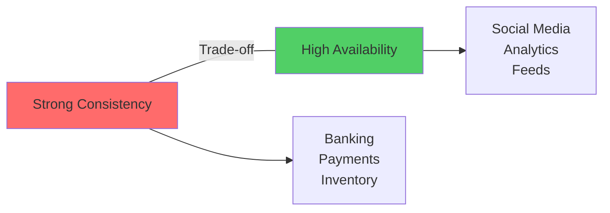
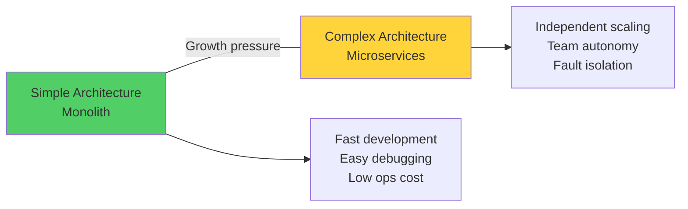

# Trade-offs & Architecture Decision Making

Sau 3 năm làm việc, tôi được promote lên Senior Engineer.

Manager hỏi: *"Em nghĩ điều gì phân biệt Senior Engineer với Junior Engineer?"*

Tôi tự tin: *"Senior biết nhiều patterns hơn, code giỏi hơn, có experience hơn."*

Manager lắc đầu: *"Không. Senior Engineer giỏi ở **trade-off thinking**."*

Một tuần sau, trong architecture review:

Junior Engineer: *"Em suggest dùng microservices cho project mới."*

Manager: *"Tại sao?"*

Junior: *"Vì microservices là best practice, scale tốt, Netflix dùng."*

Manager: *"Với 3 developers và 500 users, cost của microservices là gì? Benefit là gì? Trade-off có worth it không?"*

Junior: *"... Em chưa nghĩ đến."*

**Đó là lúc tôi thực sự hiểu.**

Senior Engineer không phải là người biết nhiều nhất. Mà là người **reason about trade-offs tốt nhất**.

## Tại Sao Trade-off Thinking Là Core Skill?

### The Fundamental Truth

**Trong software architecture, không có perfect solution.**
```
Perfect solution = Myth
Real solution = Trade-offs

Mọi quyết định technical đều có:
Benefits (gains)
Costs (sacrifices)

Choose solution = Choose which trade-off to accept
```

### Junior vs Senior Thinking
```mermaid
graph TB
    subgraph Junior Thinking
        J1[Problem] --> J2[Google "best solution"]
        J2 --> J3[Apply pattern]
        J3 --> J4[Done]
    end
    
    subgraph Senior Thinking
        S1[Problem] --> S2[List alternatives]
        S2 --> S3[Analyze trade-offs]
        S3 --> S4[Consider context]
        S4 --> S5[Choose & justify]
        S5 --> S6[Document reasoning]
    end
    
    style J3 fill:#ff6b6b
    style S5 fill:#51cf66
```

*Junior copy solutions, Senior evaluate trade-offs*

**Example comparison:**
```
Problem: Need cache layer

Junior:
"Use Redis. It's fast and everyone uses it."

Senior:
"Let's evaluate caching options:

Option 1: Redis
Very fast (< 1ms)
Rich data structures
Persistence optional
Memory expensive at scale
Operational overhead
Cost: ~$500/month for 16GB

Option 2: Memcached
Simple, stable
Slightly lower memory footprint
No persistence
Limited data structures
Cost: ~$400/month

Option 3: Application-level cache (in-process)
Zero latency
No infrastructure cost
Simple
Not shared across servers
Limited by server memory

Given our context:
- 5 app servers
- Read-heavy (90% cache hit rate expected)
- Budget-conscious startup
- Simple use case (key-value only)

Recommendation: Memcached
Reasoning: Simplicity + cost savings outweigh Redis features we don't need.
We can migrate to Redis later if we need persistence."

→ Analyzed options
→ Listed trade-offs
→ Considered context
→ Justified decision
```

**Thấy sự khác biệt chưa?**

Senior không chỉ choose solution. Senior **justify why that solution fits context**.

## The Major Trade-offs Mọi Architect Phải Hiểu

### Trade-off 1: Consistency vs Availability

**From CAP Theorem:**
```
Trong distributed system with network partition:
Cannot have BOTH perfect Consistency AND perfect Availability

Must choose:
- CP (Consistency + Partition tolerance)
- AP (Availability + Partition tolerance)
```

**Real-world translation:**


*Consistency vs Availability: Chọn dựa trên business requirements*

**Scenario: E-commerce Inventory**
```python
# Strong Consistency (CP)
def purchase_product(product_id, quantity):
    # Lock row, ensure stock accurate
    with db.transaction():
        product = db.query("SELECT * FROM products WHERE id = ? FOR UPDATE", product_id)
        
        if product.stock < quantity:
            return {"error": "Out of stock"}
        
        product.stock -= quantity
        db.commit()
        
        return {"success": True}

# Trade-offs:
No overselling (critical!)
Accurate inventory
Slow (lock + transaction overhead)
Lower availability (if DB down, can't sell)
Poor scalability (locks limit concurrency)

Why choose this: Overselling = angry customers + revenue loss
Consistency > Availability for this use case
```

**Scenario: Social Media Likes**
```python
# High Availability (AP)
def like_post(post_id, user_id):
    # Async write, eventual consistency
    cache.increment(f"post:{post_id}:likes")
    queue.publish({
        "event": "post_liked",
        "post_id": post_id,
        "user_id": user_id
    })
    
    return {"success": True}

# Worker processes queue eventually
@worker.task
def process_like(event):
    db.execute("INSERT INTO likes ...")

# Trade-offs:
Super fast (< 10ms)
Always available
High scalability
Like count might be slightly off
Eventual consistency (delay 1-2s)

Why choose this: User doesn't care if count is 99 or 101
Availability > Consistency for this use case
```

**Decision framework:**
```python
def choose_consistency_level(feature):
    """Framework để decide consistency vs availability"""
    
    # Ask critical questions
    questions = {
        "financial_impact": "Sai data = mất tiền?",
        "user_experience": "User notice inconsistency?",
        "legal_requirement": "Compliance yêu cầu consistency?",
        "failure_cost": "Downtime cost bao nhiêu?"
    }
    
    if feature.financial_impact == "high":
        return "Strong Consistency (CP)"
    
    if feature.legal_requirement == "yes":
        return "Strong Consistency (CP)"
    
    if feature.user_experience == "unaffected_by_slight_delay":
        return "Eventual Consistency (AP)"
    
    if feature.failure_cost == "very_high":
        return "High Availability (AP)"
    
    # Default: Strong consistency (safer)
    return "Strong Consistency (CP)"

# Examples
choose_consistency_level(Payment)           # → CP (financial)
choose_consistency_level(UserProfile)       # → CP (user-facing)
choose_consistency_level(ViewCount)         # → AP (doesn't matter)
choose_consistency_level(Recommendations)   # → AP (can be stale)
```

### Trade-off 2: Latency vs Cost

**The reality: Speed costs money.**
```
Lower latency = Higher cost (usually)

Ways to reduce latency:
- More servers (costly)
- Faster hardware (costly)
- Closer to users (CDN = costly)
- More caching (memory = costly)
- Database optimization (engineering time = costly)
```

**Scenario: API Response Time**
```python
# Baseline: No optimization
# Latency: 500ms
# Cost: $500/month (basic setup)

# Option 1: Add Redis cache
# Latency: 50ms (10x improvement)
# Cost: $500 + $300 = $800/month
# ROI: Worth it? Depends on user value

# Option 2: Add CDN for static assets
# Latency: 200ms (2.5x improvement)
# Cost: $500 + $100 = $600/month
# ROI: Better bang for buck

# Option 3: Upgrade database (vertical scale)
# Latency: 300ms (1.7x improvement)
# Cost: $500 + $400 = $900/month
# ROI: Expensive for little gain

# Option 4: All of the above
# Latency: 30ms (16x improvement)
# Cost: $500 + $300 + $100 + $400 = $1,300/month
# ROI: Overkill? Depends on requirements
```

**Decision framework:**
```python
# Latency requirements tiers

Tier 1: Real-time (< 50ms)
Use cases: Gaming, trading, video calls
Cost: Very high
Solution: Aggressive caching, edge computing, WebSocket

Tier 2: Interactive (< 200ms)
Use cases: Web apps, mobile apps
Cost: Medium
Solution: Cache, CDN, optimized queries

Tier 3: Responsive (< 1s)
Use cases: Reports, batch operations
Cost: Low
Solution: Basic optimization, no over-engineering

Tier 4: Background (< 10s)
Use cases: Email, notifications, analytics
Cost: Very low
Solution: Async processing, queues
```

**Trade-off analysis:**
```
Question: "Should we add Redis cache?"

Don't answer immediately. Analyze:

Current state:
- API latency: 400ms
- DB query: 300ms (bottleneck)
- Users: 10K
- Complaints: Few

With Redis:
- API latency: 50ms (8x improvement)
- Cost: +$300/month
- Complexity: +1 component to manage
- Cache invalidation: New problems

Is trade-off worth it?
- 10K users × $5/month revenue = $50K/month
- Better UX might increase retention 5% = +$2.5K/month
- Cost = $300/month
- ROI = $2.5K / $300 = 8.3x

Decision: Yes, worth it
```

**Personal guideline:**
```
Optimize latency when:
✓ User experience directly affected
✓ Business metrics correlate with speed
✓ Cost is justified by revenue/retention
✓ Current latency exceeds tier requirements

Don't optimize when:
✗ Users don't notice difference
✗ No business impact
✗ Cost too high relative to benefit
✗ Premature (don't have scale yet)
```

### Trade-off 3: Simplicity vs Scalability

**The eternal tension: Simple now hoặc scale later?**


*Simplicity vs Scalability spectrum: Different stages need different approaches*

**Scenario: Startup Architecture Decision**
```python
# Context
startup = {
    "users": 1000,
    "developers": 3,
    "runway": "12 months",
    "goal": "Product-market fit"
}

# Option 1: Microservices from day 1
architecture_1 = {
    "services": ["user-service", "order-service", "payment-service", "notification-service"],
    "infrastructure": ["Kubernetes", "Kafka", "Service Mesh"],
    "time_to_market": "6 months",
    "operational_complexity": "High",
    "cost": "$5000/month"
}

# Trade-offs:
"Scales to millions" (not needed yet)
Modern architecture
6 months to MVP (too slow!)
High complexity với 3 devs
Expensive for 1K users
Might not reach PMF before running out of money

# Option 2: Monolith with good structure
architecture_2 = {
    "structure": "Modular monolith",
    "infrastructure": ["Heroku", "PostgreSQL", "Redis"],
    "time_to_market": "6 weeks",
    "operational_complexity": "Low",
    "cost": "$500/month"
}

# Trade-offs:
Ship fast (critical for startup!)
Easy to change (iterate quickly)
Low cost
Simple operations
Might need to refactor later (acceptable!)
Not "impressive" architecture

# Which to choose?
# Startup context → Option 2
# Why: Speed > Scalability at this stage
# Can refactor when/if successful
```

**The Refactor Path (Often Better):**
```
Stage 1: Monolith (0-10K users)
- Simple, fast iteration
- Find product-market fit
Time: 6 months

Stage 2: Modular Monolith (10K-100K users)
- Extract modules, clear boundaries
- Add caching, read replicas
Time: +3 months

Stage 3: Selective Microservices (100K-1M users)
- Split hot services only
- Keep core monolith
Time: +6 months

Stage 4: Full Microservices (if needed at 1M+)
- Proven bottlenecks
- Have team & resources
Time: +12 months

Total: ~27 months, but with revenue and team growth
vs
Microservices Day 1: 6 months, might never launch
```

**Decision framework:**
```python
def choose_architecture(context):
    """Simple vs Complex architecture decision"""
    
    if context.users < 10_000:
        return "Monolith"
    
    if context.developers < 10:
        return "Modular Monolith"
    
    if context.has_proven_bottlenecks and context.can_afford_complexity:
        return "Selective Microservices"
    
    if context.users > 10_000_000 and context.developers > 50:
        return "Full Microservices"
    
    # Default: Keep it simple
    return "Monolith"
```

### Trade-off 4: Premature Optimization

**"Premature optimization is the root of all evil" - Donald Knuth**
```
The trap:
"Let's build it to scale to 100M users from day 1!"

Reality:
- 99% of startups never reach 100M users
- Over-engineering for scale you don't have = wasted time
- Time wasted = opportunity cost

Better approach:
- Build for 2x current scale
- Monitor and optimize when needed
- Iterate based on real data
```

**Example: Over-optimization**
```python
# Engineer's proposal for new feature

"We need to build a notification system.
I propose:

- Kafka for event streaming
- Cassandra for storage (scales to billions)
- Microservices architecture
- Service mesh for reliability
- Custom protocol for low latency
- Machine learning for personalization

Timeline: 4 months
Cost: $50K in infrastructure
Team: 3 developers full-time"

# Senior architect's response:

"Let's start simpler:

Current scale:
- 5K users
- ~100 notifications/day
- 99% email, 1% push

MVP approach:
- PostgreSQL for storage (we already have it)
- Background job processor (Celery)
- SendGrid API for emails
- FCM for push notifications

Timeline: 1 week
Cost: $50/month (SendGrid + FCM)
Team: 1 developer part-time

We can refactor when we hit 100K users.
Right now, shipping fast > perfect architecture."

→ 4 months vs 1 week
→ $50K vs $50/month
→ 3 devs vs 1 dev

Which would you choose?
```

**When to optimize:**
```
Optimize when:
- Have real performance problem
- Problem affects users/revenue
- Have data showing bottleneck
- Cost of not optimizing > cost of optimizing

Don't optimize when:
- "Might need it someday"
- "Best practice says so"
- No measurement/data
- Users not complaining
```

## CAP Theorem Intuition (Beyond Theory)

**CAP Theorem simplified:**
```
C - Consistency: All nodes see same data
A - Availability: System always responds
P - Partition tolerance: Works despite network issues

In distributed system: Can only guarantee 2 out of 3
```

But in reality, **network partitions always happen**. So choice is really:
```
CP (Consistency + Partition tolerance):
→ Choose Consistency over Availability
→ System might refuse requests to stay consistent

AP (Availability + Partition tolerance):
→ Choose Availability over Consistency
→ System always responds, might show stale data
```

**Intuitive examples:**

**Bank ATM (CP System):**
```
Scenario: Network partition between ATMs và central bank

CP Behavior:
- ATM detects partition
- ATM disables withdrawals
- Shows error: "Service temporarily unavailable"
- Prevents inconsistent balance

Why CP:
- Cannot risk showing wrong balance
- Cannot risk double withdrawal
- Correctness > Availability

User impact:
- Frustrated (can't withdraw)
- But trust maintained (no data corruption)
```

**Facebook News Feed (AP System):**
```
Scenario: Network partition between data centers

AP Behavior:
- Both data centers continue serving
- Users might see slightly different feeds
- Eventually reconciles when partition heals
- Some likes might take seconds to appear

Why AP:
- User can still browse (good UX)
- Slightly stale feed acceptable
- Availability > Perfect Consistency

User impact:
- Can use app (happy)
- Doesn't notice 2-second delay in like counts
```

**Decision matrix:**
```
Use CP when:
✓ Financial transactions
✓ Inventory management
✓ User authentication
✓ Booking systems (seats, tickets)
✓ Medical records

Use AP when:
✓ Social media feeds
✓ View/like counts
✓ Recommendations
✓ Analytics dashboards
✓ Search results
```

## How to Defend Architecture Decisions

**In architecture reviews, you will be challenged. Here's how to defend:**

### The Defense Framework
```
1. State the problem clearly
2. List alternatives considered
3. Explain trade-offs of each
4. Show why chosen solution fits context
5. Acknowledge limitations
6. Define success metrics
```

**Example defense:**
```
Challenger: "Why did you choose PostgreSQL over MongoDB?"

Weak defense:
"PostgreSQL is better."

Strong defense:
"Let me explain the reasoning:

Problem:
We need to store user data, orders, and relationships.
ACID transactions critical (payment flow).

Alternatives considered:

Option 1: PostgreSQL
ACID transactions
Rich query capabilities (JOINs)
Team already familiar
Proven at scale (Instagram uses it)
Vertical scaling limits
Schema changes expensive
Fit: High (requirements align)

Option 2: MongoDB
Horizontal scaling easier
Flexible schema
Good for rapid prototyping
No ACID across documents
JOIN-like operations expensive
Team needs training
Fit: Medium (some benefits, key drawbacks)

Option 3: Cassandra
Massive scale (billions of rows)
High availability
Eventual consistency (not acceptable)
Complex operations model
Overkill for our scale (10K users)
Fit: Low (over-engineering)

Decision: PostgreSQL
Why:
- ACID transactions non-negotiable (payments)
- Rich querying needed (reports, analytics)
- Team productivity (no learning curve)
- Our scale (10K → 100K users) well within PostgreSQL capacity

Trade-offs accepted:
- Vertical scaling limit (can handle 100K-1M users, enough for now)
- Schema migrations (acceptable with good practices)

Success metrics:
- Query latency < 100ms (currently 50ms)
- Zero transaction failures
- Developer velocity maintained

If PostgreSQL becomes bottleneck (> 1M users):
- Add read replicas first
- Then shard if needed
- Migration path exists

Questions?"

→ Thorough analysis
→ Context-driven decision
→ Trade-offs acknowledged
→ Success criteria defined
→ Evolution path planned
```

### Common Challenges & Responses

**Challenge 1: "Why not use [trendy technology]?"**
```
Response template:
"[Technology X] is great for [specific use case].
Our requirements are [Y], which [X] doesn't optimize for.
Specifically, [trade-off Z] doesn't align with our priorities.
We chose [our solution] because [reasoning]."

Example:
"Kafka is great for high-throughput event streaming.
Our requirement is simple task queue (100 jobs/minute).
Kafka's operational complexity doesn't justify the benefit at our scale.
We chose RabbitMQ for simplicity and quick setup."
```

**Challenge 2: "This won't scale!"**
```
Response template:
"Let's quantify 'scale'.
Current: [X users/requests]
Growth: [Y% per month]
Capacity: [Solution handles Z]
Timeline: [N months before bottleneck]
Plan: [Mitigation strategy]"

Example:
"Current: 10K users, 1K requests/minute
Growth: 20% monthly
Single PostgreSQL handles: 10K writes/second
Timeline: ~24 months before bottleneck (at 150K users)
Plan: Add read replicas at 50K users, shard at 200K+ if needed
This buys us 2 years to validate product-market fit."
```

**Challenge 3: "Too complex / Too simple"**
```
Response:
"Complexity should match the problem.

Our constraints:
- [Scale/Users/Traffic]
- [Team size/expertise]
- [Timeline/Budget]

Given these, [solution] is appropriately sized.
If constraints change, we'll re-evaluate."

Example:
"Our constraints:
- 5K users, 100 req/s
- 2 developers
- 1-month deadline
- $500/month budget

Microservices would be over-engineering.
Monolith with good structure ships fast and handles scale.
We can split later if proven necessary."
```

## Practical Exercise: Trade-off Analysis

**Try analyzing this scenario:**

**Problem:** Design caching strategy for e-commerce product pages

**Context:**
- 100K products
- 1M page views/day
- Products update pricing hourly
- Flash sales change prices every minute
- 70% traffic on top 1K products (hot items)

**Options:**

**Option A: Aggressive caching (long TTL)**
```python
cache_ttl = 3600  # 1 hour

Benefits:
- Very fast (< 10ms)
- Low database load
- Handle traffic spikes

Costs:
- Stale prices (up to 1 hour old)
- Flash sale prices delayed
- User complaints possible
```

**Option B: Short TTL**
```python
cache_ttl = 60  # 1 minute

Benefits:
- Reasonably fresh data
- Flash sales mostly accurate
- Balanced approach

Costs:
- More cache misses
- Higher DB load
- Slightly slower
```

**Option C: Smart invalidation**
```python
# Cache-aside pattern with event-driven invalidation

on_price_update(product_id):
    cache.delete(f"product:{product_id}")

Benefits:
- Always fresh
- Still fast (cached until update)
- Best user experience

Costs:
- Complex implementation
- Invalidation bugs possible
- Need event system
```

**Your task:**

1. Which option would you choose?
2. Why?
3. What trade-offs are you accepting?
4. How would you defend your choice?

**My analysis:**
```
Recommendation: Option C (Smart invalidation)

Reasoning:
- Price accuracy critical (e-commerce trust)
- Flash sales are revenue driver (can't be stale)
- Complexity justified by business value
- 70% hot items = high cache hit rate still

Trade-offs accepted:
- Implementation time (+1 week)
- Operational complexity (monitoring invalidation)
- Dependency on event system

But:
- Revenue impact of accurate pricing > development cost
- Event system useful for other features
- Monitoring is necessity anyway

Alternative for MVP: Option B
- If timeline tight, start with 1-min TTL
- Migrate to Option C when proven valuable
- Phased approach reduces risk
```

## Key Takeaways

**Trade-off thinking = Core skill of Senior Engineer**
```
Junior: "Which technology is best?"
Senior: "Which trade-offs fit our context?"

Experience = Pattern library
Seniority = Trade-off reasoning
```

**Major trade-offs:**
```
Consistency vs Availability
→ Financial data: Consistency
→ Social data: Availability

Latency vs Cost
→ Calculate ROI
→ Optimize when justified

Simplicity vs Scalability
→ Start simple
→ Scale when needed (with data)

Early optimization vs Iteration
→ Build for 2x, not 100x
→ Premature optimization = waste
```

**Defense framework:**
```
1. State problem clearly
2. List alternatives
3. Explain trade-offs
4. Justify choice with context
5. Acknowledge limitations
6. Define success metrics
7. Plan evolution path
```

**CAP theorem intuition:**
```
Network partitions happen (P is given)
Choose: C or A

C (Consistency): Banking, payments, bookings
A (Availability): Social media, analytics, feeds

No perfect answer, only contextual fit
```

**Mental model:**
```
Every architectural decision:
- Has trade-offs (always!)
- Depends on context (no universal "best")
- Should be justified (with reasoning)
- Can evolve (not permanent)
- Requires measurement (not gut feeling)
```

**The ultimate test:**
```
Good architect can answer:
"Why did you choose X over Y?"

With:
✓ Clear problem understanding
✓ Alternative options
✓ Trade-off analysis
✓ Context alignment
✓ Success metrics
✓ Evolution plan

Not with:
✗ "It's best practice"
✗ "Everyone uses it"
✗ "It's newer/faster/cooler"
```

**Remember:**
```
Perfect architecture = Myth
Good architecture = Right trade-offs for your context

Master trade-off thinking
Master architecture decision making
Master being a Senior Engineer
```

Bạn đã học patterns, frameworks, systems. Giờ là lúc học **reason about them**.

**Trade-off thinking separates Senior from Junior. Master it.**
