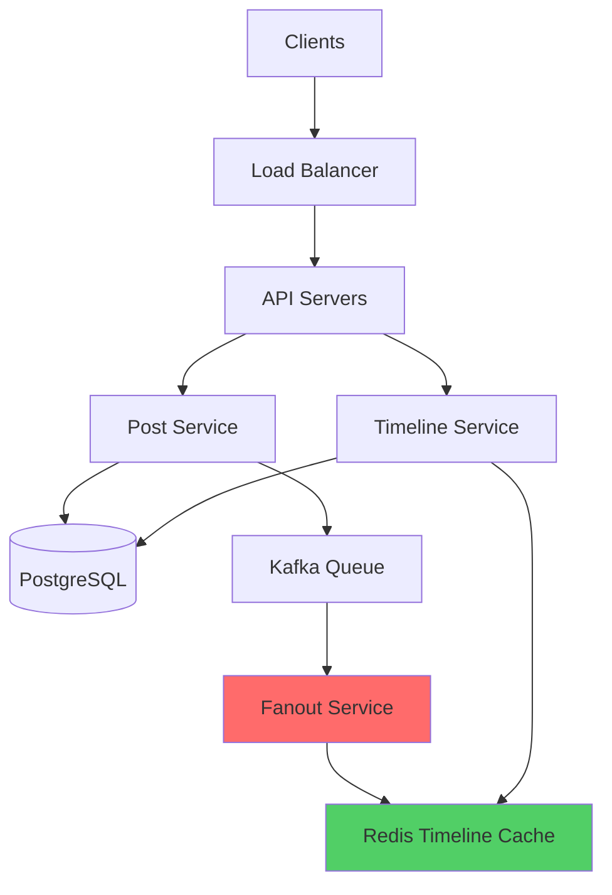
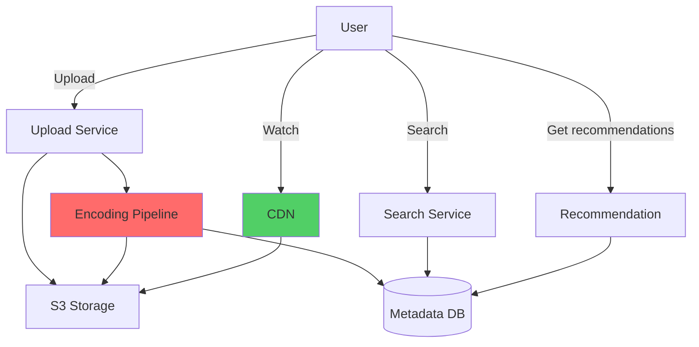
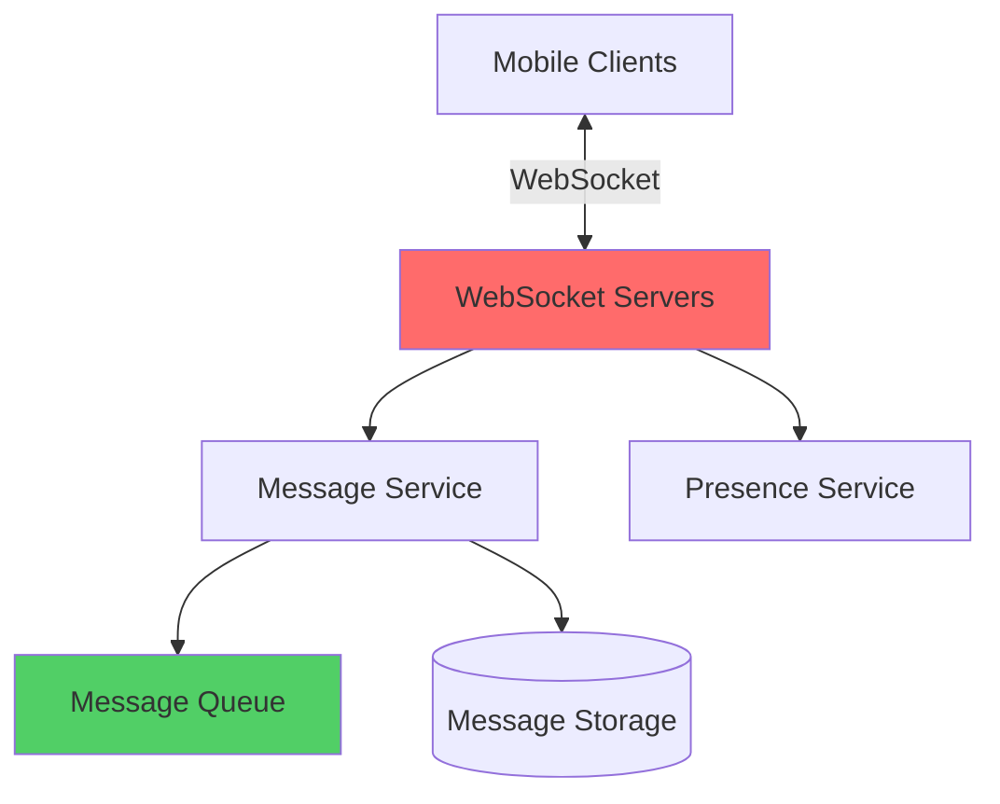
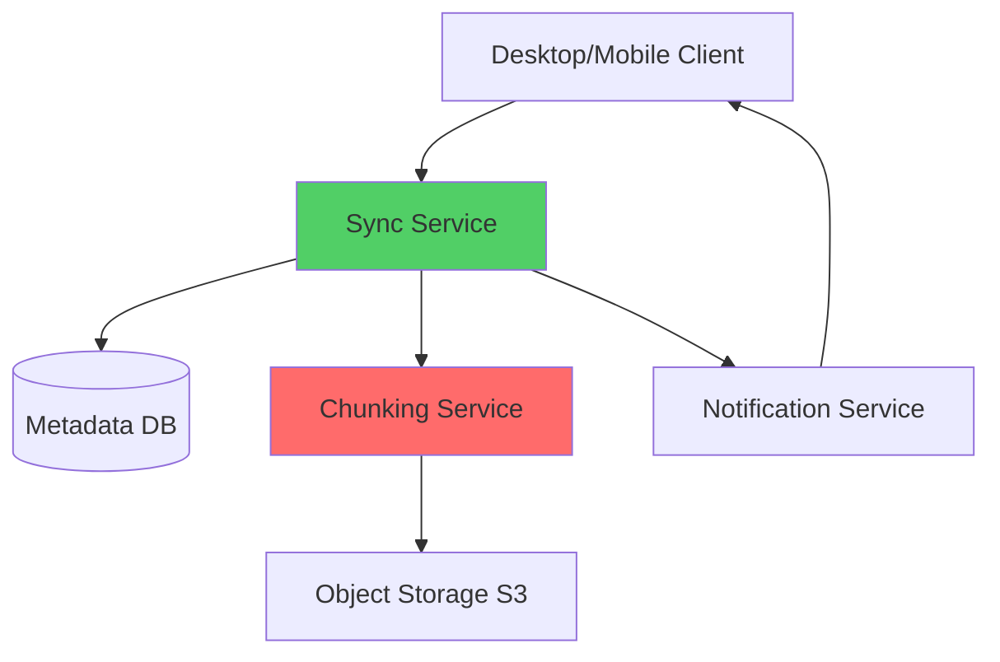

# Real Interview Strategy: Áp Dụng Framework Vào Case Thực Tế

Sau khi học SNAKE framework và trade-off thinking, nhiều người hỏi tôi:

*"Framework thì hiểu rồi, nhưng apply vào Twitter, YouTube... thế nào?"*

Đó là câu hỏi đúng.

Tôi đã làm 50+ system design interviews (cả interviewer lẫn candidate). Tôi nhận ra một pattern:

**Candidates fail không phải vì thiếu kiến thức. Mà vì không biết interviewer muốn gì.**

Mỗi type system có một "story" mà interviewer expect. Nếu bạn hiểu story đó, bạn sẽ structure answer perfectly.

Lesson này sẽ teach: **How to approach các system design problems phổ biến nhất.**

Không phải detailed architecture (bạn đã học Phase 5). Mà là **interview strategy**.

## Tại Sao Cần Strategy Riêng Cho Mỗi System?

### The Pattern Behind Questions

**Interviewers không random pick systems.**

Mỗi system test một set of skills cụ thể:
```
Twitter/Social Feed:
→ Test: Fanout, eventual consistency, write amplification
→ Story: "How to distribute content to millions?"

YouTube/Video Platform:
→ Test: CDN, encoding pipeline, storage optimization
→ Story: "How to deliver video globally?"

WhatsApp/Messaging:
→ Test: Real-time communication, delivery guarantees, encryption
→ Story: "How to ensure message delivery?"

Google Drive/Storage:
→ Test: File sync, conflict resolution, chunking
→ Story: "How to sync files across devices?"
```

**Nếu bạn hiểu "story", bạn biết nên focus vào đâu.**

### Common Mistake: Treating All Systems Same
```
Bad approach:
"Every system cần load balancer, cache, database, message queue..."

→ Generic answer
→ Miss specific challenges
→ No depth

Good approach:
"Twitter's challenge là fanout to millions followers.
YouTube's challenge là video encoding và CDN.
WhatsApp's challenge là real-time delivery guarantees.
Each needs different focus."

→ Specific to problem
→ Shows understanding
→ Demonstrates depth
```

## Strategy 1: Design Twitter (Social Feed System)

### What Interviewer Wants To Hear

**Core challenge:** Distribute posts to millions of followers efficiently

**Key topics to cover:**
1. Fanout strategy (this is THE critical part)
2. Timeline generation
3. Read vs write optimization
4. Celebrity problem
5. Eventual consistency trade-offs

### SNAKE Application

**S - Scope (5 min)**
```
"Let me clarify requirements:

Core features:
✓ Post tweets (280 chars)
✓ Follow users
✓ View home timeline
✓ Like, retweet

Out of scope:
✗ Direct messages
✗ Trending topics
✗ Search

Scale:
- 500M users
- 100M daily active
- 200M tweets/day
- Read-heavy (95% reads)

Correct?"
```

**Critical clarification:**
```
"For timeline generation, should I optimize for:
a) Fast writes (post tweet returns immediately)
b) Fast reads (timeline loads < 100ms)

I'm assuming (b) - optimize for read speed?

→ This shows you understand the core trade-off
→ Interviewer will confirm/correct
```

**N - Numbers (5 min)**
```
"Let me calculate scale:

Write traffic:
200M tweets/day / 86400s ≈ 2,300 tweets/second

Read traffic:
100M users × 10 timeline loads/day = 1B loads/day
≈ 12,000 requests/second

Read:Write ratio = 12K:2.3K ≈ 5:1
→ Read-heavy, caching critical

Storage (5 years):
200M tweets/day × 365 × 5 = 365B tweets
× 1KB per tweet = 365TB

Fanout calculation:
Average followers: 200
Write amplification: 2,300 tweets/s × 200 = 460K timeline updates/second
→ This is the bottleneck to solve!"

→ Shows you identified THE critical challenge
```

**A - API (5 min)**
```
Core APIs:

POST /v1/tweets
{
  "content": "Hello world!",
  "media_urls": []
}

GET /v1/timeline?cursor={cursor}&limit=20

POST /v1/tweets/{id}/like

POST /v1/users/{id}/follow
```

**K - Key Components (15 min)**


*Twitter architecture: Focus vào Fanout Service và Timeline Cache*

**Critical discussion (spend most time here):**
```
"The core challenge is fanout. Let me explain my approach:

Hybrid Fanout Strategy:

Normal users (< 10K followers):
- Fanout on write
- When user posts → Push to all followers' timelines
- Pre-computed feeds = fast reads

Celebrities (> 10K followers):
- Fanout on read
- Don't push to millions of timelines
- Pull when followers load feed

Trade-offs:
Fast reads for most users (< 50ms from cache)
Avoid celebrity fanout explosion
Slight delay for celebrity tweets (acceptable)
Mixed approach = more complexity

Timeline cache structure:
- Redis sorted set per user
- Key: timeline:{user_id}
- Score: timestamp
- Members: tweet IDs
- Keep 1000 recent tweets

Why this works:
- 90% of timeline loads hit cache
- Pre-computed for fast UX
- Celebrity tweets merge on-demand"

→ This is what interviewer wants to hear
→ Shows deep understanding
→ Addresses the core challenge
```

**E - Elaborate (15 min)**

**Pick 2-3 areas for deep dive:**
```
1. Fanout implementation details
"Let me show fanout worker logic:

When tweet published:
- Async job via Kafka
- Worker fetches follower list
- Batch insert to Redis timelines (100 followers/batch)
- If follower count > 10K → Skip fanout, mark as celebrity

This handles 460K updates/second with:
- 100 fanout workers
- Each processes 4,600 updates/s
- Batching reduces Redis ops"

2. Celebrity problem solution
"For Taylor Swift (100M followers):
- Don't fanout on write
- When followers load timeline:
  → Fetch pre-computed feed (normal users)
  → Merge celebrity tweets (on-demand query)
  → Sort by timestamp
  → Apply ranking"

3. Failure handling
"If Kafka queue backs up:
- Circuit breaker stops new fanout jobs
- Prioritize VIP users
- Degrade to pull-based for all during high load"
```

### What Makes This Answer Strong
```
✓ Identified core challenge (fanout)
✓ Proposed specific solution (hybrid)
✓ Explained trade-offs clearly
✓ Showed scalability thinking
✓ Demonstrated depth on critical parts
```

## Strategy 2: Design YouTube (Video Platform)

### What Interviewer Wants To Hear

**Core challenge:** Encode, store, and deliver video globally at massive scale

**Key topics to cover:**
1. Video upload pipeline
2. Encoding strategy (multiple resolutions)
3. CDN for global delivery
4. Storage optimization
5. Recommendation system (high-level)

### SNAKE Application Focus

**S - Scope**
```
"Let me clarify:

Core features:
✓ Upload videos
✓ Watch videos
✓ Search videos
✓ Recommendations (high-level only)

Out of scope:
✗ Live streaming
✗ Comments system
✗ Monetization

Scale assumptions:
- 500M users
- 1B video views/day
- 100M hours watched/day
- 500K video uploads/day

Correct?"
```

**N - Numbers (Critical for YouTube)**
```
"Let me calculate storage and bandwidth:

Upload storage:
500K uploads/day
Average: 10 min video at 1080p = 1GB
Daily: 500K × 1GB = 500TB/day
Yearly: 500TB × 365 = 180PB/year
→ Need distributed object storage (S3)

But we encode multiple resolutions:
- 360p (100MB)
- 720p (300MB)
- 1080p (1GB)
- 4K (4GB) - optional
Total per video: ~5GB
→ 500K × 5GB = 2.5PB/day storage!

Bandwidth (delivery):
1B views/day
Average watch time: 6 minutes
Average bitrate: 5 Mbps
Total: 1B × 6 min × 5 Mbps = 3 exabytes/month
→ CDN absolutely critical!"

→ Numbers show you understand scale
```

**K - Key Components (Focus Areas)**


*YouTube: Focus vào Encoding Pipeline và CDN delivery*

**Critical discussions:**
```
1. Upload and Encoding Pipeline:

"Upload flow:
1. User uploads raw video → Upload Service
2. Store original in S3 (cold storage)
3. Trigger encoding pipeline (async)
4. Encode multiple resolutions in parallel:
   - 360p, 720p, 1080p, 4K
   - Different codecs (H.264, VP9, AV1)
5. Generate thumbnails
6. Update metadata database
7. Notify user

Encoding takes time:
- 10 min video → 30 min to encode all formats
- User doesn't wait (async processing)
- Shows 'Processing' status

Why multiple resolutions:
- Adaptive bitrate streaming
- User with slow connection → 360p
- User with fast connection → 4K
- Seamless quality switching"

2. CDN Strategy:

"CDN is critical:
- 3 exabytes/month = $300K+ without CDN
- With CDN: $50K (5x savings!)

How it works:
- Video stored in S3 (origin)
- CDN caches popular videos at edge
- User request → Nearest CDN edge
- Edge miss → Fetch from origin

Cache strategy:
- Top 10% videos (trending) → Cache aggressively
- Long tail → On-demand caching
- Cache eviction: LRU

Why this matters:
- Low latency (< 100ms to start playback)
- Handle viral videos (millions concurrent)
- Cost optimization"
```

### What Makes This Answer Strong
```
✓ Massive scale numbers (exabytes!)
✓ Encoding pipeline detailed
✓ CDN strategy with cost analysis
✓ Adaptive streaming explained
✓ Async processing pattern
```

## Strategy 3: Design WhatsApp (Messaging System)

### What Interviewer Wants To Hear

**Core challenge:** Deliver messages reliably in real-time with high availability

**Key topics to cover:**
1. Real-time delivery (WebSocket)
2. Message delivery guarantees
3. Offline message handling
4. Group messaging
5. End-to-end encryption (conceptual)

### SNAKE Application Focus

**S - Scope**
```
"Let me clarify:

Core features:
✓ 1-on-1 messaging
✓ Group messaging (< 256 members)
✓ Delivery receipts (sent, delivered, read)
✓ Offline message storage

Out of scope:
✗ Voice/video calls
✗ Status updates
✗ Payment features

Scale:
- 2B users
- 100B messages/day
- Need real-time delivery
- 99.99% delivery guarantee

Correct?"
```

**N - Numbers**
```
"Message traffic:
100B messages/day / 86400s ≈ 1.1M messages/second
Peak (3x): 3.3M messages/second

Storage:
Average message: 100 bytes
100B messages/day × 365 × 2 years = 73 trillion messages
× 100 bytes = 7.3 PB
→ Need distributed storage

Connection load:
100M concurrent users online
Each maintains WebSocket connection
= 100M persistent connections
→ Need connection pooling, multiple servers"
```

**K - Key Components**


*WhatsApp: Focus vào WebSocket layer và Message Queue*

**Critical discussions:**
```
1. Real-time Delivery:

"WebSocket connection per user:
- Persistent connection maintained
- Low latency (< 50ms)
- Bidirectional communication

Message flow:
1. Sender → WebSocket Server A
2. Server A → Message Service
3. Message Service → Check recipient online
4. If online:
   → Forward to recipient's WebSocket Server
   → Deliver immediately
5. If offline:
   → Store in message queue
   → Deliver when recipient comes online

Why this works:
- Real-time for online users
- Guaranteed delivery for offline users
- Scales horizontally (multiple WS servers)"

2. Delivery Guarantees:

"At-least-once delivery:
- Message stored in queue until confirmed
- Client sends ACK when received
- Retry if no ACK within 30s
- Persistent queue (Kafka)

Three checkmarks:
✓ Sent: Message left sender's device
✓✓ Delivered: Message reached recipient's device
✓✓✓ Read: Recipient opened chat

Implementation:
- Each status update is separate message
- Delivered via same WebSocket channel
- Store in database for history"

3. Offline Handling:

"When user offline:
- Messages queued in persistent storage
- Retained for 30 days
- When user comes online:
  → Fetch queued messages
  → Deliver in order
  → Mark as delivered
  → Delete from queue

Why queue-based:
- Guaranteed delivery
- Handle network interruptions
- Support multiple devices"
```

**E - Elaborate**
```
Group Messaging:

"Challenge: Deliver to 256 members efficiently

Naive approach:
- Send 256 individual messages
- Fanout problem similar to Twitter

Better approach:
- Single message stored once
- 256 pointers to same message
- Deliver to online members (WebSocket)
- Queue for offline members

Trade-off:
Storage efficient
Consistent message
Complex read logic (need follow pointers)"

Encryption:

"End-to-end encryption (high-level):
- Messages encrypted on sender device
- Server cannot decrypt (zero-knowledge)
- Only recipient can decrypt

Implication:
- Search must be client-side
- Backup encrypted
- Server just routes encrypted bytes"
```

### What Makes This Answer Strong
```
✓ Real-time focus (WebSocket)
✓ Delivery guarantees detailed
✓ Offline handling strategy
✓ Scalability numbers
✓ Group messaging optimized
```

## Strategy 4: Design Google Drive (Cloud Storage)

### What Interviewer Wants To Hear

**Core challenge:** Sync files across devices reliably with conflict resolution

**Key topics to cover:**
1. File sync algorithm
2. Chunking strategy
3. Conflict resolution
4. Delta sync (only changed parts)
5. Collaboration (real-time editing)

### SNAKE Application Focus

**S - Scope**
```
"Let me clarify:

Core features:
✓ Upload/download files
✓ Sync across devices
✓ File versioning
✓ Sharing (read/write permissions)

Out of scope:
✗ Real-time collaborative editing (Google Docs)
✗ Third-party app integrations
✗ Advanced search

Scale:
- 1B users
- 10B files stored
- Average file size: 5MB
- 1M active syncs/minute

Correct?"
```

**N - Numbers**
```
"Storage:
10B files × 5MB = 50 exabytes
→ Need distributed object storage

Sync traffic:
1M syncs/minute
Average: 2 files changed per sync
= 2M file operations/minute
= 33K operations/second

Bandwidth:
33K ops × 5MB = 165 GB/second
→ Need chunking to reduce bandwidth!"
```

**K - Key Components**


*Google Drive: Focus vào Sync Service và Chunking*

**Critical discussions:**
```
1. Chunking Strategy:

"Why chunking:
- 1GB file uploaded
- User edits 1 line
- Without chunking: Re-upload 1GB
- With chunking: Upload only changed chunk

Implementation:
- Split file into 4MB chunks
- Hash each chunk (SHA-256)
- Upload only chunks with changed hashes

Example:
1GB file = 250 chunks
User edits → 1 chunk changed
Upload: 4MB instead of 1GB
→ 250x bandwidth savings!

Deduplication:
- Same chunk hash = same content
- Store once, reference multiple times
- Saves storage (many users upload same files)"

2. Sync Algorithm:

"Sync flow:
1. Client monitors file changes
2. Change detected → Compute chunk hashes
3. Compare with server hashes
4. Upload only changed chunks
5. Server reconstructs file
6. Notify other clients

Conflict detection:
- Last-write-wins? (can lose data)
- Better: Version history
- User modifies file offline on 2 devices
- Both upload when online
- Server detects conflict
- Keeps both versions
- Let user merge manually"

3. Metadata Structure:

"File metadata:
{
  file_id: "abc123",
  name: "document.pdf",
  size: 5242880,
  chunks: [
    {chunk_id: "ch1", hash: "a1b2...", offset: 0},
    {chunk_id: "ch2", hash: "c3d4...", offset: 4194304}
  ],
  version: 5,
  modified_by: "user_id",
  modified_at: "2024-03-15T10:30:00Z"
}

Why this structure:
- Reconstruct file from chunks
- Detect changes (hash comparison)
- Version history
- Deduplication possible"
```

**E - Elaborate**
```
Real-time Notifications:

"When file synced:
- Server pushes notification to all connected clients
- WebSocket or long-polling
- Client checks if local file outdated
- Auto-download if needed

Why real-time:
- User on laptop edits file
- User on phone sees update immediately
- Seamless cross-device experience

Offline Support:

"Challenge: User edits offline, another user edits same file

Solution:
- Each edit creates new version
- When online, upload as new version
- Server detects multiple versions
- UI shows: 'Conflicted copy (User 2's device)'
- User manually merges

Trade-off:
Never lose data
User in control
Manual merge required (rare case)"
```

### What Makes This Answer Strong
```
✓ Chunking strategy detailed
✓ Delta sync explained
✓ Conflict resolution addressed
✓ Bandwidth optimization shown
✓ Metadata structure designed
```

## Interview Mindset: What Interviewers Really Want

### Beyond Technical Knowledge

**Interviewers evaluate:**
```
1. Problem Understanding (30%)
   - Do you clarify requirements?
   - Do you identify core challenges?
   
2. System Design Skills (40%)
   - Can you design scalable architecture?
   - Do you consider trade-offs?
   - Can you estimate capacity?
   
3. Communication (20%)
   - Can you explain clearly?
   - Do you think out loud?
   - Are you collaborative?
   
4. Depth of Knowledge (10%)
   - Do you understand technologies deeply?
   - Can you discuss alternatives?
```

### Red Flags That Fail Interviews
```
Jump to solution without clarifying
Generic architecture (no customization to problem)
No scale calculations
No trade-off discussions
Silent design (not thinking out loud)
Defensive when challenged
Buzzword heavy, no depth
```

### Green Flags That Pass Interviews
```
Ask clarifying questions
Calculate scale (shows data-driven thinking)
Explain trade-offs ("I chose X over Y because...")
Think out loud
Adjust based on feedback
Show depth on 2-3 areas
Discuss failure scenarios
Propose monitoring strategy
```

## Practice Strategy

### How To Prepare

**Step 1: Master SNAKE Framework (1 week)**
- Practice 5 different problems với strict time limit
- Get comfortable với flow

**Step 2: Study 4 Major Categories (2 weeks)**
- Social systems (Twitter, Facebook, Instagram)
- Video systems (YouTube, Netflix, TikTok)
- Messaging systems (WhatsApp, Slack, Discord)
- Storage systems (Google Drive, Dropbox, S3)

**Step 3: Mock Interviews (2-4 weeks)**
- Practice với peers
- Record yourself
- Get feedback
- Iterate

### Practice Problems By Category
```
Social Feed:
- Design Twitter
- Design Instagram
- Design LinkedIn feed
- Design Reddit

Video Platform:
- Design YouTube
- Design Netflix
- Design Twitch
- Design TikTok

Messaging:
- Design WhatsApp
- Design Slack
- Design Discord
- Design Telegram

Storage/Sync:
- Design Google Drive
- Design Dropbox
- Design iCloud
- Design S3

E-commerce:
- Design Amazon
- Design Uber
- Design Airbnb
- Design food delivery

Infrastructure:
- Design URL shortener
- Design rate limiter
- Design web crawler
- Design distributed cache
```

### Time Management Template
```
0-7 min:   Scope (requirements clarity)
7-14 min:  Numbers (capacity estimation)
14-21 min: API (interface design)
21-33 min: Key Components (architecture)
33-45 min: Elaborate (deep dives)

Practice với timer!
Discipline là key
```

## Key Takeaways

**Each system type has a "story":**
```
Twitter = Fanout problem
YouTube = Encoding + CDN
WhatsApp = Real-time delivery
Google Drive = Sync + conflict resolution

Know the story → Know where to focus
```

**Interview success formula:**
```
Technical knowledge × Communication × Structure = Success

You can be technically strong but fail without structure
You can have perfect structure but fail without depth
You need both!

SNAKE framework provides structure
Practice provides technical depth
Mock interviews improve communication
```

**What interviewers want:**
```
Not perfection
Not all details
Not memorized solutions

But:
✓ Clear thinking process
✓ Trade-off awareness
✓ Scalability mindset
✓ Communication clarity
✓ Depth where it matters
```

**Practice strategy:**
```
Week 1: Master SNAKE framework
Week 2-3: Study system categories
Week 4-6: Mock interviews
Week 7+: Real interviews

Consistent practice > Cramming
45 minutes × 30 problems = Ready
```

**Final advice:**
```
In interview:
- Breathe (you know this!)
- Clarify before designing
- Think out loud
- Show trade-offs
- Be collaborative
- Have fun (seriously!)

Remember:
You've studied hard
You understand systems
You have a framework
You're ready

Trust your preparation
```

Bạn đã có knowledge (6 phases). Bạn đã có framework (SNAKE). Bạn đã có strategy (lesson này).

**Giờ là lúc practice và ace those interviews!**

---

**Congratulations!** Bạn đã hoàn thành toàn bộ System Design From Zero to Hero.

**From Phase 0 (Mental Model Shift) to Phase 6 (System Design Mastery), you've transformed from developer to architect.**

Keep practicing. Keep building. Keep growing.

**You're ready. Go ace those interviews! 🚀**