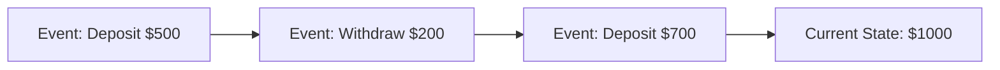
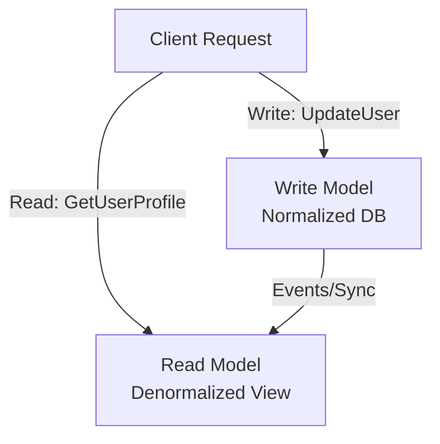
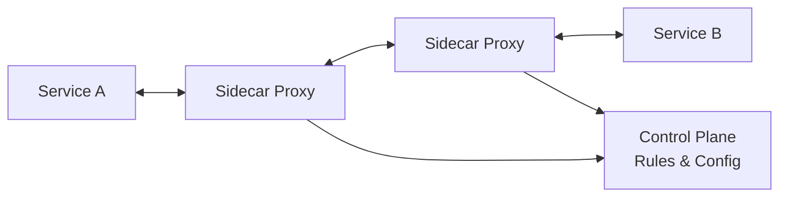
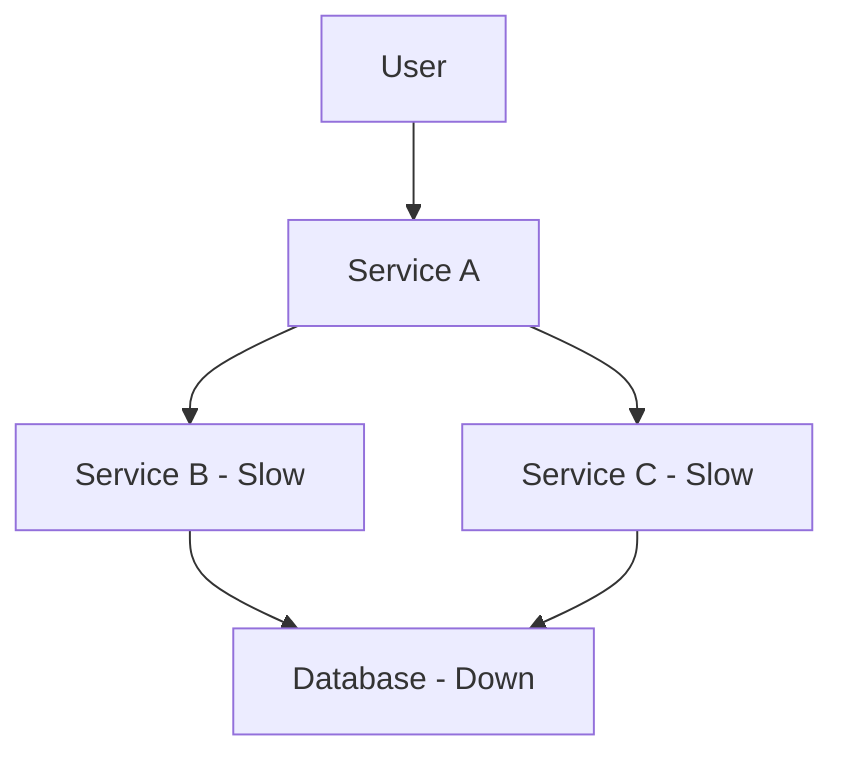
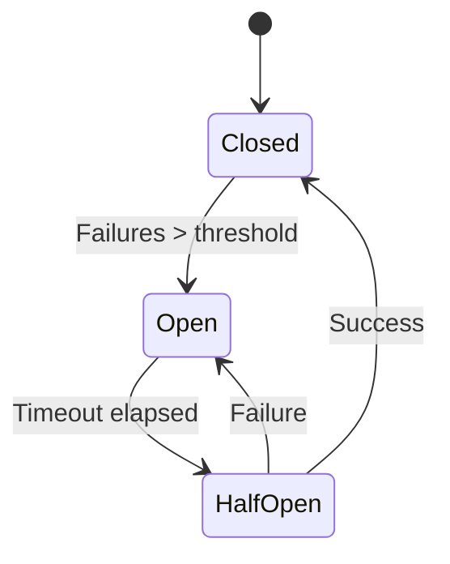
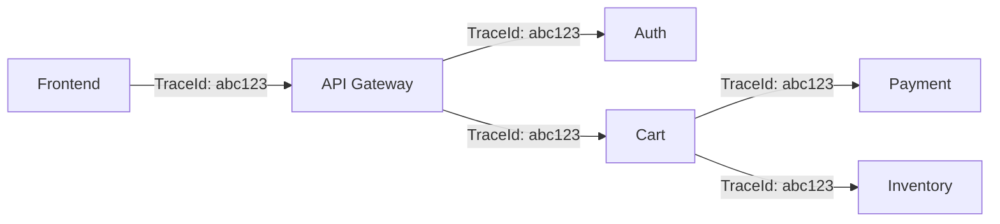

# Advanced Architecture Topics - Kiến Thức Differentiate Senior vs Staff Engineer

Khi bạn đã master được system design fundamentals, patterns, và trade-off thinking, câu hỏi tiếp theo là: **"Điều gì tạo nên sự khác biệt giữa senior và staff engineer?"**

Câu trả lời không phải là học thêm patterns. Mà là **hiểu sâu về những vấn đề mà chỉ distributed systems ở scale mới gặp phải** - và biết cách giải quyết chúng một cách có hệ thống.

Lesson này không phải "must-know" để làm system design interview. Nhưng nó là **kiến thức giúp bạn thinking ở level cao hơn** - từ "design một system" sang "evolve và maintain production systems at scale".

## Tại Sao Các Topics Này Lại "Advanced"?

### Reality Check

Hầu hết systems không cần event sourcing hay service mesh. Nhưng khi bạn gặp những problems này:

- **Audit trail không đầy đủ** → cần replay toàn bộ history
- **Read và write có requirement khác nhau hoàn toàn** → CQRS
- **Service communication phức tạp với 50+ microservices** → Service Mesh
- **Không tin hệ thống có thể handle failure** → Chaos Engineering
- **Duplicate requests gây data corruption** → Idempotency
- **Cascading failures lan như domino** → Circuit Breaker
- **Debug distributed systems như mò kim đáy bể** → Distributed Tracing

Lúc đó, bạn mới hiểu tại sao những concepts này tồn tại.

## 1. Event Sourcing - Store Events, Not State

### Vấn Đề Của Traditional State Storage
```
Traditional Database:
User Balance: $1000 (current state only)

Mất hết history
Không biết balance này từ đâu ra
Không audit được
Không replay được
```

### Event Sourcing Approach

**Core idea: Store every change as an event, derive state from events**

```
Event Store:
1. UserCreated { userId: 123 }
2. MoneyDeposited { userId: 123, amount: 500 }
3. MoneyWithdrawn { userId: 123, amount: 200 }
4. MoneyDeposited { userId: 123, amount: 700 }

Current State = Replay all events
Balance = 0 + 500 - 200 + 700 = $1000
```

### Tại Sao Event Sourcing?

**1. Complete Audit Trail**
- Biết chính xác điều gì đã xảy ra, khi nào, tại sao
- Compliance và regulatory requirements

**2. Time Travel**
- Rebuild state tại bất kỳ thời điểm nào trong quá khứ
- Debug production issues by replaying events

**3. Multiple Projections**
- Cùng một event stream → nhiều views khác nhau
- Analytics, reporting, real-time dashboards

**4. Scalability**
- Events là append-only → cực kỳ nhanh
- Không cần locking, transactions phức tạp

### Trade-offs

**Pros:**
- Full history và audit trail
- Time travel capabilities
- Easy to add new projections
- Event replay cho debugging

**Cons:**
- Complexity tăng đáng kể
- Event schema evolution khó
- Storage tăng (lưu mọi event)
- Query current state phải replay events
- Learning curve cao

### Khi Nào Dùng Event Sourcing?

**Dùng khi:**
- Banking, financial systems (cần audit đầy đủ)
- Domain phức tạp với nhiều business rules
- Cần complete history và time travel
- Multiple projections từ cùng data

**Không dùng khi:**
- Simple CRUD applications
- Team chưa có experience
- Audit trail không critical
- Complexity không justify benefits

## 2. CQRS - Command Query Responsibility Segregation

### Core Concept

**CQRS = Tách riêng read và write models**


### Tại Sao CQRS?

**Reality: Read và Write có requirements hoàn toàn khác nhau**
```
Write Side:
- Validate business rules
- Ensure consistency
- Handle transactions
- Normalized data

Read Side:
- Fast queries
- Complex joins
- Aggregations
- Denormalized views
```

### Example: E-commerce Product Page

**Without CQRS (Single Model):**
```sql
-- Mỗi lần load product page:
SELECT p.*, c.name as category_name, 
       AVG(r.rating) as avg_rating,
       COUNT(r.id) as review_count,
       i.quantity as stock
FROM products p
JOIN categories c ON p.category_id = c.id
LEFT JOIN reviews r ON p.id = r.product_id
LEFT JOIN inventory i ON p.id = i.product_id
WHERE p.id = ?
GROUP BY p.id

-- Slow vì phải join nhiều tables mỗi request
```

**With CQRS:**
```javascript
// Write Side (normalized)
await db.products.update({ id, name, price })
await eventBus.publish('ProductUpdated', { id, name, price })

// Read Side (denormalized view)
await cache.set(`product:${id}`, {
  id, name, price,
  category: 'Electronics',
  avgRating: 4.5,
  reviewCount: 1203,
  stock: 50
})

// Read cực nhanh - chỉ 1 cache lookup
const product = await cache.get(`product:${id}`)
```

### CQRS + Event Sourcing Combo
```
Write Side: Event Store
↓
Events: ProductCreated, PriceUpdated, ReviewAdded
↓
Read Side: Materialized Views
- Product Detail View (cache)
- Search Index (Elasticsearch)
- Analytics Dashboard (BigQuery)
```

### Trade-offs

**Pros:**
- Optimize read và write độc lập
- Scale read và write riêng biệt
- Multiple read models cho use cases khác nhau
- Performance cải thiện đáng kể

**Cons:**
- Eventual consistency giữa write và read
- Complexity tăng (2 models thay vì 1)
- Data sync phải reliable
- Harder để debug và maintain

### Khi Nào Dùng CQRS?

**Dùng khi:**
- Read:Write ratio chênh lệch lớn (99:1)
- Read queries cực kỳ complex
- Cần scale read và write khác nhau
- Multiple views từ cùng data

**Không dùng khi:**
- Simple CRUD với read/write balanced
- Strong consistency required
- Team nhỏ, không đủ resource maintain

## 3. Service Mesh - Infrastructure Layer For Service Communication

### Vấn Đề Của Microservices Communication

Khi bạn có 50+ microservices:
```
Service A call Service B:
- Retry logic?
- Circuit breaker?
- Load balancing?
- TLS encryption?
- Tracing?
- Metrics?

→ Mỗi service phải implement lại tất cả
→ Code duplication
→ Inconsistent behavior
```

### Service Mesh Solution

**Core idea: Move network logic ra khỏi application code, vào infrastructure layer**


**Sidecar proxy** (như Envoy) intercept tất cả traffic:
```
Service A → Sidecar Proxy A → Sidecar Proxy B → Service B

Proxy handles:
- Load balancing
- Retries
- Circuit breaking
- TLS
- Metrics
- Tracing
```

### Service Mesh Features

**1. Traffic Management**
- Load balancing algorithms
- Circuit breakers tự động
- Retry và timeout policies
- Traffic splitting (canary, blue-green)

**2. Security**
- Mutual TLS (mTLS) tự động
- Authentication giữa services
- Authorization policies

**3. Observability**
- Distributed tracing tự động
- Metrics collection
- Service topology visualization

**4. Resilience**
- Automatic retries
- Circuit breakers
- Fault injection để test

### Popular Service Meshes

- **Istio** - full-featured, complex
- **Linkerd** - simpler, lightweight
- **Consul Connect** - HashiCorp ecosystem

### Trade-offs

**Pros:**
- Centralized configuration
- Consistent behavior across services
- Observability out-of-the-box
- Security features tự động

**Cons:**
- Complexity cao - thêm 1 layer infrastructure
- Performance overhead (proxy layer)
- Learning curve steep
- Debugging khó hơn

### Khi Nào Cần Service Mesh?

**Dùng khi:**
- 50+ microservices
- Need consistent traffic management
- Security requirements cao (mTLS everywhere)
- Observability critical

**Không dùng khi:**
- < 10 microservices
- Monolith hoặc simple architecture
- Team chưa mature với Kubernetes
- Performance overhead không chấp nhận được

## 4. Chaos Engineering - Break Things On Purpose

### Core Philosophy

**"The best way to avoid failure is to fail constantly"**
```
Traditional Testing:
Test → Deploy → Hope nothing breaks

Chaos Engineering:
Deploy → Intentionally break things → Fix weaknesses → More resilient
```

### Netflix's Chaos Monkey

Netflix pioneer chaos engineering:
```
Chaos Monkey randomly:
- Terminates production instances
- Kills services
- Adds latency
- Drops network packets

Goal: Force systems to be resilient by design
```

### Chaos Engineering Principles

**1. Start With Hypothesis**
```
Hypothesis: "If payment service fails, 
            users can still browse products"

Experiment: Kill payment service in production
Measure: Browse functionality still works?
```

**2. Minimize Blast Radius**
```
Start small:
- 1 instance → 1 service → 1 region → global

Not: Kill everything at once
```

**3. Automate Experiments**
```javascript
// Automated chaos experiment
const experiment = {
  name: 'Database Failover',
  hypothesis: 'System handles DB failure gracefully',
  blast_radius: '10% traffic',
  
  fault: {
    type: 'database_failure',
    duration: '5 minutes'
  },
  
  steady_state: {
    metric: 'api_success_rate',
    threshold: '> 99%'
  }
}

// Run weekly tự động
```

### Common Chaos Experiments

**1. Service Failures**
- Random instance termination
- Service unavailable
- Dependency failures

**2. Network Issues**
- Latency injection
- Packet loss
- Network partition

**3. Resource Exhaustion**
- CPU spike
- Memory leak simulation
- Disk full

**4. State Corruption**
- Clock skew
- Data corruption
- Zombie nodes

### Tools

- **Chaos Monkey** - Netflix's original
- **Gremlin** - commercial platform
- **Chaos Mesh** - Kubernetes native
- **Litmus** - CNCF project

### Trade-offs

**Benefits:**
- Uncover weaknesses trước khi production incident
- Build confidence in system resilience
- Force teams thinking về failure scenarios
- Reduce MTTR (Mean Time To Recovery)

**Challenges:**
- Rủi ro cause real outages
- Cần mature monitoring và alerting
- Cultural shift - accept breaking things
- Time investment lớn

### Khi Nào Áp Dụng Chaos Engineering?

**Dùng khi:**
- Production systems critical
- Already have good monitoring
- Team mature với distributed systems
- Cost of downtime cao

**Chưa dùng khi:**
- System chưa stable
- Monitoring chưa tốt
- Đang fire-fighting incidents thường xuyên

## 5. Idempotency - Handle Duplicate Requests Safely

### Vấn Đề: Network Unreliable
```
Client → Server: Create Payment $100

Scenario 1:
Client sends → Server processes → Response lost
Client retries → Server charges $200 ❌

Scenario 2 (Idempotent):
Client sends with ID → Server processes
Client retries with same ID → Server returns cached result
Total charged: $100 ✅
```

### Core Concept

**Idempotent operation: Calling multiple times = same result as calling once**
```
Mathematical:
f(f(x)) = f(x)

Example:
SET value = 10  → idempotent
value = value + 1  → NOT idempotent
```

### Implementation Strategies

**1. Idempotency Keys**
```javascript
// Client generates unique key
const idempotencyKey = uuidv4()

await api.post('/payments', {
  amount: 100,
  idempotency_key: idempotencyKey
})

// Server side
async function processPayment(request) {
  const { amount, idempotency_key } = request
  
  // Check if already processed
  const cached = await cache.get(idempotency_key)
  if (cached) {
    return cached.result  // Return previous result
  }
  
  // Process payment
  const result = await chargeCard(amount)
  
  // Cache result
  await cache.set(idempotency_key, { result }, { ttl: 86400 })
  
  return result
}
```

**2. Natural Idempotency**
```javascript
// Idempotent by design
PUT /users/123
{
  "name": "John",
  "email": "john@example.com"
}

// Calling nhiều lần → same state
```

**3. Database Constraints**
```sql
CREATE UNIQUE INDEX idx_payment_idempotency 
ON payments(idempotency_key);

-- Duplicate insert sẽ fail → retry-safe
```

### Idempotency Levels

**1. HTTP Method Level**
```
GET, PUT, DELETE → idempotent by spec
POST → NOT idempotent (need explicit handling)
```

**2. Application Level**
```javascript
// Check database state
const existingOrder = await db.orders.findOne({ 
  userId, productId 
})

if (existingOrder) {
  return existingOrder  // Already exists
}

// Create new
return await db.orders.create({ userId, productId })
```

**3. Distributed System Level**
```
Use distributed locks:
- Acquire lock with idempotency key
- Process if lock acquired
- Release lock
- Retry safe
```

### Real-World Examples

**Stripe Payments:**
```javascript
await stripe.charges.create({
  amount: 1000,
  currency: 'usd',
  source: 'tok_visa',
  idempotency_key: '123e4567-e89b-12d3'
})

// Retry with same key → returns original charge
```

**Message Processing:**
```javascript
// Consumer with deduplication
async function processMessage(message) {
  const messageId = message.id
  
  const processed = await db.processed_messages
    .findOne({ messageId })
  
  if (processed) {
    return  // Already processed
  }
  
  // Process message
  await handleMessage(message)
  
  // Mark as processed
  await db.processed_messages.insert({ 
    messageId, 
    processedAt: Date.now() 
  })
}
```

### Trade-offs

**Benefits:**
- Safe retries
- Avoid duplicate charges, orders, etc.
- Better reliability

**Costs:**
- Extra storage (cache idempotency keys)
- Complexity in implementation
- TTL management (keys expire khi nào?)

## 6. Circuit Breaker - Stop Cascading Failures

### Vấn Đề: Cascading Failures

```
Database down → Service B slow (waiting for timeout)
→ Service A threads blocked waiting for B
→ Service A down
→ All dependent services down
→ Entire system down
```

### Circuit Breaker Pattern

**Idea: Stop calling failing services, fail fast**
```
States:
1. CLOSED → calls go through normally
2. OPEN → calls fail immediately (no wait)
3. HALF-OPEN → test if service recovered

Closed → (failures > threshold) → Open
Open → (timeout) → Half-Open
Half-Open → (success) → Closed
Half-Open → (failure) → Open
```


### Implementation
```javascript
class CircuitBreaker {
  constructor(options) {
    this.failureThreshold = options.failureThreshold || 5
    this.timeout = options.timeout || 60000  // 1 minute
    this.failures = 0
    this.state = 'CLOSED'
    this.nextAttempt = null
  }
  
  async call(fn) {
    if (this.state === 'OPEN') {
      if (Date.now() < this.nextAttempt) {
        throw new Error('Circuit breaker OPEN')
      }
      // Try half-open
      this.state = 'HALF-OPEN'
    }
    
    try {
      const result = await fn()
      this.onSuccess()
      return result
    } catch (error) {
      this.onFailure()
      throw error
    }
  }
  
  onSuccess() {
    this.failures = 0
    this.state = 'CLOSED'
  }
  
  onFailure() {
    this.failures++
    if (this.failures >= this.failureThreshold) {
      this.state = 'OPEN'
      this.nextAttempt = Date.now() + this.timeout
    }
  }
}

// Usage
const breaker = new CircuitBreaker({ 
  failureThreshold: 5, 
  timeout: 60000 
})

try {
  const data = await breaker.call(() => 
    fetch('https://api.example.com/data')
  )
} catch (error) {
  // Circuit open hoặc call failed
  return fallbackData
}
```

### Circuit Breaker + Fallback
```javascript
async function getUserProfile(userId) {
  try {
    return await circuitBreaker.call(() => 
      userService.getProfile(userId)
    )
  } catch (error) {
    // Circuit open → use fallback
    return {
      id: userId,
      name: 'User',
      avatar: 'default-avatar.png',
      _fallback: true
    }
  }
}
```

### Advanced: Bulkhead Pattern

**Isolate failures với resource pools:**
```javascript
// Separate thread pools cho từng service
const paymentPool = createThreadPool({ size: 10 })
const userPool = createThreadPool({ size: 20 })
const searchPool = createThreadPool({ size: 30 })

// Payment service down → only payment pool exhausted
// User và search services still working
```

### Monitoring Circuit Breaker
```javascript
// Metrics quan trọng
circuitBreaker.on('open', () => {
  metrics.increment('circuit_breaker.opened', {
    service: 'payment_service'
  })
  alert.send('Circuit breaker opened: payment_service')
})

circuitBreaker.on('half-open', () => {
  metrics.increment('circuit_breaker.half_open')
})

circuitBreaker.on('closed', () => {
  metrics.increment('circuit_breaker.closed')
})
```

### Trade-offs

**Benefits:**
- Prevent cascading failures
- Fail fast thay vì wait timeout
- Give failing service time to recover
- Better resource utilization

**Challenges:**
- False positives (open khi không cần)
- Fallback logic cần maintain
- Tuning thresholds khó
- Monitoring complexity

## 7. Distributed Tracing - Debug Across Services

### Vấn Đề: Debugging Microservices
```
User report: "Checkout quá chậm"

Request flow:
Frontend → API Gateway → Auth → Cart → Inventory 
→ Payment → Order → Notification → Email

Câu hỏi: Service nào chậm?
```

### Traditional Logging Approach
```javascript
// Service A
logger.info('Calling Service B')

// Service B
logger.info('Processing request')

// Service C
logger.info('Query database')

// Problem: Không biết logs nào belong to cùng request
```

### Distributed Tracing Solution

**Core concept: Track request journey across all services**


**Mỗi request có:**
- **Trace ID** - unique ID cho entire request
- **Span ID** - ID cho mỗi operation trong trace
- **Parent Span ID** - link spans with nhau
```
Trace: abc123
├─ Span: frontend (5ms)
├─ Span: api-gateway (150ms)
│  ├─ Span: auth-service (20ms)
│  └─ Span: cart-service (130ms)
│     ├─ Span: inventory-check (50ms)
│     └─ Span: payment-process (80ms) ← Bottleneck!
└─ Span: notification (10ms)
```

### Implementation With OpenTelemetry
```javascript
const { trace } = require('@opentelemetry/api')
const tracer = trace.getTracer('cart-service')

async function processCheckout(request) {
  // Start span
  const span = tracer.startSpan('checkout.process')
  
  try {
    // Add context
    span.setAttribute('user_id', request.userId)
    span.setAttribute('cart_size', request.items.length)
    
    // Call other services (trace propagates automatically)
    const inventory = await checkInventory(request.items)
    const payment = await processPayment(request)
    
    span.setStatus({ code: SpanStatusCode.OK })
    return { success: true }
  } catch (error) {
    span.recordException(error)
    span.setStatus({ code: SpanStatusCode.ERROR })
    throw error
  } finally {
    span.end()
  }
}
```

### Trace Context Propagation
```javascript
// HTTP headers automatically include trace context
const response = await fetch('https://payment-service/charge', {
  headers: {
    'traceparent': '00-abc123-def456-01',
    'tracestate': 'vendor=value'
  }
})

// Next service continues same trace
```

### Distributed Tracing Tools

**Popular platforms:**
- **Jaeger** - open-source, CNCF project
- **Zipkin** - Twitter's tracing system
- **Datadog APM** - commercial, full-featured
- **New Relic** - commercial, easy setup
- **Tempo** - Grafana's tracing backend

### Tracing + Metrics + Logs = Observability
```
Request chậm?

1. Tracing → tìm span chậm nhất
2. Metrics → check CPU, memory của service đó
3. Logs → xem errors tại thời điểm đó

→ Root cause: Database query không có index
```

### Sampling Strategy

**Problem: Trace mọi request = storage explosion**
```javascript
// Solution: Sample intelligently
const sampler = {
  // Always trace errors
  shouldSample: (context) => {
    if (context.hasError) return true
    
    // Sample 1% normal requests
    if (Math.random() < 0.01) return true
    
    // Always trace slow requests
    if (context.duration > 1000) return true
    
    return false
  }
}
```

### Trade-offs

**Benefits:**
- Visualize request flow
- Identify bottlenecks instantly
- Debug cross-service issues
- Performance optimization data

**Costs:**
- Overhead (latency + storage)
- Instrumentation effort
- Learning curve
- Cost của tracing platforms

## 8. Observability Mindset - You Cannot Fix What You Cannot See

### Observability vs Monitoring
```
Monitoring (traditional):
- Know WHAT happened
- Predefined metrics và dashboards
- "Is service up?"
- "Is CPU > 80%?"

Observability:
- Know WHY it happened
- Ask arbitrary questions
- "Why was this request slow?"
- "What changed before incident?"
```

### Three Pillars of Observability

**1. Metrics (Aggregated Data)**
```javascript
// Counters
requests_total{service="api", status="200"} 1024
requests_total{service="api", status="500"} 12

// Gauges
active_connections{service="api"} 45

// Histograms
request_duration_seconds{service="api", le="0.1"} 800
request_duration_seconds{service="api", le="1.0"} 950
```

**2. Logs (Discrete Events)**
```json
{
  "timestamp": "2024-01-15T10:30:00Z",
  "level": "error",
  "service": "payment",
  "trace_id": "abc123",
  "message": "Payment failed",
  "error": "Insufficient funds",
  "user_id": "user_456",
  "amount": 100
}
```

**3. Traces (Request Journey)**
```
Request flow với timing:
Frontend (5ms) 
→ API Gateway (10ms)
→ Auth (50ms)
→ Database (200ms) ← bottleneck!
```

### Structured Logging Best Practices
```javascript
// Bad: Unstructured logs
logger.info('User user_123 purchased item_456 for $100')

// Good: Structured logs
logger.info('purchase_completed', {
  user_id: 'user_123',
  item_id: 'item_456',
  amount: 100,
  currency: 'USD',
  trace_id: context.traceId,
  duration_ms: 250
})

// Query-able:
// - All purchases by user_123
// - All purchases > $50
// - All slow purchases (duration > 1000ms)
```

### High Cardinality Data

**Modern observability handles high cardinality:**
```
Old monitoring:
- user_id? No, too many unique values!
- Aggregate by service, endpoint only

Modern observability:
- user_id? Yes!
- Request ID? Yes!
- A/B test variant? Yes!
- Customer segment? Yes!

→ Ask ANY question about specific user journey
```

### Observability-Driven Development
```javascript
// Instrument code với context
async function processOrder(order) {
  const span = tracer.startSpan('process_order')
  
  // Rich context
  span.setAttributes({
    'order.id': order.id,
    'order.value': order.total,
    'order.items_count': order.items.length,
    'user.tier': order.user.tier,
    'user.country': order.user.country
  })
  
  try {
    // Business logic
    const result = await processPayment(order)
    
    // Success metrics
    metrics.increment('orders.processed', {
      tier: order.user.tier,
      payment_method: order.paymentMethod
    })
    
    return result
  } catch (error) {
    // Error context
    span.recordException(error)
    logger.error('order_processing_failed', {
      order_id: order.id,
      error: error.message,
      stack: error.stack
    })
    throw error
  } finally {
    span.end()
  }
}
```

### SLIs, SLOs, SLAs

**Service Level Indicators (SLIs):**
```
Metrics đo lường service health:
- Availability: 99.9% requests succeed
- Latency: 95% requests < 200ms
- Throughput: 1000 req/s
```

**Service Level Objectives (SLOs):**
```
Internal targets:
- API availability: 99.9% (43 minutes downtime/month)
- P95 latency: < 200ms
- Error rate: < 0.1%
```

**Service Level Agreements (SLAs):**
```
Customer commitments:
- 99.9% uptime guaranteed
- Penalty if not met
- Public-facing promise
```

### Error Budget
```
SLO: 99.9% availability
→ Error budget: 0.1% = 43 minutes downtime/month

Use error budget for:
- Deploy riskier features
- Run chaos experiments
- Maintenance windows

If error budget consumed:
→ Freeze deploys
→ Focus on reliability
```

### Alerting Best Practices
```javascript
// Alert on symptoms, not causes
alert: "CPU > 80%"  // So what?

// Alert on user impact
alert: "Error rate > 1% for 5 minutes"
alert: "P95 latency > 1s for 5 minutes"

// Alert with context
{
  alert: "High Error Rate",
  severity: "critical",
  service: "payment",
  error_rate: "5.2%",
  affected_users: 1200,
  trace_samples: ["abc123", "def456"],
  runbook: "https://wiki/payment-errors"
}
```

### Modern Observability Platforms

- **Datadog** - all-in-one, expensive
- **New Relic** - APM + observability
- **Grafana Stack** - open-source (Loki + Tempo + Mimir)
- **Honeycomb** - high-cardinality specialist
- **Lightstep** - tracing-first approach

## Key Takeaways

### Khi Nào Cần Advanced Topics?

**Event Sourcing + CQRS:**
- Financial systems cần full audit
- Complex domains với nhiều business rules
- Cần multiple projections từ same data

**Service Mesh:**
- 50+ microservices
- Security requirements cao (mTLS)
- Need unified observability

**Chaos Engineering:**
- Production-critical systems
- Cost of downtime cao
- Already have mature monitoring

**Idempotency:**
- Payment, order processing
- Any operation không muốn duplicate
- Distributed systems with retries

**Circuit Breaker:**
- Microservices với dependencies
- Prevent cascading failures
- Need graceful degradation

**Distributed Tracing:**
- > 5 microservices
- Debug cross-service issues
- Performance optimization critical

**Observability:**
- ALWAYS - không thể debug distributed systems không có observability
- Start simple, evolve gradually

### Progression Path
```
Junior → Senior:
- Master system design patterns
- Understand trade-offs
- Design systems from scratch

Senior → Staff:
- Know khi nào patterns phức tạp justify cost
- Evolve và maintain systems at scale
- Build observability từ đầu
- Think về failure scenarios
- Balance complexity vs benefit
```

### Practical Advice

**1. Don't over-engineer**
- Start simple, add complexity khi cần
- Measure before optimize
- Question if benefits > costs

**2. Observability first**
- Cannot debug what you cannot see
- Instrument từ ngày đầu
- Structured logging, tracing, metrics

**3. Learn from failures**
- Post-mortems sau incidents
- Chaos engineering khi ready
- Build resilience gradually

**4. Focus on user impact**
- Metrics phải relate to user experience
- SLOs based on user expectations
- Alert on symptoms user feel

### Final Thought

Advanced topics không phải để "flex technical knowledge". Chúng là tools giải quyết real problems mà only production systems at scale mới gặp.

Staff engineer khác senior ở chỗ: **Biết khi nào dùng, khi nào không dùng, và lý do tại sao.**

Don't learn everything. Learn when you need them. Focus on fundamentals first.